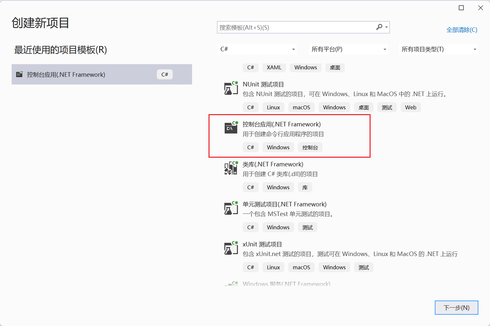
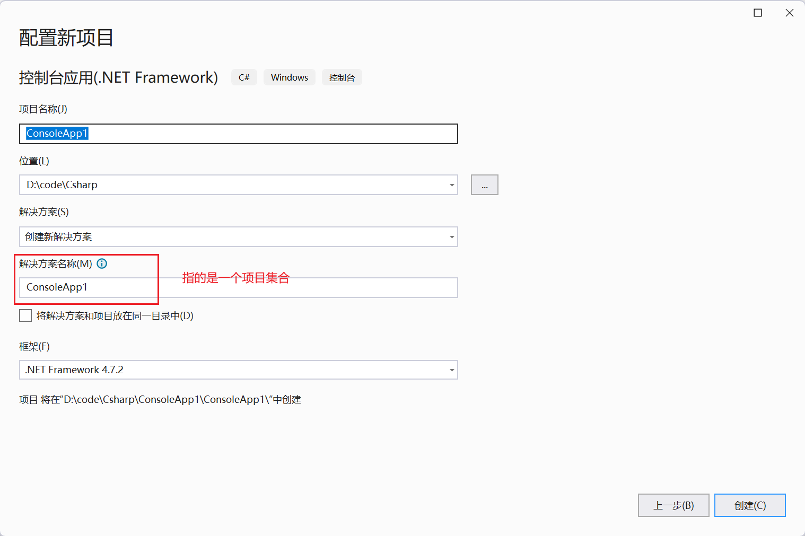

##  1.第一个程序

选择模板



确定项目名称



然后直接创建就可以。


代码

```c#
using System;
using System.Collections.Generic;
using System.Linq;
using System.Text;
using System.Threading.Tasks;

namespace test1
{
    internal class Program
    {
        static void Main(string[] args)
        {
            Console.WriteLine("hello word");
            Console.ReadKey();
        }
    }
}
```

运行结果


##  2.代码结构

C# 文件的后缀为 **.cs**。

以下创建一个 **test.cs** 文件，文件包含了可以打印出 "Hello World" 的简单代码：

```c#
using System;
namespace HelloWorldApplication
{
   class HelloWorld
   {
      static void Main(string[] args)
      {
         /* 我的第一个 C# 程序*/
         Console.WriteLine("Hello World");
         Console.ReadKey();
      }
   }
}
```

一个 C# 程序主要包括以下部分：

- 命名空间声明（Namespace declaration）:命名空间是一种把相关的类型声明分组并命名的方法。既然程序是一组相关的类型声明，那么通常会把程序声明在你创建的命名空间内部。一个 **namespace** 里包含了一系列的类。*HelloWorldApplication* 命名空间包含了类 *HelloWorld*。
- 一个 class：类一般包含多个方法。方法定义了类的行为。在这里，*HelloWorld* 类只有一个 **Main** 方法。
- Class 方法：class中的方法
- Class 属性
- 一个 Main 方法：程序执行入口
- 语句（Statements）& 表达式（Expressions）
- 注释

##  访问级别

类有两种访问级别：

- public：可以被任何程序集中的代码访问
- internal：默认的访问级别，仅可以被自己所在的程序集中的类看到

类中的成员有5种访问级别：

- 私有的（private）：只能被自己类中的成员访问，不能被其他的类访问，即使是继承自它的类也不行
- 公有的（public）：所有的类都可以自由访问
- 受保护的（protected）：和private类似，唯一不同的是，它允许该类的派生类来访问
- 内部的（internal）：对程序集内部的所有类可见，对程序集外部的所有类不可见
- 受保护内部的（protected internal）：相当于internal与protected的并集，即对程序集内部的类可见，也对继承自该类的类可见。

##  3.变量

### 变量名称

变量不能以数字，C#关键字命名

### 变量类型

C#提供了16种预定义类型，包括13种简单类型和3种非简单类型

#### 值类型（Value types）

|  类型   | 描述                                 |                          范围                           | 默认值 |
| :-----: | :----------------------------------- | :-----------------------------------------------------: | :----- |
|  bool   | 布尔值                               |                      True 或 False                      | False  |
|  byte   | 8 位无符号整数                       |                        0 到 255                         | 0      |
|  char   | 16 位 Unicode 字符                   |                   U +0000 到 U +ffff                    | '\0'   |
| decimal | 128 位精确的十进制值，28-29 有效位数 |         (-7.9 x 1028 到 7.9 x 1028) / 100 到 28         | 0.0M   |
| double  | 64 位双精度浮点型                    |          (+/-)5.0 x 10-324 到 (+/-)1.7 x 10308          | 0.0D   |
|  float  | 32 位单精度浮点型                    |               -3.4 x 1038 到 + 3.4 x 1038               | 0.0F   |
|   int   | 32 位有符号整数类型                  |             -2,147,483,648 到 2,147,483,647             | 0      |
|  long   | 64 位有符号整数类型                  | -9,223,372,036,854,775,808 到 9,223,372,036,854,775,807 | 0L     |
|  sbyte  | 8 位有符号整数类型                   |                       -128 到 127                       | 0      |
|  short  | 16 位有符号整数类型                  |                    -32,768 到 32,767                    | 0      |
|  uint   | 32 位无符号整数类型                  |                   0 到 4,294,967,295                    | 0      |
|  ulong  | 64 位无符号整数类型                  |             0 到 18,446,744,073,709,551,615             | 0      |
| ushort  | 16 位无符号整数类型                  |                       0 到 65,535                       | 0      |

#### 引用类型（Reference types）

- object：所有其他类的基类
- string：多个Unicode字符组成的序列
- dynamic：在使用动态语言编写的程序集时使用

C#语言是静态的，但基于.NET的一些其他语言却是动态的，也就是说变量的类型直到运行时才会被解析。由于它们是.NET语言，所以C#程序需要使用这些语言编写的程序集。问题是程序集中的类型直到运行时才会被解析，而C#又要引用这样的类型并且需要在编译的时候解析类型。为了解决这个问题，有了dynamic关键字。

在编译时，编译器不会对dynamic类型的变量进行类型检查。相反，它将与该变量及该变量的操作有关的所有信息打包。在运行时会对这些信息进行检查，以确保它与变量所代表的实际类型保持一致性，否则将在运行时抛出异常。

#### 指针类型（Pointer types）

指针类型变量存储另一种类型的内存地址。C# 中的指针与 C 或 C++ 中的指针有相同的功能。

声明指针类型的语法：

```
type* identifier;
```

####  类型转换

```c#
namespace myStudy
{
    internal class Program
    {
        public static void Main(string[] args)
        {
            // Console.WriteLine("hello world");
            // Console.ReadKey();

            Console.WriteLine("请输入：");

            String str = Console.ReadLine();
            //
            // String num = str + 20;
			// 将string转为了int类型
            int num = int.Parse(str) + 20;
            Console.WriteLine("输出结果为:" + num.ToString());
        }
    }
}
```


##   3.输入输出

示例：

```c#
namespace myStudy
{
    internal class Program
    {
        public static void Main(string[] args)
        {
            // Console.WriteLine("hello world");
            // Console.ReadKey();

            Console.WriteLine("请输入：");

            String str = Console.ReadLine();

            String num = str + 20;
            Console.WriteLine("输出结果为:" + num);
        }
    }
}
```

使用console的write与read方法进行数据的控制台输入输出。

##  4.if判断

```c#
namespace myStudy
{
    internal class Program
    {
        public static void Main(string[] args)
        {
            Console.WriteLine("请输入：");

            string str = Console.ReadLine();
 
            if (str.Equals("aa"))
            {
                Console.WriteLine("input is aa");
            }
            else
            {
                Console.WriteLine("input not aa");
            }
            
            if (int.Parse(str) == 20)
            {
                Console.WriteLine("输入的是20");
            }
            else if (1 == 2)
            {
                Console.WriteLine("cc");
            }
            else
            {
                Console.WriteLine("输入的数据不是20");
            }
        }
    }
}
```

和Java的if使用类似

##  5.方法


#### C# 中定义方法

**使用和Java类似**

当定义一个方法时，从根本上说是在声明它的结构的元素。在 C# 中，定义方法的语法如下：

```
<Access Specifier> <Return Type> <Method Name>(Parameter List)
{
   Method Body
}
```

下面是方法的各个元素：

- **Access Specifier**：访问修饰符，这个决定了变量或方法对于另一个类的可见性。
- **Return type**：返回类型，一个方法可以返回一个值。返回类型是方法返回的值的数据类型。如果方法不返回任何值，则返回类型为 **void**。
- **Method name**：方法名称，是一个唯一的标识符，且是大小写敏感的。它不能与类中声明的其他标识符相同。
- **Parameter list**：参数列表，使用圆括号括起来，该参数是用来传递和接收方法的数据。参数列表是指方法的参数类型、顺序和数量。参数是可选的，也就是说，一个方法可能不包含参数。
- **Method body**：方法主体，包含了完成任务所需的指令集。


下面的代码片段显示一个函数 *FindMax*，它接受两个整数值，并返回两个中的较大值。它有 public 访问修饰符，所以它可以使用类的实例从类的外部进行访问。

```c#
class NumberManipulator
{
   public int FindMax(int num1, int num2)
   {
      /* 局部变量声明 */
      int result;

      if (num1 > num2)
         result = num1;
      else
         result = num2;

      return result;
   }
   ...
}
```

####  参数传递

当调用带有参数的方法时，您需要向方法传递参数。在 C# 中，有以下几种向方法传递参数的方式：

**参数类型总结：**

| 参数类型 | 修饰符 | 是否在声明时使用 | 是否在调用是使用 | 执行                                                 |
| -------- | ------ | ---------------- | ---------------- | ---------------------------------------------------- |
| 值参数   | 无     |                  |                  | 系统把实参的值复制给形参，二者在栈中位置不同         |
| 引用参数 | ref    | 是               | 是               | 形参是实参的别名，二者在栈中位置相同                 |
| 输出参数 | out    | 是               | 是               | 在读取输出参数前必须对其写入，除此之外和引用参数类似 |
| 参数数组 | params | 是               | 否               | 允许传递可变数目的实参到方法                         |

##### 值传递

Java中使用的类似

#####  引用参数

引用参数是一个对变量的**内存位置的引用**。当按引用传递参数时，与值参数不同的是，它不会为这些参数创建一个新的存储位置。引用参数表示与提供给方法的实际参数具有相同的内存位置。

在 C# 中，使用 **ref** 关键字声明引用参数。下面的实例演示了这点：

```c#
using System;
namespace CalculatorApplication
{
   class NumberManipulator
   {
      public void swap(ref int x, ref int y)
      {
         int temp;

         temp = x; /* 保存 x 的值 */
         x = y;    /* 把 y 赋值给 x */
         y = temp; /* 把 temp 赋值给 y */
       }
   
      static void Main(string[] args)
      {
         NumberManipulator n = new NumberManipulator();
         /* 局部变量定义 */
         int a = 100;
         int b = 200;

         Console.WriteLine("在交换之前，a 的值： {0}", a);
         Console.WriteLine("在交换之前，b 的值： {0}", b);

         /* 调用函数来交换值 */
         n.swap(ref a, ref b);

         Console.WriteLine("在交换之后，a 的值： {0}", a);
         Console.WriteLine("在交换之后，b 的值： {0}", b);
 
         Console.ReadLine();

      }
   }
}
```

当上面的代码被编译和执行时，它会产生下列结果：

```
在交换之前，a 的值：100
在交换之前，b 的值：200
在交换之后，a 的值：200
在交换之后，b 的值：100
```

结果表明，*swap* 函数内的值改变了，且这个改变可以在 *Main* 函数中反映出来。

#####  输出传递参数

return 语句可用于只从函数中返回一个值。但是，可以使用 **输出参数** 来从函数中返回两个值。输出参数会把方法输出的数据赋给自己，其他方面与引用参数相似。

```c#
using System;

namespace CalculatorApplication
{
   class NumberManipulator
   {
      public void getValue(out int x )
      {
         int temp = 5;
         x = temp;
      }
   
      static void Main(string[] args)
      {
         NumberManipulator n = new NumberManipulator();
         /* 局部变量定义 */
         int a = 100;
         
         Console.WriteLine("在方法调用之前，a 的值： {0}", a);
         
         /* 调用函数来获取值 */
         n.getValue(out a);

         Console.WriteLine("在方法调用之后，a 的值： {0}", a);
         Console.ReadLine();

      }
   }
}
```

当上面的代码被编译和执行时，它会产生下列结果：

```
在方法调用之前，a 的值： 100
在方法调用之后，a 的值： 5
```

提供给输出参数的变量不需要赋值。

当需要从一个参数没有指定初始值的方法中返回值时，输出参数特别有用。请看下面的实例，来理解这一点：

实例

```c#
using System;

namespace CalculatorApplication
{
   class NumberManipulator
   {
      public void getValues(out int x, out int y )
      {
          Console.WriteLine("请输入第一个值： ");
          x = Convert.ToInt32(Console.ReadLine());
          Console.WriteLine("请输入第二个值： ");
          y = Convert.ToInt32(Console.ReadLine());
      }
   
      static void Main(string[] args)
      {
         NumberManipulator n = new NumberManipulator();
         /* 局部变量定义 */
         int a , b;
         
         /* 调用函数来获取值 */
         n.getValues(out a, out b);

         Console.WriteLine("在方法调用之后，a 的值： {0}", a);
         Console.WriteLine("在方法调用之后，b 的值： {0}", b);
         Console.ReadLine();
      }
   }
}
```


当上面的代码被编译和执行时，它会产生下列结果（取决于用户输入）：

```
请输入第一个值：
7
请输入第二个值：
8
在方法调用之后，a 的值： 7
在方法调用之后，b 的值： 8
```

##### 参数数组

参数数组允许0个或多个实参对应一个特殊的形参,修饰符为params

```c#
//形参inVals可以代表0个或多个实参
void ListInts(params int[] inVals){

}
Copy
```

- 在参数列表中只能有一个参数数组，并且是列表中的最后一个
- 由参数数组表示的所有参数必须具有相同的类型

参数数组在方法声明中需要params修饰符，而在调用时不需要（不同于引用参数和输出参数，它们在以上两个地方都需要修饰符）

可以有如下两种方式为参数数组提供实参：

1. 用一个逗号分隔的该数据类型元素的列表,使用这种方法时，编译器做如下的事：

   - 接收实参列表，用它们在堆中创建并初始化一个数组

   - 把数组的引用作为形参保存在栈中

     ```c#
     ListInts(10, 20, 30)
     Copy
     ```

2. 用数组作为实参

   在这种情况下，编译器会直接使用传入的数组，也就是说栈中的形参指向内存中intArray的位置

   ```c#
   int[] intArray = {1, 2, 3};
   ListInts(intArray);
   ```

##### 命名参数

在使用命名参数时，需要在方法调用中包含参数名。而方法的声明无需任何改变

```
class MyClass{
    //方法中的参数声明一如平常
    public int Calc(int a, int b, int c){
        return a + b + c;
    }
    static void Main(){
        MyClass mc = new MyClass();
        int result = mc.Calc(c: 2, a: 4, b: 3);
    }
}
```

##### 可选参数

所谓可选参数就是在调用方法的时候可以包含这个参数，也可以忽略它。

```c#
class MyClass{
    //b为可选参数，默认值为3
    public int Calc(int a, int b = 3){
        return a + b;
    }
    static void Main(){
        MyClass mc = new MyClass();
        int ro = mc.Calc(5, 6);
        int r1 = mc.Calc(5);
        Console.WriteLine("{0}, {1}", ro, r1);
    }
}
```

上述代码会输出11，8

只要值类型的默认值在编译的时候可以确定，就可以使用值参数作为可选参数。而只有在默认值为null的时候，引用参数才可以作为可选参数。

总结下来，一个方法的声明中，参数要按照必填参数、可选参数、params参数的先后顺序声明。

可以忽略最后一个可选参数，或者最后n个可选参数，但是不可以随机选择省略任意的可选参数，省略必须从最后开始。


#### 栈帧

在调用方法的时候，内存从栈的顶部开始分配，保存和方法关联的一些数据项。这块内存叫做方法的栈帧

栈帧保存如下的内容：

- 返回地址

- 为参数分配的内存

- 各种和方法调用相关的其他管理数据项

  在方法调用的时候，整个栈帧都会压入栈。在方法退出的时候，整个栈帧都会从栈上弹出。

[](https://wyh317.github.io/img/栈帧.jpg)

##  6.循环

C# 提供了以下几种循环类型。点击链接查看每个类型的细节。

| 循环类型                                                     | 描述                                                         |
| :----------------------------------------------------------- | :----------------------------------------------------------- |
| [while 循环](https://www.runoob.com/csharp/csharp-while-loop.html) | 当给定条件为真时，重复语句或语句组。它会在执行循环主体之前测试条件。 |
| [for/foreach 循环](https://www.runoob.com/csharp/csharp-for-loop.html) | 多次执行一个语句序列，简化管理循环变量的代码。               |
| [do...while 循环](https://www.runoob.com/csharp/csharp-do-while-loop.html) | 除了它是在循环主体结尾测试条件外，其他与 while 语句类似。    |
| [嵌套循环](https://www.runoob.com/csharp/csharp-nested-loops.html) | 您可以在 while、for 或 do..while 循环内使用一个或多个循环。  |

**循环控制语句**

循环控制语句更改执行的正常序列。当执行离开一个范围时，所有在该范围中创建的自动对象都会被销毁。

C# 提供了下列的控制语句。点击链接查看每个语句的细节。

| 控制语句                                                     | 描述                                                         |
| :----------------------------------------------------------- | :----------------------------------------------------------- |
| [break 语句](https://www.runoob.com/csharp/csharp-break-statement.html) | 终止 **loop** 或 **switch** 语句，程序流将继续执行紧接着 loop 或 switch 的下一条语句。 |
| [continue 语句](https://www.runoob.com/csharp/csharp-continue-statement.html) | 跳过本轮循环，开始下一轮循环。                               |

###  while循环

C# 中 **while** 循环的语法：

```
while(condition)
{
   statement(s);
}
```

在这里，**statement(s)** 可以是一个单独的语句，也可以是几个语句组成的代码块。**condition** 可以是任意的表达式，当为任意非零值时都为真。当条件为真时执行循环。

**流程图**


示例

```c#
using System;

namespace Loops
{
    
    class Program
    {
        static void Main(string[] args)
        {
            /* 局部变量定义 */
            int a = 10;

            /* while 循环执行 */
            while (a < 20)
            {
                Console.WriteLine("a 的值： {0}", a);
                a++;
            }
            Console.ReadLine();
        }
    }
}
```

###  for循环

C# 中 **for** 循环的语法：

```
for ( init; condition; increment )
{
   statement(s);
}
```

下面是 for 循环的控制流：

1. **init** 会首先被执行，且只会执行一次。这一步允许您声明并初始化任何循环控制变量。您也可以不在这里写任何语句，只要有一个分号出现即可。
2. 接下来，会判断 **condition**。如果为真，则执行循环主体。如果为假，则不执行循环主体，且控制流会跳转到紧接着 for 循环的下一条语句。
3. 在执行完 for 循环主体后，控制流会跳回上面的 **increment** 语句。该语句允许您更新循环控制变量。该语句可以留空，只要在条件后有一个分号出现即可。
4. 条件再次被判断。如果为真，则执行循环，这个过程会不断重复（循环主体，然后增加步值，再然后重新判断条件）。在条件变为假时，for 循环终止。

**流程图**


示例

```c#
using System;

namespace Loops
{
    
    class Program
    {
        static void Main(string[] args)
        {
            /* for 循环执行 */
            for (int a = 10; a < 20; a = a + 1)
            {
                Console.WriteLine("a 的值： {0}", a);
            }
            Console.ReadLine();
        }
    }
}
```

####  foreach


C# 也支持 foreach 循环，使用 foreach 可以迭代数组或者一个集合对象。

C# 的 foreach 循环可以用来遍历集合类型，例如数组、列表、字典等。它是一个简化版的 for 循环，使得代码更加简洁易读。

以下是 foreach 循环的语法：

```
foreach (var item in collection)
{
    // 循环
}
```

collection 是要遍历的集合，item 是当前遍历到的元素。

示例

```c#
using System;
using System.Collections.Generic;

class Program
{
    static void Main(string[] args)
    {
        // 创建一个字符串列表
        List<string> myStrings = new List<string>();

        // 向列表添加一些字符串元素
        myStrings.Add("Google");
        myStrings.Add("Runoob");
        myStrings.Add("Taobao");

        // 使用 foreach 循环遍历列表中的元素
        foreach (string s in myStrings)
        {
            Console.WriteLine(s);
        }

        // 等待用户按下任意键后退出程序
        Console.ReadKey();
    }
}
```

##  7.类

类成员包括数据成员（保存数据）和函数成员（执行代码）
其中数据成员包括：

- 字段
- 常量（用const修饰，包括本地常量和成员常量，本地常量声明在方法内，成员常量声明在类中）

> 常量
>
> 成员常量表现的和静态量相似，但唯一不同的是，成员常量没有自己的存储位置，而是在编译时被编译器替换。此外，不能将成员常量声明为static。与const有着相同作用的是readonly，不同的是，const字段只能在字段的声明语句中初始化，而readonly也可以在构造函数中初始化。因此const字段的值必须在编译时确定，而randonly字段的值可以在运行时决定。


函数成员包括：

- 方法
- 属性
- 构造函数、析构函数
- 索引

###  方法

就是一个简单的方法

```c#
    class MyClass
    {
        private int a = 0;


        public void myInfo()
        {
            Console.WriteLine("this is my class");
        }
    }
```

### 属性

属性是一组称为访问器的方法（set访问器为属性赋值，get访问器从属性中获取值）。它是类中的函数成员，因此不需为属性分配内存。

写入和读取属性的代码和访问字段一样。属性会根据是写入还是读取，来隐式地调用适当的访问器

属性通常和字段关联，一种常见的方式是在类中将字段声明为private以封装字段，并声明一个public属性用get和set访问器来控制对该字段的访问。和属性关联的字段成为后备字段

```c#
    class MyClass
    {
        private int realvale = 0;

        public int MyValue
        {
            set
            {
                realvale = value;
            }

            get
            {
                return realvale;
            }
        }
    }
```

对外访问接口，类似于java的get与set方法只不过属性将原始参数给屏蔽了。属性可以只有单get或单set方法。

```c#
class RightTriangle{
    public double A = 3;
    public double B = 4;
    //只读属性，计算直角三角形的第三边
    public double Hypotenuse{
        get{
            return Math.Sqrt((A * A) + (B * B));
        }
    }
}

class Program{
    static void Main(){
        RightTriangle c = new RightTriangle();
        Console.WriteLine("Hypotenuse: {0}", c.Hypotenuse);
    }
}

上述代码将输出5
```

###  构造函数

使用方式与Java类似

```c#
using System;
namespace LineApplication
{
   class Line
   {
      private double length;   // 线条的长度
      public Line()
      {
         Console.WriteLine("对象已创建");
      }

      public void setLength( double len )
      {
         length = len;
      }
      public double getLength()
      {
         return length;
      }

      static void Main(string[] args)
      {
         Line line = new Line();    
         // 设置线条长度
         line.setLength(6.0);
         Console.WriteLine("线条的长度： {0}", line.getLength());
         Console.ReadKey();
      }
   }
}
```

###  C# 中的析构函数

类的 **析构函数** 是类的一个特殊的成员函数，当类的对象超出范围时执行。

析构函数的名称是在类的名称前加上一个波浪形（~）作为前缀，它不返回值，也不带任何参数。

析构函数用于在结束程序（比如关闭文件、释放内存等）之前释放资源。析构函数不能继承或重载。

下面的实例说明了析构函数的概念：

```c#
using System;
namespace LineApplication
{
   class Line
   {
      private double length;   // 线条的长度
      public Line()  // 构造函数
      {
         Console.WriteLine("对象已创建");
      }
      ~Line() //析构函数
      {
         Console.WriteLine("对象已删除");
      }

      public void setLength( double len )
      {
         length = len;
      }
      public double getLength()
      {
         return length;
      }

      static void Main(string[] args)
      {
         Line line = new Line();
         // 设置线条长度
         line.setLength(6.0);
         Console.WriteLine("线条的长度： {0}", line.getLength());           
      }
   }
}
```

当上面的代码被编译和执行时，它会产生下列结果：

```
对象已创建
线条的长度： 6
对象已删除
```

类似与Java中Object类的finalize()方法。

###  C# 类的静态成员

我们可以使用 **static** 关键字把类成员定义为静态的。当我们声明一个类成员为静态时，意味着无论有多少个类的对象被创建，只会有一个该静态成员的副本。

关键字 **static** 意味着类中只有一个该成员的实例。静态变量用于定义常量，因为它们的值可以通过直接调用类而不需要创建类的实例来获取。静态变量可在成员函数或类的定义外部进行初始化。你也可以在类的定义内部初始化静态变量。

下面的实例演示了**静态变量**的用法：

```c#
using System;
namespace StaticVarApplication
{
    class StaticVar
    {
       public static int num;
        public void count()
        {
            num++;
        }
        public int getNum()
        {
            return num;
        }
    }
    class StaticTester
    {
        static void Main(string[] args)
        {
            StaticVar s1 = new StaticVar();
            StaticVar s2 = new StaticVar();
            s1.count();
            s1.count();
            s1.count();
            s2.count();
            s2.count();
            s2.count();         
            Console.WriteLine("s1 的变量 num： {0}", s1.getNum());
            Console.WriteLine("s2 的变量 num： {0}", s2.getNum());
            Console.ReadKey();
        }
    }
}
```

当上面的代码被编译和执行时，它会产生下列结果：

```
s1 的变量 num： 6
s2 的变量 num： 6
```

###  索引器

可以认为索引器是为类的多个数据成员提供get和set访问器的属性

```c#
class Class1{
    private int Temp0;
    private int Temp1;
    //和属性不同的是，索引器有参数（索引参数），并且使用this而不是名称
    //索引器声明
    public int this [int index]{    
        get{
            return (index == 0) ? Temp0 : Temp1;
        }
        set{
            if(index == 0)
                Temp0 = value;   //value为set访问器的隐式变量
            else
                Temp1 = value;
        }
    }
}

class Example{
    static void Main(){
        Class1 a = new Class1();
        //使用索引参数0或1读取数据成员
        Console.WriteLine("T0: {0}, T1 : {1}", a[0], a[1]);
        //使用索引参数0或1对数据成员进行写入
        a[0] = 15;
        a[1] = 20;
        Console.WriteLine("T0: {0}, T1 : {1}", a[0], a[1]);
    }
}

以上代码会输出：
T0: 0, T1: 0
T0: 15, T1: 20
```

类似map的功能

```c#
using System;
namespace IndexerApplication
{
   class IndexedNames
   {
      private string[] namelist = new string[size];
      static public int size = 10;
      public IndexedNames()
      {
         for (int i = 0; i < size; i++)
         {
          namelist[i] = "N. A.";
         }
      }
      public string this[int index]
      {
         get
         {
            string tmp;

            if( index >= 0 && index <= size-1 )
            {
               tmp = namelist[index];
            }
            else
            {
               tmp = "";
            }

            return ( tmp );
         }
         set
         {
            if( index >= 0 && index <= size-1 )
            {
               namelist[index] = value;
            }
         }
      }
      public int this[string name]
      {
         get
         {
            int index = 0;
            while(index < size)
            {
               if (namelist[index] == name)
               {
                return index;
               }
               index++;
            }
            return index;
         }

      }

      static void Main(string[] args)
      {
         IndexedNames names = new IndexedNames();
         names[0] = "Zara";
         names[1] = "Riz";
         names[2] = "Nuha";
         names[3] = "Asif";
         names[4] = "Davinder";
         names[5] = "Sunil";
         names[6] = "Rubic";
         // 使用带有 int 参数的第一个索引器
         for (int i = 0; i < IndexedNames.size; i++)
         {
            Console.WriteLine(names[i]);
         }
         // 使用带有 string 参数的第二个索引器
         Console.WriteLine(names["Nuha"]);
         Console.ReadKey();
      }
   }
}
```

### 抽象成员

类似于Java中的抽象方法。它使用abstract标记，并且必须是函数成员（方法、属性、事件、索引）。不能有实现代码块，抽象成员的实现用分号表示。即每一个抽象成员的声明后都要带一个分号

如：以下声明了两个抽象成员，一个名为PrintStuff的抽象方法和一个名为MyProperty的抽象属性

```
abstract public void PrintStuff(string s);
abstract public int MyProperty{
    get;    //分号代替实现
    set;
}
Copy
```

- 抽象类：只能被继承，不能用来创建实例，用abstract修饰符标注
- 密封类：与抽象类相反，只能被用来创建实例，不能被继承。用sealed修饰符标注

###  继承

c#的继承机制与Java相似


##  8.异常处理

异常是在程序执行期间出现的问题。C# 中的异常是对程序运行时出现的特殊情况的一种响应，比如尝试除以零。

异常提供了一种把程序控制权从某个部分转移到另一个部分的方式。C# 异常处理时建立在四个关键词之上的：**try**、**catch**、**finally** 和 **throw**。

- **try**：一个 try 块标识了一个将被激活的特定的异常的代码块。后跟一个或多个 catch 块。
- **catch**：程序通过异常处理程序捕获异常。catch 关键字表示异常的捕获。
- **finally**：finally 块用于执行给定的语句，不管异常是否被抛出都会执行。例如，如果您打开一个文件，不管是否出现异常文件都要被关闭。
- **throw**：当问题出现时，程序抛出一个异常。使用 throw 关键字来完成。

### 语法

假设一个块将出现异常，一个方法使用 try 和 catch 关键字捕获异常。try/catch 块内的代码为受保护的代码，使用 try/catch 语法如下所示：

```c#
try
{
   // 引起异常的语句
}
catch( ExceptionName e1 )
{
   // 错误处理代码
}
catch( ExceptionName e2 )
{
   // 错误处理代码
}
catch( ExceptionName eN )
{
   // 错误处理代码
}
finally
{
   // 要执行的语句
}
```


您可以列出多个 catch 语句捕获不同类型的异常，以防 try 块在不同的情况下生成多个异常。


###  C# 中的异常类

C# 异常是使用类来表示的。C# 中的异常类主要是直接或间接地派生于 **System.Exception** 类。**System.ApplicationException** 和 **System.SystemException** 类是派生于 System.Exception 类的异常类。

**System.ApplicationException** 类支持由应用程序生成的异常。所以程序员定义的异常都应派生自该类。

**System.SystemException** 类是所有预定义的系统异常的基类。

下表列出了一些派生自 System.SystemException 类的预定义的异常类：

| 异常类                            | 描述                                           |
| :-------------------------------- | :--------------------------------------------- |
| System.IO.IOException             | 处理 I/O 错误。                                |
| System.IndexOutOfRangeException   | 处理当方法指向超出范围的数组索引时生成的错误。 |
| System.ArrayTypeMismatchException | 处理当数组类型不匹配时生成的错误。             |
| System.NullReferenceException     | 处理当依从一个空对象时生成的错误。             |
| System.DivideByZeroException      | 处理当除以零时生成的错误。                     |
| System.InvalidCastException       | 处理在类型转换期间生成的错误。                 |
| System.OutOfMemoryException       | 处理空闲内存不足生成的错误。                   |
| System.StackOverflowException     | 处理栈溢出生成的错误。                         |

###  创建用户自定义异常

用户自定义的异常类是派生自 **ApplicationException** 类.

```c#
using System;
namespace UserDefinedException
{
   class TestTemperature
   {
      static void Main(string[] args)
      {
         Temperature temp = new Temperature();
         try
         {
            temp.showTemp();
         }
         catch(TempIsZeroException e)
         {
            Console.WriteLine("TempIsZeroException: {0}", e.Message);
         }
         Console.ReadKey();
      }
   }
}
public class TempIsZeroException: ApplicationException
{
   public TempIsZeroException(string message): base(message)
   {
   }
}
public class Temperature
{
   int temperature = 0;
   public void showTemp()
   {
      if(temperature == 0)
      {
         throw (new TempIsZeroException("Zero Temperature found"));
      }
      else
      {
         Console.WriteLine("Temperature: {0}", temperature);
      }
   }
}
```

## 9.操作符重载


如果面对一个用户自定义的类或结构，运算符就会不知道如何取处理它。运算符重载允许用户自己定义C#运算符来操作自定义类型的操作数。

- 为类或结构重载一个运算符x，可以声明一个名称为`operator x`的方法并实现它的行为（如`operator +`和`operator -`等）。一元运算符的重载方法带有一个单独的class或struct类型的参数，二元运算符重载的方法带有两个参数，其中至少有一个是class或struct类型。
- 声明必须同时使用static和public的修饰符
- 运算符必须要是要操作的类或结构的成员

如下代码声明了LimitedInt类的两个重载的运算符：一个是加运算符，另一个是取负运算符

```
class LimitedInt Return{
    public static LimitedInt operator + (LimitedInt x, double y){
        LimitedInt li = new LimitedInt();
        li.TheValue = x.TheValue + (int)y;
        return li;
    }

    public static LimitedInt operator - (LimitedInt x){
        LimitedInt li = new LimitedInt();
        li.TheValue = 0;
        return li;
    }
}
```

### 可重载和不可重载运算符

下表描述了 C# 中运算符重载的能力：

| 运算符                                | 描述                                         |
| :------------------------------------ | :------------------------------------------- |
| +, -, !, ~, ++, --                    | 这些一元运算符只有一个操作数，且可以被重载。 |
| +, -, *, /, %                         | 这些二元运算符带有两个操作数，且可以被重载。 |
| ==, !=, <, >, <=, >=                  | 这些比较运算符可以被重载。                   |
| &&, \|\|                              | 这些条件逻辑运算符不能被直接重载。           |
| +=, -=, *=, /=, %=                    | 这些赋值运算符不能被重载。                   |
| =, ., ?:, ->, new, is, sizeof, typeof | 这些运算符不能被重载。                       |

针对上述讨论，让我们扩展上面的实例，重载更多的运算符：

```c#
using System;

namespace OperatorOvlApplication
{
    class Box
    {
       private double length;      // 长度
       private double breadth;     // 宽度
       private double height;      // 高度
      
       public double getVolume()
       {
         return length * breadth * height;
       }
      public void setLength( double len )
      {
          length = len;
      }

      public void setBreadth( double bre )
      {
          breadth = bre;
      }

      public void setHeight( double hei )
      {
          height = hei;
      }
      // 重载 + 运算符来把两个 Box 对象相加
      public static Box operator+ (Box b, Box c)
      {
          Box box = new Box();
          box.length = b.length + c.length;
          box.breadth = b.breadth + c.breadth;
          box.height = b.height + c.height;
          return box;
      }
      
      public static bool operator == (Box lhs, Box rhs)
      {
          bool status = false;
          if (lhs.length == rhs.length && lhs.height == rhs.height 
             && lhs.breadth == rhs.breadth)
          {
              status = true;
          }
          return status;
      }
      public static bool operator !=(Box lhs, Box rhs)
      {
          bool status = false;
          if (lhs.length != rhs.length || lhs.height != rhs.height 
              || lhs.breadth != rhs.breadth)
          {
              status = true;
          }
          return status;
      }
      public static bool operator <(Box lhs, Box rhs)
      {
          bool status = false;
          if (lhs.length < rhs.length && lhs.height 
              < rhs.height && lhs.breadth < rhs.breadth)
          {
              status = true;
          }
          return status;
      }

      public static bool operator >(Box lhs, Box rhs)
      {
          bool status = false;
          if (lhs.length > rhs.length && lhs.height 
              > rhs.height && lhs.breadth > rhs.breadth)
          {
              status = true;
          }
          return status;
      }

      public static bool operator <=(Box lhs, Box rhs)
      {
          bool status = false;
          if (lhs.length <= rhs.length && lhs.height 
              <= rhs.height && lhs.breadth <= rhs.breadth)
          {
              status = true;
          }
          return status;
      }

      public static bool operator >=(Box lhs, Box rhs)
      {
          bool status = false;
          if (lhs.length >= rhs.length && lhs.height 
             >= rhs.height && lhs.breadth >= rhs.breadth)
          {
              status = true;
          }
          return status;
      }
      public override string ToString()
      {
          return String.Format("({0}, {1}, {2})", length, breadth, height);
      }
   
   }
    
   class Tester
   {
      static void Main(string[] args)
      {
        Box Box1 = new Box();          // 声明 Box1，类型为 Box
        Box Box2 = new Box();          // 声明 Box2，类型为 Box
        Box Box3 = new Box();          // 声明 Box3，类型为 Box
        Box Box4 = new Box();
        double volume = 0.0;   // 体积

        // Box1 详述
        Box1.setLength(6.0);
        Box1.setBreadth(7.0);
        Box1.setHeight(5.0);

        // Box2 详述
        Box2.setLength(12.0);
        Box2.setBreadth(13.0);
        Box2.setHeight(10.0);

       // 使用重载的 ToString() 显示两个盒子
        Console.WriteLine("Box1： {0}", Box1.ToString());
        Console.WriteLine("Box2： {0}", Box2.ToString());
        
        // Box1 的体积
        volume = Box1.getVolume();
        Console.WriteLine("Box1 的体积： {0}", volume);

        // Box2 的体积
        volume = Box2.getVolume();
        Console.WriteLine("Box2 的体积： {0}", volume);

        // 把两个对象相加
        Box3 = Box1 + Box2;
        Console.WriteLine("Box3： {0}", Box3.ToString());
        // Box3 的体积
        volume = Box3.getVolume();
        Console.WriteLine("Box3 的体积： {0}", volume);

        //comparing the boxes
        if (Box1 > Box2)
          Console.WriteLine("Box1 大于 Box2");
        else
          Console.WriteLine("Box1 不大于 Box2");
        if (Box1 < Box2)
          Console.WriteLine("Box1 小于 Box2");
        else
          Console.WriteLine("Box1 不小于 Box2");
        if (Box1 >= Box2)
          Console.WriteLine("Box1 大于等于 Box2");
        else
          Console.WriteLine("Box1 不大于等于 Box2");
        if (Box1 <= Box2)
          Console.WriteLine("Box1 小于等于 Box2");
        else
          Console.WriteLine("Box1 不小于等于 Box2");
        if (Box1 != Box2)
          Console.WriteLine("Box1 不等于 Box2");
        else
          Console.WriteLine("Box1 等于 Box2");
        Box4 = Box3;
        if (Box3 == Box4)
          Console.WriteLine("Box3 等于 Box4");
        else
          Console.WriteLine("Box3 不等于 Box4");

        Console.ReadKey();
      }
    }
}
```

## 10.C# 结构体（Struct）

在 C# 中，结构体是值类型数据结构。它使得一个单一变量可以存储各种数据类型的相关数据。

```c#
using System;
using System.Text;
     
struct Books
{
   public string title;
   public string author;
   public string subject;
   public int book_id;
};  

public class testStructure
{
   public static void Main(string[] args)
   {

      Books Book1;        /* 声明 Book1，类型为 Books */
      Books Book2;        /* 声明 Book2，类型为 Books */

      /* book 1 详述 */
      Book1.title = "C Programming";
      Book1.author = "Nuha Ali"; 
      Book1.subject = "C Programming Tutorial";
      Book1.book_id = 6495407;

      /* book 2 详述 */
      Book2.title = "Telecom Billing";
      Book2.author = "Zara Ali";
      Book2.subject =  "Telecom Billing Tutorial";
      Book2.book_id = 6495700;

      /* 打印 Book1 信息 */
      Console.WriteLine( "Book 1 title : {0}", Book1.title);
      Console.WriteLine("Book 1 author : {0}", Book1.author);
      Console.WriteLine("Book 1 subject : {0}", Book1.subject);
      Console.WriteLine("Book 1 book_id :{0}", Book1.book_id);

      /* 打印 Book2 信息 */
      Console.WriteLine("Book 2 title : {0}", Book2.title);
      Console.WriteLine("Book 2 author : {0}", Book2.author);
      Console.WriteLine("Book 2 subject : {0}", Book2.subject);
      Console.WriteLine("Book 2 book_id : {0}", Book2.book_id);       

      Console.ReadKey();

   }
}
```

### C# 结构的特点

您已经用了一个简单的名为 Books 的结构。在 C# 中的结构与传统的 C 或 C++ 中的结构不同。C# 中的结构有以下特点：

- 结构可带有方法、字段、索引、属性、运算符方法和事件。
- 结构可定义构造函数，但不能定义析构函数。但是，您不能为结构定义无参构造函数。无参构造函数(默认)是自动定义的，且不能被改变。
- 与类不同，结构不能继承其他的结构或类。
- 结构不能作为其他结构或类的基础结构。
- 结构可实现一个或多个接口。
- 结构成员不能指定为 abstract、virtual 或 protected。
- 当您使用 **New** 操作符创建一个结构对象时，会调用适当的构造函数来创建结构。与类不同，结构可以不使用 New 操作符即可被实例化。
- 如果不使用 New 操作符，只有在所有的字段都被初始化之后，字段才被赋值，对象才被使用。

### 类 vs 结构

类和结构有以下几个基本的不同点：

- 类是引用类型，结构是值类型。
- 结构不支持继承。
- 结构不能声明默认的构造函数。

C# 中结构类型和类类型在语法上非常相似，他们都是一种数据结构，都可以包括数据成员和方法成员。

**结构和类的区别：**

- 1、结构是值类型，它在栈中分配空间；而类是引用类型，它在堆中分配空间，栈中保存的只是引用。
- 2、结构类型直接存储成员数据，让其他类的数据位于堆中，位于栈中的变量保存的是指向堆中数据对象的引用。

C# 中的简单类型，如int、double、bool等都是结构类型。如果需要的话，甚至可以使用结构类型结合运算符运算重载，再为 C# 语言创建出一种新的值类型来。

由于结构是值类型，并且直接存储数据，因此在一个对象的主要成员为数据且数据量不大的情况下，使用结构会带来更好的性能。

因为结构是值类型，因此在为结构分配内存，或者当结构超出了作用域被删除时，性能会非常好，因为他们将内联或者保存在堆栈中。当把一个结构类型的变量赋值给另一个结构时，对性能的影响取决于结构的大小，如果结构的数据成员非常多而且复杂，就会造成损失，接下来使用一段代码来说明这个问题。

结构和类的适用场合分析：

-  1、当堆栈的空间很有限，且有大量的逻辑对象时，创建类要比创建结构好一些；
-  2、对于点、矩形和颜色这样的轻量对象，假如要声明一个含有许多个颜色对象的数组，则CLR需要为每个对象分配内存，在这种情况下，使用结构的成本较低；
- 3、在表现抽象和多级别的对象层次时，类是最好的选择，因为结构不支持继承。
- 4、大多数情况下，目标类型只是含有一些数据，或者以数据为主。

重写上面的构造体

```c#
using System;
using System.Text;
     
struct Books
{
   private string title;
   private string author;
   private string subject;
   private int book_id;
   public void setValues(string t, string a, string s, int id)
   {
      title = t;
      author = a;
      subject = s;
      book_id =id; 
   }
   public void display()
   {
      Console.WriteLine("Title : {0}", title);
      Console.WriteLine("Author : {0}", author);
      Console.WriteLine("Subject : {0}", subject);
      Console.WriteLine("Book_id :{0}", book_id);
   }

};  

public class testStructure
{
   public static void Main(string[] args)
   {

      Books Book1 = new Books(); /* 声明 Book1，类型为 Books */
      Books Book2 = new Books(); /* 声明 Book2，类型为 Books */

      /* book 1 详述 */
      Book1.setValues("C Programming",
      "Nuha Ali", "C Programming Tutorial",6495407);

      /* book 2 详述 */
      Book2.setValues("Telecom Billing",
      "Zara Ali", "Telecom Billing Tutorial", 6495700);

      /* 打印 Book1 信息 */
      Book1.display();

      /* 打印 Book2 信息 */
      Book2.display(); 

      Console.ReadKey();

   }
}
```

## 11.C# 可空类型（Nullable）

### C# 单问号 ? 与 双问号 ??

**?** 单问号用于对 **int、double、bool** 等无法直接赋值为 null 的数据类型进行 null 的赋值，意思是这个数据类型是 Nullable 类型的。

```
int? i = 3;
```

等同于：

```
Nullable<int> i = new Nullable<int>(3);
int i; //默认值0
int? ii; //默认值null
```

**??** 双问号用于判断一个变量在为 null 的时候返回一个指定的值。

### C# 可空类型（Nullable）

C# 提供了一个特殊的数据类型，**nullable** 类型（可空类型），可空类型可以表示其基础值类型正常范围内的值，再加上一个 null 值。

例如，Nullable< Int32 >，读作"可空的 Int32"，可以被赋值为 -2,147,483,648 到 2,147,483,647 之间的任意值，也可以被赋值为 null 值。类似的，Nullable< bool > 变量可以被赋值为 true 或 false 或 null。

在处理数据库和其他包含可能未赋值的元素的数据类型时，将 null 赋值给数值类型或布尔型的功能特别有用。例如，数据库中的布尔型字段可以存储值 true 或 false，或者，该字段也可以未定义。

声明一个 **nullable** 类型（可空类型）的语法如下：

```
< data_type> ? <variable_name> = null;
```

示例

```c#
using System;
namespace CalculatorApplication
{
   class NullablesAtShow
   {
      static void Main(string[] args)
      {
         int? num1 = null;
         int? num2 = 45;
         double? num3 = new double?();
         double? num4 = 3.14157;
         
         bool? boolval = new bool?();

         // 显示值
         
         Console.WriteLine("显示可空类型的值： {0}, {1}, {2}, {3}", 
                            num1, num2, num3, num4);
         Console.WriteLine("一个可空的布尔值： {0}", boolval);
         Console.ReadLine();

      }
   }
}
```

当上面的代码被编译和执行时，它会产生下列结果：

```
显示可空类型的值： , 45,  , 3.14157
一个可空的布尔值：
```

### Null 合并运算符（ ?? ）

Null 合并运算符用于定义可空类型和引用类型的默认值。Null 合并运算符为类型转换定义了一个预设值，以防可空类型的值为 Null。Null 合并运算符把操作数类型隐式转换为另一个可空（或不可空）的值类型的操作数的类型。

如果第一个操作数的值为 null，则运算符返回第二个操作数的值，否则返回第一个操作数的值。

```c#
using System;
namespace CalculatorApplication
{
   class NullablesAtShow
   {
         
      static void Main(string[] args)
      {
         
         double? num1 = null;
         double? num2 = 3.14157;
         double num3;
         num3 = num1 ?? 5.34;      // num1 如果为空值则返回 5.34
         Console.WriteLine("num3 的值： {0}", num3);
         num3 = num2 ?? 5.34;
         Console.WriteLine("num3 的值： {0}", num3);
         Console.ReadLine();

      }
   }
}
```

当上面的代码被编译和执行时，它会产生下列结果：

```
num3 的值： 5.34
num3 的值： 3.14157
```

**??** 可以理解为三元运算符的简化形式：

```
num3 = num1 ?? 5.34;
num3 = (num1 == null) ? 5.34 : num1;
```