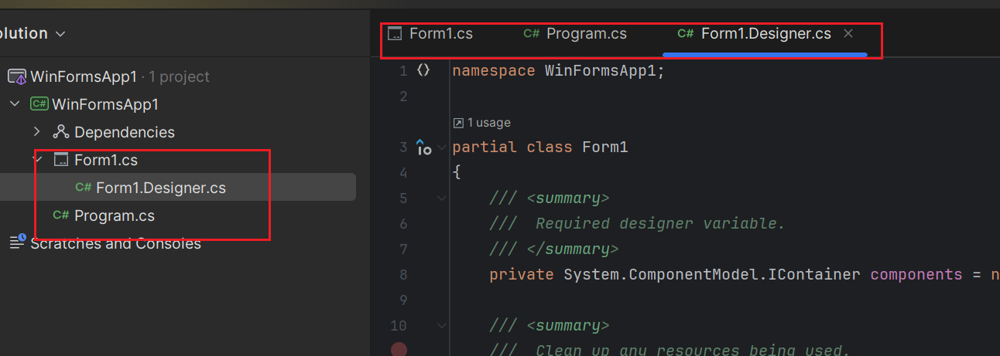
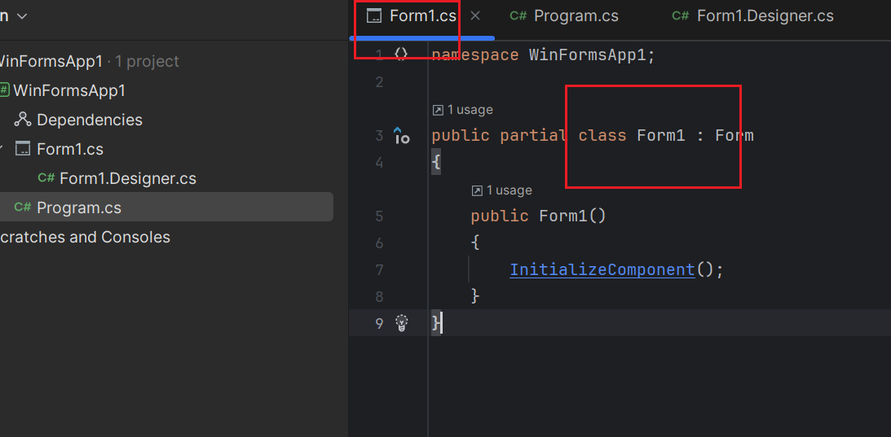
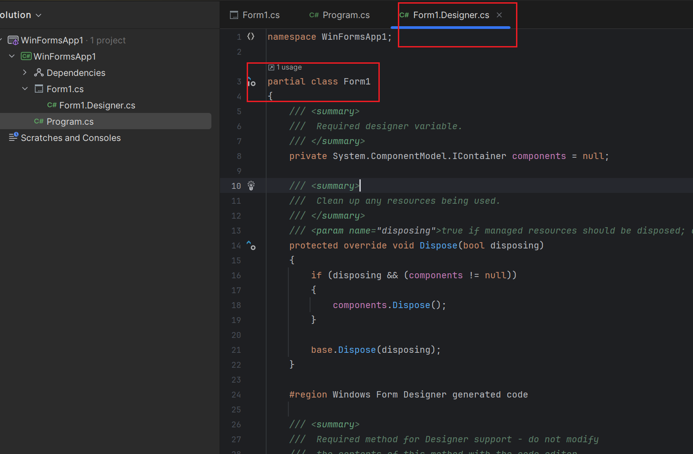
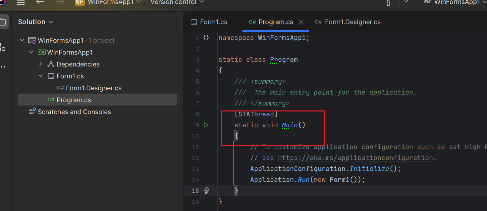
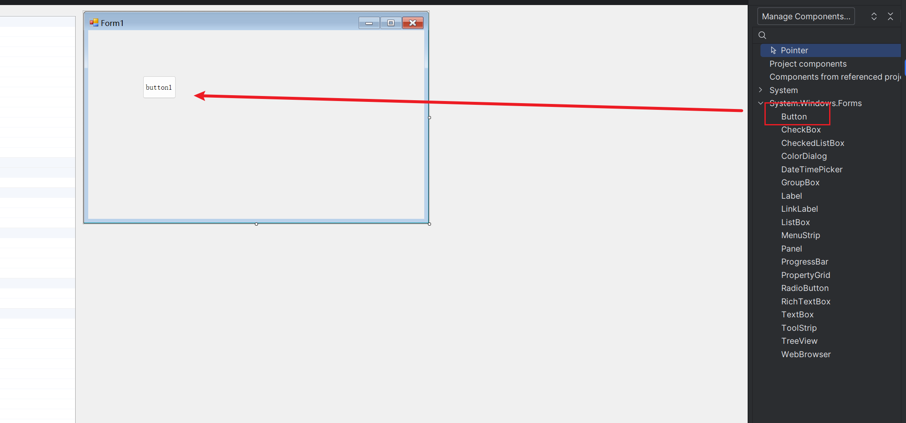
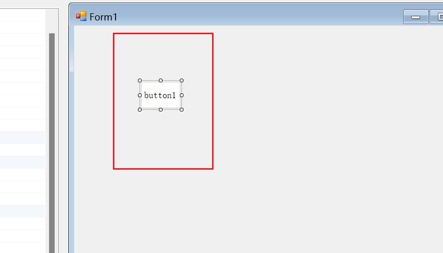
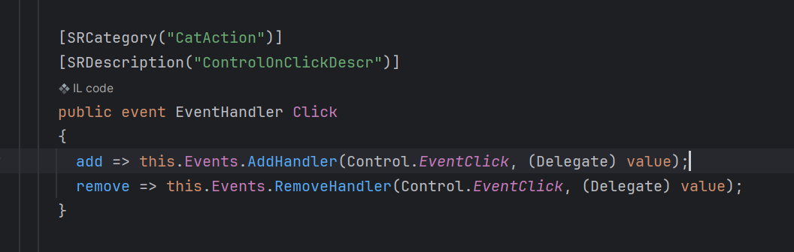
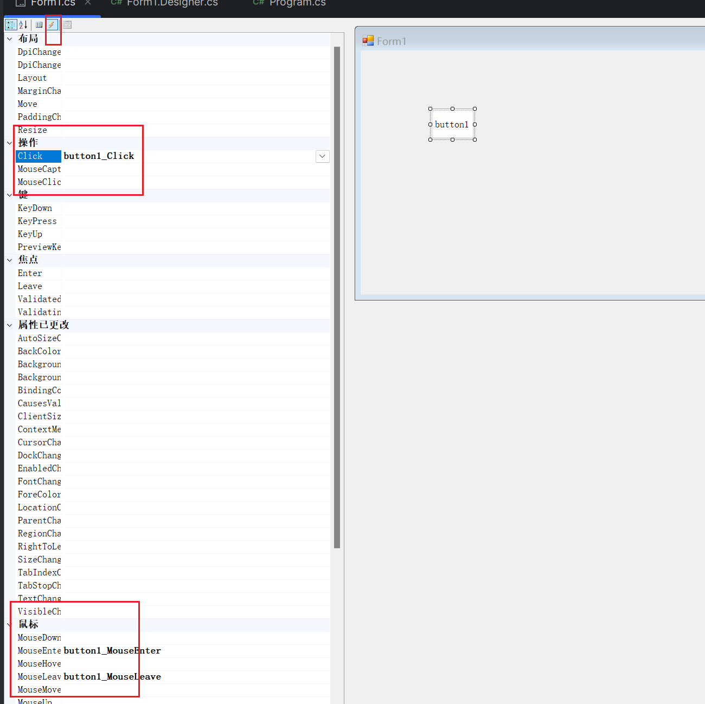
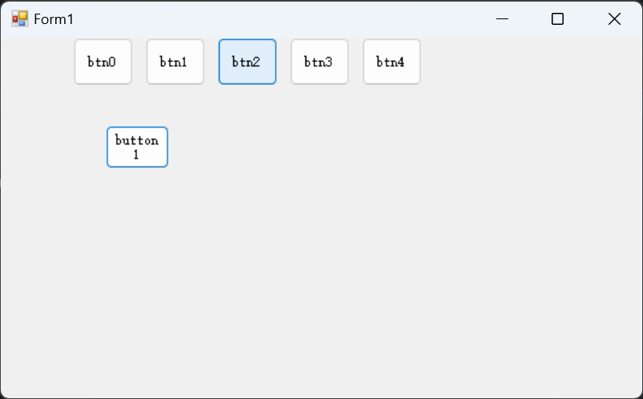
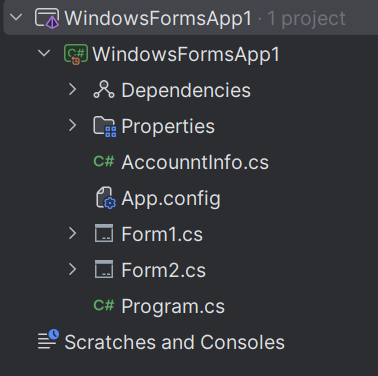

# 1.第一个程序


winform的项目结构



分部类C#中可以在不同地方声明相同的类

比如

在form1.cs中声明了form1，



这个类在这里也被声明了。

因为这是使用partial把一个类的声明分开写在了两个地方，在编译时会把不同地方的相同类编译在一起。

### 程序执行入口



在program中的main方法是该程序的执行入口。

# 2.添加一个button

添加button两种方式

### 代码添加

```c#
private void InitializeComponent()
{
    this.button1 = new System.Windows.Forms.Button();
    this.timer1 = new System.Timers.Timer();
    ((System.ComponentModel.ISupportInitialize)(this.timer1)).BeginInit();
    this.SuspendLayout();
    // 
    // button1
    // 
    this.button1.Location = new System.Drawing.Point(130, 109);
    this.button1.Name = "button1";
    this.button1.Size = new System.Drawing.Size(79, 54);
    this.button1.TabIndex = 0;
    this.button1.Text = "button1";
    this.button1.UseVisualStyleBackColor = true;
    // 
    // timer1
    // 
    this.timer1.SynchronizingObject = this;
    // 
    // Form1
    // 
    this.AutoScaleDimensions = new System.Drawing.SizeF(9F, 18F);
    this.AutoScaleMode = System.Windows.Forms.AutoScaleMode.Font;
    this.ClientSize = new System.Drawing.Size(800, 450);
    //button添加到from中
    this.Controls.Add(this.button1);
    
    this.Name = "Form1";
    this.Text = "Form1";
    ((System.ComponentModel.ISupportInitialize)(this.timer1)).EndInit();
    this.ResumeLayout(false);
}

private System.Timers.Timer timer1;

private System.Windows.Forms.Button button1;
```

### 设计器添加



直接拖过去就行。

## 按钮添加事件

双击按钮可以直接添加一个click事件



这个操作在代码中添加了

form1.designer.cs的InitializeComponent()方法中添加了

```c#
this.button1.Click += new System.EventHandler(this.button1_Click);
```

在form1.cs的form1这个类中添加了

```c#
private void button1_Click(object sender, EventArgs e)
{
    button1.Text = "ces";
}
```

方法。放在界面点击button时就会触发这个方法。

#### 事件event与委托

在上面的代码中

```c#
this.button1.Click += new System.EventHandler(this.button1_Click);
```

+=代表的是注册一个事件



即click中的addHandler方法。

### 其他按钮事件



可以在设计界面的小闪电下查看，已经绑定方法的时间会显示出方法名称。

## 使用代码添加button

在form1.cs中的构造方法中

```c#
public partial class Form1 : Form
{
    public Form1()
    {
        InitializeComponent();
        int x = 0;
        int y = 0;

        for (int i = 0; i < 5; i++)
        {
            x += 60;
            Button btn = new Button();
            btn.Location = new Point(x,y);
            btn.Name = "btn" + i;
            btn.Size = new Size(50, 40);
            btn.Text = "btn" + i;
            btn.Click += new EventHandler(this.btn_Click);
            
            this.Controls.Add(btn);

        }
    }

    private void btn_Click(object sender, EventArgs e)
    {
        Button btn = sender as Button;
        btn.Text = "btn_ddd";
    }
}
```



可以看到根据我们的代码生成了对应的按钮

其中btn_Click的sender对象表示当前被触发的btn对象。


# 3.界面切换



```c#
private void button1_Click(object sender, EventArgs e)
{
    String account = account_box.Text;
    String password = pass_box.Text;
    
    if (account == "123" && password == "456")
    {
        AccountInfo.getInstence().account = account;
        AccountInfo.getInstence().password = password;
        Form2 form2 = new Form2();
        //显示form2界面
        form2.Show();
        //隐藏form1界面
        this.Hide();
    }
    else
    {
        MessageBox.Show("账户或密码错误，请重新输入");
    }
}
```

初始界面为form1，如果想切换界面到form2.可以使用上面代码。

## 在form2关闭整个进程

```c#
this.FormClosing += new System.Windows.Forms.FormClosingEventHandler(this.Form2_FormClosing);


private void Form2_FormClosing(object sender, FormClosingEventArgs e)
{
    Application.Exit();
}
```

在form2绑定界面关闭程序

# 4.单例模式，设置全局数据

```c#
public class AccountInfo
{
    private static AccountInfo _info;
    public String account;
    public String password;
    private AccountInfo()
    {
        
    }

    public static AccountInfo getInstence()
    {
        if (_info == null)
        {
            _info = new AccountInfo();
            
        }

        return _info;
    }
}
```
