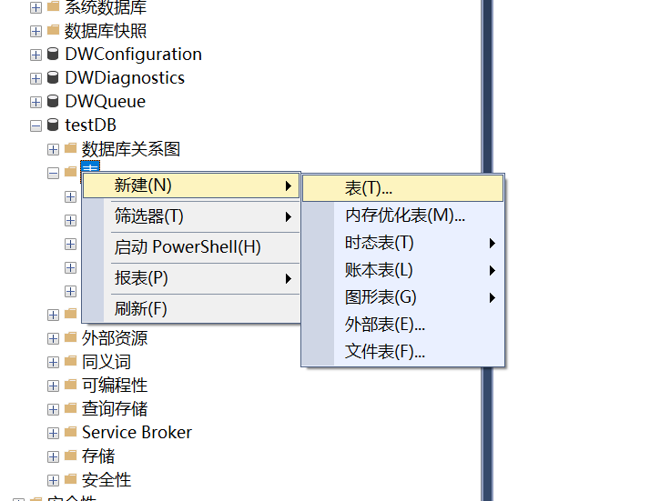
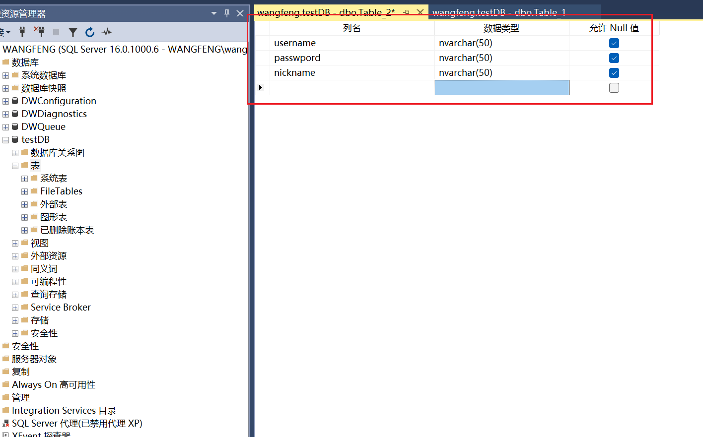
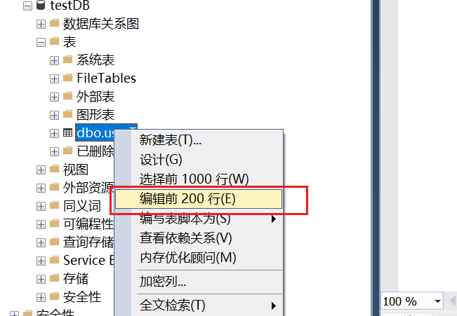
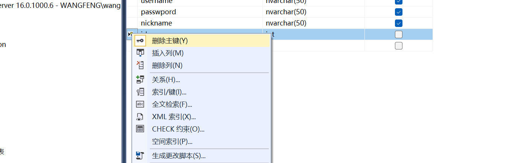
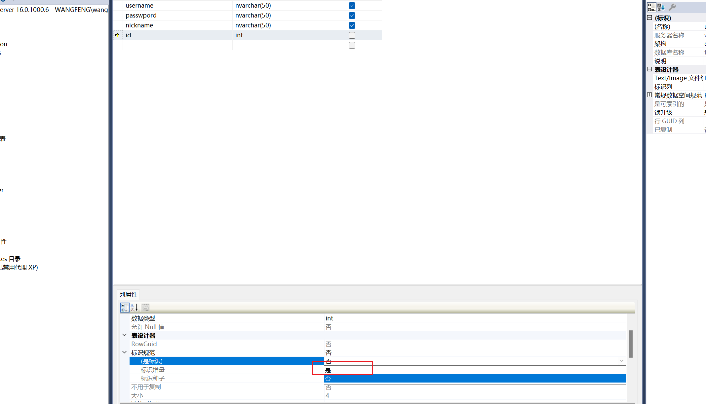
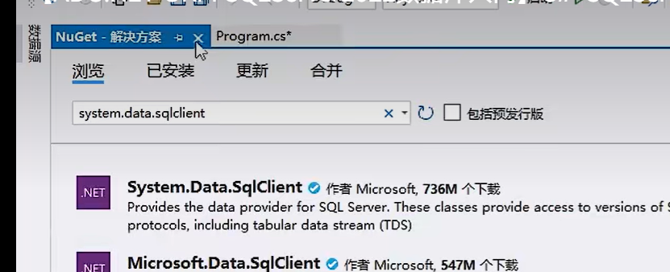
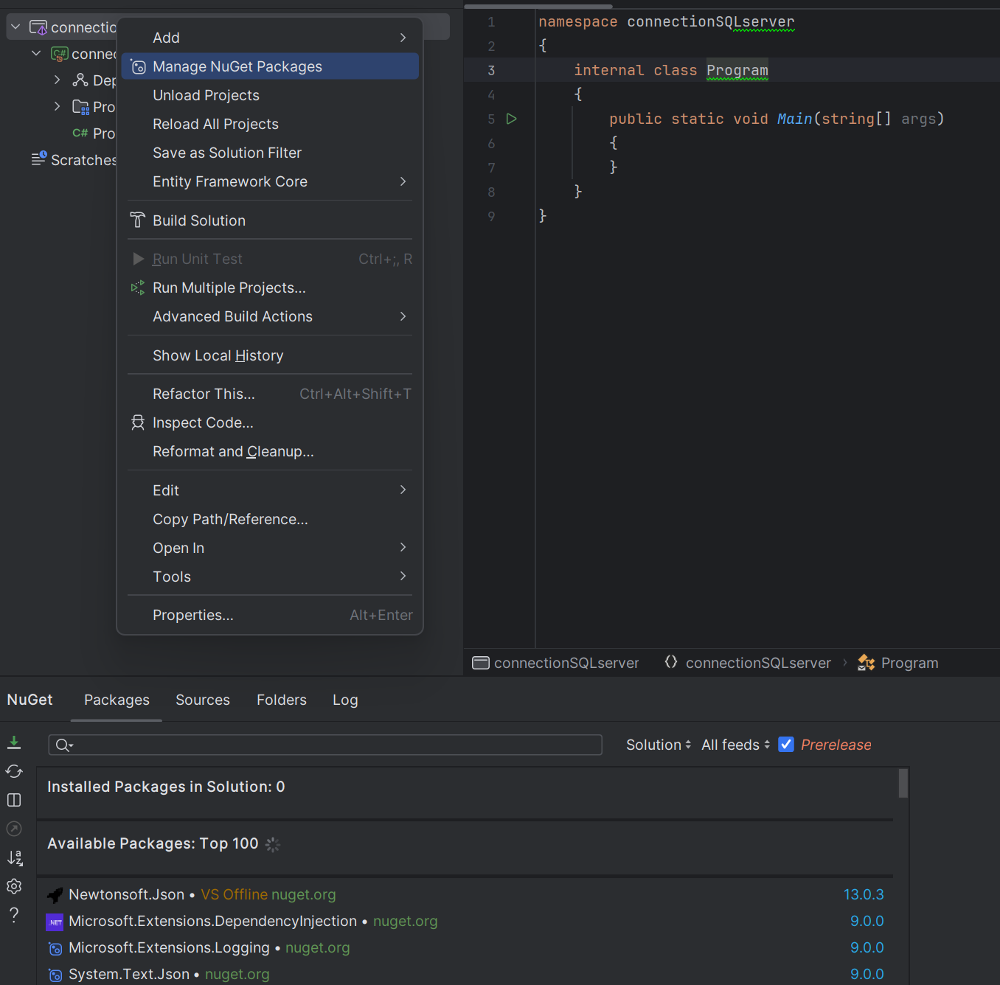
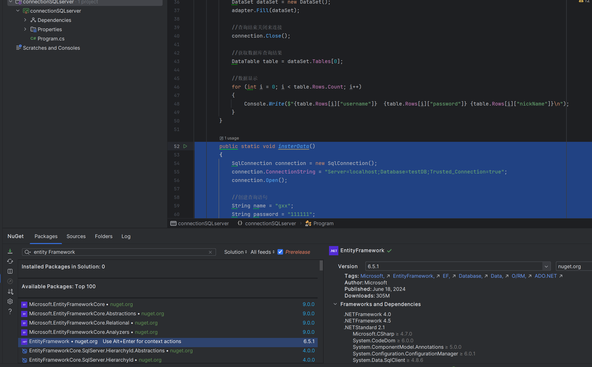
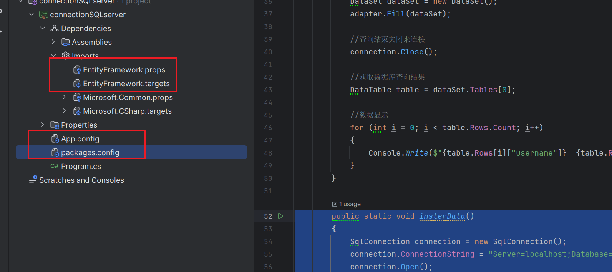

## 1.创建数据库及数据表




创建数据表



保存以后




可以向数据库写入数据。

设置主键





选择是把主键设置为自增的。

## 2.sql语句

```sql
SELECT TOP (1000) [username]
      ,[passwpord]
      ,[nickname]
  FROM [testDB].[dbo].[userT]
```

具体查看https://javaguide.cn/database/sql/sql-syntax-summary.html

## 3.c#连接sqlserver

### 1.需要system.data.client



.net core需要导入这个包。。net framework中包含了这个包可以直接使用。

rider的包管理



### 2.代码连接数据库

#### 查询语句


查询定式。数据库连接离不开这几步。

```c
public static void Main(string[] args)
{
    SqlConnection connection = new SqlConnection();
    //方式1：server指定数据库位置，
    //localhost是本地数据库
    //Database要连接的数据库
    //Trusted_Connection默认连接方式
    connection.ConnectionString = "Server=localhost;Database=testDB;Trusted_Connection=true";
    connection.Open();

    //创建查询语句
    SqlCommand command = new SqlCommand();
    command.Connection = connection;
    command.CommandText = "select * from userT;";

    //添加连接
    SqlDataAdapter adapter = new SqlDataAdapter();
    adapter.SelectCommand = command;

    //启动查询命令
    DataSet dataSet = new DataSet();
    adapter.Fill(dataSet);
    
    //查询结束关闭来连接
    connection.Close();

    //获取数据库查询结果
    DataTable table = dataSet.Tables[0];

    //数据显示
    for (int i = 0; i < table.Rows.Count; i++)
    {
        Console.Write($"{table.Rows[i]["username"]}  {table.Rows[i]["password"]} {table.Rows[i]["nickName"]}\n");
    }
}
```

#### 插入语句

```c#
public static void insterData()
{
    SqlConnection connection = new SqlConnection();
    connection.ConnectionString = "Server=localhost;Database=testDB;Trusted_Connection=true";
    connection.Open();

    //创建查询语句
    String name = "gxx";
    String password = "111111";
    String nickname = "gx";
    String insertSql = $"insert into userT values ('{name}','{password}','{nickname}')";
    SqlCommand command = new SqlCommand(insertSql, connection);
    int count = command.ExecuteNonQuery();
    connection.Close();
    
    Console.Write($"受影响行数:{count}");
}
```

## 3.ORM框架

entity Framework:微软官方提供的ORm框架



引入框架 

新增了依赖和两个config文件



### 新增一个实体类

```c#
namespace connectionSQLserver.EF6
{
    [Table("userT")]//指定数据库中的表
    public class UserModelEF
    {
        public String username { get; set; }
        public String password { get; set; }
        public String nickname { get; set; }
        [Key]//指定id为主键
        public int id { get; set; }
    }
}
```

注意两点：

1.table指定要查询的数据表

2.key：指定好对应的主键

### 新增DB连接类

```c#
namespace connectionSQLserver.EF6
{
    public class MyDBContext:DbContext
    {
        public MyDBContext() : base("Server=localhost;Database=testDB;Trusted_Connection=true")
        {
            
        }

        public DbSet<UserModelEF> userT { get; set; }
    }
}
```

继承DbContext，在构造方法中指定好数据库及其连接方式。


userT：设置获取数据表的方式。

### 使用ORM操作数据库

```c#
public static void Main(string[] args)
{
    MyDBContext context = new MyDBContext();
    List<UserModelEF> list = context.userT.ToList();
    //关闭数据库链接
    context.Dispose();
    for (int i = 0; i < list.Count; i++)
    {
        Console.Write(
            $"id = {list[i].id}, name = {list[i].username},password = {list[i].password},nickname = {list[i].nickname}\n");
    }
}
```

### 使用lambda表达式添加条件数据

```c#
public static void getUser2()
{
    List<UserModelEF> list = null;
    using (MyDBContext context = new MyDBContext())
    {
        list = context.userT.Where(e=>e.username == "wf").ToList();
    }
    for (int i = 0; i < list.Count; i++)
    {
        Console.Write(
            $"id = {list[i].id}, name = {list[i].username},password = {list[i].password},nickname = {list[i].nickname}\n");
    }
}
```

接入ORM框架EF完成。

### 使用语法糖释放数据库连接

```c#
public static void getUser2()
{
    List<UserModelEF> list = null;
    using (MyDBContext context = new MyDBContext())
    {
        list = context.userT.ToList();
    }

    for (int i = 0; i < list.Count; i++)
    {
        Console.Write(
            $"id = {list[i].id}, name = {list[i].username},password = {list[i].password},nickname = {list[i].nickname}\n");
    }
}
```

## 4.linq使用

https://www.yuque.com/ziyuebingling-go45s/qa25cw/4b4a876d-915c-424f-98c1-2cccbf1b4aa3

## 5.修改数据的两种方式

```c#
//在查询出来后直接修改
public static void updateUser()
{
    using (MyDBContext context = new MyDBContext())
    {
        UserModelEF modelEf = context.userT.FirstOrDefault(e => e.username == "wf");
        modelEf.password = "wfce";
        context.SaveChanges();
    }
}

//对之前查询的数据进行修改
public static void updateUser2()
{
    List<UserModelEF> list = null;
    using (MyDBContext context = new MyDBContext())
    {
        list = context.userT.Where(e=>e.username == "wf").ToList();
    }

    UserModelEF modelEf = list[0];
    using (MyDBContext context = new MyDBContext())
    {
        context.userT.Attach(modelEf);
        context.Entry(modelEf).State = System.Data.Entity.EntityState.Modified;

        modelEf.password = "123456";
        context.SaveChanges();
    }
}
```

因为在MyDBContext context = new MyDBContext()的生命周期内会监控查询结果的变化，所以第一张方式可以修改对应的值。但如果想要对已查询出的值进行修改，就要重新把它添加到context的生命周期中并且修改其状态。

## 6.使属性不映射到数据库的办法

```c#
[Table("studentT")]
public class StudentModelEF
{
    [Key]
    public int ID { get; set; }
    
    public String username { get; set; }
    
    public String password { get; set; }
    
    public Int32 score { get; set; }
    
    public String sender {get; set; }
        
    [NotMapped]
    public String sex{
    
    get
    {
        if (sender.Equals("1"))
        {
            return "男";
        }
        else if (sender.Equals("2"))
        {
            return "女";
        }
        else
        {
            return "not set";
        }
    }
    set
    {
        sex = sender;
    }
    }
    
    public String school { get; set; }
}
```

在entityFramework中使用[NotMapped]注解注释对应属性就不会在与数据库映射时使用。


