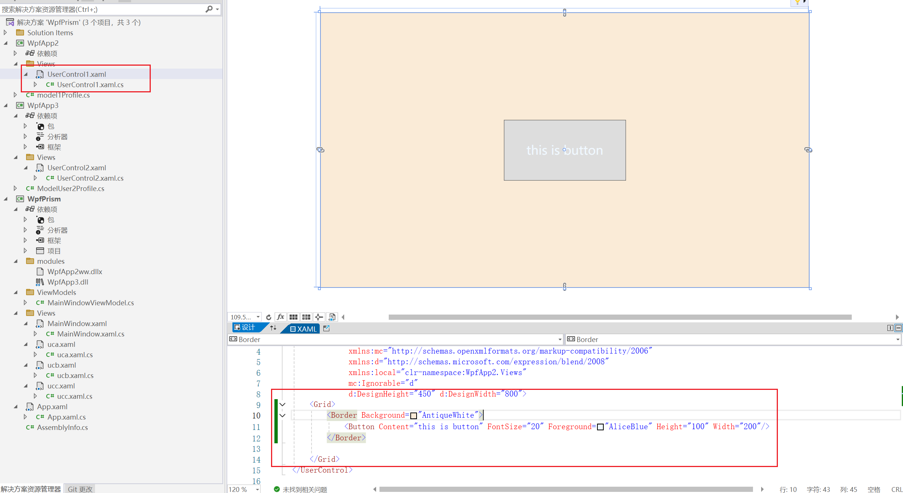
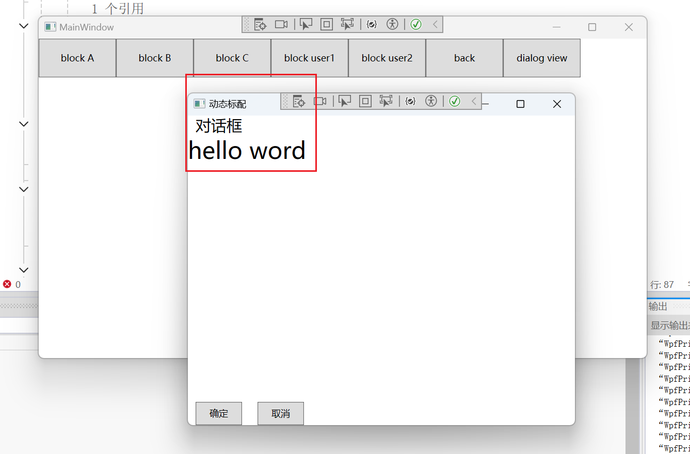

## 1.下载依赖

安装**Prism.DryIoc**


在app.xml文件中添加*xmlns:prism="http://prismlibrary.com/"*配置，向项目引入prism框架。修该xaml文件如下：

```xaml
<prism:PrismApplication x:Class="WpfPrism.App"
             xmlns="http://schemas.microsoft.com/winfx/2006/xaml/presentation"
             xmlns:x="http://schemas.microsoft.com/winfx/2006/xaml"
             xmlns:local="clr-namespace:WpfPrism"
             xmlns:prism="http://prismlibrary.com/">
    <prism:PrismApplication.Resources>
         
    </prism:PrismApplication.Resources>
</prism:PrismApplication>
```

## 2.依赖注入


目录结构。

uca、ucb、ucc是三个用户控件


MainWindowViewModel的代码：

```c#
using System.Windows.Controls;
using WpfPrism.Views;

namespace WpfPrism.ViewModels

{
    internal class MainWindowViewModel : BindableBase
    {
        public MainWindowViewModel()
        {
            ShowContentComm = new DelegateCommand<string>(ShowContent);
        }

        /// <summary>
        /// 改变显示的用户控件
        /// </summary>
        /// <param name="obj"></param>
        private void ShowContent(string obj)
        {
            if (obj == "uca")
            {
                CurrentView = new uca();
            }
            if (obj == "ucb")
            {
                CurrentView = new ucb();
            }
            if (obj == "ucc")
            {
                CurrentView = new ucc();
            }
        }

        /// <summary>
        /// 显示的内容
        /// </summary>
        private UserControl _currentView;

        public UserControl CurrentView
        {
            get { return _currentView; }
            set
            {
                _currentView = value;
                //通知消息给前端
                RaisePropertyChanged();
            }
        }

        public DelegateCommand<string> ShowContentComm { get; set; }
    }
}
```

Main Window.xaml

```xaml
<Window x:Class="WpfPrism.Views.MainWindow"
        xmlns="http://schemas.microsoft.com/winfx/2006/xaml/presentation"
        xmlns:x="http://schemas.microsoft.com/winfx/2006/xaml"
        xmlns:d="http://schemas.microsoft.com/expression/blend/2008"
        xmlns:mc="http://schemas.openxmlformats.org/markup-compatibility/2006"
        xmlns:local="clr-namespace:WpfPrism.Views"
        mc:Ignorable="d"
        xmlns:prism="http://prismlibrary.com/"
        prism:ViewModelLocator.AutoWireViewModel="True"
        Title="MainWindow" Height="450" Width="800">
    <Grid>
        <Grid.RowDefinitions>
            <RowDefinition Height="50"/>
            <RowDefinition/>
        </Grid.RowDefinitions>

        <StackPanel Orientation="Horizontal">
            <Button Content="block A" Height="50" Width="100" Command="{Binding ShowContentComm}" CommandParameter="uca"/>
            <Button Content="block B" Height="50" Width="100" Command="{Binding ShowContentComm}" CommandParameter="ucb"/>
            <Button Content="block C" Height="50" Width="100" Command="{Binding ShowContentComm}" CommandParameter="ucc"/>
        </StackPanel>

        <ContentControl Grid.Row="1" Content="{Binding CurrentView}"/>
    </Grid>
</Window>
```

 *xmlns:prism="http://prismlibrary.com/"*
 *prism:ViewModelLocator.AutoWireViewModel="True"*

这两句开启Prims的扫描，只要model的MainWindow的命名与与位置遵循规范。那么就可以扫描到model并将model注入到对应的View中。

view的命名规范：命名无特殊规范，但文件必须放在Views的目录下（MainWindow.xaml）

model的命名规范：是对应View的名称+ViewModel，并放在ViewModels的目录下(MainWindowViewModel.cs)

### 区域


目录结构

将uca、ucb、ucc是三个用户控件注册到containerRegistry

```c#
namespace WpfPrism;

/// <summary>
/// Interaction logic for App.xaml
/// </summary>
public partial class App : PrismApplication
{
    /// <summary>
    /// 
    /// 设置启动项
    /// </summary>
    /// <returns></returns>
    protected override Window CreateShell()
    {
        return Container.Resolve<Views.MainWindow>();
    }

    /// <summary>
    /// 注入服务
    /// </summary>
    /// <param name="containerRegistry"></param>
    protected override void RegisterTypes(IContainerRegistry containerRegistry)
    {
        ///注册服务,并给服务命名
        containerRegistry.RegisterForNavigation<Views.uca>("thisa");

        containerRegistry.RegisterForNavigation<Views.ucb>();
        containerRegistry.RegisterForNavigation<Views.ucc>();
    }
}
```

MainWindowViewModel.cs添加regionManager

```c#
namespace WpfPrism.ViewModels

{
    internal class MainWindowViewModel : BindableBase
    {
        private readonly IRegionManager regionManager;
        public MainWindowViewModel(IRegionManager _regionManager)
        {
            ShowContentComm = new DelegateCommand<string>(ShowContent);
            regionManager = _regionManager;
        }

        //public MainWindowViewModel()
        //{
        //    ShowContentComm = new DelegateCommand<string>(ShowContent);

        //}

        /// <summary>
        /// 改变显示的用户控件
        /// </summary>
        /// <param name="obj"></param>
        //private void ShowContent(string obj)
        //{
        //    if (obj == "uca")
        //    {
        //        CurrentView = new uca();
        //    }
        //    if (obj == "ucb")
        //    {
        //        CurrentView = new ucb();
        //    }
        //    if (obj == "ucc")
        //    {
        //        CurrentView = new ucc();
        //    }
        //}
        private void ShowContent(string obj)
        {
            //regionManager.RequestNavigate("ContentRegion", obj);
            //获取请求路径
            regionManager.Regions["ContentRegion"].RequestNavigate(obj);
        }

        /// <summary>
        /// 显示的内容
        /// </summary>
        private UserControl _currentView;

        public UserControl CurrentView
        {
            get { return _currentView; }
            set
            {
                _currentView = value;
                //通知消息给前端
                RaisePropertyChanged();
            }
        }

        public DelegateCommand<string> ShowContentComm { get; set; }
    }
}
```

MainWindow.xaml使用*prism:RegionManager.RegionName*

```xaml
<Grid>
    <Grid.RowDefinitions>
        <RowDefinition Height="50"/>
        <RowDefinition/>
    </Grid.RowDefinitions>

    <StackPanel Orientation="Horizontal">
        <Button Content="block A" Height="50" Width="100" Command="{Binding ShowContentComm}" CommandParameter="thisa"/>
        <Button Content="block B" Height="50" Width="100" Command="{Binding ShowContentComm}" CommandParameter="ucb"/>
        <Button Content="block C" Height="50" Width="100" Command="{Binding ShowContentComm}" CommandParameter="ucc"/>
    </StackPanel>

    <!--<ContentControl Grid.Row="1" Content="{Binding CurrentView}"/> -->
    <ContentControl Grid.Row="1" prism:RegionManager.RegionName="ContentRegion"/>
</Grid>
```

就可以完成区域调用控件进一步将控件与模块解耦。

## 3.模块化


新建一个项目，删除所有文件，修改项目类型位类库


添加Prism框架


添加一个View



添加配置文件，将模块注入到Prism框架中


```c#
namespace WpfApp2
{
    public class model1Profile : IModule
    {
        public void OnInitialized(IContainerProvider containerProvider)
        {
            
        }

        public void RegisterTypes(IContainerRegistry containerRegistry)
        {
            containerRegistry.RegisterForNavigation<UserControl1>("user1");
        }
    }
}
```

### 使用项目导入的方式


将wpf2导入项目


在app.xaml中添加

```c#
public partial class App : PrismApplication
{
    /// <summary>
    /// 
    /// 设置启动项
    /// </summary>
    /// <returns></returns>
    protected override Window CreateShell()
    {
        return Container.Resolve<Views.MainWindow>();
    }

    /// <summary>
    /// 注入服务
    /// </summary>
    /// <param name="containerRegistry"></param>
    protected override void RegisterTypes(IContainerRegistry containerRegistry)
    {
        ///注册服务,并给服务命名
        containerRegistry.RegisterForNavigation<Views.uca>("thisa");

        containerRegistry.RegisterForNavigation<Views.ucb>();
        containerRegistry.RegisterForNavigation<Views.ucc>();
    }
 /// <summary>
 /// 导入项目时配置
 /// </summary>
 /// <param name="moduleCatalog"></param>
    protected override void ConfigureModuleCatalog(IModuleCatalog moduleCatalog)
    {
        moduleCatalog.AddModule<model1Profile>();
        base.ConfigureModuleCatalog(moduleCatalog);
    }

    protected override IModuleCatalog CreateModuleCatalog()
    {
        return new DirectoryModuleCatalog() { ModulePath = @"./modules"};
    }
}
```


在MianWindow中使用

```xaml
<Window x:Class="WpfPrism.Views.MainWindow"
        xmlns="http://schemas.microsoft.com/winfx/2006/xaml/presentation"
        xmlns:x="http://schemas.microsoft.com/winfx/2006/xaml"
        xmlns:d="http://schemas.microsoft.com/expression/blend/2008"
        xmlns:mc="http://schemas.openxmlformats.org/markup-compatibility/2006"
        xmlns:local="clr-namespace:WpfPrism.Views"
        mc:Ignorable="d"
        xmlns:prism="http://prismlibrary.com/"
        prism:ViewModelLocator.AutoWireViewModel="True"
        Title="MainWindow" Height="450" Width="800">
    <Grid>
        <Grid.RowDefinitions>
            <RowDefinition Height="50"/>
            <RowDefinition/>
        </Grid.RowDefinitions>

        <StackPanel Orientation="Horizontal">
            <Button Content="block A" Height="50" Width="100" Command="{Binding ShowContentComm}" CommandParameter="thisa"/>
            <Button Content="block B" Height="50" Width="100" Command="{Binding ShowContentComm}" CommandParameter="ucb"/>
            <Button Content="block C" Height="50" Width="100" Command="{Binding ShowContentComm}" CommandParameter="ucc"/>
            <Button Content="block user1" Height="50" Width="100" Command="{Binding ShowContentComm}" CommandParameter="user1"/>
            <Button Content="block user2" Height="50" Width="100" Command="{Binding ShowContentComm}" CommandParameter="user2"/>
        </StackPanel>

        <!--<ContentControl Grid.Row="1" Content="{Binding CurrentView}"/> -->
        <ContentControl Grid.Row="1" prism:RegionManager.RegionName="ContentRegion"/>
    </Grid>
</Window>
```


使用成功。

### 导入dll文件


wpf3生成项目，将项目中dll文件导入主项目

在app.xaml.cs中配置

```c#
    /// <summary>
    /// dll引用
    /// </summary>
    /// <returns></returns>
    protected override IModuleCatalog CreateModuleCatalog()
    {
        return new DirectoryModuleCatalog() { ModulePath = @"./modules"};
    }
```


## 4.导航

导航的实质的将主页面的参数传递到目标控件，

### 参数传递 + 页面切换时弹窗提示

目录结构：


添加wpf2的viewModel

```c#
using System.Windows;

namespace WpfApp2.ViewModels
{
    //class User1ViewModel : BindableBase, INavigationAware
    class User1ViewModel : BindableBase, IConfirmNavigationRequest
    {
        private string _msg;

        public string Message { get { return _msg; } set { _msg = value; RaisePropertyChanged(); } }

        /// <summary>
        /// 确认导航请求
        /// </summary>
        /// <param name="navigationContext"></param>
        /// <param name="continuationCallback"></param>
        /// <exception cref="NotImplementedException"></exception>
        public void ConfirmNavigationRequest(NavigationContext navigationContext, Action<bool> continuationCallback)
        {
            bool result = false;
            if (MessageBox.Show("是否切换？", "提示标题", MessageBoxButton.YesNo) == MessageBoxResult.Yes)
            {
                result = true;
            }
            continuationCallback(result);
        }

        /// <summary>
        /// 是否重用实例
        /// </summary>
        /// <param name="navigationContext"></param>
        /// <returns></returns>
        /// <exception cref="NotImplementedException"></exception>
        public bool IsNavigationTarget(NavigationContext navigationContext)
        {
            return true;
        }

        public void OnNavigatedFrom(NavigationContext navigationContext)
        {

        }

        /// <summary>
        /// 接受参数
        /// </summary>
        /// <param name="navigationContext"></param>
        /// <exception cref="NotImplementedException"></exception>
        public void OnNavigatedTo(NavigationContext navigationContext)
        {
            if (navigationContext.Parameters.ContainsKey("msg"))
            {
                Message = navigationContext.Parameters.GetValue<string>("msg");
            }

        }
    }
}
```

修改将model注入xaml界面

```c#
public class model1Profile : IModule
{
    public void OnInitialized(IContainerProvider containerProvider)
    {
        
    }

    public void RegisterTypes(IContainerRegistry containerRegistry)
    {
        containerRegistry.RegisterForNavigation<UserControl1, User1ViewModel>("user1");
    }
}
```

修改界面

```xaml
<Border Background="AntiqueWhite">
    <Button Content="{Binding Message}" FontSize="20" Foreground="AliceBlue" Height="100" Width="200"/>
</Border>
```

修改主界面的viewModel

```c#
private void ShowContent(string obj)
{
    NavigationParameters parameters = new NavigationParameters();
    parameters.Add("msg", "这是A参数");
    //regionManager.RequestNavigate("ContentRegion", obj);
    //获取请求路径
    regionManager.Regions["ContentRegion"].RequestNavigate(obj, parameters);
}
```


可以看到主界面dataContent的key参数传递到了另一个项目的控件datacontent中。

### 回退

```c#
namespace WpfPrism.ViewModels

{
    internal class MainWindowViewModel : BindableBase
    {
        /// <summary>
        /// 导航记录
        /// </summary>
        private IRegionNavigationJournal journal;
        /// <summary>
        /// 回退命令
        /// </summary>
        public DelegateCommand<string> back{ get; set; }
        public DelegateCommand<string> ShowContentComm { get; set; }
        private readonly IRegionManager regionManager;
        public MainWindowViewModel(IRegionManager _regionManager)
        {
            ShowContentComm = new DelegateCommand<string>(ShowContent);
            back = new DelegateCommand<string>(BackFun);
            regionManager = _regionManager;
        }

        /// <summary>
        /// 后退方法
        /// </summary>
        /// <param name="obj"></param>
        private void BackFun(string obj)
        {
            if (journal != null && journal.CanGoBack)
            {
                journal.GoBack();
            }
                
        }

        //public MainWindowViewModel()
        //{
        //    ShowContentComm = new DelegateCommand<string>(ShowContent);

        //}

        /// <summary>
        /// 改变显示的用户控件
        /// </summary>
        /// <param name="obj"></param>
        //private void ShowContent(string obj)
        //{
        //    if (obj == "uca")
        //    {
        //        CurrentView = new uca();
        //    }
        //    if (obj == "ucb")
        //    {
        //        CurrentView = new ucb();
        //    }
        //    if (obj == "ucc")
        //    {
        //        CurrentView = new ucc();
        //    }
        //}
        private void ShowContent(string obj)
        {
            NavigationParameters parameters = new NavigationParameters();
            parameters.Add("msg", "这是A参数");
            //regionManager.RequestNavigate("ContentRegion", obj);
            //获取请求路径
            regionManager.Regions["ContentRegion"].RequestNavigate(obj, callback => {
                journal = callback.Context.NavigationService.Journal;
            },parameters);
        }

        /// <summary>
        /// 显示的内容
        /// </summary>
        private UserControl _currentView;

        public UserControl CurrentView
        {
            get { return _currentView; }
            set
            {
                _currentView = value;
                //通知消息给前端
                RaisePropertyChanged();
            }
        }

        
    }
}
```

添加journal和back参数，将journal添加到主命令ShowContent的回调中，添加BackFun使页面返回上一个页面。

## 5.对话框

定义对话框

```c#
<UserControl x:Class="WpfApp2.Views.Dialog"
             xmlns="http://schemas.microsoft.com/winfx/2006/xaml/presentation"
             xmlns:x="http://schemas.microsoft.com/winfx/2006/xaml"
             xmlns:mc="http://schemas.openxmlformats.org/markup-compatibility/2006" 
             xmlns:d="http://schemas.microsoft.com/expression/blend/2008" 
             xmlns:local="clr-namespace:WpfApp2.Views"
             mc:Ignorable="d" 
             Height="400" Width="500">
    <Grid>
        <Grid.RowDefinitions>
            <RowDefinition Height="auto"/>
            <RowDefinition/>
            <RowDefinition Height="auto"/>
        </Grid.RowDefinitions>
        <TextBlock Text="对话框" FontSize="20"  VerticalAlignment="Center" Margin="10 0 0 0"/>
        <TextBlock Text="hello word" Grid.Row="1" FontSize="30" />
        <StackPanel Grid.Row="2" Orientation="Horizontal">
            <Button Content="确定" Width="60" Height="30" Margin="10 0" Command="{Binding ConfirmDialogCommand}"/>
            <Button Content="取消" Width="60" Height="30" Margin="10 0"  Command="{Binding CloseDialogCommand}"/>
        </StackPanel>

    </Grid>
</UserControl>
```

添加model

```c#
using System;
using System.Collections.Generic;
using System.Linq;
using System.Text;
using System.Threading.Tasks;

namespace WpfApp2.ViewModels
{
    public class WPFDialogViewModel : BindableBase,IDialogAware
    {
        private string _title = "Notification";
        public string Title
        {
            get { return _title; }
            set { SetProperty(ref _title, value); }
        }
        public DialogCloseListener RequestClose { get; }

        public DelegateCommand CloseDialogCommand { get; set; }
        public DelegateCommand ConfirmDialogCommand { get; set; }

        public WPFDialogViewModel()
        {
            CloseDialogCommand = new DelegateCommand(closeDialog);
            ConfirmDialogCommand = new DelegateCommand(confirmDialog);
        }

        private void confirmDialog()
        {
            DialogParameters parm = new DialogParameters();
            parm.Add("title", "关闭对话框");
            RequestClose.Invoke(parm, ButtonResult.OK);
        }

        private void closeDialog()
        {
            
            RequestClose.Invoke(ButtonResult.No);
        }

        /// <summary>
        /// 是否可以关闭对话框  2
        /// </summary>
        /// <returns></returns>
        /// <exception cref="NotImplementedException"></exception>
        public bool CanCloseDialog()
        {
            return true;
        }

        /// <summary>
        /// 关闭对话框  3
        /// </summary>
        /// <exception cref="NotImplementedException"></exception>
        public void OnDialogClosed()
        {
           // RequestClose.Invoke(ButtonResult.None);
        }

        /// <summary>
        /// 打开对话框   1
        /// </summary>
        /// <param name="parameters"></param>
        /// <exception cref="NotImplementedException"></exception>
        public void OnDialogOpened(IDialogParameters parameters)
        {
            if (parameters == null) return;
            Title = parameters.GetValue<string>("title");
            var title2 = parameters.GetValue<string>("message");
            
        }
    }
}
```

在model1Profile中注册服务

```c#
public void RegisterTypes(IContainerRegistry containerRegistry)
{
    //注入控件服务
    containerRegistry.RegisterForNavigation<UserControl1, User1ViewModel>("user1");
    //注入对话框服务
    containerRegistry.RegisterDialog<Views.Dialog, WPFDialogViewModel>("dialog");
}
```

在主界面model中添加对话

```C#
using System.Windows.Controls;
using WpfPrism.Views;

namespace WpfPrism.ViewModels

{
    internal class MainWindowViewModel : BindableBase
    {

        /// <summary>
        /// 导航记录
        /// </summary>
        private IRegionNavigationJournal journal;
        /// <summary>
        /// 回退命令
        /// </summary>
        public DelegateCommand<string> back{ get; set; }
        public DelegateCommand<string> ShowContentComm { get; set; }
        private readonly IRegionManager regionManager;
        /// <summary>
        /// 对话框服务
        /// </summary>
        private readonly IDialogService dialogService;
        public DelegateCommand<string> showDialogComm { get; set; }
        public MainWindowViewModel(IRegionManager _regionManager, IDialogService _dialogService)
        {
            ShowContentComm = new DelegateCommand<string>(ShowContent);
            back = new DelegateCommand<string>(BackFun);
            regionManager = _regionManager;
            //对话框服务
            dialogService = _dialogService;
            showDialogComm = new DelegateCommand<string>(ShowDialog);
        }

        /// <summary>
        /// 后退方法
        /// </summary>
        /// <param name="obj">用户控件名称</param>
        private void BackFun(string obj)
        {
            if (journal != null && journal.CanGoBack)
            {
                journal.GoBack();
            }
                
        }

        //public MainWindowViewModel()
        //{
        //    ShowContentComm = new DelegateCommand<string>(ShowContent);

        //}

        /// <summary>
        /// 改变显示的用户控件
        /// </summary>
        /// <param name="obj"></param>
        //private void ShowContent(string obj)
        //{
        //    if (obj == "uca")
        //    {
        //        CurrentView = new uca();
        //    }
        //    if (obj == "ucb")
        //    {
        //        CurrentView = new ucb();
        //    }
        //    if (obj == "ucc")
        //    {
        //        CurrentView = new ucc();
        //    }
        //}
        private void ShowContent(string obj)
        {
            NavigationParameters parameters = new NavigationParameters();
            parameters.Add("msg", "这是A参数");
            //regionManager.RequestNavigate("ContentRegion", obj);
            //获取请求路径
            regionManager.Regions["ContentRegion"].RequestNavigate(obj, callback => {
                journal = callback.Context.NavigationService.Journal;
            },parameters);
        }
        /// <summary>
        /// 显示对话框目录
        /// </summary>
        /// <param name="obj">控件名称</param>
        private void ShowDialog(string obj)
        {
            DialogParameters parameters = new DialogParameters();
            parameters.Add("title", "动态标配");
            parameters.Add("message", "这是动态参数");

            dialogService.ShowDialog(obj, parameters, callback => {
                if (callback.Result == ButtonResult.OK && callback.Parameters.ContainsKey("title"))
                {
                    var result = callback.Parameters.GetValue<string>("title");
                    Console.WriteLine(result);
                }
            });
        }

        /// <summary>
        /// 显示的内容
        /// </summary>
        private UserControl _currentView;

        public UserControl CurrentView
        {
            get { return _currentView; }
            set
            {
                _currentView = value;
                //通知消息给前端
                RaisePropertyChanged();
            }
        }

        
    }
}
```

添加dialogService、showDialogComm，然后ShowDialog实现界面与对话框之间的通话。

在界面添加对话框按钮

```xaml
<Button Content="dialog view" Height="50" Width="100" Command="{Binding showDialogComm}" CommandParameter="dialog"/>
```




在主界面配置的参数以传递过去

## 6.发布订阅

添加消息类MessageEvent

```c#
namespace WpfPrism.other
{
    /// <summary>
    /// 发布 订阅消息
    /// </summary>
    public class MessageEvent : PubSubEvent<string>
    {

    }
}
```

MainWindow中添加订阅功能

```C#
using System.Windows;
using WpfPrism.other;

namespace WpfPrism.Views
{
    /// <summary>
    /// MainWindow.xaml 的交互逻辑
    /// </summary>
    public partial class MainWindow : Window
    {
        private readonly IEventAggregator eventAggregator;
        public MainWindow(IEventAggregator _eventAggregator)
        {
            InitializeComponent();
            this.eventAggregator = _eventAggregator;
            //this.DataContext = new MainWindowViewModel();
        }

        /// <summary>
        /// 发布消息
        /// </summary>
        /// <param name="sender"></param>
        /// <param name="e"></param>
        private void pub_Click(object sender, RoutedEventArgs e)
        {
            eventAggregator.GetEvent<MessageEvent>().Publish("Hello, Prism");
        }

        /// <summary>
        /// 订阅消息
        /// </summary>
        /// <param name="sender"></param>
        /// <param name="e"></param>
        private void sub_Click(object sender, RoutedEventArgs e)
        {
            eventAggregator.GetEvent<MessageEvent>().Subscribe(Sub);
        }

        private void Sub(string obj)
        {
            MessageBox.Show($"订阅的消极：{obj}");
        }

        /// <summary>
        /// 取消订阅
        /// </summary>
        /// <param name="sender"></param>
        /// <param name="e"></param>
        private void dePub_Click(object sender, RoutedEventArgs e)
        {
            eventAggregator.GetEvent<MessageEvent>().Unsubscribe(Sub);
        }
    }
}
```

前端代码

```xaml
<Grid>
    <Grid.RowDefinitions>
        <RowDefinition Height="50"/>
        <RowDefinition/>
    </Grid.RowDefinitions>

    <StackPanel Orientation="Horizontal">
        <Button Content="block A" Height="50" Width="70" Command="{Binding ShowContentComm}" CommandParameter="thisa"/>
        <Button Content="block B" Height="50" Width="70" Command="{Binding ShowContentComm}" CommandParameter="ucb"/>
        <Button Content="block C" Height="50" Width="70" Command="{Binding ShowContentComm}" CommandParameter="ucc"/>
        <Button Content="block user1" Height="50" Width="70" Command="{Binding ShowContentComm}" CommandParameter="user1"/>
        <Button Content="block user2" Height="50" Width="70" Command="{Binding ShowContentComm}" CommandParameter="user2"/>
        <Button Content="back" Height="50" Width="70" Command="{Binding back}"/>
        <Button Content="dialog view" Height="50" Width="70" Command="{Binding showDialogComm}" CommandParameter="dialog"/>
        <Button Content="发布" Height="50" Width="70" Click="sub_Click"/>
        <Button Content="订阅" Height="50" Width="70" Click="pub_Click"/>
        <Button Content="取消订阅" Height="50" Width="70" Click="dePub_Click"/>
    </StackPanel>

    <!--<ContentControl Grid.Row="1" Content="{Binding CurrentView}"/> -->
    <ContentControl Grid.Row="1" prism:RegionManager.RegionName="ContentRegion"/>
</Grid>
```


## 7.创建WEBAPI项目


添加StudyController

```c#
namespace WebApplication1.Controllers
{
    /// <summary>
    /// API学习接口
    /// </summary>
    [Route("api/[controller]/[action]")]
    [ApiController]
    public class StudyController : ControllerBase
    {
        /// <summary>
        /// get请求
        /// </summary>
        /// <returns></returns>
        [HttpGet]
        public IActionResult Get()
        {
            return Ok("Hello World");
        }

        /// <summary>
        /// post请求
        /// </summary>
        /// <param name="name">参数1</param>
        /// <returns></returns>
        [HttpPost]
        public IActionResult Post(string name)
        {

            return Ok("Hello World  post " + name);
        }
    }
}
```


成功。

### 开启注解


修改项目属性

```c#
var builder = WebApplication.CreateBuilder(args);

// Add services to the container.

builder.Services.AddControllers();
// Learn more about configuring Swagger/OpenAPI at https://aka.ms/aspnetcore/swashbuckle
builder.Services.AddEndpointsApiExplorer();
builder.Services.AddSwaggerGen(m =>
{
    //获取生成注解的xml文件名
    string path = AppContext.BaseDirectory + "WebApplication1.xml";
    //开启xml注解
    m.IncludeXmlComments(path);
});

var app = builder.Build();

// Configure the HTTP request pipeline.
if (app.Environment.IsDevelopment())
{
    app.UseSwagger();
    app.UseSwaggerUI();
}

app.UseAuthorization();

app.MapControllers();

app.Run();
```

添加相关注解。

即可。

### 修改服务端口号


