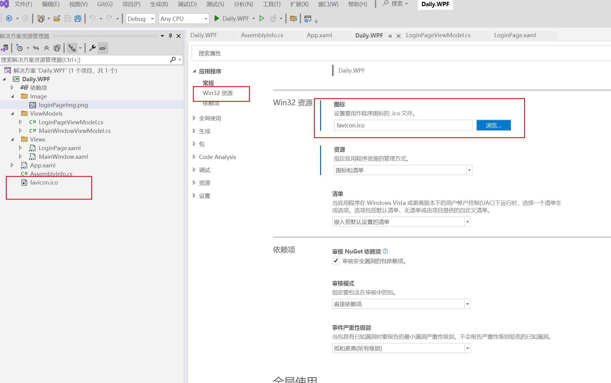
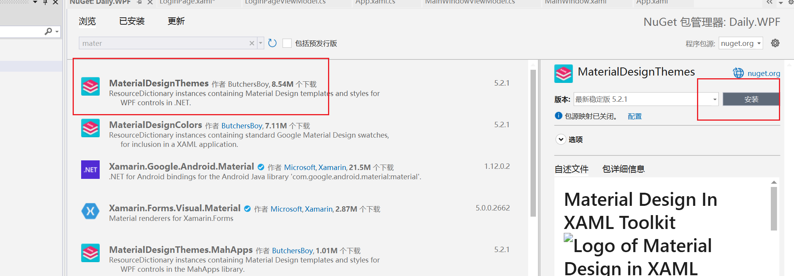
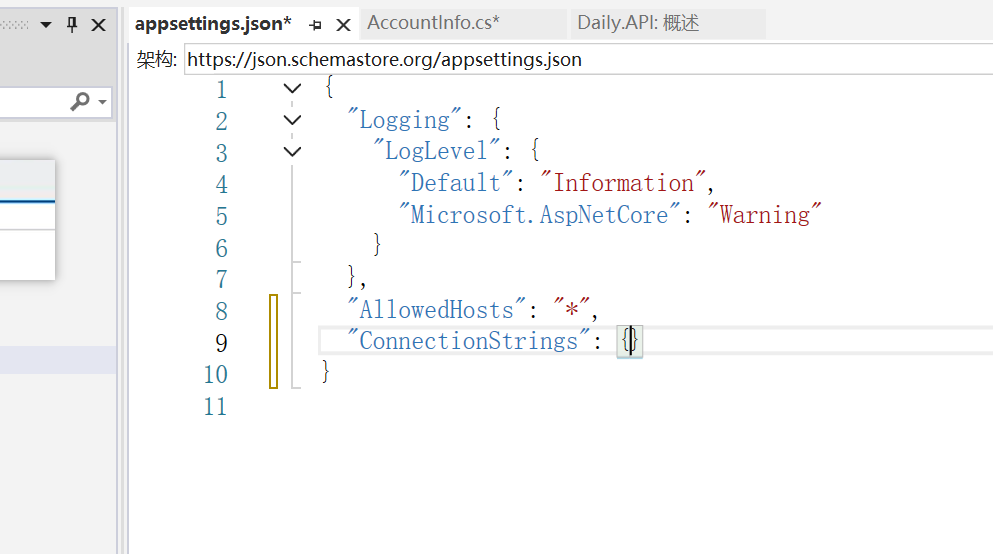
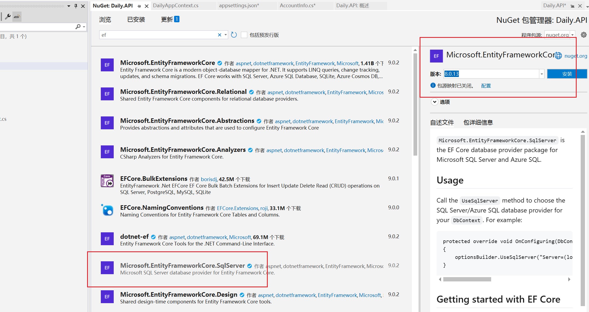
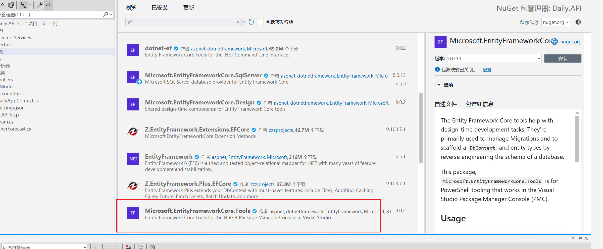
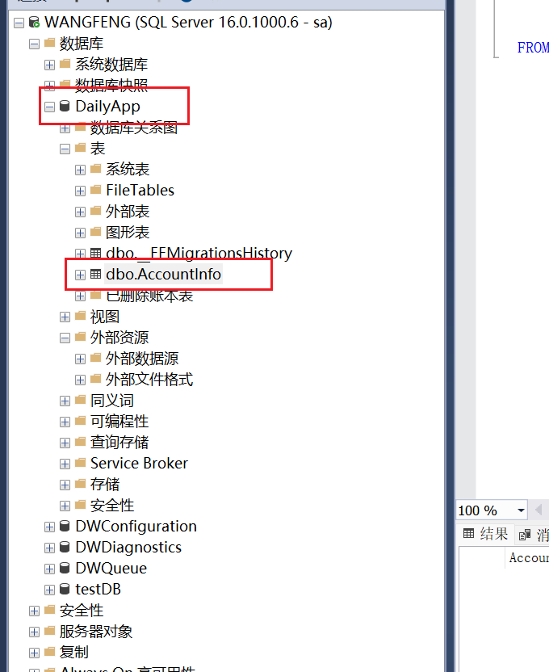
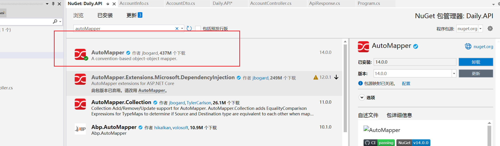
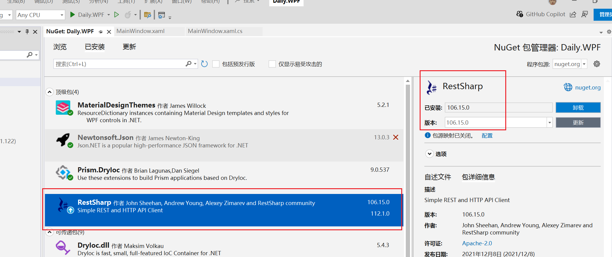
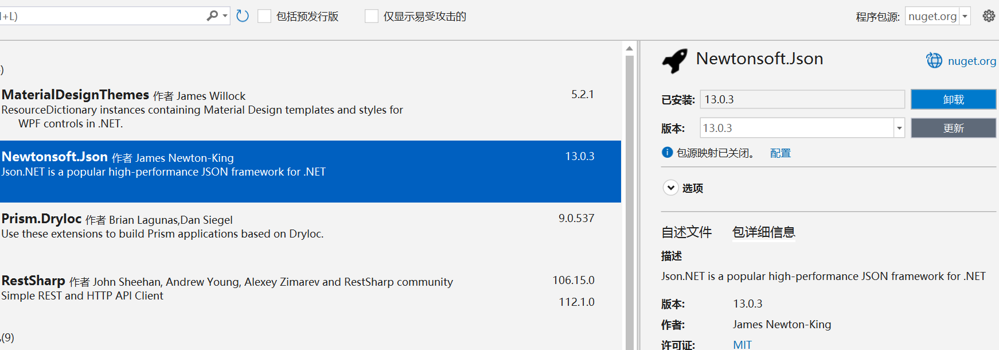
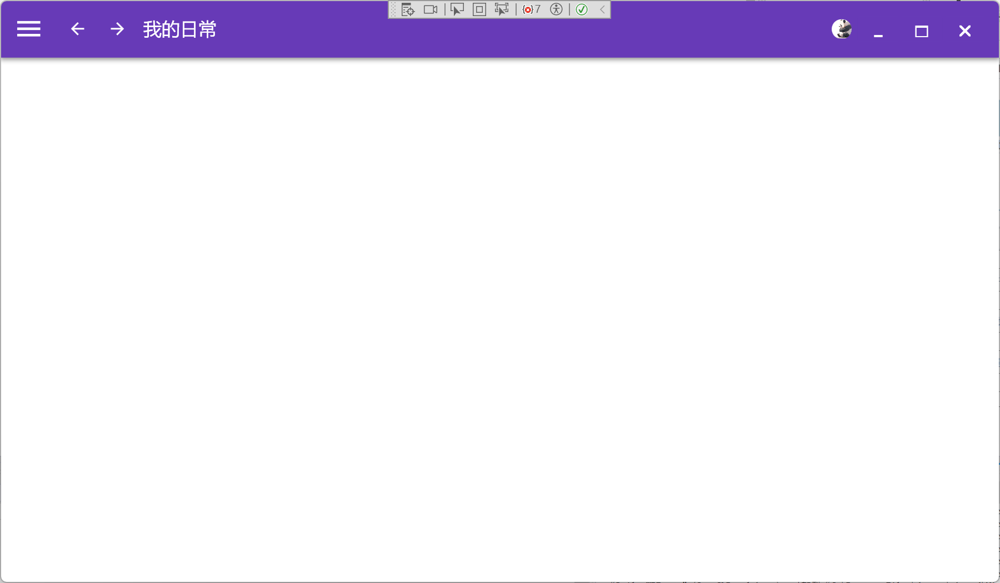

## 1.下载依赖---WPF

安装**Prism.DryIoc**


在app.xml文件中添加*xmlns:prism="http://prismlibrary.com/"*配置，向项目引入prism框架。修该xaml文件如下：

```xaml
<prism:PrismApplication x:Class="WpfPrism.App"
             xmlns="http://schemas.microsoft.com/winfx/2006/xaml/presentation"
             xmlns:x="http://schemas.microsoft.com/winfx/2006/xaml"
             xmlns:local="clr-namespace:WpfPrism"
             xmlns:prism="http://prismlibrary.com/">
    <prism:PrismApplication.Resources>
         
    </prism:PrismApplication.Resources>
</prism:PrismApplication>
```

### 将系统ICO换为自己的图标



将项目属性的Win32资源的图标选择自己的ICO文件。

## 2.注册界面---WPF

viewModel

```c#
namespace Daily.WPF.ViewModels
{
    class LoginPageViewModel : BindableBase, IDialogAware
    {
        private string _title = "登录界面";
        public string Title
        {
            get { return _title; }
            set { SetProperty(ref _title, value); }
        }
        /// <summary>
        /// 关闭对话框命令
        /// </summary>
        public DelegateCommand CloseDialogCommand { get; set; }
        /// <summary>
        /// 确认对话框命令
        /// </summary>
        public DelegateCommand ConfirmDialogCommand { get; set; }
        /// <summary>
        /// 回调
        /// </summary>
        public DialogCloseListener RequestClose { get; }

        public LoginPageViewModel()
        {
            //登录按钮命令
            CloseDialogCommand = new DelegateCommand(closeDialogFun);
            ConfirmDialogCommand = new DelegateCommand(confirmDialogFun);
            //显示注册界面命令
            ShowRegInfoComm = new DelegateCommand<string>(showRge);
        }

        private void confirmDialogFun()
        {
            RequestClose.Invoke(new DialogResult(ButtonResult.OK));
        }

        private void closeDialogFun()
        {
            RequestClose.Invoke(new DialogResult(ButtonResult.No));
        }

        /// <summary>
        /// 是否可以关闭对话框
        /// </summary>
        /// <returns></returns>
        public bool CanCloseDialog()
        {
            return true;
        }

        /// <summary>
        /// 关闭对话框回调函数
        /// </summary>
        public void OnDialogClosed()
        {
            
        }

        /// <summary>
        /// 打开对话框回调函数
        /// </summary>
        /// <param name="parameters">打开对话框时，主界面传递的参数</param>
        public void OnDialogOpened(IDialogParameters parameters)
        {
            
        }

        #region 选择页面的索引
        private int _SelectIndex;
        /// <summary>
        /// 选择页面的索引
        /// </summary>
        public int SelectIndex
        {
            get { return _SelectIndex; }
            set { _SelectIndex = value; RaisePropertyChanged(); }
        }

        public DelegateCommand<string> ShowRegInfoComm { get; set; }

        /// <summary>
        /// 显示注册界面
        /// </summary>
        private void showRge(string obj)
        {
            
            SelectIndex = int.Parse(obj);
        }

        #endregion
    }
}
```

loginPage

```xaml
<UserControl x:Class="Daily.WPF.Views.LoginPage"
             xmlns="http://schemas.microsoft.com/winfx/2006/xaml/presentation"
             xmlns:x="http://schemas.microsoft.com/winfx/2006/xaml"
             xmlns:mc="http://schemas.openxmlformats.org/markup-compatibility/2006" 
             xmlns:d="http://schemas.microsoft.com/expression/blend/2008" 
             xmlns:local="clr-namespace:Daily.WPF.Views"
             mc:Ignorable="d" 
             xmlns:md="http://materialdesigninxaml.net/winfx/xaml/themes"
             xmlns:i="http://schemas.microsoft.com/xaml/behaviors"
             xmlns:prism="http://prismlibrary.com/"
             Height="450" Width="800">
    <prism:Dialog.WindowStyle>
        <Style TargetType="Window">
            <Setter Property="Width" Value="600"/>
            <Setter Property="Height" Value="350"/>
            <Setter Property="SizeToContent" Value="WidthAndHeight"/>
            <Setter Property="ResizeMode" Value="NoResize"/>
            <Setter Property="prism:Dialog.WindowStartupLocation" Value="CenterScreen"/>
            
        </Style>
    </prism:Dialog.WindowStyle>
    <Grid>
        <Grid.ColumnDefinitions>
            <ColumnDefinition Width="1.5*"/>
            <ColumnDefinition/>
        </Grid.ColumnDefinitions>
        <Image Source="/Image/loginPageImg.png" Grid.Column="0" HorizontalAlignment="Center" VerticalAlignment="Center"/>

        <md:Transitioner Grid.Column="1" SelectedIndex="{Binding SelectIndex, FallbackValue=0}">
            <!--登录内容-->
            <md:TransitionerSlide>
                <DockPanel Margin="15" VerticalAlignment="Center">
                    <TextBlock Text="欢迎使用" FontSize="24" FontWeight="Bold" Margin="10 5" DockPanel.Dock="Top"/>
                    <TextBox md:HintAssist.Hint="请输入账号" DockPanel.Dock="Top" FontSize="18" Margin="5 10"/>
                    <PasswordBox md:HintAssist.Hint="请输入密码" DockPanel.Dock="Top" FontSize="18" Margin="5 10"/>
                    <Button Content="登录" Margin="5 10" DockPanel.Dock="Top"/>

                    <DockPanel Margin="0 5" LastChildFill="False">
                        <TextBlock Text="没有账号？" FontSize="16" Margin="5 0">
                            <i:Interaction.Triggers>
                                <i:EventTrigger EventName="MouseLeftButtonDown">
                                    <i:InvokeCommandAction Command="{Binding ShowRegInfoComm}" CommandParameter="1"/>
                                </i:EventTrigger>
                            </i:Interaction.Triggers>
                        </TextBlock>

                        <TextBlock Text="忘记密码" FontSize="16" DockPanel.Dock="Right"/>
                    </DockPanel>
                </DockPanel>
                
            </md:TransitionerSlide>
            <!--注册-->
            <md:TransitionerSlide>
                <DockPanel Margin="5" VerticalAlignment="Center">
                    <TextBlock Text="注册账号" FontSize="24" FontWeight="Bold" Margin="10 5" DockPanel.Dock="Top"/>
                    <TextBox md:HintAssist.Hint="请输入账号" DockPanel.Dock="Top" FontSize="18" Margin="5 10"/>
                    <PasswordBox md:HintAssist.Hint="请输入密码" DockPanel.Dock="Top" FontSize="18" Margin="5 10"/>
                    <PasswordBox md:HintAssist.Hint="请再次输入密码" DockPanel.Dock="Top" FontSize="18" Margin="5 10"/>
                    <Button Content="注册账号" Margin="5 10" DockPanel.Dock="Top" />
                    <Button Content="返回登录" Margin="5 5" DockPanel.Dock="Top" 
                            Style="{StaticResource MaterialDesignOutlinedButton}"
                            Command="{Binding ShowRegInfoComm}" CommandParameter="0"
                            />
                </DockPanel>
            </md:TransitionerSlide>
        </md:Transitioner>
    </Grid>
</UserControl>
```

### 先添加materialdesigninxaml扩展



app。xaml中方引入

```xaml
<prism:PrismApplication x:Class="Daily.WPF.App"
             xmlns="http://schemas.microsoft.com/winfx/2006/xaml/presentation"
             xmlns:x="http://schemas.microsoft.com/winfx/2006/xaml"
             xmlns:local="clr-namespace:Daily.WPF"
             xmlns:prism="http://prismlibrary.com/"
             xmlns:materialDesign="http://materialdesigninxaml.net/winfx/xaml/themes"
             >
    <prism:PrismApplication.Resources>
        <ResourceDictionary>
            <ResourceDictionary.MergedDictionaries>
                <materialDesign:BundledTheme BaseTheme="Light" PrimaryColor="DeepPurple" SecondaryColor="Lime" />
                <ResourceDictionary Source="pack://application:,,,/MaterialDesignThemes.Wpf;component/Themes/MaterialDesign3.Defaults.xaml" />
            </ResourceDictionary.MergedDictionaries>
        </ResourceDictionary>
    </prism:PrismApplication.Resources>
</prism:PrismApplication>
```

### 不同页面切换

*md:Transitioner Grid.Column="1" SelectedIndex="{Binding SelectIndex, FallbackValue=0}"*

md的Transitioner 属性可以通过SelectedIndex来决定当前显示哪个页面。

*md:TransitionerSlide* 来划分不同页面页面顺序从0开始

### 使用MD扩展给文字添加命令

```xaml
<TextBlock Text="没有账号？" FontSize="16" Margin="5 0">
    <i:Interaction.Triggers>
        <i:EventTrigger EventName="MouseLeftButtonDown">
            <i:InvokeCommandAction Command="{Binding ShowRegInfoComm}" CommandParameter="1"/>
        </i:EventTrigger>
    </i:Interaction.Triggers>
</TextBlock>
```

此时点击文字时，会触发ShowRegInfoComm命令。

### 页面切换实现

```c#
#region 选择页面的索引
private int _SelectIndex;
/// <summary>
/// 选择页面的索引
/// </summary>
public int SelectIndex
{
    get { return _SelectIndex; }
    set { _SelectIndex = value; RaisePropertyChanged(); }
}

public DelegateCommand<string> ShowRegInfoComm { get; set; }

/// <summary>
/// 显示注册界面
/// </summary>
private void showRge(string obj)
{
    
    SelectIndex = int.Parse(obj);
}

#endregion
```

前端页面绑定SelectIndex属性，通过Comm命令触发函数改变SelectIndex的值从而实现页面切换的效果。

### 效果展示


点击没有账号


点击返回登录按钮就可以返回上一个页面。

## 3.Password自定义扩展属性，实现双向绑定---WPF

```c#
namespace Daily.WPF.Extensions
{
    /// <summary>
    /// passwordBox扩展属性
    /// </summary>
    class PasswordBoxExt
    {


        public static string GetPwd(DependencyObject obj)
        {
            return (string)obj.GetValue(PwdProperty);
        }

        public static void SetPwd(DependencyObject obj, string value)
        {
            obj.SetValue(PwdProperty, value);
        }

        // Using a DependencyProperty as the backing store for MyProperty. 
        public static readonly DependencyProperty PwdProperty =
            DependencyProperty.RegisterAttached(
                "Pwd", typeof(string), 
                typeof(PasswordBoxExt), 
                new PropertyMetadata("", onPasswordChange));

        /// <summary>
        /// 当PasswordBox的password参数修改时
        /// 同步修改自定义的
        /// </summary>
        /// <param name="d"></param>
        /// <param name="e"></param>
        private static void onPasswordChange(DependencyObject d, DependencyPropertyChangedEventArgs e)
        {
            PasswordBox? box = d as PasswordBox;
            string newPwd = (string) e.NewValue;
            if (box != null && box.Password != newPwd)
            {
                //判断现在的密码值，是否被修改
                box.Password = newPwd;
            }
        }
    }

    /// <summary>
    /// password变化，自定义的附加属性也会跟着变化
    /// </summary>
    public class PasswordBoxBehavior : Behavior<PasswordBox>
    {

        
        /// <summary>
        /// 注入事件
        /// </summary>
        protected override void OnAttached()
        {
            base.OnAttached();
            AssociatedObject.PasswordChanged += OnPasswordchanged;
        }

        /// <summary>
        /// 密码修改时调用
        /// </summary>
        /// <param name="sender"></param>
        /// <param name="e"></param>
        /// <exception cref="NotImplementedException"></exception>
        private void OnPasswordchanged(object sender, RoutedEventArgs e)
        {
            PasswordBox? box = sender as PasswordBox;
            if (box == null) return;
            string oldPass = PasswordBoxExt.GetPwd(box);
            if (box.Password != oldPass)
            {
                PasswordBoxExt.SetPwd(box, box.Password);
            }

        }

        /// <summary>
        /// 销毁事件
        /// </summary>
        protected override void OnDetaching()
        {
            base.OnDetaching();
            AssociatedObject.PasswordChanged -= OnPasswordchanged;
        }
    }
}
```


页面调用

```xaml
<UserControl x:Class="Daily.WPF.Views.LoginPage"
             xmlns="http://schemas.microsoft.com/winfx/2006/xaml/presentation"
             xmlns:x="http://schemas.microsoft.com/winfx/2006/xaml"
             xmlns:mc="http://schemas.openxmlformats.org/markup-compatibility/2006" 
             xmlns:d="http://schemas.microsoft.com/expression/blend/2008" 
             xmlns:local="clr-namespace:Daily.WPF.Views"
             mc:Ignorable="d" 
             xmlns:md="http://materialdesigninxaml.net/winfx/xaml/themes"
             xmlns:i="http://schemas.microsoft.com/xaml/behaviors"
             xmlns:prism="http://prismlibrary.com/"
             
             xmlns:pwdBoxExt="clr-namespace:Daily.WPF.Extensions"
             
             Height="450" Width="800">
    <prism:Dialog.WindowStyle>
        <Style TargetType="Window">
            <Setter Property="Width" Value="600"/>
            <Setter Property="Height" Value="350"/>
            <Setter Property="SizeToContent" Value="WidthAndHeight"/>
            <Setter Property="ResizeMode" Value="NoResize"/>
            <Setter Property="prism:Dialog.WindowStartupLocation" Value="CenterScreen"/>
            
        </Style>
    </prism:Dialog.WindowStyle>
    <Grid>
        <Grid.ColumnDefinitions>
            <ColumnDefinition Width="1.5*"/>
            <ColumnDefinition/>
        </Grid.ColumnDefinitions>
        <Image Source="/Image/loginPageImg.png" Grid.Column="0" HorizontalAlignment="Center" VerticalAlignment="Center"/>

        <md:Transitioner Grid.Column="1" SelectedIndex="{Binding SelectIndex, FallbackValue=0}">
            <!--登录内容-->
            <md:TransitionerSlide>
                <DockPanel Margin="15" VerticalAlignment="Center">
                    <TextBlock Text="欢迎使用" FontSize="24" FontWeight="Bold" Margin="10 5" DockPanel.Dock="Top"/>
                    <TextBox md:HintAssist.Hint="请输入账号" DockPanel.Dock="Top" FontSize="18" Margin="5 10"/>
                    <PasswordBox md:HintAssist.Hint="请输入密码" DockPanel.Dock="Top" FontSize="18" Margin="5 10"
                                 pwdBoxExt:PasswordBoxExt.Pwd="{Binding Pwd, Mode=TwoWay, UpdateSourceTrigger=PropertyChanged}"
                                 >
                        <i:Interaction.Behaviors>
                            <pwdBoxExt:PasswordBoxBehavior/>
                        </i:Interaction.Behaviors>
                        
                    </PasswordBox>
                    <Button Content="登录" Margin="5 10" DockPanel.Dock="Top" Command="{Binding ConfirmDialogCommand}"/>

                    <DockPanel Margin="0 5" LastChildFill="False">
                        <TextBlock Text="没有账号？" FontSize="16" Margin="5 0">
                            <i:Interaction.Triggers>
                                <i:EventTrigger EventName="MouseLeftButtonDown">
                                    <i:InvokeCommandAction Command="{Binding ShowRegInfoComm}" CommandParameter="1"/>
                                </i:EventTrigger>
                            </i:Interaction.Triggers>
                        </TextBlock>

                        <TextBlock Text="忘记密码" FontSize="16" DockPanel.Dock="Right"/>
                    </DockPanel>
                </DockPanel>
                
            </md:TransitionerSlide>
            <!--注册-->
            <md:TransitionerSlide>
                <DockPanel Margin="5" VerticalAlignment="Center">
                    <TextBlock Text="注册账号" FontSize="24" FontWeight="Bold" Margin="10 5" DockPanel.Dock="Top"/>
                    <TextBox md:HintAssist.Hint="请输入账号" DockPanel.Dock="Top" FontSize="18" Margin="5 10"/>
                    <PasswordBox md:HintAssist.Hint="请输入密码" DockPanel.Dock="Top" FontSize="18" Margin="5 10"/>
                    <PasswordBox md:HintAssist.Hint="请再次输入密码" DockPanel.Dock="Top" FontSize="18" Margin="5 10"/>
                    <Button Content="注册账号" Margin="5 10" DockPanel.Dock="Top" />
                    <Button Content="返回登录" Margin="5 5" DockPanel.Dock="Top" 
                            Style="{StaticResource MaterialDesignOutlinedButton}"
                            Command="{Binding ShowRegInfoComm}" CommandParameter="0"
                            />
                </DockPanel>
            </md:TransitionerSlide>
        </md:Transitioner>
    </Grid>
</UserControl>
```

使用时映入自定义的pwdBoxExt即可。

## 4.EK框架---API

### 配置appsettings.xmal

如无自动提示可以加上架构



*https://json.schemastore.org/appsettings.json*

### EF框架配置

添加依赖，注意连接数据库类型与扩展版本



添加迁移扩展



### 编写实体类

```c#
namespace Daily.API.DataModel
{
    /// <summary>
    /// 登录时的用户模型
    /// </summary>
    [Table("AccountInfo")]
    public class AccountInfo
    {
        /// <summary>
        /// 自增主键
        /// </summary>
        [Key]
        public int AccountId { get; set; }
        /// <summary>
        /// 账号
        /// </summary>
        public string Account { get; set; }
        /// <summary>
        /// 密码
        /// </summary>
        public string Pwd { get; set; }
    }
}
```

### 添加数据库上下文

```c#
namespace Daily.API.DataModel
{
    /// <summary>
    /// 数据库上下文
    /// </summary>
    public class DailyAppContextL:DbContext
    {
        public DailyAppContextL(DbContextOptions<DailyAppContextL> dbContext):base(dbContext) { }

        /// <summary>
        /// 账号表
        /// virtual--惰性加载
        /// </summary>
        public virtual DbSet<AccountInfo> AccountInfo { get; set; }

    }
}
```

添加配置appsettings。json中

```json
{
  "Logging": {
    "LogLevel": {
      "Default": "Information",
      "Microsoft.AspNetCore": "Warning"
    }
  },
  "AllowedHosts": "*",
  "ConnectionStrings": { "ConnStr": "server=.;uid=sa;pwd=123456;database=DailyApp;Encrypt=True;TrustServerCertificate=True;" }
}
```

Program.cs中添加构建

```c#
//数据库上下文
builder.Services.AddDbContext<DailyAppContextL>(m => m.UseSqlServer(builder.Configuration.GetConnectionString("ConnStr")));
```

### 使用程序包管理控制台生成数据库的数据库与数据表

```
PM> add-migration wangfeng0309
Build started...
Build succeeded.
To undo this action, use Remove-Migration.
PM> update-database
```



生成了对应的数据库与数据表。

### AutoMapper包完成映射

#### 依赖导入



#### 配置类

```c#
namespace Daily.API.AutoMappers
{
    /// <summary>
    /// 对象Mapper转换
    /// </summary>
    public class AUtoMapperSettings: Profile
    {
        public AUtoMapperSettings()
        {
            CreateMap<AccountDto, AccountInfo>().ReverseMap();
            //CreateMap<AccountInfo, AccountDto>().ReverseMap();
        }
    }
}
```

#### 在Program中配置

```c#

//AutoMapper
builder.Services.AddAutoMapper(typeof(AUtoMapperSettings));
```

### 接口开发

#### reg注册接口开发

```c#
private readonly IMapper mapper;

public AccountController(DailyAppContextL _content, IMapper _mapper)
{
    context = _content;
     mapper = _mapper;
}

/// <summary>
/// 注册账号
/// </summary>
/// <param name="dto">接口传递进来的参数</param>
/// <returns>-1；账号已存在，1；注册成功，-99；未知错误</returns>
/// <exception cref="NullReferenceException"></exception>
[HttpPost]
public IActionResult Reg(AccountDto dto)
{
    ApiResponse responses = new ApiResponse();
    try
    {
        //1.判断账号是否被注册
        if (dto == null) throw new NullReferenceException();
        var dbAccount = context.AccountInfo.Where(t => t.Account == dto.Account).FirstOrDefault();
        if (dbAccount != null)
        {
            responses.code = -1;
            responses.msg = "账号已被注册";
            return Ok(responses);
        }
        //2.注册账号
        //AccountInfo info = new AccountInfo() { Account = dto.Account,Pwd = dto.Pwd};
        //dto通过mapper转Info，需注意两个类型的名称应该相同
        AccountInfo info = mapper.Map<AccountInfo>(dto);
        context.AccountInfo.Add(info);
        var count =  context.SaveChanges();//保存 返回受影响行数
        if (count == 1)
        {
            responses.code = 1;
            responses.msg = "注册成功！！！";
        }
        else
        {
            responses.code = -99;
            responses.msg = "服务器忙碌，请重试....";
        }

    }
    catch (Exception)
    {

        responses.code = -99;
        responses.msg = "服务器忙碌，请重试....";
    }


    return Ok(responses);
}
```

#### 登录接口开发

```C#
/// <summary>
/// 登录
/// </summary>
/// <param name="account">账号</param>
/// <param name="pwd">密码</param>
/// <returns></returns>
[HttpGet]
public IActionResult Login(string account,string pwd)
{
    ApiResponse response = new ApiResponse();
    try
    {
        var dbAccount = context.AccountInfo.Where(t => t.Account == account && t.Pwd == pwd).FirstOrDefault();
        if (dbAccount == null)
        {
            response.code = -1;
            response.msg = "账号或密码错误";
            return Ok(response);
        }

        response.code = 1;
        response.msg = "登录成功";
        response.resultData = dbAccount;

        return Ok(response);
    }
    catch (Exception)
    {
        response.code = -9;
        response.msg = "服务器忙碌,请稍后";
        return Ok(response);
    }
}
```

## 5.WPF的API调用

安装RestSharp扩展



添加JSON扩展Newtonsoft.Json



### 实体类

请求

```c#
namespace Daily.WPF.HttpClients
{
    /// <summary>
    /// 请求的API
    /// </summary>
    class ApiRequest
    {
        /// <summary>
        /// 请求地址
        /// </summary>
        public string Route { get; set; }
        /// <summary>
        /// 请求的方法
        /// </summary>
        public Method Method { get; set; }
        /// <summary>
        /// 请求参数
        /// </summary>
        public object Parameter { get; set; }
        /// <summary>
        /// 请求内容的类型
        /// </summary>
        public string ContentType { get; set; } = "application/json";

    }
}
```


接收

```c#
namespace Daily.WPF.HttpClients
{
    /// <summary>
    /// 接受参数模型
    /// </summary>
    class ApiResponse
    {
        /// <summary>
        /// 状态码
        /// </summary>
        public int code { get; set; }
        /// <summary>
        /// 返回信息
        /// </summary>
        public string msg { get; set; }
        /// <summary>
        /// 返回结果
        /// </summary>
        public object resultData { get; set; }
    }
}
```

### 请求方法

```c#
namespace Daily.WPF.HttpClients
{
    /// <summary>
    /// 请求
    /// </summary>
    class HttpRestClient
    {
        /// <summary>
        /// 客户端
        /// </summary>
        private readonly RestClient restClient;
        private readonly string baseUrl = "http://localhost:38545/api/";

        public HttpRestClient()
        {
            restClient = new RestClient();
        }

        public ApiResponse PostExec(ApiRequest apiRequest)
        {
            RestRequest request = new RestRequest(apiRequest.Method);
            request.AddHeader("Content-Type", apiRequest.ContentType);

            if (apiRequest.Parameter != null) {
                //SerializeObject将Object转为Json字符串
                request.AddParameter("param", JsonConvert.SerializeObject(apiRequest.Parameter),ParameterType.RequestBody);
            }

            restClient.BaseUrl = new Uri( baseUrl + apiRequest.Route);
            var req =  restClient.Execute(request);
            if (req.StatusCode == System.Net.HttpStatusCode.OK)
            {
                //
                return JsonConvert.DeserializeObject<ApiResponse>(req.Content);
            }
            else
            {
                return new ApiResponse() { code = -99,msg = "服务器错误，请稍后" };
            }
            
        }
    }
}
```

### 使用

实体类定义

```c#
namespace Daily.WPF.DTOS
{
    /// <summary>
    /// account dto
    /// </summary>
    class AccountInfoDto
    {
        /// <summary>
        /// 账号
        /// </summary>
        public string Account { get; set; }
        /// <summary>
        /// 密码
        /// </summary>
        public string Pwd { get; set; }
        /// <summary>
        /// 确认密码
        /// </summary>
        public string ConfirmPwd { get; set; }
    }
}

```

APi调用

```c#
private readonly HttpRestClient httpRestClient;

//发布订阅
private readonly IEventAggregator Aggregator;
public LoginPageViewModel(HttpRestClient _httpRestClient, IEventAggregator _Aggregator)
{
    //登录按钮命令
    CloseDialogCommand = new DelegateCommand(closeDialogFun);
    ConfirmDialogCommand = new DelegateCommand(confirmDialogFun);
    //显示注册界面命令
    ShowRegInfoComm = new DelegateCommand<string>(showRge);
    //注册命令
    regComm = new DelegateCommand(regCommFun);
    //注册客户端
    httpRestClient = _httpRestClient;

    AccountInfoDto = new AccountInfoDto();
    //发布订阅
    Aggregator = _Aggregator;
}

#region 注册登录请求

public DelegateCommand regComm { get; set; }

public void regCommFun()
{
    if (string.IsNullOrEmpty(AccountInfoDto.Account) ||
        string.IsNullOrEmpty(AccountInfoDto.Pwd) ||
        string.IsNullOrEmpty(AccountInfoDto.ConfirmPwd))
    {
        //MessageBox.Show("注册信息不全");
        Aggregator.GetEvent<RegisterMsgEvent>().Publish("注册信息不全");
        return;
    }

    if (AccountInfoDto.Pwd != AccountInfoDto.ConfirmPwd) {
        //MessageBox.Show("两次输入密码不同");
        Aggregator.GetEvent<RegisterMsgEvent>().Publish("两次输入密码不同");
        return;
    }

    //API调用
    ApiRequest apiRequest = new ApiRequest();
    apiRequest.Method = RestSharp.Method.POST;
    apiRequest.Route = "Account/Reg";

    AccountInfoDto.Pwd = MD5Hepler.getMD5(AccountInfoDto.Pwd);
    AccountInfoDto.ConfirmPwd = MD5Hepler.getMD5(AccountInfoDto.ConfirmPwd);

    apiRequest.Parameter = AccountInfoDto;
    ApiResponse apiResponse = httpRestClient.PostExec(apiRequest);

    if (apiResponse.code == 1)
    {
        //MessageBox.Show(apiResponse.msg);
        Aggregator.GetEvent<RegisterMsgEvent>().Publish(apiResponse.msg);
        SelectIndex = 0;//注册成功，切换到登录界面
    }
    else
    {
        //MessageBox.Show(apiResponse.msg);
        Aggregator.GetEvent<RegisterMsgEvent>().Publish(apiResponse.msg);
    }
}

/// <summary>
/// 登录功能
/// </summary>
private void confirmDialogFun()
{
    //参数校验
    if (string.IsNullOrEmpty(Pwd) || string.IsNullOrEmpty(account))
    {
        //发布消息
        Aggregator.GetEvent<RegisterMsgEvent>().Publish("登录信息不全");
        return;
    }

    //API调用
    ApiRequest apiRequest = new ApiRequest();
    apiRequest.Method = RestSharp.Method.GET;

    Pwd = MD5Hepler.getMD5(Pwd);
    apiRequest.Route = $"Account/Login?account={account}&pwd={Pwd}";
    ApiResponse apiResponse = httpRestClient.PostExec(apiRequest);

    if (apiResponse.code == 1)
    {
        RequestClose.Invoke(new DialogResult(ButtonResult.OK));
    }
    else
    {
        Aggregator.GetEvent<RegisterMsgEvent>().Publish(apiResponse.msg);
    }
}

/// <summary>
/// 用户信息
/// </summary>
private AccountInfoDto _AccountInfoDto;

public AccountInfoDto AccountInfoDto
{
    get { return _AccountInfoDto; }
    set { _AccountInfoDto = value; }
}


#endregion
```

登录界面前端

```xaml
<UserControl x:Class="Daily.WPF.Views.LoginPage"
             xmlns="http://schemas.microsoft.com/winfx/2006/xaml/presentation"
             xmlns:x="http://schemas.microsoft.com/winfx/2006/xaml"
             xmlns:mc="http://schemas.openxmlformats.org/markup-compatibility/2006" 
             xmlns:d="http://schemas.microsoft.com/expression/blend/2008" 
             xmlns:local="clr-namespace:Daily.WPF.Views"
             mc:Ignorable="d" 
             xmlns:md="http://materialdesigninxaml.net/winfx/xaml/themes"
             xmlns:i="http://schemas.microsoft.com/xaml/behaviors"
             xmlns:prism="http://prismlibrary.com/"
             
             xmlns:pwdBoxExt="clr-namespace:Daily.WPF.Extensions" 
             Height="450" Width="800">
    <prism:Dialog.WindowStyle>
        <Style TargetType="Window">
            <Setter Property="Width" Value="600"/>
            <Setter Property="Height" Value="350"/>
            <Setter Property="SizeToContent" Value="WidthAndHeight"/>
            <Setter Property="ResizeMode" Value="NoResize"/>
            <Setter Property="prism:Dialog.WindowStartupLocation" Value="CenterScreen"/>
            
        </Style>
    </prism:Dialog.WindowStyle>
    <Grid>
        <Grid.ColumnDefinitions>
            <ColumnDefinition Width="1.5*"/>
            <ColumnDefinition/>
        </Grid.ColumnDefinitions>
        <!--显示错误提示-->
        <md:Snackbar x:Name="regLoginBar" Grid.ColumnSpan="2" MessageQueue="{md:MessageQueue}"></md:Snackbar>
        
        <Image Source="/Image/loginPageImg.png" Margin="0 50 0 50" Grid.Column="0" HorizontalAlignment="Center" VerticalAlignment="Center"/>

        <md:Transitioner Grid.Column="1" SelectedIndex="{Binding SelectIndex, FallbackValue=0}">
            <!--登录内容-->
            <md:TransitionerSlide>
                <DockPanel Margin="15" VerticalAlignment="Center">
                    <TextBlock Text="欢迎使用" FontSize="24" FontWeight="Bold" Margin="10 5" DockPanel.Dock="Top"/>
                    <TextBox md:HintAssist.Hint="请输入账号" DockPanel.Dock="Top" FontSize="18" Margin="5 10" Text="{Binding account}"/>
                    <PasswordBox md:HintAssist.Hint="请输入密码" DockPanel.Dock="Top" FontSize="18" Margin="5 10"
                                 pwdBoxExt:PasswordBoxExt.Pwd="{Binding Pwd, Mode=TwoWay, UpdateSourceTrigger=PropertyChanged}">
                        <i:Interaction.Behaviors>
                            <pwdBoxExt:PasswordBoxBehavior/>
                        </i:Interaction.Behaviors>
                    </PasswordBox>
                    <Button Content="登录" Margin="5 10" DockPanel.Dock="Top" Command="{Binding ConfirmDialogCommand}"/>
                    <Button Content="登录不联网" Margin="5 10" DockPanel.Dock="Top" Command="{Binding CloseDialogCommand}"/>
                    <DockPanel Margin="0 5" LastChildFill="False">
                        <TextBlock Text="没有账号？" FontSize="16" Margin="5 0">
                            <i:Interaction.Triggers>
                                <i:EventTrigger EventName="MouseLeftButtonDown">
                                    <i:InvokeCommandAction Command="{Binding ShowRegInfoComm}" CommandParameter="1"/>
                                </i:EventTrigger>
                            </i:Interaction.Triggers>
                        </TextBlock>

                        <TextBlock Text="忘记密码" FontSize="16" DockPanel.Dock="Right"/>
                    </DockPanel>
                </DockPanel>
                
            </md:TransitionerSlide>
            <!--注册-->
            <md:TransitionerSlide>
                <DockPanel Margin="5" VerticalAlignment="Center">
                    <TextBlock Text="注册账号" FontSize="24" FontWeight="Bold" Margin="10 5" DockPanel.Dock="Top"/>
                    <TextBox md:HintAssist.Hint="请输入账号" DockPanel.Dock="Top" FontSize="18" 
                             Margin="5 10" Text="{Binding AccountInfoDto.Account}"/>
                    <PasswordBox md:HintAssist.Hint="请输入密码" DockPanel.Dock="Top" FontSize="18" Margin="5 10"
             pwdBoxExt:PasswordBoxExt.Pwd="{Binding AccountInfoDto.Pwd, Mode=TwoWay, UpdateSourceTrigger=PropertyChanged}">
                        <i:Interaction.Behaviors>
                            <pwdBoxExt:PasswordBoxBehavior/>
                        </i:Interaction.Behaviors>
                    </PasswordBox>
                    <PasswordBox md:HintAssist.Hint="请再次输入密码" DockPanel.Dock="Top" FontSize="18" Margin="5 10"
             pwdBoxExt:PasswordBoxExt.Pwd="{Binding AccountInfoDto.ConfirmPwd, Mode=TwoWay, UpdateSourceTrigger=PropertyChanged}">
                        <i:Interaction.Behaviors>
                            <pwdBoxExt:PasswordBoxBehavior/>
                        </i:Interaction.Behaviors>
                    </PasswordBox>
                    <Button Content="注册账号" Margin="5 10" DockPanel.Dock="Top" Command="{Binding regComm}"/>
                    <Button Content="返回登录" Margin="5 5" DockPanel.Dock="Top" 
                            Style="{StaticResource MaterialDesignOutlinedButton}"
                            Command="{Binding ShowRegInfoComm}" CommandParameter="0"
                            />
                </DockPanel>
            </md:TransitionerSlide>
        </md:Transitioner>
    </Grid>
</UserControl>
```

## 6.发布订阅

### 添加实体类

```c#
namespace Daily.WPF.MsgEvent
{
    class RegisterMsgEvent: PubSubEvent<string>
    {

    }
}
```

### 使用

发布消息

在登录代码中直接发布就行

```c#
MessageBox.Show("注册信息不全");
                Aggregator.GetEvent<RegisterMsgEvent>().Publish("注册信息不全");
```

订阅：在前端直接调用就行

```xaml
<!--显示错误提示-->
<md:Snackbar x:Name="regLoginBar" Grid.ColumnSpan="2" MessageQueue="{md:MessageQueue}"></md:Snackbar>
```

## 7.主界面开发

### 主界面框架


项目地址

[MaterialDesignlnXamlToolkit]: https://github.com/MaterialDesignInXAML/MaterialDesignInXamlToolkit

项目后端代码

```c#
namespace Daily.WPF.Views
{
    /// <summary>
    /// MainWindow.xaml 的交互逻辑
    /// </summary>
    public partial class MainWindow : Window
    {
        public MainWindow()
        {
            InitializeComponent();
        }
        /// <summary>
        /// 最小化
        /// </summary>
        /// <param name="sender"></param>
        /// <param name="e"></param>
        public void bntMinClick(object sender, RoutedEventArgs e)
        {
            WindowState = WindowState.Minimized;

        }
        /// <summary>
        /// 最大化
        /// </summary>
        /// <param name="sender"></param>
        /// <param name="e"></param>
        public void bntMaxClick(object sender, RoutedEventArgs e) {
        if (WindowState == WindowState.Maximized)
            {
                WindowState = WindowState.Normal;
            }
            else
            {
                WindowState = WindowState.Maximized;
            }
        
        }
        /// <summary>
        /// 关闭
        /// </summary>
        /// <param name="sender"></param>
        /// <param name="e"></param>
        public void bntCloseClick(object sender, RoutedEventArgs e) {
            Environment.Exit(0);
        }

        private void ColorZone_MouseDoubleClick(object sender, System.Windows.Input.MouseButtonEventArgs e)
        {
            if (WindowState == WindowState.Maximized)
            {
                WindowState = WindowState.Normal;
            }
            else
            {
                WindowState = WindowState.Maximized;
            }

        }
    }
    
}
```

项目前端代码

```xaml
<Window x:Class="Daily.WPF.Views.MainWindow"
        xmlns="http://schemas.microsoft.com/winfx/2006/xaml/presentation"
        xmlns:x="http://schemas.microsoft.com/winfx/2006/xaml"
        xmlns:d="http://schemas.microsoft.com/expression/blend/2008"
        xmlns:mc="http://schemas.openxmlformats.org/markup-compatibility/2006"
        xmlns:local="clr-namespace:Daily.WPF.Views"
        mc:Ignorable="d"
        xmlns:materialDesign="http://materialdesigninxaml.net/winfx/xaml/themes"

        Title="MainWindow" Height="700" Width="1200"
        
        
        WindowStartupLocation="CenterScreen"  >
    <WindowChrome.WindowChrome>
        <WindowChrome GlassFrameThickness="-1"/>
    </WindowChrome.WindowChrome>
    <materialDesign:DialogHost DialogTheme="Inherit"
                           Identifier="RootDialog"
                           SnackbarMessageQueue="{Binding ElementName=MainSnackbar, Path=MessageQueue}">

        <materialDesign:DrawerHost IsLeftDrawerOpen="{Binding ElementName=MenuToggleButton, Path=IsChecked}">
            <!--左侧菜单-->
            <materialDesign:DrawerHost.LeftDrawerContent>
                
                <DockPanel MinWidth="220">
                    
                </DockPanel>
            </materialDesign:DrawerHost.LeftDrawerContent>

            <!--头部菜单-->
            <DockPanel>
                <materialDesign:ColorZone Padding="16"
                                          MouseDoubleClick="ColorZone_MouseDoubleClick"
                                materialDesign:ElevationAssist.Elevation="Dp4"
                                DockPanel.Dock="Top"
                                Mode="PrimaryMid">
                    <DockPanel LastChildFill="True">
                        <StackPanel DockPanel.Dock="Right" Orientation="Horizontal">
                            <Image Source="/Image/user.jpg" Width="30" Height="30">
                                <!--裁剪-->
                                <Image.Clip>
                                    <EllipseGeometry Center="12 12" RadiusX="12" RadiusY="12"/>
                                </Image.Clip>
                            </Image>

                            <Button x:Name="btnMin" Content="🗕" Style="{StaticResource MaterialDesignFlatMidBgButton}" Click="bntMinClick" FontSize="20"/>
                            <Button x:Name="btnMax" Content="🗖" Style="{StaticResource MaterialDesignFlatMidBgButton}" Click="bntMaxClick" FontSize="20"/>
                            <Button x:Name="btnClose" Content="🗙" Style="{StaticResource MaterialDesignFlatMidBgButton}" Click="bntCloseClick" FontSize="20"/>
                            <!--<Button x:Name="btnMin" Content="🗙"-->
                        </StackPanel>

                        <StackPanel Orientation="Horizontal" DockPanel.Dock="Left">
                            <ToggleButton x:Name="MenuToggleButton"
                          AutomationProperties.Name="HamburgerToggleButton"
                          
                          IsChecked="False"
                          Style="{StaticResource MaterialDesignHamburgerToggleButton}" />

                            <Button Margin="24,0,0,0"
                   
                    Command="{Binding MovePrevCommand}"
                    Content="{materialDesign:PackIcon Kind=ArrowLeft,
                                                      Size=24}"
                    Foreground="{Binding RelativeSource={RelativeSource AncestorType={x:Type FrameworkElement}}, Path=(TextElement.Foreground)}"
                    Style="{StaticResource MaterialDesignToolButton}"
                    ToolTip="Previous Item" />

                            <Button Margin="16,0,0,0"
                   
                    Command="{Binding MoveNextCommand}"
                    Content="{materialDesign:PackIcon Kind=ArrowRight,
                                                      Size=24}"
                    Foreground="{Binding RelativeSource={RelativeSource AncestorType={x:Type FrameworkElement}}, Path=(TextElement.Foreground)}"
                    Style="{StaticResource MaterialDesignToolButton}"
                    ToolTip="Next Item" />


                        </StackPanel>

                        <TextBlock Margin="15 0"
                     VerticalAlignment="Center"
                                   
                     AutomationProperties.Name="Material Design In XAML Toolkit"
                     FontSize="22"
                     Text="我的日常" />

                        
                    </DockPanel>
                </materialDesign:ColorZone>

                <Grid>
                    <Grid.RowDefinitions>
                        <RowDefinition Height="Auto" />
                        <RowDefinition Height="*" />
                    </Grid.RowDefinitions>


                    <ScrollViewer x:Name="MainScrollViewer"
                      Grid.Row="1"
                      materialDesign:ScrollViewerAssist.IsAutoHideEnabled="True"
                      HorizontalScrollBarVisibility="{Binding SelectedItem.HorizontalScrollBarVisibilityRequirement, FallbackValue=Disabled}"
                      VerticalScrollBarVisibility="{Binding SelectedItem.VerticalScrollBarVisibilityRequirement, FallbackValue=Disabled}">
                        <ContentControl Margin="{Binding MarginRequirement, FallbackValue=16}"
                          Content="{Binding Content, UpdateSourceTrigger=PropertyChanged, FallbackValue={x:Null}}"
                          DataContext="{Binding SelectedItem}"
                           />
                    </ScrollViewer>

                    <materialDesign:Snackbar x:Name="MainSnackbar"
                                 Grid.Row="1"
                                 MessageQueue="{materialDesign:MessageQueue}" />
                </Grid>
            </DockPanel>
        </materialDesign:DrawerHost>
    </materialDesign:DialogHost>
</Window>
```

效果




