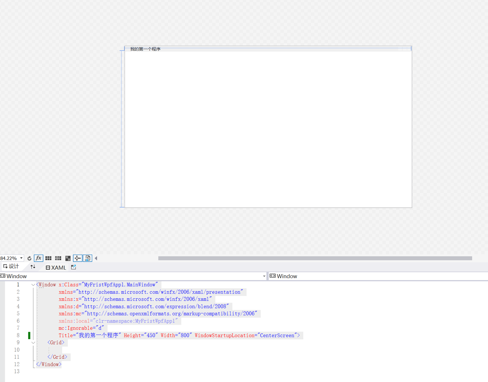
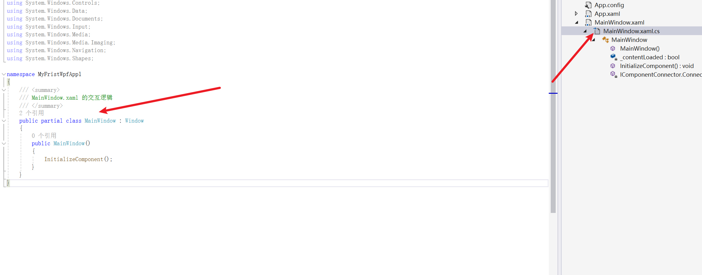

#  1.第一个程序

```xml
<Window x:Class="MyFristWpfApp1.MainWindow"
        xmlns="http://schemas.microsoft.com/winfx/2006/xaml/presentation"
        xmlns:x="http://schemas.microsoft.com/winfx/2006/xaml"
        xmlns:d="http://schemas.microsoft.com/expression/blend/2008"
        xmlns:mc="http://schemas.openxmlformats.org/markup-compatibility/2006"
        xmlns:local="clr-namespace:MyFristWpfApp1"
        mc:Ignorable="d"
        Title="我的第一个程序" Height="450" Width="800" WindowStartupLocation="CenterScreen">
    <Grid>
        
    </Grid>
</Window>
```

 

##  wpf命名空间

```xml
<Window x:Class="MyFristWpfApp1.MainWindow"
        xmlns="http://schemas.microsoft.com/winfx/2006/xaml/presentation"
        xmlns:x="http://schemas.microsoft.com/winfx/2006/xaml"
        xmlns:d="http://schemas.microsoft.com/expression/blend/2008"
        xmlns:mc="http://schemas.openxmlformats.org/markup-compatibility/2006"
        xmlns:local="clr-namespace:MyFristWpfApp1"
        mc:Ignorable="d"
        Title="我的第一个程序" Height="450" Width="800" WindowStartupLocation="CenterScreen">
    <Grid>
        
    </Grid>
</Window>
```

这个文档包括两个元素：顶级的indow元素和一个Grid元素，indow元素代表整个窗口，在Grid元素中可以放置所有的空间。

**wpf中的顶级元素只能有三个，window、application和page。**

##  MainWindow.xml文件中window元素中各个属性的含义

###  x:Class

`x:Class="MyFristWpfApp1.MainWindow"`

指的是



xaml配置文件下的MainWindow中的namespace

###   xmlns--xml的命名空间

`xmlns="http://schemas.microsoft.com/winfx/2006/xaml/presentation"`

这个指代的是xml的命名空间，这个命名空间是默认的命名空间，代表如下

```c#
using System;
using System.Collections.Generic;
using System.Linq;
using System.Text;
using System.Threading.Tasks;
using System.Windows;
using System.Windows.Controls;
using System.Windows.Data;
using System.Windows.Documents;
using System.Windows.Input;
using System.Windows.Media;
using System.Windows.Media.Imaging;
using System.Windows.Navigation;
using System.Windows.Shapes;
```

PS:这个命名空间是wpF核心命名空间。它包含了所有wPF类。在xal中我们可以直接使用这些命名空间
中的类型，而不需要使用前缀（完全限定名）

###  xmlns:x

`xmlns:x="http://schemas.microsoft.com/winfx/2006/xaml"`

这个命名空间是L命名空间。它包含各种rL实用特性，这些特性可以影响文档的解析方式。该命名空间被映射为前缀x。也就是说可以通过在元素命名之前放置命名空间前缀x来使用这个命名空间。例如：`<x：c>`

###  xmIns:d

`xmIns:d=http://schemas.microsoft.com/expression/blend/2008"`
“d”:L名称空间用于设计器支持，也就是设计阶段的各种属性只景响x1设计效果，运行时候不响。

###  xmlns:mc

`xmlns:mc=http://schemas.openxmlformats.org/markup=compatibility/2006"`
“mc:”表示用于读取XL的标记兼容模式。通常“d:”前缀与属性mc:Igorable关联。这种技术使得运行时
XAML解析器能的够忽略“d：”中的设计属性。

###  me:Ignorable=d

`me:Ignorable=”d”`
d就是设计时的状态，Igorable"d”就是告诉编译器在实际运行时，您略设计时设计的值。

###  xmlns:local

`xmlns:local="clr-namespace:MyFirstWPFApp"`
local表示本地项目所用的命名空间，规范要求就是本地命名空间用：clx-namespace:名称

### Title

`Title="MainWindow Height=*350"Width=525"`
窗体标题和尺寸。

##  APP.xmal

```xml
<Application x:Class="MyFristWpfApp1.App"
             xmlns="http://schemas.microsoft.com/winfx/2006/xaml/presentation"
             xmlns:x="http://schemas.microsoft.com/winfx/2006/xaml"
             xmlns:local="clr-namespace:MyFristWpfApp1"
             StartupUri="MainWindow.xaml">
    <Application.Resources>
         
    </Application.Resources>
</Application>
```

最重要的是StartupUri元素，它指定了启动的窗口文件


StartupUri="MainWindow.Xaml”表示默认的启动窗体，这个窗体就是主窗体。
Application这个类的实例就代表了应用程序本身，通过它就能控制应用程序的启动、停止、事件处理等一系列任务。Application常用的方法如下：

- (1)Run()方法，将已经创健的应用程序对象开始运行，也成为激活。调用该方法时，可以带一个窗体名作为实参，也可以无参数。这个方法会触发Application的Startup事件。（后面综合练习中详细使用）
- （2)Shutdown()方法，无论用哪种方式启动的应用程序，都可以通过Application.Current来作为Application的实例，并调用Shutdown0方法主动结束程序的运行。当程序退出的时候，发Exit事件。