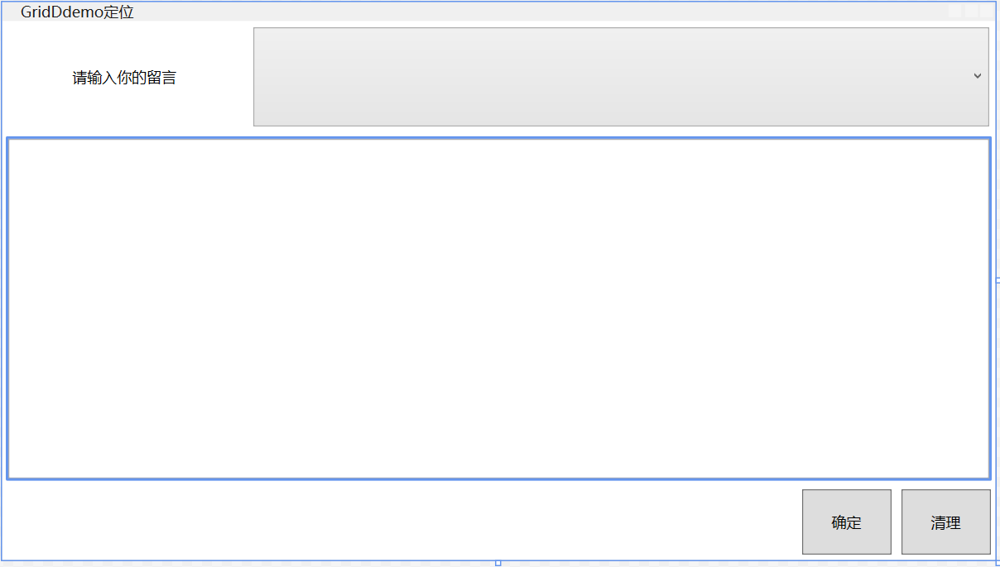
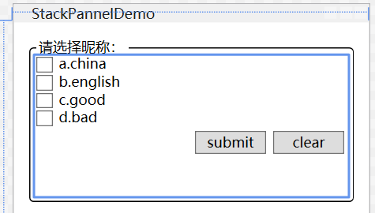
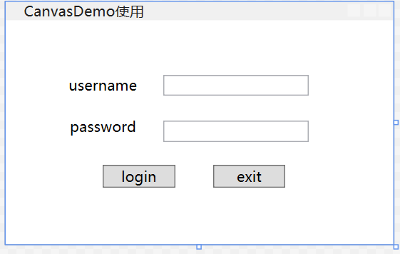

## 1.WPF布局

原则：

- 1.做适应性程序，不要显示设置元素的尺寸，只设置最大最小值
- 2.不要使用屏幕坐标指定元素位置，元素位置有其所在容器指定
- 2.布局容器可以嵌套

常见容器

- grid面板
- stackPanel面板
- Canvens面板
- DockPanel面板
- wrapPanel面板

## 2.Grid面板（类似于一个table）

特点：1.可以定义任意行和列，可以跨行、跨列

2.行列宽度可以设置为绝对值、相对比例、自动调整等方式

应用场景：

1.UI的大布局设计

2.ui整体尺寸需要改变时。

```xaml
    <Grid>
        <Grid.RowDefinitions>
            <RowDefinition Height="90*"/>
            <RowDefinition Height="284*"/>
            <RowDefinition Height="61*"/>
        </Grid.RowDefinitions>
        <Grid.ColumnDefinitions>
            <ColumnDefinition Width="197*"/>
            <ColumnDefinition Width="443*"/>
            <ColumnDefinition Width="80*"/>
            <ColumnDefinition Width="80*"/>
        </Grid.ColumnDefinitions>
        <Label x:Name="label" Content="请输入你的留言"  Margin="5,2" Height="25" Grid.Column="0" Grid.Row="0" HorizontalContentAlignment="Center"/>
        <ComboBox x:Name="cbbType" Grid.Column="1" Grid.Row="0"  Margin="5,5,5,5" Grid.ColumnSpan="3"/>
        <TextBox x:Name="txtContent" Grid.ColumnSpan="4" Grid.Column="0" Margin="5,5,5,5" Grid.Row="1" />
        <Button x:Name="btnSub" Grid.Column="2" Content="确定"  Margin="4,4,4,4" Grid.Row="2" />
        <Button x:Name="btnClear" Grid.Column="3" Content="清理"  Margin="4,4,4,4" Grid.Row="2" />


    </Grid>
```



## 3.StackPanel面板

【1】布局特点
第一、可以把内部元素在纵向域者横向上紧凑排列，形成栈式布局，通俗来说就是把元素堆到一块。
第二、当把前面的元素去掉后，后面的会整体向前移动，占领原有元素空间。
【2】适用场合
第一、同类型原型需要紧凑排列（比如制作菜单或者列婊）
第二、移除其中的元素后能的够自动补缺的布局，或者动画。
【3】三个属性
第一、Orientaion属性：决定内部元素是横向还是纵向积累。
第二、HorizontalAlignment属性：决定内部元素水平方上的对齐方式。
第三、VerticalAlignment属性：决定内元素垂直方向上的对齐方式。

```xaml
<Window x:Class="WpfApp1.StackPannelDemo"
        xmlns="http://schemas.microsoft.com/winfx/2006/xaml/presentation"
        xmlns:x="http://schemas.microsoft.com/winfx/2006/xaml"
        xmlns:d="http://schemas.microsoft.com/expression/blend/2008"
        xmlns:mc="http://schemas.openxmlformats.org/markup-compatibility/2006"
        xmlns:local="clr-namespace:WpfApp1"
        mc:Ignorable="d"
        Title="StackPannelDemo" Height="180" Width="300" WindowStartupLocation="CenterScreen">
    <Grid>
        <GroupBox Header="请选择昵称：" Margin="12" BorderBrush="Black">
            <StackPanel>
                <CheckBox Content="a.china"/>
                <CheckBox Content="b.english"/>
                <CheckBox Content="c.good"/>
                <CheckBox Content="d.bad"/>
                <StackPanel Orientation="Horizontal" HorizontalAlignment="Right">
                    <Button x:Name="btnSub" Content="submit" Width="60" Margin="3"/>
                    <Button x:Name="btnClear" Content="clear" Width="60" Margin="3"/>
                </StackPanel>
            </StackPanel>
        </GroupBox>
        
    </Grid>
</Window>
```



## 4.Canvas面板（译文：画布）


【1】布局特点
第一、在面板内部，我们可以通过x和y的坐标属性，直接控制控件的位置，非常类似winform中的top
和Ieft定位。
第二、我们可以直接通过拖放的形式选择控件的位置。
【2】适用场合
第一、一经设计基本上不会有改动的小布局。
第二、需要使用绝对定位的布局。
第三、依赖于横纵坐标的动画。

```xaml
<Window x:Class="WpfApp1.CanvasDemo"
        xmlns="http://schemas.microsoft.com/winfx/2006/xaml/presentation"
        xmlns:x="http://schemas.microsoft.com/winfx/2006/xaml"
        xmlns:d="http://schemas.microsoft.com/expression/blend/2008"
        xmlns:mc="http://schemas.openxmlformats.org/markup-compatibility/2006"
        xmlns:local="clr-namespace:WpfApp1"
        mc:Ignorable="d"
        Title="CanvasDemo使用" Height="200" Width="320" WindowStartupLocation="CenterOwner">
    <Grid>
        <Canvas Margin="10">
            <Label Content="username" Canvas.Left="37" Canvas.Top="31"/>
            <TextBox x:Name="txtUsername" Canvas.Left="120" VerticalContentAlignment="Center" Canvas.Top="35" Width="120"/>
            <Label Content="password" Canvas.Left="38" Canvas.Top="65" RenderTransformOrigin="-0.277,-0.59" HorizontalAlignment="Left" VerticalAlignment="Center"/>
            <PasswordBox x:Name="txtPassword" Canvas.Left="120" VerticalContentAlignment="Center" Canvas.Top="73" Width="120" HorizontalAlignment="Center" VerticalAlignment="Top"/>
            <Button x:Name="btnLogin" Content="login" Width="60" Canvas.Left="70" Canvas.Top="109"/>
            <Button x:Name="btnExit" Content="exit" Width="60" Canvas.Left="161" Canvas.Top="109" HorizontalAlignment="Left" VerticalAlignment="Center"/>

        </Canvas>
    </Grid>
</Window>
```



​	

## 5.DockPanel面板（停靠）

【1】布局特点
根据Dock属性值，元素向指定访向累积，切吩DockPanel内部剩余空间，就像船舶停靠一样。
【2】适用场合
需要自动填满乘剩余空间的布局。（最后一个元素自动填满DockPanel内的乘剩余空间）

```xaml
<Window x:Class="WpfApp1.DockPanelDemo"
        xmlns="http://schemas.microsoft.com/winfx/2006/xaml/presentation"
        xmlns:x="http://schemas.microsoft.com/winfx/2006/xaml"
        xmlns:d="http://schemas.microsoft.com/expression/blend/2008"
        xmlns:mc="http://schemas.openxmlformats.org/markup-compatibility/2006"
        xmlns:local="clr-namespace:WpfApp1"
        mc:Ignorable="d"
        Title="DockPanelDemo" Height="300" Width="400" WindowStartupLocation="CenterScreen">
    <Grid>
        <DockPanel>
            <TextBox DockPanel.Dock="Top" BorderBrush="Black" Height="30"/>
            <TreeView DockPanel.Dock="Left" BorderBrush="Black" Width="60"/>
            <ListBox BorderBrush="Black"/>
        </DockPanel>
    </Grid>
</Window>
```


## 6.WrapPanel面板（流式布局，类似web中div的loat)

【1】布局特点
第一、在流延伸的方向上会排列尽可能多的控件，排列不下的控件会新起一行。
第二、使用Orientaion属性控制流延伸的方向。
【2】适用场合
需要根据容器大小动态排列控件的场合。

```xaml
<Window x:Class="WpfApp1.wrapPanelDemo"
        xmlns="http://schemas.microsoft.com/winfx/2006/xaml/presentation"
        xmlns:x="http://schemas.microsoft.com/winfx/2006/xaml"
        xmlns:d="http://schemas.microsoft.com/expression/blend/2008"
        xmlns:mc="http://schemas.openxmlformats.org/markup-compatibility/2006"
        xmlns:local="clr-namespace:WpfApp1"
        mc:Ignorable="d"
        Title="wrapPanelDemo" Height="200" Width="300" WindowStartupLocation="CenterScreen">
    <Grid>
        <WrapPanel>
            <Button Content="11" Width="30" Height="30"/>
            <Button Content="11" Width="30" Height="30"/>
            <Button Content="11" Width="30" Height="30"/>
            <Button Content="11" Width="30" Height="30"/>
            <Button Content="11" Width="30" Height="30"/>
            <Button Content="11" Width="30" Height="30"/>
            <Button Content="11" Width="30" Height="30"/>
            <Button Content="11" Width="30" Height="30"/>
            <Button Content="11" Width="30" Height="30"/>
            <Button Content="11" Width="30" Height="30"/>
            <Button Content="11" Width="30" Height="30"/>
        </WrapPanel>
    </Grid>
</Window>
```


