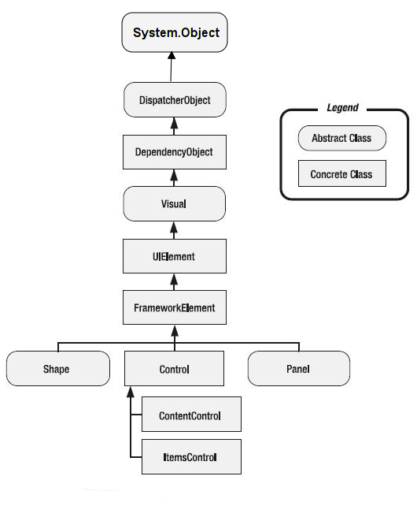

## 1.Application类

```c#
namespace System.Windows
{
    //
    // 摘要:
    //     封装 Windows Presentation Foundation (WPF) 应用程序。
    public class Application : DispatcherObject, IHaveResources, IQueryAmbient
    {
        [SecurityCritical]
        public Application();
        //获取或设置 System.Reflection.Assembly 提供包 统一资源标识符 (URI) 中的资源 WPF 应用程序。        
        public static Assembly ResourceAssembly { get; set; }
 
        //获取 System.Windows.Application 当前对象 System.AppDomain。
        public static Application Current { get; }
 
        //获取应用程序中实例化的窗口。
        public WindowCollection Windows { get; }
 
        //获取或设置该应用程序的主窗口。
        public Window MainWindow { get; set; }
 
        //获取或设置导致的情况， System.Windows.Application.Shutdown 来调用方法。
        public ShutdownMode ShutdownMode { get; set; }
 
        //获取或设置应用程序范围的资源，如样式和画笔的集合。
        [Ambient]
        public ResourceDictionary Resources { get; set; }
 
        //获取或设置 UI 一个应用程序启动时自动显示。
        public Uri StartupUri { get; set; }
 
        //获取应用程序作用域属性的集合。
        public IDictionary Properties { get; }
 
        
        public event EventHandler Deactivated;
        public event SessionEndingCancelEventHandler SessionEnding;
        public event DispatcherUnhandledExceptionEventHandler DispatcherUnhandledException;
        public event NavigatingCancelEventHandler Navigating;
        public event NavigatedEventHandler Navigated;
        public event NavigationProgressEventHandler NavigationProgress;
        public event NavigationFailedEventHandler NavigationFailed;
        public event LoadCompletedEventHandler LoadCompleted;
        public event EventHandler Activated;
        public event NavigationStoppedEventHandler NavigationStopped;
        public event FragmentNavigationEventHandler FragmentNavigation;
 
        public static StreamResourceInfo GetContentStream(Uri uriContent);
        public static string GetCookie(Uri uri);
        public static StreamResourceInfo GetRemoteStream(Uri uriRemote);
        public static StreamResourceInfo GetResourceStream(Uri uriResource);
        public static object LoadComponent(Uri resourceLocator);
        public static void LoadComponent(object component, Uri resourceLocator);
        public static void SetCookie(Uri uri, string value);
        public object FindResource(object resourceKey);
        public int Run(Window window);
        public int Run();
        public void Shutdown();
        public void Shutdown(int exitCode);
        public object TryFindResource(object resourceKey);
        protected virtual void OnActivated(EventArgs e);
        protected virtual void OnDeactivated(EventArgs e);
        protected virtual void OnExit(ExitEventArgs e);
        protected virtual void OnFragmentNavigation(FragmentNavigationEventArgs e);
        protected virtual void OnLoadCompleted(NavigationEventArgs e);
        protected virtual void OnNavigated(NavigationEventArgs e);
        protected virtual void OnNavigating(NavigatingCancelEventArgs e);
        protected virtual void OnNavigationFailed(NavigationFailedEventArgs e);
        protected virtual void OnNavigationProgress(NavigationProgressEventArgs e);
        protected virtual void OnNavigationStopped(NavigationEventArgs e);
        protected virtual void OnSessionEnding(SessionEndingCancelEventArgs e);
        protected virtual void OnStartup(StartupEventArgs e);
 
    }
}
```

Application类继承于DispatcherObject父类，DispatcherObject是WPF的最终抽象基类.

应用程序会包括多个窗体、对话框等界面，这些窗体和对话框就是这些不同的房间；在众多的窗体中，会有一个主窗体，也就是Application类的MainWindow属性

Application类的StartupUri 属性。**StartupUri属性是Uri类型，即统一资源标识符 (URI)，它可以指定应用程序第一次启动时显示的用户界面 (UI)。**

**（资源）放在Application的Resources属性**中即可。换句话，我们希望窗体的背景颜色、字体大小、对各种控件所设计的模板样式等内容，全部都只需要放到Resources属性中，这样整个应用都会从Resources中去获取我们提供的资源，并最终呈现出我们想要的样子。

## 2.Application生命周期

启动WPF应用时，首先被执行的是OnStartup方法，其次是OnActivated方法，如果我们把当前应用最小化或切换到其它程序时，这时OnDeactivated会被执行，再切回来时再次执行OnActivated方法，最后，当我们关闭程序时，OnDeactivated会再次被执行，最后执行的是OnExit方法。


Application的生命周期

OnStartup->OnActivated->OnDeactivated->OnExit

- OnStartup：表示启动应用程序时
- OnActivated：表示激活应用程序时
- OnDeactivated：表示由激活状态变为非激活状态时
- OnExit：表示退出应用程序时

```c#
/// <summary>
/// App.xaml 的交互逻辑
/// </summary>
public partial class App : Application
{

    protected override void OnStartup(StartupEventArgs e)
    {
        base.OnStartup(e);
        Console.WriteLine("1.App OnStartup被调用");
    }

    protected override void OnActivated(EventArgs e)
    {
        base.OnActivated(e);
        Console.WriteLine("2.App OnActivated被调用");
    }

    protected override void OnDeactivated(EventArgs e)
    {
        base.OnDeactivated(e);
        Console.WriteLine("3.App OnDeactivated被调用");

    }

    protected override void OnExit(ExitEventArgs e)
    {
        base.OnExit(e);
        Console.WriteLine("4.App OnExit被调用");
    }
}
```

执行日志

```
1.App OnStartup被调用
“Wpfsession1.exe”(CLR v4.0.30319: Wpfsession1.exe): 已加...
“Wpfsession1.exe”(CLR v4.0.30319: Wpfsession1.exe): 已加...。
“Wpfsession1.exe”(CLR v4.0.30319: Wpfsession1.exe): 已加...
“Wpfsession1.exe”(CLR v4.0.30319: Wpfsession1.exe): 已加载...
“Wpfsession1.exe”(CLR v4.0.30319: Wpfsession1.exe): 已加...
“Wpfsession1.exe”(CLR v4.0.30319: Wpfsession1.exe): 已加载...
“Wpfsession1.exe”(CLR v4.0.30319: Wpfsession1.exe): 已加载...
“Wpfsession1.exe”(CLR v4.0.30319: Wpfsession1.exe): 已加...
“Wpfsession1.exe”(CLR v4.0.30319: Wpfsession1.exe): 已加...
“Wpfsession1.exe”(CLR v4.0.30319: Wpfsession1.exe): 已加...
2.App OnActivated被调用
“Wpfsession1.exe”(CLR v4.0.30319: Wpfsession1.exe): 已加...
“Wpfsession1.exe”(CLR v4.0.30319: Wpfsession1.exe): 已加...
3.App OnDeactivated被调用
2.App OnActivated被调用
3.App OnDeactivated被调用
4.App OnExit被调用
```

## 3.Window生命周期

观察这些输出结果，与我们订阅事件的代码顺序一致，唯独少了Unloaded的结果输出。因为Unloaded事件没有被触发。下面我们将分析一下这些事件分别代表什么含义。

| SourceInitialized | 创建窗体源时引发此事件                         |
| ----------------- | ---------------------------------------------- |
| Activated         | 当前窗体成为前台窗体时引发此事件               |
| Loaded            | 当前窗体内部所有元素完成布局和呈现时引发此事件 |
| ContentRendered   | 当前窗体的内容呈现之后引发此事件               |
| Closing           | 当前窗体关闭之前引发此事件                     |
| Deactivated       | 当前窗体成为后台窗体时引发此事件               |
| Closed            | 当前窗体关闭之后引发此事件                     |
| Unloaded          | 当前窗体从元素树中删除时引发此事件             |

Window窗体的生命周期应如下图所示：


```c#
public MainWindow()
{
    InitializeComponent();

    this.SourceInitialized += (s, e) =>
    {
        Console.WriteLine("1.MainWindow SourceInitialized被调用");
    };

    this.Activated += (s, e) =>
    {
        Console.WriteLine("2.MainWindow Activateed被调用");
    };

    this.Loaded += (s, e) =>
    {
        Console.WriteLine("3.MainWindow Loaded被调用");
    };

    this.ContentRendered += (s, e) =>
    {
        Console.WriteLine("4.MainWindow ContentRendered被调用");
    };

    this.Deactivated += (s, e) =>
    {
        Console.WriteLine("5.MainWindow Deactivated被调用");
    };

    this.Closing += (s, e) =>
    {
        Console.WriteLine("6.MainWindow Closing被调用");
    };  

    this.Unloaded += (s, e) =>
    {
        Console.WriteLine("7.MainWindow Unloaded被调用");
    };
}
```

执行结果

```
2.App OnActivated被调用
2.MainWindow Activateed被调用
“Wpfsession1.exe”(CLR v4.0.30319: Wpfsession1.exe): 已加...
“Wpfsession1.exe”(CLR v4.0.30319: Wpfsession1.exe): 已加...
3.MainWindow Loaded被调用
4.MainWindow ContentRendered被调用
“Wpfsession1.exe”(CLR v4.0.30319: Wpfsession1.exe): 已加...
5.MainWindow Deactivated被调用
3.App OnDeactivated被调用
2.App OnActivated被调用
2.MainWindow Activateed被调用
6.MainWindow Closing被调用
5.MainWindow Deactivated被调用
3.App OnDeactivated被调用
4.App OnExit被调用
程序“[8544] Wpfsession1.exe”已退出，返回值为 0 (0x0)。
```

## 4.window窗体组成

Window窗体本质上也是一个控件，只不过它和一般控件有所区别。比如它具有Closing和Closed事件，而一般控件是不可以关闭的；另外，Window窗体可以容纳其它控件，最后，窗体由两部分构成，即工作区和非工作区。


**非工作区**

非工作区主要包含以下几个要素，它们分别是：图标、标题、窗体菜单、最小化按钮、最大化按钮、关闭按钮、窗体边框、右下角鼠标拖动调整窗体尺寸。

**工作区**

本质上是指Window类的Content属性。Content属性表示窗体的内容，类型为object，即可以是任意的引用类型 。需要注意的是，Content属性并不在Window类中，而在它的父类ContentControl类中。

**技术细节**

默认的<Window></Window>之中只能存在一个控件，就是因为Content是object类型，意思是只接受一个对象。那如何向窗体中增加多个控件呢？微软给出了示例，就是先放一个Grid 布局控件，因为Grid控件是一个集合控件，我们可以将多个控件放在Grid控件中，关于这些知识的扩展，我们将在WPF的《可视化树》章节中详细的探讨。

## 5.总父类

微软在设计WPF框架时，做了一些非常经典且合理的代码架构。我们在开发程序时可能会用到各种各样的控件，这些控件的功能可能各不相同，甚至包括它们的属性、事件和方法，于是微软的工程师们将相同的方法成员或属性成员进行了层层抽象，并写入到一个又一个的父类中，最后让这些控件去继承父类即可。

控件的父类们(准确的说，应该叫父类的父类的父类)，至少有如下几个类型：

- DispatcherObject
- DependencyObject
- Visual
- UIElement
- FrameworkElement

WPF几乎所有的控件都从上面这五个父类继承，它们的相互继承关系，形成了一棵树。


## 6.DispatcherObject类

.NET为WPF准备了两个线程（WPF应用启动时），分别用于呈现界面（后台线程）和管理界面（UI线程）。后台线程一直隐藏于后台默默运行，我们感知不到，我们唯一能操作的就是UI线程。

绝大多数对象或控件都必须在UI线程上创建，而且，其它后台子线程不能直接访问UI线程上的控件，那么，后台线程非要访问UI线程的控件或对象，该怎么办呢？微软在UI线程上提供一个中间商Dispatcher（调度员），将Dispatcher放到一个抽象类DispatcherObject，**我所有的控件都从这个DispatcherObject类继承**，这样当你们在后台线程中要访问控件时，就可以从控件中找到那位中间商Dispatcher，由中间商来完成你要对控件的操作访问。

> 官方解释
>
> 在 WPF 中， DispatcherObject 只能由 Dispatcher 它与之关联的访问。 例如，后台线程无法更新与 Dispatcher UI 线程上关联的内容Button。 为了使后台线程访问该 Content 属性 Button，后台线程必须将工作委托给 Dispatcher 与 UI 线程关联的工作。 这是通过使用 Invoke 或BeginInvoke。 Invoke 是同步的， BeginInvoke 是异步的。 操作将添加到指定DispatcherPriority位置的队列Dispatcher中。

### 示例

```c#
    public partial class MainWindow : Window
    {
        public MainWindow()
        {
            InitializeComponent();

            this.Loaded += MainWindow_Loaded;
        }

        private void MainWindow_Loaded(object sender, RoutedEventArgs e)
        {
           
            Task.Run(() =>
            {
                btn.Dispatcher.Invoke(() =>
                {
                    btn.Content = "Hello World";
                });
            });
        }
    }
```

我们利用Task工厂创建了一个子线程（后台线程），然后调用了button的Dispatcher调度员，其Invoke方法中传入了一个匿名函数，在这个匿名函数中去改变button按钮的Content属性。

为什么button按钮有Dispatcher？因为button按钮继承了WPF的带头大哥DispatcherObject类，而DispatcherObject类有Dispatcher成员。

那么DispatcherObject 类的主要方针路线到底是什么呢？主要有两个职责：

- 提供对对象所关联的当前 Dispatcher 的访问权限，意思是说谁继承了它，谁就拥有了Dispatcher。
- 提供方法以检查 (CheckAccess) 和验证 (VerifyAccess) 某个线程是否有权访问对象（派生于 DispatcherObject）。CheckAccess 与 VerifyAccess 的区别在于 CheckAccess 返回一个布尔值，表示当前线程是否有可以使用的对象，而 VerifyAccess 则在线程无权访问对象的情况下引发异常。

## 7.DependencyObject类

微软在WPF框架中推出了更省事的处理方式——数据驱动模式。什么是数据驱动模式？**控件的属性不再被直接赋值，而是绑定了另一个”变量“，当这个”变量“发生改变时，控件的属性也会跟着改变，这样的属性也被称为依赖属性。**这有点像初中数学中的y=x这样的函数，y是因变量，x是自变量，y随着x的变化而变化。

WPF控件的所有属性都可以采用这种模式去更新属性的值，为什么？因为所有控件都继承了DependencyObject这个基类。换句话说，也只有继承了这个基类的控件

DependencyObject 类表示参与依赖属性系统的对象。属性系统的主要功能是计算属性的值，并提供有关已更改的值的系统通知。 参与属性系统的另一个类 DependencyProperty。 DependencyProperty 允许将依赖属性注册到属性系统，并提供有关每个依赖属性的标识和信息，而 DependencyObject 为基类，使对象能够使用此依赖属性。
INotifyPropertyChanged 类用于通知UI刷新，注重的仅仅是数据更新后的通知。DependencyObject 类用于给UI添加依赖和附加属性，注重数据与UI的关联。如果简单的数据通知，两者都可以实现的。

## 8.Visual类

Visual类是WPF框架中第三个父类，主要是为 WPF 中的呈现提供支持，其中包括命中测试、坐标转换和边界框计算。它位于程序集:PresentationCore.dll库文件中，它的命名空间:System.Windows.Media。

> 官方引用
>
> Visual 类是派生每个 FrameworkElement 对象的基本抽象。 该类还用作在 WPF 中编写新控件的入口点，在 Win32 应用程序模型中，该类在许多方面可视为窗口句柄 (HWND)。Visual 对象是一个核心 WPF 对象，它的主要作用是提供呈现支持。 用户界面控件如 Button 和 TextBox）派生自 Visual 类，并使用该类来保存它们的呈现数据。 Visual 对象为以下项提供支持：
> 输出显示：呈现视觉对象的持久、序列化的绘图内容。
> 转换：针对视觉对象执行转换。
> 剪裁：为视觉对象提供剪裁区域支持。
> 命中测试：确定坐标或几何形状是否包含在视觉对象的边界内。
> 边框计算：确定视觉对象的边框。


换句话说，将来我们要学习的Button、TextBox、CheckBox、Gird、ListBox等所有控件都继承了Visual类，控件在绘制到界面的过程中，涉及到转换、裁剪、边框计算等功能，都是使用了Visual父类的功能。

### 定义

```c#
public abstract class Visual : DependencyObject, IResource
{
    protected Visual();
 
    protected DependencyObject VisualParent { get; }
    protected virtual int VisualChildrenCount { get; }
    protected internal DoubleCollection VisualYSnappingGuidelines { get; protected set; }
    protected internal Vector VisualOffset { get; protected set; }
    protected internal Geometry VisualClip { get; protected set; }
    protected internal Rect? VisualScrollableAreaClip { get; protected set; }
    protected internal CacheMode VisualCacheMode { get; protected set; }
    protected internal BitmapEffectInput VisualBitmapEffectInput { get; protected set; }
    protected internal BitmapEffect VisualBitmapEffect { get; protected set; }
    protected internal Effect VisualEffect { get; protected set; }
    protected internal Transform VisualTransform { get; protected set; }
    protected internal BitmapScalingMode VisualBitmapScalingMode { get; protected set; }
    protected internal DoubleCollection VisualXSnappingGuidelines { get; protected set; }
    protected internal double VisualOpacity { get; protected set; }
    protected internal EdgeMode VisualEdgeMode { get; protected set; }
    protected internal ClearTypeHint VisualClearTypeHint { get; set; }
    protected internal TextRenderingMode VisualTextRenderingMode { get; set; }
    protected internal TextHintingMode VisualTextHintingMode { get; set; }
    protected internal Brush VisualOpacityMask { get; protected set; }
 
    public DependencyObject FindCommonVisualAncestor(DependencyObject otherVisual);
    public bool IsAncestorOf(DependencyObject descendant);
    public bool IsDescendantOf(DependencyObject ancestor);
    public Point PointFromScreen(Point point);
    public Point PointToScreen(Point point);
    public GeneralTransform2DTo3D TransformToAncestor(Visual3D ancestor);
    public GeneralTransform TransformToAncestor(Visual ancestor);
    public GeneralTransform TransformToDescendant(Visual descendant);
    public GeneralTransform TransformToVisual(Visual visual);
    protected void AddVisualChild(Visual child);
    protected virtual Visual GetVisualChild(int index);
    protected virtual GeometryHitTestResult HitTestCore(GeometryHitTestParameters hitTestParameters);
    protected virtual HitTestResult HitTestCore(PointHitTestParameters hitTestParameters);
    protected virtual void OnDpiChanged(DpiScale oldDpi, DpiScale newDpi);
    protected void RemoveVisualChild(Visual child);
    protected internal virtual void OnVisualChildrenChanged(DependencyObject visualAdded, DependencyObject visualRemoved);
    protected internal virtual void OnVisualParentChanged(DependencyObject oldParent);
 
}
```

首先，我们可以看到，Visual类继承了DependencyObject类。另外Visual类是一个抽象类，不可以被实例。Visual类提供了一系列的属性和方法。我们在这里捡一些比较重要的分析一下。

VisualParent属性：这个属性表示获取一个可视化父对象。因为XAML的代码结构就是一棵xml树，每个控件都对象几乎都有一个可视化父对象。

VisualChildrenCount属性：获取当前对象的子元素数量。

VisualOffset属性：指当前可视对象的偏移量值。需要注意的是这个属性被声明成protected internal。啥意思呢？VisualOffset属性只能由同一个程序集的其它类访问，或Visual的子类访问。

> protected internal
>
> `protected internal` 关键字组合是一种成员访问修饰符， 表示受保护的内部成员。

VisualOpacity属性：获取或设置 Visual 的不透明度。

VisualEffect属性：获取或设置要应用于 Visual 的位图效果。

VisualTransform属性：获取或设置 Transform 的 Visual 值。

我们真正能在继承的控件中直接使用的是Visual类中被声明为public的方法成员。它们有以下几个：

- DependencyObject **FindCommonVisualAncestor**(DependencyObject otherVisual); //返回两个可视对象的公共上级。
- bool **IsAncestorOf**(DependencyObject descendant); //确定可视对象是否为后代可视对象的上级。
- bool **IsDescendantOf**(DependencyObject ancestor); //确定可视对象是否为上级可视对象的后代。
- Point **PointFromScreen**(Point point); //将屏幕坐标中的 Point 转换为表示 Point 的当前坐标系的 Visual。
- Point **PointToScreen**(Point point); //将表示 Point 的当前坐标系的 Visual 转换为屏幕坐标中的 Point。
- GeneralTransform2DTo3D **TransformToAncestor**(Visual3D ancestor); //返回一个转换，该转换可用于将 Visual 中的坐标转换为可视对象的指定 Visual3D 上级。
- GeneralTransform **TransformToAncestor**(Visual ancestor); //返回一个转换，该转换可用于将 Visual 中的坐标转换为可视对象的指定 Visual 上级。
- GeneralTransform **TransformToDescendant**(Visual descendant); //返回一个转换，该转换可用于将 Visual 中的坐标转换为指定的可视对象后代。
- GeneralTransform **TransformToVisual**(Visual visual); //返回一个转换，该转换可用于将 Visual 中的坐标转换为指定的可视对象。

由此可见，Visual类所做的事情只为控件呈现相关，但还不是去呈现控件，只是提供呈现的基础。那么，谁又去继承了Visual类，成为继Visual类之后又一个控件的基类呢？答案是UIElement类。

## 9.UIElement类

这个基类非常非常重要，理解了这个类，就理解了WPF所有控件1/3的知识与用法。我们先来看一下它的全貌。

```c#
public class UIElement : Visual, IAnimatable, IInputElement
{
public static readonly RoutedEvent PreviewMouseDownEvent;
public static readonly DependencyProperty AreAnyTouchesOverProperty;
public static readonly DependencyProperty AreAnyTouchesDirectlyOverProperty;
public static readonly DependencyProperty IsKeyboardFocusedProperty;
public static readonly DependencyProperty IsStylusCaptureWithinProperty;
public static readonly DependencyProperty IsStylusCapturedProperty;
public static readonly DependencyProperty IsMouseCaptureWithinProperty;
public static readonly DependencyProperty IsMouseCapturedProperty;
public static readonly DependencyProperty IsKeyboardFocusWithinProperty;
public static readonly DependencyProperty IsStylusOverProperty;
public static readonly DependencyProperty IsMouseOverProperty;
public static readonly DependencyProperty IsMouseDirectlyOverProperty;
public static readonly RoutedEvent TouchLeaveEvent;
public static readonly RoutedEvent TouchEnterEvent;
public static readonly RoutedEvent LostTouchCaptureEvent;
public static readonly RoutedEvent GotTouchCaptureEvent;
public static readonly RoutedEvent TouchUpEvent;
public static readonly RoutedEvent PreviewTouchUpEvent;
public static readonly RoutedEvent TouchMoveEvent;
public static readonly RoutedEvent PreviewTouchMoveEvent;
public static readonly RoutedEvent TouchDownEvent;
public static readonly RoutedEvent PreviewTouchDownEvent;
public static readonly RoutedEvent DropEvent;
public static readonly RoutedEvent PreviewDropEvent;
public static readonly RoutedEvent DragLeaveEvent;
public static readonly RoutedEvent PreviewDragLeaveEvent;
public static readonly DependencyProperty AreAnyTouchesCapturedProperty;
public static readonly DependencyProperty AreAnyTouchesCapturedWithinProperty;
public static readonly DependencyProperty AllowDropProperty;
public static readonly DependencyProperty RenderTransformProperty;
public static readonly RoutedEvent ManipulationCompletedEvent;
public static readonly RoutedEvent ManipulationBoundaryFeedbackEvent;
public static readonly RoutedEvent ManipulationInertiaStartingEvent;
public static readonly RoutedEvent ManipulationDeltaEvent;
public static readonly RoutedEvent ManipulationStartedEvent;
public static readonly RoutedEvent ManipulationStartingEvent;
public static readonly DependencyProperty IsManipulationEnabledProperty;
public static readonly DependencyProperty FocusableProperty;
public static readonly DependencyProperty IsVisibleProperty;
public static readonly DependencyProperty IsHitTestVisibleProperty;
public static readonly DependencyProperty IsEnabledProperty;
public static readonly DependencyProperty IsFocusedProperty;
public static readonly RoutedEvent DragOverEvent;
public static readonly RoutedEvent LostFocusEvent;
public static readonly DependencyProperty SnapsToDevicePixelsProperty;
public static readonly DependencyProperty ClipProperty;
public static readonly DependencyProperty ClipToBoundsProperty;
public static readonly DependencyProperty VisibilityProperty;
public static readonly DependencyProperty UidProperty;
public static readonly DependencyProperty CacheModeProperty;
public static readonly DependencyProperty BitmapEffectInputProperty;
public static readonly DependencyProperty EffectProperty;
public static readonly DependencyProperty BitmapEffectProperty;
public static readonly DependencyProperty OpacityMaskProperty;
public static readonly DependencyProperty OpacityProperty;
public static readonly DependencyProperty RenderTransformOriginProperty;
public static readonly RoutedEvent GotFocusEvent;
public static readonly RoutedEvent PreviewDragOverEvent;
public static readonly DependencyProperty IsStylusDirectlyOverProperty;
public static readonly RoutedEvent PreviewDragEnterEvent;
public static readonly RoutedEvent StylusMoveEvent;
public static readonly RoutedEvent PreviewStylusMoveEvent;
public static readonly RoutedEvent StylusUpEvent;
public static readonly RoutedEvent PreviewStylusUpEvent;
public static readonly RoutedEvent StylusDownEvent;
public static readonly RoutedEvent PreviewStylusDownEvent;
public static readonly RoutedEvent QueryCursorEvent;
public static readonly RoutedEvent LostMouseCaptureEvent;
public static readonly RoutedEvent GotMouseCaptureEvent;
public static readonly RoutedEvent MouseLeaveEvent;
public static readonly RoutedEvent MouseEnterEvent;
public static readonly RoutedEvent MouseWheelEvent;
public static readonly RoutedEvent PreviewStylusInAirMoveEvent;
public static readonly RoutedEvent PreviewMouseWheelEvent;
public static readonly RoutedEvent PreviewMouseMoveEvent;
public static readonly RoutedEvent MouseRightButtonUpEvent;
public static readonly RoutedEvent PreviewMouseRightButtonUpEvent;
public static readonly RoutedEvent MouseRightButtonDownEvent;
public static readonly RoutedEvent PreviewMouseRightButtonDownEvent;
public static readonly RoutedEvent DragEnterEvent;
public static readonly RoutedEvent PreviewMouseLeftButtonUpEvent;
public static readonly RoutedEvent MouseLeftButtonDownEvent;
public static readonly RoutedEvent PreviewMouseLeftButtonDownEvent;
public static readonly RoutedEvent MouseUpEvent;
public static readonly RoutedEvent PreviewMouseUpEvent;
public static readonly RoutedEvent MouseDownEvent;
public static readonly RoutedEvent MouseMoveEvent;
public static readonly RoutedEvent StylusInAirMoveEvent;
public static readonly RoutedEvent MouseLeftButtonUpEvent;
public static readonly RoutedEvent StylusLeaveEvent;
public static readonly RoutedEvent StylusEnterEvent;
public static readonly RoutedEvent GiveFeedbackEvent;
public static readonly RoutedEvent PreviewGiveFeedbackEvent;
public static readonly RoutedEvent QueryContinueDragEvent;
public static readonly RoutedEvent TextInputEvent;
public static readonly RoutedEvent PreviewTextInputEvent;
public static readonly RoutedEvent LostKeyboardFocusEvent;
public static readonly RoutedEvent PreviewLostKeyboardFocusEvent;
public static readonly RoutedEvent GotKeyboardFocusEvent;
public static readonly RoutedEvent PreviewGotKeyboardFocusEvent;
public static readonly RoutedEvent KeyUpEvent;
public static readonly RoutedEvent PreviewKeyUpEvent;
public static readonly RoutedEvent KeyDownEvent;
public static readonly RoutedEvent PreviewQueryContinueDragEvent;
public static readonly RoutedEvent PreviewStylusButtonUpEvent;
public static readonly RoutedEvent PreviewKeyDownEvent;
public static readonly RoutedEvent StylusInRangeEvent;
public static readonly RoutedEvent PreviewStylusInRangeEvent;
public static readonly RoutedEvent StylusOutOfRangeEvent;
public static readonly RoutedEvent PreviewStylusSystemGestureEvent;
public static readonly RoutedEvent PreviewStylusOutOfRangeEvent;
public static readonly RoutedEvent GotStylusCaptureEvent;
public static readonly RoutedEvent LostStylusCaptureEvent;
public static readonly RoutedEvent StylusButtonDownEvent;
public static readonly RoutedEvent StylusButtonUpEvent;
public static readonly RoutedEvent PreviewStylusButtonDownEvent;
public static readonly RoutedEvent StylusSystemGestureEvent;
 
public UIElement();
 
public string Uid { get; set; }
public Visibility Visibility { get; set; }
public bool ClipToBounds { get; set; }
public Geometry Clip { get; set; }
public bool SnapsToDevicePixels { get; set; }
public bool IsFocused { get; }
public bool IsEnabled { get; set; }
public bool IsHitTestVisible { get; set; }
public bool IsVisible { get; }
public bool AreAnyTouchesCapturedWithin { get; }
public int PersistId { get; }
public bool IsManipulationEnabled { get; set; }
public bool AreAnyTouchesOver { get; }
public bool AreAnyTouchesDirectlyOver { get; }
public bool AreAnyTouchesCaptured { get; }
public IEnumerable<TouchDevice> TouchesCaptured { get; }
public IEnumerable<TouchDevice> TouchesCapturedWithin { get; }
public IEnumerable<TouchDevice> TouchesOver { get; }
public CacheMode CacheMode { get; set; }
public bool Focusable { get; set; }
public BitmapEffectInput BitmapEffectInput { get; set; }
public bool IsMouseDirectlyOver { get; }
public BitmapEffect BitmapEffect { get; set; }
public Size RenderSize { get; set; }
public bool IsArrangeValid { get; }
public bool IsMeasureValid { get; }
public Size DesiredSize { get; }
public bool AllowDrop { get; set; }
public CommandBindingCollection CommandBindings { get; }
public InputBindingCollection InputBindings { get; }
public bool HasAnimatedProperties { get; }
public bool IsMouseOver { get; }
public Effect Effect { get; set; }
public bool IsStylusOver { get; }
public bool IsMouseCaptured { get; }
public bool IsMouseCaptureWithin { get; }
public bool IsStylusDirectlyOver { get; }
public bool IsStylusCaptured { get; }
public bool IsStylusCaptureWithin { get; }
public bool IsKeyboardFocused { get; }
public bool IsInputMethodEnabled { get; }
public double Opacity { get; set; }
public Brush OpacityMask { get; set; }
public bool IsKeyboardFocusWithin { get; }
public IEnumerable<TouchDevice> TouchesDirectlyOver { get; }
public Point RenderTransformOrigin { get; set; }
public Transform RenderTransform { get; set; }
protected StylusPlugInCollection StylusPlugIns { get; }
protected virtual bool IsEnabledCore { get; }
protected internal virtual bool HasEffectiveKeyboardFocus { get; }
 
public event KeyEventHandler KeyUp;
public event EventHandler<TouchEventArgs> TouchMove;
public event EventHandler<TouchEventArgs> PreviewTouchMove;
public event EventHandler<TouchEventArgs> TouchDown;
public event EventHandler<TouchEventArgs> PreviewTouchDown;
public event DragEventHandler Drop;
public event DragEventHandler PreviewDrop;
public event DragEventHandler DragLeave;
public event DragEventHandler PreviewDragLeave;
public event DragEventHandler DragOver;
public event DragEventHandler PreviewDragOver;
public event DragEventHandler DragEnter;
public event DragEventHandler PreviewDragEnter;
public event GiveFeedbackEventHandler GiveFeedback;
public event GiveFeedbackEventHandler PreviewGiveFeedback;
public event QueryContinueDragEventHandler QueryContinueDrag;
public event QueryContinueDragEventHandler PreviewQueryContinueDrag;
public event TextCompositionEventHandler TextInput;
public event EventHandler<TouchEventArgs> PreviewTouchUp;
public event EventHandler<TouchEventArgs> TouchUp;
public event EventHandler<TouchEventArgs> LostTouchCapture;
public event TextCompositionEventHandler PreviewTextInput;
public event EventHandler<ManipulationInertiaStartingEventArgs> ManipulationInertiaStarting;
public event EventHandler<ManipulationDeltaEventArgs> ManipulationDelta;
public event EventHandler<ManipulationStartedEventArgs> ManipulationStarted;
public event EventHandler<ManipulationStartingEventArgs> ManipulationStarting;
public event DependencyPropertyChangedEventHandler FocusableChanged;
public event DependencyPropertyChangedEventHandler IsVisibleChanged;
public event DependencyPropertyChangedEventHandler IsHitTestVisibleChanged;
public event DependencyPropertyChangedEventHandler IsEnabledChanged;
public event RoutedEventHandler LostFocus;
public event EventHandler<TouchEventArgs> GotTouchCapture;
public event RoutedEventHandler GotFocus;
public event DependencyPropertyChangedEventHandler IsKeyboardFocusedChanged;
public event DependencyPropertyChangedEventHandler IsStylusCaptureWithinChanged;
public event DependencyPropertyChangedEventHandler IsStylusDirectlyOverChanged;
public event DependencyPropertyChangedEventHandler IsMouseCaptureWithinChanged;
public event DependencyPropertyChangedEventHandler IsMouseCapturedChanged;
public event DependencyPropertyChangedEventHandler IsKeyboardFocusWithinChanged;
public event DependencyPropertyChangedEventHandler IsMouseDirectlyOverChanged;
public event EventHandler<TouchEventArgs> TouchLeave;
public event EventHandler<TouchEventArgs> TouchEnter;
public event EventHandler LayoutUpdated;
public event KeyboardFocusChangedEventHandler LostKeyboardFocus;
public event KeyboardFocusChangedEventHandler PreviewLostKeyboardFocus;
public event KeyboardFocusChangedEventHandler GotKeyboardFocus;
public event StylusEventHandler PreviewStylusMove;
public event StylusEventHandler StylusMove;
public event StylusEventHandler PreviewStylusInAirMove;
public event StylusEventHandler StylusInAirMove;
public event StylusEventHandler StylusEnter;
public event StylusEventHandler StylusLeave;
public event StylusEventHandler PreviewStylusInRange;
public event StylusEventHandler StylusInRange;
public event StylusEventHandler PreviewStylusOutOfRange;
public event StylusEventHandler StylusOutOfRange;
public event StylusSystemGestureEventHandler PreviewStylusSystemGesture;
public event StylusSystemGestureEventHandler StylusSystemGesture;
public event StylusEventHandler GotStylusCapture;
public event StylusEventHandler LostStylusCapture;
public event StylusButtonEventHandler StylusButtonDown;
public event StylusButtonEventHandler StylusButtonUp;
public event StylusButtonEventHandler PreviewStylusButtonDown;
public event StylusButtonEventHandler PreviewStylusButtonUp;
public event KeyEventHandler PreviewKeyDown;
public event KeyEventHandler KeyDown;
public event KeyEventHandler PreviewKeyUp;
public event StylusEventHandler StylusUp;
public event KeyboardFocusChangedEventHandler PreviewGotKeyboardFocus;
public event StylusEventHandler PreviewStylusUp;
public event StylusDownEventHandler PreviewStylusDown;
public event MouseButtonEventHandler PreviewMouseDown;
public event MouseButtonEventHandler MouseDown;
public event MouseButtonEventHandler PreviewMouseUp;
public event MouseButtonEventHandler MouseUp;
public event MouseButtonEventHandler PreviewMouseLeftButtonDown;
public event MouseButtonEventHandler MouseLeftButtonDown;
public event MouseButtonEventHandler PreviewMouseLeftButtonUp;
public event MouseButtonEventHandler MouseLeftButtonUp;
public event MouseButtonEventHandler PreviewMouseRightButtonDown;
public event MouseButtonEventHandler MouseRightButtonDown;
public event MouseButtonEventHandler PreviewMouseRightButtonUp;
public event MouseButtonEventHandler MouseRightButtonUp;
public event MouseEventHandler PreviewMouseMove;
public event MouseEventHandler MouseMove;
public event MouseWheelEventHandler PreviewMouseWheel;
public event MouseWheelEventHandler MouseWheel;
public event MouseEventHandler MouseEnter;
public event MouseEventHandler MouseLeave;
public event MouseEventHandler GotMouseCapture;
public event MouseEventHandler LostMouseCapture;
public event QueryCursorEventHandler QueryCursor;
public event StylusDownEventHandler StylusDown;
public event DependencyPropertyChangedEventHandler IsStylusCapturedChanged;
public event EventHandler<ManipulationCompletedEventArgs> ManipulationCompleted;
public event EventHandler<ManipulationBoundaryFeedbackEventArgs> ManipulationBoundaryFeedback;
 
public void AddHandler(RoutedEvent routedEvent, Delegate handler);
public void AddHandler(RoutedEvent routedEvent, Delegate handler, bool handledEventsToo);
public void AddToEventRoute(EventRoute route, RoutedEventArgs e);
public void ApplyAnimationClock(DependencyProperty dp, AnimationClock clock, HandoffBehavior handoffBehavior);
public void ApplyAnimationClock(DependencyProperty dp, AnimationClock clock);
public void Arrange(Rect finalRect);
public void BeginAnimation(DependencyProperty dp, AnimationTimeline animation, HandoffBehavior handoffBehavior);
public void BeginAnimation(DependencyProperty dp, AnimationTimeline animation);
public bool CaptureMouse();
public bool CaptureStylus();
public bool CaptureTouch(TouchDevice touchDevice);
public bool Focus();
public object GetAnimationBaseValue(DependencyProperty dp);
public IInputElement InputHitTest(Point point);
public void InvalidateArrange();
public void InvalidateMeasure();
public void InvalidateVisual();
public void Measure(Size availableSize);
public virtual bool MoveFocus(TraversalRequest request);
public virtual DependencyObject PredictFocus(FocusNavigationDirection direction);
public void RaiseEvent(RoutedEventArgs e);
public void ReleaseAllTouchCaptures();
public void ReleaseMouseCapture();
public void ReleaseStylusCapture();
public bool ReleaseTouchCapture(TouchDevice touchDevice);
public void RemoveHandler(RoutedEvent routedEvent, Delegate handler);
public bool ShouldSerializeCommandBindings();
public bool ShouldSerializeInputBindings();
public Point TranslatePoint(Point point, UIElement relativeTo);
public void UpdateLayout();
protected virtual void ArrangeCore(Rect finalRect);
protected virtual Geometry GetLayoutClip(Size layoutSlotSize);
protected override HitTestResult HitTestCore(PointHitTestParameters hitTestParameters);
protected override GeometryHitTestResult HitTestCore(GeometryHitTestParameters hitTestParameters);
protected virtual Size MeasureCore(Size availableSize);
protected virtual void OnAccessKey(AccessKeyEventArgs e);
protected virtual void OnChildDesiredSizeChanged(UIElement child);
protected virtual AutomationPeer OnCreateAutomationPeer();
protected virtual void OnDragEnter(DragEventArgs e);
protected virtual void OnDragLeave(DragEventArgs e);
protected virtual void OnDragOver(DragEventArgs e);
protected virtual void OnDrop(DragEventArgs e);
protected virtual void OnGiveFeedback(GiveFeedbackEventArgs e);
protected virtual void OnGotFocus(RoutedEventArgs e);
protected virtual void OnGotKeyboardFocus(KeyboardFocusChangedEventArgs e);
protected virtual void OnGotMouseCapture(MouseEventArgs e);
protected virtual void OnGotStylusCapture(StylusEventArgs e);
protected virtual void OnGotTouchCapture(TouchEventArgs e);
protected virtual void OnIsKeyboardFocusedChanged(DependencyPropertyChangedEventArgs e);
protected virtual void OnIsKeyboardFocusWithinChanged(DependencyPropertyChangedEventArgs e);
protected virtual void OnIsMouseCapturedChanged(DependencyPropertyChangedEventArgs e);
protected virtual void OnIsMouseCaptureWithinChanged(DependencyPropertyChangedEventArgs e);
protected virtual void OnIsMouseDirectlyOverChanged(DependencyPropertyChangedEventArgs e);
protected virtual void OnIsStylusCapturedChanged(DependencyPropertyChangedEventArgs e);
protected virtual void OnIsStylusCaptureWithinChanged(DependencyPropertyChangedEventArgs e);
protected virtual void OnIsStylusDirectlyOverChanged(DependencyPropertyChangedEventArgs e);
protected virtual void OnKeyDown(KeyEventArgs e);
protected virtual void OnKeyUp(KeyEventArgs e);
protected virtual void OnLostFocus(RoutedEventArgs e);
protected virtual void OnLostKeyboardFocus(KeyboardFocusChangedEventArgs e);
protected virtual void OnLostMouseCapture(MouseEventArgs e);
protected virtual void OnLostStylusCapture(StylusEventArgs e);
protected virtual void OnLostTouchCapture(TouchEventArgs e);
protected virtual void OnManipulationBoundaryFeedback(ManipulationBoundaryFeedbackEventArgs e);
protected virtual void OnManipulationCompleted(ManipulationCompletedEventArgs e);
protected virtual void OnManipulationDelta(ManipulationDeltaEventArgs e);
protected virtual void OnManipulationInertiaStarting(ManipulationInertiaStartingEventArgs e);
protected virtual void OnManipulationStarted(ManipulationStartedEventArgs e);
protected virtual void OnManipulationStarting(ManipulationStartingEventArgs e);
protected virtual void OnMouseDown(MouseButtonEventArgs e);
protected virtual void OnMouseEnter(MouseEventArgs e);
protected virtual void OnMouseLeave(MouseEventArgs e);
protected virtual void OnMouseLeftButtonDown(MouseButtonEventArgs e);
protected virtual void OnMouseLeftButtonUp(MouseButtonEventArgs e);
protected virtual void OnMouseMove(MouseEventArgs e);
protected virtual void OnMouseRightButtonDown(MouseButtonEventArgs e);
protected virtual void OnMouseRightButtonUp(MouseButtonEventArgs e);
protected virtual void OnMouseUp(MouseButtonEventArgs e);
protected virtual void OnMouseWheel(MouseWheelEventArgs e);
protected virtual void OnPreviewDragEnter(DragEventArgs e);
protected virtual void OnPreviewDragLeave(DragEventArgs e);
protected virtual void OnPreviewDragOver(DragEventArgs e);
protected virtual void OnPreviewDrop(DragEventArgs e);
protected virtual void OnPreviewGiveFeedback(GiveFeedbackEventArgs e);
protected virtual void OnPreviewGotKeyboardFocus(KeyboardFocusChangedEventArgs e);
protected virtual void OnPreviewKeyDown(KeyEventArgs e);
protected virtual void OnPreviewKeyUp(KeyEventArgs e);
protected virtual void OnPreviewLostKeyboardFocus(KeyboardFocusChangedEventArgs e);
protected virtual void OnPreviewMouseDown(MouseButtonEventArgs e);
protected virtual void OnPreviewMouseLeftButtonDown(MouseButtonEventArgs e);
protected virtual void OnPreviewMouseLeftButtonUp(MouseButtonEventArgs e);
protected virtual void OnPreviewMouseMove(MouseEventArgs e);
protected virtual void OnPreviewMouseRightButtonDown(MouseButtonEventArgs e);
protected virtual void OnPreviewMouseRightButtonUp(MouseButtonEventArgs e);
protected virtual void OnPreviewMouseUp(MouseButtonEventArgs e);
protected virtual void OnPreviewMouseWheel(MouseWheelEventArgs e);
protected virtual void OnPreviewQueryContinueDrag(QueryContinueDragEventArgs e);
protected virtual void OnPreviewStylusButtonDown(StylusButtonEventArgs e);
protected virtual void OnPreviewStylusButtonUp(StylusButtonEventArgs e);
protected virtual void OnPreviewStylusDown(StylusDownEventArgs e);
protected virtual void OnPreviewStylusInAirMove(StylusEventArgs e);
protected virtual void OnPreviewStylusInRange(StylusEventArgs e);
protected virtual void OnPreviewStylusMove(StylusEventArgs e);
protected virtual void OnPreviewStylusOutOfRange(StylusEventArgs e);
protected virtual void OnPreviewStylusSystemGesture(StylusSystemGestureEventArgs e);
protected virtual void OnPreviewStylusUp(StylusEventArgs e);
protected virtual void OnPreviewTextInput(TextCompositionEventArgs e);
protected virtual void OnPreviewTouchDown(TouchEventArgs e);
protected virtual void OnPreviewTouchMove(TouchEventArgs e);
protected virtual void OnPreviewTouchUp(TouchEventArgs e);
protected virtual void OnQueryContinueDrag(QueryContinueDragEventArgs e);
protected virtual void OnQueryCursor(QueryCursorEventArgs e);
protected virtual void OnRender(DrawingContext drawingContext);
protected virtual void OnStylusButtonDown(StylusButtonEventArgs e);
protected virtual void OnStylusButtonUp(StylusButtonEventArgs e);
protected virtual void OnStylusDown(StylusDownEventArgs e);
protected virtual void OnStylusEnter(StylusEventArgs e);
protected virtual void OnStylusInAirMove(StylusEventArgs e);
protected virtual void OnStylusInRange(StylusEventArgs e);
protected virtual void OnStylusLeave(StylusEventArgs e);
protected virtual void OnStylusMove(StylusEventArgs e);
protected virtual void OnStylusOutOfRange(StylusEventArgs e);
protected virtual void OnStylusSystemGesture(StylusSystemGestureEventArgs e);
protected virtual void OnStylusUp(StylusEventArgs e);
protected virtual void OnTextInput(TextCompositionEventArgs e);
protected virtual void OnTouchDown(TouchEventArgs e);
protected virtual void OnTouchEnter(TouchEventArgs e);
protected virtual void OnTouchLeave(TouchEventArgs e);
protected virtual void OnTouchMove(TouchEventArgs e);
protected virtual void OnTouchUp(TouchEventArgs e);
protected internal virtual DependencyObject GetUIParentCore();
protected internal virtual void OnRenderSizeChanged(SizeChangedInfo info);
protected internal override void OnVisualParentChanged(DependencyObject oldParent);
 
}
```

### **UIElement类代码分析**

#### 第一部分 路由事件

UIElement基类定义了大量的路由事件。什么是路由事件？路由事件和xaml的可视化树概念相关，控件的事件被触发后，会沿着这棵树广播，有两个方向，要么往树的根部广播，要么往树的枝叶广播，如果不广播就是直接事件。

所以，**路由事件分为冒泡事件和隧道事件，冒泡，是从触发源为出发点，依次传递到父节点，直到最后的根节点。隧道事件是不管谁是触发源，都是从根节点触发，到子节点，直到触发节点**。

从空间上来说，冒泡事件和隧道事件是成对出现的。从时间来说，都是先触发隧道事件，然后是冒泡事件。从命名来说，隧道事件都是以Preview开头的事件。

根据命名规则，我们可以大致猜测出一个结果，带Key的基本都是与键盘相关的事件（如按下键位、抬起键位），带Mouse的基本都是与鼠标相关的事件（如左键单击、双击），带Stylus的基本都是与触摸相关的事件，具体用到哪一类型的事件，再详细查阅一下相关说明文档即可。

**重点：关于这些事件的回调函数，即以On开头的方法成员，都被声明成了protected virtual，意思是他们都可以被重载，这使得我们在开发业务时更加方便。**

#### 第二部分 依赖属性

UIElement基类还定义了大量的依赖属性。前面的章节中，在DependencyObject类中我们简单提到过依赖属性。在这里我们以UIElement基类的Visibility属性为例。

```c#
public Visibility Visibility { get; set; }
 
public static readonly DependencyProperty VisibilityProperty;
```

上面有两个成员，Visibility是普通的属性成员，VisibilityProperty是WPF的依赖属性成员，以Property结尾的字样作为WPF的依赖属性命名规则。而这两个成员合起来，才能被称为一个完整的依赖属性。

```xaml
<TextBlock Text="WPF中文网" 
                   Visibility="Visible"
                   FontSize="48" 
                   HorizontalAlignment="Center" 
                   VerticalAlignment="Center"/>
```

Visibility实际上是一个枚举，它包含3个值，分别是Visible、Hidden、Collapsed。其含义分别是显示、隐藏、彻底隐藏（不占布局位置）。

UIElement基类的常用属性上。另外由于WPF中几乎所有控件都继承了这个基类，意思就是说所有的控件都有这些属性可以使用。下面我在描述的时候将采用“控件”两字来解释一些技术细节。

**Uid属性**:获取或设置控件的唯一标识符，像人们的身份证一样。这个值默认是string.Empty。

**Visibility属性**：获取或设置控件的可见性。默认是Visible。

**ClipToBounds属性**：如果该值为true，表示进行裁剪，以适配它的父控件。比如有时候我们外面有一个Panel，里面的控件尺寸太大，势必会“撑破”外面的父控件，为了布局美观，只好削足适履。

**Clip属性**：用于剪裁区域大小的几何图形。需要注意的是，这个属性和上面的ClipToBounds属性是有区别的。ClipToBounds是裁剪控件自身，Clip是裁剪控件里面的内容。比如Image图像控件，我们在显示一张图时，就可以运用Clip进行裁剪后显示，通常在显示用户头像时裁剪成圆形时使用。如下所示

**SnapsToDevicePixels属性**：如果该值为true，表示控件的呈现是否应使用特定于设备的像素设置。意思是开启后可以最大限度的防锯齿效果，默认为false。

**IsFocused属性**：这是一个只读属性，表示当前控件是否有焦点。

**IsEnabled属性**：如果该值为true，表示禁用控件，反之启用控件。

**IsHitTestVisible属性**：获取或设置一个值，该值声明是否可以返回此元素作为其呈现内容的某些部分的点击测试结果。

**IsVisible属性**：这是一个只读属性，表示当前控件是否显示。

**Focusable属性**：如果该值为true，表示控件可以得到焦点，大部份内容控件都默认可以获得焦点。

**IsKeyboardFocused属性**：表示该控件是否具有键盘焦点。

**IsMouseOver属性**：表示鼠标是否在控件上面。通常在设计控件的样式（Style）时会用到。

**IsStylusOver属性**：表示触笔指针是否在控件的上方。

**IsSealed属性**：表示当前类型是否为只读类。

**Opacity属性**：设置控件的透明度，取值范围是0-1之间的double值。

**OpacityMask属性**：设置一个画笔，作为控件的蒙板。比如我们给一张图片设置一个掩码，就可以使用ImageBrush这种图片画笔来实现。

**AllowDrop属性**：表示控件是否允许拖拽操作。

**RenderTransform属性**：（非常重要）如果要设置控件的移动、缩放、旋转，需要这此属性进行设置。

### **UIElement类总结**

UIElement基类为我们提供了一系列的鼠标、键盘和触摸事件，并提供了一些常用的依赖属性。它可以呈现继承它的所有控件，为控件布局时调整位置和大小，响应用户的输入，引发一系列的路由事件，并继承了IAnimatable动画接口，用于支持动画的某些方面。

我们熟悉了UIElement的这些属性和事件之后，实际上意味着我们也熟悉了WPF所有控件的这些属性。

## 10.FrameworkElement类

FrameworkElement类继承于UIElement类，继承关系是：Object->DispatcherObject->DependencyObject->Visual->UIElement->FrameworkElement，它也是WPF控件的众多父类中最核心的基类，从这里开始，继承树开始分支，分别是Shape图形类、Control控件类和Panel布局类三个方向。



FrameworkElement类本质上也是提供了一系列属性、方法和事件。同时又扩展 UIElement 并添加了以下功能：

官方文档

***1.布局系统定义**： FrameworkElement 为中 UIElement定义为虚拟成员的某些方法提供特定的 WPF 框架级实现。 最值得注意的是， FrameworkElement 会密封某些 WPF 核心级布局替代，并改为提供派生类应替代的 WPF 框架级别的等效项。 例如，密封但 FrameworkElementArrangeCore 提供 ArrangeOverride。 这些更改反映了这样一个事实，即在 WPF 框架级别，有一个可以呈现任何 FrameworkElement 派生类的完整布局系统。 在 WPF 核心级别，将构建基于 WPF 的常规布局解决方案的某些成员已就位，但未定义布局系统的实际引擎。
**2.逻辑树**： 常规 WPF 编程模型通常以元素树的方式表示。 支持将元素树表示为逻辑树，以及支持在标记中定义该树的支持是在 级别实现的 FrameworkElement 。 但请注意， FrameworkElement 故意不定义内容模型，并将该责任留给派生类。
**3.对象生存期事件**： 了解何时初始化元素 (调用构造函数) 或首次将元素加载到逻辑树中时，这通常很有用。 FrameworkElement 定义多个与对象生存期相关的事件，这些事件为涉及元素的代码隐藏操作（例如添加更多子元素）提供有用的挂钩。
**4.支持数据绑定和动态资源引用**： 对数据绑定和资源的属性级支持由 DependencyProperty 类实现，并体现在属性系统中，但解析存储为 Expression (数据绑定和动态资源的编程构造) 中存储的成员值的能力由 FrameworkElement实现。
**5.风格**：FrameworkElement 定义 Style 属性。 但是， FrameworkElement 尚未定义对模板的支持或支持修饰器。 这些功能由控件类（如 和 ContentControl）Control引入。
**6.更多动画支持**： 某些动画支持已在 WPF 核心级别定义，但 FrameworkElement 通过实现 BeginStoryboard 和相关成员扩展了此支持。*

> 详解https://www.wpfsoft.com/2023/08/16/756.html


