## 1.WPF布局

原则：

- 1.做适应性程序，不要显示设置元素的尺寸，只设置最大最小值
- 2.不要使用屏幕坐标指定元素位置，元素位置有其所在容器指定
- 2.布局容器可以嵌套

常见容器

| 控件名称    | 布局方式                                                     |
| ----------- | ------------------------------------------------------------ |
| Grid        | 网格，根据自定义行和列来设置控件的布局                       |
| StackPanel  | 栈式面板，包含的元素在竖直或水平方向排成一条直线             |
| WrapPanel   | 自动折行面板，包含的元素在排满一行后，自动换行               |
| DockPanel   | 泊靠式面板，内部的元素可以选择泊靠方向                       |
| UniformGrid | 网格,UniformGrid就是Grid的简化版，每个单元格的大小相同。     |
| Canvas      | 画布，内部元素根据像素为单位绝对坐标进行定位                 |
| Border      | 装饰的控件，此控件用于绘制边框及背景，在Border中只能有一个子控件 |

## 2.panel基类

Panel其实是一个抽象类，不可以实例化，**WPF所有的布局控件都从Panel继承而来**。

```c#
public abstract class Panel : FrameworkElement, IAddChild
{
    public static readonly DependencyProperty BackgroundProperty;
    public static readonly DependencyProperty IsItemsHostProperty;
    public static readonly DependencyProperty ZIndexProperty;
 
    protected Panel();
 
    public bool HasLogicalOrientationPublic { get; }
    public Orientation LogicalOrientationPublic { get; }
    public bool IsItemsHost { get; set; }
    public UIElementCollection Children { get; }
    public Brush Background { get; set; }
    protected override int VisualChildrenCount { get; }
    protected internal UIElementCollection InternalChildren { get; }
    protected internal override IEnumerator LogicalChildren { get; }
    protected internal virtual Orientation LogicalOrientation { get; }
    protected internal virtual bool HasLogicalOrientation { get; }
 
    public static int GetZIndex(UIElement element);
    public static void SetZIndex(UIElement element, int value);
    public bool ShouldSerializeChildren();
    protected virtual UIElementCollection CreateUIElementCollection(FrameworkElement logicalParent);
    protected override Visual GetVisualChild(int index);
    protected virtual void OnIsItemsHostChanged(bool oldIsItemsHost, bool newIsItemsHost);
    protected override void OnRender(DrawingContext dc);
    protected internal override void OnVisualChildrenChanged(DependencyObject visualAdded, DependencyObject visualRemoved);
 
}
```

从它的代码定义来看，它继承于FrameworkElement基类和IAddChild接口。所以，所有 Panel 元素都支持 FrameworkElement 定义的基本大小调整和定位属性，包括 Height、Width、HorizontalAlignment、VerticalAlignment、Margin 和 LayoutTransform。

它有一个Background属性，意味着所有的布局控件都可以设置背景颜色。另外，它还有一个Children属性，这是一个集合属性，也就是说，所有的布局控件都可以添加多个子元素。

什么是ZIndex？这是Panel提供的一个附加属性。假如一个单行单列的Grid布局控件中有两个Button,正常情况下，这两个Button都会以撑满Grid的方式呈现在Grid中，那么，到底哪一个Button在上面，哪一个Button在下面呢？就看这两个Button的Panel.ZIndex附加属性的值，值越大越在上面，而值较小的那个Button将被上面的Button遮盖，从而在视觉上，用户只能看到一个Button。

> 附加属性
>
> 附加属性的一个用途是允许子元素存储实际上由父元素定义的属性的唯一值。 此功能的一项应用是让子元素通知父级它们希望如何在用户界面 (UI) 中呈现，这对应用程序布局非常有用。

Panel的Background属性。有时候我们希望在布局控件上实现鼠标点击事件的获取，请记得一定要给Background属性设置一个颜色值，如果不希望有具体的颜色，那就设置成Transparent 。不然，您会踩坑的！**因为布局控件的Background属性没有值时，是不能引发鼠标相关事件的**。

**只要继承于UIElement的类（或控件），都可以添加到Panel或Panel子类的Children中，从而在前端呈现出来。**

WPF提供了六个用于UI布局的Panel子类，分别是：Grid、StackPanel、WrapPanel、DockPanel、 VirtualizingStackPanel和 Canvas。 这些面板元素易于使用、功能齐全并且可扩展，足以适用于大多数应用程序。

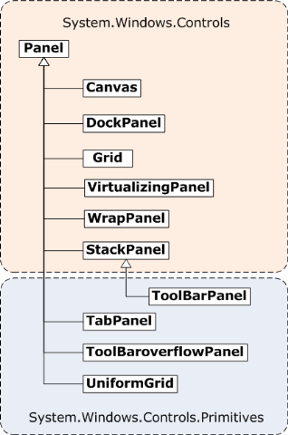


一个Panel 的呈现就是测量和排列子控件，然后在屏幕上绘制它们。所以在布局的过程中会经过一系列的计算，那么子控件越多，执行的计算次数就越多，则性能就会变差。如果不需要进行复杂的布局，则尽量少用复杂布局控件（如 Grid和自定义复杂的Panel）；如果能简单布局实现就尽量使用构造相对简单的布局（如 Canvas、UniformGrid等），这种布局可带来更好的性能。 如果有可能，我们应尽量避免调用 UpdateLayout方法。

布局系统为Panel中的每个子控件完成两个处理过程：测量处理过程（Measure）和排列处理过程（Arrange）。每个子 Panel 均提供自己的 MeasureOverride 和 ArrangeOverride 方法，以实现自己特定的布局行为。

每个派生 Panel 元素都以不同方式处理大小调整约束。 了解 Panel 如何处理水平或垂直方向上的约束可以使布局更容易预测。

| 控件名称           | x维度      | y维度                             |
| ------------------ | ---------- | --------------------------------- |
| Grid               | 约束       | 约束，Auto 应用于行和列的情形除外 |
| StackPanel（垂直） | 约束       | 按内容约束                        |
| StackPanel（水平） | 按内容约束 | 约束                              |
| DockPanel          | 约束       | 约束                              |
| WrapPanel          | 按内容约束 | 按内容约束                        |
| Canvas             | 按内容约束 | 按内容约束                        |

## 3.Grid面板（类似于一个table）

### 定义

```c#
public class Grid : Panel, IAddChild
{
    public static readonly DependencyProperty ShowGridLinesProperty;
    public static readonly DependencyProperty ColumnProperty;
    public static readonly DependencyProperty RowProperty;
    public static readonly DependencyProperty ColumnSpanProperty;
    public static readonly DependencyProperty RowSpanProperty;
    public static readonly DependencyProperty IsSharedSizeScopeProperty;
 
    public Grid();
 
    public ColumnDefinitionCollection ColumnDefinitions { get; }
    public bool ShowGridLines { get; set; }
    public RowDefinitionCollection RowDefinitions { get; }
    protected override int VisualChildrenCount { get; }
    protected internal override IEnumerator LogicalChildren { get; }
 
    public static int GetColumn(UIElement element);
    public static int GetColumnSpan(UIElement element);
    public static bool GetIsSharedSizeScope(UIElement element);
    public static int GetRow(UIElement element);
    public static int GetRowSpan(UIElement element);
    public static void SetColumn(UIElement element, int value);
    public static void SetColumnSpan(UIElement element, int value);
    public static void SetIsSharedSizeScope(UIElement element, bool value);
    public static void SetRow(UIElement element, int value);
    public static void SetRowSpan(UIElement element, int value);
    public bool ShouldSerializeColumnDefinitions();
    public bool ShouldSerializeRowDefinitions();
    protected override Size ArrangeOverride(Size arrangeSize);
    protected override Visual GetVisualChild(int index);
    protected override Size MeasureOverride(Size constraint);
    protected internal override void OnVisualChildrenChanged(DependencyObject visualAdded, DependencyObject visualRemoved);
 
}
```

Grid有两个非常关键的属性ColumnDefinitions和RowDefinitions，分别表示列的数量集合和行的数量集合。ColumnDefinitions集合中的元素类型是ColumnDefinition类，RowDefinitions集合中元素类型是RowDefinition类。默认的Gridr控件没有定义行数和列数，也就是说，Grid默认情况下，行数和列数都等于1，那么它就只有一个单元格。

### Grid控件行高和列宽的设置

Grid控件的行高和列宽的设置十分丰富，了解它们的用法，有助于设计出更出色的布局。

| 名称               | 说明                                                         |
| ------------------ | ------------------------------------------------------------ |
| 绝对设置尺寸       | 使用设备无关单位准确地设置尺寸，就是给一个实际的数字，但通常将此值指定为整数（像素）。如：<ColumnDefinition Width="100"></ColumnDefinition> |
| 自动设置尺寸       | 值为Auto，实际作用就是取实际控件所需的最小值，每行和每列的尺寸刚好满足需要，这是最有用的尺寸设置方式。如：<ColumnDefinition Width="Auto"></ColumnDefinition> |
| 按比例设置设置尺寸 | 按比例将空间分割到一组行和列中。这是对所有行和列的标准设置。通常值为*或N*，实际作用就是取尽可能大的值，当某一列或行被定义为*则是尽可能大，当出现多列或行被定义为*则是代表几者之间按比例方设置尺寸。如：<ColumnDefinition Width="*"></ColumnDefinition> |

> 指定权重，即第2列的宽度是第1列的两倍
>
> <RowDefinition Height="*"></RowDefinition>
> <RowDefinition Height="2*"></RowDefinition>

```xaml
<Grid Margin="5">
    <Grid.RowDefinitions>
        <RowDefinition/>
        <RowDefinition/>
    </Grid.RowDefinitions>
    <Grid.ColumnDefinitions>
        <ColumnDefinition Width="120"/>
        <ColumnDefinition/>
    </Grid.ColumnDefinitions>
    <Border Grid.Row="0" Grid.RowSpan="2" Grid.Column="0" Grid.ColumnSpan="2" BorderBrush="Gray" BorderThickness="1"/>
    <Border Grid.Row="0" Grid.Column="0" Grid.ColumnSpan="2" BorderBrush="Gray" BorderThickness="0 0 0 1"/>
    <Border Grid.Row="0" Grid.RowSpan="2" Grid.Column="0" BorderBrush="Gray" BorderThickness="0 0 1 0"/>
    <Button Grid.Row="0" Grid.Column="0" Content="WPF中文网1" Panel.ZIndex="1" Margin="20" />
    <Button Grid.Row="0" Grid.Column="1" Content="WPF中文网2" Panel.ZIndex="0" Margin="20" />
    <Button Grid.Row="1" Grid.Column="0" Content="WPF中文网3" Panel.ZIndex="1" Margin="20" />
    <Button Grid.Row="1" Grid.Column="1" Content="WPF中文网4" Panel.ZIndex="0" Margin="20" />
</Grid>
```

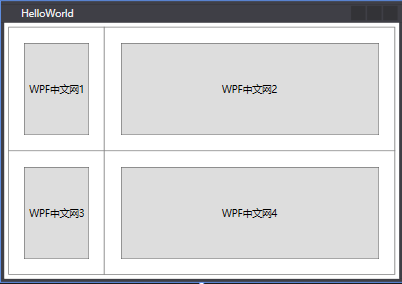


### 示例


```xaml
    <Grid>
        <Grid.RowDefinitions>
            <RowDefinition Height="90*"/>
            <RowDefinition Height="284*"/>
            <RowDefinition Height="61*"/>
        </Grid.RowDefinitions>
        <Grid.ColumnDefinitions>
            <ColumnDefinition Width="197*"/>
            <ColumnDefinition Width="443*"/>
            <ColumnDefinition Width="80*"/>
            <ColumnDefinition Width="80*"/>
        </Grid.ColumnDefinitions>
        <Label x:Name="label" Content="请输入你的留言"  Margin="5,2" Height="25" Grid.Column="0" Grid.Row="0" HorizontalContentAlignment="Center"/>
        <ComboBox x:Name="cbbType" Grid.Column="1" Grid.Row="0"  Margin="5,5,5,5" Grid.ColumnSpan="3"/>
        <TextBox x:Name="txtContent" Grid.ColumnSpan="4" Grid.Column="0" Margin="5,5,5,5" Grid.Row="1" />
        <Button x:Name="btnSub" Grid.Column="2" Content="确定"  Margin="4,4,4,4" Grid.Row="2" />
        <Button x:Name="btnClear" Grid.Column="3" Content="清理"  Margin="4,4,4,4" Grid.Row="2" />


    </Grid>
```


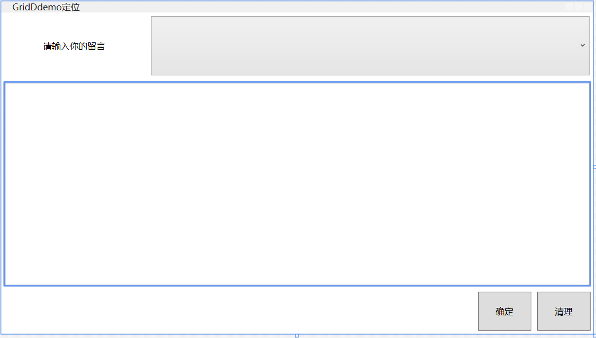

```xaml
    <Grid>
        <Grid.ColumnDefinitions>
            <ColumnDefinition Width="*" />
            <ColumnDefinition Width="*" />
        </Grid.ColumnDefinitions>

        <Border Grid.Column="1" BorderBrush="Black" BorderThickness="1 0 0 1" Margin="10"/>

        <Button Grid.Column="1" x:Name="btn" Width="70" Height="30" Content="load"  ></Button>

    </Grid>
```

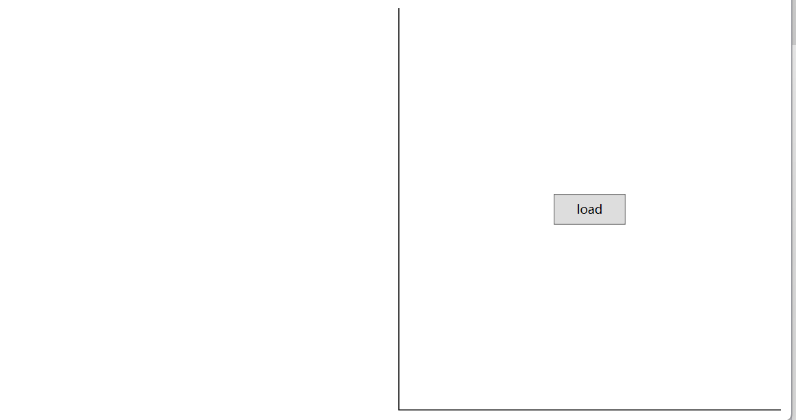

**BorderThickness可以通过使用4个参数来控制边框是否显示**

### 总结

特点：1.可以定义任意行和列，可以跨行、跨列

2.行列宽度可以设置为绝对值、相对比例、自动调整等方式

应用场景：

1.UI的大布局设计

2.ui整体尺寸需要改变时。

**Grid控件绝对是WPF中所有布局控件中最好用的一个，因为它自适应屏幕的宽度，最关键的一点是，它在呈现时，其ActualWidth实际宽度和ActualHeight实际高度会有一个计算值，我们在业务开发中，有时候要根据父控件的实际宽度和高度来计算子控件的呈现位置和大小。**

## 4.UniformGrid （均匀分布）

UniformGrid和Grid有些相似，只不过UniformGrid的每个单元格面积都是相等的，不管是横向的单元格，或是纵向的单元格，它们会平分整个UniformGrid。

### 定义

```c#
public class UniformGrid : Panel
{
    public static readonly DependencyProperty FirstColumnProperty;
    public static readonly DependencyProperty ColumnsProperty;
    public static readonly DependencyProperty RowsProperty;
 
    public UniformGrid();
 
    public int FirstColumn { get; set; }
    public int Columns { get; set; }
    public int Rows { get; set; }
 
    protected override Size ArrangeOverride(Size arrangeSize);
    protected override Size MeasureOverride(Size constraint);
 
}
```

UniformGrid控件提供了3个属性，分别是FirstColumn、Columns 、Rows 。FirstColumn表示第一行要空几个单元格，后面两个属性分别用于设置行数和列数。接下来我们以实际的例子来分析这3个属性的用法。

### 示例

```xaml
    <UniformGrid Columns="3" Rows="4" FirstColumn="2">
        <Button Content="Button 1" Margin="5"/>
        <Button Content="Button 2" Margin="5"/>
        <Button Content="Button 3" Margin="5"/>
        <Button Content="Button 4" Margin="5"/>
        <Button Content="Button 5" Margin="5"/>
        <Button Content="Button 6" Margin="5"/>
        <Button Content="Button 7" Margin="5"/>
        <Button Content="Button 8" Margin="5"/>
        <Button Content="Button 9" Margin="5"/>
        <Button Content="Button 10" Margin="5"/>
    </UniformGrid>
```

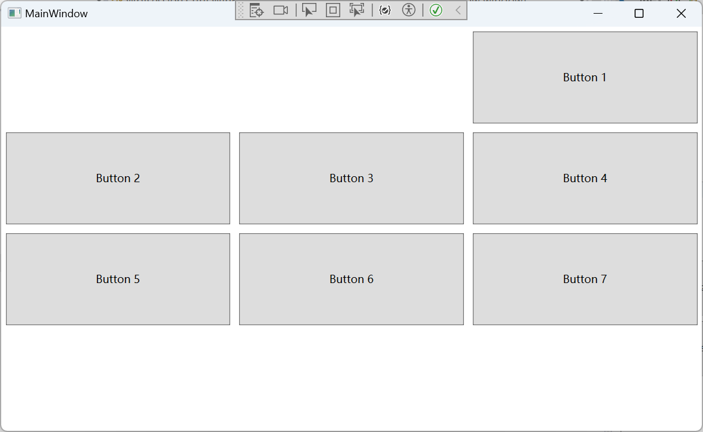

### 总结

UniformGrid控件使用非常简单方便，通常用于局部的布局

## 5.StackPanel 栈式布局

【1】布局特点
第一、可以把内部元素在纵向域者横向上紧凑排列，形成栈式布局，通俗来说就是把元素堆到一块。
第二、当把前面的元素去掉后，后面的会整体向前移动，占领原有元素空间。
【2】适用场合
第一、同类型原型需要紧凑排列（比如制作菜单或者列婊）
第二、移除其中的元素后能的够自动补缺的布局，或者动画。
【3】三个属性
第一、Orientaion属性：决定内部元素是横向还是纵向积累。
第二、HorizontalAlignment属性：决定内部元素水平方上的对齐方式。
第三、VerticalAlignment属性：决定内元素垂直方向上的对齐方式。

```xaml
<Window x:Class="WpfApp1.StackPannelDemo"
        xmlns="http://schemas.microsoft.com/winfx/2006/xaml/presentation"
        xmlns:x="http://schemas.microsoft.com/winfx/2006/xaml"
        xmlns:d="http://schemas.microsoft.com/expression/blend/2008"
        xmlns:mc="http://schemas.openxmlformats.org/markup-compatibility/2006"
        xmlns:local="clr-namespace:WpfApp1"
        mc:Ignorable="d"
        Title="StackPannelDemo" Height="180" Width="300" WindowStartupLocation="CenterScreen">
    <Grid>
        <GroupBox Header="请选择昵称：" Margin="12" BorderBrush="Black">
            <StackPanel>
                <CheckBox Content="a.china"/>
                <CheckBox Content="b.english"/>
                <CheckBox Content="c.good"/>
                <CheckBox Content="d.bad"/>
                <StackPanel Orientation="Horizontal" HorizontalAlignment="Right">
                    <Button x:Name="btnSub" Content="submit" Width="60" Margin="3"/>
                    <Button x:Name="btnClear" Content="clear" Width="60" Margin="3"/>
                </StackPanel>
            </StackPanel>
        </GroupBox>
        
    </Grid>
</Window>
```

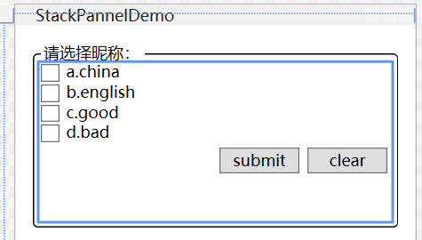

## 6.WrapPanel面板（流式布局，类似web中div的loat)

WrapPanel控件表示将其子控件从左到右的顺序排列，如果第一行显示不了，则自动换至第二行，继续显示剩余的子控件。

### 定义

```c#
public class WrapPanel : Panel
{
    public static readonly DependencyProperty ItemWidthProperty;
    public static readonly DependencyProperty ItemHeightProperty;
    public static readonly DependencyProperty OrientationProperty;
 
    public WrapPanel();
 
    public double ItemWidth { get; set; }
    public double ItemHeight { get; set; }
    public Orientation Orientation { get; set; }
 
    protected override Size ArrangeOverride(Size finalSize);
    protected override Size MeasureOverride(Size constraint);
 
}
```

这个控件比较简单，只提供了3个属性，分别是Orientation代表子控件的排列方向，ItemWidth代表子控件的（最大）宽度，ItemHeight代表子控件的（最大）高度。默认的排列方向是水平方向


注意一个细节，**WrapPanel的子元素的高度和宽度都是根据子元素自身内容的尺寸呈现**。另外，当WrapPanel处于水平排列时，子元素的HorizontalAlignment是不起作用的。


【1】布局特点
第一、在流延伸的方向上会排列尽可能多的控件，排列不下的控件会新起一行。
第二、使用Orientaion属性控制流延伸的方向。
【2】适用场合
需要根据容器大小动态排列控件的场合。

### 示例

```xaml
<Window x:Class="WpfApp1.wrapPanelDemo"
        xmlns="http://schemas.microsoft.com/winfx/2006/xaml/presentation"
        xmlns:x="http://schemas.microsoft.com/winfx/2006/xaml"
        xmlns:d="http://schemas.microsoft.com/expression/blend/2008"
        xmlns:mc="http://schemas.openxmlformats.org/markup-compatibility/2006"
        xmlns:local="clr-namespace:WpfApp1"
        mc:Ignorable="d"
        Title="wrapPanelDemo" Height="200" Width="300" WindowStartupLocation="CenterScreen">
    <Grid>
        <WrapPanel>
            <Button Content="11" Width="30" Height="30"/>
            <Button Content="11" Width="30" Height="30"/>
            <Button Content="11" Width="30" Height="30"/>
            <Button Content="11" Width="30" Height="30"/>
            <Button Content="11" Width="30" Height="30"/>
            <Button Content="11" Width="30" Height="30"/>
            <Button Content="11" Width="30" Height="30"/>
            <Button Content="11" Width="30" Height="30"/>
            <Button Content="11" Width="30" Height="30"/>
            <Button Content="11" Width="30" Height="30"/>
            <Button Content="11" Width="30" Height="30"/>
        </WrapPanel>
    </Grid>
</Window>
```

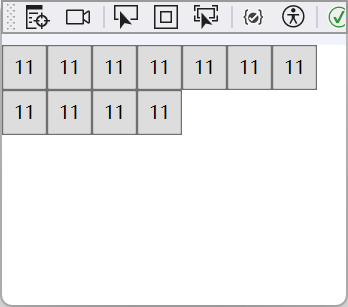

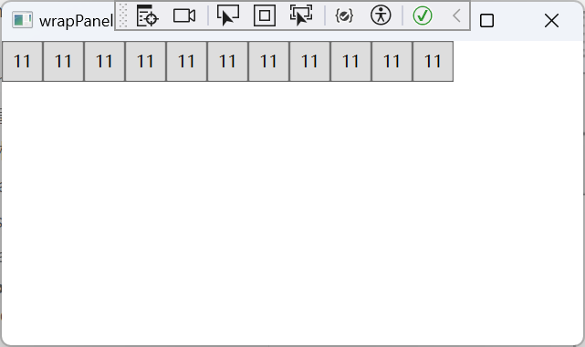

## 7.DockPanel面板（停靠）

【1】布局特点
根据Dock属性值，元素向指定访向累积，切吩DockPanel内部剩余空间，就像船舶停靠一样。
【2】适用场合
需要自动填满乘剩余空间的布局。（最后一个元素自动填满DockPanel内的乘剩余空间）

```xaml
<Window x:Class="WpfApp1.DockPanelDemo"
        xmlns="http://schemas.microsoft.com/winfx/2006/xaml/presentation"
        xmlns:x="http://schemas.microsoft.com/winfx/2006/xaml"
        xmlns:d="http://schemas.microsoft.com/expression/blend/2008"
        xmlns:mc="http://schemas.openxmlformats.org/markup-compatibility/2006"
        xmlns:local="clr-namespace:WpfApp1"
        mc:Ignorable="d"
        Title="DockPanelDemo" Height="300" Width="400" WindowStartupLocation="CenterScreen">
    <Grid>
        <DockPanel>
            <TextBox DockPanel.Dock="Top" BorderBrush="Black" Height="30"/>
            <TreeView DockPanel.Dock="Left" BorderBrush="Black" Width="60"/>
            <ListBox BorderBrush="Black"/>
        </DockPanel>
    </Grid>
</Window>
```

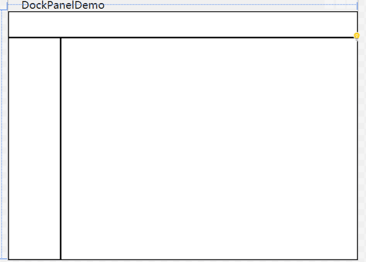


## 8.Canvas面板（译文：画布）

Canvas控件允许我们像Winform一样拖拽子控件进行布局，而子控件的位置相对于Canvas来说是绝对的，所以我将它称为绝对布局。

### 定义

```c#
public class Canvas : Panel
{
    public static readonly DependencyProperty LeftProperty;
    public static readonly DependencyProperty TopProperty;
    public static readonly DependencyProperty RightProperty;
    public static readonly DependencyProperty BottomProperty;
 
    public Canvas();
 
    public static double GetBottom(UIElement element);
    public static double GetLeft(UIElement element);
    public static double GetRight(UIElement element);
    public static double GetTop(UIElement element);
    public static void SetBottom(UIElement element, double length);
    public static void SetLeft(UIElement element, double length);
    public static void SetRight(UIElement element, double length);
    public static void SetTop(UIElement element, double length);
    protected override Size ArrangeOverride(Size arrangeSize);
    protected override Geometry GetLayoutClip(Size layoutSlotSize);
    protected override Size MeasureOverride(Size constraint);
 
}
```

观察它的结构，我们可以看到它提供了4个依赖属性，分别是LeftProperty，RightProperty，TopProperty和BottomProperty。其实是将这4个属性附加到子元素身上，以此来设置子元素距离Canvas上下左右的像素位置。

### 特点

【1】布局特点
第一、在面板内部，我们可以通过x和y的坐标属性，直接控制控件的位置，非常类似winform中的top
和Ieft定位。
第二、我们可以直接通过拖放的形式选择控件的位置。
【2】适用场合
第一、一经设计基本上不会有改动的小布局。
第二、需要使用绝对定位的布局。
第三、依赖于横纵坐标的动画。

### 示例

```xaml
<Window x:Class="WpfApp1.CanvasDemo"
        xmlns="http://schemas.microsoft.com/winfx/2006/xaml/presentation"
        xmlns:x="http://schemas.microsoft.com/winfx/2006/xaml"
        xmlns:d="http://schemas.microsoft.com/expression/blend/2008"
        xmlns:mc="http://schemas.openxmlformats.org/markup-compatibility/2006"
        xmlns:local="clr-namespace:WpfApp1"
        mc:Ignorable="d"
        Title="CanvasDemo使用" Height="200" Width="320" WindowStartupLocation="CenterOwner">
    <Grid>
        <Canvas Margin="10">
            <Label Content="username" Canvas.Left="37" Canvas.Top="31"/>
            <TextBox x:Name="txtUsername" Canvas.Left="120" VerticalContentAlignment="Center" Canvas.Top="35" Width="120"/>
            <Label Content="password" Canvas.Left="38" Canvas.Top="65" RenderTransformOrigin="-0.277,-0.59" HorizontalAlignment="Left" VerticalAlignment="Center"/>
            <PasswordBox x:Name="txtPassword" Canvas.Left="120" VerticalContentAlignment="Center" Canvas.Top="73" Width="120" HorizontalAlignment="Center" VerticalAlignment="Top"/>
            <Button x:Name="btnLogin" Content="login" Width="60" Canvas.Left="70" Canvas.Top="109"/>
            <Button x:Name="btnExit" Content="exit" Width="60" Canvas.Left="161" Canvas.Top="109" HorizontalAlignment="Left" VerticalAlignment="Center"/>

        </Canvas>
    </Grid>
</Window>
```

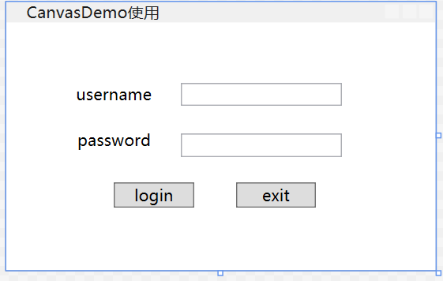

	## 9.Border 边框布局

Border并不是一个布局控件，因为它并不是Panel的子类，而是Decorator装饰器的子类，而Decorator继承于FrameworkElement。要了解Border的用法，我们要先看看它的父类Decorator。

```c#
public class Decorator : FrameworkElement, IAddChild
{
    public Decorator();
 
    public virtual UIElement Child { get; set; }
    protected override int VisualChildrenCount { get; }
    protected internal override IEnumerator LogicalChildren { get; }
 
    protected override Size ArrangeOverride(Size arrangeSize);
    protected override Visual GetVisualChild(int index);
    protected override Size MeasureOverride(Size constraint);
 
}
```

Decorator 装饰器只有一个Child 属性，说明Decorator只能容纳一个子元素（UIElement），也就是**Border只能容纳一个子元素**。那我们再看看Border的结构定义：

```c#
	public class Border : Decorator
{
    public static readonly DependencyProperty BorderThicknessProperty;
    public static readonly DependencyProperty PaddingProperty;
    public static readonly DependencyProperty CornerRadiusProperty;
    public static readonly DependencyProperty BorderBrushProperty;
    public static readonly DependencyProperty BackgroundProperty;
 
    public Border();
 
    public Thickness BorderThickness { get; set; }
    public Thickness Padding { get; set; }
    public CornerRadius CornerRadius { get; set; }
    public Brush BorderBrush { get; set; }
    public Brush Background { get; set; }
 
    protected override Size ArrangeOverride(Size finalSize);
    protected override Size MeasureOverride(Size constraint);
    protected override void OnRender(DrawingContext dc);
 
}
```

我们直接以表格的形式给出Border的相关属性。

| 属性            | 说明                             |
| --------------- | -------------------------------- |
| BorderThickness | 设置Border边框的厚度（像素宽度） |
| Padding         | 设置子元素相对于Border边框的距离 |
| CornerRadius    | 设置Border的圆角                 |
| BorderBrush     | 设置Border边框的颜色画刷         |
| Background      | 设置Border的背景颜色画刷         |

**正是因为Border有这么多实用的属性， 所以， 我们通常在布局界面时，Border（装饰器）控件是首选。**

### 示例

```xaml
    <StackPanel HorizontalAlignment="Center" VerticalAlignment="Center" Orientation="Horizontal">
        <Border Height="50" Width="90" Background="LightBlue" Margin="10">
            <TextBlock Text="border示例1" HorizontalAlignment="Center" VerticalAlignment="Center"/>
        </Border>

        <Border Height="50" Width="90" Background="LightGreen" Margin="10" CornerRadius="15">
            <TextBlock Text="border示例2" HorizontalAlignment="Center" VerticalAlignment="Center"/>
        </Border>

        <Border Height="80" Width="80" Background="OrangeRed" Margin="10" CornerRadius="40">
            <TextBlock Text="border示例3" HorizontalAlignment="Center" VerticalAlignment="Center"/>
        </Border>
    </StackPanel>
```

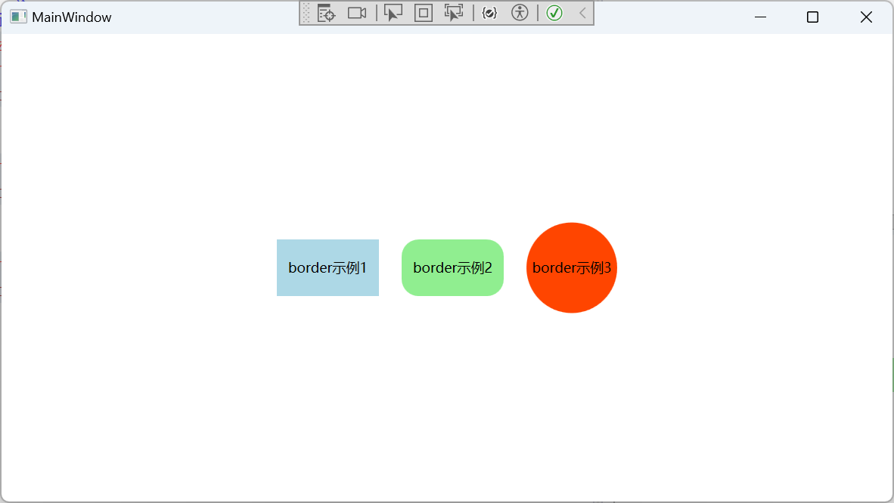

当长宽相同CornerRadius弧度为长一半时，会形成一个圆。

## 10.GridSplitter分割窗口

GridSplitter控件用来分割窗体的布局，必须放在Grid栅格控件中配合使用，通过鼠标按住GridSplitter进行左右或上下拖动，即可调整行列尺寸。

注意事项：

1、如果您希望GridSplitter控件可以水平调整左右的Grid列宽时，那么HorizontalAlignment属性必须设置为Stretch或者Center。

2、如果您希望GridSplitter控件可以垂直调整行高，那么VerticalAlignment属性必须设置为Stretch或者Center。

3、ShowsPreview属性表示拖动时是否及时绘制调整尺寸。

### 示例

```xaml
    <Grid>
        <Grid.ColumnDefinitions>
            <ColumnDefinition Width="*"/>
            <ColumnDefinition Width="*"/>
            <ColumnDefinition Width="*"/>
        </Grid.ColumnDefinitions>
        <Border Grid.Column="0" Background="LightBlue">
            <TextBlock TextWrapping="Wrap" Padding="10" LineHeight="20">
                SCL是西门子公司推出的一种PLC编程语言，其英文全称为“StructuredControl Language”，中文翻译为“结构化控制语言”。西门子SCL语言是基于PASCL语言的，它在PASCL语言的基础上，加上了PLC编程的输入、输出、定时器、计数器、位存储器等特征，使其既具有高级语言的特点，又适合PLC的数据处理。
            </TextBlock>
        </Border>
        <GridSplitter Grid.Column="1" Width="5" HorizontalAlignment="Center"   ShowsPreview="False"/>
        <Border Grid.Column="2" Background="Orange">
            <TextBlock TextWrapping="Wrap" Padding="10" LineHeight="20">
                西门子SCL语言支持布尔型、整型、实型等基本数据类型及日期时间、指针、用户自定义数据等复杂数据类型，提供了丰富的运算符可以构建逻辑表达式、数学表达式、关系表达式等各种表达式，提供了判断、选择、循环等语句用于程序控制，同时还提供了基本指令、扩展指令、工艺指令及通信指令等丰富的指令，可以满足所有PLC控制的要求。
            </TextBlock>
        </Border>
    </Grid>
```

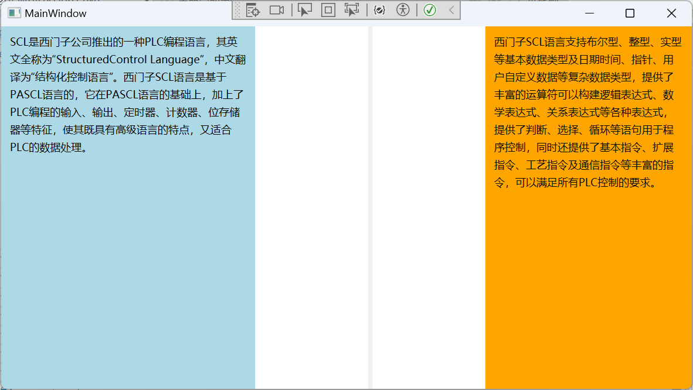

