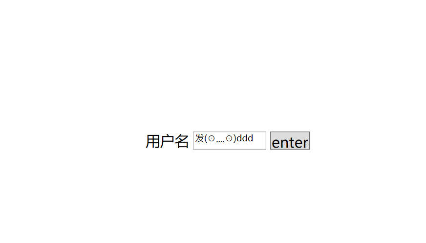
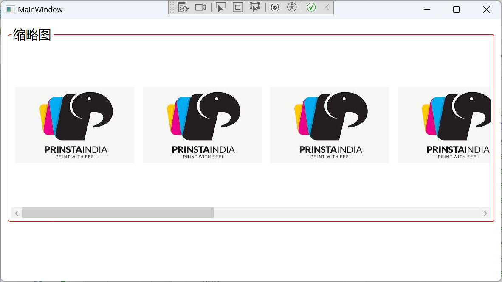

## 1.Control基类


Control是许多控件的基类。比如最常见的按钮（Button）、单选(RadioButton)、复选（CheckBox）、文本框（TextBox）、ListBox、DataGrid、日期控件等等。这些控件通常用于展示程序的数据或获取用户输入的数据，我们可以将这一类型的控件称为内容控件或数据控件，它们与前面的布局控件有一定的区别，布局控件更专注于界面，而内容控件更专注于数据（业务）。

**Control类虽然可以实例化，但是在界面上是不会有任何显示的**。只有那些继承了Control的子类（控件）才会在界面上显示，而且所呈现的样子各不相同，为什么会是这样呢？

因为Control类提供了一个控件模板（ControlTemplate），而几乎所有的子类都对这个ControlTemplate进行了各自的实现，所以在呈现子类时，我们才会看到Button拥有Button的样子，TextBox拥有TextBox的样子。

### Control的结构定义

```c#
public class Control : FrameworkElement
{
public static readonly DependencyProperty BorderBrushProperty;
public static readonly RoutedEvent PreviewMouseDoubleClickEvent;
public static readonly DependencyProperty TemplateProperty;
public static readonly DependencyProperty PaddingProperty;
public static readonly DependencyProperty IsTabStopProperty;
public static readonly DependencyProperty TabIndexProperty;
public static readonly DependencyProperty VerticalContentAlignmentProperty;
public static readonly DependencyProperty HorizontalContentAlignmentProperty;
public static readonly RoutedEvent MouseDoubleClickEvent;
public static readonly DependencyProperty FontStyleProperty;
public static readonly DependencyProperty FontStretchProperty;
public static readonly DependencyProperty FontSizeProperty;
public static readonly DependencyProperty FontFamilyProperty;
public static readonly DependencyProperty ForegroundProperty;
public static readonly DependencyProperty BackgroundProperty;
public static readonly DependencyProperty BorderThicknessProperty;
public static readonly DependencyProperty FontWeightProperty;
 
public Control();
 
public FontStyle FontStyle { get; set; }
public FontStretch FontStretch { get; set; }
public double FontSize { get; set; }
public FontFamily FontFamily { get; set; }
public Brush Foreground { get; set; }
public Brush Background { get; set; }
public Thickness BorderThickness { get; set; }
public bool IsTabStop { get; set; }
public VerticalAlignment VerticalContentAlignment { get; set; }
public int TabIndex { get; set; }
public Thickness Padding { get; set; }
public ControlTemplate Template { get; set; }
public FontWeight FontWeight { get; set; }
public Brush BorderBrush { get; set; }
public HorizontalAlignment HorizontalContentAlignment { get; set; }
protected internal virtual bool HandlesScrolling { get; }
 
public event MouseButtonEventHandler MouseDoubleClick;
public event MouseButtonEventHandler PreviewMouseDoubleClick;
 
public override string ToString();
protected override Size ArrangeOverride(Size arrangeBounds);
protected override Size MeasureOverride(Size constraint);
protected virtual void OnMouseDoubleClick(MouseButtonEventArgs e);
protected virtual void OnPreviewMouseDoubleClick(MouseButtonEventArgs e);
protected virtual void OnTemplateChanged(ControlTemplate oldTemplate, ControlTemplate newTemplate);
 
}
```

Control基类为它的子类们提供了哪些

### 属性

| 属性                       | 说明                                                         |
| -------------------------- | ------------------------------------------------------------ |
| FontStyle                  | 获取或设置控件的字体结构，类似于Word中字体的常规、斜体或倾斜 |
| FontStretch                | 获取或设置紧缩或在屏幕上展开一种字体的程度。                 |
| FontSize                   | 获取或设置字体大小。                                         |
| FontFamily                 | 获取或设置控件的字体系列。如：微软雅黑 = "Microsoft YaHei UI" |
| Foreground                 | 获取或设置控件的字体颜色，也就是所谓的前景色画笔，它是一个刷子（Brush） |
| Background                 | 获取或设置一个用于描述控件的背景画笔。                       |
| BorderThickness            | 获取或设置控件的边框宽度。                                   |
| IsTabStop                  | 获取或设置一个值，该值指示控件是否包括在选项卡上的导航窗格中。 |
| VerticalContentAlignment   | 获取或设置控件的内容的垂直对齐方式。                         |
| TabIndex                   | 获取或设置一个值，确定当用户导航控件通过使用 TAB 键元素接收焦点的顺序。 |
| Padding                    | 获取或设置在控件中的填充量。                                 |
| **Template**               | **获取或设置控件模板。**                                     |
| FontWeight                 | 获取或设置指定的字体粗细。                                   |
| BorderBrush                | 获取或设置一个用于描述一个控件的边框背景画笔。               |
| HorizontalContentAlignment | 获取或设置控件的内容的水平对齐方式。                         |

大部分的属性都比较好理解，这里着重介绍一下Template属性。如果把人比作是一个Control(控件)，那么”着装“就是Template（模板）。在大街上，我们会看到不同着装的人来来往往。

所以**Control的Template定义了控件的外观**（着装）。

### 事件

Control类还提供了两个事件，它们分别是PreviewMouseDoubleClick和MouseDoubleClick。

| 事件名称                | 说明                               |
| ----------------------- | ---------------------------------- |
| PreviewMouseDoubleClick | 表示鼠标双击或多次单击时触发的事件 |
| MouseDoubleClick        | 表示鼠标双击或多次单击时触发的事件 |

以Preview开头的事件叫隧道事件或预览事件，而MouseDoubleClick没有以Preview开头，所以它叫冒泡事件。

冒泡事件事件的路由方向相反，是从目标控件位置开始，一直路由引发至最外层的Window窗体。

## 2.ContentControl类（内容控件）

ContentControl是一个神奇的类！

为什么这么说呢，因为它有一个Content属性，关键是这个属性的类型是object。也就是说，本质上，它可以接收任意引用类型的实例。

但是，通常情况下，Content属性接收UI控件。因为，ContentControl控件最终会把Content属性里面的内容显示到界面上。

### 结构定义

```c#
public class ContentControl : Control, IAddChild
{
    public static readonly DependencyProperty ContentProperty;
    public static readonly DependencyProperty HasContentProperty;
    public static readonly DependencyProperty ContentTemplateProperty;
    public static readonly DependencyProperty ContentTemplateSelectorProperty;
    public static readonly DependencyProperty ContentStringFormatProperty;
 
    public ContentControl();
 
    public DataTemplate ContentTemplate { get; set; }
    public bool HasContent { get; }
    public object Content { get; set; }
    public string ContentStringFormat { get; set; }
    public DataTemplateSelector ContentTemplateSelector { get; set; }
    protected internal override IEnumerator LogicalChildren { get; }
 
    public virtual bool ShouldSerializeContent();
    protected virtual void AddChild(object value);
    protected virtual void AddText(string text);
    protected virtual void OnContentChanged(object oldContent, object newContent);
    protected virtual void OnContentStringFormatChanged(string oldContentStringFormat, string newContentStringFormat);
    protected virtual void OnContentTemplateChanged(DataTemplate oldContentTemplate, DataTemplate newContentTemplate);
    protected virtual void OnContentTemplateSelectorChanged(DataTemplateSelector oldContentTemplateSelector, DataTemplateSelector newContentTemplateSelector);
 
}
```

**ContentControl控件能不能容纳多个子控件？**

不能！因为ContentControl控件只能显示Content属性里面的内容，而Content属性是object，只能接收一个对象。

HasContent属性：表示ContentControl是否有内容。

ContentStringFormat属性：获取或设置ContentControl要显示字符串的格式。

ContentTemplateSelector属性：模板选择器， 我们会在模板一章节介绍。

### ContentTemplate属性（内容模板）

ContentTemplate属性（内容模板）

这个属性表示获取或设置用来显示的内容的数据模板，说白了，就是决定“WPF中文网”这几个字的穿着，如果没有设置数据模板，它将以默认的数据模板来显示这几个字。接下来，我们演示一下这个属性的用法，并简要说明其中的关系。

```xaml
<Grid>
    <ContentControl FontSize="30" Foreground="GreenYellow">

        <ContentControl.ContentTemplate>
            <DataTemplate>
                <Border Height="50" Width="500" CornerRadius="10" Background="BlanchedAlmond" Margin="20"> 
                    <TextBlock Text="{Binding}" 
                               HorizontalAlignment="Center" 
                               VerticalAlignment="Center" 
                               FontSize="40" 
                               Foreground="LightBlue"/>
                </Border>
            </DataTemplate>
            
        </ContentControl.ContentTemplate>
        
        WPF-COntentControl
    </ContentControl>
</Grid>
```


ContentControl类的ContentTemplate属性是DataTemplate类型，所以我们在xaml中实例化了一个DataTemplate（数据模板）对象，并在其中增加了一个TextBlock控件，将TextBlock控件的Text属性写成了Binding形式，并设置了字体颜色和大小。

关于数据模板中的TextBlock控件的Text属性写成了Binding(绑定)形式，这是指将ContentContent控件的Contnet属性绑定到TextBlock控件的Text属性中，写成伪代码就是：

```
TextBlock.Text = ContentContent.Content
```

## 3.ButtonBase基类

按钮，几乎每个具有UI界面的软件都会有它的身影，而按钮的形式也是有多种多样的，我们在这里简单的罗列一下。

| 按钮名称             | 说明                                            |
| -------------------- | ----------------------------------------------- |
| Button               | 普通按钮                                        |
| CheckBox             | 复选框按钮                                      |
| RadioButton          | 单选框按钮                                      |
| ToggleButton         | 是CheckBox、RadioButton的基类，表示可以切换状态 |
| RepeatButton         | 重复，表示从按下到弹出过程中重复引发Click事件   |
| GridViewColumnHeader | 表示GridViewColumn 的列标题，其实它也是一个按钮 |
| DataGridColumnHeader | 表示DataGrid 列标题，也是一个按钮               |
| DataGridRowHeader    | 表示DataGrid 行标题，也是一个按钮               |

上面便是WPF中的按钮体系，这些按钮都有一个共同的基类ButtonBase。

**ButtonBase是一个抽象类，所以，它不能被实例化。**我们只能在它的子类中去使用它提供的一些属性、事件或方法成员。它只有一个事件，就是Click单击事件，毕竟鼠标双击事件在它的Control基类就有了嘛。另外，它还有一个非常厉害的Command属性，这个属性其实是一个接口，起什么作用呢？就是在单击按钮时，去执行这个Command属性所指定的一个具体命令。

这个Command命令是WPF命令系统里面的角色，也是WPF优于Winform的一个具体表现，Command命令也是MVVM模式中最重要的一环。我们会在后面专门探讨WPF的命令系统。

```c#
public abstract class ButtonBase : ContentControl, ICommandSource
{
    public static readonly RoutedEvent ClickEvent;
    public static readonly DependencyProperty CommandProperty;
    public static readonly DependencyProperty CommandParameterProperty;
    public static readonly DependencyProperty CommandTargetProperty;
    public static readonly DependencyProperty IsPressedProperty;
    public static readonly DependencyProperty ClickModeProperty;
 
    protected ButtonBase();
 
    public IInputElement CommandTarget { get; set; }
    public object CommandParameter { get; set; }
    public ICommand Command { get; set; }
    public bool IsPressed { get; protected set; }
    public ClickMode ClickMode { get; set; }
    protected override bool IsEnabledCore { get; }
 
    public event RoutedEventHandler Click;
 
    protected override void OnAccessKey(AccessKeyEventArgs e);
    protected virtual void OnClick();
    protected virtual void OnIsPressedChanged(DependencyPropertyChangedEventArgs e);
    protected override void OnKeyDown(KeyEventArgs e);
    protected override void OnKeyUp(KeyEventArgs e);
    protected override void OnLostKeyboardFocus(KeyboardFocusChangedEventArgs e);
    protected override void OnLostMouseCapture(MouseEventArgs e);
    protected override void OnMouseEnter(MouseEventArgs e);
    protected override void OnMouseLeave(MouseEventArgs e);
    protected override void OnMouseLeftButtonDown(MouseButtonEventArgs e);
    protected override void OnMouseLeftButtonUp(MouseButtonEventArgs e);
    protected override void OnMouseMove(MouseEventArgs e);
    protected internal override void OnRenderSizeChanged(SizeChangedInfo sizeInfo);
 
}
```

### **ButtonBase的属性**

| 属性名称         | 说明                                                         |
| ---------------- | ------------------------------------------------------------ |
| CommandTarget    | 获取或设置要对其引发指定的命令的元素。                       |
| CommandParameter | 获取或设置一个命令参数，这个参数是传递给Command 属性所指向的命令。 |
| Command          | 获取或设置要在按此按钮时调用的命令。                         |
| IsPressed        | 获取当前按钮是否处于激活状态。                               |
| ClickMode        | 获取或设置按钮的单击模式                                     |
| IsEnabledCore    | 获取的值 System.Windows.ContentElement.IsEnabled 属性。      |

ButtonBase还提供了两个虚方法，分别是OnClick()和OnIsPressedChanged（）。说明这两个方法也是可以重写的，OnClick表示在按钮单击时执行的方法。

## 4.Button按钮

Button因为继承了ButtonBase，而ButtonBase又继承了ContentControl，所以，Button可以通过设置Content属性来设置要显示的内容。例如

```
<Button Content="WPF中文网"/>
```

我们使用Button的时机，通常是鼠标点击事件需要有响应操作时，所以，Button的Click事件是最好的选择。

### 定义

```c#
public class Button : ButtonBase
{
    public static readonly DependencyProperty IsDefaultProperty;
    public static readonly DependencyProperty IsCancelProperty;
    public static readonly DependencyProperty IsDefaultedProperty;
 
    public Button();
 
    public bool IsDefault { get; set; }
    public bool IsCancel { get; set; }
    public bool IsDefaulted { get; }
 
    protected override void OnClick();
    protected override AutomationPeer OnCreateAutomationPeer();
 
}
```

属性分析

| 属性        | 说明                                        |
| ----------- | ------------------------------------------- |
| IsDefault   | 用户通过按 ENTER 键时调用的默认按钮。       |
| IsCancel    | 用户可以通过按 ESC 键来激活取消按钮。       |
| IsDefaulted | 获取按钮是否为按 ENTER 键时调用的默认按钮。 |

### 示例

```xaml
    <Grid>
        <Button x:Name="_btn"
                Content="Exit"
                Width="100"
                Height="50"
                Click="_btn_Click"
                FontSize="20"
                Background="AliceBlue"
                IsDefault="True">
            
        </Button>
        
    </Grid>
```


如上所示，我们在Window窗体中写了一个Button按钮，然后设置了一些属性，我们一一进行分析。

### **x:Name和Name的区别**

第一个设置是x:Name="_button"。首先要解释x:Name是什么意思。在这里的x表示一个命令空间，也就是xmlns:x="http://schemas.microsoft.com/winfx/2006/xaml"，Name指的是这个控件的名称。请注意，由于Button继承了FrameworkElement类，而FrameworkElement类也有一个Name属性，但是这里设置的x:Name="_button"并不是引用了FrameworkElement类的Name属性，而是指在xaml中为Button定义了一个叫“_button"的名称，并把这个“_button"映射到了Button的Name属性上，以便于我们在后端可以通过”_button“去引用这个按钮。

也就是说，如果某个控件本身也有一个Name属性，那么前端的x:Name就赋值给控件Name属性。

### **Content属性**

这是ContentControl控件的内容属性，用来设置Button的显示内容，除了是字符串，也可以设置为其它内容，比如一个图标、一个其它元素。

### **Width属性**

Width也不是Button本身的属性，而是FrameworkElement的宽度，由于Button继承了FrameworkElement，所以Width就成了按钮的宽度属性。

### **Height属性**

与上面的Width类似，同属于FrameworkElement的高度属性，在此成了Button的高度属性。

### **Click事件**

Click是一个事件，但不是Button的事件，而是它的基类ButtonBase的事件，事件和委托概念关系密切，因为要订阅一个事件，需要写一个回调函数，而这个回调函数的签名要和这个事件的声明委托签名保持一致。我们来看看Click的委托签名是什么样子的。

```
public delegate void RoutedEventHandler(object sender, RoutedEventArgs e);
```

这个委托规定了回调函数的签名，第一，要求回调函数的返回值是void，第二，要求回调函数有两个参数，且参数1是object类型，参数2是RoutedEventArgs类型。于是，我们在后端代码中写了这样一个回调函数。

```c#
private void _button_Click(object sender, RoutedEventArgs e)
{
    this.Close();
}
```

最后在前端，把这个回调函数的名称赋值给Click事件即可完成了在xaml代码中的事件订阅。

### **IsDefault属性**

这个属性是Button自身的属性，这里设置为true，表示这个button是一个默认按钮，我们按下F5启动程序后，直接按回车键，就相当于用鼠标点击了按钮，最终执行了回调函数里面的代码。即this.Close()语句。

this.Close()表示关闭当前窗体。

### **通过C#代码订阅事件**

我们还可以通过C#代码提供的事件订阅符号+=去订阅事件，接下来，我们将上面的例子简单修改一下，去掉在xaml中的订阅方式，在后端代码的构造函数中订阅事件。

前端代码

```
<Button Name="_button" 
        Content="退出" 
        Width="100" 
        Height="25" 
        IsDefault="True"/>
```

后端代码

```
 /// <summary>
    /// MainWindow.xaml 的交互逻辑
    /// </summary>
    public partial class MainWindow : Window
    {
        public MainWindow()
        {
            InitializeComponent();
            _button.Click += _button_Click;
        }
 
        private void _button_Click(object sender, RoutedEventArgs e)
        {
            this.Close();
        }
    }
```

最后F5调试，效果是一模一样的。

## 5.ToggleButton基类

因为ToggleButton作为CheckBox（复选框）和RadioButton（单选框）的基类，我们在学习CheckBox和RadioButton之前要先了解一下这个基类

ToggleButton基类提供了两个属性和三个事件

- IsThreeState属性为true表示控件支持3个状态，

- IsChecked属性为true表示当前控件已被选中。Checked事件表示选中时引发的事件，Unchecked事件表示从选中状态改为未选状态时引发的事件，

- Indeterminate事件表示不确定状态时引发的事件

## 6.CheckBox复选框

CheckBox继承于ToggleButton，而ToggleButton才继承于ButtonBase基类.CheckBox自身没有什么特别内容。一切都使用它的父类提供的属性、方法和事件。

### 示例

```xaml
    <Grid>
        <StackPanel Orientation="Vertical" HorizontalAlignment="Center" VerticalAlignment="Center">
            <TextBlock Text="选择课程： " FontSize="20"></TextBlock>
            <CheckBox x:Name="check1" Content="语文"  FontSize="20" Margin="5"/>
            <CheckBox x:Name="check2" Content="数学"  FontSize="20" Margin="5"/>
            <CheckBox x:Name="check3" Content="英语"  FontSize="20" Margin="5"/>
            <Button x:Name="btn" Content="提交" FontSize="20" Margin="5" Click="_btn_Click"/>
        </StackPanel>
        
    </Grid>
```

后端代码

```c#
        private void _btn_Click(object sender, RoutedEventArgs e)
        {
            string str = "";
            if (check1.IsChecked.Value)
            {
                str += check1.Content + " ";
            }
            if (check2.IsChecked.Value)
            {
                str += check2.Content + " ";
            }
            if (check3.IsChecked.Value)
            {
                str += check3.Content + " ";
            }
            MessageBox.Show("已选择：" + str);
        }
```


我们通过判断CheckBox的IsChecked属性，来获取前端用户的选择，这通常是CheckBox控件最常用的用法，由于IsChecked是一个依赖属性，它还可以参与绑定，形成MVMM的应用模式.

## 7.RadioButton单选框

RadioButton也继承于ToggleButton，作用是单项选择，所以被称为单选框。本质上，它依然是一个按钮，一旦被选中，不会清除，除非它”旁边“的单选框被选中。


这个控件有一个重要属性叫GroupName——分组名称。默认值是一个空字符串。用来指定哪些RadioButton之间是互相排斥的。

示例，大部分使用CheckBox代码

```xaml
    <Grid>
        <StackPanel Orientation="Vertical" HorizontalAlignment="Center" VerticalAlignment="Center">
            <TextBlock Text="选择课程： " FontSize="20"></TextBlock>
            <RadioButton x:Name="check1" Content="语文"  FontSize="20" Margin="5" GroupName="class"/>
            <RadioButton x:Name="check2" Content="数学"  FontSize="20" Margin="5" GroupName="class"/>
            <RadioButton x:Name="check3" Content="一年纪"  FontSize="20" Margin="5"/>
            <Button x:Name="btn" Content="提交" FontSize="20" Margin="5" Click="_btn_Click"/>
        </StackPanel>
        
    </Grid>
```


## 8.RepeatButton重复按钮

RepeatButton,顾名思义，重复执行的按钮。就是当按钮被按下时，所订阅的回调函数会不断被执行。

```c#
public class RepeatButton : ButtonBase
{
    public static readonly DependencyProperty DelayProperty;
    public static readonly DependencyProperty IntervalProperty;
 
    public RepeatButton();
 
    public int Delay { get; set; }
    public int Interval { get; set; }
 
    protected override void OnClick();
    protected override AutomationPeer OnCreateAutomationPeer();
    protected override void OnKeyDown(KeyEventArgs e);
    protected override void OnKeyUp(KeyEventArgs e);
    protected override void OnLostMouseCapture(MouseEventArgs e);
    protected override void OnMouseEnter(MouseEventArgs e);
    protected override void OnMouseLeave(MouseEventArgs e);
    protected override void OnMouseLeftButtonDown(MouseButtonEventArgs e);
    protected override void OnMouseLeftButtonUp(MouseButtonEventArgs e);
 
}
```

### 属性分析

RepeatButton 自身提供了两个整型属性，分别是Delay 和Interval 。

**Delay 属性**：表示延时重复执行的毫秒数，就是说，RepeatButton被按下后会立即执行一次回调函数，如果您不松开鼠标，在等待Delay 毫秒后，就开始进行重复执行阶段。

**Interval 属性**：表示重复执行回调函数的时间间隔毫秒数。

### 使用

前端代码

```xaml
    <Grid>
        <StackPanel Orientation="Vertical" HorizontalAlignment="Center" VerticalAlignment="Center">
            <TextBlock Text="选择课程： " FontSize="20"></TextBlock>
            <RepeatButton Click="_btn_Click" x:Name="check1" Delay="1000" Interval="500" Content="加一"  FontSize="20" Margin="5" Background="AliceBlue"/>
            
        </StackPanel>
        
    </Grid>
```

后端代码

```c#
        private void _btn_Click(object sender, RoutedEventArgs e)
        {
            Console.WriteLine($"开始加1.现在时间: {DateTime.Now.ToLongTimeString()}," +
                $"。重复次数：{i++}");

        }
```

## 9.Label标签

Label控件继承于ContentControl控件，它是一个文本标签，如果您想修改它的标签内容，请设置Content属性。我们曾提过ContentControl的Content属性是object类型，意味着Label的Content也是可以设置为任意的引用类型的。

我们给第二个标签的Content属性设置了一个按钮，并对按钮的Click事件做了订阅回调，F5运行，事实证明，此时的Button是可以正常使用 。只不过，通常情况下，我们的Label只是用来显示一段文字，很少在Contnet里面编写其它控件代码。如果要编写其它控件代码以实现更复杂的自定义控件效果，我们建议使用UserControl用户控件。

对于文本的显示，除了可以在Label中显示，我们还有一个控件也可以实现，那就是TextBlock文字块。而且，TextBlock控件直接从FrameworkElement基类继承而来，效率比Label标签更高。

## 10.TextBlock文字块

TextBlock是专业处理文本显示的控件，在功能上比Label更全面。

### 相关的属性。

| 属性           | 说明                                                         |
| -------------- | ------------------------------------------------------------ |
| FontWeight     | 获取或设置TextBlock的字体粗细                                |
| FontStyle      | 获取或设置TextBlock的字体样式，如斜体字体                    |
| FontFamily     | 获取或设置TextBlock的字体系列，如微软雅黑                    |
| Text           | 获取或设置TextBlock的字体内容。                              |
| ContentEnd     | 表示获取TextBlock内容的最末尾的TextPointer对象               |
| Typography     | 获取此元素的内容当前有效的版式变体。                         |
| FontStretch    | 获取或设置 TextBlock 的常用字体拉伸特征。                    |
| BaselineOffset | 获取或设置文本的每个行相对于基线的偏移量。                   |
| FontSize       | 获取或设置TextBlock的字号                                    |
| TextWrapping   | 获取或设置TextBlock的文字的换行方式                          |
| Background     | 获取或设置TextBlock控件的背景颜色（画刷）                    |
| TextEffects    | 获取或设置要应用于此元素中的文本内容的效果。                 |
| LineHeight     | 获取或设置各行内容的高度。                                   |
| Padding        | 指示内容区域的边界之间填充空间的宽度                         |
| TextAlignment  | 指示文本内容的水平对齐方式。                                 |
| TextTrimming   | 获取或设置在内容超出内容区域时要采用的文本剪裁行为。         |
| Foreground     | 获取或设置文本内容的字体颜色（画刷）                         |
| Inlines        | 这个属性是一个集合，其中的元素表示内联流内容元素，简单点说，一行文本可以看成是一个Inline元素，而TextBlock可以接受多个Inline。Run继承于Inline，实际使用中，我们会创建多个Run实例，可以单独为每个Run对象设置字体字号颜色等等。 |
| ContentStart   | 表示获取TextBlock内容的最开始的TextPointer对象               |

### 示例

```xaml
 <WrapPanel>
     <TextBlock Text="这是一个TextBlock块" Margin="5"/>
     <TextBlock Text="粗体文字" FontWeight="Bold" Margin="5"/>    
     <TextBlock Text="细体文字" FontWeight="Light" Margin="5"/>    
     <TextBlock Text="斜体文字" FontStyle="Italic" Margin="5"/>
     <TextBlock Text="微软雅黑" FontFamily="Microsoft YaHei UI" Margin="5"/>    
     <TextBlock Text="大号字体" FontSize="30" Margin="5"/>    
     <TextBlock Text="红色文字" Foreground="Red" Margin="5"/>
     <TextBlock Text="底色文字" Foreground="Yellow" Background="Red" Margin="5" Height="20"/>
     <TextBlock Text="内间距文字" Foreground="Yellow" Background="Red" Padding="10" Margin="5"/>
     <TextBlock Background="LightGray" Height="25">
         <Run Foreground="Red">这行文字</Run>
         <Run Foreground="Green">由三部分</Run>
         <Run Foreground="Blue">组成</Run>
     </TextBlock>
     <Grid Width="150" Height="100" Margin="5" Background="LightGoldenrodYellow">
         <TextBlock Text="这段文字体现了文字的文本换行属性TextWrapping" TextWrapping="Wrap" Margin="10"/>
     </Grid>

     <!--使用Run-->
     <Grid>
         <TextBlock x:Name="textblock"  
                    Width="320" 
                    Height="100" 
                    FontSize="15" 
                    FontFamily="微软雅黑" 
                    FontWeight="Black" 
                    FontStretch="Condensed" 
                    Foreground="#dddddd" 
                    Background="Teal" 
                    TextAlignment="Center" 
                    TextWrapping="Wrap" 
                    TextTrimming="CharacterEllipsis" 
                    Margin="10" Padding="5"
                    HorizontalAlignment="Left" 
                    VerticalAlignment="Center" 
                    LineHeight="30" 
                    ToolTip="《临江仙·滚滚长江东逝水》">
		<Run Foreground="#CDB632" TextDecorations="Underline">
滚滚长江东逝水，浪花淘尽英雄。是非成败转头空。青山依旧在，几度夕阳红。
		</Run>
		<Run Text="白发渔樵江渚上，惯看秋月春风。一壶浊酒喜相逢。古今多少事，都付笑谈中。 ">
		</Run>
         </TextBlock>
     </Grid>
 </WrapPanel>
```


## 11.TextBox文本框

### 概述

几乎所有的文本、数字、符号的输入都是用TextBox文本框来完成的。TextBox用来获取用户的键盘输入的信息，这也是一个常用的控件。它继承于TextBoxBase，而TextBoxBase又继承于Control

### TextBoxBase基类

TextBoxBase基类都提供了哪些成员

属性成员

| 属性名称                            | 说明                                                         |
| ----------------------------------- | ------------------------------------------------------------ |
| VerticalScrollBarVisibility         | 垂直滚动条是否显示                                           |
| HorizontalScrollBarVisibility       | 水平滚动条是否显示                                           |
| AcceptsReturn                       | 表示用户按下回车键时是否插入新行。                           |
| AcceptsTab                          | 用来设置用户按下tab键的响应，为true表示插入一个制表符，否则将焦点移动到标记为制表位的下一个控件且不插入制表符。 |
| IsReadOnlyCaretVisible              | 表示只读文本框是否显示插入符号，用得较少。                   |
| SelectionOpacity                    | 用来设置用户选中的文本的透明度。                             |
| IsUndoEnabled                       | 表示文本编辑控件是否启用撤消支持。                           |
| UndoLimit                           | 获取或设置存储在撤消队列中的操作数目。                       |
| AutoWordSelection                   | 表示自动选择字词，默认为false。                              |
| SelectionBrush                      | 表示用户选择的文本段落的画笔，比较常用。                     |
| IsReadOnly                          | 表示文本框是否只读，这个属性经常使用。                       |
| CaretBrush                          | 表示获取或设置用于绘制的文本框中插入符号的画笔。             |
| IsInactiveSelectionHighlightEnabled | 表示获取或设置一个值，该值指示当文本框没有焦点时，文本框中是否显示选定的文本。 |

事件成员

TextBoxBase基类提供了两个事件，分别是TextChanged和SelectionChanged。

TextChanged事件：只要文本框中的内容被修改，将会触发引事件，这通常用来做一些判断业务。比如某个文本框只能输入数字，那就可以去订阅TextChanged事件。

SelectionChanged事件：选中的文本框内容发生改变时引发的事件。

### TextBox控件

属性成员

| 属性名称        | 说明                                                         |
| --------------- | ------------------------------------------------------------ |
| MinLines        | 获取或设置最小可见的行数。                                   |
| MaxLines        | 获取或设置可见行的最大数目。                                 |
| Text            | 获取或设置文本框的文本内容。                                 |
| CharacterCasing | 获取或设置文本框字符的大小写形式，默认不转换。 它是一个枚举，Normal表示不转换大小写，Lower表示全部转换成小写，Upper表示全部转换成大写 |
| MaxLength       | 获取或设置最大可以在文本框中手动输入的字符数。               |
| TextAlignment   | 获取或设置文本框的内容的水平对齐方式。例如左对齐，右对齐，居在对齐和两端对齐。 |
| CaretIndex      | 获取或设置插入点移动的插入位置索引。                         |
| SelectionLength | 获取或设置一个值，该值在文本框中当前所选内容中的字符数。     |
| SelectionStart  | 获取或设置当前所选内容的起始位置的字符索引。                 |
| Typography      | 获取文本框中的文本内容的当前有效的版式变体。                 |
| LineCount       | 获取文本框中的总行数。                                       |
| TextDecorations | 获取要应用于文本框中的文本修饰。                             |
| SelectedText    | 获取或设置文本框中当前选择的内容。                           |
| TextWrapping    | 获取或设置文本框中文本的换行方式。这个属性比较常用，在较长的文字段落显示时可以设置为Wrap，这样自动换行，界面呈现的效果比较令人满意。 |

TextBox文本框本身没有任务事件，都是继承父类的事件。

### 示例


前端代码


```xaml
<StackPanel Orientation="Horizontal" HorizontalAlignment="Center" VerticalAlignment="Center">
    <TextBlock Text="用户名" Margin="5" FontSize="20"></TextBlock>
    <TextBox x:Name="textB" Width="100" Height="25" MaxLength="10" CharacterCasing="Lower"/>
    <Button x:Name="btn" Content="enter" Height="25" Margin="5 0" Click="_btn_Click" FontSize="20"/>
</StackPanel>
```

后端代码

```c#
private void _btn_Click(object sender, RoutedEventArgs e)
{
    MessageBox.Show($"输入文本为：{textB.Text}");
    textB.TextChanged += TextB_TextChanged;


}

private void TextB_TextChanged(object sender, TextChangedEventArgs e)
{
    Console.WriteLine("文本框内容发生变化");
}
```




我们使用了CharacterCasing="Upper"这个设置，可以看到图片中的显示效果，虽然我在输入时是小写的china字符，但是，TextBox会转换成大写的CHINA，另外，总长度不能超过10个字符。

最后要获取TextBox文本框的内容，使用Text属性即可。

## 12.RichTextBox富文本框 

RichTextBox继承于TextBoxBase基类，所以很大程度上与TextBox控件类似，两者在某些情况下可以互相替换。但是，如果要为用户提供更强大的文档编辑功能，非RichTextBox莫属。

### RichTextBox的结构定义

```c#
public class RichTextBox : TextBoxBase, IAddChild
{
    public static readonly DependencyProperty IsDocumentEnabledProperty;
 
    public RichTextBox();
    public RichTextBox(FlowDocument document);
 
    public FlowDocument Document { get; set; }
    public bool IsDocumentEnabled { get; set; }
    public TextSelection Selection { get; }
    public TextPointer CaretPosition { get; set; }
    protected internal override IEnumerator LogicalChildren { get; }
 
    public TextPointer GetNextSpellingErrorPosition(TextPointer position, LogicalDirection direction);
    public TextPointer GetPositionFromPoint(Point point, bool snapToText);
    public SpellingError GetSpellingError(TextPointer position);
    public TextRange GetSpellingErrorRange(TextPointer position);
    public bool ShouldSerializeDocument();
    protected override Size MeasureOverride(Size constraint);
    protected override AutomationPeer OnCreateAutomationPeer();
    protected override void OnDpiChanged(DpiScale oldDpiScaleInfo, DpiScale newDpiScaleInfo);
 
}
```

RichTextBox控件有一个带参数的构造函数，参数的类型是FlowDocument类，另外，它还有一个Document属性，类型也是FlowDocument类，说明RichTextBox控件的元素必须且只能是FlowDocument类

### 示例

后端代码

```c#
public MainWindow()
{
    InitializeComponent();
}
int i = 0;
private void _btn_Click(object sender, RoutedEventArgs e)
{
    //获取输入的文本
    TextRange textRange = new TextRange(_richText.Document.ContentStart, _richText.Document.ContentEnd);
    MessageBox.Show($"输入文本为：{textRange.Text}");

    //向richTextBox中添加内容
    Paragraph paragraph = new Paragraph();
    Run run = new Run($"当前时间：{DateTime.Now}");
    run.Foreground = Brushes.Red;
    paragraph.Inlines.Add(run);
    _richText.Document.Blocks.Add(paragraph);

}
```

前端代码

```xaml
<StackPanel Orientation="Vertical" HorizontalAlignment="Center" VerticalAlignment="Center">
    <RichTextBox x:Name="_richText" Margin="10 5" Height="300" Width="400" FontSize="18">
        <FlowDocument>
            <Paragraph>
                RichTextBox富文本框控件到底有什么强大的功能?
                <Bold Foreground="Aquamarine">请看下面.</Bold>
            </Paragraph>
            <Paragraph Foreground="BlueViolet">RichTextBox唯一的子元素是FlowDocument</Paragraph>
            <Paragraph Foreground="DarkBlue">
                FlowDocument是指流文档,一个流文档由一个或多个Block构成，
                所以它有一个Blocks属性。Block只是一个抽象基类，
                所以流文档的子元素其实是继承了Block的子类，例如：
            </Paragraph>
            <List MarkerOffset="25" MarkerStyle="Decimal" StartIndex="1">
                <ListItem>
                    <Paragraph>BlockUIContainer（UI元素容器）</Paragraph>
                </ListItem>
                <ListItem>
                    <Paragraph>List（有序列表）</Paragraph>
                </ListItem>
                <ListItem>
                    <Paragraph>Paragraph（段落）</Paragraph>
                </ListItem>
                <ListItem>
                    <Paragraph>Section（分组）</Paragraph>
                </ListItem>
                <ListItem>
                    <Paragraph>Table（网格）</Paragraph>
                </ListItem>
            </List>
        </FlowDocument>
    </RichTextBox>
    <Button x:Name="btn" Content="enter" Margin="10 5" Click="_btn_Click" Width="150" Height="50" FontSize="20"/>
</StackPanel>
```


如上所示，我们在窗体中实例化了一个RichTextBox控件，并实例化了一个FlowDocument对象。RichTextBox唯一的子元素是FlowDocument，

FlowDocument是指流文档,一个流文档由一个或多个Block构成，所以它有一个Blocks属性。Block只是一个抽象基类，FlowDocument流文档的子元素都继承了Block抽象基类，例如：

- BlockUIContainer（UI元素容器）
- List（有序列表）
- Paragraph（段落）
- Section（分组）
- Table（网格）

BlockUIContainer是一个非常强大的段落元素，因为它可以直接包含WPF的控件。这样一来，我们就可以将设计的UI写入到流文档中显示或打印。

上面这五个元素继承了TextElement、FrameworkContentElement和ContentElement三个父素，所以实际上这五个子元素就拥有了许多字体属性的设置、资源、样式、数据绑定、以及各种事件的应用。

如果要获取RichTextBox的文本信息，可以使用TextRange类。FlowDocument类有两个属性，分别ContentStart和ContentEnd，表示文字内容的开始和结束。

所以通过TextRange类的Text，我们就能访问到RichTextBox控件的内容。

## 13.ToolTip控件（提示工具）

ToolTip控件继承于ContentControl，它不能有逻辑或视觉父级，意思是说，它不能单独存在于WPF的视觉树上（不能以控件的形式实例化），它必须依附于某个控件。因为它的功能被设计成提示信息，当鼠标移动到某个控件上方时，悬停一会儿，就会显示这个ToolTip的内容。

通常ToolTip会显示一句话，用来阐述某个控件的说明。这个控件存在于FrameworkElement基类中，也就是ToolTip属性，这个属性在FrameworkElement虽然被声明成object，而不是ToolTip类型，但是，我们仍然可以自定义ToolTip的内容。重点：**WPF几乎所有控件都可以拥有ToolTip小型提示弹窗**！

因为ToolTip继承于ContentControl控件，所以，ToolTip拥有的Content属性就可以显示任何类型，比如字符串、图像、其它控件组合布局。


```xaml
<StackPanel Orientation="Vertical" HorizontalAlignment="Center" VerticalAlignment="Center">
    <Button x:Name="btn" Content="enter" Margin="10 5" Click="_btn_Click" Width="150" Height="50" FontSize="20"
            ToolTip="this is a tips"/>
    <Button x:Name="btn2" Content="enter" Margin="10 5" Width="150" Height="50" FontSize="20">
        <Button.ToolTip>
            <StackPanel Background="DarkOrange">
                <TextBlock Text="This is a tooltip" FontWeight="Bold"/>
                <TextBlock Text="click this tip to enter"/>
                <Border BorderBrush="Black" BorderThickness="0 1 0 0" Margin="0 4"/>
                <TextBlock Text="《点击这里》"/>
            </StackPanel>
        </Button.ToolTip>
    </Button>
</StackPanel>
```


虽然ToolTip可以自定义内容，但是，ToolTip的内容无法接收焦点。

与ToolTip有点类似的控件，还有一个叫Popup控件，也是一个弹出窗口，并可以在这个窗口内任意布局。

## 14.Popup弹出窗口

Popup类似于ToolTip，在指定的元素或窗体中弹出一个具有任意内容的窗口。Popup继承于FrameworkElement，算得上是独门独户的控件，因为大多数控件都是从Shape、Control或Panel三个类继承而来。

属性成员

| 属性名称           | 说明                                                         |
| ------------------ | ------------------------------------------------------------ |
| HasDropShadow      | 只读属性，控件是否有投影效果。                               |
| AllowsTransparency | 获取或设置控件是否包含透明内容。                             |
| PopupAnimation     | 获取或设置控件打开或关闭时的动画效果，None表示没有动画，Fade表示逐渐显示或淡出，Slide表示向上向下滑入，Scroll表示滚动效果。 |
| PlacementRectangle | 获取或设置控件打开时的矩形位置 。                            |
| PlacementTarget    | 获取或设置Popup控件在哪个控件身边打开（重点）。              |
| VerticalOffset     | 获取或设置目标原点和 popup 对齐点之间的垂直距离。            |
| HorizontalOffset   | 获取或设置目标原点和弹出项对齐之间的水平距离点。             |
| StaysOpen          | 默认值为true，表示Popup打开后，如果失去焦点，Popup是否继续显示（重点）。 |
| Child              | 获取或设置控件的内容，类似于ContentControl的Content属性，只能拥有一个元素（重点）。 |
| IsOpen             | 获取或设置Popup控件是否可见。                                |
| Placement          | 枚举类，表示Popup 控件显示时的对齐方式。                     |

事件成员

Opened事件：Popup控件打开时引发的事件。

Closed事件：Popup控件关闭时引发的事件

### 示例

```xaml
<StackPanel Orientation="Vertical" HorizontalAlignment="Center" VerticalAlignment="Center">
    <CheckBox x:Name="btn" Content="this is a checkbox" Margin="10 5" Click="_btn_Click" Width="150" Height="50" FontSize="20"
            ToolTip="this is a tips" HorizontalAlignment="Center" VerticalAlignment="Center" Background="AliceBlue"/>
    <Popup x:Name="btn2"  IsOpen="{Binding ElementName=btn,Path=IsChecked}"
           PlacementTarget="{Binding ElementName=btn}"
           StaysOpen="True"
           >

        <StackPanel Background="DarkOrange">
            <TextBlock Text="This is a tooltip" FontWeight="Bold"/>
            <TextBlock Text="click this tip to enter"/>
            <Border BorderBrush="Black" BorderThickness="0 1 0 0" Margin="0 4"/>
            <TextBlock Text="《点击这里》"/>
        </StackPanel>

    </Popup>
</StackPanel>
```


我们分别实例化了名叫checkbox和myPopup控件，myPopup的IsOpen属性绑定了checkbox的IsChecked，意思是， 当用户点击checkbox时，checkbox的IsChecked属性为true，myPopup的IsOpen属性也为true，于是就可以显示myPopup的内容了。

同时，**myPopup的PlacementTarget属性也绑定到了checkbox控件，意味着myPopup将显示在checkbox控件身边，至于具体位置，可以设置Placement属性**，有兴趣的小伙伴可以去尝试一下。

## 15.Image图像控件

Image也算是独门独户的控件，因为它也是直接继承于FrameworkElement基类。Image控件，顾名思义，就是图像显示控件。Image类能够加载显示的图片格式有.bmp、.gif、.ico、.jpg、.png、.wdp 和 .tiff。要注意的是，加载.gif动画图片时，仅显示第一帧。如果要显示gif图片，可以在nuget服务器中下载WpfAnimatedGif组件。

**属性成员**

| 属性名称         | 说明                                                         |
| ---------------- | ------------------------------------------------------------ |
| StretchDirection | 枚举型，表示图像缩放的条件，UpOnly表示内容仅在小于父级时缩放；DownOnly表示内容仅大于父级时缩放；Both表示兼容前面两种缩放条件。 |
| Stretch          | 枚举型，表示图像缩放的模式，None表示内容保持其原始大小；Fill表示调整内容大小以填充目标尺寸，且不保留纵横比；Uniform表示在保留纵横比基础上缩放；UniformToFill表示在保留纵横比基础上缩放，同时具有裁剪功能。 |
| Source           | 图像源，其类型为ImageSource。                                |
| BaseUri          | 获取或设置基 统一资源标识符 (URI) 为 System.Windows.Controls.Image。 |

**事件成员**

| 事件名称    | 说明                                  |
| ----------- | ------------------------------------- |
| DpiChanged  | 显示图像的屏幕的 DPI 发生更改后触发。 |
| ImageFailed | 在图像中失败时触发。                  |

**Image控件分析**

Image控件最关键的就是Source属性——即ImageSource类型。ImageSource是一个抽象类，表示具有高度、宽度及ImageMetadata对象的图像数据源。ImageSource有多个子类，如BitmapFrame、BitmapSource和DrawingImage。所以，我们如果要显示一张图片，需要将图片转化成BitmapSource或DrawingImage实例，赋值给Image控件的Source属性就行了。

### 图片加载方式

**方式1**

图片下载后，导到入HelloWorld项目的Images目录中，然后就可以在前端代码中显示。


```xaml
<Image Source="/Images/logo.png" Width="120" Height="120"/>
```

**方式2**

> 统一资源标识Uri
>
> WPF引入了统一资源标识Uri(Unified Resource Identifier)来标识和访问资源。其中较为常见的情况是用Uri加载图像。Uri表达式的一般形式为：协议+授权+路径，协议：pack://，授权：有两种。
> 一种用于访问编译时已经知道的文件，用application:///
> 一种用于访问编译时不知道、运行时才知道的文件，用siteoforigin:///
> 一般用逗号代替斜杠，也就是改写作application:,和pack:,
> 路径：分为绝对路径和相对路径。一般选用相对路径，普适性更强

```xaml
<Image Source="pack://application:,,,/Images/logo.png" Width="120" Height="120"/>
```

明明Source是ImageSource类型，为什么可以接受一个代表图片路径的字符串呢？因为ImageSource类中有一个ToString()重载成员。

**方式3**

接下来，我们把这个张图片放到Debug目录中，试试用另一种方式加载本地图片。


此时，这张图片并没有导入到项目中，我们来看一下如何加载本地图片。

前端代码

```xaml
    <WrapPanel>
        <Image Source="/Images/logo.png" Width="120" Height="120"/>
        <Image x:Name="image2" Width="120" Height="120"/>
    </WrapPanel>
```

后端代码

```c#
    public partial class MainWindow : Window
    {
        public MainWindow()
        {
            InitializeComponent();
            var path = Environment.CurrentDirectory + "\\" + "logo.png";
            var imageSource = BitmapFrame.Create(new Uri(path), BitmapCreateOptions.None, BitmapCacheOption.OnLoad);
            image2.Source = imageSource;
        }
    }
```

在主窗体的构造函数中，我们获取了图片的完整地址，然后利用BitmapFrame类Create方法成员将本地图片加载进来并返回一个BitmapFrame对象，BitmapFrame对象继承于BitmapSource，所以我们可以将这个实例通过C#代码的方式赋值给image2的Source属性。

### 示例

后端代码

```c#
        public MainWindow()
        {
            InitializeComponent();

            try
            {
                var path = "D:\\code\\Csharp\\WPFstudy\\Wpfsession1\\Wpfsession1\\img\\logo3.png";
                var img = BitmapFrame.Create(new Uri(path), BitmapCreateOptions.None, BitmapCacheOption.OnLoad);
                image2.Source = img;
            }
            catch (Exception ex)
            {
                Console.WriteLine(ex.Message);
            }
        }
```


前端代码

```xaml
    <WrapPanel>
        <Image Source="/img/logo.jpg" Width="120" Height="120" Stretch="UniformToFill"/>
        <Image Source="/img/logo.jpg" Width="120" Height="120"/>
        <Image Source="pack://application:,,,/img/logo2.png" Width="120" Height="120"/>
        <Image x:Name="image2" Width="120" Height="120"/>
    </WrapPanel>
```


## 16.GroupBox标题容器控件

GroupBox控件的功能是提供一个带标题的内容容器，它继承于HeaderedContentControl类，HeaderedContentControl继承于ContentControl类。通常它用来做一些局部的布局。由于GroupBox本身并没有什么成员，所以我们直接观察它的基类。

```c#
public class HeaderedContentControl : ContentControl
{
    public static readonly DependencyProperty HeaderProperty;
    public static readonly DependencyProperty HasHeaderProperty;
    public static readonly DependencyProperty HeaderTemplateProperty;
    public static readonly DependencyProperty HeaderTemplateSelectorProperty;
    public static readonly DependencyProperty HeaderStringFormatProperty;
 
    public HeaderedContentControl();
 
    public DataTemplateSelector HeaderTemplateSelector { get; set; }
    public DataTemplate HeaderTemplate { get; set; }
    public string HeaderStringFormat { get; set; }
    public bool HasHeader { get; }
    public object Header { get; set; }
    protected internal override IEnumerator LogicalChildren { get; }
 
    public override string ToString();
    protected virtual void OnHeaderChanged(object oldHeader, object newHeader);
    protected virtual void OnHeaderStringFormatChanged(string oldHeaderStringFormat, string newHeaderStringFormat);
    protected virtual void OnHeaderTemplateChanged(DataTemplate oldHeaderTemplate, DataTemplate newHeaderTemplate);
    protected virtual void OnHeaderTemplateSelectorChanged(DataTemplateSelector oldHeaderTemplateSelector, DataTemplateSelector newHeaderTemplateSelector);
 
}
```

在这个基类中，我们可以看到他继承于ContentControl基类，所以GroupBox要显示的内容都会放到Content属性中，而GroupBox的标题则放在Header属性中，注意，Header属性也是object。这足以说明GroupBox在私人定制方面的强大扩展性。

再加上HeaderTemplate属性，可以定制标题的外观。

### 使用

```xaml
<Grid>
    <Grid.RowDefinitions>
        <RowDefinition Height="4*"/>
        <RowDefinition Height="*"/>
    </Grid.RowDefinitions>
    <GroupBox  Header="缩略图" FontSize="20" Margin="10" BorderBrush="Red">
        <WrapPanel>
            <Image Source="/img/logo.jpg" Width="200" Height="120"/>
            <Image Source="/img/logo.jpg" Width="200" Height="120"/>
            <Image Source="/img/logo.jpg" Width="200" Height="120"/>
            <Image Source="/img/logo.jpg" Width="200" Height="120"/>
            <Image Source="/img/logo.jpg" Width="200" Height="120"/>
            <Image Source="/img/logo.jpg" Width="200" Height="120"/>
            <Image Source="/img/logo.jpg" Width="200" Height="120"/>
            <Image Source="/img/logo.jpg" Width="200" Height="120"/>
            <Image Source="/img/logo.jpg" Width="200" Height="120"/>
        </WrapPanel>

    </GroupBox>
</Grid>
```


因为GroupBox的Content属性只能显示一个内容对象，如果要显示多个对象，那把给Content一个集合控件，比如上面的WrapPanel控件，这样就可以在WrapPanel控件中放多个子元素了。

在使用上，有一个集合控件与GroupBox类似，因为GroupBox只能显示一个区域，如果区域过大，在有限的窗体无法全部显示出来.

## 17.ScrollViewer控件

如果某个控件的尺寸太大，当前界面无法全部显示，则可以将这个控件包含在ScrollViewer中，因为ScrollViewer控件封装了一个水平滚动条ScrollBar和一个垂直滚动条ScrollBar，所以，ScrollViewer就是一个包含其它可视元素的可滚动区域控件。

ScrollViewer继承于ContentControl，所以它也是一个内容控件，只能在Content属性中设置一个子元素，如果要在ScrollViewer中显示多个子元素，请设置一个集合控件。

ScrollViewer 控件既响应鼠标命令，也响应键盘命令，并定义许多可用于按预设的增量滚动内容的方法。 可以使用 ScrollChanged 事件来检测 ScrollViewer 状态的变化。

### 属性成员

HorizontalScrollBarVisibility：是否隐藏水平滚动条，为true表示隐藏，此时水平方向不可滚动。

VerticalScrollBarVisibility：是否隐藏垂直滚动条，为true表示隐藏，此时垂直方向不可滚动。

### 事件成员

ScrollChanged：当控件的滚动位置发生变化时将触发此事件。

### 示例

垂直滚动条

```xaml
    <Grid>
        <Grid.RowDefinitions>
            <RowDefinition Height="4*"/>
            <RowDefinition Height="*"/>
        </Grid.RowDefinitions>
        <GroupBox  Header="缩略图" FontSize="20" Margin="10" BorderBrush="Red">
            <ScrollViewer>
                <WrapPanel>
                    <Image Source="/img/logo.jpg" Width="200" Height="120"/>
                    <Image Source="/img/logo.jpg" Width="200" Height="120"/>
                    <Image Source="/img/logo.jpg" Width="200" Height="120"/>
                    <Image Source="/img/logo.jpg" Width="200" Height="120"/>
                    <Image Source="/img/logo.jpg" Width="200" Height="120"/>
                    <Image Source="/img/logo.jpg" Width="200" Height="120"/>
                    <Image Source="/img/logo.jpg" Width="200" Height="120"/>
                    <Image Source="/img/logo.jpg" Width="200" Height="120"/>
                    <Image Source="/img/logo.jpg" Width="200" Height="120"/>
                </WrapPanel>
            </ScrollViewer>
        </GroupBox>
    </Grid>
```


水平滚动条

```xaml
    <Grid>
        <Grid.RowDefinitions>
            <RowDefinition Height="4*"/>
            <RowDefinition Height="*"/>
        </Grid.RowDefinitions>
        <GroupBox  Header="缩略图" FontSize="20" Margin="10" BorderBrush="Red">
            <ScrollViewer HorizontalScrollBarVisibility="Visible" VerticalScrollBarVisibility="Disabled"> 
                <StackPanel Orientation="Horizontal">
                    <Image Source="/img/logo.jpg" Width="200" Height="120"/>
                    <Image Source="/img/logo.jpg" Width="200" Height="120"/>
                    <Image Source="/img/logo.jpg" Width="200" Height="120"/>
                    <Image Source="/img/logo.jpg" Width="200" Height="120"/>
                    <Image Source="/img/logo.jpg" Width="200" Height="120"/>
                    <Image Source="/img/logo.jpg" Width="200" Height="120"/>
                    <Image Source="/img/logo.jpg" Width="200" Height="120"/>
                    <Image Source="/img/logo.jpg" Width="200" Height="120"/>
                    <Image Source="/img/logo.jpg" Width="200" Height="120"/>
                </StackPanel>
            </ScrollViewer>
        </GroupBox>
```



## 18.ScrollBar滚动条

ScrollBar表示一个滚动条，该滚动条具有一个滑动 Thumb，其位置对应于一个值。它继承于RangeBase抽象基类，RangeBase基类继承于Control基类。带滚动特质的还有两个控件，也继承于RangeBase抽象基类，它们分别是ProgressBar（进度条）和Slider（滑动条）

RangeBase 只有5个属性

| 属性名称    | 说明                                   |
| ----------- | -------------------------------------- |
| LargeChange | 表示给Value属性加减的最大值。默认为1   |
| SmallChange | 表示给Value属性加减的最小值。默认为0.1 |
| Value       | 获取或设置范围控件的当前数量。默认为0  |
| Maximum     | 获取或设置Value属性的最大值            |
| Minimum     | 获取或设置Value属性的最小值            |

RangeBase事件成员

ValueChanged：当前Value属性发生改变时触发的事件。

总结，ScrollBar、ProgressBar和Slider都将继承上面的属性、方面与事件成员。

ScrollBar自身有两个属性是我们必须要掌握的，那就是Orientation 和ViewportSize 。

Orientation ：表示当前滚动条是水平的还是垂直的。

ViewportSize：获取或设置当前可见的可滚动内容的数量。默认值为0。

另外，它还有一个滚动事件Scroll可以使用。我们还是以实际的例子来说明它的用法吧。

### 示例

后端代码

```c#
public partial class MainWindow : Window, INotifyPropertyChanged
{
    public MainWindow()
    {
        InitializeComponent();

        DataContext = this;
        Loaded += (s, e) =>
        {
            //计算滚动条的最大值
            Maximum = element.ActualWidth - viewport.ActualWidth;
        };
    }

    private double maximum = 0;
    private double x = 0;
    /// <summary>
    /// 滚动条的当前值
    /// </summary>
    public double X
    {
        get { return x; }
        set { x = value; CanvasLeft = -x; NotifyPropertyChanged("X"); }
    }

    private double canvasLeft = 0;
    /// <summary>
    /// 相对于Canvas控件Left边距
    /// </summary>
    public double CanvasLeft
    {
        get { return canvasLeft; }
        set { canvasLeft = value; NotifyPropertyChanged("CanvasLeft"); }
    }
    /// <summary>
    /// 滚动条的最大值
    /// </summary>
    public double Maximum
    {
        get { return maximum; }
        set { maximum = value; NotifyPropertyChanged("Maximum"); }
    }
    int i = 0;
    

    public event PropertyChangedEventHandler PropertyChanged;

    /// <summary>
    /// 属性通知方法
    /// </summary>
    /// <param name="propertyName"></param>
    protected virtual void NotifyPropertyChanged(string propertyName)
    {
        if (this.PropertyChanged != null)
        {
            this.PropertyChanged(this, new PropertyChangedEventArgs(propertyName));
        }
    }
    private void _btn_Click(object sender, RoutedEventArgs e)
    {


    }

}
```

前端代码

```xaml
<Grid  x:Name="viewport">
    <Grid.RowDefinitions>
        <RowDefinition Height="4*"/>
        <RowDefinition Height="*"/>
    </Grid.RowDefinitions>
    <GroupBox  Header="缩略图" FontSize="20" Margin="10" BorderBrush="Red">
        <Canvas>

            <StackPanel Orientation="Horizontal" Canvas.Left="{Binding CanvasLeft}" x:Name="element">
                <Image Source="/img/logo.jpg" Width="200" Height="120"/>
                <Image Source="/img/logo.jpg" Width="200" Height="120"/>
                <Image Source="/img/logo.jpg" Width="200" Height="120"/>
                <Image Source="/img/logo.jpg" Width="200" Height="120"/>
                <Image Source="/img/logo.jpg" Width="200" Height="120"/>
                <Image Source="/img/logo.jpg" Width="200" Height="120"/>
                <Image Source="/img/logo.jpg" Width="200" Height="120"/>
                <Image Source="/img/logo.jpg" Width="200" Height="120"/>
                <Image Source="/img/logo.jpg" Width="200" Height="120"/>
            </StackPanel>
        </Canvas>
    </GroupBox>
    <ScrollBar Grid.Row="1" Orientation="Horizontal" 
               Maximum="{Binding Maximum}"
               Value="{Binding X}"
               ViewportSize="{Binding ElementName=viewport,Path=ActualWidth}"
               HorizontalContentAlignment="Stretch" Margin="0,0,0,70"
               /> 
    <TextBlock Grid.Row="2" Text="ScrollBar" HorizontalAlignment="Center" VerticalAlignment="Center" FontSize="24"/>
</Grid>
```


StackPanel控件中增加了多张图片，使其不能完全在Canvas中显示出来，然后在下面实例化了一根水平滚动条。注意滚动条的其中三个参数使用了绑定，不熟悉的小伙伴可参阅数据绑定那一章节。

Maximum：表示这根滚动条的最大值。

Value：表示滚动条的当前值。

ViewportSize：表示滚动条要作用于某个控件的宽度（这里实际上指Grid的宽度）。

最后，我们将StackPanel控件的Canvas.Left依赖属性绑定到一个CanvasLeft属性。只要CanvasLeft属性的值发生改变，那么StackPanel相对于Canvas水平位置就发生改变。

**我们获取到滚动条的值X，然后取反后赋值给CanvasLeft属性，而CanvasLeft属性拥有“属性通知”功能，故而前端StackPanel的相对位置会随着用户拖动滚动条而变化。**

## 19.Slider滑动条

Slider滑动条与ScrollBar滚动条有点相似，甚至某些情况下，两者还可以互换使用。Slider也继承于RangeBase基类，其功能是提供一个可以滑动取值的控件。

属性成员

| 属性名称                | 说明                                                         |
| ----------------------- | ------------------------------------------------------------ |
| IsSnapToTickEnabled     | Slider会有一些刻度线，如果要求Thumb移动到最近的刻度线，则可将该值设置为true。 |
| AutoToolTipPrecision    | 获取或设置Slider的值的小数点位数。                           |
| AutoToolTipPlacement    | 获取或设置按下Thumb时是否显示提示工具。                      |
| Interval                | 获取或设置用户按下RepeatButton时执行增加减少命令的时间间隔（毫秒）。 |
| Delay                   | 获取或设置用户按下RepeatButton时延时多少毫秒后执行命令       |
| IsDirectionReversed     | 获取或设置增加值的方向。                                     |
| Orientation             | 获取或设置Slider的方向。水平或垂直。                         |
| TickFrequency           | 获取或设置刻度线之间的间隔。默认为1.0                        |
| Ticks                   | 获取或设置为 System.Windows.Controls.Slider 显示的刻度线的位置。 |
| SelectionStart          | 获取或设置 System.Windows.Controls.Slider 的指定选择内容的最大值。 |
| TickPlacement           | 获取或设置刻度线的位置                                       |
| IsSelectionRangeEnabled | 获取或设置显示选择范围                                       |
| IsMoveToPointEnabled    | 如果Thumb 立即移动到鼠标单击的位置，则为true。               |
| SelectionEnd            | 获取或设置 System.Windows.Controls.Slider 的指定选择内容的最大值。 |

### Slider示例

```xaml
    <Grid  x:Name="viewport">
        <Grid.RowDefinitions>
            <RowDefinition Height="4*"/>
            <RowDefinition Height="*"/>
            <RowDefinition Height="*"/>
        </Grid.RowDefinitions>
        <Canvas Grid.Row="0">
            <Border BorderBrush="LightGray" BorderThickness="1" CornerRadius="5" Padding="3" Margin="3">
                <Image Source="/img/logo.jpg" 
                       Width="{Binding ElementName=slider, Path=Value}" 
                       Height="{Binding ElementName=slider, Path=Value}"
                       />
            </Border>
        </Canvas>
        <WrapPanel Grid.Row="1">
            <TextBlock FontSize="20" Text="当前分辨率为："></TextBlock>
            <TextBlock FontSize="20" Text="{Binding ElementName=slider, Path=Value}"></TextBlock>
        </WrapPanel>
        <DockPanel Grid.Row="2">
            <TextBlock Text="滑动改变图片大小" Margin="3" FontSize="20" />
            <Slider x:Name="slider" Minimum="50" Maximum="500" Value="100" Margin="3"/>
        </DockPanel>

    </Grid>
```


F5运行之后，我们可以拖动Slider的滑块，图片的尺寸因为绑定了Slider控件的Value属性，所以图片的大小会随着用户左右拖动而变化。

## 20.ProgressBar进度条

ProgressBar进度条通常在我们执行某个任务需要花费大量时间时使用，这时可以采用进度条显示任务或线程的执行进度，以便给用户良好的使用体验。

ProgressBar自身只有两个属性，分别是IsIndeterminate和Orientation 。

IsIndeterminate属性：如果为true，表示以动画从左到右滑动的方式展示进度效果。

Orientation属性：表示进度条的方式，水平时从左至右增长，垂直时从下到上增长。

### 示例

后端代码

```c#
        public MainWindow()
        {
            InitializeComponent();

            Loaded += (s,e) =>
            {
                Task.Run(() =>
                {
                    for (int i = 0; i <= 100; i++)
                    {
                        Dispatcher.Invoke(() =>
                        {
                            _TextBlock.Text = $"{i}%";
                            _ProgressBar.Value = i;
                        });
                        Task.Delay(100).Wait();
                    }
                    
                });
            };
        }
```

前端代码

```xaml
    <StackPanel VerticalAlignment="Center">
        <ProgressBar x:Name="_ProgressBar" 
                     IsIndeterminate="False"  
                     Value="0" 
                     Minimum="0" 
                     Maximum="100" 
                     Orientation="Horizontal" 
                     Height="10" 
                     Margin="15"/>
        <TextBlock x:Name="_TextBlock" 
                   Text="0%" 
                   HorizontalAlignment="Center"/>
    </StackPanel>
```


## 21.Calendar日历控件

Calendar提供一个日历界面，供用户选择日期，它继承于Control基类。

### 属性

属性成员

| 属性名称               | 说明                                                         |
| ---------------------- | ------------------------------------------------------------ |
| DisplayDateStart       | 获取或设置可在日历中的第一个日期。                           |
| CalendarItemStyle      | 获取或设置CalendarItem的样式                                 |
| CalendarDayButtonStyle | 获取或设置CalendarDayButton的样式                            |
| CalendarButtonStyle    | 获取或设置CalendarButton的样式                               |
| BlackoutDates          | 获取标记为不可选择的日期的集合。                             |
| DisplayMode            | 获取或设置一个值，该值指示是否日历显示月、 年或十年。        |
| DisplayDateEnd         | 获取或设置可在日历中的日期范围内的最后日期。                 |
| IsTodayHighlighted     | 获取或设置一个值，该值指示是否突出显示当前日期。默认true。   |
| SelectedDate           | 获取或设置当前选定的日期。[重要]                             |
| SelectedDates          | 获取选定日期的集合。                                         |
| SelectionMode          | 获取或设置一个值，指示允许包含什么样的选择。如果是多选的号，就可以从SelectedDates属性获取所有已选的日期。 |
| DisplayDate            | 获取或设置要显示的日期。                                     |
| FirstDayOfWeek         | 获取或设置在一天中被视为周的开始。                           |

事件成员

| 事件名称             | 说明                                           |
| -------------------- | ---------------------------------------------- |
| SelectedDatesChanged | 开启多选后，当所选集合的元素数量发生变化时引发 |
| DisplayDateChanged   | DisplayDate属性被修改后引发                    |
| SelectionModeChanged | SelectionMode属性（选择模式）发生改变后引发    |
| DisplayModeChanged   | DisplayMode属性（显示模式）发生改变后引发      |

后端代码

```c#
private void btn_Click(object sender, RoutedEventArgs e)
{
    var date = calender.SelectedDate;
    var list = calender.SelectedDates;
    MessageBox.Show($"选择的日期：{date.ToString()}\r\n以选择数量：{list.Count}");

}
```


前端

```xaml
    <StackPanel HorizontalAlignment="Center">
        <Calendar x:Name="calender"
            HorizontalAlignment="Left"
            VerticalAlignment="Top"
            Margin="0 15"
            DisplayDateStart="2021/1/1 00:00:00"
            DisplayDateEnd="2030/1/1 00:00:00"
            SelectionMode="MultipleRange"
            >
            
        </Calendar>
        <Button x:Name="btn" Content="Get Selected Dates" Click="btn_Click" Margin="0 15"/>
    </StackPanel>
```


## 22.DatePicker日期控件

DatePicker与Calender在某些属性上很相似，只是为了方便显示和操作，DatePicker将Calender进行了封装。

### 属性

属性成员

| 属性成员                  | 说明                                                        |
| ------------------------- | ----------------------------------------------------------- |
| BlackoutDates             | 获取或设置为不可选择的日期的标记集合。不常用。              |
| DisplayDateStart          | 获取或设置要显示的第一个日期。                              |
| DisplayDateEnd            | 获取或设置要显示的最后日期。                                |
| DisplayDate               | 获取或设置要显示的日期。                                    |
| CalendarStyle             | 获取或设置呈现日历时所使用的样式。                          |
| IsTodayHighlighted        | 获取或设置一个值，该值指示是否将突出显示当前日期。          |
| IsDropDownOpen            | 获取或设置一个值，该值指示Calendar 下拉列表是打开还是关闭。 |
| SelectedDateFormat        | 获取或设置用于显示所选的日期的格式。                        |
| Text                      | 获取DatePicker显示文本，或设置选定的日期                    |
| FirstDayOfWeek            | 获取或设置在一天中被视为周的开始。                          |
| SelectedDate              | 获取或设置当前选定的日期。                                  |
| HasEffectiveKeyboardFocus | 获取一个值，该值指示DatePicker 是否 具有焦点。              |

事件成员

| 事件名称            | 说明                                       |
| ------------------- | ------------------------------------------ |
| CalendarClosed      | DatePicker下拉列表关闭时引发此事件         |
| CalendarOpened      | DatePicker下拉列表打开时引发此事件         |
| SelectedDateChanged | SelectedDate属性发生改变时引发此事件       |
| DateValidationError | 当Text属性不是日期形式的字符串时引发此事件 |

接下来，我们以一个例子来说明它的用法

### DatePicker示例

后端代码

```c#
private void btn_Click(object sender, RoutedEventArgs e)
{
    var selectedDate = $"查询日期:{startDate.SelectedDate} {endDate.SelectedDate}\r\n";
    var text = $"文本值:{startDate.Text} {endDate.Text}";
    MessageBox.Show($"{selectedDate} {text}");

}
```

前端代码

```xaml
<StackPanel HorizontalAlignment="Center">
    <StackPanel Orientation="Horizontal">
        <TextBlock Text="Start Date: " Margin="10"/>
        <DatePicker x:Name="startDate" Margin="10"/>
    </StackPanel>
    <StackPanel Orientation="Horizontal">
        <TextBlock Text="End Date: " Margin="10"/>
        <DatePicker x:Name="endDate" Margin="10"/>
    </StackPanel>
    <Button x:Name="btn" Content="Get Selected Dates" Click="btn_Click" Margin="0 15"/>
</StackPanel>
```


## 23.Expander折叠控件

Expander也是一个内容控件，它有一个标题属性和内容属性。

Expander自身只提供了两个属性，分别是ExpandDirection和IsExpanded。

ExpandDirection属性定义了Expander的内容在打开时的方向。它是一个枚举值，分别有Down、Up、Left和Right四个方向，默认方向为Down。

IsExpanded属性用来获取或设置内容窗口是否可见。比如在后端代码中，将这个属性赋值true，意味着展开Expander。

它还有两个事件成员，分别是Expanded和Collapsed，也就是其内容在展开和隐藏时触发。

### Expander示例

```xaml
<StackPanel>
    <TextBlock Text="控件课程"/>
    <Expander Header="Expander控件" ExpandDirection="Down" Expanded="_expanded_fun" Collapsed="_collapsed_fun">
        <Grid>
            <TextBlock TextWrapping="Wrap" Padding="10">
                表示 Windows 按钮控件，该按钮对 Click 事件做出反应。
                Button类 直接从 System.Windows.Controls.Primitives.ButtonBase 类继承。
                Button是内容模型ContentControl的子类。ContentControl内容属性为 Content。
                在用户单击 Button时做出响应的事件叫ButtonBase.Click 。
            </TextBlock>
        </Grid>
    </Expander>

    <Expander ExpandDirection="Down" Expanded="_expanded_fun" Collapsed="_collapsed_fun">
        <Expander.Header>
            <TextBlock Background="AliceBlue" FontWeight="Bold">Expander控件</TextBlock>
        </Expander.Header>
        <Grid>
            <TextBlock TextWrapping="Wrap" Padding="10">
        表示 Windows 按钮控件，该按钮对 Click 事件做出反应。
        Button类 直接从 System.Windows.Controls.Primitives.ButtonBase 类继承。
        Button是内容模型ContentControl的子类。ContentControl内容属性为 Content。
        在用户单击 Button时做出响应的事件叫ButtonBase.Click 。
            </TextBlock>
        </Grid>
    </Expander>
    <Expander Header="Expander控件" ExpandDirection="Left" Expanded="_expanded_fun" Collapsed="_collapsed_fun">
        <Grid>
            <TextBlock TextWrapping="Wrap" Padding="10">
        表示 Windows 按钮控件，该按钮对 Click 事件做出反应。
        Button类 直接从 System.Windows.Controls.Primitives.ButtonBase 类继承。
        Button是内容模型ContentControl的子类。ContentControl内容属性为 Content。
        在用户单击 Button时做出响应的事件叫ButtonBase.Click 。
            </TextBlock>
        </Grid>
    </Expander>
    <Expander Header="Expander控件" ExpandDirection="Right" Expanded="_expanded_fun" Collapsed="_collapsed_fun">
        <Grid>
            <TextBlock TextWrapping="Wrap" Padding="10">
        表示 Windows 按钮控件，该按钮对 Click 事件做出反应。
        Button类 直接从 System.Windows.Controls.Primitives.ButtonBase 类继承。
        Button是内容模型ContentControl的子类。ContentControl内容属性为 Content。
        在用户单击 Button时做出响应的事件叫ButtonBase.Click 。
            </TextBlock>
        </Grid>
    </Expander>
</StackPanel>
```


## 24.MediaElement媒体播放器

MediaElement，一个可以播放音频或视频的控件，继承于FrameworkElement基类。MediaElement包含了常见的音频或视频格式，如果您需要更强大的功能，可以考虑使用VLC库。

>  官方说明

>  MediaElement 可以在两种不同的模式下使用，具体取决于驱动控件的内容：独立模式或时钟模式。 在独立模式下使用 时， MediaElement 类似于图像， Source 可以直接指定 URI。 在时钟模式下， MediaElement 可以将 视为动画的目标，因此它将在计时树中具有相应的 Timeline 和 Clock 条目。

属性成员

| 属性名称           | 说明                                                         |
| ------------------ | ------------------------------------------------------------ |
| LoadedBehavior     | 获取或设置加载媒体的行为，如果加载希望手动控制播放，请设置为Manual。 |
| CanPause           | 获取一个值，该值指示是否可以暂停媒体。                       |
| IsBuffering        | 获取一个值，该值指示是否缓冲媒体。                           |
| DownloadProgress   | 获取一个百分比值，该值为位于远程服务器上的内容完成的下载量。 |
| BufferingProgress  | 获取一个值，该值指示缓冲进度的百分比。0-1之间                |
| NaturalVideoHeight | 获取与媒体关联的视频的高度。                                 |
| NaturalDuration    | 获取介质的自然持续时间。也就是视频播放总时长。               |
| HasAudio           | 获取一个值，该值指示媒体是否具有音频。                       |
| HasVideo           | 获取一个值，该值指示媒体是否具有视频。                       |
| Position           | 通过媒体的播放时间获取或设置进度的当前位置。                 |
| SpeedRatio         | 获取或设置媒体的速率。也就是按几倍播放视频。                 |
| UnloadedBehavior   | 获取或设置卸载媒体的行为。                                   |
| NaturalVideoWidth  | 获取与媒体关联的视频的宽度。                                 |
| ScrubbingEnabled   | 获取或设置一个值，该值指示MediaElement 是否将更新帧的查找操作在暂停状态。 |
| Clock              | 获取或设置MediaElement 媒体播放相关联的时钟。                |
| Balance            | 获取或设置扬声器的音量比。                                   |
| Volume             | 获取或设置媒体的音量。0-1之间，默认0.5                       |
| StretchDirection   | 获取或设置一个值，确定扩展的限制应用于映像。                 |
| Stretch            | 获取或设置MediaElement媒体的拉伸方式。                       |
| Source             | 获取或设置MediaElement媒体源[重点]                           |
| IsMuted            | 是否静音                                                     |

三、事件成员

| 事件名称         | 说明                           |
| ---------------- | ------------------------------ |
| BufferingEnded   | 媒体缓冲结束时发生。           |
| BufferingStarted | 媒体缓冲开始时发生。           |
| MediaOpened      | 媒体加载已完成时发生。         |
| MediaFailed      | 遇到错误时发生。               |
| MediaEnded       | 媒体结束时发生。               |
| ScriptCommand    | 在媒体中遇到的脚本命令时发生。 |

### MediaElement示例

后端代码：

```c#
public partial class MainWindow : Window
{
    private string file = string.Empty;
    public MainWindow()
    {
        InitializeComponent();

        DispatcherTimer timer = new DispatcherTimer();
        timer.Interval = TimeSpan.FromSeconds(1);
        timer.Tick += (s, e) =>
        {
            var ts = _MediaElement.Position;
            _ProgressBar.Value = ts.TotalMilliseconds;//更新当前播放进度
        };
        timer.Start();
    }

    private void OpenMedia(object sender, RoutedEventArgs e)
    {
        var openFileDialog = new Microsoft.Win32.OpenFileDialog()
        {
            Filter = "视频文件 (.mp4)|*.mp4",
            Multiselect = true
        };
        var result = openFileDialog.ShowDialog();
        if (result == true)
        {
            file = openFileDialog.FileName;
            _MediaElement.MediaOpened -= _MediaElement_MediaOpened;
            _MediaElement.MediaOpened += _MediaElement_MediaOpened;
            _MediaElement.Source = new Uri(file);
            this.Title = file;
            _TextBlock.Text = file;
        }

    }

    private void _MediaElement_MediaOpened(object sender, RoutedEventArgs e)
    {
        if (_MediaElement.NaturalDuration.HasTimeSpan)
        {
            TimeSpan ts = _MediaElement.NaturalDuration.TimeSpan;
            _ProgressBar.Maximum = ts.TotalMilliseconds;//设置播放进度条总长
        }
    }

    private void PlayMedia(object sender, RoutedEventArgs e)
    {
        _MediaElement.Play();//播放
        _Boeder.Visibility = Visibility.Hidden;
    }

    private void StopMedia(object sender, RoutedEventArgs e)
    {
        _MediaElement.Pause();//暂停
    }

    private void BackMedia(object sender, RoutedEventArgs e)
    {
        _MediaElement.Position -= TimeSpan.FromSeconds(1);//快退10秒
    }

    private void ForwardMedia(object sender, RoutedEventArgs e)
    {
        _MediaElement.Position += TimeSpan.FromSeconds(1);//快进10秒
    }

    private void _Slider_ValueChanged(object sender, RoutedPropertyChangedEventArgs<double> e)
    {
        _MediaElement.Volume = _Slider.Value;//设置音量
    }
}
```


前端代码：

```xaml
<Grid>
    <Grid.RowDefinitions>
        <RowDefinition />
        <RowDefinition Height="Auto"/>
        <RowDefinition Height="Auto"/>
    </Grid.RowDefinitions>
    <Grid Grid.Row="0">
        <MediaElement x:Name="_MediaElement" LoadedBehavior="Manual"/>
        <Border x:Name="_Boeder" Background="Black">
            <TextBlock x:Name="_TextBlock" Text="MediaElement | 媒体播放器" Foreground="AliceBlue"
                       FontSize="20" HorizontalAlignment="Center" VerticalAlignment="Center"
                       />
        </Border>
    </Grid>

    <WrapPanel Orientation="Horizontal" Grid.Row="1">
        <Button Content="打开" Width="60" Height="25" Margin="5" Click="OpenMedia"/>
        <Button Content="播放" Width="60" Height="25" Margin="5" Click="PlayMedia"/>
        <Button Content="停止" Width="60" Height="25" Margin="5" Click="StopMedia"/>
        <Button Content="后退" Width="60" Height="25" Margin="5" Click="BackMedia"/>
        <Button Content="前进" Width="60" Height="25" Margin="5" Click="ForwardMedia"/>
        <TextBlock Text="音量" Margin="5" VerticalAlignment="Center"/>
        <Slider x:Name="_Slider" Width="120" Height="25" VerticalAlignment="Center" Maximum="100" Value="20" Margin="5" ValueChanged="_Slider_ValueChanged"/>
    </WrapPanel>

    <Grid Grid.Row="2">
        <ProgressBar x:Name="_ProgressBar" Height="10" Margin="5" VerticalAlignment="Center"/>
    </Grid>
</Grid>
```


