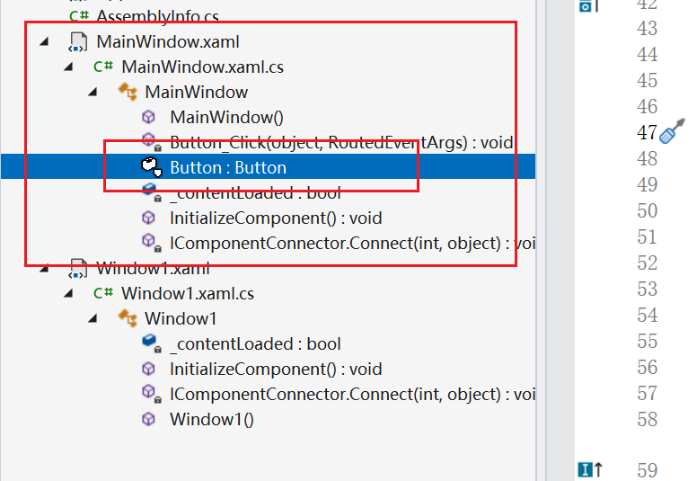

#  1.WPF路由事件

在WPF的元素树中，若某一个元素引发了一个事件，那么这个事件会沿着整棵树进行传播，而开发者可以在事件传播的沿途进行侦听（有点像设立关卡打劫）。一旦侦听到这个事件，便可以执行事件的回调函数。当然，只有被声明为RoutedEvent路由事件才具备传播功能。

路由事件：冒泡事件、隧道事件、直接事件

事件（作用角度）：生命周期事件、输入时间（键盘、鼠标、手写笔，触控时间）

隧道时间指的是搜索button从MainWindow->MainWindow.xaml->MainWindow->button。从根往里搜寻。

冒泡指的是从button->....->MainWindow.xaml从里往外搜寻。
