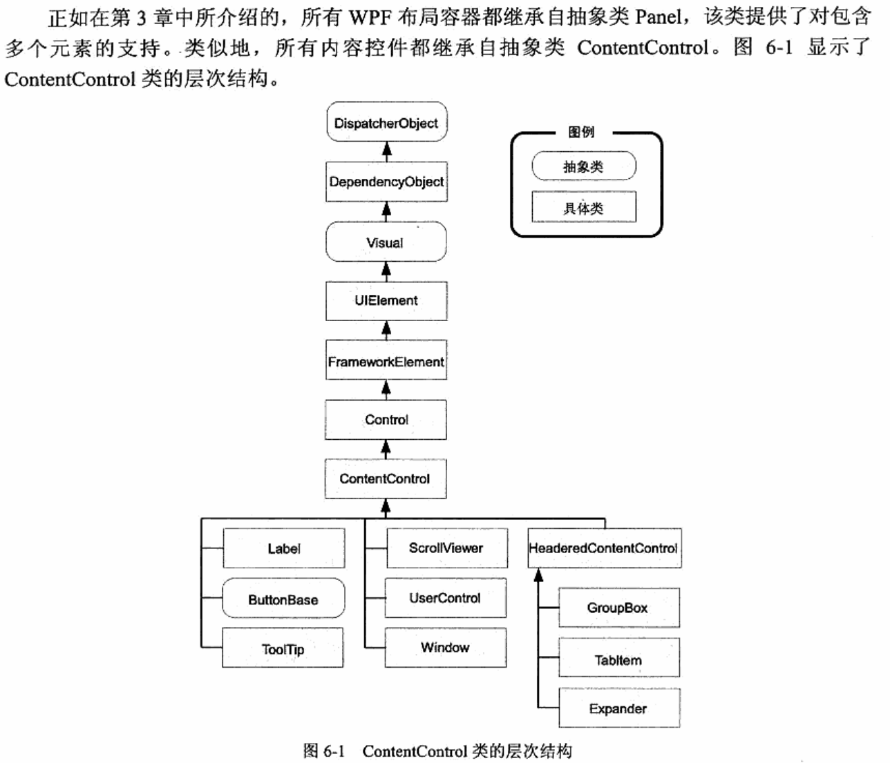

## 1.控件介绍

布局控件：Grid、StackPanel、WarpPanel、DockPanel、UniformPanel、Border。除了Border继承Decorator外其余全都继承自Panel

内容控件：

1.不带Header：Label、Button、CheckBox、RadioButton、ToolTip、AcrolleViewer。

2.带Header的：GroupBox、Expander

控件的继承关系

## 1.label标签

abel 控件接受希 望放入其中的单一内容。但不同的是 Label 控件支持记忆符(mnemonics)—本质上,记忆符是 能够为链接的控件设置焦点的快捷键。

