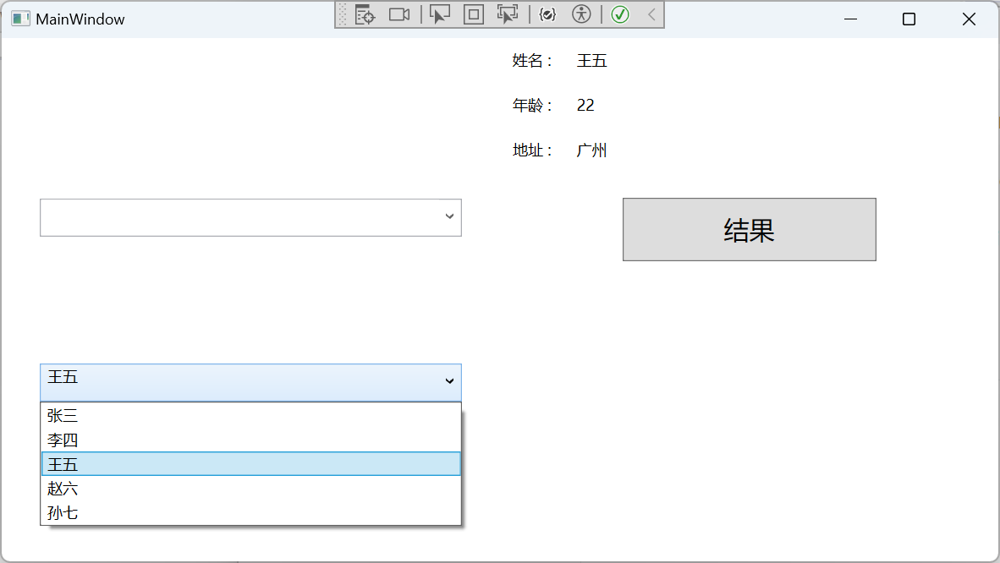

## 说明

很多时候，我们需要显示大量的数据，这些数据虽然众多，但是数据类型结构相同的，由于内容控件只能显示单个元素，要显示或操作多个元素组成的集合，那么，集合控件就派上用场了。WPF中的集合控件种类丰富，有类似表格的DataGrid，有单列表的ListBox，也有介于两者之前的ListView，还有，软件的菜单通常也是一个集合控件，以及软件下方的状态栏，同样也是一个集合控件。

WPF中常用的集合控件有：

| 控件名       | 说明                                                         |
| ------------ | ------------------------------------------------------------ |
| ItemsControl | 集合控件的基类，本身也是一个可以实例化的控件                 |
| ListBox      | 一个列表集合控件                                             |
| ListView     | 表示用于显示数据项列表的控件，它可以有列头标题               |
| DataGrid     | 表示可自定义的网格中显示数据的控件。                         |
| ComboBox     | 表示带有下拉列表的选择控件，通过单击控件上的箭头可显示或隐藏下拉列表。 |
| TabControl   | 表示包含多个共享相同的空间在屏幕上的项的控件。               |
| TreeView     | 用树结构(其中的项可以展开和折叠)中显示分层数据的控件         |
| Menu         | 表示一个 Windows 菜单控件，该控件可用于按层次组织与命令和事件处理程序关联的元素。 |
| ContextMenu  | 表示使控件能够公开特定于控件的上下文的功能的弹出菜单。       |
| StatusBar    | 表示应用程序窗口中的水平栏中显示项和信息的控件。             |

## 1.ItemsControl基类

### 属性

**1.Items属性**

ItemsControl类作为集合控件的基类，它提供了一个非常重要的属性，那就是Items属性。这个属性的类型是ItemCollection，也就是一个集合列表，那么这个列表的元素内容是object。

说明我们可以在集合控件中放任意引用类型的元素。

**2DisplayMemberPath属性**

这个属性用来获取或设置要显示的内容，它通常指某个数据源的某个属性名称，所以它是string类型。

**3HasItems属性**

这个属性用来判断当前集合控件是否有元素。

**4.IsTextSearchCaseSensitive属性**

这个属性如果为true，则搜索元素时区分大小写。

**5 IsTextSearchEnabled属性**

表示是否启用文字搜索。

好，接下来的几个属性将在后续进行学习，不过，我们先在这里了解一下它们的用途。

**6 ItemsPanel属性[重要]**

由于一个集合控件里面会显示多个数据项（一个数据代表一个家），那么这些数据项怎么排版？是像StackPanel一样水平或垂直排列，还是像WrapPanel瀑布流一样排例？这个ItemsPanel属性来决定。

**7 ItemTemplate属性[重要]**

在集合控件里，数据项有可能是一个复杂的实体，那么这些数据以什么样的UI布局界面呈现？也就是说，数据本身穿什么衣服？ItemTemplate属性就是来决定数据的外观的。如果把每个Item元素看成一个家，那么前面的ItemsPanel属性就是来决定邻里之间的实际距离以及房子和房子的排例走势。

**8 ItemContainerStyle属性[重要]**

ItemTemplate属性只能决定数据的外观，相当于这个家的内部装修以及家电家具的样式，而这个家外墙的装饰，则必须由ItemContainerStyle属性来承包。

**9 ItemContainerStyleSelector属性[重要]**

当我们选中这个集合控件中的某一项，并希望突出这一项，那就可以在ItemTemplateSelector属性中进行定义，也就是说，选择了某一项，某一项的外墙装饰发生改变。那同时要改变内部的样式呢？

**10 ItemTemplateSelector属性[重要]**

如果选中了某一项，并希望它的数据模块被重新定义，以突出这一项被选中，可以设置ItemTemplateSelector属性

**11 Template属性[重要]**

还记得吗？ItemsControl类继承于Control类，而Control类中有一个叫Template的属性，所以ItemsControl类自然也就拥有了这个属性，这是一个什么属性？它是ControlTemplate类，也就是控件模板，所以，如果我们希望把ItemsControl类本身的外观进行重定义，那就需要去设置Template属性

### 示例

```xaml
<Grid>
    <ItemsControl Margin="5" Padding="5" IsTextSearchEnabled="True">
        <Button Content="enter" Margin="0 5"/>
        <Border Height="20" Background="AntiqueWhite" Margin="0 5"/>
        <TextBlock Text="Hello World" Margin="0 5" Background="LightBlue"/>
        <ItemsControl Height="35" Background="GhostWhite"/>
        <CheckBox Content="CheckBox#元素" Margin="0 5"/>
        <StackPanel Orientation="Horizontal">
            <RadioButton Content="初级"/>
            <RadioButton Content="中级"/>
            <RadioButton Content="高级"/>
        </StackPanel>
        this is a textblock
        <Control Height="20" Background="Aquamarine"/>
        <ProgressBar Value="20" Height="20" Margin="0 5"/>
    </ItemsControl>
</Grid>
```


首先，我们在XMAL中实例化了一个ItemsControl控件，然后在ItemsControl里面实例化了一系列子控件，它们分别是Button、Border、TextBlock、ItemsControl、CheckBox、StackPanel、RadioButton、字符串、Label、Control和ProgressBar。

除了Control没有显示出来，其它全部都呈现在ItemsControl控件之中，因为这些子控件全部都在ItemsControl类的Items集合里面，那么，Control虽然能实例化，为什么没有显示出来呢？就连没有控件的字符串都能显示出来，这里面肯定有原因。

是的，这里我们引出一个知识点，那就是控件模板，因为**Control基类虽然有Background属性，但是我们并没有给Control基类的Template属性设置一个控件模板，所以Control能实例化，但是不能显示。**只能看到一个高度为30的空白区域。

而Border在设置Background属性后，为什么能显示？因为Border是一个装饰器，它继承于Decorator基类。

为什么单纯的字符串也能显示呢？因为实际上这个字符串外面被包裹了一层ContentPresenter实例，这个字符串是被赋值到了ContentPresenter的Content属性上，而ContentPresenter的ContentTemplate有一个默认模板。

## 2.Selector基类

Selector继承于ItemsControl，但它是一个抽象类，所以不能被实例化。从命名上看，它是一个选择器。

### Selector类的属性

| 属性名称                      | 说明                                                         |
| ----------------------------- | ------------------------------------------------------------ |
| SelectedValue                 | 获取或设置SelectedValuePath属性指定的元素的属性值            |
| SelectedItem                  | 获取或设置当前所选内容中的第一项或如果所选内容为空则返回 null |
| SelectedIndex                 | 获取或设置当前所选内容或返回的第一项的索引为负一 (-1) 如果所选内容为空。 |
| SelectedValuePath             | 获取或设置SelectedItem当前元素的某个属性名，这个元素属性名将决定SelectedValue的值 |
| IsSynchronizedWithCurrentItem | 是否同步当前项。                                             |

SelectedItem和SelectedValue有点类似，都是object类型。但是，他们俩不一定指同一个内容。比如，我们将有这样一个数据实体类。

```c#
public class Person
{
    public string Name { get; set; }
    public string Address { get; set; }
    public int Age { get; set; }
}
```

然后我们实例化多个Person组成一个集合绑定到Items属性中，这个时候选中某一个元素，SelectedItem便等于这个Person元素，但是SelectedValue是什么，要看SelectedValuePath的值，如果SelectedValuePath的值指向的是Person.Name，那么SelectedValue就是一个字符串，如果SelectedValuePath指向的是Person的Age ，那么SelectedValue就是一个int整数，**只有\**不设置\**SelectedValuePath时，SelectedValue和SelectedItem两者才相等，即Person实例**。

## 3.ListBox列表控件

ListBox是一个列表控件，用于显示条目类的数据，默认每行只能显示一个内容项，当然，我们可以通过修改它的数据模板，来自定义每一行（元素）的数据外观，达到显示更多数据的目的。

**属性分析**

ListBox自身的属性比较少，SelectionMode 属性比较重要，它可以决定当前的ListBox控件是单选还是多选，它的值为Extended时，表示用户需要按下shift键才能多选。如果SelectionMode为多选状态，那么多选的结果保存在哪去了？

答案是SelectedItems 属性。

另外，ListBox还自带了滚动条，如果内容超出显示区域，这时滚动条便起作用。

我们在上一章节提过DisplayMemberPath、SelectedValuePath、SelectedItem和SelectedValue，

### 示例

后端

```c#
class person
{
    public string name { get; set; }
    public int age { get; set; }
    public string address { get; set; }
}
/// <summary>
/// MainWindow.xaml 的交互逻辑
/// </summary>
public partial class MainWindow : Window
{
    public MainWindow()
    {
        InitializeComponent();
        listBox.ItemsSource = new List<person>
        {
            new person { name = "张三", age = 20, address = "北京" },
            new person { name = "李四", age = 21, address = "上海" },
            new person { name = "王五", age = 22, address = "广州" },
            new person { name = "赵六", age = 23, address = "深圳" },
            new person { name = "孙七", age = 24, address = "杭州" }
        };

    }

    private void Button_Click(object sender, RoutedEventArgs e)
    {
        var selectItem = listBox.SelectedItem;
        var selectValue = listBox.SelectedValue;
        textBlock.Text = $"{selectItem}, {selectValue}";

    }
}
```

前端代码

```c#
<StackPanel Orientation="Vertical">
    <ListBox x:Name="listBox" MaxHeight="200" DisplayMemberPath="name" SelectedValuePath="age"/>
    <Button Content="结果" Click="Button_Click"/>
    <TextBlock x:Name="textBlock"/>
</StackPanel>
```


### **ListBoxItem子项**

其实，ListBox还有它专门配合业务开发的子项控件——ListBoxItem。ListBoxItem继承于ContentControl内容控件，仔细想，这意味着什么？还记得我们在分享ContentControl提过”它有一个叫Content属性“一嘴吗？Content属性可以容纳任意引用类型，也就是说，ListBoxItem也可以容纳任意引用类型，也就是说，ListBox的子项也可以容纳任意的引用类型。

## 4.ListView数据列表控件

ListView继承于ListBox，在ListBox控件的基础上增加了数据视图。从而让我们可以很轻松的设置每一列的标题，以显示某个数据表结构及内容。

ListView类增加了一个叫View的属性，这个属性用来定义控件的数据样式，决定数据怎样显示。View属性的类型是ViewBase，但是，我们真正在使用View属性时，实际上实例化的是GridView类，因为GridView类是ViewBase的子类。所以，我们要看了解一下GridView的定义。

```c#
public class GridView : ViewBase, IAddChild
{
    public static readonly DependencyProperty ColumnCollectionProperty;
    public static readonly DependencyProperty ColumnHeaderContainerStyleProperty;
    public static readonly DependencyProperty ColumnHeaderTemplateProperty;
    public static readonly DependencyProperty ColumnHeaderTemplateSelectorProperty;
    public static readonly DependencyProperty ColumnHeaderStringFormatProperty;
    public static readonly DependencyProperty AllowsColumnReorderProperty;
    public static readonly DependencyProperty ColumnHeaderContextMenuProperty;
    public static readonly DependencyProperty ColumnHeaderToolTipProperty;
 
    public GridView();
 
    public static ResourceKey GridViewItemContainerStyleKey { get; }
    public static ResourceKey GridViewStyleKey { get; }
    public static ResourceKey GridViewScrollViewerStyleKey { get; }
    public string ColumnHeaderStringFormat { get; set; }
    public DataTemplateSelector ColumnHeaderTemplateSelector { get; set; }
    public DataTemplate ColumnHeaderTemplate { get; set; }
    public Style ColumnHeaderContainerStyle { get; set; }
    public GridViewColumnCollection Columns { get; }
    public object ColumnHeaderToolTip { get; set; }
    public bool AllowsColumnReorder { get; set; }
    public ContextMenu ColumnHeaderContextMenu { get; set; }
    protected internal override object ItemContainerDefaultStyleKey { get; }
    protected internal override object DefaultStyleKey { get; }
 
    public static GridViewColumnCollection GetColumnCollection(DependencyObject element);
    public static void SetColumnCollection(DependencyObject element, GridViewColumnCollection collection);
    public static bool ShouldSerializeColumnCollection(DependencyObject obj);
    public override string ToString();
    protected virtual void AddChild(object column);
    protected virtual void AddText(string text);
    protected internal override void ClearItem(ListViewItem item);
    protected internal override IViewAutomationPeer GetAutomationPeer(ListView parent);
    protected internal override void PrepareItem(ListViewItem item);
 
}
```

GridView提供了一些可供设置的模板和样式属性，这些我们先放一边，在WPF基础章节的内容学习中，我们先学习它的Columns 属性，它是一个集合属性，而集合中元素的类型是GridViewColumn。

GridViewColumn最关键的只有两个属性，分别是标题和要显示的成员（指向了Person实体的某个属性名）。

### 示例

```c#
    class person
    {
        public string name { get; set; }
        public int age { get; set; }
        public string address { get; set; }
    }
    /// <summary>
    /// MainWindow.xaml 的交互逻辑
    /// </summary>
    public partial class MainWindow : Window
    {
        public MainWindow()
        {
            InitializeComponent();
            listBox.ItemsSource = new List<person>
            {
                new person { name = "张三", age = 20, address = "北京" },
                new person { name = "李四", age = 21, address = "上海" },
                new person { name = "王五", age = 22, address = "广州" },
                new person { name = "赵六", age = 23, address = "深圳" },
                new person { name = "孙七", age = 24, address = "杭州" }
            };

        }

        private void Button_Click(object sender, RoutedEventArgs e)
        {
         
        }

        private void listBox_SelectionChanged(object sender, SelectionChangedEventArgs e)
        {
            if (listBox == null) return;
            if (listBox.SelectedItem == null) return;
            
            var selectItem = listBox.SelectedItem;
            _name.Text = (selectItem as person).name;
            _age.Text = (selectItem as person).age.ToString();
            _address.Text = (selectItem as person).address;
        }
```

前端代码

```xaml
<Grid>
    <Grid.ColumnDefinitions>
        <ColumnDefinition Width="*"/>
        <ColumnDefinition Width="*"/>
    </Grid.ColumnDefinitions>
    <ListView Grid.Column="0" x:Name="listBox" MaxHeight="200" SelectionChanged="listBox_SelectionChanged">
        <ListView.View>
            <GridView>
                <GridViewColumn Header="姓名" DisplayMemberBinding="{Binding name}"/>
                <GridViewColumn Header="年龄" DisplayMemberBinding="{Binding age}"/>
                <GridViewColumn Header="地址" DisplayMemberBinding="{Binding address}"/>
            </GridView>
        </ListView.View>
    </ListView>
    <StackPanel Grid.Column="1" Orientation="Vertical">
        <StackPanel Orientation="Horizontal">
            <TextBlock Text="姓名 :" Margin="10"/>
            <TextBlock x:Name="_name"  Margin="10"/>
        </StackPanel>
        <StackPanel Orientation="Horizontal">
            <TextBlock Text="年龄 :" Margin="10"/>
            <TextBlock x:Name="_age"  Margin="10"/>
        </StackPanel>
        <StackPanel Orientation="Horizontal">
            <TextBlock Text="地址 :" Margin="10"/>
            <TextBlock x:Name="_address"  Margin="10"/>
        </StackPanel>
        <Button Content="结果" Click="Button_Click" Margin="20" Width="200" Height="50" FontSize="20"/>
        
    </StackPanel>
</Grid>
```


事件处理

在ListView控件的SelectionChanged事件中，我们先将sender转成ListView ，再从中获取当前选中项（即person），最后显示详细信息在界面上即可。这样就演示了数据怎么加载显示到ListView，又怎么样从ListView上获取的过程。

而类似于ListView的效果效果，还有一个专门用来显示数据的控件，它叫DataGrid，从某种意义上来说，它甚至可以开发类似Excel表格的效果。

## 5.DataGrid数据表格控件

DataGrid是一个可以多选的数据表格控件。所以，它继承一个支持多选的父类——MultiSelector。

```c#
public abstract class MultiSelector : Selector
{
    protected MultiSelector();
 
    public IList SelectedItems { get; }
    protected bool CanSelectMultipleItems { get; set; }
    protected bool IsUpdatingSelectedItems { get; }
 
    public void SelectAll();
    public void UnselectAll();
    protected void BeginUpdateSelectedItems();
    protected void EndUpdateSelectedItems();
 
}
```

从上面的定义来看，DataGrid多选的结果会保存在SelectedItems 只读属性中，CanSelectMultipleItems 属性用来设置是否开启多选。

事件成员

DataGrid一共有23个事件成员，它们分别如下所示

| 事件名称                    | 说明                                           |
| --------------------------- | ---------------------------------------------- |
| Sorting                     | 对列进行排序时发生。                           |
| AutoGeneratedColumns        | 所有列的自动生成完成后发生。                   |
| AutoGeneratingColumn        | 自动生成单独的列时出现。                       |
| ColumnHeaderDragDelta       | 每次鼠标位置发生更改时在用户拖动列标题时发生。 |
| ColumnHeaderDragStarted     | 当用户开始使用鼠标拖动列标题时发生。           |
| ColumnHeaderDragCompleted   | 当用户使用鼠标拖动后释放列标题时发生。         |
| SelectedCellsChanged        | 发生时 DataGrid.SelectedCells 集合更改。       |
| ColumnReordering            | 在列移至的显示顺序中的新位置之前发生。         |
| RowDetailsVisibilityChanged | 当某一行的可见性详细信息元素更改时发生。       |
| UnloadingRow                | 发生时 DataGridRow 对象将成为可供重用。        |
| LoadingRowDetails           | 新的行的详细信息模板应用于行时发生。           |
| InitializingNewItem         | 创建一个新项时出现。                           |
| PreparingCellForEdit        | 在单元格进入编辑模式时发生。                   |
| BeginningEdit               | 发生行或单元格进入编辑模式之前。               |
| CurrentCellChanged          | 在 DataGrid.CurrentCell 属性的值更改后发生。   |
| CellEditEnding              | 在单元格的编辑将在提交或取消前发生。           |
| RowEditEnding               | 在提交或取消行编辑之前发生。                   |
| LoadingRow                  | 加载row时                                      |
| ColumnDisplayIndexChanged   | 其中一个列更改属性时                           |
| UnloadingRowDetails         | 行详细信息元素成为可供重用时发生。             |
| AddingNewItem               | 新项添加到DataGrid之前发生                     |
| CopyingRowClipboardContent  | 默认行内容准备好之后发生。                     |
| ColumnReordered             | 在列移至的显示顺序中的新位置时发生。           |

### DataGrid属性

属性分析

DataGrid提供了大量的依赖属性，合理充分利用这些属性，在开发ERP、CMS、报表等软件时可达到事半功倍的效果。下面我们以表格的形式，先了解一下各属性的功能，然后在本节中学习一些基础属性，以掌握该控件的基本用法，剩下的属性放到模板样式的章节中学习。

| 属性名称                                  | 说明                                                      | 备注 |
| ----------------------------------------- | --------------------------------------------------------- | ---- |
| FocusBorderBrushKey                       | 获取引用焦点的单元格的默认边框画笔的键。                  |      |
| SelectAllCommand                          | 表示指示想要选择的所有单元格的命令                        |      |
| HeadersVisibilityConverter                | 获取标题显示隐藏的转换器，即HeadersVisibility属性的转换器 |      |
| RowDetailsScrollingConverter              | 获取将转换为一个布尔值转换器                              |      |
| DeleteCommand                             | 表示指示想要删除当前行的命令。                            |      |
| RowHeaderTemplate                         | 获取或设置行标题的模板。                                  | 重要 |
| RowHeaderTemplateSelector                 | 获取或设置行标题的模板选择器。                            |      |
| VerticalScrollBarVisibility               | 是否显示垂直滚动条                                        |      |
| HorizontalScrollBarVisibility             | 是否显示水平滚动条                                        |      |
| CanUserAddRows                            | 是否可以添加新行                                          | 重要 |
| CurrentItem                               | 当前选中行（一般指绑定的数据源的某一个元素）              | 常用 |
| CurrentColumn                             | 获取或设置包含当前单元格的列。                            |      |
| CurrentCell                               | 获取或设置具有焦点的单元格。                              |      |
| CanUserDeleteRows                         | 是否可以删除行                                            | 重要 |
| RowHeaderStyle                            | 获取或设置应用于所有行标题的样式。                        | 重要 |
| RowDetailsVisibilityMode                  | 获取或设置一个值，该值指示何时显示某行的详细信息部分。    |      |
| IsReadOnly                                | 当前控件是否只读                                          | 常用 |
| ColumnHeaderStyle                         | 获取或设置所有列标题的样式                                | 重要 |
| RowStyle                                  | 获取或设置应用到的所有行的样式。                          | 重要 |
| HeadersVisibility                         | 获取或设置用于指定行和列标题的可见性的值。                |      |
| AreRowDetailsFrozen                       | 获取或设置一个值，该值指示是否可水平滚动行详细信息。      |      |
| AlternatingRowBackground                  | 获取或设置交替行上使用的背景画笔。                        | 重要 |
| RowBackground                             | 获取或设置用于行背景的默认画笔。                          |      |
| RowStyleSelector                          | 获取或设置行的样式选择器。                                |      |
| RowValidationRules                        | 获取用于验证每个行中的数据的规则。                        |      |
| RowValidationErrorTemplate                | 获取或设置用于以可视方式指示行验证中的错误的模板。        |      |
| VerticalGridLinesBrush                    | 获取或设置用于绘制垂直网格线的画笔。                      | 常用 |
| HorizontalGridLinesBrush                  | 获取或设置用于绘制水平网格线的画笔。                      |      |
| GridLinesVisibility                       | 获取或设置一个值，该值指示显示哪些网格线。                |      |
| MaxColumnWidth                            | 获取或设置列和标头中的最大宽度约束                        |      |
| MinColumnWidth                            | 获取或设置列和标头中的最小宽度约束                        |      |
| ColumnWidth                               | 获取或设置标准宽度和列和中的标头的大小调整模式            |      |
| CanUserResizeColumns                      | 获取或设置用户是否可以通过使用鼠标调整列的宽度。          |      |
| Columns                                   | 获取一个集合中的所有列                                    | 常用 |
| RowHeaderWidth                            | 获取或设置行标题列的宽度。                                |      |
| RowHeaderActualWidth                      | 获取呈现的行标题列的宽度。                                |      |
| ColumnHeaderHeight                        | 获取或设置列标题行的高度。                                |      |
| CellStyle                                 | 获取或设置所有单元格的样式                                | 常用 |
| RowDetailsTemplate                        | 获取或设置用于显示行详细信息的模板。                      |      |
| MinRowHeight                              | 获取或设置行和中的标头的最小高度约束                      |      |
| CanUserResizeRows                         | 获取或设置用户是否可以通过使用鼠标调整行的高度。          |      |
| RowHeight                                 | 获取或设置的所有行的建议的高度。                          |      |
| RowDetailsTemplateSelector                | 获取或设置用于行详细信息的模板选择器。                    |      |
| CellsPanelHorizontalOffset                | 获取DataGridCellsPanel的水平偏移量                        |      |
| ClipboardCopyMode                         | 获取或设置一个值，指示如何将内容复制到剪贴板。            |      |
| NonFrozenColumns ViewportHorizontalOffset | 获取在视区的可滚动列的水平偏移量。                        |      |
| FrozenColumnCount                         | 获取或设置非滚动列的数量。                                | 常用 |
| AutoGenerateColumns                       | 获取或设置一个值，该值指示是否自动创建列。                | 常用 |
| NewItemMargin                             | 获取或设置新的项目行的边距。                              |      |
| CanUserSortColumns                        | 是否可以单击列标题来对列排序。                            | 常用 |
| SelectionUnit                             | 选择行的模式                                              |      |
| SelectionMode                             | 是否支持多选                                              | 重要 |
| SelectedCells                             | 获取当前选定的单元格的列表。                              |      |
| HandlesScrolling                          | 是否支持自定义键盘滚动。                                  |      |

在上述表格中，Columns属性是DataGrid最基本的一个属性。它是一个ObservableCollection<DataGridColumn>类型的集合，表示DataGrid的列的集合。其实DataGridColumn只是一个抽象基类，我们真正在实例化时，是实例化DataGridColumn的子类，然后放到Columns属性中。

那么DataGridColumn有哪些子类呢？

- DataGridTextColumn 表示文本内容的列
- DataGridCheckBoxColumn 表示复选框的列
- DataGridComboBoxColumn 表示下拉框的列
- DataGridTemplateColumn 表示模板的列（万金油）

在本列中，我们将以最简单的DataGridTextColumn 为例。


### 示例

后端同ListView

前端

```xaml
<Grid>
    <Grid.ColumnDefinitions>
        <ColumnDefinition Width="*"/>
        <ColumnDefinition Width="*"/>
    </Grid.ColumnDefinitions>
    <DataGrid Grid.Column="0" x:Name="listBox" SelectionChanged="listBox_SelectionChanged" IsReadOnly="True" CanUserAddRows="False" Margin="10"
              AutoGenerateColumns="False">
        <DataGrid.Columns>
            <DataGridTextColumn Header="姓名" Binding="{Binding name}" Width="50"/>
            <DataGridTextColumn Header="年龄" Binding="{Binding age}" Width="50"/>
            <DataGridTextColumn Header="地址" Binding="{Binding address}" Width="auto"/>
        </DataGrid.Columns>    
    </DataGrid>
    <StackPanel Grid.Column="1" Orientation="Vertical">
        <StackPanel Orientation="Horizontal">
            <TextBlock Text="姓名 :" Margin="10"/>
            <TextBlock x:Name="_name"  Margin="10"/>
        </StackPanel>
        <StackPanel Orientation="Horizontal">
            <TextBlock Text="年龄 :" Margin="10"/>
            <TextBlock x:Name="_age"  Margin="10"/>
        </StackPanel>
        <StackPanel Orientation="Horizontal">
            <TextBlock Text="地址 :" Margin="10"/>
            <TextBlock x:Name="_address"  Margin="10"/>
        </StackPanel>
        <Button Content="结果" Click="Button_Click" Margin="20" Width="200" Height="50" FontSize="20"/>
        
    </StackPanel>
</Grid>
```


**我们将DataGrid的IsReadOnly="True"，这是因为我们直接将数据元素一条一条的加入到DataGrid的Items属性中，而Items属性本身是一个只读属性，不支持写入。**

**这就要用到ItemsControl基类中的ItemsSource数据源属性。**

**我们需要采用DataGrid另外一种赋值方式——数据源赋值。即把一个集合绑定到该属性上，这样在前端就可以编辑数据源，从而不会引发报错。**

## 6.ComboBox下拉框控件

ComboBox表示带有下拉列表的控件，实际上您可以把它看成两个部分组成，一个类似TextBox文本输入框，所以它有一个Text文本属性，用于获取ComboBox框的文本值，另一个是类似ListBox的列表框，用于显示ComboBox绑定的所有数据源。

ComboBox继承于Selector，所以，它只能是单选操作。由于这个控件由两个部分构成，所以在用法上，我们也可以有两种主要用法——类似TextBox用法和类似ListBox用法。

属性成员

| 属性名称                        | 说明                                             |
| ------------------------------- | ------------------------------------------------ |
| ShouldPreserveUserEnteredPrefix | 是否保留用户的输入，或者输入替换匹配项。         |
| IsEditable                      | 是否启用或禁用编辑文本框中文本                   |
| Text                            | 获取或设置当前选定项的文本。                     |
| IsReadOnly                      | 文本内容是否只读                                 |
| SelectionBoxItem                | 获取在选择框中显示的项。                         |
| MaxDropDownHeight               | 获取或设置一个组合框下拉列表的最大高度。         |
| SelectionBoxItemStringFormat    | 指定选择框中文本的显示格式                       |
| StaysOpenOnEdit                 | 在编辑输入框文本时，希望下拉框保持打开，则为true |
| IsSelectionBoxHighlighted       | 是否突出显示SelectionBoxItem                     |
| IsDropDownOpen                  | 是否打开组合框下拉列表。                         |
| SelectionBoxItemTemplate        | 获取选择框内容的项模板。                         |

### ComboBox示例

后端代码

```c#
class person
{
    public string name { get; set; }
    public int age { get; set; }
    public string address { get; set; }
}
/// <summary>
/// MainWindow.xaml 的交互逻辑
/// </summary>
public partial class MainWindow : Window
{
    public MainWindow()
    {
        InitializeComponent();
        comboxBox2.ItemsSource = new List<person>
        {
            new person { name = "张三", age = 20, address = "北京" },
            new person { name = "李四", age = 21, address = "上海" },
            new person { name = "王五", age = 22, address = "广州" },
            new person { name = "赵六", age = 23, address = "深圳" },
            new person { name = "孙七", age = 24, address = "杭州" }
        };

    }

    private void comboxBox1_TextChanged(object sender, TextChangedEventArgs e)
    {

    }

    private void comboxBox2_TextChanged(object sender, TextChangedEventArgs e)
    {
        if (comboxBox2 == null) return;
        if (comboxBox2.SelectedItem == null) return;

        var selectItem = comboxBox2.SelectedItem;
        _name.Text = (selectItem as person).name;
        _age.Text = (selectItem as person).age.ToString();
        _address.Text = (selectItem as person).address;
    }

    private void Button_Click(object sender, RoutedEventArgs e)
    {

    }

    private void comboxBox2_SelectionChanged(object sender, SelectionChangedEventArgs e)
    {
        if (sender == null) return;
        var combox = sender as ComboBox;
        if (combox.SelectedItem == null) return;

        var selectItem = combox.SelectedItem;
        _name.Text = (selectItem as person).name;
        _age.Text = (selectItem as person).age.ToString();
        _address.Text = (selectItem as person).address;
    }
}
```


前端代码

```xaml
<Grid>
    <Grid.ColumnDefinitions>
        <ColumnDefinition Width="*"/>
        <ColumnDefinition Width="*"/>
    </Grid.ColumnDefinitions>
    <StackPanel Grid.Column="0" VerticalAlignment="Center">
        <ComboBox x:Name="comboxBox1" IsEditable="True" Height="30" Margin="30 50"
                  TextBoxBase.TextChanged="comboxBox1_TextChanged"/>
        <ComboBox x:Name="comboxBox2" IsEditable="False" Height="30" Margin="30 50"
                  VerticalAlignment="Top" DisplayMemberPath="name"
                  SelectionChanged="comboxBox2_SelectionChanged"/>
    </StackPanel>
    <StackPanel Grid.Column="1" Orientation="Vertical">
        <StackPanel Orientation="Horizontal">
            <TextBlock Text="姓名 :" Margin="10"/>
            <TextBlock x:Name="_name"  Margin="10"/>
        </StackPanel>
        <StackPanel Orientation="Horizontal">
            <TextBlock Text="年龄 :" Margin="10"/>
            <TextBlock x:Name="_age"  Margin="10"/>
        </StackPanel>
        <StackPanel Orientation="Horizontal">
            <TextBlock Text="地址 :" Margin="10"/>
            <TextBlock x:Name="_address"  Margin="10"/>
        </StackPanel>
        <Button Content="结果" Click="Button_Click" Margin="20" Width="200" Height="50" FontSize="20"/>
        
    </StackPanel>
</Grid>
```



## 7.TabControl控件

TabControl表示包含多个共享相同的空间在屏幕上的项的控件。它也是继承于Selector基类，所以TabControl也只支持单选操作。另外，TabControl的元素只能是TabItem，这个TabItem继承于HeaderedContentControl类，所以TabControl的元素实际上是一个带标题的ContentControl内容控件。

我们曾经在聊[GroupBox控件](http://www.wpfsoft.com/2023/08/29/1497.html)和[Expander折叠控件](http://www.wpfsoft.com/2023/08/31/1652.html)时都曾提到过这个HeaderedContentControl类，原来大家都用了这个带标题的内容控件。所以TabControl控件看起来就像是多个GroupBox组合而来。

属性成员

| 属性名称                        | 说明                                               |
| ------------------------------- | -------------------------------------------------- |
| ContentTemplate                 | 表示TabItem元素的内容模板                          |
| SelectedContentStringFormat     | 当前所选内容的格式                                 |
| SelectedContentTemplateSelector | 获取当前选定的TabItem项的模板选择器                |
| SelectedContentTemplate         | 当前选定的TabItem项的模板                          |
| SelectedContent                 | 当前选定的TabItem项里面的内容（也是一些控件）      |
| TabStripPlacement               | 获取或设置选项卡标题相对于选项卡上内容的对齐方式。 |
| ContentStringFormat             | 指定如何设置内容的格式                             |
| ContentTemplateSelector         | 获取或设置内容模板选择器                           |

TabControl的SelectedContent可能是我们比较常用的一个属性，事实上，TabControl通常被当成布局控件来使用。

### TabControl示例

前端代码

```xaml
<Window x:Class="HelloWorld.MainWindow"
        xmlns="http://schemas.microsoft.com/winfx/2006/xaml/presentation"
        xmlns:x="http://schemas.microsoft.com/winfx/2006/xaml"
        xmlns:d="http://schemas.microsoft.com/expression/blend/2008"
        xmlns:mc="http://schemas.openxmlformats.org/markup-compatibility/2006"
        xmlns:local="clr-namespace:HelloWorld" 
        xmlns:forms="clr-namespace:System.Windows.Forms;assembly=System.Windows.Forms"
        mc:Ignorable="d" FontSize="14"
        Title="WPF中文网之控件课程 - www.wpfsoft.com" Height="350" Width="500">
    <Grid>
        <Grid.RowDefinitions>
            <RowDefinition/>
            <RowDefinition Height="50"/>
        </Grid.RowDefinitions>
        <TabControl x:Name="_tabControl" Grid.Row="0" SelectionChanged="_tabControl_SelectionChanged">
            <TabItem Header="首页">
                <Border Background="LightBlue">
                    <TextBlock Text="首页的界面" FontSize="24" HorizontalAlignment="Center" VerticalAlignment="Center"/>
                </Border>
            </TabItem>
            <TabItem Header="WPF目录">
                <Border Background="LightCoral">
                    <TextBlock Text="WPF目录的界面" FontSize="24" HorizontalAlignment="Center" VerticalAlignment="Center"/>
                </Border>
            </TabItem>
            <TabItem Header="官方文档">
                <Border Background="LightCyan">
                    <TextBlock Text="官方文档的界面" FontSize="24" HorizontalAlignment="Center" VerticalAlignment="Center"/>
                </Border>
            </TabItem>
            <TabItem Header="付费课程">
                <Border Background="LightGoldenrodYellow">
                    <TextBlock Text="付费课程的界面" FontSize="24" HorizontalAlignment="Center" VerticalAlignment="Center"/>
                </Border>
            </TabItem>
            <TabItem Header="统计">
                <Border Background="LightGreen">
                    <TextBlock Text="统计的界面" FontSize="24" HorizontalAlignment="Center" VerticalAlignment="Center"/>
                </Border>
            </TabItem>
        </TabControl>
        <TextBlock x:Name="_textBlock" TextWrapping="Wrap" Grid.Row="1"/>
    </Grid>
</Window>
```

后端代码

```c#
public partial class MainWindow : Window
{        
    public MainWindow()
    {
        InitializeComponent(); 
    }
 
    private void _tabControl_SelectionChanged(object sender, SelectionChangedEventArgs e)
    {
        var tab = sender as TabControl;
        var item = tab.SelectedItem as TabItem;
        var content = tab.SelectedContent;
        _textBlock.Text = "标题:" + item.Header.ToString() + " 内容:" + content;
    }
}
```


我们订阅了TabControl控件的SelectionChanged事件，并在回调函数中获取了当前选中的TabItem对象以及它里面的内容。

## 8.TreeView树控件

TreeView其实是一个比较复杂的控件，像操作系统的资源管理器就是一个TreeView。所以它常用于显示文件夹、目录等具有层级结构的数据。TreeView由节点和分支构成，每个节点可以包含零个或多个子节点，分支表示父子关系。在TreeView中，每个节点表示为TreeViewItem对象，可以通过TreeView的Items属性来获取或设置TreeViewItem对象集合。

在使用TreeView加载节点时，需要掌握一些递归思想。

一、TreeViewItem元素简介

TreeViewItem作为TreeView唯一的元素类型，它继承于HeaderedItemsControl（带标题），而HeaderedItemsControl又继承于ItemsControl，由此可见，TreeViewItem元素本身也是一个集合控件。

TreeViewItem有两个常用的属性，分别是IsSelected属性和IsExpanded属性，IsSelected表示当前元素是否选中，IsExpanded表示当前元素是否展开。

### 属性

SelectedValuePath属性：获取或设置SelectedItem或SelectedValue的路径。

SelectedValue属性：获取SelectedItem的值

SelectedItem属性：获取当前选中的项

### TreeView示例

接下来，我们以一个简单的示例，模仿操作系统的资源管理器的目录加载。

前端代码

```xaml
<Window x:Class="HelloWorld.MainWindow"
        xmlns="http://schemas.microsoft.com/winfx/2006/xaml/presentation"
        xmlns:x="http://schemas.microsoft.com/winfx/2006/xaml"
        xmlns:d="http://schemas.microsoft.com/expression/blend/2008"
        xmlns:mc="http://schemas.openxmlformats.org/markup-compatibility/2006"
        xmlns:local="clr-namespace:HelloWorld" 
        xmlns:forms="clr-namespace:System.Windows.Forms;assembly=System.Windows.Forms"
        mc:Ignorable="d" FontSize="14"
        Title="WPF中文网之控件课程 - www.wpfsoft.com" Height="350" Width="500">
    <Grid>
        <Grid.RowDefinitions>
            <RowDefinition Height="auto"/>
            <RowDefinition/>
        </Grid.RowDefinitions>
        <StackPanel Orientation="Horizontal">
            <TextBlock Text="根目录" VerticalAlignment="Center" Margin="3"/>
            <TextBox x:Name="_TextBox" Width="380" Height="25" Margin="3"/>
            <Button Content="选择..." MinWidth="45" Margin="3" Click="Button_Click"/>
        </StackPanel>
        <TreeView x:Name="_TreeView" Grid.Row="1" SelectedItemChanged="_TreeView_SelectedItemChanged"/>
    </Grid>
</Window>
```

后端代码

```c#
public partial class MainWindow : Window
{        
    public MainWindow()
    {
        InitializeComponent();            
    }        
 
    private void Button_Click(object sender, RoutedEventArgs e)
    {
        System.Windows.Forms.FolderBrowserDialog dialog = new System.Windows.Forms.FolderBrowserDialog();
        if (dialog.ShowDialog() == System.Windows.Forms.DialogResult.OK)
        {
            _TextBox.Text = dialog.SelectedPath;
            LoadTreeView(dialog.SelectedPath);
 
        }
    }
 
    private void LoadTreeView(string rootPath)
    {
        // 设置根节点
        TreeViewItem rootNode = new TreeViewItem();
        rootNode.Header = "根目录";
 
        // 加载子文件夹和文件
        LoadSubDirectory(rootNode, rootPath);
 
        // 将根节点添加到TreeView中
        _TreeView.Items.Add(rootNode);
    }
 
    private void LoadSubDirectory(TreeViewItem node, string path)
    {
        try
        {
            DirectoryInfo dirInfo = new DirectoryInfo(path);
 
            // 加载子文件夹
            foreach (DirectoryInfo subDirInfo in dirInfo.GetDirectories())
            {
                TreeViewItem subNode = new TreeViewItem();
                subNode.Header = subDirInfo.Name;
 
                LoadSubDirectory(subNode, subDirInfo.FullName);
 
                node.Items.Add(subNode);
            }
 
            // 加载文件
            foreach (FileInfo fileInfo in dirInfo.GetFiles())
            {
                TreeViewItem subNode = new TreeViewItem();
                subNode.Header = fileInfo.Name;
 
                node.Items.Add(subNode);
            }
        }
        catch (Exception ex)
        {
            MessageBox.Show(ex.Message);
        }
    }
 
    private void _TreeView_SelectedItemChanged(object sender, RoutedPropertyChangedEventArgs<object> e)
    {
        // 获取选中的节点
        TreeViewItem selectedNode = _TreeView.SelectedItem as TreeViewItem;
 
        // 显示选中节点的Header
        if (selectedNode != null)
        {
            MessageBox.Show(selectedNode.Header.ToString());
        }
    }
}
```


首先，通过鼠标操作，选择TreeView的根目录，然后，利用DirectoryInfo获取当前所有目录，再利用递归调用，一层一层的获取所有子目录，最后以TreeViewItem元素一层层加载到控件中。

## 9.Menu菜单

Menu控件继承于MenuBase，而MenuBase继承于ItemsControl。

学习Menu之前，要先了解一下MenuBase基类。它是一个抽象类，拥有一个ItemContainerTemplateSelector模板选择器，并重写了一些关于键盘和鼠标的方法。

Menu的子项必须为MenuItem。这个MenuItem和前面的TreeViewItem类似，拥有共同的HeaderedItemsControl父类，也就是说，MenuItem本身也是一个集合控件，若要以代码形式加载Menu的内容，也必须要掌握递归的加载思路。

MenuItem从鼠标的交互上，提供了两种方式。第一种是提供了Click事件，开发者可以订阅该事件以编写相应的业务逻辑。第二种是提供了ICommand接口属性和CommandParameter命令参数，以WPF命令的形式开发业务逻辑。

### Menu示例

前端代码

```
<Window x:Class="HelloWorld.MainWindow"
        xmlns="http://schemas.microsoft.com/winfx/2006/xaml/presentation"
        xmlns:x="http://schemas.microsoft.com/winfx/2006/xaml"
        xmlns:d="http://schemas.microsoft.com/expression/blend/2008"
        xmlns:mc="http://schemas.openxmlformats.org/markup-compatibility/2006"
        xmlns:local="clr-namespace:HelloWorld" 
        xmlns:forms="clr-namespace:System.Windows.Forms;assembly=System.Windows.Forms"
        mc:Ignorable="d" FontSize="14"
        Title="WPF中文网之控件课程 - www.wpfsoft.com" Height="350" Width="500">
    <Grid>
        <Grid.RowDefinitions>
            <RowDefinition Height="auto"/>
            <RowDefinition/>
        </Grid.RowDefinitions>        
        <Menu x:Name="_Menu">
            <MenuItem Header="文件">
                <MenuItem Header="新建" Click="MenuItem_Click"/>
                <MenuItem Header="打开" Click="MenuItem_Click">
                    <MenuItem.Icon>
                        <Image Source="/Images/logo.png"/>
                    </MenuItem.Icon>
                </MenuItem>
            </MenuItem>                      
            <MenuItem Header="编辑"/>
            <MenuItem Header="视图"/>
            <MenuItem Header="项目"/>
            <MenuItem Header="调试"/>
            <MenuItem Header="测试"/>
            <MenuItem Header="分析"/>
            <MenuItem Header="工具"/>
            <MenuItem Header="帮助"/>
        </Menu>
        <TextBlock x:Name="_TextBlock" Grid.Row="1" HorizontalAlignment="Center" VerticalAlignment="Center"></TextBlock>
    </Grid>
</Window>
```

后端代码

```
public partial class MainWindow : Window
{        
    public MainWindow()
    {
        InitializeComponent();            
    }
 
    private void MenuItem_Click(object sender, RoutedEventArgs e)
    {
        var item = sender as MenuItem;
        _TextBlock.Text = $"你单击了 {item.Header}";
    }
}
```


上面演示了Menu最基本的用法

## 10.ContextMenu上下文菜单

ContextMenu上下文菜单必须要依附于一个“宿主控件”。由于FrameworkElement基类有一个叫ContextMenu的属性，代表了鼠标右键时弹出一个菜单，所以大多数控件都可以设置“上下文菜单”。

ContextMenu继承于MenuBase，而MenuBase继承于ItemsControl。所以，ContextMenu本质上也是一个集合控件。而它的元素则是MenuItem。在用法上，与Menu控件差不多。

属性成员

| 属性名称                     | 说明                                             |
| ---------------------------- | ------------------------------------------------ |
| HorizontalOffset             | 获取或设置目标原点和弹出项对齐之间的水平距离点。 |
| StaysOpen                    | 是否保持打开状态                                 |
| CustomPopupPlacementCallback | 获取或设置ContextMenu指示在屏幕位置的回调        |
| HasDropShadow                | 是否有投影出现的上下文菜单。                     |
| Placement                    | 获取或设置ContextMenu显示的相对位置              |
| PlacementRectangle           | 获取或设置相对于其上下文菜单位于在打开时的区域。 |
| PlacementTarget              | 获取或设置ContextMenu打开时的相对控件            |
| IsOpen                       | 是否打开                                         |
| VerticalOffset               | 获取或设置目标原点和弹出项对齐之间的垂直距离点。 |

### ContextMenu示例

```xaml
<Grid>
    <Border Background="LightBlue" Width="200" Height="100" CornerRadius="15">
        <Border.ContextMenu>
            <ContextMenu>
                <MenuItem Header="复制"/>
                <MenuItem Header="粘贴"/>
                <MenuItem Header="删除"/>
                <MenuItem Header="关于"/>
            </ContextMenu>
        </Border.ContextMenu>
    </Border>        
</Grid>
```


## 11.StatusBar状态栏

StatusBar是一个“包容性”极强的控件，通常的作用是作为程序的状态内容显示。它同样继承于ItemsControl基类，所以，它也是一个集合控件。

它的元素是StatusBarItem类型，而StatusBarItem继承于ContentControl内容控件，所以，本质上讲，StatusBar的元素可以是任意类型的控件。因为StatusBarItem元素有一个叫Content的属性。

这个控件其实并不常用，通常情况下被当成一个布局控件来使用。

如下所示

```xaml
<Grid>
    <Grid.RowDefinitions>
        <RowDefinition/>
        <RowDefinition Height="auto"/>
    </Grid.RowDefinitions>
    <StatusBar Grid.Row="1">
        <StatusBarItem Content="版权所有 @WPF中文网"/>
        <StatusBarItem>
            <CheckBox Content="CheckBox"/>
        </StatusBarItem>
        <StatusBarItem>
            <RadioButton Content="RadioButton"/>
        </StatusBarItem>
        <StatusBarItem>
            <Button Content="Button"/>
        </StatusBarItem>
        <TextBlock Text="文字块"/>
    </StatusBar>
</Grid>
```


如上所示，StatusBar的元素除了StatusBarItem，甚至可以直接实例化其它控件，比如最后一个TextBlock就是这样的用法。

