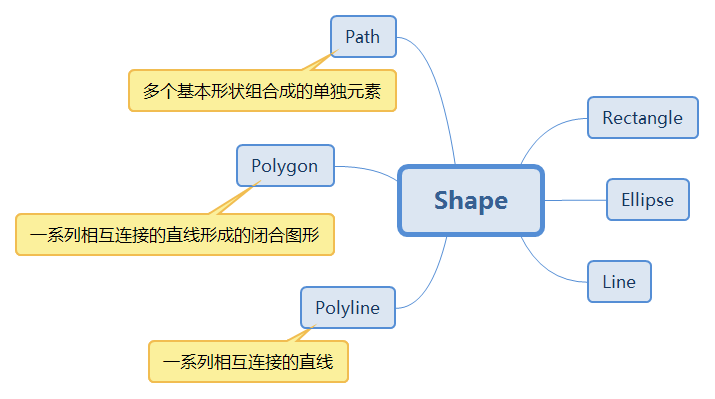
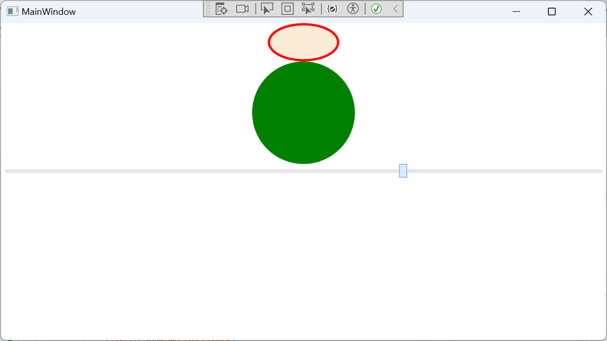
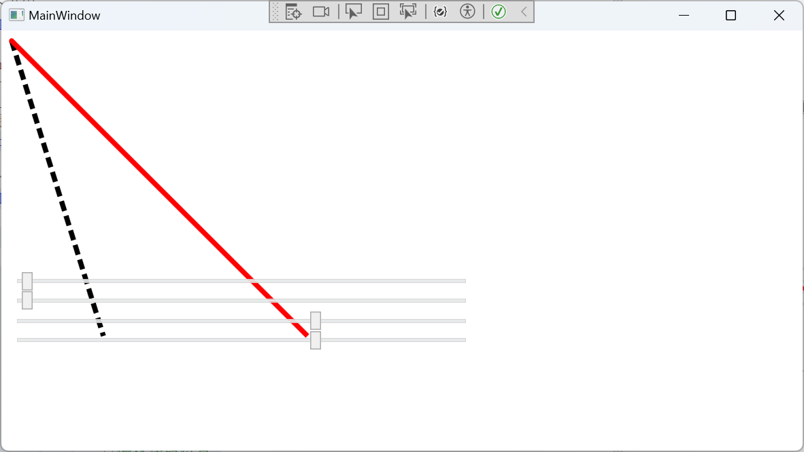
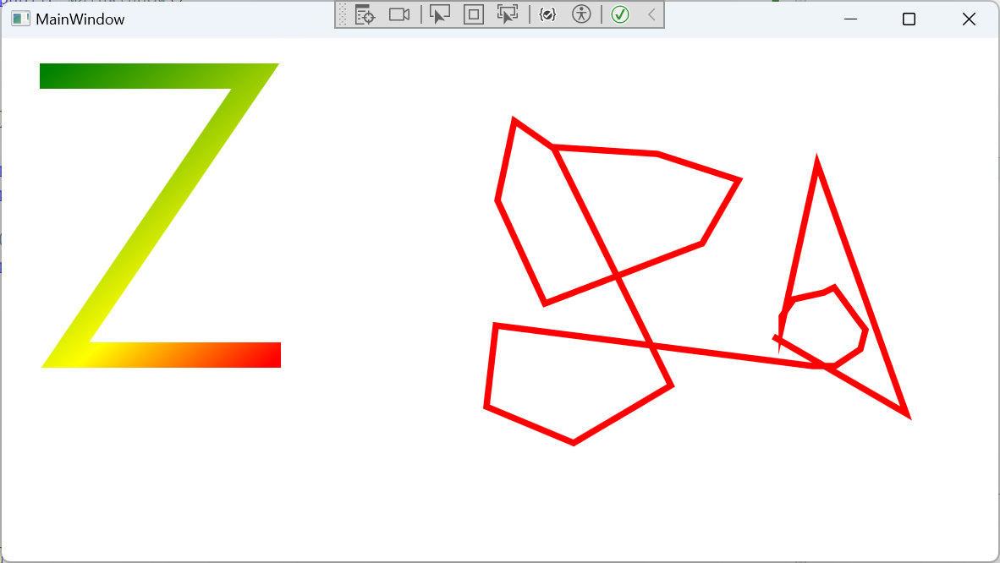
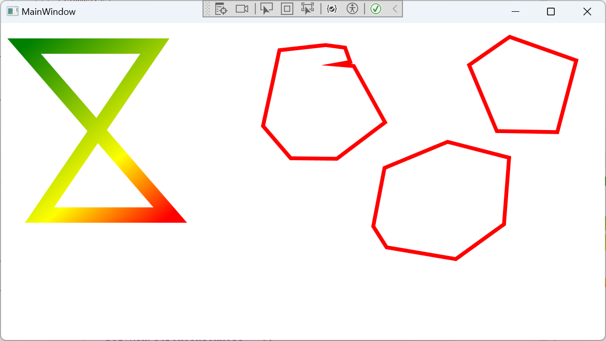
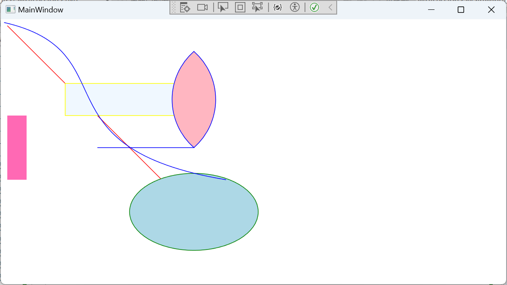

## 说明

形状是WPF另一大系列控件。WPF所有的形状都继承于Shape基类。那么，WPF提供了哪些可用的形状呢？我们用一张图来说明它的子类。



| 形状名称  | 说明                                                   |
| --------- | ------------------------------------------------------ |
| Ellipse   | 椭圆形                                                 |
| Line      | 在两个点之间绘制直线。                                 |
| Rectangle | 绘制矩形。                                             |
| Polyline  | 绘制一系列相互连接的直线。                             |
| Polygon   | 绘制多边形，它是由一系列相互连接的线条构成的闭合形状。 |
| Path      | 绘制一系列相互连接的直线和曲线。                       |

Shape是一个抽象基类，它不能被实例化，所以我们在使用时只能实例化它的子类。而Shape的父类是FrameworkElement，所以，所有的Shape子类都是一个UIElement 类，因此形状对象可以用在面板和大多数控件中。 由于 Canvas 面板支持其子对象的绝对位置，因此特别适合创建复杂的图形。

## 1.Shape概述

属性成员

| 属性名称           | 说明                                                         |
| ------------------ | ------------------------------------------------------------ |
| Stroke             | 获取或设置Shape的边框颜色画刷                                |
| StrokeEndLineCap   | 获取或设置Shape描述线的末端的样式                            |
| StrokeStartLineCap | 获取或设置Shape描述线的开头的样式                            |
| StrokeThickness    | 获取或设置Shape边框的厚度                                    |
| Fill               | 获取或设置Shape的内部填充颜色                                |
| StrokeDashOffset   | 获取或设置短划线模式内短划线开始处的距离                     |
| RenderedGeometry   | 获取或设置Shape的几何                                        |
| Stretch            | 获取或设置Shape的填充模式                                    |
| StrokeDashArray    | 获取或设置勾勒形状轮廓的短划线和间隙的模式的值               |
| StrokeMiterLimit   | 获取或设置一个限制到一半的斜接长度比                         |
| StrokeDashCap      | 获取或设置 System.Windows.Media.PenLineCap 枚举值，该值指定如何绘制虚线的末端。 |
| GeometryTransform  | 获取或设置Shape的转换                                        |
| StrokeLineJoin     | 获取或设置Shape的顶点处使用的联接类型。                      |
| DefiningGeometry   | 获取Shape的Geometry                                          |

## 2.Ellipse椭圆

Ellipse继承于Shape，Shape继承于FrameworkElement，所以，它可以设置其 Width 和 Height。 使用其 Fill 属性指定用于绘制椭圆形内部的 Brush。 使用其 Stroke 属性指定用于绘制椭圆形轮廓的 Brush。 StrokeThickness 属性指定椭圆形轮廓的粗细。

```xaml
<StackPanel>
    
    <Ellipse Width="100" Height="50" StrokeThickness="3" Stroke="Red" Fill="AntiqueWhite">
        <Ellipse.Triggers>
            <EventTrigger RoutedEvent="Loaded">
                <BeginStoryboard>
                    <Storyboard>
                        <DoubleAnimation From="100" To="200" Duration="0:0:2" AutoReverse="False" RepeatBehavior="Forever" Storyboard.TargetProperty="(Ellipse.Width)" ></DoubleAnimation>
                        <DoubleAnimation From="50" To="100" Duration="0:0:2" AutoReverse="False" RepeatBehavior="Forever" Storyboard.TargetProperty="(Ellipse.Width)" ></DoubleAnimation>
                    </Storyboard>
                </BeginStoryboard>
            </EventTrigger>
        </Ellipse.Triggers>
    </Ellipse>
    <Grid Grid.Column="1">
        <Grid.RowDefinitions>
            <RowDefinition/>
            <RowDefinition Height="auto"/>
        </Grid.RowDefinitions>
        <Ellipse Width="{Binding ElementName=slider,Path=Value}" 
                 Height="{Binding ElementName=slider,Path=Value}" 
                 Fill="Green"/>
        <Slider x:Name="slider" Grid.Row="1" Value="50" Maximum="200"/>
    </Grid>
</StackPanel>
```



第一个椭圆用了一个事件Triggers和Storyboard故事板，演示了椭圆大小的动画改变，在第二个椭圆中，宽度和高度相等，便出现了一个正圆，利用Binding对象将Slider的Value和椭圆的尺寸绑定起来，以此滑动改变椭圆大小。

## 3.Line线段

Line(线段)继承于Shape，它自身只有4个属性，分别用于定义线段两端的端点坐标。

```c#
public sealed class Line : Shape
{
    public static readonly DependencyProperty X1Property;
    public static readonly DependencyProperty Y1Property;
    public static readonly DependencyProperty X2Property;
    public static readonly DependencyProperty Y2Property;
 
    public Line();
 
    public double X1 { get; set; }
    public double Y1 { get; set; }
    public double X2 { get; set; }
    public double Y2 { get; set; }
    protected override Geometry DefiningGeometry { get; }
}
```

其中X1,Y1表示第一个点坐标，X2,Y2表示第二个点坐标。

下面的属性位于Shape基类，在Line线段中设置后，会有意想不到的效果。

StrokeStartLineCap属性：表示线段前头的开关。

Stroke：线条颜色。

StrokeThickness：线条宽度。

StrokeDashArray：设置虚线。

StrokeDashOffset：虚线位置偏移量。

接下来，我们以一个示例来说明Line的用法。

### 示例


后端代码

```c#
public partial class MainWindow : Window
{
    public MainWindow()
    {
        InitializeComponent();

        Loaded += (s, e) =>
        {
            int number = 10;
            Task.Run(() =>
            {
                
                while(true)
                {
                    if (number == 1) number = 10;
                    //偏移线段位置
                    Application.Current.Dispatcher.BeginInvoke(new Action(() =>
                    {
                        xLine.StrokeDashOffset = number;
                    }));
                    number--;
                    Thread.Sleep(200);
                }
                
            });
        };
    }

}
```


前端代码

```xaml
<Canvas>
    <Line x:Name="xLine" X1="10" X2="100" Y1="10" Y2="300" StrokeThickness="5" Stroke="Black" StrokeDashArray="2,1"/>
    <Line X1="{Binding ElementName=x1,Path=Value}"
          Y1="{Binding ElementName=y1,Path=Value}"
          X2="{Binding ElementName=x2,Path=Value}"
          Y2="{Binding ElementName=y2,Path=Value}"
          StrokeStartLineCap="Round"
          Stroke="Red"
          StrokeThickness="5"/>
    <Slider x:Name="x1" 
            Value="10" 
            Maximum="450" 
            Width="450" 
            Canvas.Left="10" 
            Canvas.Top="237"/>
    <Slider x:Name="y1" 
            Value="10" 
            Maximum="450" 
            Width="450" 
            Canvas.Left="10" 
            Canvas.Top="256"/>
    <Slider x:Name="x2" 
            Value="300" 
            Maximum="450" 
            Width="450" 
            Canvas.Left="10" 
            Canvas.Top="276"/>
    <Slider x:Name="y2" 
            Value="300" 
            Maximum="450" 
            Width="450" 
            Canvas.Left="10" 
            Canvas.Top="295"/>
</Canvas>
```



## 4.Rectangle矩形

Rectangle是一个比较简单而实用的图形控件，继承于Shape，有两个属性比较常用，即RadiusX和RadiusY，表示设置矩形的圆角。所以，通过这两个属性的设置，矩形也可以画出一个圆。

```xaml
<Canvas x:Name="canvas">
    <Rectangle Height="100" Width="200" Fill="LightGreen" Canvas.Left="200" Canvas.Top="10"/>

    <Rectangle 
        Height="{Binding ElementName=slider, Path=Value}"
        Width="{Binding ElementName=slider, Path=Value}"
        RadiusX="{Binding ElementName=slider, Path=Value}"
        RadiusY="{Binding ElementName=slider, Path=Value}"
        Fill="red"
        Canvas.Left="200"
        Canvas.Top="150"
               />

    <Slider x:Name="slider" Value="100" Minimum="10" Maximum="200" Canvas.Top="300" Width="500" Canvas.Left="100"/>
</Canvas>
```


## 5.Polyline折线

Polyline表示由一系列线段组合绘制而成的折线，因为它有一个Points属性，用来保存这些点的坐标。这些坐标点用于绘制Polyline图形中各线段相接处的顶点。集合中第一个元素表示起点，最后一元素表示终点。

在XAML前端代码中定义Points的内容书写格式如下：假如我们有4个点，分别是起点(30,30)，中继点(200,30)，中继点(50,250)，终点(220,250)，那么，Points的内容书写为：Points="30,30 200,30 50,250 220,250"

### 示例

后端代码

```c#

public partial class MainWindow : Window
{
    public MainWindow()
    {
        InitializeComponent();

    
    }

    private int count = 0;
    private Polyline polyline = null;

    private void Window_PreviewMouseLeftButtonUp(object sender, MouseButtonEventArgs e)
    {
        if (count++ == 0)
        {
            polyline = new Polyline();
            polyline.StrokeThickness = 5;
            polyline.Stroke = Brushes.Red;
            canvas.Children.Add(polyline);
        }

        var point = e.GetPosition(canvas);
        polyline.Points.Add(point);
    }

    private void Window_PreviewMouseRightButtonUp(object sender, MouseButtonEventArgs e)
    {
        count = 0;
    }

}
```

前端代码

```xaml
<Window x:Class="Wpfsession2.MainWindow"
        xmlns="http://schemas.microsoft.com/winfx/2006/xaml/presentation"
        xmlns:x="http://schemas.microsoft.com/winfx/2006/xaml"
        xmlns:d="http://schemas.microsoft.com/expression/blend/2008"
        xmlns:mc="http://schemas.openxmlformats.org/markup-compatibility/2006"
        xmlns:forms="clr-namespace:System.Windows.Forms;assembly=System.Windows.Forms"
        xmlns:local="clr-namespace:Wpfsession2"
        mc:Ignorable="d"
        PreviewMouseLeftButtonUp="Window_PreviewMouseLeftButtonUp"
        PreviewMouseRightButtonUp="Window_PreviewMouseRightButtonUp"
        Title="MainWindow" Height="450" Width="800">
    <Canvas x:Name="canvas">
        <Polyline  StrokeThickness="20" Points="30,30 200,30 50,250 220,250">
            <Polyline.Stroke>
                <LinearGradientBrush StartPoint="30,30"
                                     EndPoint="220,250"
                                     MappingMode="Absolute">
                    <GradientStop Color="Red" Offset="1"/>
                    <GradientStop Color="Yellow" Offset="0.66"/>
                    <GradientStop Color="Green" Offset="0.0"/>

                </LinearGradientBrush>
            </Polyline.Stroke>
        </Polyline>
    </Canvas>
</Window>
```





## 6.Polygon多边形

Polygon叫多边形，与Polyline类似，都有一个Points属性，只不过，Polygon会把起点和终点连接起来。就拿上一节的例子，我们只是简单地把Polyline换成Polygon，其它设置保持不变。

后端

```c#
public partial class MainWindow : Window
{
    public MainWindow()
    {
        InitializeComponent();


    }

    private int count = 0;
    private Polygon polygon = null;

    private void Window_PreviewMouseLeftButtonUp(object sender, MouseButtonEventArgs e)
    {
        if (count++ == 0)
        {
            polygon = new Polygon();
            polygon.StrokeThickness = 5;
            polygon.Stroke = Brushes.Red;
            canvas.Children.Add(polygon);
        }

        var point = e.GetPosition(canvas);
        polygon.Points.Add(point);
    }

    private void Window_PreviewMouseRightButtonUp(object sender, MouseButtonEventArgs e)
    {
        count = 0;
    }

}
```


前端

```xaml
<Window x:Class="Wpfsession2.MainWindow"
        xmlns="http://schemas.microsoft.com/winfx/2006/xaml/presentation"
        xmlns:x="http://schemas.microsoft.com/winfx/2006/xaml"
        xmlns:d="http://schemas.microsoft.com/expression/blend/2008"
        xmlns:mc="http://schemas.openxmlformats.org/markup-compatibility/2006"
        xmlns:forms="clr-namespace:System.Windows.Forms;assembly=System.Windows.Forms"
        xmlns:local="clr-namespace:Wpfsession2"
        mc:Ignorable="d"
        PreviewMouseLeftButtonUp="Window_PreviewMouseLeftButtonUp"
        PreviewMouseRightButtonUp="Window_PreviewMouseRightButtonUp"
        Title="MainWindow" Height="450" Width="800">
    <Canvas x:Name="canvas">
        <Polygon  StrokeThickness="20" Points="30,30 200,30 50,250 220,250">
            <Polygon.Stroke>
                <LinearGradientBrush StartPoint="30,30"
                                     EndPoint="220,250"
                                     MappingMode="Absolute">
                    <GradientStop Color="Red" Offset="1"/>
                    <GradientStop Color="Yellow" Offset="0.66"/>
                    <GradientStop Color="Green" Offset="0.0"/>

                </LinearGradientBrush>
            </Polygon.Stroke>
        </Polygon>
    </Canvas>
</Window>
```




## 7.Path路径

```c#
public sealed class Path : Shape
{
    public static readonly DependencyProperty DataProperty;
 
    public Path();
 
    public Geometry Data { get; set; }
 
    protected override Geometry DefiningGeometry { get; }
}
```

从定义上看，Path只有一个Data属性，这个属性的类型为Geometry。而Geometry又是一个抽象类，所以我们不能直接使用它，那它肯定会有一系列可以实例化的子类。没错，Geometry表示一个几何，而几何的图形可以分为好几种。

| 几何名称          | 说明                                                   |
| ----------------- | ------------------------------------------------------ |
| LineGeometry      | 直线几何                                               |
| RectangleGeometry | 矩形几何                                               |
| EllipseGeometry   | 椭圆几何                                               |
| PathGeometry      | 路径几何                                               |
| StreamGeometry    | PathGeometry的轻量级替代品，不支持 Bidning、动画等功能 |
| CombinedGeometry  | 多图形组合，形成单一几何几何图形                       |
| GeometryGroup     | 多图形组合，形成几何图形组                             |

接下来，我们分别讲一下这几种几何的用法。

**一、LineGeometry直线几何**

```c#
<Path Stroke="Blue" Fill="Red">
    <Path.Data>
        <LineGeometry  StartPoint="10,20" EndPoint="100,200"/>
    </Path.Data>
</Path>
```

**二、RectangleGeometry矩形几何**

```c#
<Path Stroke="Blue" Fill="Red">
    <Path.Data>
        <RectangleGeometry Rect="50,20,30,40" />
    </Path.Data>
</Path>
```

**三、EllipseGeometry椭圆几何**

```c#
<Path Stroke="Yellow" Fill="LightGreen">
    <Path.Data>
        <EllipseGeometry Center="150,80" RadiusX="60" RadiusY="50"/>
    </Path.Data>
</Path>
```

Line、Rectangle、Ellipse控件能够画出来的效果，Path都可以画出来。而接下来我们要分享的是，Line、Rectangle、Ellipse控件画不出来的效果，Path也能画出来。那就是PathGeometry路径几何。

### **PathGeometry路径几何**

PathGeometry微微有点复杂。它有一个Figures属性，可以容纳很多较复杂的图形。Figures是一个集合，其中的元素是PathFigure类型，而PathFigure中的Segments属性又是一个集合，其中的元素类型为PathSegment。

PathSegment是一个抽象类，我们可以实例化PathSegment的子类放到PathFigure中，然后把PathFigure放到PathGeometry中，这样就可以绘制不同的路径图形了。那么PathSegment有哪些子类呢？

| LineSegment                | 直线段               |
| -------------------------- | -------------------- |
| ArcSegment                 | 圆弧线段             |
| BezierSegment              | 三次方贝塞尔曲线段   |
| QuadraticBezierSegmnt      | 二次方贝塞尔曲线段   |
| PolyLineSegment            | 折线段               |
| PolyBezierSegment          | 多三次方贝塞尔曲线段 |
| PolyQuadraticBezierSegment | 多二次方贝塞尔曲     |
|                            |                      |

PathFigure有一个StartPoint属性表示起点坐标，而Segments集合中的元素就是上面那张表中的各种线段实例，它们将依次首尾相接，最终绘制成形。

我们以LineSegment和ArcSegment为例。

```c#
<Path Stroke="Black" Fill="LightPink" StrokeThickness="5">
    <Path.Data>
        <PathGeometry>
            <PathGeometry.Figures>
                <PathFigure StartPoint="150,200">
                    <LineSegment  Point="300,200"/>
                    <ArcSegment Point="300 50" 
                                Size="100 100" 
                                SweepDirection="Clockwise" 
                                IsLargeArc="False"/>
                    <ArcSegment Point="300 200" 
                                Size="100 100" 
                                SweepDirection="Clockwise" 
                                IsLargeArc="False"/>
                </PathFigure>
            </PathGeometry.Figures>
        </PathGeometry>
    </Path.Data>
</Path>
```

首先，PathFigure 图形的起点坐标为（150,200），然后第一个元素是线段，终点坐标为（300,200），图形的坐标原点是左上角（0，0），所以，往下就是Y轴正半轴方向，往右就是X轴正半轴方向。

然后，画了两条圆弧，第一条圆弧的起点坐标就是线段的终点坐标，即（300,200），圆弧的终点坐标为（300 50），大小为（100 100），第二条圆弧的终点坐标又回到了线段的终点坐标（300 200），于是就出现了图中的样子。

ArcSegment的常用属性如下：
Point：指明圆弧连接的终点；
Size：指明完整椭圆的横轴半径和纵轴半径；
IsLargeArc：指明是否使用大弧去连接 ；
SweepDirection ：指明圆弧是顺时针方向还是逆时针方向；
RotationAngle：指明圆弧椭圆的旋转角度；

接下来，我们再讲一下**BezierSegment**贝塞尔曲线。

**BezierSegment**需要4个坐标点来完成图形的绘制，分别是起点，控制点1，控制点2和终点。

```xaml
<PathFigure IsFilled="False" StartPoint="5,5">
    <BezierSegment Point1="200,50" Point2="50,200"  Point3="350,250"/>
</PathFigure>
```

如上所示，（5，5）表示起点（StartPoint属性），Point1属性（200,50）和Point2属性（50,200）表示两个控制点，Point3属性（350,250）表示终点。


Path的标记语法

通过上面的示例我们会发现要绘制复杂的图形，需要实例化各种子类，代码繁琐，这时就需要了解Path的路径标记语法，它大大减少了代码量。您可以从以下的表格或[微软官网](https://learn.microsoft.com/zh-cn/dotnet/desktop/wpf/graphics-multimedia/path-markup-syntax?view=netframeworkdesktop-4.8)中获得相关知识。

| 命令 | 用途                 | 语法                                              | 示例                               | 对应标签语法                                                 |
| ---- | -------------------- | ------------------------------------------------- | ---------------------------------- | ------------------------------------------------------------ |
| M    | 移动到起点坐标       | M 起点                                            | M 150,200                          | <PathFigure StartPoint="150,200">                            |
| L    | 绘制直线             | L 终点                                            | L 300,200                          | <LineSegment Point="300,200"/>                               |
| H    | 水平直线             | H 终点横坐标                                      |                                    |                                                              |
| V    | 垂直直线             | V 终点横坐标                                      |                                    |                                                              |
| A    | 绘制圆弧             | A 母椭圆尺寸 旋转角度 是否大弧 顺时针/逆时针 终点 | A 180，80 45 1 1 150，150          | <ArcSegment Size="180,80" RotationAngle="45" IsLargeArc="True" SweepDirection="Clockwise" Point="150,150" /> |
| C    | 三次方贝塞尔曲线     | C 控制点1 控制点2 终点                            | C 200,50 50,200 350,250            | <BezierSegment Point1="200,50" Point2="50,200" Point3="350,250"/> |
| Q    | 二次方贝塞尔曲线     | Q 控制点1 终点                                    | Q 200,50 350,250                   | <QuadraticBezierSegmnt Point1="200,50" Point3="350,250"/>    |
| S    | 平滑三次方贝塞尔曲线 | S 控制点2 终点                                    | S 200,50 350,250                   |                                                              |
| T    | 平滑二次方贝塞尔曲线 | T 终点                                            | T 350,250                          |                                                              |
| Z    | 闭合图形             | Z                                                 | M 10,150 L40,150 L40,250 L10,250 Z | <Path Fill="HotPink" Data="M 10,150 L40,150 L40,250 L10,250 Z" /> |

```xaml
<Path Fill="HotPink" Data="M 10,150 L40,150 L40,250 L10,250 Z"/>
```

### 示例

```xaml
<Canvas x:Name="canvas">
    <Path Stroke="Red" Fill="AliceBlue">
        <Path.Data>
            <LineGeometry StartPoint="10 10" EndPoint="250 250"/>
        </Path.Data>
    </Path>

    <Path Stroke="Yellow" Fill="AliceBlue">
        <Path.Data>
            <RectangleGeometry Rect="100 100 200 50"/>
        </Path.Data>
    </Path>

    <Path Stroke="Green" Fill="LightBlue">
        <Path.Data>
            <EllipseGeometry Center="300 300" RadiusX="100" RadiusY="60"/>
        </Path.Data>
    </Path>

    <Path Stroke="Blue" Fill="LightPink">
        <Path.Data>
            <PathGeometry>
                <PathGeometry.Figures>
                    <PathFigure StartPoint="150 200">
                        <LineSegment Point="300 200"/>
                        <ArcSegment Point="300 50" Size="100 100" SweepDirection="Clockwise" IsLargeArc="False"/>
                        <ArcSegment Point="300 200" Size="100 100" SweepDirection="Clockwise" IsLargeArc="False"/>
                    </PathFigure>

                    <PathFigure IsFilled="False" StartPoint="5 5">
                        <BezierSegment Point1="200 50" Point2="50 200" Point3="350 250"/>
                    </PathFigure>
                </PathGeometry.Figures>
            </PathGeometry>
        </Path.Data>
    </Path>

    <Path Fill="HotPink" Data="M 10,150 L40,150 L40,250 L10,250 Z"/>
</Canvas>
```




