## 说明

根据官方的定义，**数据绑定是在应用 UI 与其显示的数据之间建立连接的过程。 如果绑定具有正确的设置，并且数据提供适当的通知，则在数据更改其值时，绑定到该数据的元素会自动反映更改。 数据绑定还意味着，如果元素中数据的外部表示形式发生更改，则基础数据可以自动进行更新以反映更改。**

简单点说，我们可以定义一个ViewModel，将ViewModel中的属性绑定（Binding）到控件上的属性，ViewModel的属性改变时，控件的属性也跟着改变，反过来说，控件的属性改变时，ViewModel的属性也会改变。

这就是数据绑定！

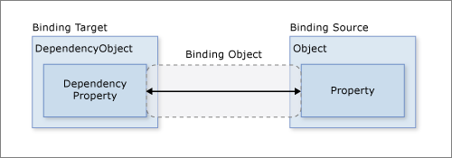

上图中演示了数据绑定的关系。

图的左边是一个[DependencyObject](http://www.wpfsoft.com/2023/08/13/571.html)对象，表明它是一个依赖对象。那么，WPF控件是不是一个DependencyObject对象？是的，因为WPF所有的控件都继承了DependencyObject基类。

图的右边是一个普通的对象，所以这里标注成object类型。右边的对象表示绑定的数据源——也就是一个ViewModel。

好，左边的是控件，右边的是数据源。中间是什么？中间是一座桥梁——也就是Binding对象。

## 1.DataContext数据上下文

DataContext是FrameworkElement基类的一个属性。其含义：获取或设置元素参与数据绑定时的数据上下文。通常情况下，我们把它设计成一个class——也就是所谓的ViewModel。

那么，什么是ViewModel？这一切，还要从WPF的MVVM模式说起。

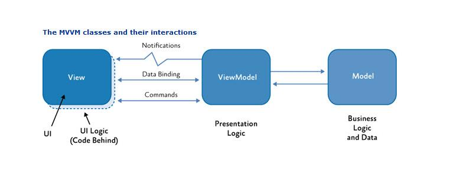

如图所示，WPF将程序划分为3个部分，分别是View（UI界面或视图）、ViewModel（视图模型）、Model（数据模型）。

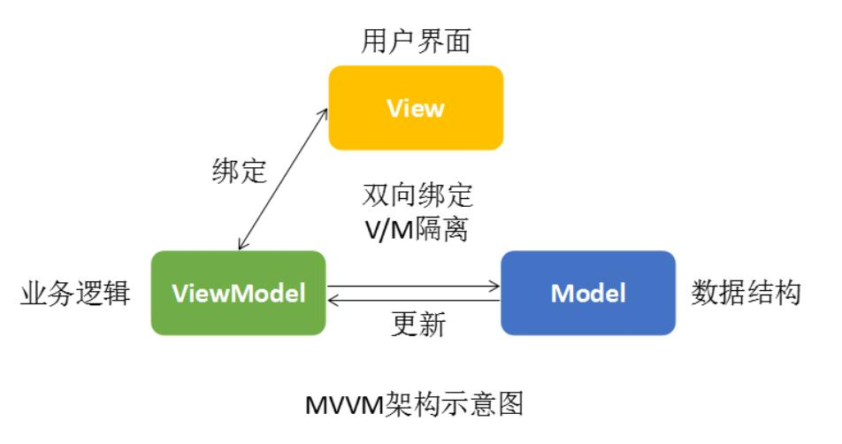

View负责数据的输入与输出；ViewModel负责业务逻辑；Model则表示程序中具体要处理的数据。所以，Model将作为属性存在于ViewModel中，而Model最终是要显示在Ul界面（View）上的，怎么办呢？将ViewModel赋值给View的DataContext（数据上下文）属性，View就可以引用ViewModel中的那些Model了。

总结：Model在ViewModel中，ViewModel在View的DataContext中，View引用Model。

Model和ViewModel都需要开发者自己实现，而哪些View拥有DataContext属性？WPF所有的控件（包括Window窗体）都有DataContext属性，因为它们都继承于FrameworkElement基类。

**只有将ViewModel赋值到DataContext之后，才可以实现数据绑定。**

Model类

```c#
public class Person
{
    public string Name { get; set; }
    public int Age { get; set; }
    public string Address { get; set; }
 
}
```

ViewModel类

```c#
public class MainViewModel
{
    public Person Person { get; set; }
 
    public MainViewModel()
    {
        Person = new Person
        {
            Name = "张三",
            Age = 50,
            Address = "居无定所",
        };
    }
}
```

DataContext属性赋值

```c#
public partial class MainWindow : Window
{
    public MainWindow()
    {
        InitializeComponent();
 
        this.DataContext = new MainViewModel();
    }        
}
```

我们给MainWindow主窗体的DataContext赋值了一个叫MainViewModel的视图模型。而MainViewModel中有一个叫Person的属性，它就代表了程序运行中要处理的数据实体。

现在MainWindow的DataContext（数据上下文）有了一个对象后，我们怎么将这个Person属性显示到前端呢，这需要使用Binding——数据绑定。

## 2.Binding（绑定）

Binding类架起了控件和ViewModel之间的桥梁，它就像一个媒婆，指示了哪个控件的哪个属性与哪个ViewModel类的哪个属性建立绑定关系。提供对绑定定义的高级访问，该绑定连接绑定目标对象（通常为 WPF 元素）的属性和任何数据源（例如数据库、XML 文件，或包含数据的任何对象）。

### **二、Binding的数据源**

首先，控件的属性与Model的属性建立绑定，我们将Model及其属性称为数据源，而数据源大致可以分为以下4种方式进行绑定。

**第一种数据源**，也就是ViewModel中的Model。在写法上直接如下所示：

```
Text="{Binding Person.Name}"
```

这里实例化了一个Binding对象，后面紧跟的Person.Name表示一个Path路径，指的是当前的DataContext中那个ViewModel对象的Person.Name，注意看，Binding的有一个带参数的构造函数：public Binding(string path);实际上，就是将Person.Name路径传给了path形参。

**第二种数据源**，指明某个具体的数据源对象及对象的属性。这种绑定方式要用了Binding类的Source属性和Path属性。通常写法如下：

```
Text="{Binding Source={StaticResource RedBrush},Path=Color}"
```

在这里，Source属性表示数据源对象，它是一个静态资源对象，Path=Color表示要绑定这个静态资源对象的Color属性。我们已经提前在资源里定义好了这个资源对象。资源对象的实例名叫RedBrush，它确实也有一个叫Color的属性。

```xaml
<Window.Resources>
    <SolidColorBrush x:Key="RedBrush" Color="Red"/>
</Window.Resources>
```

这样绑定的效果如下图所示。

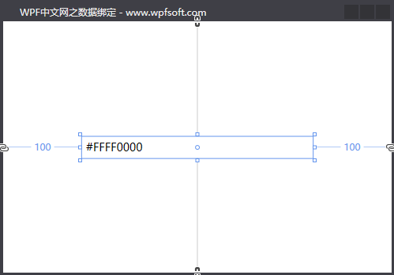

看起来Color=Red,实则是一个代表颜色的16进制字符串。

**第三种数据源**，利用ElementName属性指明另一个控件作为数据源，这里仍然要用到Path来指定另一个控件的某个属性路径。

```xaml
<StackPanel x:Name="panel" VerticalAlignment="Center" Margin="100,0">
    <TextBlock Margin="5">
        <Run Text="Source示例:"/>
        <Run Text="{Binding Source={StaticResource RedBrush},Path=Color}"/>
    </TextBlock>
    <TextBlock Margin="5">
        <Run Text="ElementName示例:"/>
        <Run Text="{Binding ElementName=panel,Path=Margin}"/>
    </TextBlock>
</StackPanel>
```

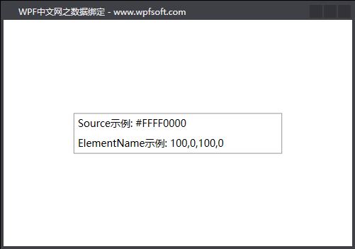

通过Binding类的ElementName去指定当前XAML中的另一个StackPanel控件，并绑定其Margin属性，这样，TextBlock就显示了StackPanel控件的Margin属性值。

**第四种数据源**，利用RelativeSource属性绑定一个相对的数据源。这种绑定方式也经常使用，且实用价值很高，作为开发者，一定要掌握它的用法。

```xaml
<StackPanel x:Name="panel" VerticalAlignment="Center" Margin="80,0">
    <TextBlock Margin="5">
        <Run Text="Source示例:"/>
        <Run Text="{Binding Source={StaticResource RedBrush},Path=Color}"/>
    </TextBlock>
    <TextBlock Margin="5">
        <Run Text="ElementName示例:"/>
        <Run Text="{Binding ElementName=panel,Path=Margin}"/>
    </TextBlock>
    <TextBlock Margin="5">
        <Run Text="RelativeSource示例:"/>
        <Run Text="{Binding RelativeSource={RelativeSource Mode=Self},Path=Foreground}"/>
        <Run Text="{Binding RelativeSource={RelativeSource Mode=FindAncestor,AncestorType=StackPanel},Path=Margin}"/>
    </TextBlock>    
</StackPanel>
```

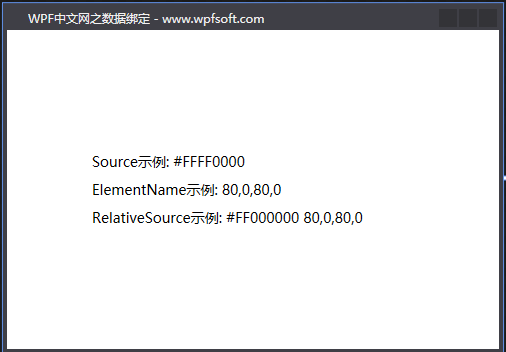

RelativeSource类有3个重要的属性，它们分别是Mode、AncestorType和AncestorLevel。

Mode：表示寻找相对数据源的模式，一共有4种模式

| 模式            | 说明                                                         |
| --------------- | ------------------------------------------------------------ |
| PreviousData    | 允许在当前显示的数据项列表中绑定上一个数据项（不是包含数据项的控件）。 |
| TemplatedParent | 引用应用了模板的元素，其中此模板中存在数据绑定元素。         |
| Self            | 引用正在其上设置绑定的元素，并允许你将该元素的一个属性绑定到同一元素的其他属性上。 |
| FindAncestor    | 引用数据绑定元素的父链中的上级。 这可用于绑定到特定类型的上级或其子类。 |

在上面的例子中，我们演示了Self（自身控件）和FindAncestor（找上级控件）两种模式。

AncestorType：当Mode=FindAncestor时，这时就要指示要找的这个上级是什么类型，AncestorType用来表示上级的类型。

AncestorLevel：获取或设置要查找的上级级别。 使用 1 指示最靠近绑定目标元素的项。

```c#
Text="{Binding RelativeSource={RelativeSource Mode=Self},Path=Foreground}"
```

表示将自己的前景色显示到Text属性上。

```c#
Text="{Binding RelativeSource={RelativeSource Mode=FindAncestor,AncestorType=StackPanel},Path=Margin}"
```

表示从当前控件开始找上级，一个类型为StackPanel的控件，并把这个StackPanel控件的Margin显示到当前控件的Text属性上。

### **Binding的绑定模式**

当一个实体的属性绑定到控件的属性之后，还需要指明这两者之间的绑定关系。这个就是Binding类的Mode属性，Mode属性是一个枚举类型。它有如下几个情况。

| 枚举值         | 说明                                                         |
| -------------- | ------------------------------------------------------------ |
| TwoWay         | 双向绑定，即导致更改源属性或目标属性时自动更新另一方。       |
| OneWay         | 单向绑定，在更改绑定源（源）时更新绑定目标（目标）。         |
| OneTime        | 一次绑定，在应用程序启动或数据上下文更改时，更新绑定目标。   |
| OneWayToSource | 在目标属性更改时，更新源属性。                               |
| Default        | 默认绑定，文本框的默认绑定是双向的，而其他大多数属性默认为单向绑定。 |

这里面常用的是OneWay和TwoWay。如果是TwoWay（双向绑定），意味着前端控件的属性改变时，后端的Model也跟着改变，反之亦然。就拿前端改变去影响后端的Model值来说，这里会多出来一个概念——改变时机。

什么是改变时机？其实就是如果前端的值发生改变，后端的值在什么时候跟着改变。它由Binding类的UpdateSourceTrigger属性的值决定 。这个属性也是一个枚举类型。

| 枚举值          | 说明                                                         |
| --------------- | ------------------------------------------------------------ |
| Default         | 采用控件各自的UpdateSourceTrigger默认值。                    |
| PropertyChanged | 每当绑定目标属性发生更改时，都会更新绑定源。                 |
| LostFocus       | 每当绑定目标元素失去焦点时，都会更新绑定源。                 |
| Explicit        | 仅在调用 System.Windows.Data.BindingExpression.UpdateSource 方法时更新绑定源。 |

TextBox.Text 属性的默认值为 LostFocus，我们经常会把TextBox的UpdateSourceTrigger改成PropertyChanged，即文本框在输入内容时，实时的更新后端的Model属性值。

前端属性值发生改变后，由UpdateSourceTrigger决定什么时候更新后端的Model属性值，但是，后端那些Model的属性值发生改变后，前端什么时候跟着改变？需不需要做特殊的处理？

答案是需要！如果Model中的那些属性没有实现属性通知，就算前后端成功的建立了绑定关系，后端Model属性值改变时，前端的显示是没有变化的，如果要实时跟着变化，则需要掌握WPF的INotifyPropertyChanged接口以及属性通知的相关知识点。

## 3.INotifyPropertyChanged

INotifyPropertyChanged接口，通知客户端属性值已更改。

```c#
public interface INotifyPropertyChanged
{
    event PropertyChangedEventHandler PropertyChanged;
}
```

这个接口只有一个PropertyChanged事件，该事件专门用来触发属性更改通知。通常情况下，我们会单独编写一个服务类（例如ObservableObject），以实现INotifyPropertyChanged接口的业务。这样做的好处是，将来的ViewModel、Model都可以继承这个ObservableObject，从而调用属性通知接口。

**实现INotifyPropertyChanged接口**

```c#
public class ObservableObject : INotifyPropertyChanged
{
    public event PropertyChangedEventHandler PropertyChanged;
 
    public void RaisePropertyChanged([CallerMemberName] string propertyName = "")
    {
        PropertyChanged?.Invoke(this, new PropertyChangedEventArgs(propertyName));
    }
}
```

使用了CallerMemberName特性后，就不必再传入属性名字符串。

接下来，我们来编写一个ViewModel和一个Model，让它们都继承这个属性通知基类。

Person实体

```c#
public class Person : ObservableObject
{
    private string name;
    public string Name
    {
        get { return name; }
        set { name = value;RaisePropertyChanged(); }
    }
 
    private int age;
    public int Age
    {
        get { return age; }
        set { age = value; RaisePropertyChanged(); }
    }
 
    private string address;
    public string Address
    {
        get { return address; }
        set { address = value; RaisePropertyChanged(); }
    }
}
```

MainViewModel实体

```c#
public class MainViewModel : ObservableObject
{
    private Person person;
    public Person Person
    {
        get { return person; }
        set { person = value; RaisePropertyChanged(); }
    }
 
    public MainViewModel()
    {
        person = new Person
        {
            Name = "张三",
            Age = 50,
            Address = "居无定所",
        };
    }
}
```

我们修改了前面章节中的Person和MainViewModel两个类型，其中所有的属性都写成了完整的属性包装器形式，并在set语句块中增加了RaisePropertyChanged()方法成员的调用。

首先分析Person类，当修改Name、Age、Address属性时，调用RaisePropertyChanged()，此时如果前端UI有这几个属性的绑定，将会立即被更新内容。

然后是MainViewModel，这里的Person属性被重新赋值时，也将会通知到前端。如果MainViewModel中这个Person没有实现属性通知，那么，Person中的Name、Age、Address属性发生更改时，前端UI的内容会发生同步更新，但是，如果对Person属性本身重新赋值，前端UI是不会发生改变的。这一点细节需要了解清楚哦。

### 示例

后端代码

```c#
namespace Wpfsession3
{
    class ObservableObject : INotifyPropertyChanged
    {
        public event PropertyChangedEventHandler PropertyChanged;
        protected void RaisePropertyChanged([CallerMemberName]string propertyName = "")
        {
            PropertyChanged?.Invoke(this, new PropertyChangedEventArgs(propertyName));

        }
    }

    class Person : ObservableObject
    {
        private string _name;
        public string name
        {
            get { return _name; }
            set
            {
                _name = value;
                RaisePropertyChanged();
            }
        }
        private int _age;
        public int age
        {
            get { return _age; }
            set
            {
                _age = value;
                RaisePropertyChanged();
            }
        }

        private string _address;
        public string address
        {
            get { return _address; }
            set
            {
                _address = value;
                RaisePropertyChanged();
            }
        }
        
    }

    class MainViewModel : ObservableObject
    {
        private Person _person;
        public Person person
        {
            get { return _person; }
            set
            {
                _person = value;
                RaisePropertyChanged();
            }
        }
        public MainViewModel()
        {
            person = new Person()
            {
                name = "Tom",
                age = 20,
                address = "Beijing"
            };
        }
    }

    /// <summary>
    /// MainWindow.xaml 的交互逻辑
    /// </summary>
    public partial class MainWindow : Window
    {
        public MainWindow()
        {
            InitializeComponent();
            this.DataContext = new MainViewModel();
        }
        
        private void Button_Click(object sender, RoutedEventArgs e)
        {
            var vm = this.DataContext as MainViewModel;
            if (vm == null) return;

            vm.person.age = new Random().Next(1,100);
            vm.person.address = DateTime.Now.ToString();
            Console.WriteLine($"new age is : {vm.person.age},new address is {vm.person.address}");
        }
    }
}
```


前端代码

```xaml
<StackPanel x:Name="sPanel" VerticalAlignment="Center" Margin="80 0">
    <StackPanel Orientation="Horizontal">
        <TextBlock Text="姓名：" FontSize="18" Margin="5"/>
        <TextBox Text="{Binding person.name, UpdateSourceTrigger=PropertyChanged}" Width="200" FontSize="18" Height="25"/>
    </StackPanel>
    <StackPanel Orientation="Horizontal">
        <TextBlock Text="年龄：" FontSize="18" Margin="5"/>
        <TextBox Text="{Binding person.age, UpdateSourceTrigger=LostFocus}" Width="200" FontSize="18" Height="25"/>
    </StackPanel>
    <StackPanel Orientation="Horizontal">
        <TextBlock Text="地址：" FontSize="18" Margin="5"/>
        <TextBox Text="{Binding person.address, UpdateSourceTrigger=Default}" Width="200" FontSize="18" Height="25"/>
    </StackPanel>
    <TextBlock Margin="5" FontSize="18">
        <Run Text="姓名："/>
        <Run Text="{Binding person.name}"/>
    </TextBlock>
    <TextBlock Margin="5" FontSize="18">
        <Run Text="年龄："/>
        <Run Text="{Binding person.age}"/>
    </TextBlock>
    <TextBlock Margin="5" FontSize="18">
        <Run Text="地址："/>
        <Run Text="{Binding person.address}"/>
    </TextBlock>
    <Button Content="随机更改Person内容" Click="Button_Click" Margin="5" Width="300" Height="50" FontSize="20"/>
</StackPanel>
```

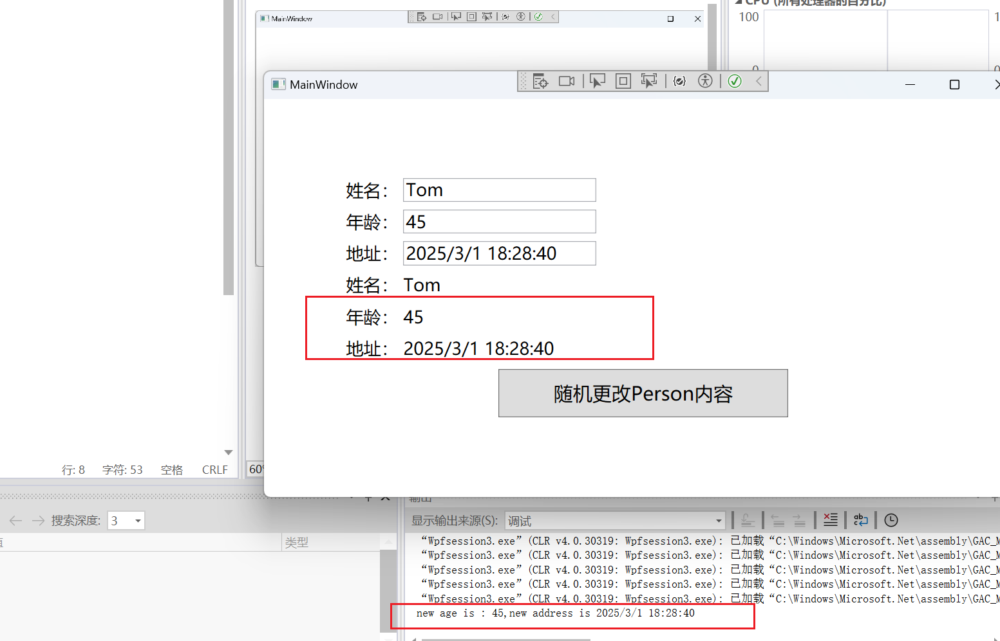

## 4.ObservableCollection泛型集合

ObservableCollection<T>泛型集合是一个经常使用的集合，表示一个动态数据集合，它可在添加、删除项目或刷新整个列表时提供通知。它继承了INotifyCollectionChanged和INotifyPropertyChanged，表示它在元素数量发生变化时，前端界面也会同步发生变化。

它除了继承两个属性通知接口，还继承了一大波的接口，例如：IList, ICollection, IEnumerable, IEnumerable, IList, ICollection, IReadOnlyList, IReadOnlyCollection。所以，它拥有List集合同等的功能，而且，ObservableCollection还可以很方便的转换成List集合。

后端代码

```c#
namespace Wpfsession3
{
    class ObservableObject : INotifyPropertyChanged
    {
        public event PropertyChangedEventHandler PropertyChanged;
        protected void RaisePropertyChanged([CallerMemberName]string propertyName = "")
        {
            PropertyChanged?.Invoke(this, new PropertyChangedEventArgs(propertyName));

        }
    }

    class Person : ObservableObject
    {
        private string _name;
        public string name
        {
            get { return _name; }
            set
            {
                _name = value;
                RaisePropertyChanged();
            }
        }
        private int _age;
        public int age
        {
            get { return _age; }
            set
            {
                _age = value;
                RaisePropertyChanged();
            }
        }

        private string _address;
        public string address
        {
            get { return _address; }
            set
            {
                _address = value;
                RaisePropertyChanged();
            }
        }
        
    }

    class MainViewModel : ObservableObject
    {
        private Person _person;
        public Person person
        {
            get { return _person; }
            set
            {
                _person = value;
                RaisePropertyChanged();
            }
        }

        public ObservableCollection<Person> persons { get; set; } = new ObservableCollection<Person>();
        public MainViewModel()
        {
            person = new Person();
        }
    }

    /// <summary>
    /// MainWindow.xaml 的交互逻辑
    /// </summary>
    public partial class MainWindow : Window
    {
        public MainWindow()
        {
            InitializeComponent();
            this.DataContext = new MainViewModel();
        }
        
        private void Button_Click(object sender, RoutedEventArgs e)
        {
            var vm = this.DataContext as MainViewModel;
            if (vm == null) return;

            vm.person.age = new Random().Next(1, 100);
            vm.person.address = DateTime.Now.ToString();
            Console.WriteLine($"new age is : {vm.person.age},new address is {vm.person.address}");

            Person per = new Person();
            per.name = "Jerry";
            per.age = new Random().Next(100, 150);
            per.address = DateTime.Now.ToString();
            vm.persons.Add(per);
        }
    }
}
```


前端代码

```xaml
<Grid>
    <Grid.ColumnDefinitions>
        <ColumnDefinition Width="*"/>
        <ColumnDefinition Width="*"/>
        
    </Grid.ColumnDefinitions>

    <ListView Grid.Column="0" ItemsSource="{Binding persons}" SelectedItem="{Binding person}" Margin="10">
        <ListView.View>
            <GridView>
                <GridViewColumn Header="姓名" DisplayMemberBinding="{Binding name}" Width="60"/>
                <GridViewColumn Header="年龄" DisplayMemberBinding="{Binding age}" Width="auto"/>
                <GridViewColumn Header="地址" DisplayMemberBinding="{Binding address}" Width="auto"/>
            </GridView>
        </ListView.View>
    </ListView>
    
    <StackPanel Grid.Column="1" x:Name="sPanel" VerticalAlignment="Center" Margin="5 0">
        <StackPanel Orientation="Horizontal">
            <TextBlock Text="姓名：" FontSize="15" Margin="5"/>
            <TextBox Text="{Binding person.name, UpdateSourceTrigger=PropertyChanged}" Width="150" FontSize="15" Height="25"/>
        </StackPanel>
        <StackPanel Orientation="Horizontal">
            <TextBlock Text="年龄：" FontSize="15" Margin="5"/>
            <TextBox Text="{Binding person.age, UpdateSourceTrigger=LostFocus}" Width="150" FontSize="15" Height="25"/>
        </StackPanel>
        <StackPanel Orientation="Horizontal">
            <TextBlock Text="地址：" FontSize="15" Margin="5"/>
            <TextBox Text="{Binding person.address, UpdateSourceTrigger=Default}" Width="150" FontSize="15" Height="25"/>
        </StackPanel>
        <TextBlock Margin="5" FontSize="15">
    <Run Text="姓名："/>
    <Run Text="{Binding person.name}"/>
        </TextBlock>
        <TextBlock Margin="5" FontSize="15">
    <Run Text="年龄："/>
    <Run Text="{Binding person.age}"/>
        </TextBlock>
        <TextBlock Margin="5" FontSize="15">
    <Run Text="地址："/>
    <Run Text="{Binding person.address}"/>
        </TextBlock>
        <Button Content="随机更改Person内容" Click="Button_Click" Margin="5" Width="200" Height="50" FontSize="18"/>
    </StackPanel>
</Grid>
```

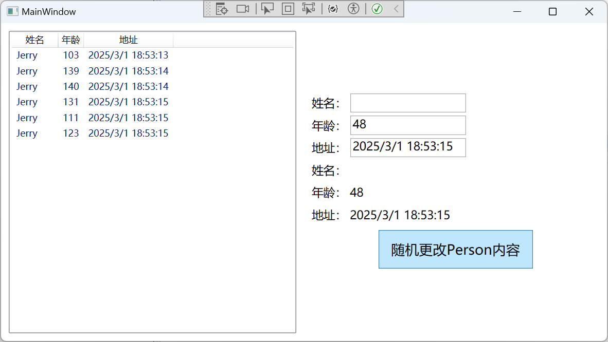

## 5.IValueConverter转换器

Binding类还有一个Converter属性，其实，它是一个IValueConverter接口。它的主要作用是：前后端建立绑定时，定义一套自定义逻辑，让前端显示的数据与后端获取的数据建立一定的对应关系。

比如Person对象有一个年龄（Age）属性，我们在前端显示某个人的年龄时，可以根据不同的年龄，显示不同的背景颜色。这个时候，实际上是根据这个输入的整型数据返回一个不同颜色的画刷。

IValueConverter示例

首先，我们定义一个根据年龄转换成不同颜色的画刷的转换器。它必须继承IValueConverter接口

```c#
public class AgeToColorConverter : IValueConverter
{
    public object Convert(object value, Type targetType, object parameter, CultureInfo culture)
    {
        SolidColorBrush background = Brushes.Black;
 
        if (value != null && int.TryParse(value.ToString(), out int age))
        {
            if (age < 20)
            {
                background = Brushes.Green;
            }
            else if (age < 40)
            {
                background = Brushes.Blue;
            }
            else if (age < 60)
            {
                background = Brushes.Orange;
            }
            else if (age < 80)
            {
                background = Brushes.Red;
            }
            else if (age < 90)
            {
                background = Brushes.Purple;
            }
            else
            {
                background = Brushes.Gray;
            }
        }
 
        return background;
    }
 
    public object ConvertBack(object value, Type targetType, object parameter, CultureInfo culture)
    {
        throw new NotImplementedException();
    }
}
```

然后，我们将上一节的示例代码稍作修改，将前端的StackPanel的背景颜色与当前Person的Age属性用AgeToColorConverter转换器建议绑定关系。在使用转换器之前，一定要先在XAML前端对转换器进行实例化。具体方法如下：

```c#
<Window.Resources>
    <local:AgeToColorConverter x:Key="AgeToColorConverter"/>
</Window.Resources>
```

然后，我们就可以使用这个Key名叫AgeToColorConverter的实例。

```
Background="{Binding Person.Age,Converter={StaticResource AgeToColorConverter}}"
```

完整的前端代码如下所示：

```xaml
<Window x:Class="HelloWorld.MainWindow"
        xmlns="http://schemas.microsoft.com/winfx/2006/xaml/presentation"
        xmlns:x="http://schemas.microsoft.com/winfx/2006/xaml"
        xmlns:d="http://schemas.microsoft.com/expression/blend/2008"
        xmlns:mc="http://schemas.openxmlformats.org/markup-compatibility/2006"
        xmlns:local="clr-namespace:HelloWorld" 
        xmlns:forms="clr-namespace:System.Windows.Forms;assembly=System.Windows.Forms"
        mc:Ignorable="d" FontSize="14"
        Title="WPF中文网之数据绑定 - www.wpfsoft.com" Height="350" Width="500">
    <Window.Resources>
        <local:AgeToColorConverter x:Key="AgeToColorConverter"/>
    </Window.Resources>
    <Grid>
        <Grid.ColumnDefinitions>
            <ColumnDefinition/>
            <ColumnDefinition Width="200"/>
        </Grid.ColumnDefinitions>
        <ListView ItemsSource="{Binding Persons}" SelectedItem="{Binding Person}">
            <ListView.View>
                <GridView>
                    <GridViewColumn Header="姓名" DisplayMemberBinding="{Binding Name}" Width="60"/>
                    <GridViewColumn Header="年龄" DisplayMemberBinding="{Binding Age}" Width="auto"/>
                    <GridViewColumn Header="地址" DisplayMemberBinding="{Binding Address}" Width="auto"/>
                </GridView>
            </ListView.View>
        </ListView>
        <StackPanel Grid.Column="1" x:Name="panel" VerticalAlignment="Center" Margin="5,0" 
                    Background="{Binding Person.Age,Converter={StaticResource AgeToColorConverter}}">
            <StackPanel Orientation="Horizontal">
                <TextBlock Text="姓名:" Margin="5"/>
                <TextBox Text="{Binding Person.Name,UpdateSourceTrigger=PropertyChanged}" Width="145" Height="25"/>
            </StackPanel>
            <StackPanel Orientation="Horizontal">
                <TextBlock Text="年龄:" Margin="5"/>
                <TextBox Text="{Binding Person.Age,UpdateSourceTrigger=LostFocus}" Width="145" Height="25"/>
            </StackPanel>
            <StackPanel Orientation="Horizontal">
                <TextBlock Text="地址:" Margin="5"/>
                <TextBox Text="{Binding Person.Address,UpdateSourceTrigger=Default}" Width="145" Height="25"/>
            </StackPanel>
            <TextBlock Margin="5" >
                <Run Text="姓名:"/>
                <Run Text="{Binding Person.Name}"/>
            </TextBlock>
            <TextBlock Margin="5" >
                <Run Text="年龄:"/>
                <Run Text="{Binding Person.Age}"/>
            </TextBlock>
            <TextBlock Margin="5" >
                <Run Text="住址:"/>
                <Run Text="{Binding Person.Address}"/>
            </TextBlock>
            <Button Content="增加用户" Click="Button_Click" Margin="5,0"/>
        </StackPanel>
    </Grid>
    
</Window>
```

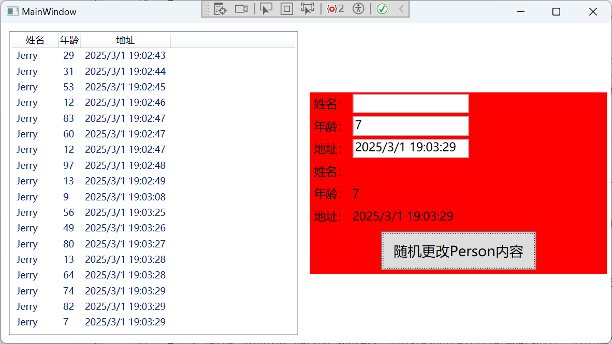

当我们选择左侧不同的行，当前的Person就会被更新，于是，当前Person的Age也会更新，同时会调用AgeToColorConverter转换器，将前端StackPanel的背景颜色更新。

## 6.IMultiValueConverter多值转换器

与IValueConverter类似的，还有一个叫IMultiValueConverter——多值转换器。它的定义和IValueConverter也十分类似。

```c#
public interface IMultiValueConverter
{
    object Convert(object[] values, Type targetType, object parameter, CultureInfo culture);
    object[] ConvertBack(object value, Type[] targetTypes, object parameter, CultureInfo culture);
 
}
```

只是第一个参数变成了values，表示它可以传入多个值。

后端代码

```c#
namespace Wpfsession3
{
    //单值转换器
    class AgeToColorConverter : IValueConverter
    {
        public object Convert(object value, Type targetType, object parameter, System.Globalization.CultureInfo culture)
        {
            SolidColorBrush background = Brushes.Black;
            if (value != null && int.TryParse(value.ToString(), out int age))
            {
                if (age < 18)
                {
                    return Brushes.Red;
                }
                else if (age > 30 && age < 60)
                {
                    return Brushes.Green;
                }
                else
                {
                    return Brushes.Blue;
                }
            }
            return background;

        }
        public object ConvertBack(object value, Type targetType, object parameter, System.Globalization.CultureInfo culture)
        {
            throw new NotImplementedException();
        }
    }

    class MultiColorConverter : IMultiValueConverter
    {
        public object Convert(object[] values, Type targetType, object parameter, System.Globalization.CultureInfo culture)
        {
            
            if(values != null && values.Length == 2 && values[0] != null && values[1] != null)
            {
                var age_result = int.TryParse(values[0].ToString(), out int age);
                var address_result = int.TryParse(values[1].ToString(), out int address);
                if (age_result && address_result)
                {
                    if (age < 30 && address > 50000)
                    {
                        return "年纪轻轻的有钱人";
                    }
                    else if (age >= 30 && age <= 60 && address < 5000)
                    {
                        return "悲催的中年人";
                    }
                    else if (age < 30 && address < 5000)
                    {
                        return "这个年轻人没什么钱";
                    }
                    else if (age >= 30 && address > 90000)
                    {
                        return "富豪";
                    }
                    else
                    {
                        return "一个平凡的人";
                    }
                }

            }
            return null;
        }
        public object[] ConvertBack(object value, Type[] targetTypes, object parameter, System.Globalization.CultureInfo culture)
        {
            throw new NotImplementedException();
        }
    }

    class ObservableObject : INotifyPropertyChanged
    {
        public event PropertyChangedEventHandler PropertyChanged;
        protected void RaisePropertyChanged([CallerMemberName]string propertyName = "")
        {
            PropertyChanged?.Invoke(this, new PropertyChangedEventArgs(propertyName));

        }
    }

    class Person : ObservableObject
    {
        private string _name;
        public string name
        {
            get { return _name; }
            set
            {
                _name = value;
                RaisePropertyChanged();
            }
        }
        private int _age;
        public int age
        {
            get { return _age; }
            set
            {
                _age = value;
                RaisePropertyChanged();
            }
        }

        private int _raise;
        public int raise
        {
            get { return _raise; }
            set
            {
                _raise = value;
                RaisePropertyChanged();
            }
        }

        private string _address;
        public string address
        {
            get { return _address; }
            set
            {
                _address = value;
                RaisePropertyChanged();
            }
        }
        
    }

    class MainViewModel : ObservableObject
    {
        private Person _person;
        public Person person
        {
            get { return _person; }
            set
            {
                _person = value;
                RaisePropertyChanged();
            }
        }

        public ObservableCollection<Person> persons { get; set; } = new ObservableCollection<Person>();
        public MainViewModel()
        {
            person = new Person();
        }
    }

    /// <summary>
    /// MainWindow.xaml 的交互逻辑
    /// </summary>
    public partial class MainWindow : Window
    {
        public MainWindow()
        {
            InitializeComponent();
            this.DataContext = new MainViewModel();
        }
        
        private void Button_Click(object sender, RoutedEventArgs e)
        {
            var vm = this.DataContext as MainViewModel;
            if (vm == null) return;

            vm.person.name = "tom";
            vm.person.age = new Random().Next(1, 100);
            vm.person.address = DateTime.Now.ToString();
            Console.WriteLine($"new age is : {vm.person.age},new address is {vm.person.address}");

            Person per = new Person();
            per.name = "Jerry";
            per.age = new Random().Next(1, 100);
            per.raise = new Random().Next(1, new Random().Next(1, 1000000));
            per.address = DateTime.Now.ToString();
            vm.persons.Add(per);
        }
    }
}
```


前端代码

```xaml
<Window x:Class="Wpfsession3.MainWindow"
        xmlns="http://schemas.microsoft.com/winfx/2006/xaml/presentation"
        xmlns:x="http://schemas.microsoft.com/winfx/2006/xaml"
        xmlns:d="http://schemas.microsoft.com/expression/blend/2008"
        xmlns:mc="http://schemas.openxmlformats.org/markup-compatibility/2006"
        xmlns:local="clr-namespace:Wpfsession3"
        mc:Ignorable="d"
        Title="MainWindow" Height="450" Width="800">
    <Window.Resources>
        <local:AgeToColorConverter x:Key="AgeToColorConverter"/>
        <local:MultiColorConverter x:Key="MultiColorConverter"/>
    </Window.Resources>
    <Grid>
        <Grid.ColumnDefinitions>
            <ColumnDefinition Width="*"/>
            <ColumnDefinition Width="*"/>
            
        </Grid.ColumnDefinitions>

        <ListView Grid.Column="0" ItemsSource="{Binding persons}" SelectedItem="{Binding person}" Margin="10">
            <ListView.View>
                <GridView>
                    <GridViewColumn Header="姓名" DisplayMemberBinding="{Binding name}" Width="60"/>
                    <GridViewColumn Header="年龄" DisplayMemberBinding="{Binding age}" Width="auto"/>
                    <GridViewColumn Header="地址" DisplayMemberBinding="{Binding address}" Width="auto"/>
                    <GridViewColumn Header="金额" DisplayMemberBinding="{Binding raise}" Width="auto"/>
                </GridView>
            </ListView.View>
        </ListView>
        
        <StackPanel Grid.Column="1" x:Name="sPanel" VerticalAlignment="Center" Margin="5 0" 
                    Background="{Binding person.age,Converter={StaticResource AgeToColorConverter}}">
            <StackPanel Orientation="Horizontal">
                <TextBlock Text="姓名：" FontSize="15" Margin="5"/>
                <TextBox Text="{Binding person.name, UpdateSourceTrigger=PropertyChanged}" Width="150" FontSize="15" Height="25"/>
            </StackPanel>
            <StackPanel Orientation="Horizontal">
                <TextBlock Text="年龄：" FontSize="15" Margin="5"/>
                <TextBox Text="{Binding person.age, UpdateSourceTrigger=LostFocus}" Width="150" FontSize="15" Height="25"/>
            </StackPanel>
            <StackPanel Orientation="Horizontal">
                <TextBlock Text="地址：" FontSize="15" Margin="5"/>
                <TextBox Text="{Binding person.address, UpdateSourceTrigger=Default}" Width="150" FontSize="15" Height="25"/>
            </StackPanel>
           
            <TextBlock Margin="5" FontSize="15">
                <Run Text="姓名："/>
                <Run Text="{Binding person.name}"/>
             </TextBlock>
             <TextBlock Margin="5" FontSize="15">
                <Run Text="年龄："/>
                <Run Text="{Binding person.age}"/>
            </TextBlock>
            <TextBlock Margin="5" FontSize="15">
                <Run Text="地址："/>
                <Run Text="{Binding person.address}"/>
                        
             </TextBlock>
            <TextBlock Margin="5" FontSize="15">
                <Run Text="金额："/>
                <Run Text="{Binding person.raise}"/>
            </TextBlock>
            <TextBlock Margin="5" FontSize="15">
                <Run Text="info：" Foreground="PaleVioletRed"/>
                <Run >
                    <Run.Text>
                        <MultiBinding Converter="{StaticResource MultiColorConverter}">
                            <Binding Path="person.age"/>
                            <Binding Path="person.raise"/>
                        </MultiBinding>
                    </Run.Text>
                </Run>

            </TextBlock>
            <Button Content="随机更改Person内容" Click="Button_Click" Margin="5" Width="200" Height="50" FontSize="18"/>
        </StackPanel>
    </Grid>
    
</Window>
```

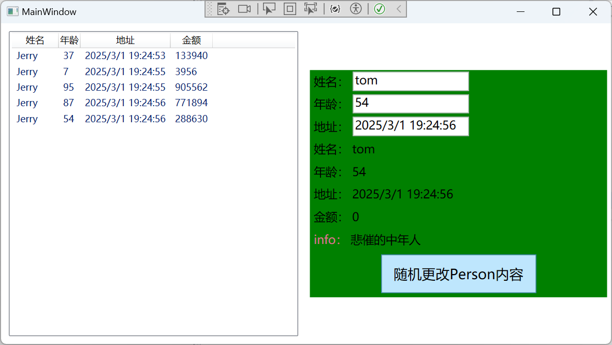

## 7.ValidationRule验证规则

ValidationRule是一个抽象类，提供创建自定义规则的一个方式，旨在检查用户输入的有效性。所以，我们要验证前端输入的各项数据的有效性时，需要自己定义各自的验证规则。

在数据绑定时，Binding类有一个ValidationRules属性，这个属性专门用来存放开发者自定义的验证规则。

例如，我们假定用户名的长度必须在1-10个字符之间，且用户的年龄在1-100之前，那么就可以围绕这两个条件自定义两个不同的验证规则，它们定义如下：

用户名验证规则

```c#
public class NameValidationRule : ValidationRule
{
    public override ValidationResult Validate(object value, CultureInfo cultureInfo)
    {
        if (value != null && value.ToString().Length > 1 && value.ToString().Length <= 10)
        {
            return new ValidationResult(true, "通过");
        }
 
        return new ValidationResult(false, "用户名长度1-10个字符");
    }
}
```

年龄验证规则

```c#
public class AgeValidationRule : ValidationRule
{
    public override ValidationResult Validate(object value, CultureInfo cultureInfo)
    {
        double myValue = 0;
        if (double.TryParse(value.ToString(), out myValue))
        {
            if (myValue >= 1 && myValue <= 100)
            {
                return new ValidationResult(true, null);
            }
        }
 
        return new ValidationResult(false, "请输入 1 至 100的年龄");
    }
}
```

在XAML前端代码中，TextBox输入框分别绑定了用户名和年龄，它们在绑定时如何调用验证规则呢？

```xaml
<StackPanel x:Name="sPanel" VerticalAlignment="Center" HorizontalAlignment="Center" Margin="100 0">
    <StackPanel Orientation="Horizontal">
        <TextBlock Text="姓名：" FontSize="15" Margin="5"/>
        <TextBox Width="150" FontSize="15" Height="25">
            <TextBox.Text>
                <Binding Path="person.name" UpdateSourceTrigger="PropertyChanged">
                    <Binding.ValidationRules>
                        <local:NameValidationRule ValidatesOnTargetUpdated="True" />
                    </Binding.ValidationRules>
                </Binding>
            </TextBox.Text>
            <Validation.ErrorTemplate>
                <ControlTemplate>
                    <DockPanel>
                        <Grid DockPanel.Dock="Right" Width="auto" Height="auto" VerticalAlignment="Center" Margin="3 0 0 0">
                            <TextBlock Width="auto" Height="auto" Foreground="Red"
                             Text="{Binding ElementName=AdornedElementPlaceholder, Path=AdornedElement.(Validation.Errors).CurrentItem.ErrorContent}"/>
                        </Grid>
                        <Border BorderBrush="Red" BorderThickness="0" CornerRadius="2">
                            <AdornedElementPlaceholder x:Name="AdornedElementPlaceholder"/>
                        </Border>
                    </DockPanel>
                </ControlTemplate>
            </Validation.ErrorTemplate>
        </TextBox>
    </StackPanel>
    <StackPanel Orientation="Horizontal">
        <TextBlock Text="年龄：" FontSize="15" Margin="5"/>
        <TextBox Width="150" FontSize="15" Height="25">
            <TextBox.Text>
                <Binding Path="person.age" UpdateSourceTrigger="PropertyChanged">
                    <Binding.ValidationRules>
                        <local:AgeValidationRule ValidatesOnTargetUpdated="True" />
                    </Binding.ValidationRules>
                </Binding>
            </TextBox.Text>
            <Validation.ErrorTemplate>
                <ControlTemplate>
                    <DockPanel>
                        <Grid DockPanel.Dock="Right" Width="auto" Height="auto" VerticalAlignment="Center" Margin="3 0 0 0">
                            <TextBlock Width="auto" Height="auto" Foreground="Red"
                             Text="{Binding ElementName=AdornedElementPlaceholder, Path=AdornedElement.(Validation.Errors).CurrentItem.ErrorContent}"/>
                        </Grid>
                        <Border BorderBrush="Red" BorderThickness="0" CornerRadius="2">
                            <AdornedElementPlaceholder x:Name="AdornedElementPlaceholder"/>
                        </Border>
                    </DockPanel>
                </ControlTemplate>
            </Validation.ErrorTemplate>
        </TextBox>
    </StackPanel>
    <StackPanel Orientation="Horizontal">
        <TextBlock Text="地址：" FontSize="15" Margin="5"/>
        <TextBox Text="{Binding person.address, UpdateSourceTrigger=Default}" Width="150" FontSize="15" Height="25"/>
    </StackPanel>

    <TextBlock Margin="5" FontSize="15">
    <Run Text="姓名："/>
    <Run Text="{Binding person.name}"/>
    </TextBlock>
    <TextBlock Margin="5" FontSize="15">
    <Run Text="年龄："/>
    <Run Text="{Binding person.age}"/>
    </TextBlock>
    <TextBlock Margin="5" FontSize="15">
    <Run Text="地址："/>
    <Run Text="{Binding person.address}"/>

    </TextBlock>
    <TextBlock Margin="5" FontSize="15">
    <Run Text="金额："/>
    <Run Text="{Binding person.raise}"/>
    </TextBlock>
    <TextBlock Margin="5" FontSize="15">
   

    </TextBlock>
    <Button Content="随机更改Person内容" Click="Button_Click" Margin="5" Width="200" Height="50" FontSize="18"/>
</StackPanel>
```

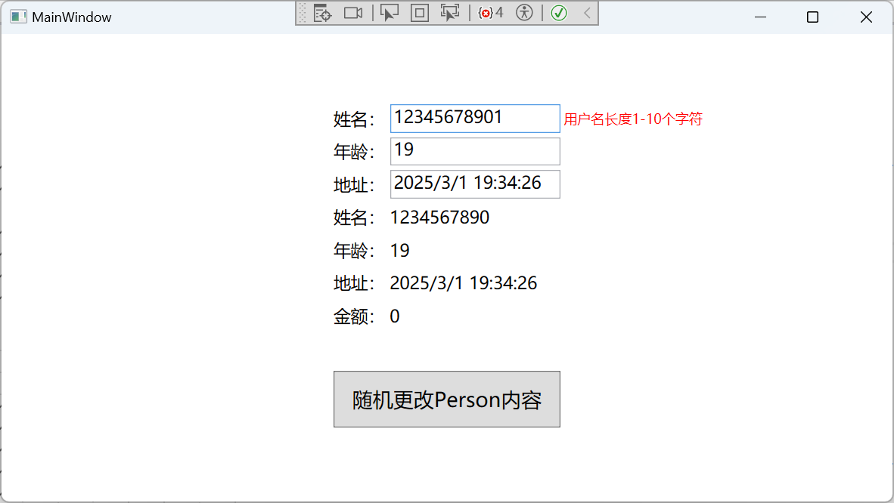

**ValidationRule会把验证结果保存在AdornedElementPlaceholder的AdornedElement属性中，所以，需要利用绑定的方法去绑定下面这个路径。**

**AdornedElement.(Validation.Errors).CurrentItem.ErrorContent**


