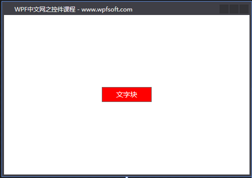
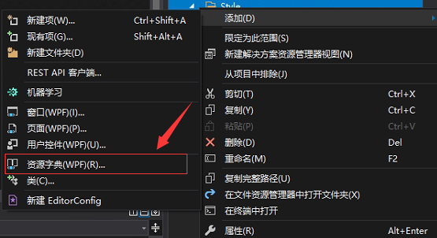
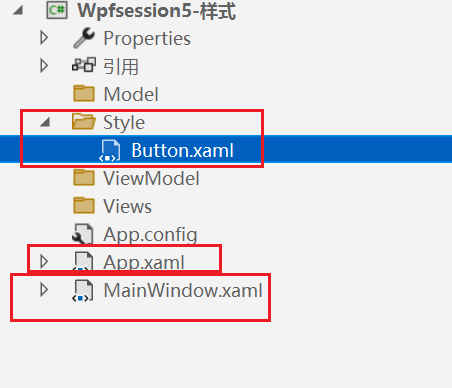
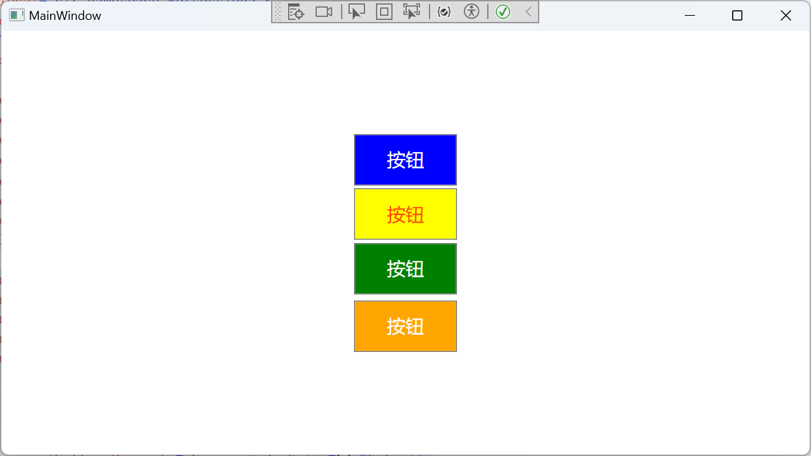
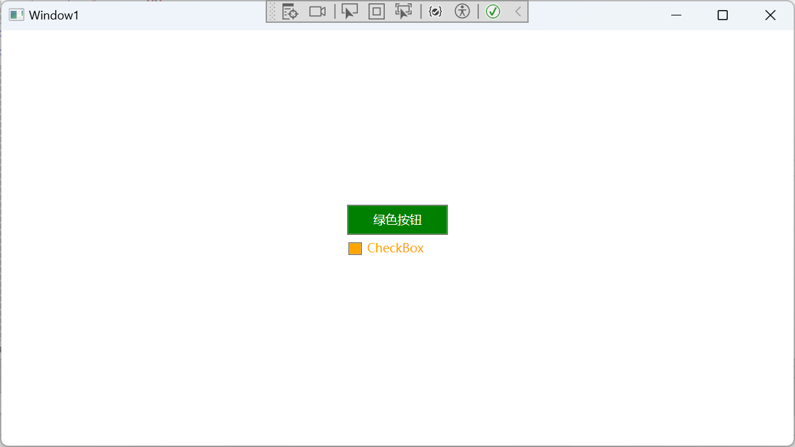
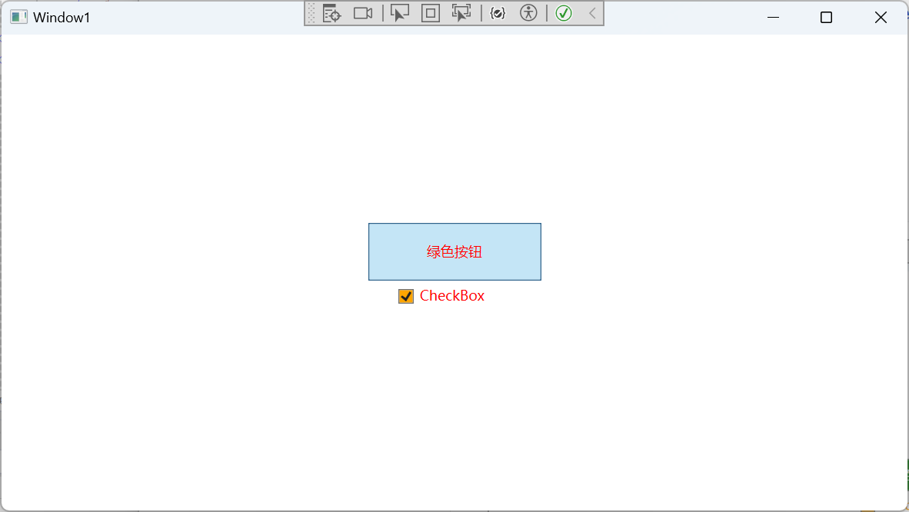
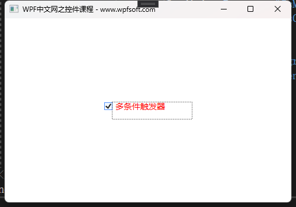

## 说明

首先，WPF框架提供了许许多多的控件，而这些控件拥有不同的属性，例如一个button控件的长宽、背景颜色、字体字号、内外边距、边框等，我们可以设置这些属性的值，从而让控件呈现出不同的显示效果。如果有多个button，我们该怎么办呢，每个按钮都去设置一遍属性？显示这是不科学的。于是，我们可以将一系列的属性的设置“集中”起来，将它们定义成一个样式，最后将这个样式再设置到控件上，从而达到“一处定义多处引用”的偷懒行为。

样式——就是一种将一组属性值应用到多个元素的便捷方法。

### 定义

样式的类型叫Style，它继承于DispatcherObject，它最重要的几个属性如下：

- TargetType属性：这是一个类类型，也就是一个反射，这个属性指明了当前样式要作用于哪种类型的控件上。因为WPF中有许多的控件，我们定义一个样式时，必须要指明这个样式的“适用范围”。

- BasedOn属性：样式也有继承的概念，所以，BasedOn指明了当前样式继承于哪个样式

- Triggers属性：这是一个集合属性，表示触发器的定义，当满足某些条件时，触发哪些行为，以使控件达到一定的“节目效果”。比如当鼠标移上去时，控件的背景颜色变成红色。这些的效果就可以通过定义控件的触发器来设置。

- Setters属性：这也是一个集合属性，样式是控件属性的值的“提前设置”，所以，我们对控件属性的值的设置都是以Setter条目的形式，一条一条的放到这个Setters集合中。

- Resources属性：这个属性叫资源字典。在正式讲解样式之前，我们要先介绍一下资源字典的概念及其用途。它表示一些资源，以字典的形式进行维护，方便程序引用。下一节，我们先介绍ResourceDictionary。

**Style样式如何使用**

当我们定义好一个Style之后，如此去使用它？首先，我们在《[FrameworkElement基类](http://www.wpfsoft.com/2023/08/16/756.html)》那一节中也曾了解过Style的概念，并且我们会发现FrameworkElement基类就有一个Style属性。而所有的控件都继承于FrameworkElement基类，所以，我们只需要将定义好的样式赋值到控件的Style属性即可。

2.1 在Application.Resources中定义样式

```xaml
<Application x:Class="HelloWorld.App"
             xmlns="http://schemas.microsoft.com/winfx/2006/xaml/presentation"
             xmlns:x="http://schemas.microsoft.com/winfx/2006/xaml"
             xmlns:local="clr-namespace:HelloWorld"
             StartupUri="MainWindow.xaml">
    <Application.Resources>
        <Style x:Key="ButtonStyle" TargetType="Button">
            <Setter Property="Width" Value="100"/>
            <Setter Property="Height" Value="30"/>
            <Setter Property="Background" Value="Red"/>
            <Setter Property="Foreground" Value="White"/>
        </Style>
    </Application.Resources>
</Application>
```

2.2 在XAML中引用样式

```
<Grid>
    <Button Content="文字块" Style="{StaticResource ButtonStyle}"/>
</Grid>
```



注意：在引用样式时，我们有两种方式，分别是DynamicResource和StaticResource，后面再写上样式的名称。DynamicResource表示动态资源，StaticResource表示静态资源。这两者的区别是：静态资源在第一次编译后即确定其对象或值，之后不能对其进行修改。动态资源则是在运行时决定，当运行过程中真正需要时，才到资源目标中查找其值。因此，我们可以动态地修改它。由于动态资源的运行时才能确定其值，因此效率比静态资源要低。

另外，我们在定义样式的条目时，实际上是实例化了一个Setter对象。它有两个关键是属性，分别是Property和Value。Property表示要设置的属性名，Value表示要设置的属性值。有点像键值对的感觉。

```c#
public class Setter : SetterBase, ISupportInitialize
{
    public Setter();
    public Setter(DependencyProperty property, object value);
    public Setter(DependencyProperty property, object value, string targetName);
 
    public DependencyProperty Property { get; set; }
    public object Value { get; set; }
    public string TargetName { get; set; }
 
    public static void ReceiveMarkupExtension(object targetObject, XamlSetMarkupExtensionEventArgs eventArgs);
    public static void ReceiveTypeConverter(object targetObject, XamlSetTypeConverterEventArgs eventArgs);
 
}
```

另外，Setter从定义上看，它还有一个属性叫TargetName，顾名思义，目标名称，也就是这一对属性名和值是哪个控件的属性名和值。通常它在定义触发器时使用，我们将在后面的场景中去学习它。

## 2.Resource资源

WPF中的资源是指可以在应用中的不同位置重复使用的对象。而拥有这些对象的文件，我们可称为资源文件。这些资源文件可以编译到程序集中，可使用包 URI 来引用一组特殊的 WPF 应用程序代码文件，包括窗口、页面、流文档和资源字典。 例如，可以将 Application.StartupUri 属性设置为包 URI，用于引用要在应用程序启动时加载的窗口或页面。

```xaml
<Application x:Class="HelloWorld.App"
             xmlns="http://schemas.microsoft.com/winfx/2006/xaml/presentation"
             xmlns:x="http://schemas.microsoft.com/winfx/2006/xaml"
             xmlns:local="clr-namespace:HelloWorld"
             StartupUri="MainWindow.xaml">
    <Application.Resources>
        
    </Application.Resources>
</Application>
```

在App.xaml文件中，通常默认的StartupUri属性值为MainWindow.xaml，这个MainWindow.xaml文件实际上就是一个资源文件，它包含了主窗体界面的所有XAML代码。

### **使用资源文件**

我们可以在XAML中删除StartupUri属性的设置，在Application的后端C#代码中去引用主窗体的资源文件。

```
public partial class App : Application
{
    protected override void OnStartup(StartupEventArgs e)
    {
        base.OnStartup(e);
 
        Uri uri = new Uri("MainWindow.xaml", UriKind.Relative);
        base.StartupUri = uri;
        
    }        
}
```

如上所示，我们重写了OnStartup方法成员，利用Uri包引入MainWindow.xaml，并设置到StartupUri属性，F5运行，同样会启动主窗体。

WPF的资源的形式是多样化的，它可以是一个主窗体，也可以是一个画笔，或一个样式，或一个别的对象。关键的一点是，它是一个对象。什么是对象？一个类型被实例化之后，就成了一个对象。所以，我们从本质上讲，**资源就是类型实例化之后的对象**。

### **资源的老家**

首先，资源是以字典的形式存在于程序中——也就是ResourceDictionary（资源字典）。其次，它们通常保存在Resources属性中。哪些类型有Resources属性？

答案是：Application类、FrameworkElement基类和FrameworkContentElement基类。

> 来自官方的引述
>
> 每个框架级元素（FrameworkElement 或 FrameworkContentElement）都具有 Resources 属性，该属性是包含已定义资源的 ResourceDictionary 类型。 你可以在任何元素上定义资源，例如 Button。 但是，最常在根元素上定义资源。资源字典中的每个资源都必须具有唯一键。 在标记中定义资源时，可通过 x:Key 指令来分配唯一键。 通常情况下，这个键是一个字符串；但是，也可使用相应的标记扩展将其设置为其他对象类型。 资源的非字符串键用于 WPF 中的某些功能区，尤其是样式、组件资源和数据样式。

从Resources属性可以分析出——每个控件都可以单独定义资源，因为它们都继承了Resources属性。但是，通常情况下，我们会在Application中去定义Resources属性，这样全局或所有的控件都可以引用。

## 3.ResourceDictionary资源字典

Application类、FrameworkElement基类和FrameworkContentElement基类都有一个叫Resources的属性，其类型就是ResourceDictionary，我们称为资源字典。

ResourceDictionary资源字典的定义

```c#
 
public class ResourceDictionary : IDictionary, ICollection, IEnumerable, ISupportInitialize, IUriContext, INameScope
{
    public ResourceDictionary();
 
    public object this[object key] { get; set; }
 
    public ICollection Keys { get; }
    public DeferrableContent DeferrableContent { get; set; }
    public bool InvalidatesImplicitDataTemplateResources { get; set; }
    public bool IsReadOnly { get; }
    public bool IsFixedSize { get; }
    public Uri Source { get; set; }
    public Collection<ResourceDictionary> MergedDictionaries { get; }
    public ICollection Values { get; }
    public int Count { get; }
 
    public void Add(object key, object value);
    public void BeginInit();
    public void Clear();
    public bool Contains(object key);
    public void CopyTo(DictionaryEntry[] array, int arrayIndex);
    public void EndInit();
    public object FindName(string name);
    public IDictionaryEnumerator GetEnumerator();
    public void RegisterName(string name, object scopedElement);
    public void Remove(object key);
    public void UnregisterName(string name);
    protected virtual void OnGettingValue(object key, ref object value, out bool canCache);
 
}
```

从ResourceDictionary的定义上看，它内部拥有两个集合，分别是Keys和Values，并且它还拥有一个迭代器，可以根据key名称快速地访问某个Values集合中的元素；最后就是这个迭代器的返回值是object类型，说明一个问题：**资源字典的集合中的元素可以是任意类型的实例**。这句话非常重要，我们接下来就演示它的用途。

此外，资源字典还有一个很重要的属性——MergedDictionaries。字面意思可以理解成合并的资源字典集合。也就是说，Applicaton类的Resources属性本身就可以定义许多的资源，而这些资源可以是某个Style样式，也可以是某个画笔，或某个转换器，还可以是ResourceDictionary，但是要把ResourceDictionary放到MergedDictionaries集合中。

最后一个比较重要的属性是Source。它表示当前资源字典的数据源——也就是要加载资源的 统一资源标识符 (URI)。

创建一个资源字典文件



### 示例

目录结构



buttom.xaml

```xaml
<ResourceDictionary xmlns="http://schemas.microsoft.com/winfx/2006/xaml/presentation"
                    xmlns:x="http://schemas.microsoft.com/winfx/2006/xaml">
    <Style x:Key="BlueButtonStyle" TargetType="Button">
        <Setter Property="Width" Value="100"/>
        <Setter Property="Height" Value="30"/>
        <Setter Property="Background" Value="Blue"/>
        <Setter Property="Foreground" Value="White"/>
        <Setter Property="Margin" Value="3"/>
    </Style>
</ResourceDictionary>
```

app.xaml

```xaml
<Application x:Class="Wpfsession5_样式.App"
             xmlns="http://schemas.microsoft.com/winfx/2006/xaml/presentation"
             xmlns:x="http://schemas.microsoft.com/winfx/2006/xaml"
             xmlns:local="clr-namespace:Wpfsession5_样式"
             StartupUri="MainWindow.xaml">
    <Application.Resources>
        
        <ResourceDictionary>
            <Style x:Key="ButtonStyle" TargetType="Button">
                <Setter Property="Width" Value="200"/>
                <Setter Property="Height" Value="100"/>
                <Setter Property="Foreground" Value="OrangeRed"/>
                <Setter Property="FontSize" Value="24"/>
                <Setter Property="Background" Value="Yellow"/>
            </Style>
            <ResourceDictionary.MergedDictionaries>
                <ResourceDictionary Source="Style/Button.xaml"/>
            </ResourceDictionary.MergedDictionaries>
        </ResourceDictionary>
    </Application.Resources>
</Application>
```

MainWindow.xaml

```xaml
<Window x:Class="Wpfsession5_样式.MainWindow"
        xmlns="http://schemas.microsoft.com/winfx/2006/xaml/presentation"
        xmlns:x="http://schemas.microsoft.com/winfx/2006/xaml"
        xmlns:d="http://schemas.microsoft.com/expression/blend/2008"
        xmlns:mc="http://schemas.openxmlformats.org/markup-compatibility/2006"
        xmlns:local="clr-namespace:Wpfsession5_样式"
        mc:Ignorable="d"
        Title="MainWindow" Height="450" Width="800">
    <Window.Resources>
        <Style x:Key="GreenButtonStyle" TargetType="Button">
            <Setter Property="Width" Value="100"/>
            <Setter Property="Height" Value="30"/>
            <Setter Property="Background" Value="Green"/>
            <Setter Property="Foreground" Value="White"/>
            <Setter Property="Margin" Value="3"/>
        </Style>
    </Window.Resources>
    <StackPanel HorizontalAlignment="Center" VerticalAlignment="Center">

        <Button Content="按钮" Width="100" Height="50" FontSize="18" Style="{StaticResource BlueButtonStyle}"/>
        <Button Content="按钮" Width="100" Height="50" FontSize="18" Style="{StaticResource ButtonStyle}"/>
        <Button Content="按钮" Width="100" Height="50" FontSize="18" Style="{StaticResource GreenButtonStyle}"/>
        <Button Content="按钮" Width="100" Height="50" FontSize="18" >
            <Button.Style>
                <Style TargetType="Button">
                    <Setter Property="Width" Value="100"/>
                    <Setter Property="Height" Value="30"/>
                    <Setter Property="Background" Value="Orange"/>
                    <Setter Property="Foreground" Value="White"/>
                    <Setter Property="Margin" Value="3"/>
                </Style>
            </Button.Style>
        </Button>

    </StackPanel>
</Window>
```

效果：



## 4.Trigger触发器

触发器是指当满足预设的条件时去执行一些事务的工具，比如我们希望鼠标移到某个按钮上方时，这个按钮的颜色、大小发生一些改变。这个时候，条件是鼠标移到按钮上，执行的事务是改变按钮的颜色和大小。

WPF提供了5种触发器，以满足不同场合下的使用要求。触发器主要运用的场景在Style、ControlTemplate、DataTemplate三个地方。我们先介绍Style样式中的用法，待学习模板知识时，再进一步学习触发器在模板中的使用。

| 触发器名称       | 说明                                         |
| ---------------- | -------------------------------------------- |
| Trigger          | 监测依赖属性的变化、触发器生效               |
| MultiTrigger     | 通过多个条件的设置、达到满足条件、触发器生效 |
| DataTrigger      | 通过数据的变化、触发器生效                   |
| MultiDataTrigger | 多个数据条件的触发器                         |
| EventTrigger     | 事件触发器, 触发了某类事件时, 触发器生效。   |

### **Trigger触发器的定义**

```c#
public class Trigger : TriggerBase, IAddChild, ISupportInitialize
{
    public Trigger();
 
    public DependencyProperty Property { get; set; }
    public object Value { get; set; }
    public string SourceName { get; set; }
    public SetterBaseCollection Setters { get; }
 
    public static void ReceiveTypeConverter(object targetObject, XamlSetTypeConverterEventArgs eventArgs);
 
}
```

从定义上看，它有4个属性，我们一一分析

Property属性：表示定义触发器所指向的属性名称，需要注意的是，它的类似是DependencyProperty（依赖属性），也就是说，触发器所生效的属性必须是WPF中的依赖属性。

Value属性：表示定义触发器所指向的属性的值，这两个属性要连起来理解，即某个属性的值等于预设的值时，此时将该触发器将被触发，至于要执行哪些具体的事务，就要看Setters集合中定义了哪些项。

SourceName属性：获取或设置与导致关联的 setter 要应用的属性对象的名称。

Setters属性：这是一个集合，类似于Style样式的Setters，且用途是一致的，就是指当前触发器被触发时，将执行Setters里面的内容项。

### 示例


```xaml
<Window x:Class="Wpfsession5_样式.Window1"
        xmlns="http://schemas.microsoft.com/winfx/2006/xaml/presentation"
        xmlns:x="http://schemas.microsoft.com/winfx/2006/xaml"
        xmlns:d="http://schemas.microsoft.com/expression/blend/2008"
        xmlns:mc="http://schemas.openxmlformats.org/markup-compatibility/2006"
        xmlns:local="clr-namespace:Wpfsession5_样式"
        mc:Ignorable="d"
        Title="Window1" Height="450" Width="800">
    <Window.Resources>
        <Style x:Key="GreenButtonStyle" TargetType="Button">
            <Setter Property="Width" Value="100"/>
            <Setter Property="Height" Value="30"/>
            <Setter Property="Background" Value="Green"/>
            <Setter Property="Foreground" Value="White"/>
            <Setter Property="Margin" Value="3"/>
            <Style.Triggers>
                <Trigger Property="IsMouseCaptured" Value="True">
                    <Setter Property="Foreground" Value="Red"/>
                    <Setter Property="Width" Value="150"/>
                    <Setter Property="Height" Value="50"/>
                    <Setter Property="Content" Value="鼠标移入"/>
                </Trigger>
            </Style.Triggers>
        </Style>
    </Window.Resources>
    <StackPanel VerticalAlignment="Center">
        <Button Content="绿色按钮" Style="{StaticResource GreenButtonStyle}"/>
        <CheckBox Content="CheckBox">
            <CheckBox.Style>
                <Style TargetType="CheckBox">
                    <Setter Property="Width" Value="100"/>
                    <Setter Property="Height" Value="30"/>
                    <Setter Property="Background" Value="Orange"/>
                    <Setter Property="Foreground" Value="Green"/>
                    <Setter Property="Margin" Value="3"/>
                    <Style.Triggers>
                        <Trigger Property="IsChecked"  Value="True">
                            <Setter Property="Foreground" Value="Red"/>
                        </Trigger>
                        <Trigger Property="IsChecked"  Value="False">
                            <Setter Property="Foreground" Value="Orange"/>
                        </Trigger>
                        <Trigger Property="IsMouseOver" Value="True">
                            <Setter Property="FontWeight" Value="Bold"/>
                        </Trigger>
                        <Trigger Property="IsMouseOver" Value="False">
                            <Setter Property="FontWeight" Value="Normal"/>
                        </Trigger>
                    </Style.Triggers>
                </Style>
            </CheckBox.Style>
        </CheckBox>
    </StackPanel>
</Window>
```






## 5.MultiTrigger多条件触发器

MultiTrigger表示多个条件同时满足时才会触发的触发器。

```
public sealed class MultiTrigger : TriggerBase, IAddChild
{
    public MultiTrigger();
 
    public ConditionCollection Conditions { get; }
    public SetterBaseCollection Setters { get; }
 
}
```

一、属性成员

1.1 Conditions属性

MultiTrigger的Conditions属性是一个集合，表示条件。这个集合的元素是Condition类型。

```c#
public sealed class Condition : ISupportInitialize
{
    public Condition();
    public Condition(DependencyProperty conditionProperty, object conditionValue);
    public Condition(BindingBase binding, object conditionValue);
    public Condition(DependencyProperty conditionProperty, object conditionValue, string sourceName);
 
    public DependencyProperty Property { get; set; }
    public BindingBase Binding { get; set; }
    public object Value { get; set; }
    public string SourceName { get; set; }
 
    public static void ReceiveMarkupExtension(object targetObject, XamlSetMarkupExtensionEventArgs eventArgs);
    public static void ReceiveTypeConverter(object targetObject, XamlSetTypeConverterEventArgs eventArgs);
 
}
```

通常情况下，我们只需要使用Property属性和Value属性即可，即“某个属性达到某个值时”这样一种条件定义。

```
<Condition Property="IsMouseOver" Value="True"/>
```

1.2 Setters属性

MultiTrigger的Setters属性也是一个集合，表示触发器触发后要设置的项。比如：

```
                                
<Setter Property="Foreground" Value="Red"/>
```

二、MultiTrigger示例

```xaml
<CheckBox x:Name="checkbox">
    <CheckBox.Style>
        <Style TargetType="CheckBox">
            <Setter Property="Content" Value="MultiTrigger"/>
            <Setter Property="Width" Value="150"/>
            <Setter Property="Height" Value="30"/>
            <Setter Property="Background" Value="Orange"/>
            <Setter Property="Foreground" Value="Green"/>
            <Setter Property="Margin" Value="3"/>
            <Style.Triggers>
                <MultiTrigger>
                    <MultiTrigger.Conditions>
                        <Condition Property="IsMouseOver" Value="True"/>
                        <Condition Property="IsChecked" Value="True"/>
                    </MultiTrigger.Conditions>
                    <MultiTrigger.Setters>
                        <Setter Property="Foreground" Value="Red"/>
                        <Setter Property="Content" Value="多条件触发器"/>
                    </MultiTrigger.Setters>
                </MultiTrigger>                        
            </Style.Triggers>
        </Style>
    </CheckBox.Style>
</CheckBox>        
```

在上面的例子中，我们通过Style样式设置了CheckBox的Content及其它属性。然后在样式中实例化了一个MultiTrigger多条件触发器，并为其Conditions集合增加了两个条件，分别是IsMouseOver等于True和IsChecked等于True，当条件满足时，会改变CheckBox的前景色为红色，同时，Content变成"多条件触发器"。




