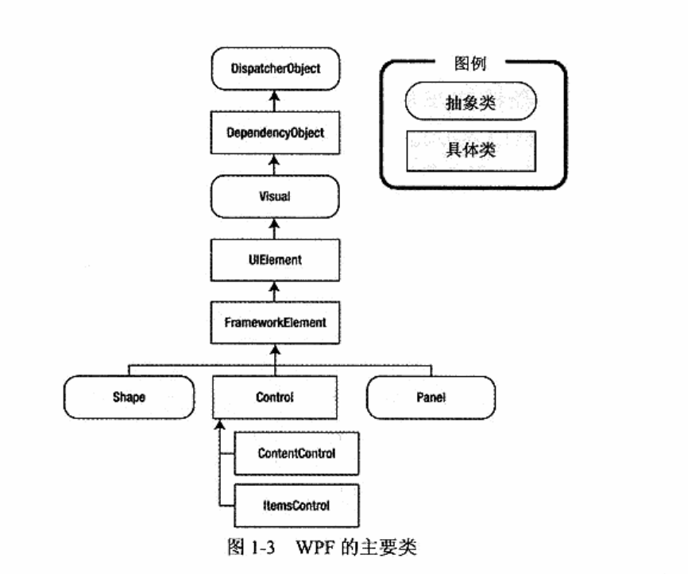
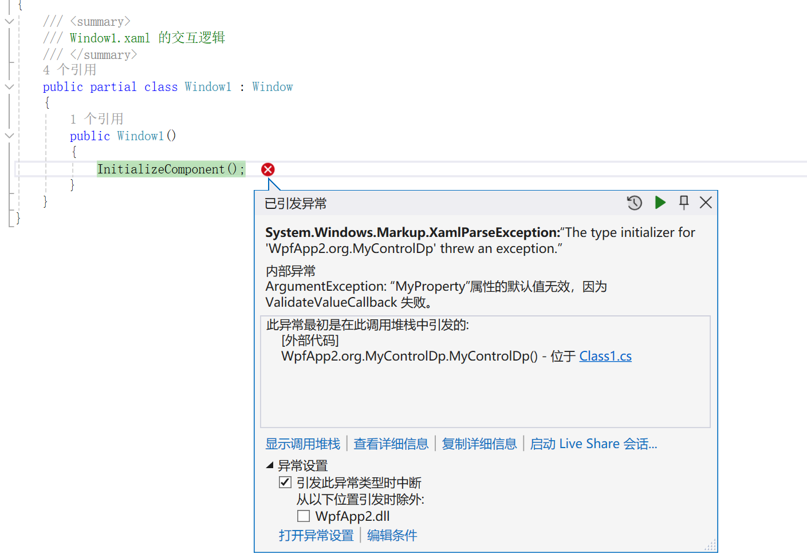

## 1.WPF依赖属性

依赖属性应用场景
1、要求属性支持绑定
2、自定义/扩展控件属性（一般都是要求支持绑定的）
3、验证/强制回调
4、继承
5、附加属性（一种特殊的依赖属性）


wpf的主要类



### 自定义一个依赖属性

DefaultValue 属性：表示依赖属性的默认值。

PropertyChangedCallback 属性：一个回调委托对象。当依赖属性值发现改变时触发执行。

CoerceValueCallback 属性：一个回调委托对象。表示强制转换时执行的业务逻辑，它会先于PropertyChangedCallback 委托触发。


依赖属性的声明。属性声明主要是继承dependencyObject类从而生成实现该功能。当然在具体使用时，可以继承其子类。也就变相基础该类

```c#
namespace WpfApp2.org
{
    internal class MyControlDp : Panel
    {
        //属性分为3步：定义、注册、包装

        #region 手写
        //1.定义

        //public static DependencyProperty myControlDp;

        ////注册
        //static MyControlDp ()
        //{
        //    myControlDp = DependencyProperty.Register(
        //        "myCon",//属性名
        //         typeof(int),//数据类型
        //        typeof(MyControlDp),//类型该属性属于那个类型
        //        new PropertyMetadata(0)
        //        );
        //}

        ////定义与注册写在一起
        //public static DependencyProperty myControlDp =  DependencyProperty.Register(
        //        "myCon",//属性名
        //         typeof(int),//数据类型
        //        typeof(MyControlDp),//类型该属性属于那个类型
        //        new PropertyMetadata(0)
        //        );

        ////3.包装
        //public int myCon { 
        //    get { return (int)GetValue(myControlDp); }
        //    set { SetValue(myControlDp, value); }
        //}
        #endregion

        #region 自动生成
        public int MyProperty
        {
            get { return (int)GetValue(MyPropertyProperty); }
            set { SetValue(MyPropertyProperty, value); }
        }

        // Using a DependencyProperty as the backing store for MyProperty.  This enables animation, styling, binding, etc...
        public static readonly DependencyProperty MyPropertyProperty =
            DependencyProperty.Register(
                "MyProperty", 
                typeof(int), 
                typeof(MyControlDp), 
                new PropertyMetadata(0))
            ;
        #endregion


    }
}
```

### 使用自定义属性

```xml
<Window x:Class="WpfApp2.Window1"
        xmlns="http://schemas.microsoft.com/winfx/2006/xaml/presentation"
        xmlns:x="http://schemas.microsoft.com/winfx/2006/xaml"
        xmlns:d="http://schemas.microsoft.com/expression/blend/2008"
        xmlns:mc="http://schemas.openxmlformats.org/markup-compatibility/2006"
        xmlns:local="clr-namespace:WpfApp2.org"
        WindowStartupLocation="CenterScreen"
        
        mc:Ignorable="d"
        Title="Window1" Height="450" Width="800">
    <Grid>
        <Label Content="test" HorizontalAlignment="Left" Margin="373,185,0,0" VerticalAlignment="Top"/>
        <local:MyControlDp Height="100" Width="300" Background="Red" MyProperty="12" Margin="250,239,250,96">
            
        </local:MyControlDp>

    </Grid>
</Window>
```

`xmlns:local="clr-namespace:WpfApp2.org"`

MyControlDp是我们自定义的一个UI控件。

先声明自定义属性类所在的命名空间，然后通过local调用就可以使用我们定义的MyProperty属性

### 依赖属性值回调

定义

```c#
        #region 自动生成
        public int MyProperty
        {
            get { return (int)GetValue(MyPropertyProperty); }
            set { SetValue(MyPropertyProperty, value); }
        }

        // Using a DependencyProperty as the backing store for MyProperty.  This enables animation, styling, binding, etc...
        public static readonly DependencyProperty MyPropertyProperty =
            DependencyProperty.Register(
                "MyProperty", 
                typeof(int), 
                typeof(MyControlDp), 
                new PropertyMetadata(0, onChange))
            ;
        /// <summary>
        /// 属性发送变化时被激活
        /// </summary>
        /// <param name="d"></param>
        /// <param name="e"></param>
        /// <exception cref="NotImplementedException"></exception>
        private static void onChange(DependencyObject d, DependencyPropertyChangedEventArgs e)
        {
            //业务执行
            //e.NewValue;新值
            //e.OldValue;旧值
            int newVlaue = (int)e.NewValue;
        }
        #endregion
```

在添加属性默认值时new PropertyMetadata(0, onChange))

添加一个回调函数。当MyProperty属性的值被修改时，就会触发onChange函数.

### 验证回调---对属性做校验


```c#
        // Using a DependencyProperty as the backing store for MyProperty.  This enables animation, styling, binding, etc...
        public static readonly DependencyProperty MyPropertyProperty =
            DependencyProperty.Register(
                "MyProperty", 
                typeof(int), 
                typeof(MyControlDp), 
                new PropertyMetadata(1, onChange),
                new ValidateValueCallback(onValidata)
            );
        /// <summary>
        /// 对属性做校验
        /// </summary>
        /// <param name="value"></param>
        /// <returns></returns>
        private static bool onValidata(object value)
        {
            int myProperty = (int)value;
            if (myProperty <= 0)
            {
                return false;
            }
            return true;
        }
```

`new ValidateValueCallback(onValidata)`

声明该callback后，程序回自动对MyProperty属性的值做校验，如果校验不通过则值无效




### 三种回调的执行顺序

先强制，再验证再改变

## 2.属性共享

对于一些处于不同层次但使用相同属性的类，可以使用属性共享使用同一属性。而不是再次声明相同属性。


使用DependencyProperty.AddOwner()添加共享属性


例子：

```c#
namespace WpfApp2.org
{
    internal class Class2 : Panel
    {


        public int MyProperty2
        {
            get { return (int)GetValue(MyProperty2Property); }
            set { SetValue(MyProperty2Property, value); }
        }

        // Using a DependencyProperty as the backing store for MyProperty2.  This enables animation, styling, binding, etc...
        public static readonly DependencyProperty MyProperty2Property =
            MyControlDp.MyPropertyProperty.AddOwner(typeof(Class2));


    }
}
```

该属性就使用了上面定义的MyPropertyProperty

## 3.附加属性

附加属性是一种依赖项属性，由W℉属性系统管理。不同之处在于附加属性被应用到的类并非定义附加属性的那个类。


为了定义附加属性，需要使用RegisterAttached()方法，而不是使用Register()方法。

```c#
namespace WpfApp2.org
{
    internal class PropAttach
    {


        public static String GetMyProperty(DependencyObject obj)
        {
            return (String)obj.GetValue(MyPropertyProperty);
        }

        public static void SetMyProperty(DependencyObject obj, int value)
        {
            obj.SetValue(MyPropertyProperty, value);
        }

        // Using a DependencyProperty as the backing store for MyProperty.  This enables animation, styling, binding, etc...
        public static readonly DependencyProperty MyPropertyProperty =
            DependencyProperty.RegisterAttached("MyProperty", typeof(String), typeof(PropAttach), new PropertyMetadata(""));


    }
}
```

使用自定义的附加属性

```xml
<Window x:Class="WpfApp2.xml.WinAttach"
        xmlns="http://schemas.microsoft.com/winfx/2006/xaml/presentation"
        xmlns:x="http://schemas.microsoft.com/winfx/2006/xaml"
        xmlns:d="http://schemas.microsoft.com/expression/blend/2008"
        xmlns:mc="http://schemas.openxmlformats.org/markup-compatibility/2006"
        xmlns:local="clr-namespace:WpfApp2.org"
        mc:Ignorable="d"
        Title="WinAttach" Height="450" Width="800">
    <Grid>

        <PasswordBox Height="50" Width="100" local:PropAttach.MyProperty="123" Password="123" PasswordChar="."></PasswordBox>
        
    </Grid>
</Window>
```

`xmlns:local="clr-namespace:WpfApp2.org"` 声明好定义的附加属性的命名空间就可以直接使用。
