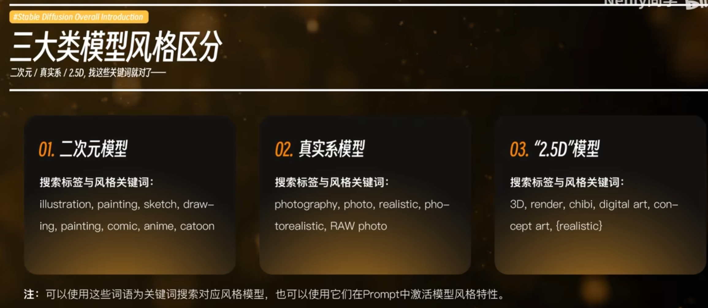
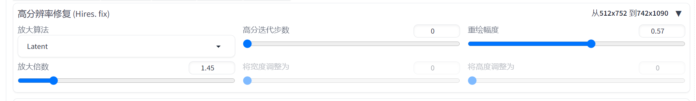
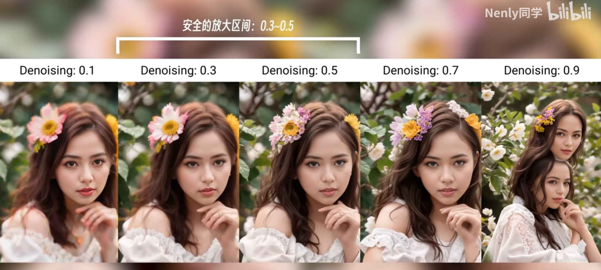
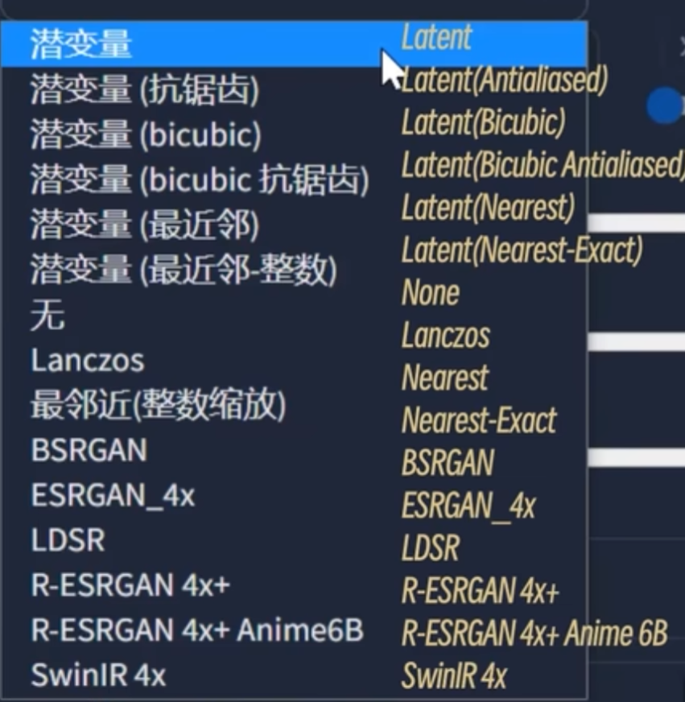
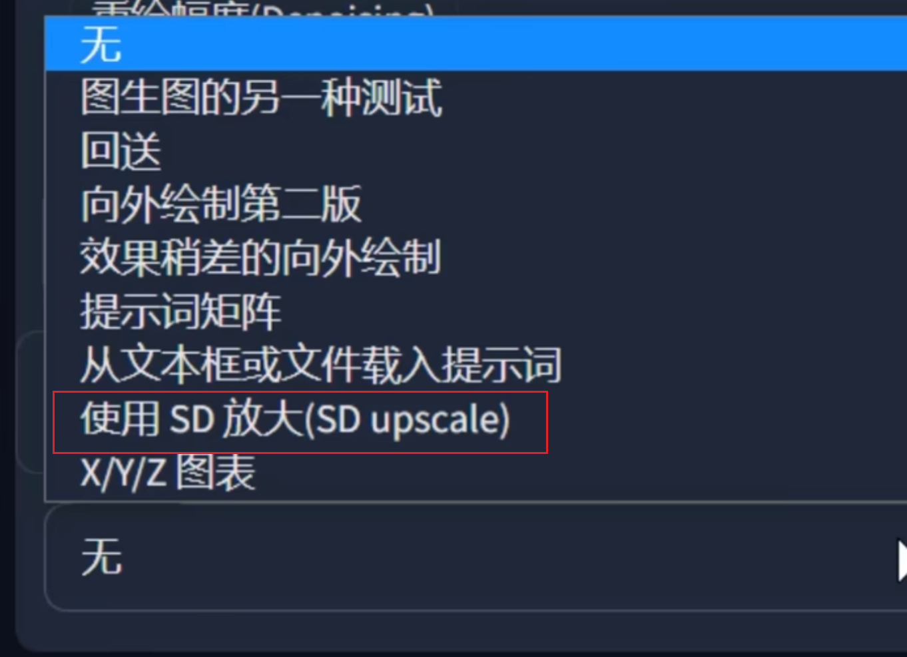
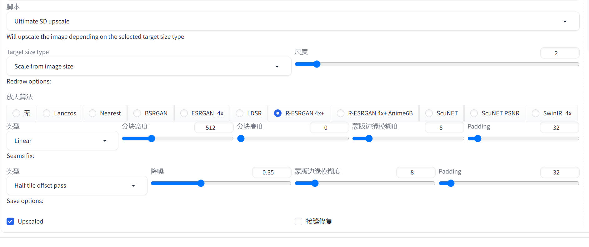
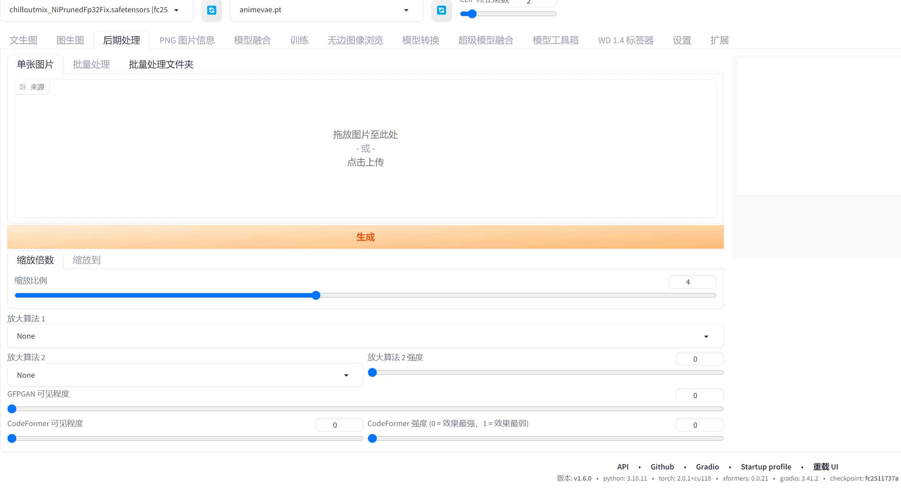

##  1.基础入门

####  下载及使用

使用了 **秋葉aaaki** 大佬的整合包

> https://space.bilibili.com/12566101?spm_id_from=333.999.0.0

###  基本提示词

正向

```tex
(masterpiece:1,2), best quality, masterpiece, highres, original, extremely detailed wallpaper, perfect lighting,(extremely detailed CG:1.2), drawing, paintbrush,
```

反向

```txt
NSFW, (worst quality:2), (low quality:2), (normal quality:2), lowres, normal quality, ((monochrome)), ((grayscale)), skin spots, acnes, skin blemishes, age spot, (ugly:1.331), (duplicate:1.331), (morbid:1.21), (mutilated:1.21), (tranny:1.331), mutated hands, (poorly drawn hands:1.5), blurry, (bad anatomy:1.21), (bad proportions:1.331), extra limbs, (disfigured:1.331), (missing arms:1.331), (extra legs:1.331), (fused fingers:1.61051), (too many fingers:1.61051), (unclear eyes:1.331), lowers, bad hands, missing fingers, extra digit,bad hands, missing fingers, (((extra arms and legs))),
```

###  模型分类




###  高清修复优化细节无损放大教程

####  hires.fix放大




hires.fix的安全放大空间在0.3-0.5之间



小于0.3会导致图片不清晰，大于0.5重绘幅度就会变大导致与原图不符


各种放大算法的区别



各个算法表现差不到，一般可以看看模型作者推荐的模型，大部分无脑**latent**，也可以试着使用倒数第二第三两个算法试试

####  在图生图放大及sd upscale脚本

在图生图里 找到最下方脚本



具体参数



padding指边缘，因为sd重绘是通过把一副画面分成多个小块依次放大后重新拼接在一起。padding参数可以使评价的更加自然

####  在附加功能中放大



直接调节参数放大即可


