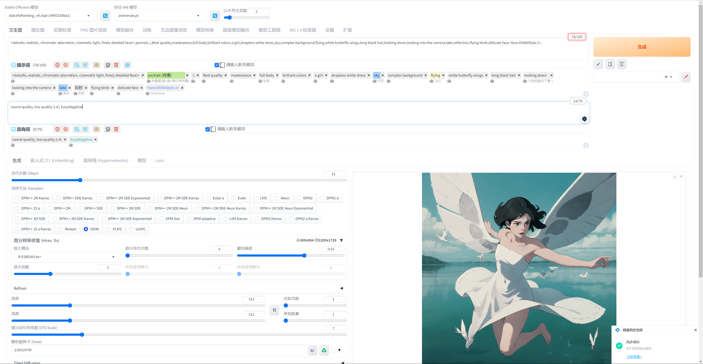
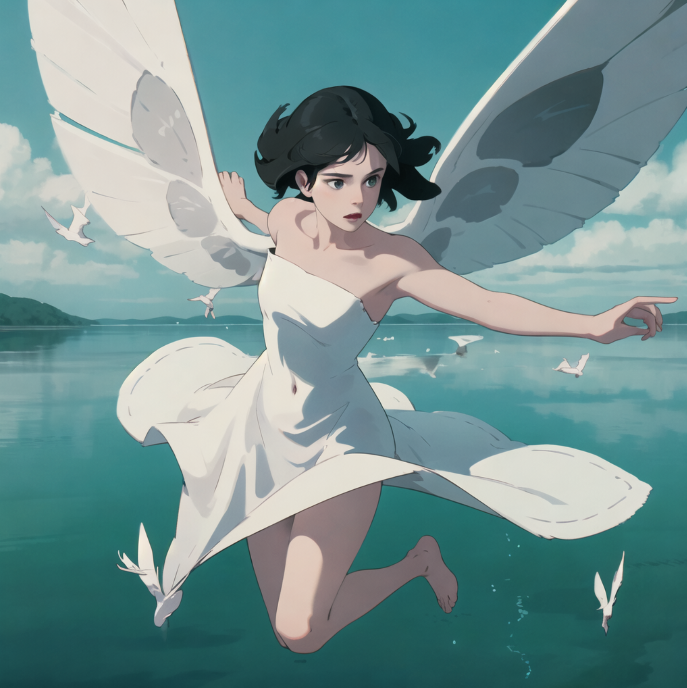
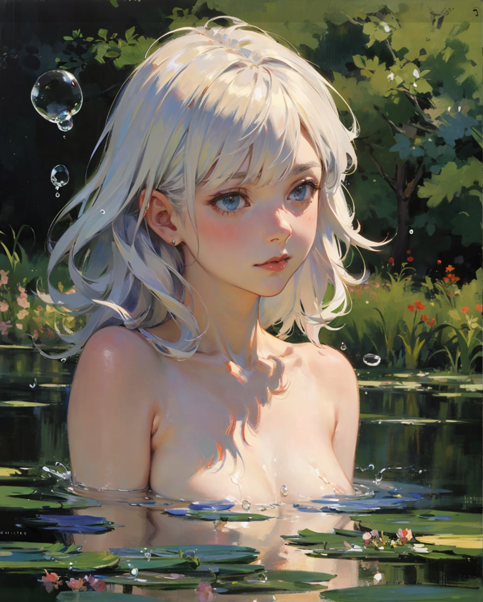
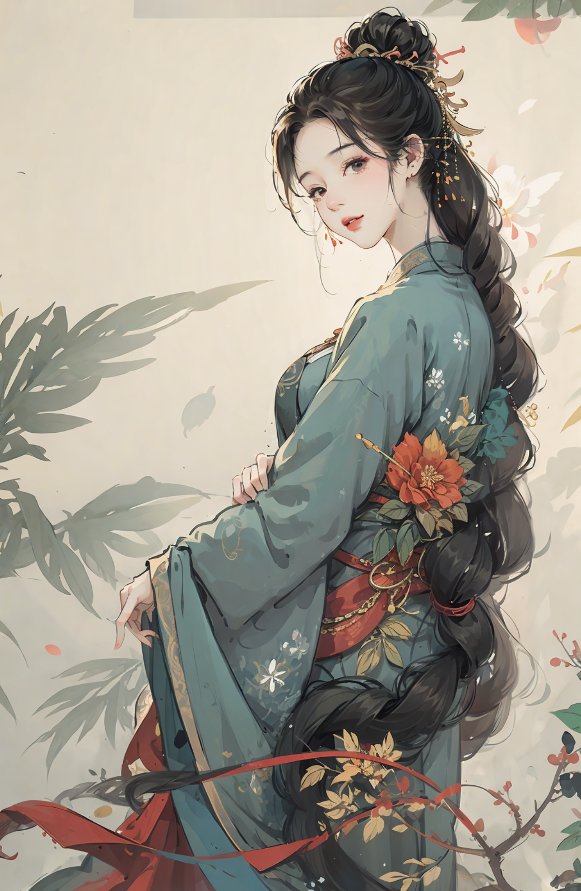

###  1.吉卜力风格

主要涉及的有

```
model:
dalcefoPainting_v4.ckpt [d49033dba1]


lora:
GhibliStyle
```

文生图界面



案例参数

```
<dalcefo, realistic, chromatic aberration, cinematic light, finely detailed face)>,portrait,:),Best quality,masterpiece,full body,brilliant colors,a girl,strapless white dress,sky,complex background,flying,white butterfly wings,long black hair,looking down,looking into the camera,lake,reflection,flying birds,delicate face,<lora:GhibliStyle:1>,
Negative prompt: (worst quality, low quality:1.4), EasyNegative
Steps: 31, Sampler: DDIM, CFG scale: 7, Seed: 135614709, Size: 512x512, Model hash: d49033dba1, Model: dalcefoPainting_v4, VAE hash: 735e4c3a44, VAE: animevae.pt, Denoising strength: 0.74, Clip skip: 2, Hires upscale: 2, Hires upscaler: R-ESRGAN 4x+, Lora hashes: "GhibliStyle: 708c39069ba6", Version: v1.6.0
```



###  2.exquisiteDetails_art

色彩运用非常惊艳

模型

```
exquisiteDetails_art
```

案例

```tex
1girl,monet color,naked,stream,close shot,medium chest,close shot,adult girl,anime characters,white hair,the whole body,oil painting,post-impressionist,(face upward:0.7),Post Impressionist,Droplets,well,soft lighting,COOL,nsfw,
Negative prompt: EasyNegative,(worst quality, low quality:1.4),lowres,skin blemishes,extra fingers,fewer fingers,strange fingers,Hand grip,(lean),Strange eyes,(three arms),(Many arms),(watermarking),badhandv4,deformity,Monster's Fingers,ankylodactylia,Twisted Fingers,Fingers with excessive joints,Extra Long Fingers,Multiple nipples,Excessive areola,skirt,meteor,strange lines,skinny,starving,
Steps: 32, Sampler: DPM++ 2M Karras, CFG scale: 7, Seed: 113144651, Size: 520x624, Model hash: 1c4734cc28, Model: exquisiteDetails_art, VAE hash: 735e4c3a44, VAE: vae-ft-mse-840000-ema-pruned.safetensors, Denoising strength: 0.43, Clip skip: 2, Hires upscale: 2, Hires upscaler: R-ESRGAN 4x+ Anime6B, TI hashes: "EasyNegative: c74b4e810b03", Version: v1.6.0

```



###  3.墨心中国风

####  style 1

主要model和lora

```
model:
dalcefoPainting_v4.ckpt [d49033dba1]

lora:
墨心MoXin
anxiang
shukezouma_v1_1
```


prompt:

```
<lora:墨心MoXin1.0:0.3>,<lora:anxiang:0.6>,<lora:shukezouma_v1_1:0.2>,shukezouma,

(masterpiece, best quality:1.2, high quality, highres, ultra-detailed),negative space,

shuimobysim,portrait of a woman standing,willow branches,traditional chinese ink painting,modelshoot style,peaceful,(smile),looking at viewer,wearing long hanfu,hanfu,song,willow tree in background,wuchangshuo,
Negative prompt: (EasyNegative:1.2),(FastNegativeV2:1.2),fat,naked,nude,paintings,sketches,(worst quality:2),(low quality:2),(normal quality:2),lowres,((monochrome)),((grayscale)),bad anatomy,DeepNegative,lowres,bad anatomy,bad hands,text,error,missing fingers,extra digit,fewer digits,cropped,worst quality,low quality,normal quality,jpeg artifacts,signature,watermark,username,blurry,bad feet,cropped,poorly drawn hands,poorly drawn face,mutation,deformed,extra fingers,extra limbs,extra arms,extra legs,malformed limbs,fused fingers,(too many fingers:2),long neck,cross-eyed,(mutated hands:1.8),polar lowres,bad body,bad proportions,gross proportions,text,error,(missing fingers:1.9),missing arms,missing legs,(worst quality, low quality, normal quality),
Steps: 31, Sampler: DDIM, CFG scale: 7, Seed: 3716653219, Size: 520x800, Model hash: d49033dba1, Model: dalcefoPainting_v4, VAE hash: 735e4c3a44, VAE: vae-ft-mse-840000-ema-pruned.safetensors, Denoising strength: 0.27, Clip skip: 2, Hires upscale: 2, Hires upscaler: R-ESRGAN 4x+ Anime6B, Lora hashes: "墨心MoXin1.0: 17cd20c7b6ea, anxiang: 3e95e5f6afaa, shukezouma_v1_1: 494301de3d6e", Version: v1.6.0
```




