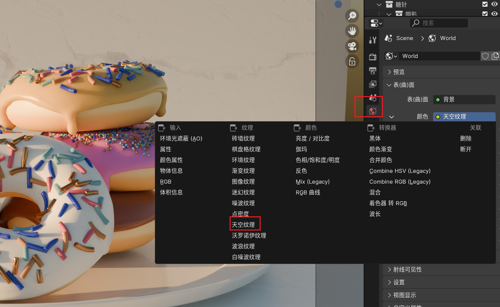

# 01.修改器

## 01.表面细分修改器

可以快速修改表面的面数

##  2.实体化修改器

 

这个修改器可以快速添加物体厚度

 

折痕可以锐化倒角

使用前

使用后

##  3.缩裹修改器

将点投射到另一个物体上

应用前

应用后

##  4.简易形变修改器

 

#  02.快捷键

##  1.tab

选中物体按tab可以快速进入编辑模式

tab前

tab后

##  2.使用/

/可以单独显示选中对象

# 03.衰减编辑

可以快速选择一个区域进行编辑。选择一个点后按g就可以进行编辑了

#  04.选择

##  1.边选择

 

按住alt然后点击边就可以选择这边上所以点。

#  05.修改图形快捷键

## 1.G

移动物体

##  2.S

缩放

##  3.f

修改绘制笔刷的范围

##  3.E挤出

多出一个面

##  4.ctrl + b倒角

 

##  5.ctrl + r环切

 

##  6.r旋转

选择物体按r可以旋转物体的方向

进入旋转模式后，双击zyx时，可以让物体按照自身的对应轴旋转。

##  7.f创建面

##  8.i内插面

#  06.功能

##  01.透视模式

alt + Z可以快速进入透视模式

 

透视模式选择点会快速很多

## 02.吸附

可以将点进行就近合并防止穿模。

选择正确的吸附方式可以快速调整图形

 

吸附模式可以确保移动的点是在下面的基础图形上移动的

##   03.隐藏

H可以将选择的对象隐藏（点、线、面和物体都可以）

alt + h可以撤销隐藏

## 04.遮罩

chrl+i可以反选遮罩区域

## 05.应用缩放

快捷键ctrl+a

当我们使用s进行物体缩放时，物体的实际尺寸并未变化。我们需要将这个变化应用到物体上

##  06.将原点设置为物体的几何中心

现在物体的原点是不在物体几何中心的，对物体操作会不符合我们的要求。可以手动修改物体的原点。

##  07.M添加到合集

选择物体，然后按m就可以将选择物体移动到指定合集

##  08.分类合集

 

##  09.关联操作/传递数据

ctrl+l快捷键

 

###  给物体关联材质

先选择需要关联的物体，然后在材质中选择需要关联的材质。然后ctrl+l选择关联材质即可

##  10.SHIFT + ~可以进入漫游模式

##  11.shift然后鼠标右键可以把游标移动到鼠标位置

##  12.shift+p快捷键

将前一个选中的物体作为后一个选中物体的子集

#  07.添加材质

##  导入材质

 

 

添加一个贴图材质

先添加基础色，这是贴图的样式，再添加糙度

# 08.绘制纹理

新建材质

选择后进行绘制

#  09. 几何结点

类似一个修改器

 

##  分布与点上

使用泊松分布可以去重

效果

 

##  将几何节点的值暴露到修改器

 

对原物体复制后，使用修改器改变密度值·的时候两个物体就会相互独立

##  累加旋转

对物体进行多个方向的旋转

##  随机值

 

分别是x、y、z的信息。tau是一个原周。tau=6.28=3.14*2

#  10.权重

 

此次的权重事实上是一个顶点组。可以通过绘制权重后添加到糖霜的密度系数上通过刷权重来指定糖霜出现的位置。

##  最终效果

 

###  教程实例

### 我的

#  11.渲染

##  物体信息节点

##  颜色渐变

线性-给定一个范围，颜色在这个范围中变化

常值，我们给的几个常量，颜色在我们给的数组中变化，其中可以调整颜色的占比来确定颜色的比例。

##  颜色设置

适当降低饱和度，这个参数可以让颜色显示变得自然一点。

###  金属度

渐变可以通过根据上面颜色的分布，来调整金属度的分布。金属度只有0与1

 

 

###  次表面反射

次表面的一个示例

设置

权重-0或1.物体分带次表面与不带次表面

次表面半径：xyz或rgb

次表面缩放：渲染深度

#  12.打光

##  添加天空环境

##  捕捉模式

g移动物体时，按b进入物体捕捉模式

##   添加反光板

编辑模式下可以单独指定某一个面的材质

可以给物体添加阴影

应用前

应用后

#  13.合成

 

shift+ctrl点击渲染层会出现背景图

按v可以调整渲染图的大小，alt+v放大

##  色彩管理

胶片效果可以快速为图片添加滤镜

##  最终效果

#  14.关键帧动画

##  创建关键帧

4.0以下版本使用i，以上使用k

##  旋转镜头

添加一个空物体，然后将摄像机作为子集添加到空物体中，摄像机就可与随着空物体的运动而移动。

给空物体第一帧与最后一帧添加关键帧

修改播放速率

缩放曲线

修改帧率为30fps

##  动画渲染设置

##  渲染前需要检查的项

###  1.物体面朝向是否有问题

出现红色就表示面需要处理

处理的方法

编辑模式下选中错误的面，a全选错误的部分

shift+n重新计算法线

ctrl + shift+n快捷键也可以实现上述方法

处理完后关闭该选项

###  2.检查是否有不该显示的物体被渲染

糖针的原始图像不应该出现在渲染中，所以需要关闭

###  3.检查被渲染物体是否有明显穿插或不合理的地方

###  4.检查光线是否正确

在色彩管理中选择false color可以检查哪些部分是高曝光的，来确定是否符合自己的预期。

其中白色说明过曝了，可以调整曝光度来调整。

###  5.设置景深

###  6.开启运动模糊

 

###  7。最后一步

渲染动画前先渲染第一张、中间帧与最后一帧检查一下，是否还存在问题。没有的话就可以开始渲染了。
