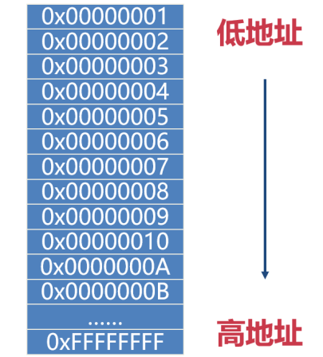

##  01.指针的基本概念

###  1）变量的地址

变量是内存变量的简称，在C++中，每定义一个变量，系统就会给变量分配一块内存，内存是有地址的。



C++用运算符&获取变量在内存中的起始地址。

语法：&变量名

###  2）指针变量

指针变量简称指针，它是一种特殊的变量，专用于存放变量在内存中的**起始地址**。

`语法：数据类型 \*变量名;`

数据类型必须是合法的C++数据类型（int、char、double或其它自定义的数据类型）。

星号\*与乘法中使用的星号是相同的，但是，在这个场景中，星号用于表示这个变量是指针。

###  3）对指针赋值

不管是整型、浮点型、字符型，还是其它的数据类型的变量，它的地址都是一个十六进制数。我们用整型指针存放整数型变量的地址；用字符型指针存放字符型变量的地址；用浮点型指针存放浮点型变量的地址，用自定义数据类型指针存放自定义数据类型变量的地址。

语法：指针=&变量名;

注意

- 对指针的赋值操作也通俗的被称为“指向某变量”，被指向的变量的数据类型称为“基类型”。
- 如果指针的数据类型与基类型不符，编译会出现警告。但是，可以强制转换它们的类型。

### **4）指针占用的内存**

指针也是变量，是变量就要占用内存空间。

在64位的操作系统中，不管是什么类型的指针，占用的内存都是8字节。

在C++中，指针是复合数据类型，复合数据类型是指基于其它类型而定义的数据类型，在程序中，int是整型类型，int\*是整型指针类型，int\*可以用于声明变量，可以用于sizeof运算符，可以用于数据类型的强制转换，总的来说，把int\*当成一种数据类型就是了。

```c
int main() {
    int a = 9;
    bool b = true;
    char c  = 'c';
    string s = "dd";

    int *pa = &a;
    bool *pb = &b;
    char *pc = &c;
    string *ps = &s;

    cout << "a address is:" << ((long long )(&a)) << endl;
    cout << "b address is:" << ((long long )(&b)) << endl;
    cout << "c address is:" << ((long long )(&c)) << endl;
    cout << "s address is:" << ((long long )(&s)) << endl;

//   直接使用cout输出地址，可能会出现乱码
    cout << "pa value is:" << (long long )pa << endl;
    cout << "pb value is:" << (long long )pb << endl;
    cout << "pc value is:" << (long long )pc << endl;
    cout << "ps value is:" << (long long )ps << endl;

    cout << "*pa is:" << *pa << endl;
    cout << "*pb is:" << *pb << endl;
    cout << "*pc is:" << *pc << endl;
    cout << "*ps is:" << *ps << endl;

    cout << "pa sizeof is:" << sizeof ps << endl;
    cout << "pb sizeof is:" << sizeof ps << endl;

    return 0;
}
```

###  5）使用指针

声明指针变量后，在没有赋值之前，里面是乱七八糟的值，这时候不能使用指针。

指针存放变量的地址，因此，指针名表示的是地址（就像变量名可以表示变量的值一样）

\*运算符被称为**间接值**或**解除引用（解引用）**运算符，将它用于指针，可以得到该地址的内存中存储的值，\*也是乘法符号，C++根据上下文来确定所指的是乘法还是解引用。

**变量和指向变量的指针就像同一枚硬币的两面。**

哪个银行？   什么东西？  数额

程序在存储数据的时候，必须跟踪三种基本属性：

- 数据存储在哪里；
- 数据是什么类型；
- 数据的值是多少。

用两种策略可以达到以上目的：

声明一个普通变量，声明时指出数据类型和变量名（符号名），系统在内部跟踪该内存单元。

声明一个指针变量，存储的值是地址，而不是值本身，程序直接访问该内存单元。

##  02.指针用于函数的参数

如果把函数的形参声明为指针，调用的时候把实参的地址传进去，形参中存放的是实参的地址，在函数中通过解引用的方法直接操作内存中的数据，可以修改实数的值，这种方法被通俗的称为**地址传递**或**传地址**。

**值传递**：函数的形参是普通变量。

传地址的意义如下：

- 可以在函数中修改实参的值。
- 减少内存拷贝，提升性能。

```c
void fun(int *n, string *s) {
    cout << "number is :" << *n << ", String is " << *s << endl;
    cout << "n address is :" << (void *)n << ", s address is " << (void *)s << endl;
    *n = 99;
    *s = "ddd";
    cout << "number is :" << *n << ", String is " << *s << endl;
    cout << "n address is :" << (void *)n << ", s address is " << (void *)s << endl;

}

int main() {
    int a = 5;
    string s = "fff";
    fun(&a,&s);
    return 0;
}
```


##  03.用const修饰指针

### **1）常量指针**

语法：const 数据类型 \*变量名;

不能通过解引用的方法修改内存地址中的值（用原始的变量名是可以修改的）。

注意：

- 指向的变量（对象）可以改变（之前是指向变量a的，后来可以改为指向变量b）。
- 一般用于修饰函数的形参，表示不希望在函数里修改内存地址中的值。
- 如果用于形参，虽然指向的对象可以改变，但这么做没有任何意义。
- 如果形参的值不需要改变，建议加上const修饰，程序可读性更好。

### **2）指针常量**

语法：数据类型 \* const 变量名;

指向的变量（对象）不可改变。

注意：

- 在定义的同时必须初始化，否则没有意义。
- 可以通过解引用的方法修改内存地址中的值。
- C++编译器把指针常量做了一些特别的处理，改头换面之后，有一个新的名字，叫引用。

### **3）常指针常量**

语法：const 数据类型 \* const 变量名;

指向的变量（对象）不可改变，不能通过解引用的方法修改内存地址中的值。

常引用。

常量指针：指针指向可以改，指针指向的值不可以更改。

指针常量：指针指向不可以改，指针指向的值可以更改。

常指针常量：指针指向不可以改，指针指向的值不可以更改。

**记忆秘诀：\*表示指针，指针在前先读指针；指针在前指针就不允许改变。**

常量指针：const 数据类型 \*变量名

指针常量：数据类型 \* const 变量名

```c
int main() {
    int a = 5;
    int b = 9;
    string s = "fff";
    const int *pa = &a;
    int* const pb = &a;
    const int * const pc = &a;

    pa = &b;
    *pa = b;

    pb = &b;
    *pb = b;

    pc = &b;
    *pc = b;

    return 0;
}
```

编译后：

```
D:/code/c++/c++Study/main.cpp: In function 'int main()':
D:/code/c++/c++Study/main.cpp:26:9: error: assignment of read-only location '* pa'
   26 |     *pa = b;
      |     ~~~~^~~
D:/code/c++/c++Study/main.cpp:28:8: error: assignment of read-only variable 'pb'
   28 |     pb = &b;
      |     ~~~^~~~
D:/code/c++/c++Study/main.cpp:31:8: error: assignment of read-only variable 'pc'
   31 |     pc = &b;
      |     ~~~^~~~
D:/code/c++/c++Study/main.cpp:32:9: error: assignment of read-only location '*(const int*)pc'
   32 |     *pc = b;
      |     ~~~~^~~
ninja: build stopped: subcommand failed.
```

##  04.void关键字

在C++中，void表示为**无类型**，主要有三个用途：

1）函数的返回值用void，表示函数没有返回值。

```c
void func(int a,int b){
	// 函数体代码。
	return;
}
```


2）函数的参数填void，表示函数不需要参数（或者让参数列表空着）。

```c
int func(void){
	// 函数体代码。
	return 0;
}
```


**3）的形参用void \*，表示接受任意数据类型的指针**。

注意：

- 不能用void声明变量，它不能代表一个真实的变量，但是，用void \*可以。
- 不能对void \*指针直接解引用（需要转换成其它类型的指针）。
- 把其它类型的指针赋值给void\*指针不需要转换。
- 把void \*指针赋值给把其它类型的指针需要转换。

```c
void func(string varname, void* p){
    cout << varname<< "的地址是：" << p << endl;
    cout << varname << "的值是：" << *(char *)p << endl;
}

int main(){
    int a=89;
    char b='X';
    
    cout << "a的地址是：" <<  & a << endl;
    cout << "b的地址是：" <<  & b << endl;
    
    func("a", &a);
    func("b", & b);
}
```
