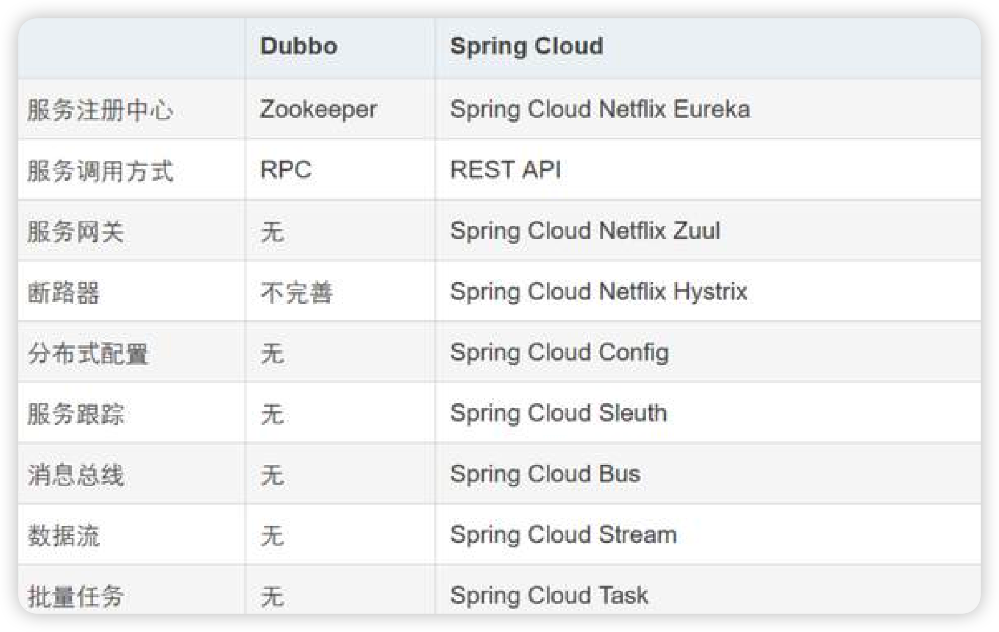

# dubbo入门


## 1.快速开始

[Spring Boot 快速开发 Dubbo 服务](https://cn.dubbo.apache.org/zh-cn/docs/quick-start/)

## 2.dubbo简介

dubbox 基于 dubbo 上做了一些扩展，如加了服务可 restful 调用，更新了开源组件等。

### 1.Dubbo 和 Spring Cloud 的关系？

#### 二者的关系

Dubbo 是 SOA 时代的产物，它的关注点主要在于服务的调用，流量分发、流量监控和熔断。而 Spring Cloud 诞生于微服务架构时代，考虑的是微服务治理的方方面面，另外由于依托了 Spirng、Spirng Boot 的优势之上，两个框架在开始目标就不一致，Dubbo定位服务治理、Spirng Cloud 是一个生态。

#### dubbo与Spring cloud的区别



- 底层协议：Dubbo 底层是使用 Netty 这样的 NIO 框架，是基于TCP 协议传输的，配合以 Hession 序列化完成 RPC 通信。而 SpringCloud 是基于 Http 协议+Rest 接口调用远程过程的通信，相对来说，Http 请求会有更大的报文，占的带宽也会更多。但是REST 相比 RPC 更为灵活，服务提供方和调用方的依赖只依靠一纸契约，不存在代码级别的强依赖。
- 注册中心：springcloud推荐eurka，而dubbo一般使用zookeeper
- 模型定义：springcloud将一个应用定义为一个服务，而dubbo将一个接口定义为一个服务（dubbo3.0都也将一个应用定义为一个服务，和springcloud其目的是为了降低）

## 2.dubbo3新特性

[What’s New in Dubbo3](https://cn.dubbo.apache.org/zh-cn/docs/new-in-dubbo3/)

###  注册模型的改变 

在服务注册领域，市⾯上有两种模型，⼀种是应⽤级注册，⼀种是接⼝级注册，在Spring Cloud中，⼀ 个应⽤是⼀个微服务，⽽在Dubbo2.7中，⼀个接⼝是⼀个微服务。 <br />所以，Spring Cloud在进⾏服务注册时，是把应⽤名以及应⽤所在服务器的IP地址和应⽤所绑定的端⼝注册到注册中⼼，相当于key是应⽤名，value是ip+port，⽽在Dubbo2.7中，是把接⼝名以及对应应⽤的IP地址和所绑定的端⼝注册到注册中⼼，相当于key是接⼝名，value是ip+port。<br /> 	所以在Dubbo2.7中，⼀个应⽤如果提供了10个Dubbo服务，那么注册中⼼中就会存储10对keyvalue，⽽ Spring Cloud就只会存⼀对keyvalue，所以以Spring Cloud为⾸的应⽤级注册是更加适合的。 所以Dubbo3.0中将注册模型也改为了应⽤级注册，提升效率节省资源的同时，通过统⼀注册模型，也为各个微服务框架的互通打下了基础。 

> 对比 2.x 版本，Dubbo3 版本
>
> - 服务发现资源利用率显著提升。
>   - 对比接口级服务发现，单机常驻内存下降 50%，地址变更期 GC 消耗下降一个数量级 (百次 -> 十次)
>   - 对比应用级服务发现，单机常驻内存下降 75%，GC 次数趋零
> - Dubbo 协议性能持平，Triple 协议在网关、Stream吞吐量方面更具优势。
>   - Dubbo协议 （3.0 vs 2.x），3.0 实现较 2.x 总体 qps rt 持平，略有提升
>   - Triple协议 vs Dubbo协议，直连调用场景 Triple 性能并无优势，其优势在网关、Stream调用场景。


### 新⼀代RPC协议

 	定义了全新的 RPC 通信协议 – Triple，⼀句话概括 Triple：它是基于 HTTP/2 上构建的 RPC 协 议，完全兼容 gRPC，并在此基础上扩展出了更丰富的语义。 使⽤ Triple 协议，⽤户将获得以下 能⼒

-  更容易到适配⽹关、Mesh架构，Triple 协议让 Dubbo 更⽅便的与各种⽹关、Sidecar 组件配 合⼯作。
-  多语⾔友好，推荐配合 Protobuf 使⽤ Triple 协议，使⽤ IDL 定义服务，使⽤ Protobuf 编码业 务数据。
-  流式通信⽀持。Triple 协议⽀持 Request Stream、Response Stream、Bi-direction Stream

当使⽤Triple协议进⾏RPC调⽤时，⽀持多种⽅式来调⽤服务，只不过在服务接⼝中要定义不同的⽅法， ⽐如：

#### UNARY、SERVER_STREAM与 CLIENT_STREAM

- UNARY:和2.7之前一样直接调用
- SERVER_STREAM：服务端使用StreamObserver将消息发送到客户端
- CLIENT_STREAM：服务端使用StreamObserver将消息发送到客户端后客户端可以通过 StreamObserver实现于服务端的消息交互

服务端实现

```java
@DubboService(version = "2.0")
    public class UserServiceImpl2 implements UserService {
        @Override
        public String getUser() {
            return "wf-v2";
        }

        // SERVER_STREAM
        @Override
        public void sayHelloServerStream(String name, StreamObserver<String> response) {
            response.onNext("server : " + name);
            response.onCompleted();
        }

        // CLIENT_STREAM
        @Override
        public StreamObserver<String> sayHelloStream(StreamObserver<String> response) {
            return new StreamObserver<String>() {
                @Override
                public void onNext(String data) {
                    response.onNext("data:" + data);
                }

                @Override
                public void onError(Throwable throwable) {

                }

                @Override
                public void onCompleted() {
                    System.out.println("completed");
                }
            };
        }
    }
```

客户端调用：

```java
@Service
    public class OrderService {

        @DubboReference(version = "2.0")
        private UserService userService;

        public String getOrder() {
            //        return restTemplate.getForObject("http://localhost:8080/user",String.class);

            String user = userService.getUser();

            // SERVER_STREAM
            userService.sayHelloServerStream("wf", new StreamObserver<String>() {
                @Override
                public void onNext(String data) {
                    System.out.println(data);
                }

                @Override
                public void onError(Throwable throwable) {

                }

                @Override
                public void onCompleted() {
                    System.out.println("completed");
                }
            });

            // CLIENT_STREAM
            StreamObserver<String> clientCompleted = userService.sayHelloStream(new StreamObserver<String>() {
                @Override
                public void onNext(String data) {
                    System.out.println("client get :" + data);
                }

                @Override
                public void onError(Throwable throwable) {

                }

                @Override
                public void onCompleted() {
                    System.out.println("client completed");
                }
            });
            clientCompleted.onNext("send to user");
            return user;
        }
    }
```

