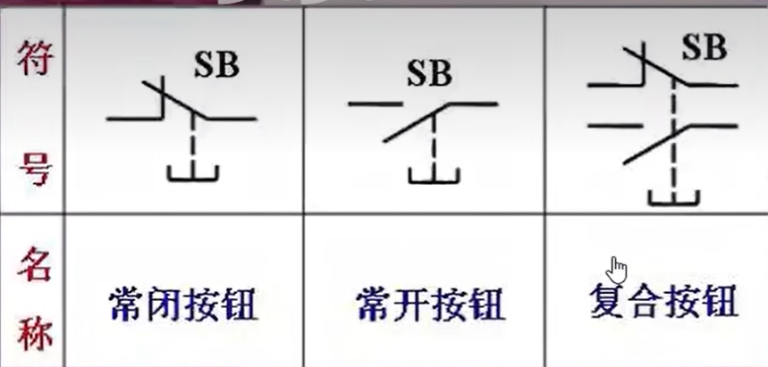
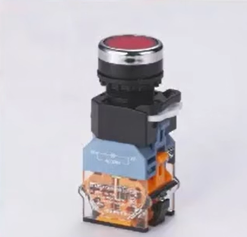
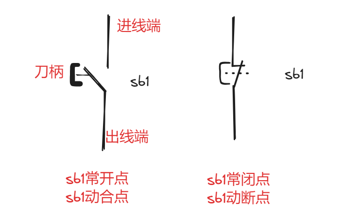
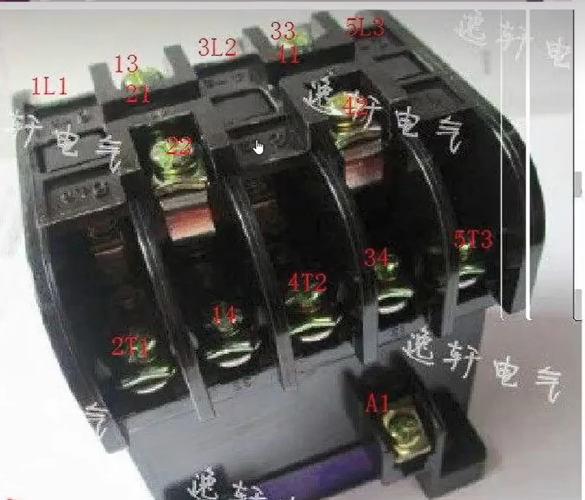
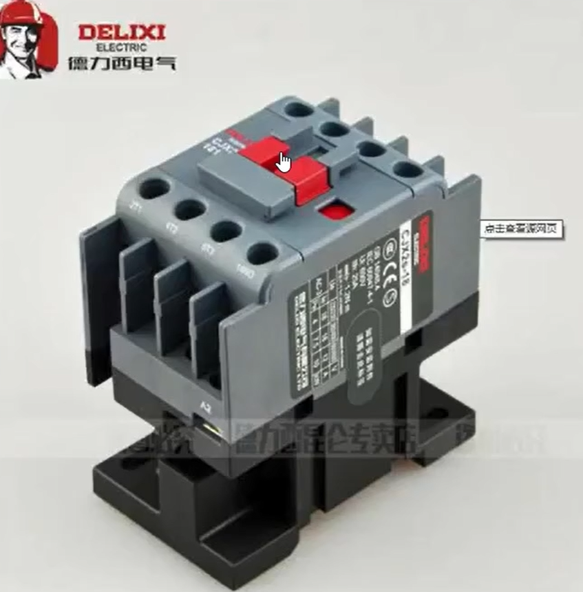
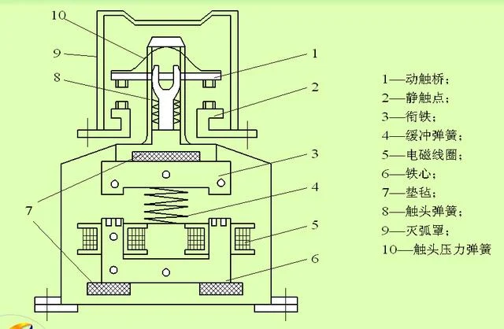
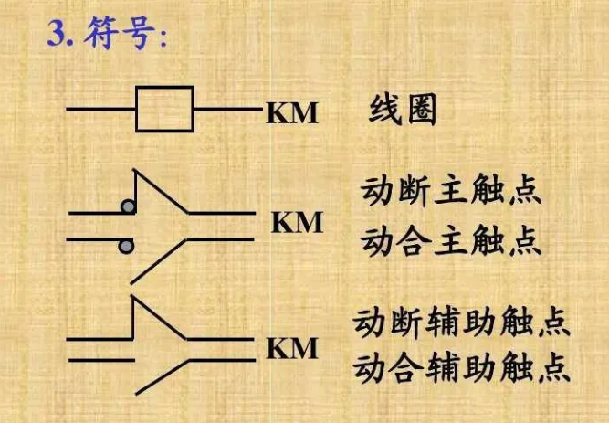
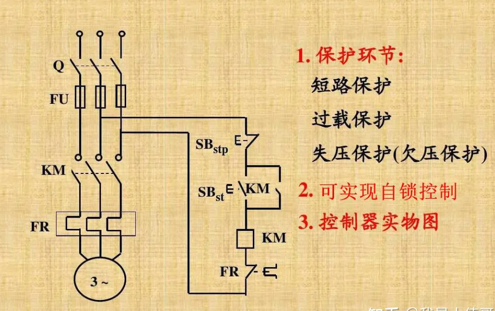

#  电力拖动

> [电工基础参考资料](https://zhuanlan.zhihu.com/p/619551512)

用电力完成生产的过程叫电力拖动。

常见的元件：接触器、继电器、按钮，电动机，延时继电器等。

##  复合开关

元器件图

 

实物图

笔记

 

复合开关**常闭先断开，常开先闭合**

##  交流接触器

老式交流接触器

 

新式接触器

交流接触器内部结构

 

###  原理

交流接触器是电能——》磁能——》机械能。

电路图中的符号：

示例

 

自锁启动电机线路图
