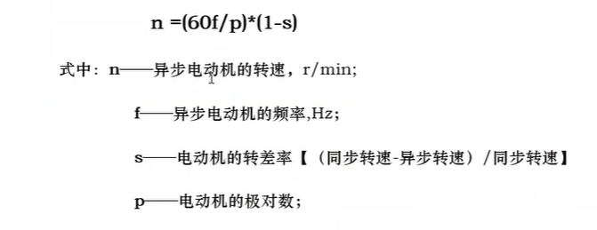
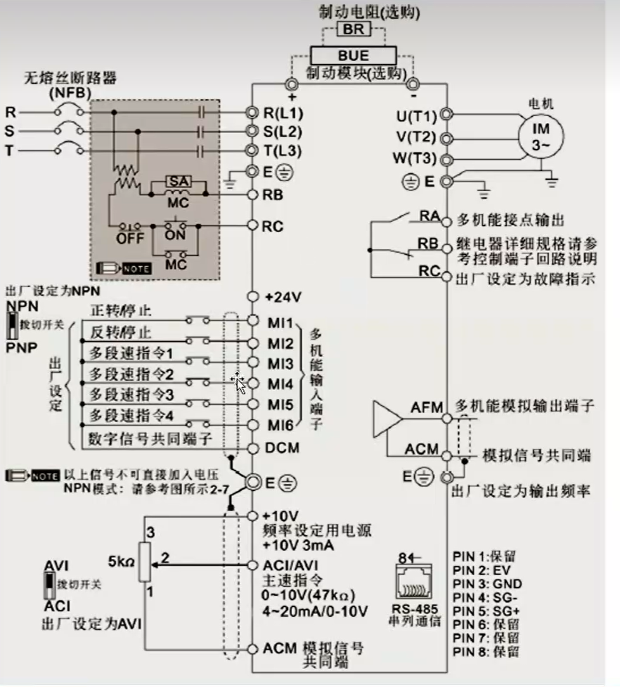

#  变频器

####  特点

对电动机的启动与停止的柔性控制、调速、转矩控制、过载保护、参数检测、控制设备精度等。这些特
点在工业控制中都起到了非常重要的作用。如今，在工业设备控制的各行各业都能够看到变频器的应用。

###  变频器的调速原理

 

电机的旋转速度取决于电机的极数和频率。电机的极对数一般是固定不变的，所以不适合改变极对数来调节电机的速度。另外，频率是电机供电电源的电信号，所以该值能够在电机的外面调节后再供给电机，这样电机的旋转速度就可以被自由的控制。因此，以控制频率为目的的变频器，是做为电机调速设备的优选设备。

改变频率和电压是最优的电机控制方法。如果仅改变频率，电机将被烧坏。特别是当频率降低时，该问题就非常突出。为了防止电机烧毁事故的发生，变频器在改变频率的同时必须要同时改变电压，例如：为了使电机的旋转速度减半，变频器的输出频率必须从60Hz改变到30Hz,这时变频器的输出电压就必须从200V改变到约100V。

###  台达VDF变频器

 

#  触摸屏

#  编码器

