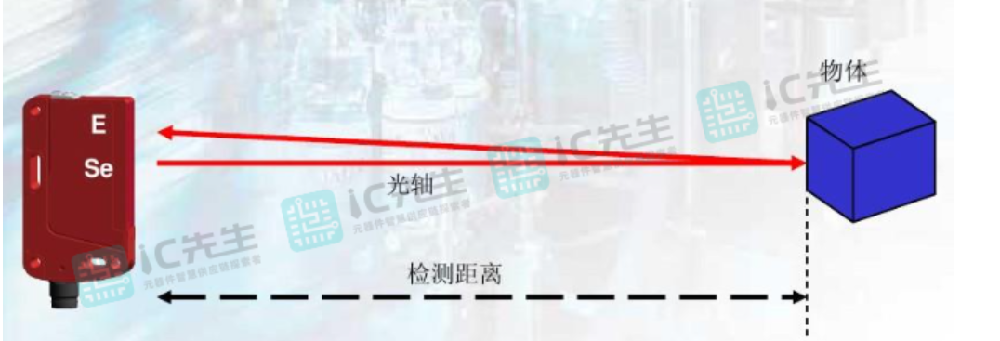
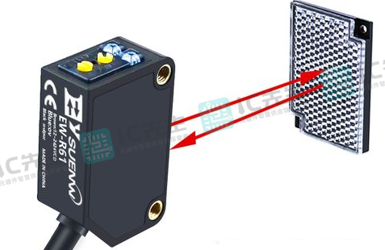
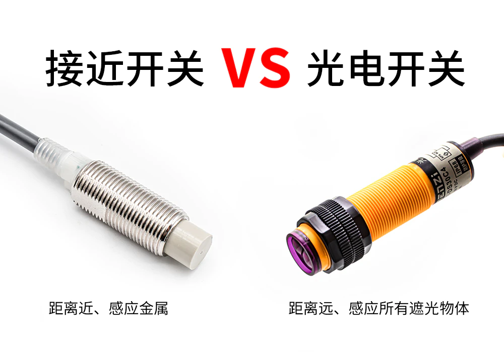

#  传感器

把被测量的物理量转换为电信号的工具叫传感器。

常用传感器

- 位置
- 温度
- 湿度
- 速度
- 压力
- 等。。。

##  位置传感器

机械限位

漫反射传感器：

## 漫反射传感器

### 原理

漫反射是指投射在不规则的、凹凸不平表面上的平行光向各个方向反射的现象。当平行光线入射到粗糙的表面时，光线会向着四面八方无规侧反射。人眼之所以能看清物体的全貌，主要也是靠漫反射光在眼内的成像

**漫反射光电传感器就是利用了漫反射的原理，作为集发射器和接收器于一体的传感器，漫反射光电传感器发射出的光线会被物体反射到接收器，这样传感器就产生了开关信号。**当被检测物体的表面光亮或其反光率极高时，漫反射式的光电开关是首选的检测模式。它可以用于检测塑料、金属（如铁、钢、铜）、纸、玻璃、磁铁、木头、水等物体，可以在印刷、机械、轻工、包装、造纸、纺织等行业广泛应用。

因为漫反射光电传感器的发射器所发出的光线需要被检测物表面将足够的光线反射回漫反射光电传感器的接受器，所以检测距离和被检测物体的表面反射率将是决定接受器接收到光线的强度大小，粗糙的表面反射回的光线必将小于光滑表面反射回的强度，而且被检测物体的表面必须垂直于光电开关的发射光线。还需要特别注意的是，一般的照明光线对检测影响不大，但如果有强光直接照射受被检测物体时，会对检测结果造成较大影响，甚至损坏设备。

####  实物图

- 位置检测

- 颜色识别

- 高度检测

**最大的优点：安全**

缺点：易受酸蚀；一单先破裂、漏光就会误报（要通过管道保护）；贵

精度高，面粉厂

####  光电开关

 

###  传感器的接线

棕正蓝负黑星号。

有两线制、三线制和四线制。

- 三线制：多用于电压型传感器。西门子模拟量+-10V，数字量24V
- 两线制：把蓝色与黑色线合并在一起。
- 四线制：多用于电流型传感器。

四线制传感器精度比三线制高，但容易坏且价格高，两线制传感器抗干扰能力差。

