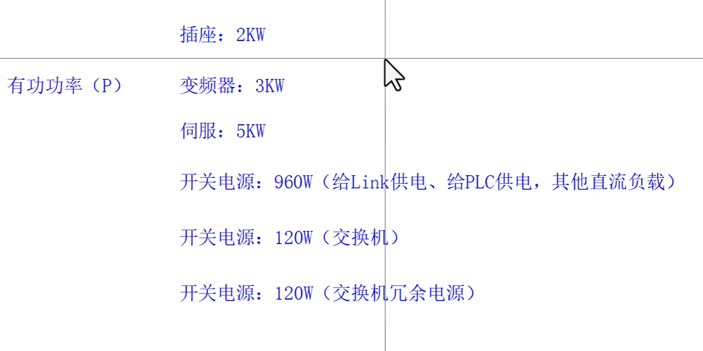
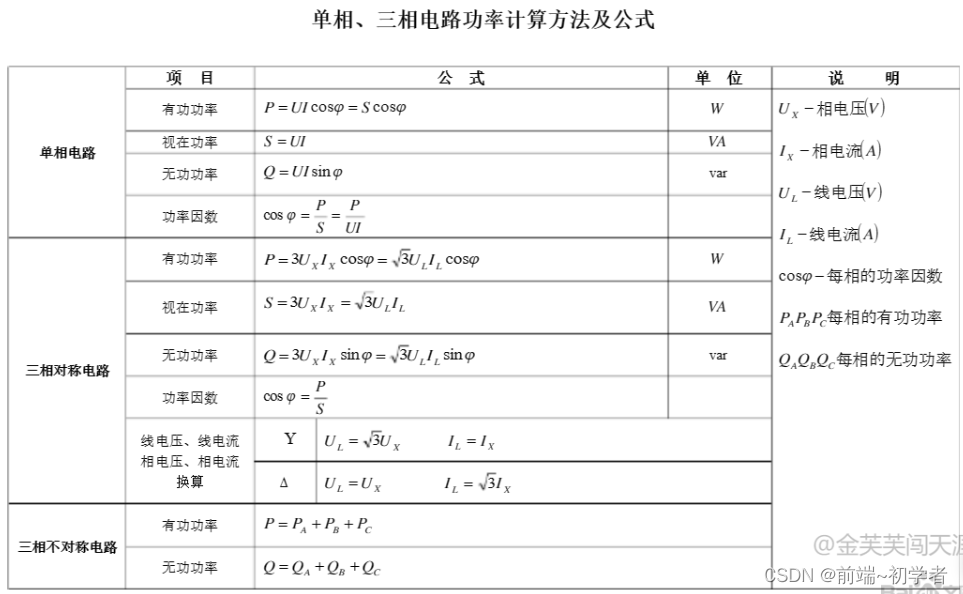
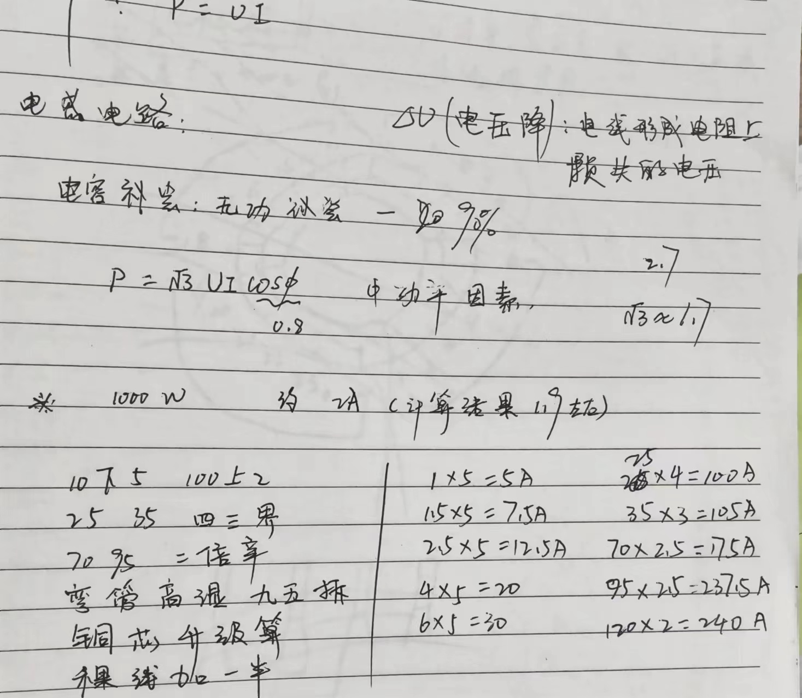
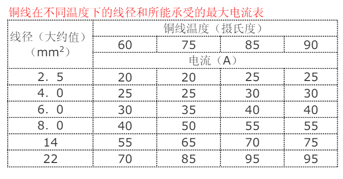
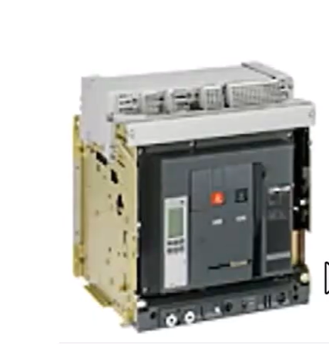
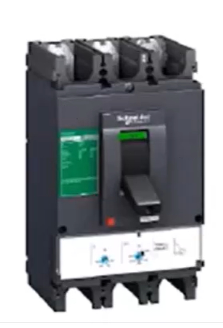

#  图纸开发计划：（单机）(产线)100讲

1、分析设备功能：梳理动作流程、设计结构拓补图、统计点位、统计网络（梳理，统计）
2、器件选型（核心器件选型：西门子PLC、西门子G系列驱动器、西门子V系列驱动器、1olik、交换机）
3、设计主回路（功率计兴电缆选型，电线选型、断路器选型）
4、设计控制回路（黑盒的设计、调用厂家宏文件）
5、生成端子报表、目录、电气Bom、电缆Bom
5、2D安装板设计
6、3D安装板设计

设计完成后再进行，标准化整理：
1、整理宏文件，黑盒，入库
2、整理端子模型，入库
3、整理高层代号和位置代号
4、整理图框、目录、封页等模型、入库

##  高层代号

1.电柜机械部分

2.电气原理图

3.报表

4.plc点表

# 参数计算

## 功率计算

功率：

- 实在功率：电流*电压
- 有功功率：电能转机械能
- 无功功率：能源交换，不耗电能

功率的计算：现有的物体功率和*1.4

比如：

​	

功率和为11.2kw*1.4 == 16kw

## 电流计算

功率因数一般取0.8

根号3约等于1.74

一般1000w＝2A电流

### 电缆选项

导线的截面积所能正常通过的电流可根据其所需要导通的电流总数进行选择，一般可按照如下口诀进行确定：“十下五，百上二，二五三五四三界，柒拾玖五两倍半，铜线升级算。”意思是 10 平方以下的铝线，毫米平方数乘以5 就可以了，要是铜线就升一个档，比如 2.5 平方的铜线，就按 4 平方计算。一百以上的都是截面积乘以 2，二十五平方以下的乘以 4，三十五平方以上的乘以3，柒拾和95 平方都乘以 2.5，口诀好记对工作很有益处。

一般铜线安全计算方法

-  2.5 平方毫米铜电源线的安全载流量--28A。 
- 4 平方毫米铜电源线的安全载流量--35A 。
-  6 平方毫米铜电源线的安全载流量--48A 。 
- 10 平方毫米铜电源线的安全载流量--65A。 
- 16 平方毫米铜电源线的安全载流量--91A 。 
- 25 平方毫米铜电源线的安全载流量--120A。

如果是铝线，线径要取铜线的 1.5-2 倍。 如果铜线电流小于 28A，按每平方毫米 10A 来取肯定安全。如果铜线电流大于 120A，按每平方毫米 5A 来取。说明：以上只能作为估算，不是很准确。

室内用线，记住电线用 6 平方毫米以下的铜线，每平方电流不超过10A就是安全的。从这个角度讲，你可以选择 1.5 平方的铜线或2.5 平方的铝线。

10 米内，导线电流密度 6A/平方毫米比较合适。10-50 米，导线电流密度3A/平方毫米。50-200 米，导线电流密度 2A/平方毫米，500 米以上要小于1A/平方毫米。从这个角度，如果不是很远的情况下，你可以选择4 平方铜线或者 6 平方铝线。如果真是距离 150 米供电，一定采用4 平方的铜线。

导线的阻抗与其长度成正比，与其线径成反比。请在使用电源时，特别注意输入与输出导线的线材与线径问题。以防止电流过大使导线过热而造成事故。

### 相关原件选项

保险丝和热继电器约1.05-1.1倍

交流接触器：4倍

空开：1.7倍

控制电路最好在变压器500m范围内，越远电压损失越大。

#  元件选型

##  断路器

工业级

ACB：400-6300A空气断路器  ICW（短时耐受）

MCCB：16-630A 塑壳断路器 无ICW，故障就会断开

家庭用电

MCB：1-125A小型断路器  无ICW，故障就会断开

####  空气断路器

####  塑壳断路器

# 电柜

GGD：低压配电柜

紧凑型：单机设备、自动化功能简单

分立式：产线、大功率设备

一体式：无尘车间、通信
