##   一、plc概述

####  plc介绍

​	PLC是可编程逻辑控制器(Programmable Logic Controller)的英文缩写，是融合了继电器控制功能和计算机运算功能而开发的，它利用一套系统程序来执行逻辑运算、顺序控制、定时、计数与算术操作等面向用户的指令，并通过数字或模拟输出控制各种类型的机械生产过程。

​	自20世纪70、80年代发展至今，PLC已经从小规模集成化电路到超大规模集成化电路，从8位CPU微处理器到32位CPU微处理器，从最初的只能实现简单的逻辑控制、运算处理发展到现在以智能化、网络化和集成化为主要特色的层面，其功能和应用领域可以说是得到了巨大的发展。

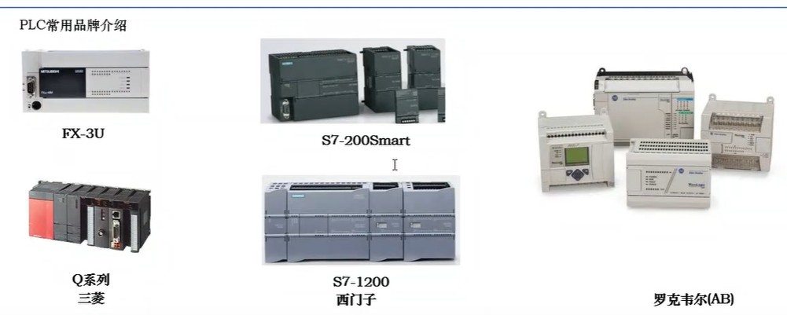

plc应用场合

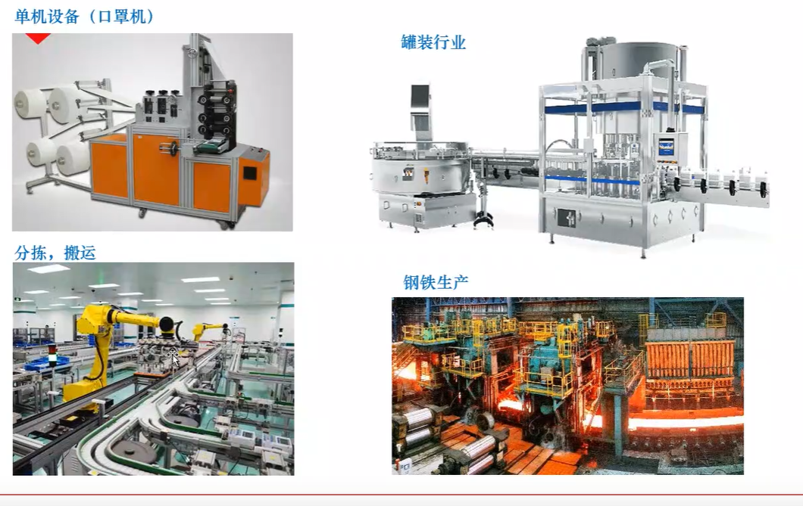

PLC根据外部操作盘上的按钮开关、选择开关和数字开关等发出的指令输入，或者一些检测开关如限位开关、接近开关等传感器输入进行运算，从而对电磁阀、电动机、指示灯等外部负载实施控制，输出信号与输入信号的关系取决于给PLC装载的程序内容。

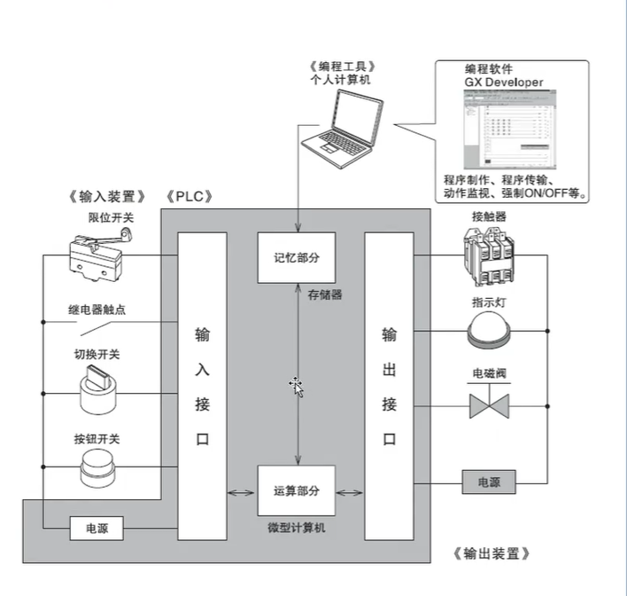

#### **PLC的功能特点**

- 1.可靠性高，接口电路电气隔离、输入滤波、屏蔽干扰、自诊断功能。
- 2.可灵活编程、传统的计数器、定时器、继电器变成了编程变量，使得控制更简单，更容易实现，同在线监控功能大大提高了排故效率。
- 3.丰富的接口扩展，可实现通讯、数字量、模拟量、运动控制扩展功能。
- 4.模块化的结构可根据现场需求自由组合。
- 5.安装简单、维修方便、结构紧凑。

####    plc系统组成

(1)PLC硬件系统主要由中央处理器(CPU、存储器、输入单元，输出单元等部分组成，如图1-1所示，其中CPU是PLC的核心；输入单元和输出单元是连接现场输入/输出设备与CPU之间的接口电路，也称为输入接口和输出接口。另外，PLC硬件系统还包括通信接口、扩展接口、电源等。

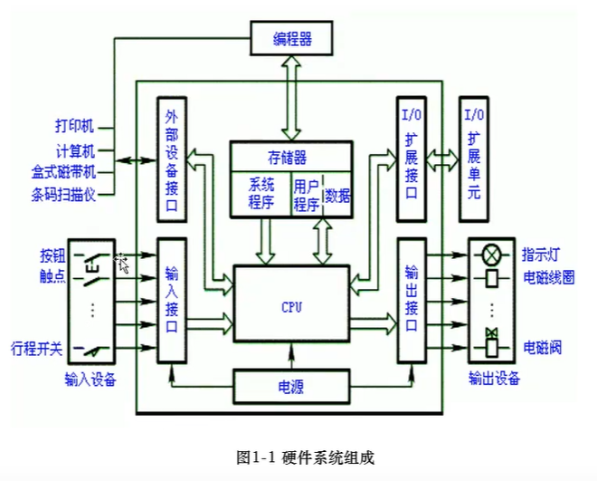

##### 中央处理器(CPU)
CPU是PLC的核心，跟我们的电脑的处理器一样的道理，只不过是针对工业控制研发的一种特殊微处理器，处理器的特性决定了整个PLC的性能特点，一般应用时需要根据控制场合和控制精度要求选择不同性能的CPU;但是不管什么性能的处理器，其组成原理是不变的，其功能作用包括以下几个方面：

- ①接收从编程装置输入的程序和数据。
- ②诊断内部电路中的工作故障和编程语法错误。
- ③将输入接口采集的现场数据存入输入映像寄存器或数据寄存器中。
- ④从存储器逐条的读取用户程序并执行。
- ⑤根据执行结果，更新输出映像寄存器内容并通过输出单元输出控制外部连接。

##### 2.存储器
存储器包括可读写操作的随机存储器RAM(Random Access Memory)和只读存储器ROM(Read Only Memory),PLC的许多数据一般保存在RAM中，RAM中的数据需要超级电容或者后备电池来进行保存。超级电容保存的数据一般是20天左右，具体需要看超级电容的规格。后备电池保存的数据是3年左右。

一般PLC中的**过程数据**会保存在RAM中，原因是过程数据不断地在读写，随着控制器的断电运行，基本上过程数据都会丢失，类似于我们电脑的运行内存。

PLC的存储器主要用于存储系统程序、用户程序和工作数据，系统程序是PLC制造商编写的，一般固化在只读存储器中，用户不能访问和修改，主要完成系统诊断、逻辑运算、通信及参数设定等功能，提供了PLC运行的平台；

用户程序是由用户根据生产工艺要求编制的应用程序，为了便于读出、检查和修改，所以一般存储在RAM中；工作数据是PLC运行过程中经常变化存取的一些数据，也存储在RAM中，以适应随机存取的要求，比如输入/输出继电器、定时器、变量存储器的状态数据，**部分数据在掉电时用后备电池维持其现有状态，这部分区域称为保持数据区。**

当PLC提供的用户存储器容量不够时，许多PLC还提供存储器扩展功能。

##  plc的工作方式

###  循环扫描模式

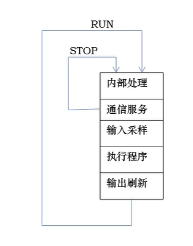

#### STOP状态：

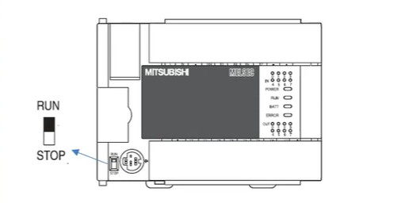 

- 1、PLC首先进行系统的初始化，清除内部缓冲存储区，
- 2、然后进行自诊断，检测模块内部硬件是否正常
- 3、同时处理各种编程器的通信请求并显示相关内容。

此状态一股用于程序的编制与修改

####  RUN状态

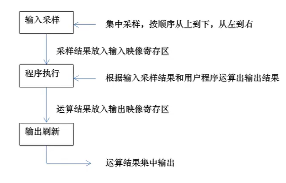 

：在RUN工作模式，PLC也会反复执行5个阶段的操作，而输入处理、程序处理和输出处理，则是执行用户程序的三个阶段。

PLC处于运行RUN状态时，CPU以一定的扫描速度重复执行左边的3个阶段

### 内部运行方式

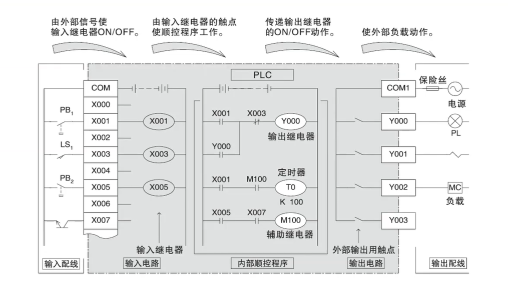

### 三菱fx3u右键种类

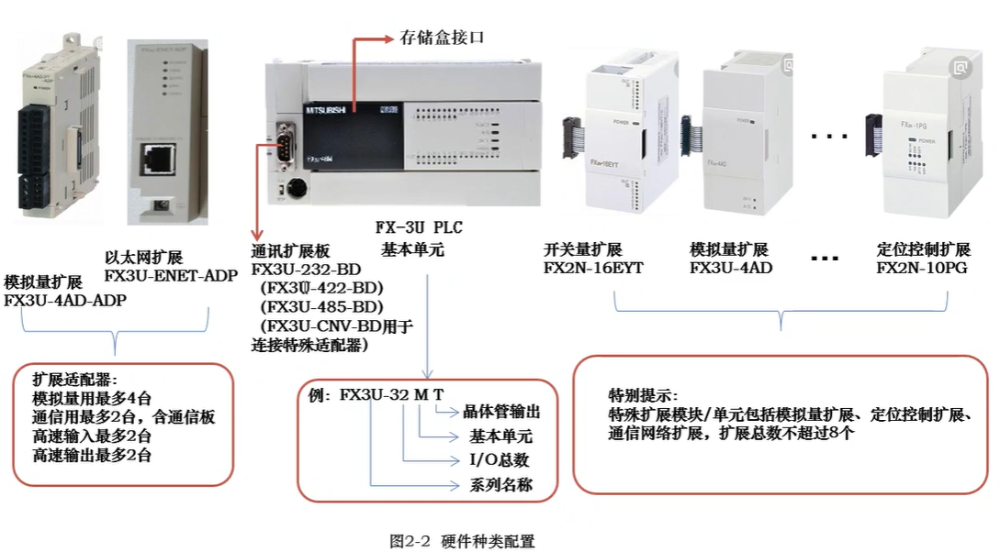

##  plc性能指标

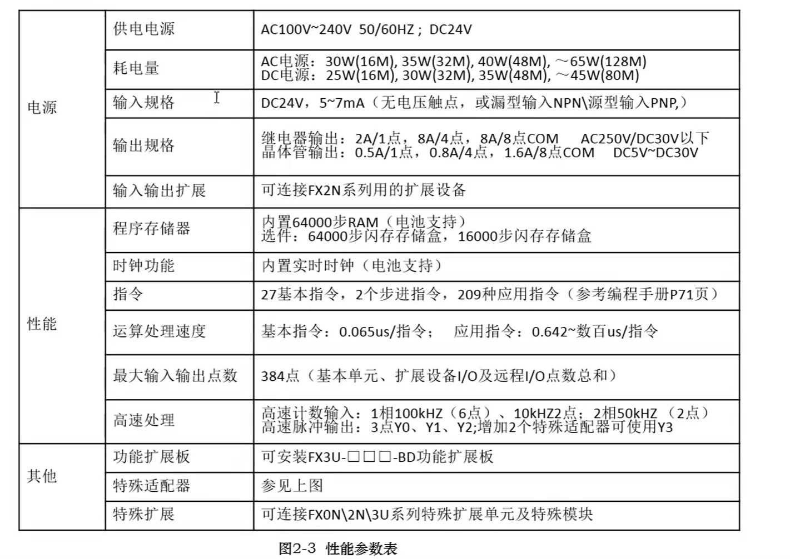

## 硬键安装与接线

###  plc输入接线

NPN与PNP接线的区别主要取决于公共端S/S的接法

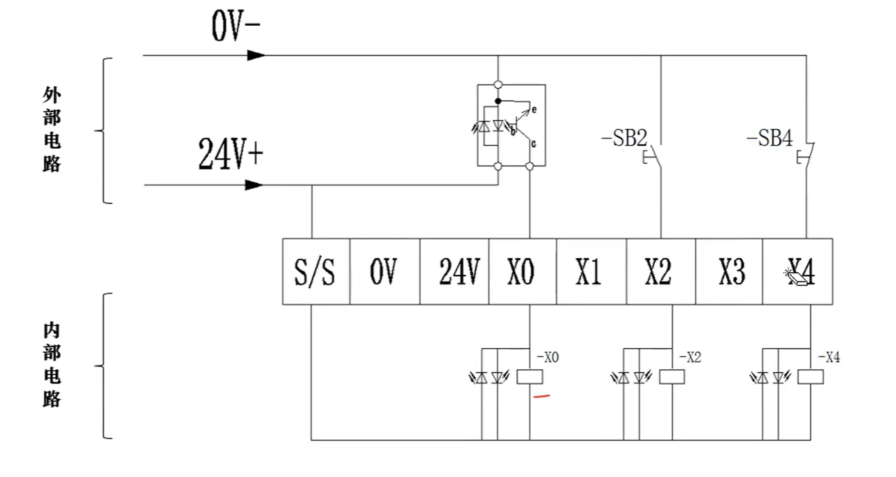

总结：

**高电平(24V+)从公共端流入PLC内部电路的接法为NPN接法，那么需要选择NPN型的开关；**
**低电平(24V-)从公共端流入PLC内部电路的接法为PNP接法，那么需要选择PNP型的开关；**

###  NPN与PNP的介绍

如图2-4所示为带极性传感器的内部电路与外部连接的2种接法示意，可根据三极管发射极电流方向判定传感器的极性，电流从发射极流出为NPN输出方式，即低电平输出有效；电流从发射极流入为PNP输出方式，即高电平输出有效。

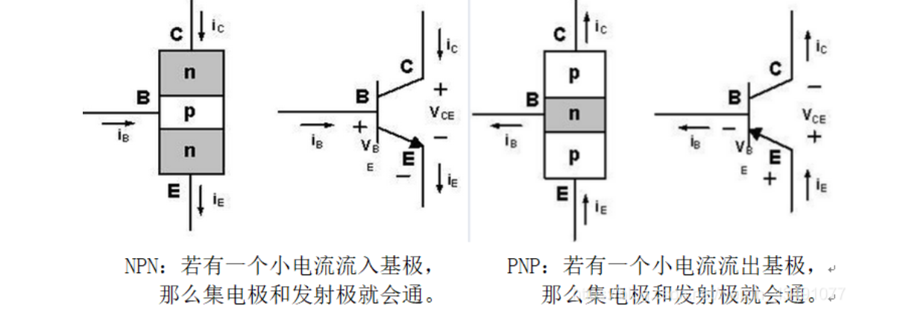