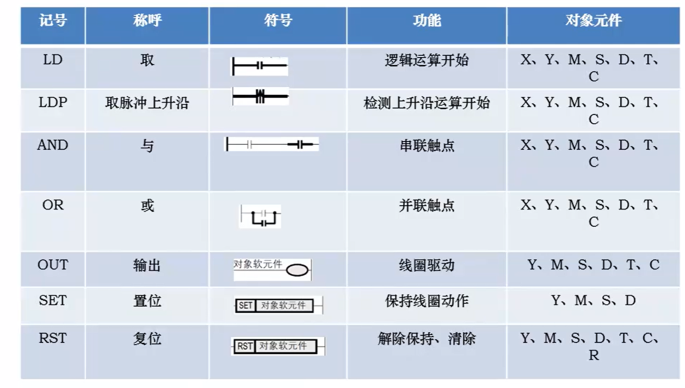
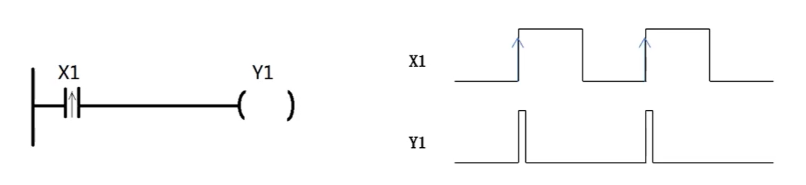
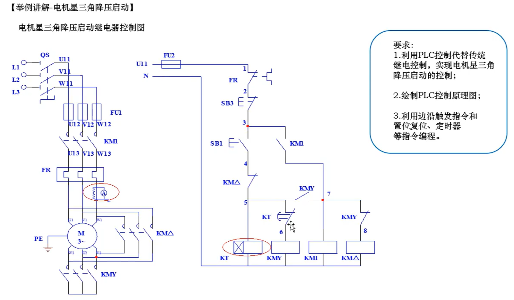
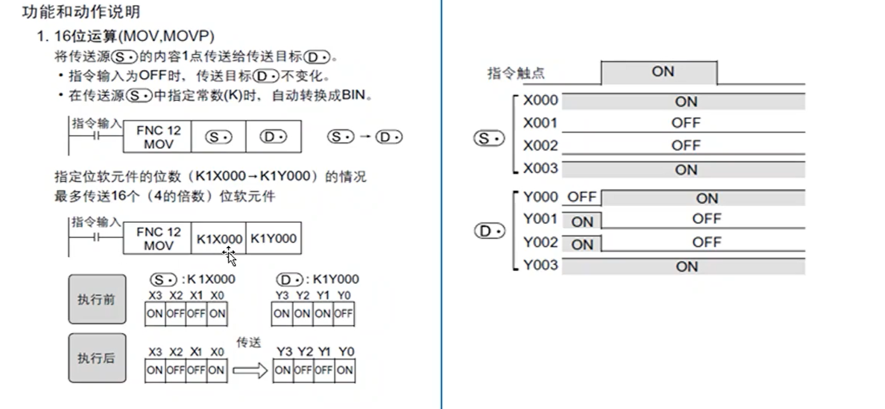
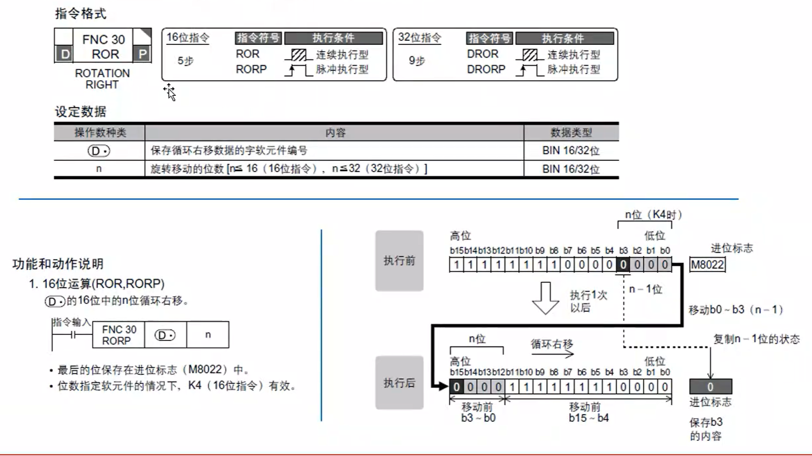
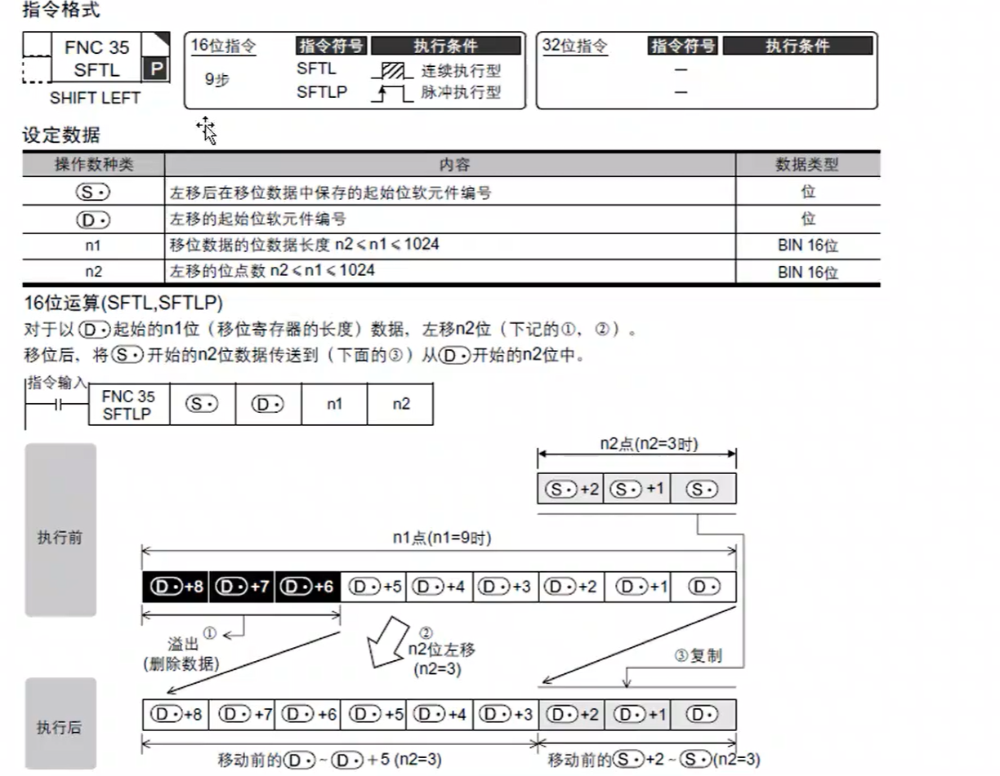
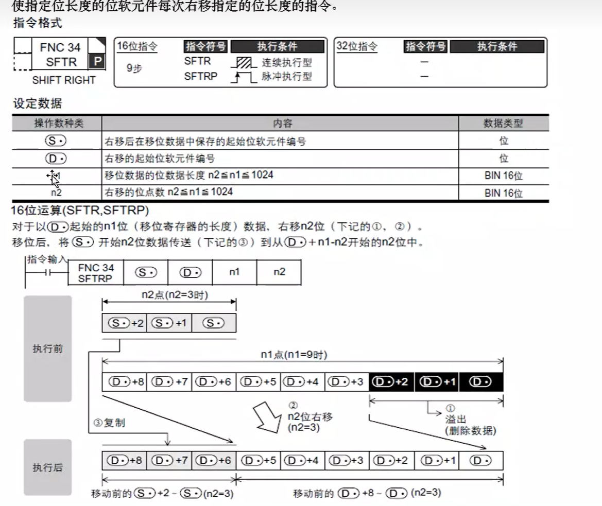
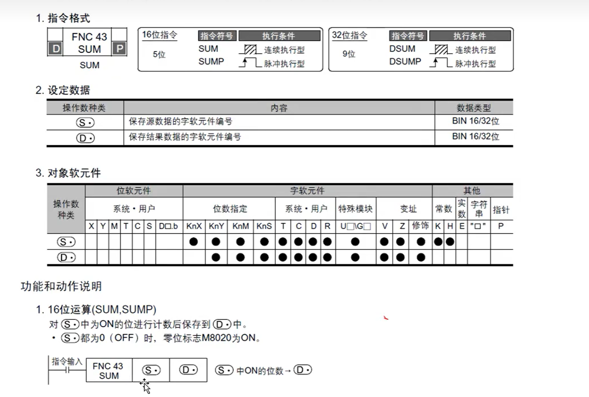
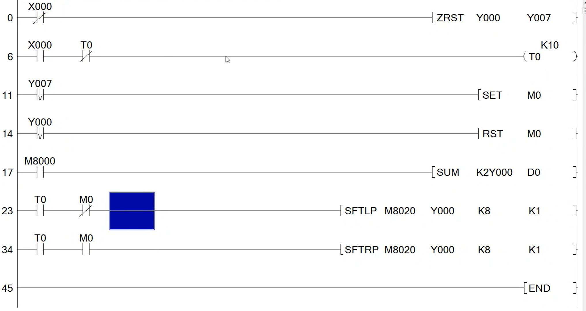

##  1.编程语言

用户运用编程工具可以实现多种语言进行编程，各个编程语言具有各自的优势，我们平时接触得最多的就是梯形图编程。下面我们就对几种编程语言各自的特点进行一个简单的介绍。

- 指令表-IL
- 梯形图-LAD
- 顺序功能图-SFC
- 功能块语言-FBD
- st结构化文本-ST

 

##  2.plc软元件介绍

PLC具有的软元件种类如图所示，编程变量由软元件+编号组成，如X0、M10,D10,T5等，大部分编程是通过指令结合编程变量实现的，编程变量可分为位变量如M10、X0,数据变量C0、D0等。

 

- 输入继电器-x。x000八进制编号
- 输出继电器-y。Y000.八进制编号
- 辅助继电器-M。M0开始。十进制
- 定时器-T。t0
- 计算器-C。C0
- 数据寄存器-D。D0开始。十六进制
- 状态-s
- 变址寄存器（V，Z）
- 指针（P，I）
- 高速计数器-c，c235开始

 

## 3.特殊软元件功能

特殊软元件的功能包含特殊辅助继电器和特殊辅助寄存器，三菱PLC特殊辅助继电器共512点(M8000~M8511),它们用来表示PLC的某些状态，提供时钟脉冲和标志（如进位、借位标志），设定PLC运行方式，或者用于步进顺控、禁止中断、设定计数器是加计数还是减计数等；特殊辅助继电器分为两类：

- **触点利用型**
  由PLC的系统程序来驱动触点利用型特殊辅助继电器的线圈，在用户程序中直接使用其触点，但是不能出现它们的线圈，下面是几个例子：
  M8000(运行监视)：当PLC执行用户程序时，M8000为ON;停止执行时，M8000为OFF。
  M8002(初始化脉冲)：M8002仅在M8000由OFF变为ON状态的一个扫描周期内为ON(见图3-8)，可以用M8002的常开触点来使有断电保持功能的元件初始化复位或给它们置初始值。
  M8011~M8014分别是10ms,100ms,1s和1min时钟脉冲。
  M8005(锂电池电压降低)：电池电压下降至规定值时变为ON,可以用它的触点驱动输出继电器和外部指示灯，提醒工作人员更换锂电池。

- **线圈驱动型**
  由用户程序驱动其线圈，使PLC执行特定的操作，用户并不使用它们的触点。例如：
  M8030的线圈“通电”后，“电池电压降低”发光二极管熄灭；
  M8033的线圈“通电”时，PLC进入STOP状态后，所有输出继电器的状态保持不变；
  M8034的线圈“通电”时，禁止所有的输出；
  M8039的线圈“通电”时，PLC以D8039中指定的扫描时间工作。

##  4.plc数据类型

###  主要几种数据类型

首先说一说“位（bit）”。前一篇文章在讲解数制的时候（参考：PLC基础篇之数制及其表示方法），曾多次提到“位”的概念。“位”，英文名称为“bit”，它是PLC（计算机）的最小存储单位，其取值范围为“0”和“1”两种。

“位”是存储单位，按位存放的数据，在数据类型中，被称为“布尔型”（Bool）。布尔型数据的取值范围为“0”和“1”，可用英文“TRUE”（真）和“FALSE”（假）表示。

在PLC的编程中，布尔型的数据使用频率是很高的。对于数字量的输入或输出，都是以“位”（布尔型）的方式进行操作。比如“I0.0”就是一个布尔型变量，它表示输入缓冲区（Input）的第0个字节的第0位。“位”，也俗称“点”，常把输入通道称为“I点”，把输出通道称为“Q点”。

第二种类型：字节（Byte）。八个“位”组成一个“字节（Byte）”，如下图：

在PLC中，输入模块和输出模块的通道也是按照字节的顺序来存放的。比如“I0.0~I0.7”，这8个输入“位”组成“IB0”。对于S7-300/400的PLC，Byte类型是无符号数，其取值范围内为 0~255（0xFF）。对于S7-1200/1500PLC的编程（博途平台），Byte类型可以作为有符号数或者无符号数。当作为有符号数时，其取值范围为“-128~+127”；当作为无符号数时，其取值范围为0~255（0xFF）。

第三种类型：字符型（CHAR）。字符型类型的数据也占用一个字节，它内部存放的是该字符的ASCII码值。比如字符“A”，其ASCII码值为66（0x42）。当程序查询到该数据属于字符型，并且内部存储的值为66时，将会在屏幕上显示大写的字符：“A”。

第四种类型：整型（INT）。整型数据占用两个字节（Byte），属于有符号数，其取值范围为：-32768~+32767。整形数据的最高位为符号位，“0”表示正数，“1”表示负数。既然整形数据由两个字节组成，就有字节顺序的问题，哪个字节是高字节呢？西门子S7系列PLC采用大端（Big-Enidan）的存放方式，如下图（关于字节序，请参考文章：[给你讲个来自《格列佛游记》的计算机故事](https://link.zhihu.com/?target=http%3A//www.founderchip.com/%3Fid%3D41)）：

第五种类型：字（WORD）。“字”类型也占用两个字节，但是它表示无符号数，其取值范围为：0~65535（0xFFFF）。与整型数据一样，也采用Big-Endina的方式存放。

在PLC中，用“W”来表示一个“字”类型的变量。比如变量“MW0”，其中“M”表示该变量存放在“M”区，“W”表示它是一个“字”类型的变量，“0”表示其起始地址为0。“MW0”由“MB0”和“MB1”组成，其中“MB0”为高字节（Big-Endian字节序）。

第六种类型：双字（Double WORD）。“双字”由两个“字”组成，因此它包含四个字节，其取值范围为：0~4294967295（0xFFFFFFFF）。在PLC中，“双字”用“D”表示。比如“MD0”，它表示M存储区从地址0开始的4个字节，即：MB0、MB1、MB2和MB3，字节序依然为大端（Big-Endina）。

第六种类型：双整型（Double INT）。“双整型”类型由两个“整型”组成，也占用四个字节，不过它表示的是有符号数，其取值范围为：-2147483648~+2147483648。在PLC中，表示为“DINT”。

第七种类型：实型（Real）。“实型”数据占用四个字节，用来表示浮点数。实型数据总计32个“位”，被分成三个部分：

1）符号位（Sign）：最高位（第31位），正数为“0”，负数为“1”。

2）指数位（Exponent）：第23位到第30位，用于存储科学计数法中的指数数据，并且采用移位存储；

3）尾数部分（Mantissa）：第0位到第22位，表示浮点数的尾数部分；

对于“指数位”，为了处理负指数的需要，其存储的值为实际指数加上偏移量“127”。比如，若实际指数为“0”，则存储值为“127”；若实际指数为“-64”，则存储值为“63”。

实型数据（浮点数）可以使用4个字节的空间，可以表示非常大（10的38次方）和非常小（10的负38次方）的数，但是浮点数的运算速度相对整型会慢一些。在PLC编程中，可以输入小数点来表示浮点数。比如“10”表示整数，“10.0”表示浮点数。

IEC 61131-3 规约了 PLC 中的数据类型，包括21种基本数据类型（basic datatype）、用于函数重载的泛化数据类型（general datatype）、以及自定义数据类型（derived datatype）。

### 基本数据类型

| 编号 |        关键字        |       数据类型       | 长度 |
| :--: | :------------------: | :------------------: | :--: |
|  1   |        `BOOL`        |         布尔         |  1   |
|  2   |        `SINT`        |        短整数        |  8   |
|  3   |        `INT`         |         整数         |  16  |
|  4   |        `DINT`        |      双精度整数      |  32  |
|  5   |        `LINT`        |        长整数        |  64  |
|  6   |       `USINT`        |     无符号短整数     |  8   |
|  7   |        `UINT`        |      无符号整数      |  16  |
|  8   |       `UDINT`        |   无符号双精度整数   |  32  |
|  9   |       `ULINT`        |     无符号长整数     |  64  |
|  10  |        `REAL`        |         实数         |  32  |
|  11  |       `LREAL`        |        长实数        |  64  |
|  12  |        `TIME`        |       持续时间       |  –   |
|  13  |        `DATE`        |         如期         |  –   |
|  14  | `TIME_OF_DAY`/`TOD`  |     时间（当日）     |  –   |
|  15  | `DATE_AND_TIME`/`DT` |      时间与日期      |  –   |
|  16  |       `STRING`       | 可变长度单字节字符串 |  8   |
|  17  |      `WSTRING`       | 可变长度双字节字符串 |  16  |
|  18  |        `BYTE`        |     长为8的位串      |  8   |
|  19  |        `WORD`        |     长为16的位串     |  16  |
|  20  |       `DWORD`        |     长为32的位串     |  32  |
|  21  |       `LWORD`        |     长为64的位串     |  64  |

##  5.位指令

指令是指对PLC发出的操作命令，告诉PLC做什么、怎么做。一条完整的指令应该包含操作码和操作数，如“LDX1”、“SET YO”等，其中，“LD和SET”是操作码，“X1和YO”是操作数指令系统中可以没有操作数，如RET、END。

以下是几个常见的指令。

###  边沿触发与置复位指令

####  脉冲与时序图

**脉冲**：在数字操作系统中，所有的信号均为开关量，即信号状态只有0和1两种状态，用触点描述就是
断开与闭合状态。

一般称高电平为1，低电平为0.是正逻辑。反之则称为负逻辑。 

**时序图**：按时间顺序显示个对象关系的曲线示意图

#### 边沿触发与置位复位

- **边沿触发**：就是电流发生变化时的信号。低电平到高电平时的信号为上升沿。高电平到低电平的时候为下降沿
- **置位复位**：*set*将指定地址位置变成1且一直保持。复位：*rst*将地址值变为0，保持

特殊：*zrst*连续复位，复位几个相连的地址。

 

应用分析

 

练习：

 

####  定时器

使用定时器(T)时，用OUT指令设定定时时间。**梯形图中定时器一般只能通电（有输入信号时）计时一掉电就会被置位0，可以通过一些特定写法将定时器掉电保持**

- 定时器实际定时时间(t)=K{定时器时基(T0)*设定值}

 

不作为定时器时也可以当做存储数据的数据寄存器使用。

ps：累计型定时器可以掉电保持。

练习：

 

####  计数器

使用计数器(C)时，用OUT指令设定计数值。
一般用计数器对计数条件的上升沿进行增计数，计数值与设定值相等时，计数器触点动作，用RST指令复位触点和当前值；计数器分为16位、32位计数器和高速计数器等种类，这里仅以16位正向计数器为例进行说明。

 

写法举例

 

## 6.应用指令介绍

#### 应用指令介绍

FX3U系列可编程控制器中准备了数据传送与比较、四则运算、数据循环和移位等基本应用指令，另外还有高速计数、高速脉冲输出等高速处理指令等，有些应用指令是将复杂的顺序功能封装而成的，因此使用这些指令将会使得编程工作量大大减轻；以下列出一些主要的应用指令：

####  指令阅读方法

###  mov指令

格式：mov [s] [d]

将传送源s的值赋值给目标d。

**在指令实际应用中需要注意，赋值指令的触发条件尽量运用边沿触发，因为被赋值的数据寄存器存储的数值不是固定不变的，根据触发条件，寄存器的值在不同时期、不同条件下给予的值是不一样的。** 

使用

软元件值监控

####  bcd转换

将BIN(2进制数)转换成BCD(1O进制数)后传送的指令，PLC的运算是按照BIN(2进制)数据进行处理的，在带BCD译码的7段码显示器中显示数值时，可使用本指令。在计算机中都是2进制来保存数据，因此要把一个10进制数据转换成2进制，才能保存在计算机中，BCD码转换很好的解决了这个问题。

 

####  bin转换

将BCD(1O进制数)转换成BIN2进制数)后传送的指令，将数字式开关之类以BCD(1O进制数)设定的数值转换成PLC运算中可以处理的BIN(2进制数]数据后读取的情况下，可使用本指令。

 

####  bcd和bin命令使用

 

###　　四则运算

四则运算指令：将两个软元件的值进行四则运算，得出的结果放入第三的软元件中，

常用的运算指令如下表：

　

####  加法add指令

add [s1] [s2] [d]

将s1与s2之和放入d元件中

 

####  减法sub指令

sub [s1] [s2] [d]

 

####  乘法mul

mul [s1] [s2] [d]

 

 

####  除法div

 

####  整数转换为浮点数FLT

将BIN整数值装换成2进制浮点数（实数）指令，在涉及到浮点数运算的场合，一些存放了整数数值的寄存器要参与到运算中，首先需要转换本身的数据类型，以达到与同类型数据进行运算与比较的要求。

需要注意的是，由于在各2进制浮点数（实数]运算指令中，指定的K、H的值会自动转换成2进制浮点数，所以不需要使用FLT指令进行转换

 

使用

 

###  比较指令

####  CMP指令

CMP(16位)比较两个值，将其结果（大于、等于、小于）输出给软元件。(DCMP 32位）

 

 

####  区间比较ZCP

 

####  触点·比较

触点型比较指令LD=/>/>=/</<=/<>
对两个数值进行比较，当满足相对应的条件时，触点导通，不满足则断开。

 

【解释备注】
当C0>=3,并且<=5时，Y0得电；
当C0=3,或者C0=5时，Y1得电。

###  时钟指令

PLC自带实时时钟功能，通过内置电池保持时钟数据，当电池电量耗尽，时钟数据将会丢失，因此，在运用时钟功能时需要保证电池电量充满；利用可编程控制器可以对时钟数据进行运算、比较；此外，还可以对内置实时时钟的时间进行校准。

 

####  读时钟TRD

读出plc时钟数据的·指令

 

 

####  将时分秒数据转换成秒HTOS

​	 

###  移位指令

移位的数据只能是16/32位数据

####  循环右移指令ROR

使不包括进位标志在内的指定位数部分的位信息右移、循环的指令。

ROR [d] [n]

- d要移位的元件
- 移位的位数

移位时如果移到尾部，从高位开始重新移位。

####  循环左移ROL

 

####  位左移SFTL

只能对16位数据操作

 

 

####  向右移位SFTR

####  SUM指令

计算指定软元件数据有多少个为1（on）的指令

练习 

 

