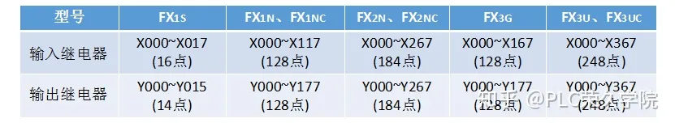
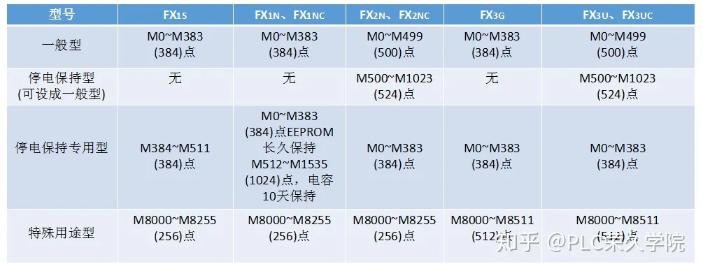
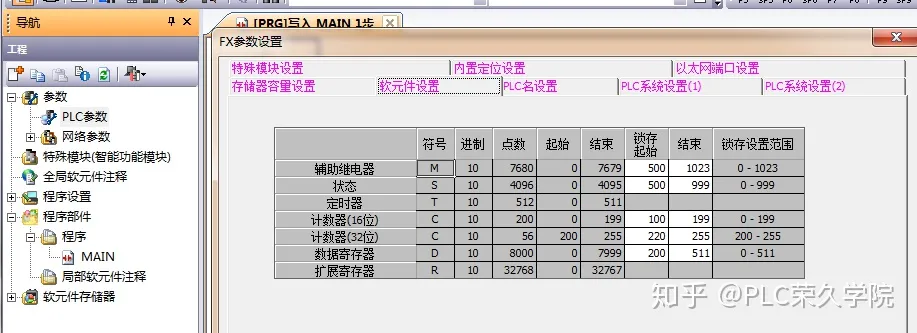
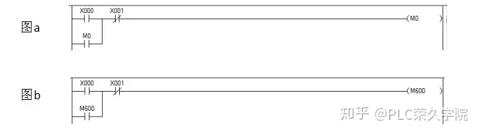
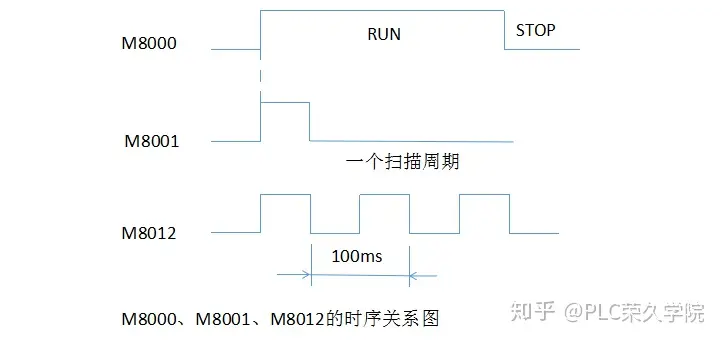
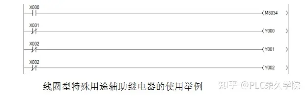

##  plc软元件

PLC是在继电器控制路线基础上发展起来的，继电器控制线路有时间继电器、中间继电器等，而PLC内部也有类似的器件，由于这些器件以软件形似存在，故称为软元件。PLC程序由指令和软元件组成，指令的功能是发出命令，软元件是指令的执行对象，比如，SET为1指令，Y000是PLC的一种软元件（输出继电器），“SET Y000”就是命令PLC的输出继电器Y000的转台变为1。由此可见，编写PLC程序必须了解PLC的指令级软元件。

PLC的软元件很多，主要有输入继电器、输出继电器、定时器、计数器、数据寄存器和常数等。三菱FX系列PLC分很多子系列，越高档的子系列，其支持指令和软元件数量越多。

### 一、输入继电器(X)和输出继电器(Y)

#### 1）输入继电器(X)

输入继电器用于接受PLC输入端子送入的外部开关信号，它与PLC的输入端子连接，其表示符号为X，按八进制方式编号，输入继电器与外部对应的输入端子编号的相同的。三菱FX3U-48MR/ES-A型PLC外部有8个输入端子，其编号为X000~X007、X010~X017、X020~X027，相应的内部也有24个相同编号的输入继电器来接收这样端子输的开关信号。

一个输入继电器可以有无数个编号相同的常闭触点和常开触点，当某个输入端子(如X000)外接开关闭合时，PLC内部相同编号输入继电器(X000)状态变为ON，那么程序中相同编号的常开触点处于闭合，常闭触点处于断开。

#### 2）输出继电器(Y)

输出继电器(常称输出线圈)用于将PLC内部开关信号送出，它与PLC输出端子连接，其表示符号为Y，也按八进制方式编号，输出继电器与外部对应的输出端子编号是相同的。三菱FX3U-48MR/ES-A型PLC外部有24个输出端子，其编号为Y000-￥007、Y010-1017、Y020~Y027，相应地内部有24个相同编号的输出继电器，这些输出继电器的状态由相同编号的外部输出端子送出。

一个输出继电器只有一个与输出端子连接的常开触点(又称硬触点)，但在编程时可使用无数个编号相同的常开触点和常闭触点。当某个输出继电器(如Y000)状态为ON时它除了会使相同编号的输出端子内部的硬触点闭合外，还会使程序中的相同编号的常开触点闭合，常闭触点断开

三菱FX系列PLC支持的输入继电器、输出继电器如图表所示

### 二、辅助继电器(M)

辅助继电器是PLC内部继电器，它与输入、输出继电器不同，不能接收输入输入端子送来的信号，也不能驱动输出端子。辅助继电器表示符号为M，按十进制方式编号，如M0~M499、M500~M1023等。一个辅助继电器可以有无数个编号相同的常闭触点和常开触点。

辅助继电器分为四类：一般型、停电保持型、停电保持专用型、特殊用途型。

#### 1）一般型辅助继电器

一般型(又称通用型)辅助继电器在PLC运行时，如果电源突然停电，则全部线圈状态均变为OFF。当电源再次接通时，除了因其他信号而变为ON的以外，其余的仍将保持OFF状态，它们没有停电保持功能。

三菱FX3U系列PLC的一般型辅助继电器点数默认为M0~M49，也可以用编程软件将一般型设为停电保持型，设置方法如图所示，在 GX Works2软件的工程列表区双击参数项中的“PLC参数”，弹出参数设置对话框，切换到“软元件”选项卡，从辅助继电器一栏可以看出，系统默认M500(起使~M1023(结束)范围内的辅助继电器具有锁存(停电保持)功能，如果将起始值改为550，结束值仍为1023，那么M0~M50范围内的都是一般型辅助继电器。

从图所示对话框不难看出，不但可以设置辅助继电器停电保持点数，还可以设置状态继电器、定时器、计数器和数据寄存器的停电保持点数，编程时选择的PLC类型不同该对话框的内容有所不同。

#### 2）停电保持型辅助继电器

停电保持型辅助继电器与一般型辅助继电器的区别主要在于：前者具有停电保持功能，即能记忆停电前的状态，并在重新通电后保持停电前的状态，FX3U系列PLC的停电保持型辅助继电器可分为停电保持型(M500=M1023)和停电保持专用型(M1024-3071)，停电保持专用型辅助继电器无法设成一般型。

下面以图来说明一般型和停电保持型辅助继电器的区别。

图(a)程序采用了一般型辅助继电器，在通电时，如果X000常开触点闭合，辅助继电器M0状态变为ON(或称M0线圈得电)，M0常开触点闭合，在X000触点断开后锁住M0继电器的状态值，如果PLC出现停电，M0继电器状态值变为OFF，在PLC重新恢复供电时，M0继电器状态仍为OFF，M0常开触点处于断开。

图(b)程序采用了停电保持型辅助继电器，在通电时，如果X000常开触点闭合，辅助继电器M600状态变为ON，M600常开触点闭合，如果PLC出现停电，M600继电器状态值保持为ON，在PLC重新恢复供电时，M600继电器状态仍为ON，M0常开触点处于闭合。若重新供电时X001触点处于开路，则M600继电器状态为OFF。

#### 3）特殊用途型辅助继电器

### 三、FX3U系列中有512个特殊辅助继电器，可分成触点型和线圈型两大类。

#### 1）触点型特殊用途辅助继电器

触点型特殊用途辅助继电器的线圈由PLC自动驱动，用户只可使用其触点，即在编写程序时，只能使用这种继电器的触点，不能使用其线圈。常用的触点型特殊用途辅助继电器如下。

M8000：运行监视a触点(常开触点)，在PLC运行中，M8000触点始终处于接通状

M8001：为运行监视b触点(常闭触点)，它与M8000触点逻辑相反，在PLC运行时，M8001触点始终断开。

M8002：初始脉冲a触点，该触点仅在PLC运行开始的一个扫描周期内接通，以后周期断开。

M8003：为初始脉冲b触点，它与M8002逻辑相反。

M8011、M8012、M8013和M8014分别是产生10ms、100ms、1s和1min时钟脉冲的特殊辅助继电器触点。

M8000、M8002、M8012的时序关系如图所示。从图中可以看出，在PLC运行(RUN)时，M8000触点始终是闭合的(图中用高电平表示)，而M8002触点仅闭合一个扫描周期，M8012闭合50ms、接通50ms，并且不断重复。

#### 2）线圈型特殊用途辅助继电器

线圈型特殊用途辅助继电器由用户程序驱动其线圈，使PLC执行特定的动作。常用的线圈型特殊用途辅助继电器如下。

M8030:电池LED熄灯。当M8030线圈得电(M8030继电器状态为ON)时,电池电压降低发光二极管熄灭。

M8033:存储器保持停止。若M8033线圈得电(M8033继电器状态值为ON)，PLC停止时保持输出映象存储器和数据寄存器的内容。以图所示的程序为例,当X00常开触点处于断开时，M8034辅助继电器状态为OFF，X001-x003常闭触点处于闭合使Y000~Y002线圈均得电，如果X000常开触点闭合M8034轴助继电器状态变为ON，PLC马上让所有的输出线圈失电，故Y000~Y003常闭触点任处于闭合。

M8034：所有输出禁止。若M8034线圈得电（即M8034继电器状态为ON），PLC的输出全部禁止。

M8039：恒定扫描模式。若M8039线圈得电（即M8039继电器状态为ON），PLC按数据寄存器D8039中指定的扫描时间工作。

