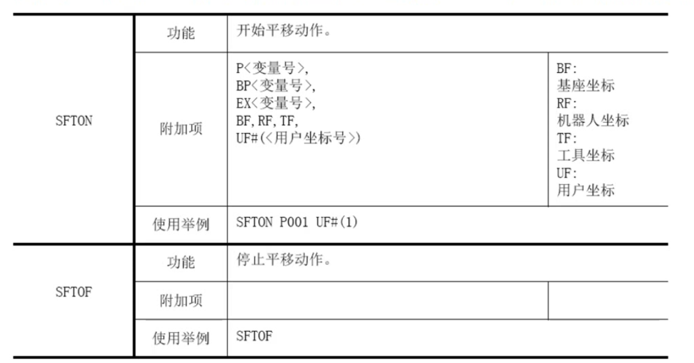

#  01基本设置

##  选择圆柱坐标模式

---

title: 01eplan软件使用

作用是以底座为圆心以夹爪为点进行xyz三轴的移动。

##  原点位置、第二原点

###  原点位置

#### 1、原点位置的概念

机器人原点位置是所有关节轴脉冲数为0的位置，此时的姿态称为原点位置姿态。因机器人型号不同而原点位置不同。

右图为安川HP20D工业机器人的原点位置图其中下臂(L轴)与地面垂直，上臂(U轴)中心与水平面平行。B轴与U轴中心线夹角为0°

####  2、原点位置的校准

原点位置校准是使机器人各轴轴角度与连接在各轴电机上的绝对值脉冲编码器计数值对应起来的操作。

原点位置校准是在出厂前进行的，但在下列情况下必须再次进行原点位置校准。
(1)更换机器人和控制柜的组合时。
(2)当机器人机构部后备电池用尽换电池时。
(3)更换电机、绝对值位置编码器时。
(4)当更换电路控板或清除内存数据时。
(5)机器人碰撞工件，原点位置偏移时。

### 第二原点位置

#### 1、设置的目的

当接通电源时，如绝对编码器的位置数据与上一次关断电源时的位置数据不同时，会出现报警信息。

以下两种情况会发生报警：
·PG系统发生异常
·PG系统正常，但关闭电源后，机器人本体发生了位移。

如PG系统发生异常，按启动按钮，开始再现时，机器人有向意想不到的方向运动的危险性。为了确保安全，出现绝对原点数据允许范围异常报警后，如不进行位置确认的操作，就不能进行再现及试运转的操作。

### 作业原点

作业原点是机器人的参考点，设置作业原点可以防止机器人与周边设备干涉。通过示教器或外部输入信号，机器人工具中心点(TCP)可被移至作业原点。当机器人位于操作点附近时，输出作业原点位置信号。

### 快速回原点

fwd、bwd

###  设置第二原点

##  四种插补指令

### 插补方法和再现速度

再现运行机器人时，决定程序点与程序点间以何种轨迹移动的方法叫**插补方法**。

安川机器人有四种插补方法，分别是：关节插补、直线插补、圆弧插补、自由曲线插补。
程序点与程序点间的移动速度就是**再现速度**。

通常**位置数据、插补方法、再现速度**的3个数据同时被登录到机器人轴的程序点中。

#### 关节插补

关节插补用于机器人对轨迹路径无要求的场合，指令为MOVJ。

从安全角度考虑，一般关节插补指令用于第一步的示教。

以"MOVJ VJ=25.00”为例，VJ=25.00表示再现速度值为最大关节速度的25%，若设为0时，则表示再现速度与前段程序相同。

#### 直线插补

如果机器人再现时的运动轨迹为直线，示教时的编程指令为MOVL。直线插补指令常在焊接作业中使用。

直线插补再现速度单位有2种：mm/s和cm/min,速度单位取决于系统设置，可根据用途进行切换。

MOVL V=276.00

#### 圆弧插补

平面内不共线的三点才能确定一段圆弧，因此编写圆弧程序要示教三个点，圆弧插补指令为MOVC。

##### 单一圆弧

当圆弧只有一个时，如图所示，用圆弧插补示教P1-P3的3个点。
若用关节插补或直线插补示教进入圆弧前的P0,则P0-P1的轨迹自动成为直线。

##### 连续圆弧

如下图所示，当曲率发生改变的圆弧连续有2个以上时，圆弧最终将逐个分离。
因此，请在前一个圆弧与后一个圆弧的连接点加入关节及直线插补的点。

#### 自由曲线插补

对于不规则形状的工件执行焊接、切割、溶接、涂底漆等作业时应用自由曲线插
补指令MOVS更方便。轨迹为通过3个点的抛物线。

##### 单一自由曲线

如图所示，用自由曲线插补示教P1-P3的3个点。

##### 连续自由曲线

用重合抛物线合成建立轨迹。
与圆弧插补不同，2个自由曲线的连接处不能是同一点。

#  常用指令

| 指令  |               功能                |
| :---: | :-------------------------------: |
| DOUT  |        使外部继电器ON或OFF        |
| PULSE | 使外部继电器ON段时间，之后自动OFF |
|  DIN  |          将输入信号读入           |
| WAIT  |     等待一输入信号与设定相符      |
| JUMP  |   跳至预设之行或程式，执行指令    |
| CALL  |         呼叫设定之副程式          |
| TIMER |    暂停时间(T=0.01至655.35sec)    |
|  INC  |              每次加               |
|  DEC  |              每次减               |
|  IF   |             判别指令              |
| MOVJ  |             关节插补              |
| MOVL  |             直线插补              |
| MOVS  |           自由曲线插补            |
| MOVC  |             圆弧插补              |
| REFP  |            设置参考点             |
| SFTON |                                   |
| SFTOF |                                   |

###  DOUT指令

### TIMER指令

### REDP

###  SFTON、SFTOF平行移动指令

平行移动指的是对象物体从指定位置进行移动时，对象物体各点均保持等距离移动

从SFTON命令到SFTOF命令的区间，作为移动对象。

### CALL指令

### SPEED指令

​	

#  再现模式运行程序

##  设定主程序

设定成功

# 工具坐标系简介 

工具坐标系是表示工具中心点或尖端点(TCP)的位置和工具姿态的笛卡尔坐标系。

工具坐标系把机器人腕部法兰盘所握工具的有效方向定为Z轴，把坐标定义在工具尖端点，所以工具坐标的方向随腕部的移动而发生变化。

### 工具坐标系的设置
工具坐标系的设置也就是工具数据的设置。工具数据由尖端点和姿态数据两部分构成

### 工具姿势数据的设置
工具姿势数据是指表示**机器人法兰盘坐标和工具坐标的角度数据**。输入值是把法兰盘坐标和工具坐标调整到一致时的角度数据。朝着箭头向右旋转是正方向。按照Rz→Ry→Rx的顺序登录。

###  工具重量设置

### 轴动作

设定为工具坐标系时，机器人控制点沿设定在工具尖端点的X,Y,Z轴做平行移动。

### 控制点保持不变的操作

控制点保持不变的操作是指不改变工具尖端点的位置（控制点），只改变工具姿势的轴操作

除关节坐标以外的坐标系均可进行该操作。

###  工具校准

为了给机器人正确进行直线插补、圆弧插补等插补动作，有必要正确的登录焊枪、抓手、焊钳等工具的尺寸信息，定义控制点的位置。

工具校准是指为了能够容易并正确的进行尺寸信息输入的功能。利用此功能，工**具控制点的位置自动计算出来**，登录到工具文件夹里。

关于工具校准有3种方法，根据参数S2C432的不同来进行选择。

S2C432=0时：只校准坐标值

从5点的校准示教位置计算出来的【坐标值】，被设定在工具文件夹里。这种情况的【姿势数据】全部删除为0.00。

S2C432=1时：只校准姿势

从第一点的校准示教位置算出的【姿势数据】设定在工具文件夹里。此情况的【坐标值】不能修改。（保持原值)

S2C432=2时：校准坐标值和姿势

从5点的校准示教位置算出来的【坐标值】和从第1点的校准示教位置算出来的【姿势数据】，被设定到工具文件夹里。

为了进行坐标值的工具校准，以控制点为基准示教5个不同姿势。（TC1-5根据这5个数据，工具尺寸自动算出。

各点的姿势，请尽量取任意方向的姿势。取的姿势朝一定方向旋转的话，有些时候精度不准确。

当S2C432=2进行校准时，TC1工具坐标Z轴垂直朝下进行示教，并和此工具前端保持一致，示教TC2-TC5改变工具姿势。

##  离题

# 用户变量

用户变量可在程序中**临时保存计数值**、**运算值和输入信号**时使用。可在程序中自由定义使用什么变量及何时使用。因为同一用户变量可在两个以上程序中使用，所以对于保存各程序通用数值最为合适，适用于**程序间信息的接收与传递**。
用户变量有以下用途：	

- 工件个数的管理
- 作业次数的管理
- 程序间的信息交换

用户变量的值在切断主电源后仍可保存。

数据类型。

###  设置位置变量p

翻到下一个变量直接按**翻页**，如果要切换到上一个变量**先按转换再按翻页**
