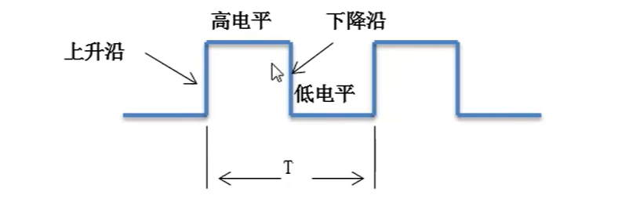
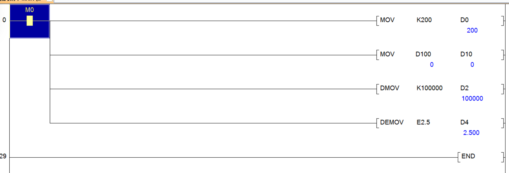
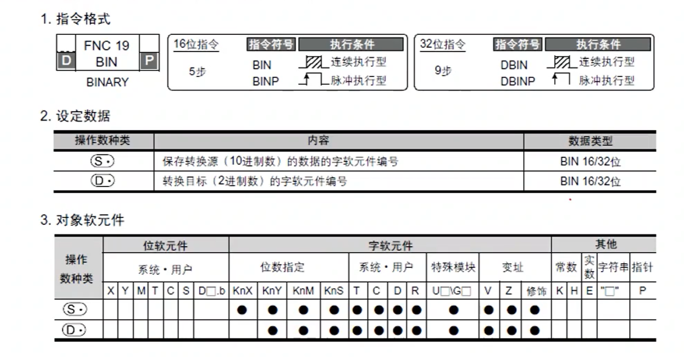
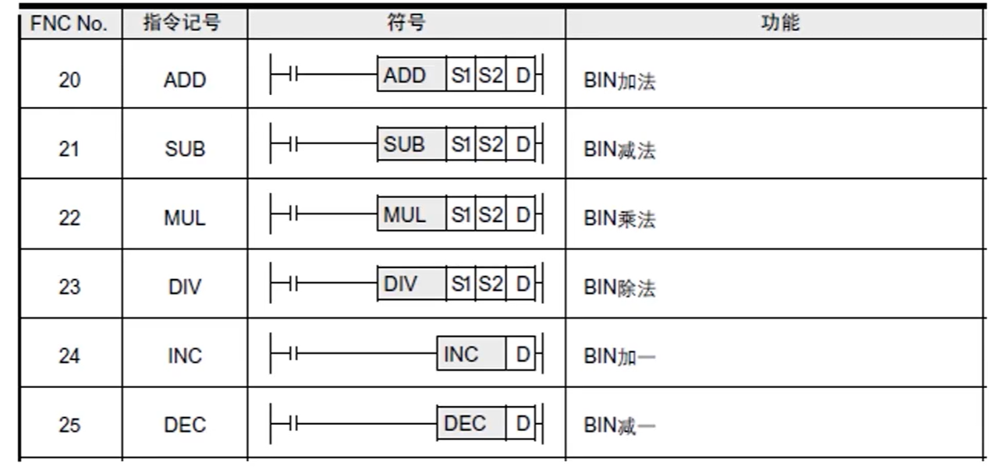
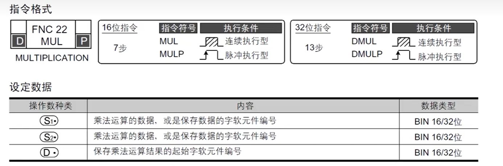
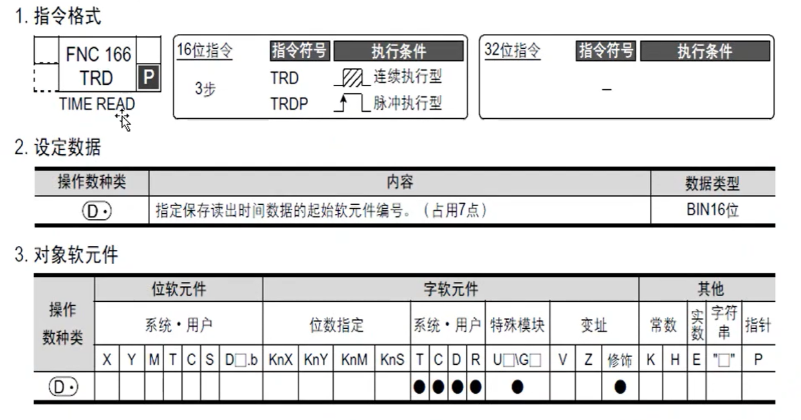
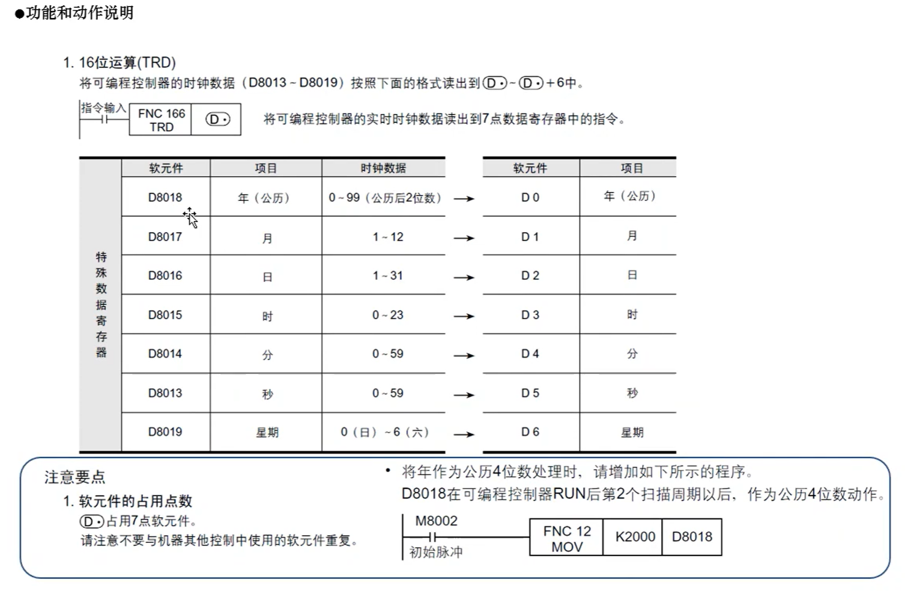
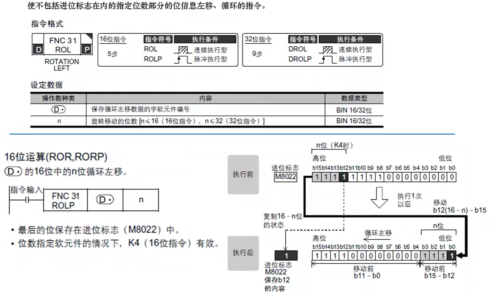

##  1.位指令

指令是指对PLC发出的操作命令，告诉PLC做什么、怎么做。一条完整的指令应该包含操作码和操作数，如“LDX1”、“SET YO”等，其中，“LD和SET”是操作码，“X1和YO”是操作数指令系统中可以没有操作数，如RET、END。

以下是几个常见的指令。

###  边沿触发与置复位指令

####  脉冲与时序图

**脉冲**：在数字操作系统中，所有的信号均为开关量，即信号状态只有0和1两种状态，用触点描述就是
断开与闭合状态。

一般称高电平为1，低电平为0.是正逻辑。反之则称为负逻辑。 

**时序图**：按时间顺序显示个对象关系的曲线示意图

#### 边沿触发与置位复位

- **边沿触发**：就是电流发生变化时的信号。低电平到高电平时的信号为上升沿。高电平到低电平的时候为下降沿
- **置位复位**：*set*将指定地址位置变成1且一直保持。复位：*rst*将地址值变为0，保持

特殊：*zrst*连续复位，复位几个相连的地址。

 

应用分析

 

练习：

 

### 定时器

使用定时器(T)时，用OUT指令设定定时时间。**梯形图中定时器一般只能通电（有输入信号时）计时一掉电就会被置位0，可以通过一些特定写法将定时器掉电保持**

- $$
  定时器实际定时时间(t)=K{定时器时基(T0)*设定值}
  $$

  

 

不作为定时器时也可以当做存储数据的数据寄存器使用。

ps：累计型定时器可以掉电保持。

练习：

 

### 计数器

使用计数器(C)时，用OUT指令设定计数值。
一般用计数器对计数条件的上升沿进行增计数，计数值与设定值相等时，计数器触点动作，用RST指令复位触点和当前值；计数器分为16位、32位计数器和高速计数器等种类，这里仅以16位正向计数器为例进行说明。

 

写法举例

 

## 2.应用指令介绍

#### 应用指令介绍

FX3U系列可编程控制器中准备了数据传送与比较、四则运算、数据循环和移位等基本应用指令，另外还有高速计数、高速脉冲输出等高速处理指令等，有些应用指令是将复杂的顺序功能封装而成的，因此使用这些指令将会使得编程工作量大大减轻；以下列出一些主要的应用指令：

####  指令阅读方法

###  mov指令

格式：mov [s] [d]

将传送源s的值赋值给目标d。

**在指令实际应用中需要注意，赋值指令的触发条件尽量运用边沿触发，因为被赋值的数据寄存器存储的数值不是固定不变的，根据触发条件，寄存器的值在不同时期、不同条件下给予的值是不一样的。** 

使用

软元件值监控

####  bcd转换

将BIN(2进制数)转换成BCD(1O进制数)后传送的指令，PLC的运算是按照BIN(2进制)数据进行处理的，在带BCD译码的7段码显示器中显示数值时，可使用本指令。在计算机中都是2进制来保存数据，因此要把一个10进制数据转换成2进制，才能保存在计算机中，BCD码转换很好的解决了这个问题。

 

####  bin转换

将BCD(1O进制数)转换成BIN2进制数)后传送的指令，将数字式开关之类以BCD(1O进制数)设定的数值转换成PLC运算中可以处理的BIN(2进制数]数据后读取的情况下，可使用本指令。

 

####  bcd和bin命令使用

 

### 四则运算

四则运算指令：将两个软元件的值进行四则运算，得出的结果放入第三的软元件中，

常用的运算指令如下表：

　

####  加法add指令

add [s1] [s2] [d]

将s1与s2之和放入d元件中

 

####  减法sub指令

sub [s1] [s2] [d]

 

####  乘法mul

mul [s1] [s2] [d]

 

 

####  除法div

 

####  整数转换为浮点数FLT

将BIN整数值装换成2进制浮点数（实数）指令，在涉及到浮点数运算的场合，一些存放了整数数值的寄存器要参与到运算中，首先需要转换本身的数据类型，以达到与同类型数据进行运算与比较的要求。

需要注意的是，由于在各2进制浮点数（实数]运算指令中，指定的K、H的值会自动转换成2进制浮点数，所以不需要使用FLT指令进行转换

 

使用

 

###  比较指令

####  CMP指令

CMP(16位)比较两个值，将其结果（大于、等于、小于）输出给软元件。(DCMP 32位）

 

 

####  区间比较ZCP

 

####  触点·比较

触点型比较指令LD=/>/>=/</<=/<>
对两个数值进行比较，当满足相对应的条件时，触点导通，不满足则断开。

 

【解释备注】
当C0>=3,并且<=5时，Y0得电；
当C0=3,或者C0=5时，Y1得电。

###  时钟指令

PLC自带实时时钟功能，通过内置电池保持时钟数据，当电池电量耗尽，时钟数据将会丢失，因此，在运用时钟功能时需要保证电池电量充满；利用可编程控制器可以对时钟数据进行运算、比较；此外，还可以对内置实时时钟的时间进行校准。

 

####  读时钟TRD

读出plc时钟数据的·指令

 

 

####  将时分秒数据转换成秒HTOS

​	 

###  移位指令

移位的数据只能是16/32位数据

####  循环右移指令ROR

使不包括进位标志在内的指定位数部分的位信息右移、循环的指令。

ROR [d] [n]

- d要移位的元件
- 移位的位数

移位时如果移到尾部，从高位开始重新移位。

####  循环左移ROL

 

####  位左移SFTL

只能对16位数据操作

 

 

####  向右移位SFTR

####  SUM指令

计算指定软元件数据有多少个为1（on）的指令

练习 

 

