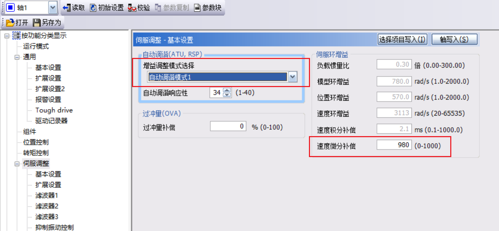

##   1.消除“零漂”现象

给零速度一个非常小的速度参数，使轴处在伺服控制的状态。伺服就不会移动了。

## 2.将伺服恢复出厂设置

PC控制软件上有一个**初始设置**的按钮点击就可以初始化伺服参数。

再点击“单轴写入”，将初始化参数值写入驱动器内存中，断电后再上电，这样初始化设置才有效。

## 3.增益、过滤器设定参数PB

主要应用于驱动器的动态性能优化，在位置或速度控制方式下去设置滤波器和陷波器的参数是为了消除机械设备在运行中的振动或共振。

通常在自动调整方式下设置增益参数和陷波器参数，以及抑制参数，使伺服系统稳定运行并使速跟踪。

一触式增益调节有两种调节方式：

- 1)使用MR Configurator2调试软件在PC机上进行调节；
- 2)使用驱动器面板按键进行调节。

### 使用MR Configurator2调试软件在PC机上进行调节

设置伺服循环往复运行

- 设置电机转速：600r/min(实际应用中，设置现场现场工作速度)
- 加减速时间常数：1000ms(根据现场设备负载情况设置)
- 移动量：51294304脉冲(调整脉冲个数，使工作台往复运行的范围为实际工作范围)
- 移动量单位选择：⊙检测器脉冲单位（电子齿轮无效）
- 使重复运行有效：
- 使老化功能有效：
  	目的使工作台可以无数次的重复往返运行。
- 滞留时间：可以设置1~2秒。

### 开始一键式调整增益

**2.一触式增益参数调节过程工作台往复运行（注意，一触式增益调节，伺服必须在运行状态)。**
1)点击“调整”项目，选择“一键式调整”项。
选择响应模式：⊙High模式（根据实际工作设备工艺要求选择)按下“开始”按键，就开始执行一触式增益调节。

**3.设置驱动器参数，实施一触式增益调节**
1)伺服驱动器参数设置

- PA01=1000;位置控制方式；
- PA21=0001电子齿轮比选择有效；
- PA06=800;电子齿轮比分子；
- PA07=1:电子齿轮比分母；
- PA13=0111;脉冲串+方向，负逻辑选择。
- PA14=0;同服电机旋转方向。

**4.将一键增益结果同步到伺服中。**

当一键增益参数计算完成后，不要急着先关闭窗口。要将结果参数写入到伺服的内存中并重启伺服，调节才会生效

### 总结

使用一触式增益调节要注意下面事项：
1)在转矩控制方式，不能进行一触式增益调节；
2)发生故障报警或运行不能继续的警告时，不能进行一触式增益调节。

有两种方式可以清除一触式增益调节结果
1)在PC机上使用MR Configurtor2调试软件清除；
2)使用驱动器面板操作清除。

## 4.自动增益调节方式1

### 1.概述
在使用一触式增益调节方式，负载变化比较频繁，不能满足工艺要求时，就使用自动增益调节方式1。

这种增益调节方式，驱动器能伯动实时检测运行设备的机械特性，即负载惯量比。并根据检测的结果自动设置最佳的增益参数值，使控制系统完美运行。

### 2.下列控制系统都不能使用自动增益调节方式1

- 1)从零速加速到2000r/min,加速时间常数大于50秒，动态调节过程比较缓慢的系统；
- 2)伺服电机转速小于150r/min的低速控制系统；
- 3)电机输出的最大转矩小于额定输出转矩的10%轻载系统；
- 4)负载惯量比大于100倍的特殊设备系统；
- 5)在加减过程中，负载变化频繁、剧烈，或者设备间隙过大，无法通过自动测试获得准确惯量比的控制系统。

◆以上控制系统需要采用自动增益调节方式2或手动调节方式。

### 4.自动增益调节方式1实施过程
1)首先让伺服电机在工作范围内以一定速度运行起来

​	方法有二：

​	a.使用伺服调试软件，在PC机上选择“测试运行”项目中“定位运行”项，使工作台往返运行。
​	b.使用PLC定位制程序控制伺服电机，使工作台往返运行。

2）使用伺服调试软件进行增益调节

- 启动MRConfigurator2调试软件，点击“参数”项目中的“参数设置”项。进入“伺服调整”一“基本设置”项。
- 设置PA08=0001；实时自动增益调节方式1（自动调谐模式1）。
- 手动调节PA09自动调谐响应性，其范围为1～40.
- 其结果是“伺服环增益”等五个参数就跟随PA09响应性数字的变化而自动改变。

### 5。**自动调谐响应性**PA09参数的功能
参数PAO9设置伺服系统整体的响应性，参数值设置越大，跟随性越好，系统的响应速度就越快，调整时间就越短，位置跟随误差也会越小。但是，参数值过大，就会产生振动和噪音。通常在不发生振动的情况下，设置PAO9参数值。

b.对于不同的机械设备，PA09参数值设置范围：

- 大型机械与重载传送带：PA09=8~12;
- 装御用机械手：PA09=11~16;
- 一般输送设备：PA09=13~19;
- 数控机床高精度位置控制设备：PA09=16≈21；
- 注塑机/压力机/包装机械等高速，冲击负载：PA09=19~24。

对于产生共振的设备，可以通过驱动器的自适应调整功能，自动设置滤波器、陷波器参数，以提高系统的响应性能。

## 5.自动增益调节方式2

在下列情况下，使用自动增益调节方式2

1)不能应用自动增益调节方式1，调节缓慢，低速运行；轻微负载以及负载惯量比超过100倍的系统。
2)负载惯量比可以通过计算或检测得到准确数值，并在运行过程中基本不变的系统。

实际上，自动增益调节方式2与调节方式1区别，仅在于负载惯量比设定方式不同，调节方式2用手动设定PB06负载惯量比。

1.自动增益调节方式2实施过程
1)首先让伺服电机在工作范围内以一定速度运行起来；
2)使用伺服调试软件进行增益调节。

- 设置PA01=1000;位置控制方式；
- 设置PA08=0002;自动增益调节方式2（自动调谐模式2)
- 手动调节PAO9,设置PB06负载惯量比参数。

结果：在运行中自动调节4个增益参数。不断的手动调节PA09参数，使伺服系统满足工艺要求。

## 6.机械共振抑制

在第6章讲解的增益参数调节，基本上能满足一般的控制系统的要求。不需要使用本章的特殊调整功能。

但是在增益调节过程中，对于一些复杂控制系统，会出现下列机械共振，所以就必须对系统进行特殊调整来抑制机械共振，清除振动。

1)机械系统有固有共振频率点)在不断提高伺服系统响应时，就可能产生共振。

2)伺服电机在加载负载时，电机驱动轴转动产生的共振，称之为轴共振。

3)对于一些长、短臂机械机构，产生尖端机械共振

以上几种机械共振现象，影响了响应性的提高，即阻止快速跟踪的提高。通过进行特殊调整，抑制这种机械共振，以提高响应性。它是增益调节的辅助手段。

### 1.机械共振抑制的工作原理

就是在机械共振频率点降低增益，使跟踪速度变慢，来抑制机械设备的共振。

### 2.自适应调整消除
机械共振的步骤

2)消除机械共振实施方法

4)自适应调整PB01参数的功能
在手动设定PA09响应性参数过程中，机械设备产生共振；并响应性还不能满足工艺要求，就要设置PB01参数。设置PB01=0001,自动检测共振频率自动设置参数PB13和PB14。完成之后PB01=0000自动复位到无效。

2)参数PB16设置共振抑制滤波器2有效

3)根据检测的共振频率，设置PB15陷波频率和参数PB16,设置陷波器的深度和宽度。

### 1.轴共振的工作原理
伺服电机在加载负载时，电机连接轴发生高频率的机械共振。轴共振抑制滤波器PB17可以抑制这种共振，提高系统稳定性。
### 2.消除轴共振方式

1)自动方式消除轴共振

- PB49=0000;设置机械共振滤波器4无效；抑制轴共振功能有效。
- PB23=0000;轴共振滤波器参数自动设置。

自动设置PB17参数，即自动设置共振抑制频率和陷波深度，消除
轴共振，提高伺服系统响应性。

