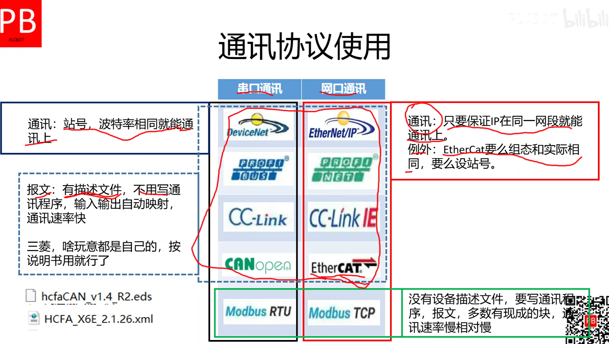
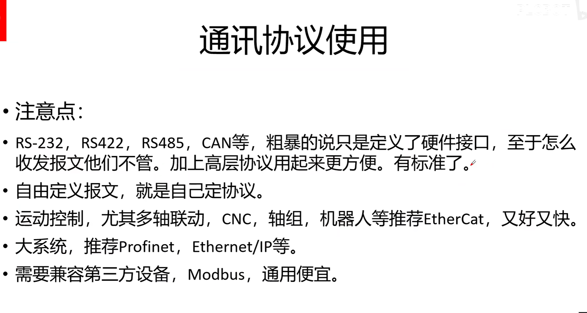

#  1.通讯协议总览

## **常见的PLC通信协议**：

1. **Modbus**：Modbus是一种串行通信协议，它支持多种物理层接口（如RS-232、RS-485等），可以实现PLC与其他设备（如HMI、变频器等）之间的数据交换。
2. **Profibus**：Profibus是一种用于工业自动化领域的现场总线通信协议。它支持高速数据传输和实时控制，适用于复杂的自动化系统。
3. **Ethernet/IP**：Ethernet/IP是一种基于以太网的工业通信协议，它结合了以太网和工业协议（如CIP）的特点，可以实现PLC与其他设备之间的高速数据交换和实时控制。
4. **Profinet**：Profinet是一种基于以太网的工业通信协议，它支持高速数据传输和实时控制，并提供了灵活的网络拓扑结构和设备管理功能。
5. **CANopen**：CANopen是一种基于CAN总线的开放式通信协议，广泛应用于工业自动化和机械控制领域。它支持多个设备之间的分布式控制和数据交换。
6. **DeviceNet**：DeviceNet是一种基于CAN总线的工业通信协议，它主要用于连接和控制设备，如传感器、执行器等。它提供了简单的设备配置和数据交换功能。
7. **Modbus TCP/IP**：Modbus TCP/IP是基于以太网的Modbus协议的变种，它使用TCP/IP协议进行数据传输，适用于远程监控和控制应用。
8. **OPC（OLE for Process Control）**：OPC是一种开放式标准，用于实现不同厂商的设备和软件之间的互操作性。它提供了统一的接口和数据模型，简化了PLC与其他设备之间的通信。 常用于与MES通信。
