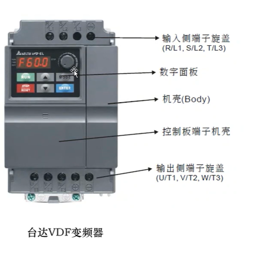
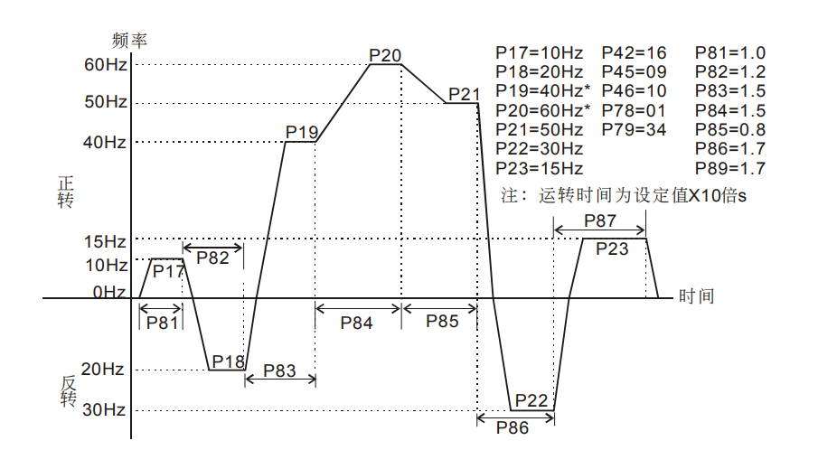

#  变频器

####  特点

对电动机的启动与停止的柔性控制、调速、转矩控制、过载保护、参数检测、控制设备精度等。这些特
点在工业控制中都起到了非常重要的作用。如今，在工业设备控制的各行各业都能够看到变频器的应用。

###  变频器的调速原理

 

电机的旋转速度取决于电机的极数和频率。电机的极对数一般是固定不变的，所以不适合改变极对数来调节电机的速度。另外，频率是电机供电电源的电信号，所以该值能够在电机的外面调节后再供给电机，这样电机的旋转速度就可以被自由的控制。因此，以控制频率为目的的变频器，是做为电机调速设备的优选设备。

改变频率和电压是最优的电机控制方法。如果仅改变频率，电机将被烧坏。特别是当频率降低时，该问题就非常突出。为了防止电机烧毁事故的发生，变频器在改变频率的同时必须要同时改变电压，例如：为了使电机的旋转速度减半，变频器的输出频率必须从60Hz改变到30Hz,这时变频器的输出电压就必须从200V改变到约100V。

###  台达VDF变频器

 

##  台达变频器自动运转设置（VFD-M 系列）

范例五： 可程序运转一周期后停止（连续模式）。 动作解说： 下图主要说明的是当连续模式时，各阶段运转在时间上的区分。  请特别注意P82、P83、P86、P87的时间区间计算

特别说明﹕自动运转指令与寸动运转指令是一个单一执行命令的功能，动作的执行并不需要运 转指令的配合；只要是在停止的状态中接受到自动运行的信号，便依照程序运转， 运转中其他的命令输入就不接受，除了自动运行暂停、b.b.、及故障外会中断自动 运转外，交流电机驱动器会忠实的执行每一个阶段运转

#  触摸屏

#  编码器

# 三色灯

红灯：

- 闪烁：一般故障
- 常量：严重故障

黄灯：

- 闪烁：设备正在维护/手动操作
- 常量：维护结束，可以启动，无错误

绿灯：

- 闪烁：设备正在自检/自动模式
- 常量：设备正常运行

蜂鸣器：一般和红灯一起动作	
