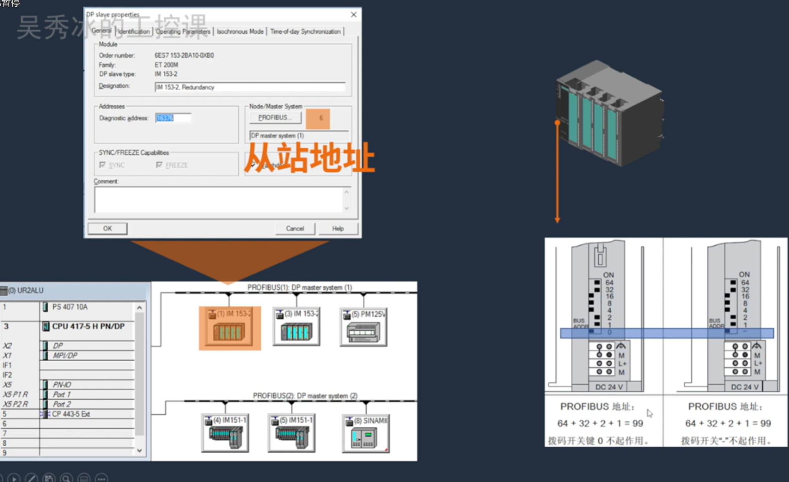
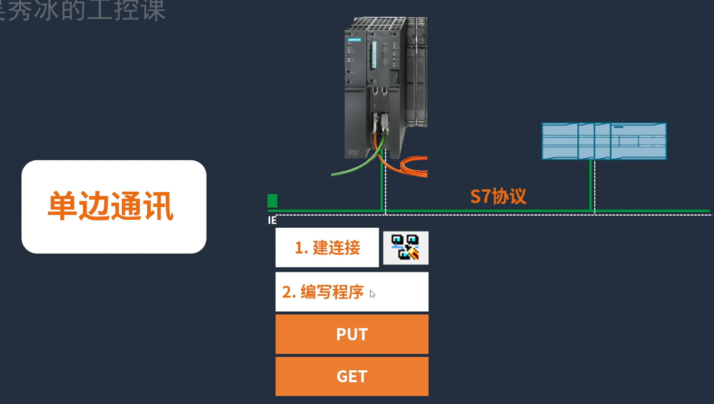

## 0.0通信协议应用场景

先划分职责，CPU和现场通信首选DP通信（PN协议）

### CPU与现场通信

### CPU与CPU图形

首选S7协议。不过S7是秒级通信，PN/DP通信是毫秒级通信

如果想要高实时性，可以将CPU制作成PN从站。

如果两个CPU都不支持将设备配置为智能从站，那就加模块。

### 总结

### 异常诊断框架

问题诊断流程

### 常见问题

#### 一台PLC可以与几台PLC通信？有什么限制

DP设备

IO设备

S7通信

## 01.基础知识

通信三要素：协议、角色、网络。

协议：S7、modbus、Profinet-DP、Profinet-IO

网络：硬件安装规则，网口、串口

角色：软件网络组态。主从

通信有两种方式，串口与网口。

### Profinet-DP通信

应用场景：

### Profinet-IO通信

应用场景：

主控

### S7协议

S7是应用层协议。

场景

### 注意

实际场景中一定要沟通好谁是主站设备，谁说从设备。确定好角色，才能开发好项目。

## 2. Profinet DP协议详解

dp协议主要是解决控制层与现场层通信的问题。

### 常见参数

PROFIBUS DP

- 通讯数据/设备     244 Bytes输入/输出
- 站点个数              32站点/单网段、124个从站/整个网络
- 通讯网络长度       1000m(由波特率决定)
- 通讯站点地址       拨码开关设置地址
- 传输速率               最大12Mbps,典型1.5Mbps
- 网络拓扑               标准线性网络（可有OLM实现星型或环形）

网络长度：

| 波特率      | 9.6-187.5kbit/s | 500 kbit/s | 1.5 Mbit/s | 3-12 Mbit/s |
| ----------- | --------------- | ---------- | ---------- | ----------- |
| 电缆长度(m) | 1000            | 400        | 200        | 100         |

### 工业现场常见DP网络拓扑

## 3.PN-IO通信（Profinet-io）

### 关键参数

常见参数
PROFINET-IO

- 通讯数据/设备      1440 Bytes输入/输出
- 节点个数                如CPU每个接口250个【具体数量查看技术数据】
- 通讯网络长度        电：最长100m,光：Km级
- 通讯站点地址       软件分配、自动分配
- 传输速率               100Mbps
- 网络拓扑               非常灵活，线型，星型，树型，环形

### 网络拓扑

非常灵活，可以以自己需要的方式随意组网。

## 4.S7协议

控制层间的通信。控制与操作层直接按的通信。

## 5.RS485串口网络

通过9针串口连接。。最主要的是3、8			

**485的A相（负极）与B相（正极）**

### 使用自己做的网线时

## 6.以太网网络

西门子的网线组成

## 7.角色详解

### 控制器与设备

### 主站与从站

### 服务器与客户端

## 8.硬件安装规则

### 485串口连接

网络拓扑

详细连接方式。

安装时，开始与结束都从进线端连接。且连接上终端电阻。。中间的设备，进出按标识即可，且不需要加终端电阻。

常用规则总结：
1.终端电阻
2.进线位置
1D:91373210/84630278（西门子手册ID）

更多硬件安装
规则参考：
物理站点个数
通讯距离与波特率
中继器/OLM

### 以太网连接

常用规则总结：
1.线形连接
2.星形连接

## 9.软件组态规则

现场总线协议

### 过程IO映射

非cpu处理

CPU处理

### 物理485通信处理

站号处理，从站可以通过拨码开关设置站号

### 网络配置

设备组态。

设备不存在可以在西门子官网找，也可以直接导入GSD文件。

分配组态的名称和网络

设置IO

### S7

#### 单边通信

#### 双边通信

组态角色

### PB-DP软件组态规则：

1组态角色(主站从站)
2设置站地址与引0地址

## 10.实战

### PN-DP通信步骤

### S7单边通信配置

