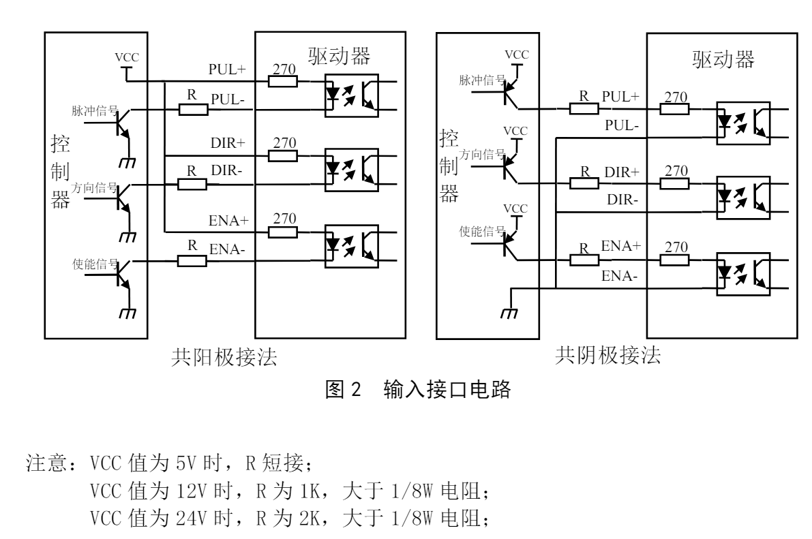
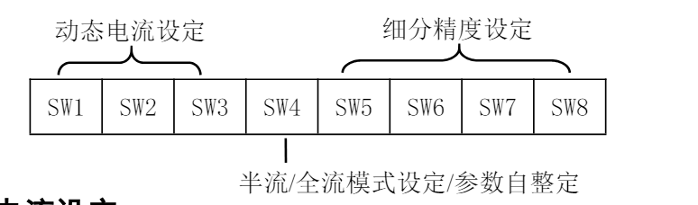
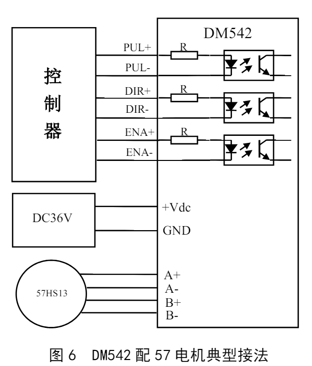
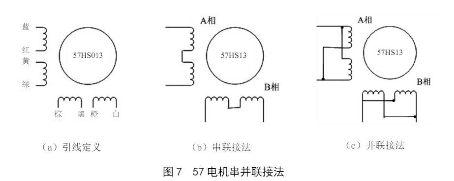
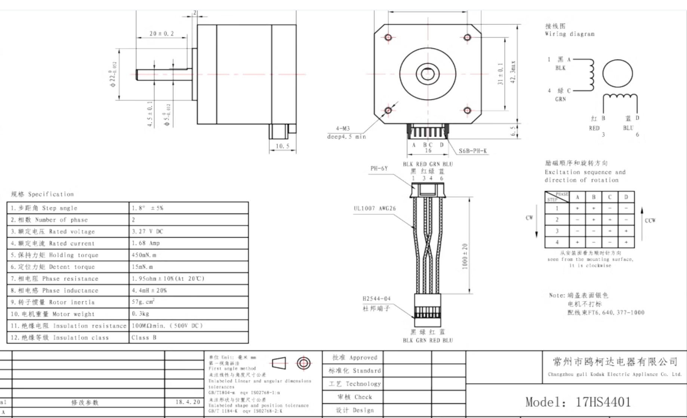

#  1.步进控制器知识

##  已雷赛dm542为例

### 1.接口描述

|          名称           |                             功能                             |
| :---------------------: | :----------------------------------------------------------: |
| PUL+（+5V）/PUL-（PUL） | 脉冲控制信号：脉冲上升沿有效；PUL-高电平时4～5V，低电平时0～0.5V。为了可靠响应脉冲信号，脉冲宽度应大于 1.2μs。如采用+12V 或+24V时需串阻。 |
| DIR+（+5V）/DIR-（DIR） | 方向信号：高/低电平信号，为保证电机可靠换向，方向信号应先于脉冲信号至少 5μs 建立。电机的初始运行方向与电机的接线有关，互换任一相绕组（如A+、A-交换）可以改变电机初始运行的方向，DIR-高电平时4～5V，低电平时0～0.5V。 |
| ENA+（+5V）/ENA-（ENA） | 使能信号：此输入信号用于使能或禁止。ENA+ 接+5V，ENA-接低电平（或内部光耦导通）时，驱动器将切断电机各相的电流使电机处于自由状态，此时步进脉冲不被响应。当不需用此功能时，使能信号端悬空即可。 |

###  2.强电接口

|  名称  |                     功能                     |
| :----: | :------------------------------------------: |
|  GND   |                  直流电源地                  |
|   +V   | 直流电源正极，范围+20V—+50V，推荐值+24~48VDC |
| A+、A- |               电机 A 相线圈。                |
| B+、B- |               电机 B 相线圈。                |

### 3.控制信号接口电路 

DM542 驱动器采用差分式接口电路可适用差分信号，单端共阴及共阳等接口，内置高速 光电耦合器，允许接收长线驱动器，集电极开路和 PNP 输出电路的信号。在环境恶劣的场合， 我们推荐用长线驱动器电路，抗干扰能力强。现在以集电极开路和 PNP 输出为例，接口电路 示意图如下：

### 4.电流、细分拨码开关设定和参数自整定

DM542 驱动器采用八位拨码开关设定细分精度、动态电流、静止半流以及实现电机参数 和内部调节参数的自整定。详细描述如下：

#### 1．电流设定

工作（动态）电流设定

| 输出峰值电流 | 输出均值电流 | SW1  | SW2  | SW3  |
| :----------: | :----------: | :--: | :--: | :--: |
|    1.00A     |    0.71A     |  on  |  on  |  on  |
|    1.46A     |    1.04A     | off  |  on  |  on  |
|    1.91A     |    1.36A     |  on  | off  |  on  |
|    2.37A     |    1.69A     | off  | off  |  on  |
|    2.84A     |    2.03A     |  on  |  on  | off  |
|    3.31A     |    2.36A     | off  |  on  | off  |
|    3.76A     |    2.69A     |  on  | off  | off  |
|    4.20A     |    3.00A     | off  | off  | off  |

静止（静态）电流设定 

静态电流可用 SW4 拨码开关设定，off 表示静态电流设为动态电流的一半，on 表示静态 电流与动态电流相同。一般用途中应将 SW4 设成 off，使得电机和驱动器的发热减少，可靠 性提高。脉冲串停止后约 0.4 秒左右电流自动减至一半左右（实际值的 60％），发热量理论 上减至 36％。

####  2.细分设定

| 步数/转 | SW5  | SW6  | SW7  | SW8  |
| :-----: | :--: | :--: | :--: | :--: |
|   400   |  on  |  on  |  on  |  on  |
|   800   |  on  | off  |  on  |  on  |
|  1600   | off  | off  |  on  |  on  |
|  3200   |  on  |  on  | off  |  on  |
|  6400   | off  |  on  | off  |  on  |
|  12800  |  on  | off  | off  |  on  |
|  25600  | off  | off  | off  |  on  |
|  1000   |  on  |  on  |  on  | off  |
|  2000   | off  |  on  |  on  | off  |
|  4000   |  on  | off  |  on  | off  |
|  5000   | off  | off  |  on  | off  |
|  8000   |  on  |  on  | off  | off  |
|  10000  | off  |  on  | off  | off  |
|  20000  |  on  | off  | off  | off  |
|  25000  | off  | off  | off  | off  |

#### 参数自整定功能 

若 SW4 在 1 秒之内往返拨动一次，驱动器便可自动完成电机参数和内部调节参数的自整定；在电机、供电电压等条件发生变化时请进行一次自整定，否则，电机可能会运行不正常。注意此时不能输入脉冲，方向信号也不应变化。 

- 实现方法 1) SW4 由 on 拨到 off，然后在 1 秒内再由 off 拨回到on；

- 实现方法 2) SW4 由 off 拨到 on，然后在 1 秒内再由 on 拨回到off。

### 5.典型接线案例

DM542 配 57 系列电机串联，并联接法（若 电机转向与期望转向不同时，仅交换 A+、A－的 位置即可），DM542 驱动器能驱动四线、六线或八 线的两相/四相电机。下图是 DM542 配 57HS13 步 进电机的典型接法：

注意： 

1）不同的电机对应的颜色不一样，使用时以电机资料说明为准，如 57 与 86 型电机线颜色是 有差别的。 

2）相是相对的，但不同相的绕组不能接在驱动器同一相的端子上（A+、A-为一相，B+、B为另一相），雷赛 57HS13 电机引线定义、串、并联接法如图 7 所示。

3）DM542 驱动器只能驱动两相混合式步进电机，不能驱动三相和五相步进电机。

 4）判断步进电机串联或并联接法正确与否的方法：在不接入驱动器的条件下用手直接转动电 机的轴，如果能轻松均匀地转动则说明接线正确，如果遇到阻力较大和不均匀并伴有一定 的声音说明接线错误

##  电机参数

