#  1.程序逻辑指令

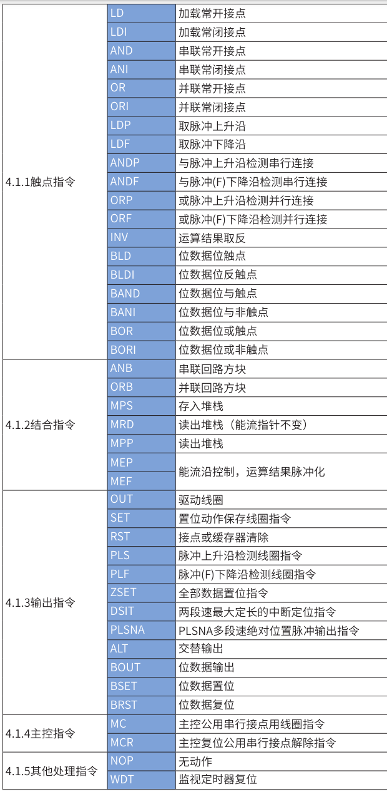

###  1触点指令

| 指令 |            功能             |
| :--: | :-------------------------: |
|  LD  |        加载常开接点         |
| LDI  |        加载常闭接点         |
| AND  |        串联常开接点         |
| ANI  |        串联常闭接点         |
|  OR  |        并联常开接点         |
| ORI  |        并联常闭接点         |
| LDP  |        取脉冲上升沿         |
| LDF  |        取脉冲下降沿         |
| ANDP |  与脉冲上升沿检测串行连接   |
| ANDF | 与脉冲(F)下降沿检测串行连接 |
| ORP  |  或脉冲上升沿检测并行连接   |
| ORF  | 或脉冲(F)下降沿检测并行连接 |
| INV  |        运算结果取反         |
| BLD  |        位数据位触点         |
| BLDI |       位数据位反触点        |
| BAND |       位数据位与触点        |
| BANI |      位数据位与非触点       |
| BOR  |       位数据位或触点        |
| BORI |      位数据位或非触点       |

###  2结合指令

| 指令名称 |            功能            |
| :------: | :------------------------: |
|   ANB    |        串联回路方块        |
|   ORB    |        并联回路方块        |
|   MPS    |          存入堆栈          |
|   MRD    |  读出堆栈（能流指针不变）  |
|   MPP    |          读出堆栈          |
|   MEP    | 能流沿控制，运算结果脉冲化 |
|   MEF    | 能流沿控制，运算结果脉冲化 |

###  3输出指令

| 指令名称 |            指令功能             |
| :------: | :-----------------------------: |
|   OUT    |            驱动线圈             |
|   SET    |      置位动作保存线圈指令       |
|   RST    |        接点或缓存器清除         |
|   PLS    |     脉冲上升沿检测线圈指令      |
|   PLF    |    脉冲(F)下降沿检测线圈指令    |
|   ZSET   |        全部数据置位指令         |
|   DSIT   |  两段速最大定长的中断定位指令   |
|  PLSNA   | PLSNA多段速绝对位置脉冲输出指令 |
|   ALT    |            交替输出             |
|   BOUT   |           位数据输出            |
|   BSET   |           位数据置位            |
|   BRST   |           位数据复位            |

###  4其他指令

| 指令名称 |           指令功能           |
| :------: | :--------------------------: |
|    MC    |  主控公用串行接点用线圈指令  |
|   MCR    | 主控复位公用串行接点解除指令 |
|   NOP    |            无动作            |
|   WDT    |        监视定时器复位        |

##  重要指令

###  pls、plf

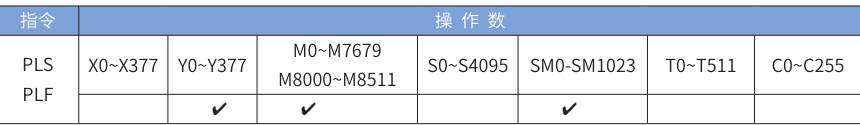

当PLS 指令被上升沿驱动时，其指定的元件被设定为ON状态，该ON状态仅持续1个扫描周期； 

当PLF 指令被下降沿驱动时，其指定的元件被设定为ON状态，该ON状态仅持续1个扫描周期。

 指令举例：

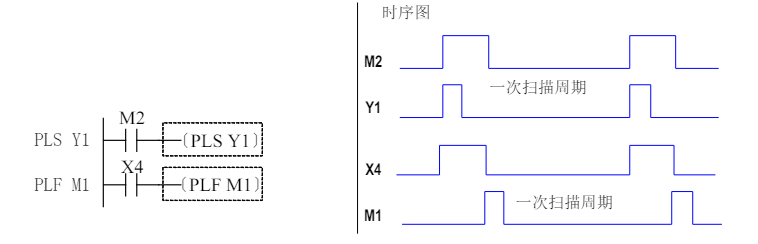

###  DSIT 两段速最大定长的中断定位指令

启动后，加速到设定的高速输出段输出频率运行；当高速输出位置段脉冲结束后自动切换到低速寻标段输出 频率运行，检测到中断输入信号后，保持当前输出频率，并输出设定的脉冲个数；当没有检测到中断输入信号， 则输出设定的最大脉冲数。注：高速输出段不响应输入中断信号。只有晶体管输出 PLC 才能使用该指令。

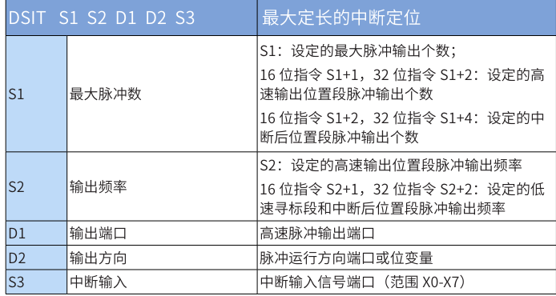

S1 为指定的输出脉冲数，包括最大脉冲数、中断后位置段脉冲数和高速输出段脉冲数。16bit 指令时，范围是－ 32768 ～ 32,767；32bit 指令时，范围是 -2,147,483,648 ～ 2,147,483,647。其中负号表示反方向。S1 中“最 大脉冲数”的正负决定了脉冲输出方向。 输出脉冲数，是相对于下面的当前值寄存器作为相对位置：

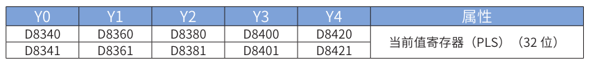

反转时，当前值寄存器的数值减小。

 S2 为指定的高速输出段和低速寻标段（中断发生后）的输出脉冲频率，16bit 指令时，范围为 10 ～ 32767Hz；32bit 指令时，范围为 10 ～ 200,000Hz；

 D1 为脉冲输出端口；可指定 Y0/Y1/Y2/Y3/Y4； 

D2 运行方向输出端口或位变量，输出为 ON 状态，表示为正向运行；否则为反向运行。 

S4 为指定的中断信号输入端口，可指定 X0-X7。

当指令能流为 OFF 时，将减速停止；此时执行完成标志 M8029 不会动作；指令驱动接点变为 OFF 后，减速 停止过程中即（脉冲输出中标志处于 ON），将不接受指令的再次驱动。当能流由 OFF → ON 时，脉冲输出 处理重新开始；指令执行完毕，M8029 标志置为 ON；

脉冲输出示意图，如下：

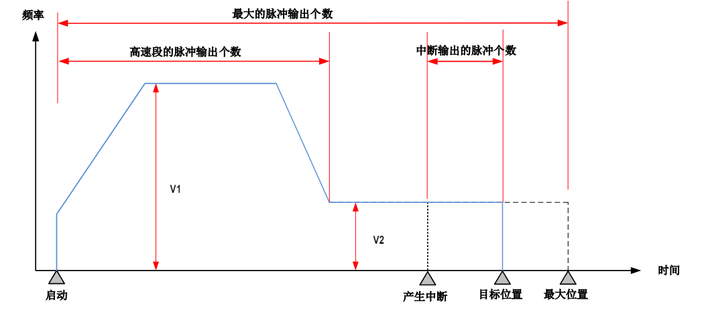

###  PLSNA 多段速绝对位置脉冲输出指令

以设定的输出端口，按照设定的每一段输出脉冲频率和脉冲个数，连续输出。基于绝对位置的运动，运行中 有加减速，但运行中不允许换向。

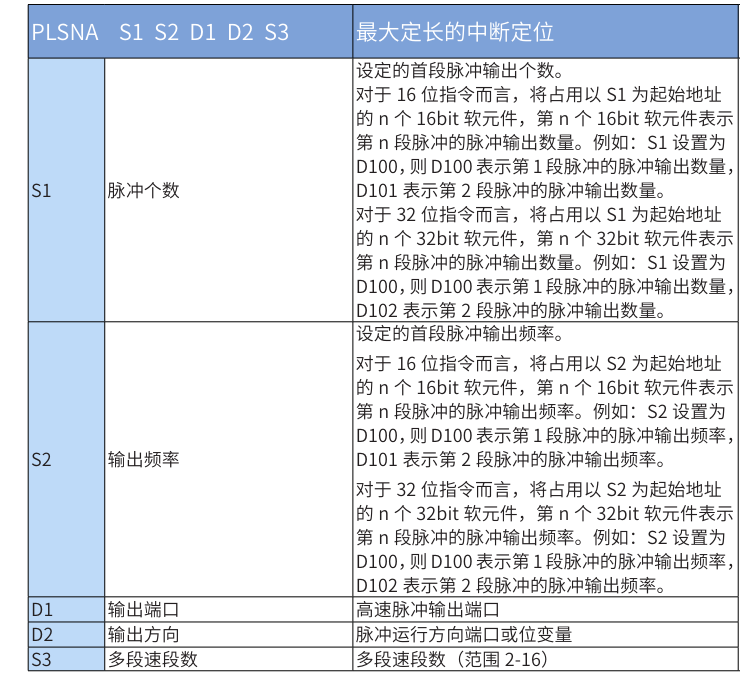

该指令是按指定的端口、频率和运行方向输出脉冲，当检测到中断信号后，继续输出给定的脉冲数，令伺 服执行机构在当前位置的基础上作偏移量的运动；只有晶体管输出 PLC 才能使用该指令。其中： S1 为指定的首段输出脉冲数。使用 16bit 指令时，范围是－ 32768 ～ 32,767；32bit 指令时，范围 是 -2,147,483,648 ～ 2,147,483,647。其中负号表示反方向；其正负决定了脉冲输出方向。

输出脉冲数，是相对于下面的当前值寄存器作为相对位置：

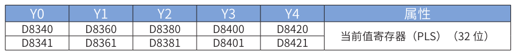

反转时，当前值寄存器的数值减小。

S2 为指定的首段输出脉冲频率。使用之后连续的软元件存储其余段速的输出脉冲频率。16bit 指令时，范围 为 10 ～ 32767Hz；32bit 指令时，范围为 10 ～ 200,000Hz；

 D1 为脉冲输出端口；可指定 Y0/Y1/Y2/Y3/Y4； 

D2 运行方向输出端口或位变量，输出为 ON 状态，表示为正向运行；否则为反向运行，仅由第一段脉冲个 数 S 正负号决定。

 S3 为指定的脉冲段数，可指定 2-16 段。

###  ALT交替输出

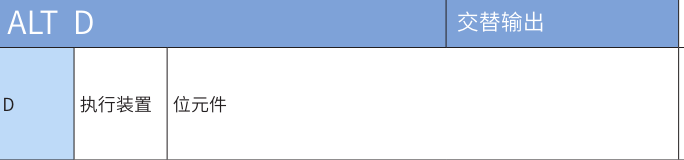

该指令的功能是能流有效时，将D元件的状态反转。其中D为位变量元件。 一般使用脉冲执行型ALTP指令。

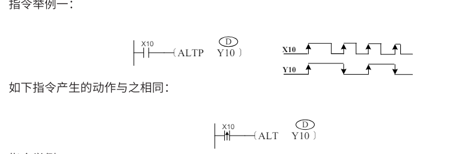

若在指令能流中引入定时器，可方便地实现振荡器输出（此功能也可以用特殊定时器STMR指令来实现）

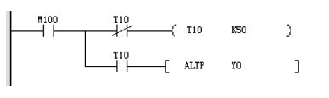

###  BOUT 位数据输出-（BSET/BRST类似）

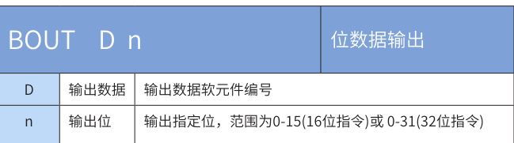

将BOUT指令之前的逻辑运算结果输出至指定的位

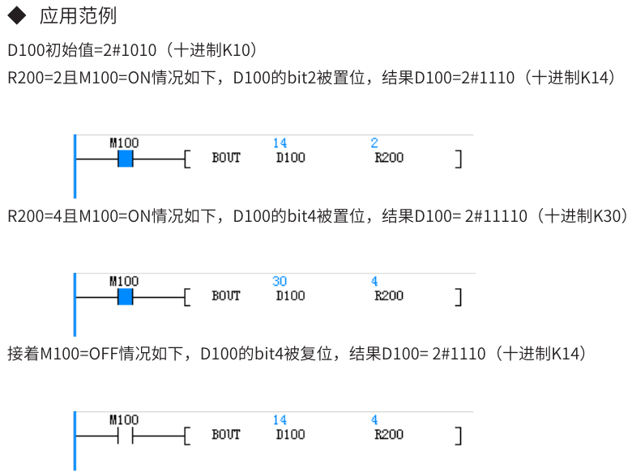

###  WDT 监视定时器复位

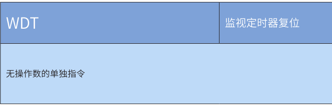

PLC系统内有用于监视用户程序执行一次的时间是否超时的定时器，若超时即会停止用户程序的执行并报 警，执行WDT指令即可将该监视定时器复位，让监视定时器重新开始计时，避免超时错误。

 若用户程序所执行的操作过于复杂（例如过多的循环计算），执行时有可能出现运行超时错误， 编程时若必要，可用WDT指令（例如在FOR~NEXT指令之间中插入该指令）； 

如果程序扫描时间大于D8000的值（默认200ms），可以在程序间插入WDT指令将每段程序分成扫描时间低 于200ms或者根据需要修改D8000的设定值。

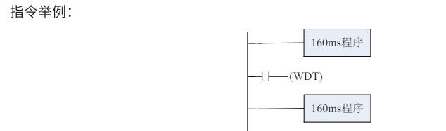

此程序扫描时间是320ms，用WDT指令将程序分割为2部分，使得每部分程序扫描时间都在200ms以下。

###  MEP MEF运算结果脉冲化

指令是使运算结果脉冲化的指令，不需要指定软元件编号 

1） MEP 在到MEP指令为止的运算结果，从OFF→ON时变为导通状态。 如果使用MEP指令，那么在串联了多个触点的情况下，非常容易实现脉冲化处理 

2） MEF 在到MEF指令为止的运算结果，从ON→OFF时变为导通状态。 如果使用MEF指令，那么在串联了多个触点的情况下，非常容易实现脉冲化处理

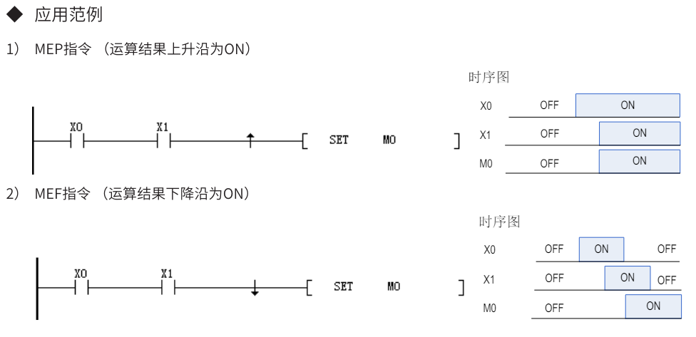

#  2.程序流程指令

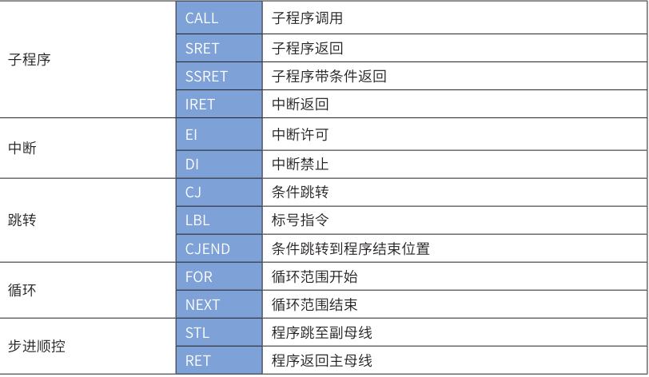

###  子程序调用

| 指令  |       功能       |
| :---: | :--------------: |
| CALL  |    子程序调用    |
| SRET  |    子程序返回    |
| SSRET | 子程序带条件返回 |
| IRET  |     中断返回     |

###  中断、循环、步进

| 指令 |      功能      |
| :--: | :------------: |
|  EI  |    中断许可    |
|  DI  |    中断禁止    |
| FOR  |  循环范围开始  |
| NEXT |  循环范围结束  |
| STL  | 程序跳至副母线 |
| RET  | 程序返回主母线 |

###  跳转

| 指令  |          功能          |
| :---: | :--------------------: |
|  CJ   |        条件跳转        |
|  LBL  |        标号指令        |
| CJEND | 条件跳转到程序结束位置 |

##  重要指令

###  FOR 循环范围开始、NEXT 循环范围结束

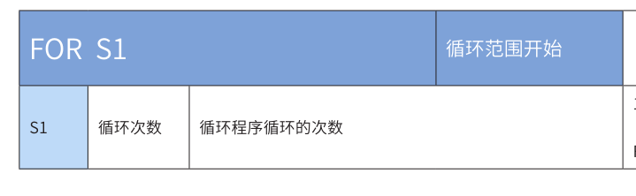

FOR指令用于一个循环的起始，同时指明循环执行的次数，必须与NEXT指令配套使用。

NEXT指令用于指示循环区域的尾部。由FOR指令指定FOR~NEXT循环来回执行N次后跳出FOR~NEXT循环往 下继续执行。

在FOR~NEXT指令的循环区间，可以嵌入另一个FOR~NEXT循环，但规定：从最外层的FOR~NEXT计算，最 多可内嵌6层FOR~NEXT循环。运行时PLC会以各FOR~NEXT层对应解析执行。但需要注意当循环次数过多 时，会使PLC扫描周期延长，可能造成逾时监视定时器动作而导致错误产生。可在FOR~NEXT指令之间使用 WDT指令来改善。

有下列情况者，都会出错：

-  NEXT指令在FOR指令之前；
-  有FOR指令而无NEXT指令；
-  在FEND，END指令以后有NEXT指令；
-  FOR指令与NEXT指令个数不一致等。

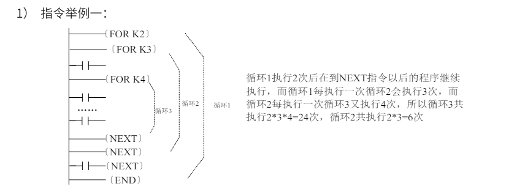

#  3.数据比较

##  触点比较

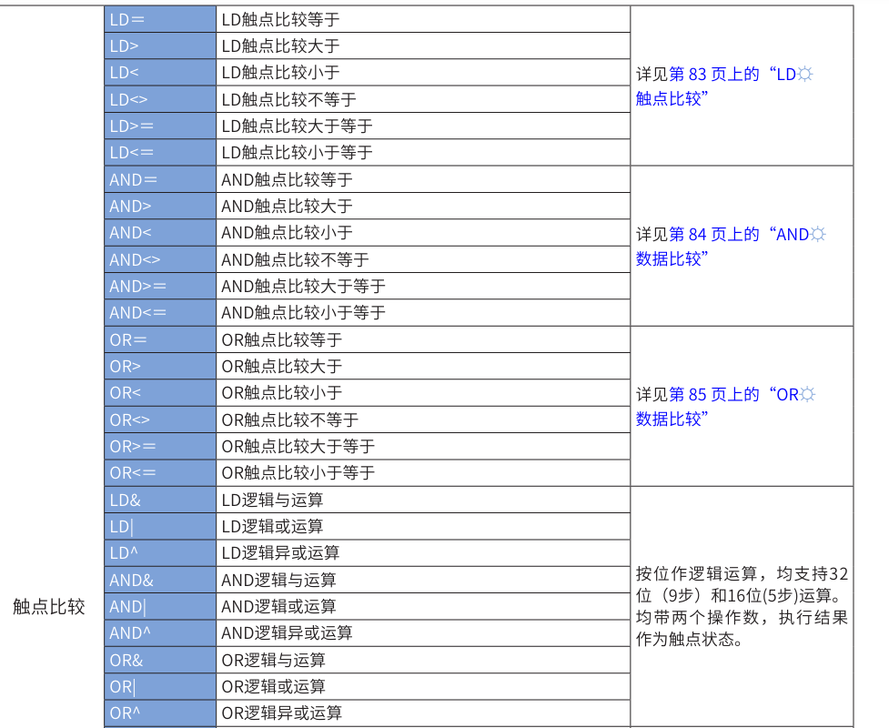

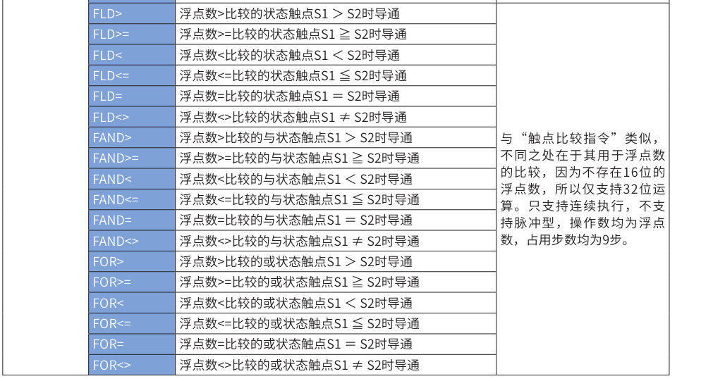

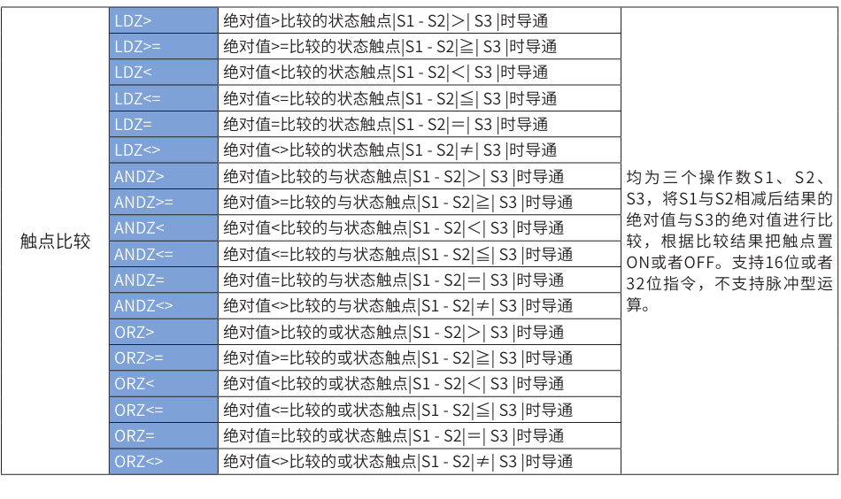

##    比较输出

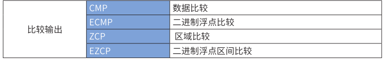 

| 指令 |        用途        |
| :--: | :----------------: |
| CMP  |      数据比较      |
| ECMP |   二进制浮点比较   |
| ZCP  |      区域比较      |
| EZCP | 二进制浮点区间比较 |

#  4.数据运算

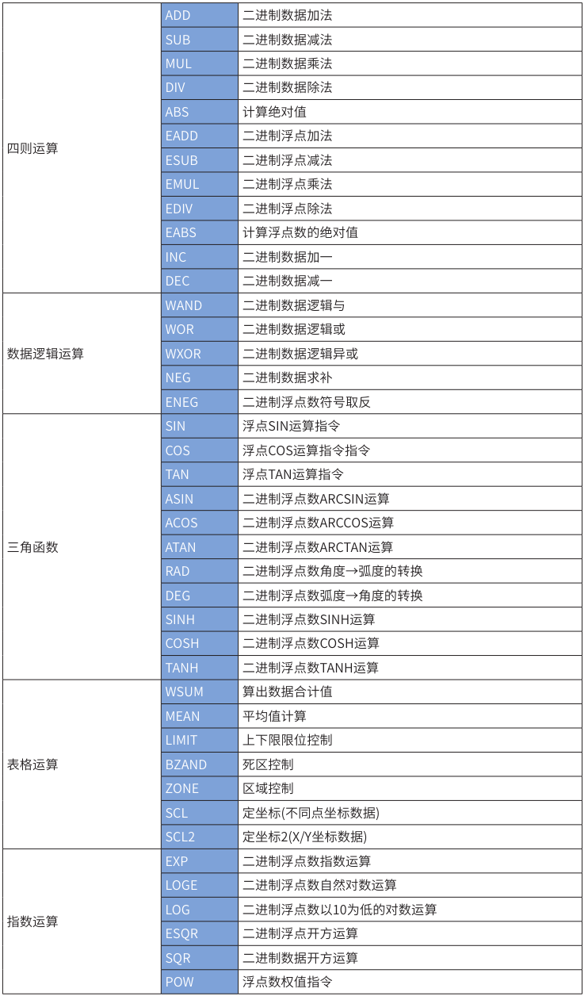

#  5.数据处理

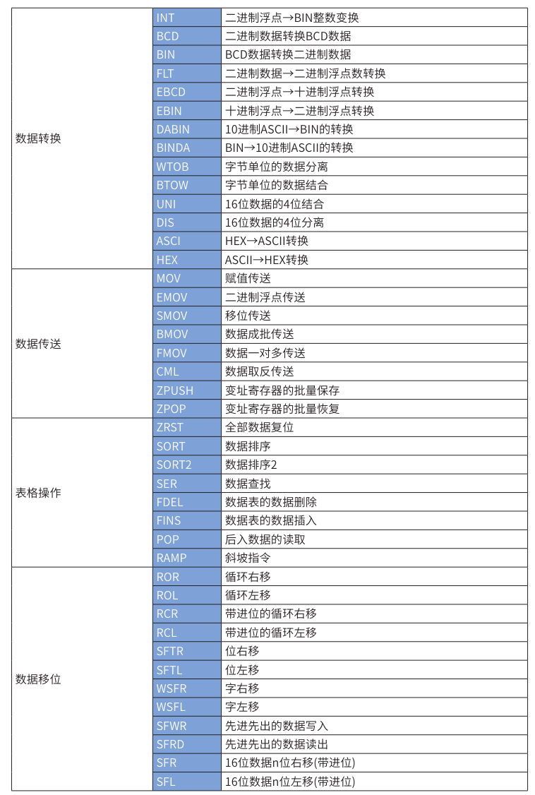 

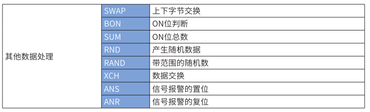 

###  1 数据转换

| 指令  |                  含义                   |
| :---: | :-------------------------------------: |
|  INT  |  二进制浮点→BIN整数变换（浮点的取整）   |
|  BCD  | 二进制数据转换BCD数据（十进制转二进制） |
|  BIN  | BCD数据转换二进制数据（二进制转十进制） |
|  FLT  |       二进制数据→二进制浮点数转换       |
| EBCD  |        二进制浮点→十进制浮点转换        |
| EBIN  |        十进制浮点→二进制浮点转换        |
| DABIN |          10进制ASCII→BIN的转换          |
| BINDA |          BIN→10进制ASCII的转换          |
| WTOB  |           字节单位的数据分离            |
| BTOW  |           字节单位的数据结合            |
|  UNI  |            16位数据的4位结合            |
|  DIS  |            16位数据的4位分离            |
| ASCI  |              HEX→ASCII转换              |
|  HEX  |              ASCII→HEX转换              |

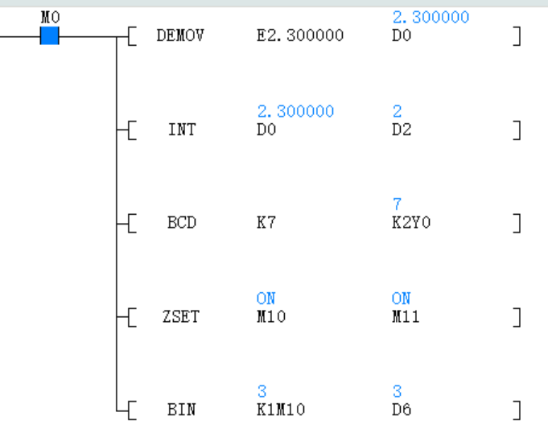 

###  BINDA BIN→10进制ASCII的转换

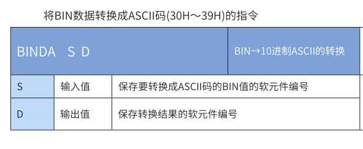

#### 1） 16位指令 

● 将[S]的16位数据(BIN)按照10进制的各个位数转换成ASCII码(30H～39H)，然后保存到[D]开始的软元件 中。

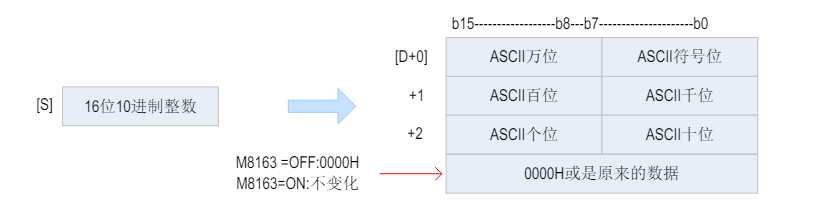

运算结果如下： 

• 16位数据为正时，符号位保存“20H(空格)”，为负时保存“2DH(-)”。 

• 有效位数的左侧的0时保存“20H(空格)”。

 • 根据M8163的ON/OFF状态确定[D+3]的值。

####  2） 32位指令

将32位数据(BIN)按照10进制的各个位数转换成ASCII码(30H～39H)，然后保存到[D]开始的软元件中

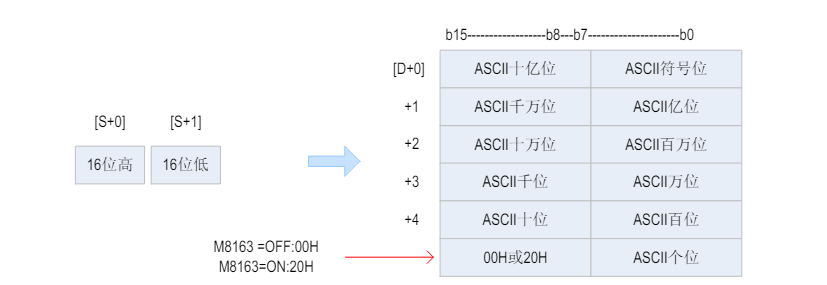 

运算结果如下：

 • 16位数据为正时，符号位保存“20H(空格)”，为负时保存“2DH(-)”。

 • 有效位数的左侧的0时保存“20H(空格)”。

 • 根据M8163的ON/OFF状态确定[D+5]的高字节数据

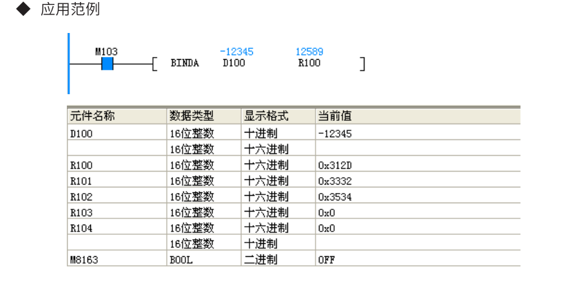

###  WTOB字节单位的数据分离/BTOW 字节单位的数据结合

将[S]开始的软元件中保存的16位数据以字节为单位保存到以[D]开始的n点软元件的低8位中，高8位保存 00H。

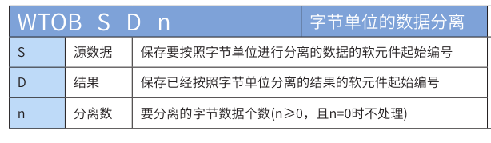

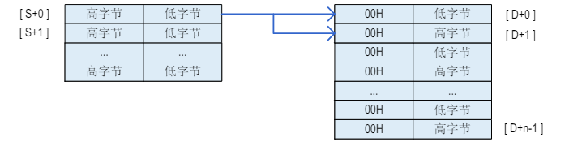

以下一些情况会报故障。出错标志位M8067置ON，同时出错代码保存于D8067。 

当[S]、[D]开始的软元件超出其软元件范围时，报6705号错误。

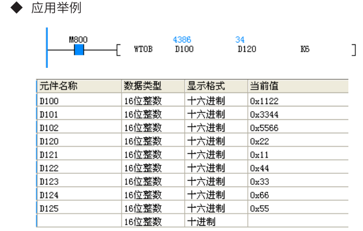

###  UNI 16位数据的4位结合/DIS 16位数据的4位分离

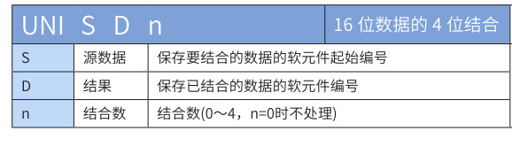

将S起始的n个16位数据的低4位结合成16位数据保存到D中。 n的取值范围1~4。n=0时，指令不执行。n取值1~3时，剩余高位0填充。

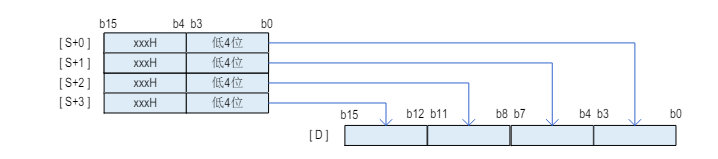

以下一些情况下会发生运算错误，错误标志位M8067置ON，错误代码保存在D8067中。

 1）S中设定的软元件超范围时，报错误代码K6705； 

2）n设定超范围时，报错误代码K6706。

将D100开始的3个软元件的低4位组合成16未数据，不足位数0填充，处理结果存储于D120。

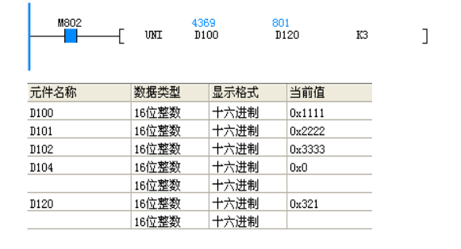

###  ASCI HEX→ASCII转换/HEX ASCII→HEX转换

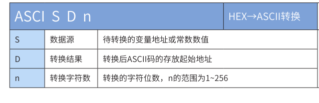

该指令是将S的值转换成ASCII码后，存储到D为起始地址的变量中。其中： 

- S为待转换的变量地址或常数数值； 

- D为转换后ASCII码的存放起始地址；

- n为转换的字符位数（范围为：1~256）。

 ASCI数值转换遵照ASCII与HEX进制数值对照表，如：ASCII‘0’对应HEX‘H30’；ASCII‘F’对应 HEX‘H46’等。

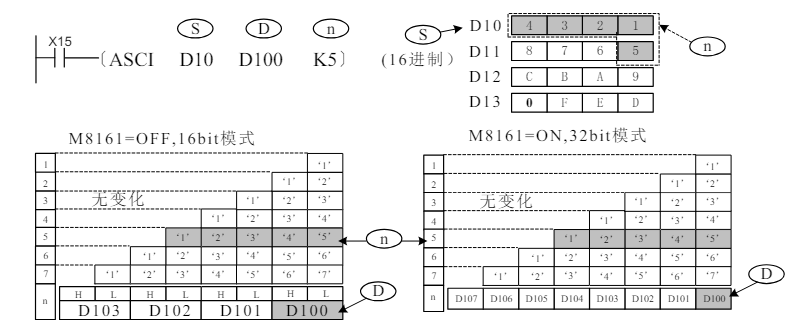

其中，M8161标志决定了计算结果存放目的变量的宽度模式，当M8161=OFF时，为16bit模式，即变量的高 字节和低字节分别存储；当M8161=ON时，为8bit模式，只有变量的低字节存储结果，因此实际使用变量区 域的长度增加。

##  2 位移操作

| 指令  |         含义         |
| :---: | :------------------: |
|  MOV  |       赋值传送       |
| EMOV  |    二进制浮点传送    |
| SMOV  |       移位传送       |
| BMOV  |     数据成批传送     |
| FMOV  |    数据一对多传送    |
|  CML  |     数据取反传送     |
| ZPUSH | 变址寄存器的批量保存 |
| ZPOP  | 变址寄存器的批量恢复 |

###  SMOV 移位传送

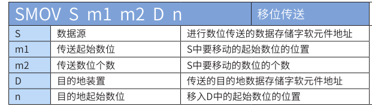

需要触点驱动，最多有5个操作变量，其中： 

- S为待复制的数据源变量，当M8168为OFF时是BCD模式（十进制的位），M操作数的范围是0000~9999，不 能为负数。当M8168为ON时是BIN模式，S操作数可以是负数。 

- m1为数据源传送的起始位号，（1～4）范围；

- m2为数据源传送的位数，（1～m1）范围； 

- D为数据源传送的目的变量； 

- n为数据源传送的目的变量的起始位，（m2～4）范围。

 数据位的传送过程与特殊标志M8168的状态有关，当M8168为OFF时是BCD模式（十进制的位），当M8168 为ON时是BIN模式，在BIN模式下以4个位作为一个单位作传送（十六进制的位）。

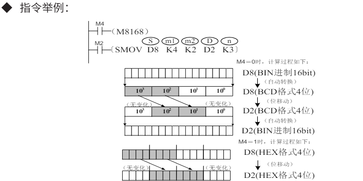

假设D8=K1234，D2=K5678，则当M8168为OFF时（BCD模式），将M2置ON，则D2的值变为K5128； 当M8168为ON时（BIN模式），此时D8=H04D2=K1234，D2=H162E=K5678，将M2置ON，则 D2=H104E=K4174。

###   BMOV 数据成批传送

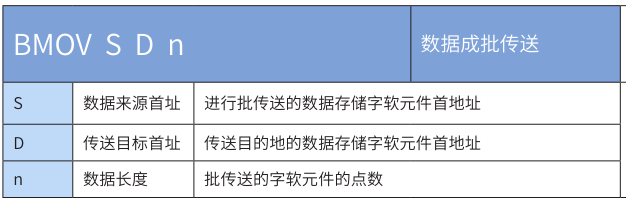

需要触点驱动，有3个操作变量，将由S指定起始地址的n个变量值复制到由D指定起始地址的n个单元中。 其中n的取值范围是1～512。 当特殊变量M8024＝1时，成批传送的方向相反，即将由D指定起始地址的n个变量值复制到由S指定起始地 址的n个单元中。

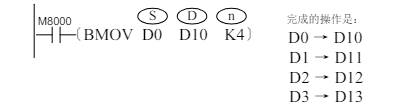

###  FMOV 数据一对多传送

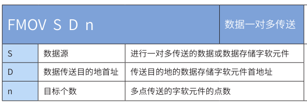

需要触点驱动，有3个操作变量，将由S的数据复制到由D指定起始地址的n个单元中。

 其中n的取值范围是1~512。

 FMOV是16位的多点传送指令，DFMOV是32位多点传送。

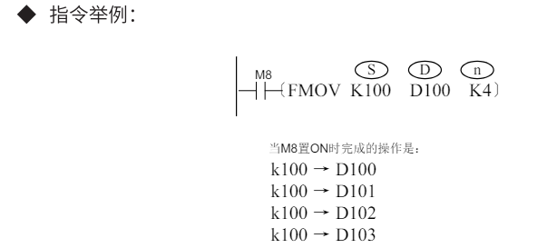

###  CML 数据取反传送

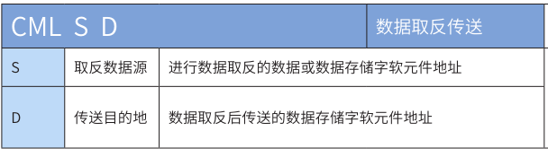

需要触点驱动，有2个操作变量，将S的BIN值逐位取反后复制到D中。当D的位数不足16bit时，将S取反后按 低位对齐传送到D变量中；当为32bit指令（DCML）时，S和D都会使用相邻高地址的变量单元参与运算。例 如语句：〔DCML D1 D5〕的操作结果是：/D1→D5；/D2→D6

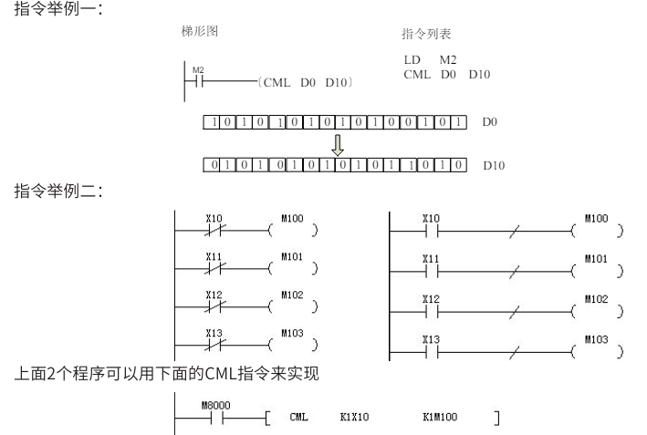

​	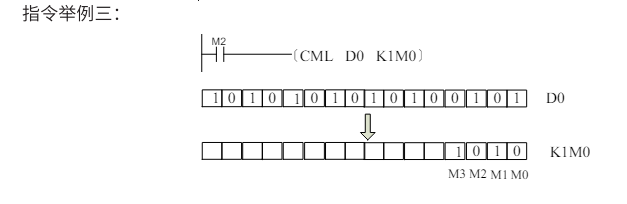

##  3 表格操作

| 指令  |       含义       |
| :---: | :--------------: |
| ZRST  |   全部数据复位   |
| SORT  |     数据排序     |
| SORT2 |    数据排序2     |
|  SER  |     数据查找     |
| FDEL  | 数据表的数据删除 |
| FINS  | 数据表的数据插入 |
|  POP  |  后入数据的读取  |
| RAMP  |     斜坡指令     |

###  SORT数据排序（升序）/SORT2 数据排序2（降序）

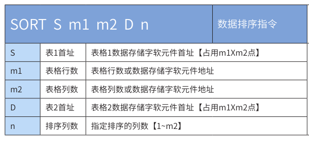

​	当驱动条件成立时，对以S为首址的m1行m2列的数据表格的第n列数据进行升序排列，排列结果存储到以D 为首址的数据表格中。

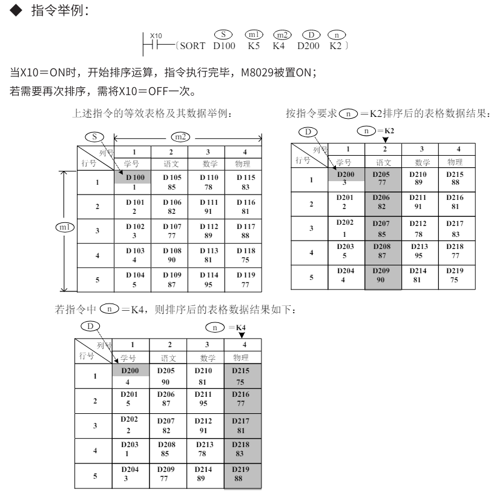

###  SER 数据查找

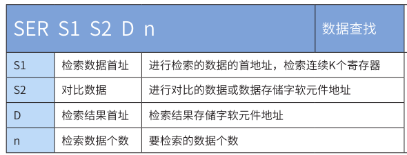

当驱动条件成立时，从以源址S1为起始的k个数据中，检索出符合条件S2的数据的地址，存放于以D为首址 的5个寄存器中。

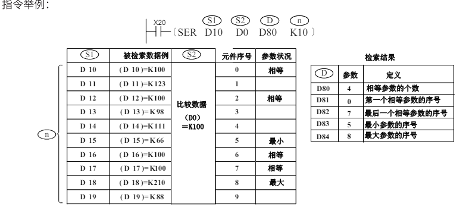

使用说明： 当指令能流X20为ON时，方才进行比较。比较的方法为有符号数的代数比较方法进行，例如－8<2； 当最小值、最大值有多个时，分别显示序号最大的元件； 存储检索结果的单元占用D开始的5个连续单元。若不存在相等数据时，上例中的D80～D82均为0。

###  FDEL数据表的数据删除/FINS数据表的数据插入

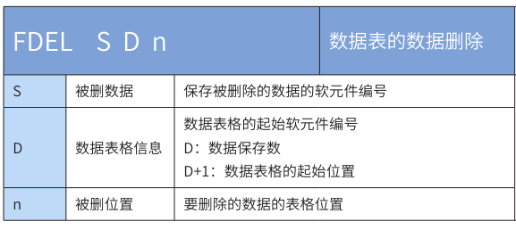

删除从[D+1]开始的数据表格的第n个数据，将删除的数据保存到[S]中，同时[D+1]中第n+1个开始的数据逐 个向前靠拢，且数据保存数[D]减1。

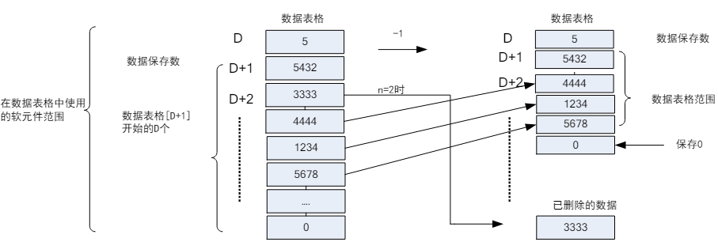

以下一些情况会报故障。出错标志位M8067置ON，同时出错代码保存于D8067。

 1）数据保存数超出相应软元件范围时，报6705号错误； 

2）被删位置n＞数据保存数[D]时，报6706号错误； 

3）n设定值≤0时，报6706号错误； 

4）数据保存数设定值≤0时，报6706号错误。

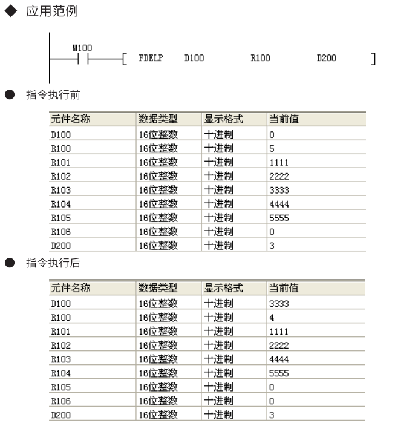

##  4 数据移位

| 指令 |          含义           |
| :--: | :---------------------: |
| ROR  |        循环右移         |
| ROL  |        循环左移         |
| RCR  |    带进位的循环右移     |
| RCL  |    带进位的循环左移     |
| SFTR |         位右移          |
| SFTL |         位左移          |
| WSFR |         字右移          |
| WSFL |         字左移          |
| SFWR |   先进先出的数据写入    |
| SFRD |   先进先出的数据读出    |
| SFR  | 16位数据n位右移(带进位) |
| SFL  | 16位数据n位左移(带进位) |

###  ROR 循环右移

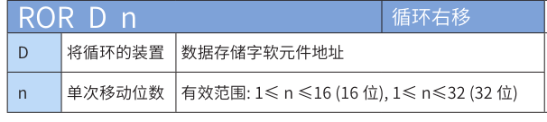

将D的内容连同进位标志M8022循环右移n位。本指令一般使用脉冲执行型指令。当为32bit指令时，寄存器 变量则占用后续相邻地址的共2个单元： 若D中指定KnY、KnM、KnS时，只有K4（16bit）及K8（32bit）有效；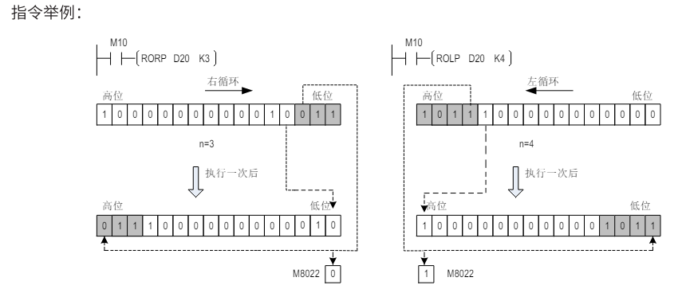

## 5 其他数据处理

###  SWAP上下字节交换

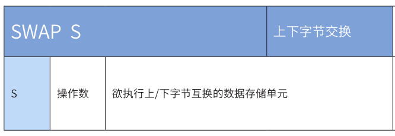

该指令是将指定变量S的高低字节的值进行互相交换。 

16 位指令时，高8 位与低8 位的值进行互相交换。 

32 位指令时，两个寄存器的高8 位与低8 位的值各自进行互相交换 

注意此指令一般使用脉冲执行型指令，否则若采用连续执行指令，则程序每扫描一次，就会进行一次交换。

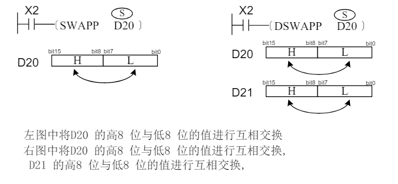

###  BON ON位判断

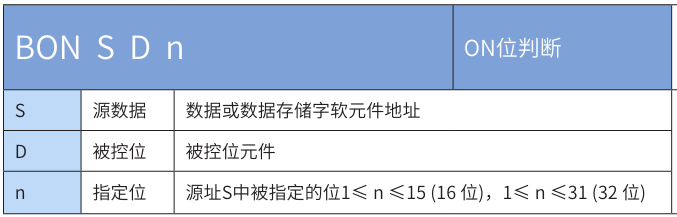

判断S的第n位的状态，结果存入D。

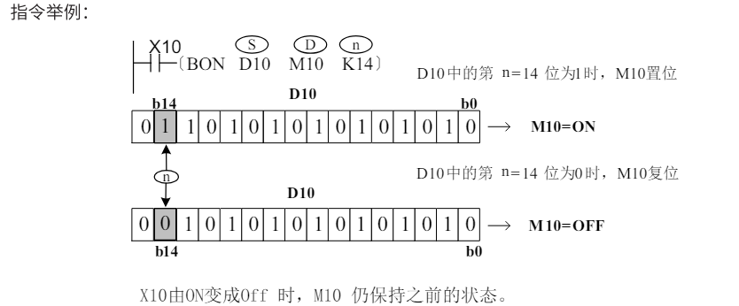

### SUM ON位总数

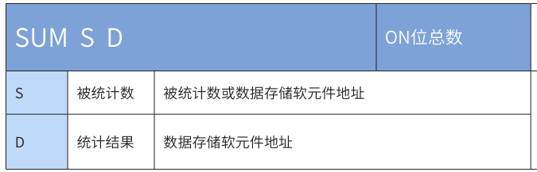

计算S的BIN进制值中为1的位个数，存入D。 

使用D SUM和D SUM P指令的情况下，（S+1，S）的32位中的1的个数写入D，同时D+1全部为0。 

若S中的位全部为零，则零标志位M8020会置ON

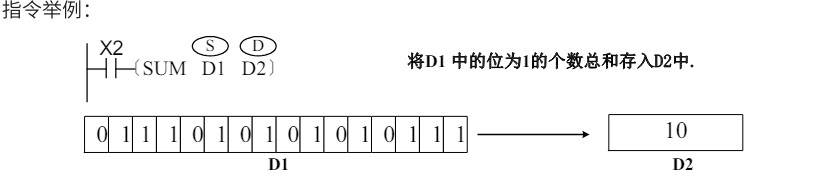

###  RND产生随机数据

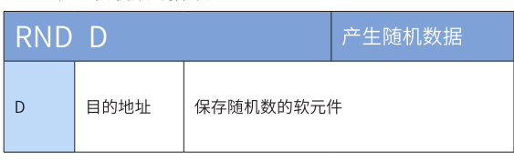

这个指令产生0～32767的伪随机数，将其数值作为随机数保存到[D]中。 

请在STOP → RUN 时仅仅写入一次非0的数值(-2,147,483,648 ～ 2,147,483,647)至（D8311，D8310）作为 初始值。

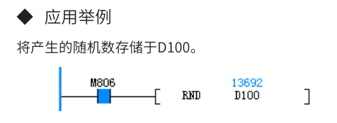

### RAND：带范围的随机数

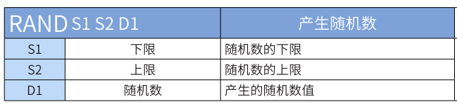

下限：随机数的范围下限。 

上限：随机数的范围上限。 

随机数：产生的随机数结果，该指令产生介于范围下限和范围上限之间的随机数。如果范围 S1>S2，会报错

### XCH 数据交换

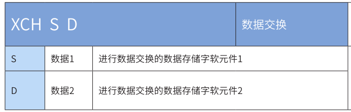

需要触点驱动，有2个操作变量，将S和D的值彼此交换。

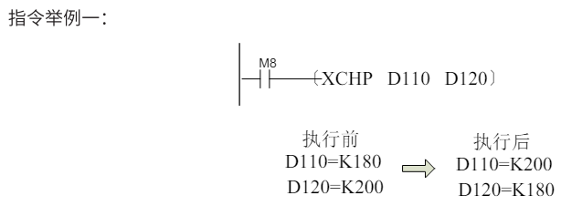

当特殊变量M8160＝1时，且D与S为同一地址，完成的操作将是高8位与低8位的交换，32位的指令也一样， 完成的操作将是高8位与低8位的交换。相当于SWAP指令的操作。一般用SWAP指令来实现。

### ANS信号报警的置位

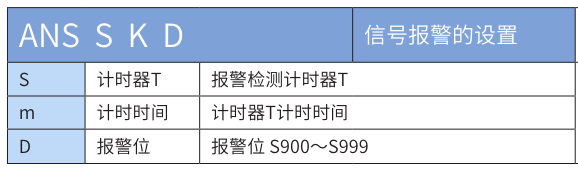

驱动信号报警器的方便指令。

 其中S的范围为T0~T199，D的范围为S900~S999

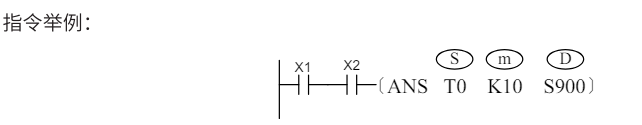

如果X1和X2同时接通1秒以上，则S900被置位，以后即使X1或X2为OFF状态，S900仍保持动作状态（但是 T0会复位，值变成0）。若不满1秒，X1或X2变为OFF时，定时器复位。 

如果预先将M8049（信号报警器有效）置ON，则信号报警器S900~S999中最小ON状态编号被存入D8049 （ON状态最小编号）且当S900~S999中任意一个为ON时，M8048（报警器动作置ON）。

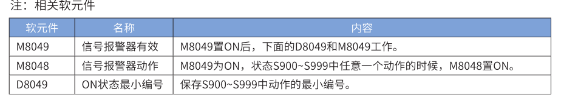

###  ANR信号报警的复位

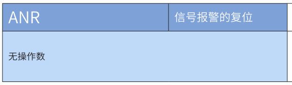

当驱动条件有效时，对报警状态继电器S900～S999进行批复位

# 矩阵指令

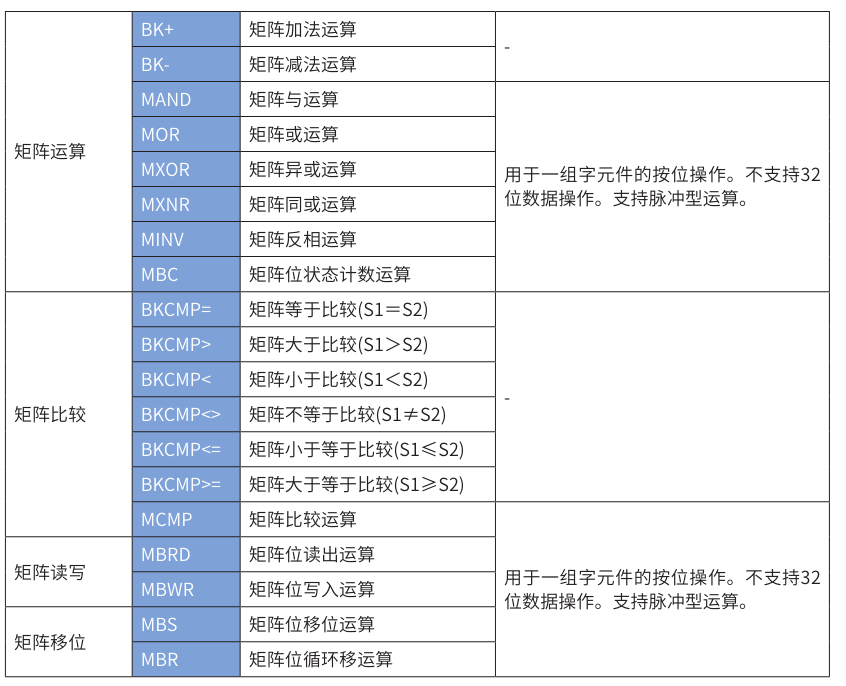

##  1 矩阵运算

| 指令 |        功能        |
| :--: | :----------------: |
| BK+  |    矩阵加法运算    |
| BK-  |    矩阵减法运算    |
| MAND |     矩阵与运算     |
| MOR  |     矩阵或运算     |
| MXOR |    矩阵异或运算    |
| MXNR |    矩阵同或运算    |
| MINV |    矩阵反相运算    |
| MBC  | 矩阵位状态计数运算 |

### BK+ 矩阵加法运算

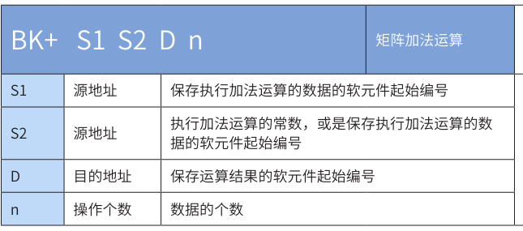

将[S1]开始的n个（16/32位）数据和[S2]开始的n个(16/32位)数据进行加法运算，运算结果存储于[D]开始的 ｎ个（16/32位）单元中。

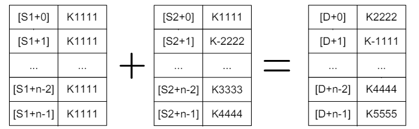

可以在[S2]中直接设定（16/32位）有符号常数。

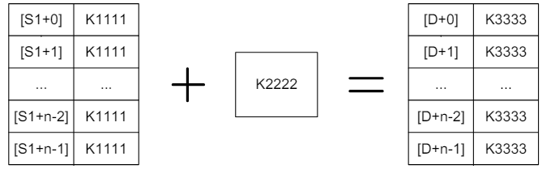

以下一些情况会报故障，指令不执行。出错标志位M8067置ON，同时出错代码保存于D8067。 1）从[S1]、[S2]、[D]开始的软元件超出了该类元件的范围，报6705号错误； 2）从[S1]或[S2]开始软元件和[D]开始的软元件有重叠部分时，报6705号错误。

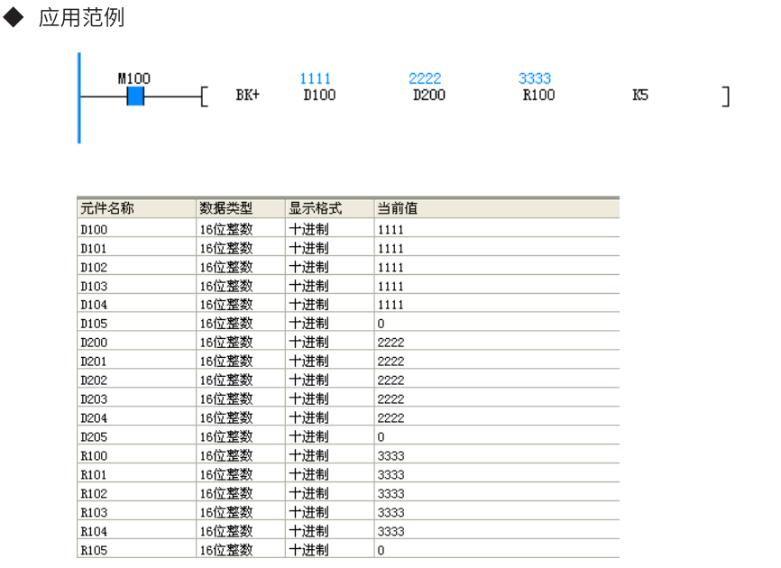

###  MINV矩阵反相运算

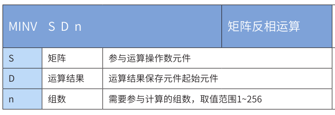

软元件[S]开始的n字节数据进行按位取反的运算，结果存储于[D]开始的软元件中。

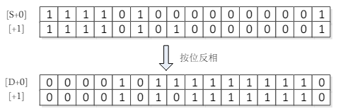

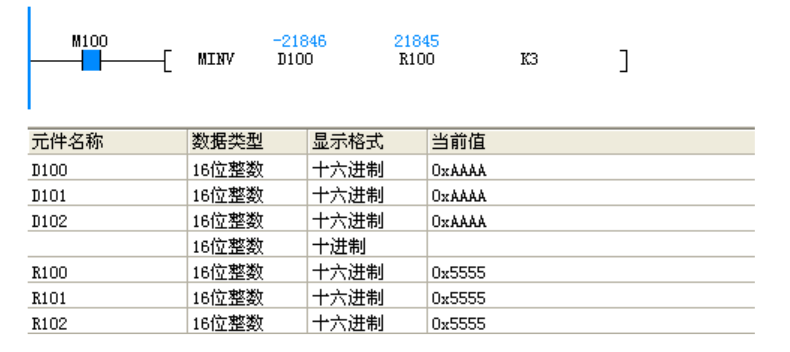

### MBC矩阵位状态计数运算

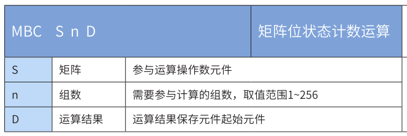

计算出[S]开始的n组16位数据组成的位矩阵中0位或者是1位的个数，结果存储于[D]中。 

当M8331置ON时，计算矩阵位为1的个数，反之，计算矩阵位为0的个数。 

当计算结果为0时，M8332置ON。

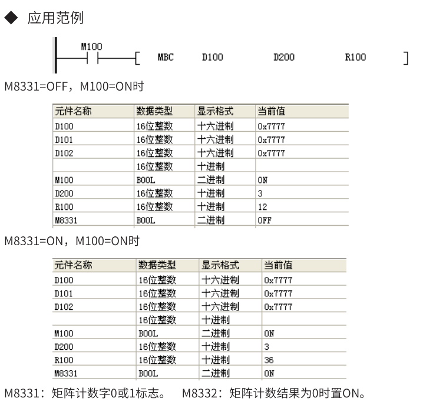

##  2 矩阵比较

|  指令   |          功能           |
| :-----: | :---------------------: |
| BKCMP=  |  矩阵等于比较(S1＝S2)   |
| BKCMP>  |  矩阵大于比较(S1＞S2)   |
| BKCMP<  |  矩阵小于比较(S1＜S2)   |
| BKCMP<> |  矩阵不等于比较(S1≠S2)  |
| BKCMP<= | 矩阵小于等于比较(S1≤S2) |
| BKCMP>= | 矩阵大于等于比较(S1≥S2) |
|  MCMP   |      矩阵比较运算       |
|         |                         |
|         |                         |

### MCMP矩阵比较运算

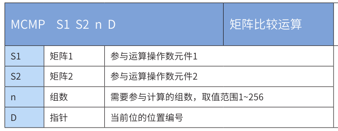

1）将组数同为n的起始于[S1]、[S2]的矩阵从第[D]+2个bit开始按位进行比较，找出符合要求的位，并将该 位的编号存储于[D]中。 

2）矩阵比较标志位M8320决定比较规则：当M8320置ON时，比较相同值；当M8320置OFF时，比较不相同 的值。若比较过程中找到符合要求的位时，停止比较，同时矩阵位寻到标志M8323置ON。若比较至最 后一个bit时，矩阵搜寻结束标志M8321置ON，当前编号存储于[D]中，结束本指令执行。 若寻找符合要求的位是最后一位时，则M8321=ON且M8323=ON。 

3）当一轮比较结束启动下一轮或者矩阵搜寻起始标志位M8322置ON时，将从bit0开始搜寻。 

4）[D]值的合法范围为0~(16n-1)，若[D]值超出范围时，指针错误标志位M8324置ON，本指令不执行。

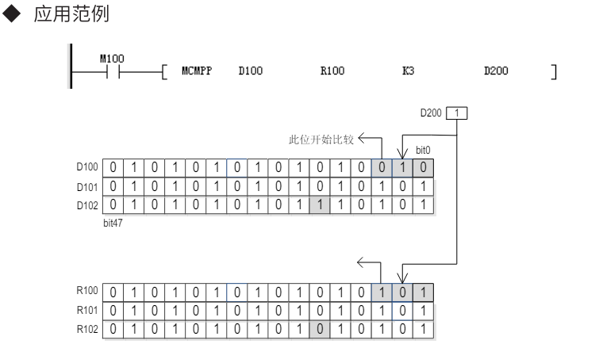

D200初始值设定为1，从第3个bit（bit2）开始比较。

M100由OFF→ON动作依次出现下面结果： 

D200=2，矩阵位寻到标志M8323置ON，矩阵搜寻结束标志M8321置OFF。 

D200=37，矩阵位寻到标志M8323置ON，矩阵搜寻结束标志M8321置OFF。 

D200=47，矩阵位寻到标志M8323置OFF，矩阵搜寻结束标志M8321置ON。

 D200=0，矩阵位寻到标志M8323置ON，矩阵搜寻结束标志M8321置OFF。 

D200=1，矩阵位寻到标志M8323置ON，矩阵搜寻结束标志M8321置OFF。 

#### ● 标志位说明 

M8320：矩阵比较标志，该位置OFF则比较不同值，反之则比较相同值。 

M8321：矩阵搜寻结束标志，当比较到最后一个bit时，置ON。 

M8322：矩阵搜寻起始标志置ON，由第一个bit开始比较。 

M8323：矩阵位寻到标志，比较到达时立即停止比较动作置ON。 

M8324：矩阵指针错误标志，指针超出此范围0~(16n-1)时置ON。

## 3 矩阵读写

| 指令 |      功能      |
| :--: | :------------: |
| MBRD | 矩阵位读出运算 |
| MBWR | 矩阵位写入运算 |

  ## 4 矩阵移位

## 

| 指令 |       功能       |
| :--: | :--------------: |
| MBS  |  矩阵位移位运算  |
| MBR  | 矩阵位循环移运算 |

#  字符串指令

| 指令  |           功能            |
| :---: | :-----------------------: |
|  STR  |     BIN→字符串的转换      |
|  VAL  |     字符串→BIN的转换      |
| ESTR  | 二进制浮点数→字符串的转换 |
| EVAL  | 字符串→二进制浮点数的转换 |
|  $+   |       字符串的组合        |
|  LEN  |     检出字符串的长度      |
| INSTR |       字符串的检索        |
| RIGHT |   从字符串右侧开始取出    |
| LEFT  |   从字符串左侧开始取出    |
| MIDR  |    从字符串中任意取出     |
| MIDW  |     字符串中任意替换      |
| $MOV  |       字符串的传送        |

###  STR BIN→字符串的转换

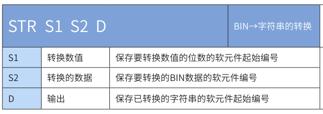

####  1） 16位运算(STR/STRP)

将[S2]的16位数据(BIN)，在所有位数[S1]、小数点部分位数[S1+1]指定的位置中加上小数点后，转换成 字符串，保存到[D]开始的软元件中。

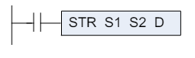

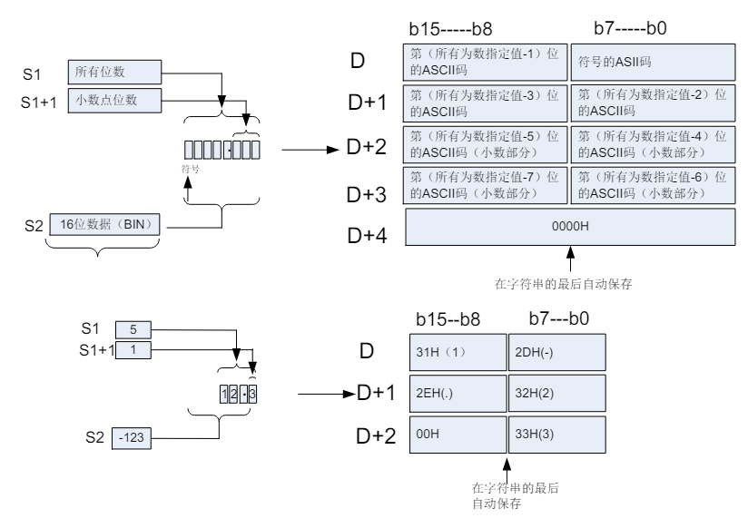

① 在2～8位数的范围内设定所有位数[S1]。 

② 在0～5位数的范围内设定小数部分位数[S1+1]。但是，请设定为小数部分位数≦(所有位数-3)。 

③ 要转换的16位数据(BIN) 的值在-32768～32767的范围内。转换后的字符串数据会如下所示地保存到[D] 开始的软元件编号中。

• 在符号中，16位数据(BIN) [S2]为正时保存“空格(20H)”，为负时保存“-(2DH)”; 

• 在小数部分位数[S1+1]中设定为 “0”以外的数字时，会自动在小数部分位数+1位数的位置上加上小数 点“. (2EH)”。 

• 小数部分位数[S1+1]为“0”时，不附加小数点。

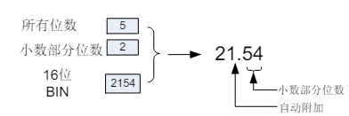

与[S2]的16位数据(BIN)的位数相比， [S1+1]的小数部分位数较多时，会自动向右对齐，在左边附加 “0(30H)”后进行转换。

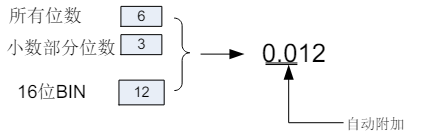

如果除去小数点和符号以外，所有位数[S1]的位数多于[S2]的16位数据(BIN)的位数时，在符号和数值之 间保存“空格(20H)”。 

• 此外， [S2]的16位数据(BIN)的位数较多时，会错误：

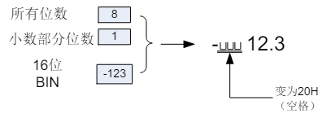

在已转换的字符串的末尾处，会自动保存表示字符串末尾含义的“00H”。

总位数为偶数位数时，在保存末尾字符软元件的后一个软元件中保存“0000H”。此外，当为奇数位数 时，在保存末尾字符的软元件的高字节(8位)中保存“00H”。

#### 2） 32位运算(DSTR/DSTRP)

将[S2+1，S2]的32位数据(BIN)，在所有位数[S1]、小数点部分位数[S1+1]指定的位置中加上小数点后， 转换成字符串，保存到[D]开始的软元件中。

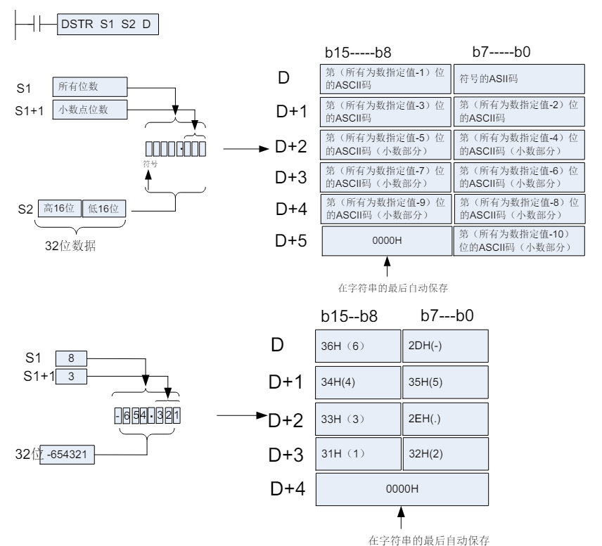

① 在2～13位数的范围内设定所有位数[S1]。 

② 在0～10位数的范围内设定小数部分位数[S1+1]。但是，请设定为小数部分位数≦(所有位数-3)。 

③ 要转换的32位数据(BIN) 的值在-2,147,483,648～2,147,483,647的范围内。 

④ 转换后的字符串数据会如下所示地保存到[D]开始的软元件编号中。

 在符号中，32位数据(BIN) [S2]为正时保存“空格(20H)”，为负时保存“-(2DH)”； 

• 在小数部分位数[S1+1]中设定为“0”以外的数字时，会自动在小数部分位数+1位数的位置上加上小数 点“. (2EH)”。小数部分位数[S1+1]为“0”时，不附加小数点。 

• 与[S2]的16位数据(BIN)的位数相比， [S1+1]的小数部分位数较多时，会自动向右对齐，在左边附加 “0(30H)”后进行转换； 

• 如果除去小数点和符号以外，所有位数[S1]的位数多于[S2]的32位数据(BIN)的位数时，在符号和数值之 间保存“空格(20H)”； 

• 此外， [S2]的32位数据(BIN)的位数较多时，会错误；

 • 在已转换的字符串的末尾处，会自动保存表示字符串末尾含义的“00H”；

 • 总位数为偶数位数时，在保存末尾字符软元件的后一个软元件中保存“0000H”。此外，当为奇数位数 时，在保存末尾字符的软元件的高字节(8位)中保存“00H”。

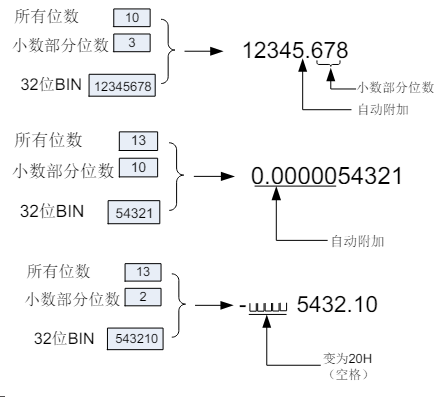

#### 3） 错误

以下一些情况下会发生运算错误，错误标志位M8067置ON，错误代码保存在D8067中。 

● 所有位数[S1]为如下所示的范围以外时。(错误代码: K6706)

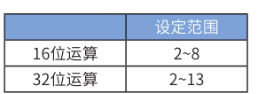

所有位数[S1+1]为如下所示的范围以外时。(错误代码: K6706)

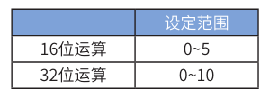

 所有位数[S1]和小数部分位数[S1+1]的关系非如下所示的范围时。(错误代码: K6706)(所有位数-3)≧小数 部分位数 

● 所有[S1]符号、小数点的位数比[S2]的BIN数据位数少时。(错误代码: K6706) 

● 保存字符串[D]的以后的软元件超出了相应的软元件范围时。(错误代码: K6705)

当M0为ON时，根据D0、D1的位数指定，将D10中保存的BIN数据(16位)转换成字符串，然后保存到 D20～D23中的程序

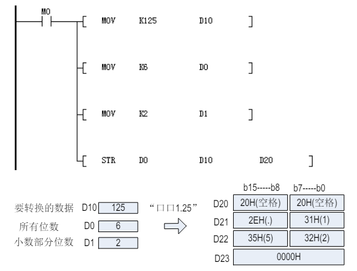

#  时钟指令

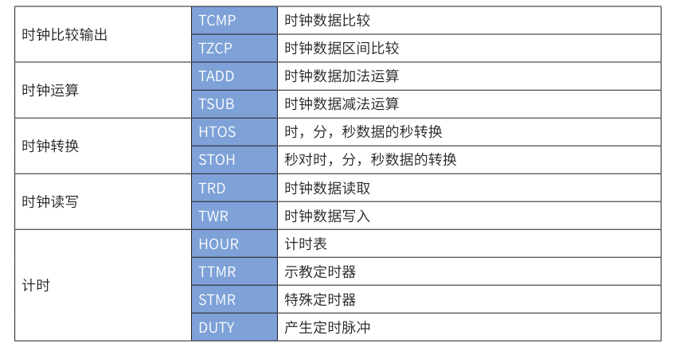

| 指令 |           功能           |
| :--: | :----------------------: |
| TCMP |       时钟数据比较       |
| TZCP |     时钟数据区间比较     |
| TADD |     时钟数据加法运算     |
| TSUB |     时钟数据减法运算     |
| HTOS |  时，分，秒数据的秒转换  |
| STOH | 秒对时，分，秒数据的转换 |
| TRD  |       时钟数据读取       |
| TWR  |       时钟数据写入       |
| HOUR |          计时表          |
| TTMR |        示教定时器        |
| STMR |        特殊定时器        |
| DUTY |       产生定时脉冲       |

###  TCMP 时钟数据比较

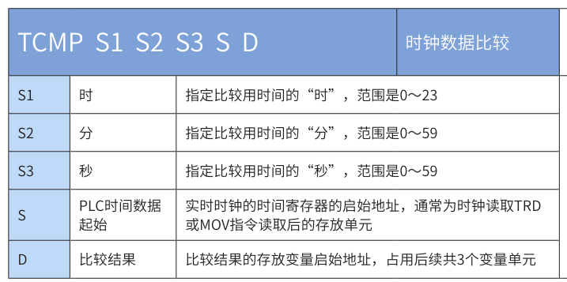

该指令是将指定的时、分、秒数值，与内部实时时钟进行比较，输出比较结果。其中：

 S1为指定比较用时间的“时”，范围是0～23： 

S2为指定比较用时间的“分”，范围是0～59； 

S3为指定比较用时间的“秒”，范围是0～59； 

S为实时时钟的时间寄存器的启始地址，通常为时钟读取TRD或MOV指令读取后的存放单元； 

D为比较结果的存放变量启始地址，占用后续共3个变量单元；

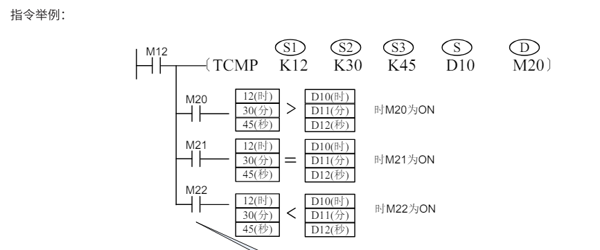

当M12 ON时，M20~M22其中之一会ON。 

当M12由ON变OFF时，不执行TCMP指令，M20/M21/M22保持M12=OFF以 前的状态不变。要清除M20~M22的比较结果可用RST或者ZRST对 M20~M22进行清除。 

若需要得到≧、≦、≠的结果时，可将M20~M22 串并联即可取得。

###  HTOS 时分秒数据的秒转换/STOH秒对时、分、秒数据的转换

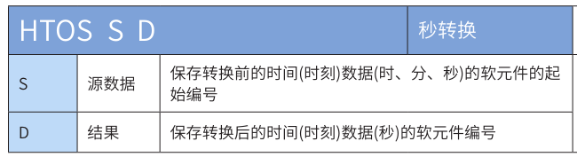

1） 16位指令 

将[S，S+1，S+2]的时间(时刻)数据(时、分、秒)换算成秒后，将结果保存到D中。 

小时的范围：0-9 

分钟的范围：0-59 

秒钟的范围：0-59

2） 32位指令 

将[S，S+1，S+2]的时间(时刻)数据(时、分、秒)换算成秒后，将结果保存到[D，D+1]中。 

小时的范围：0-32767 

分钟的范围：0-59 

秒钟的范围：0-59 

16位指令和32指令，出现以下情况，指令报错，不执行，相应的错误码存储于D8067。

• 16位指令和32位指令操作数超范围，报6705； 

• 16位指令转换结果大于32767，报6706； 

• S、S+1、S+2超过设定范围时，报6706。

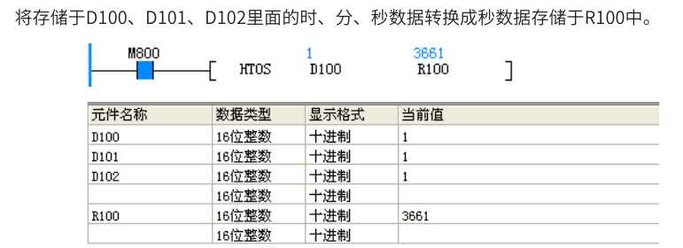

###  TRD-时钟数据读取

该指令是读取PLC内置的实时时钟的年/月/日/时/分/秒/星期，将该7个数据保存于指定的寄存器中。 其中：D为保存读取时间的启始存储单元，占用共7个连续的变量单元，地址由小到大依次存储：年、月、 日、时、分、秒、星期等数据。

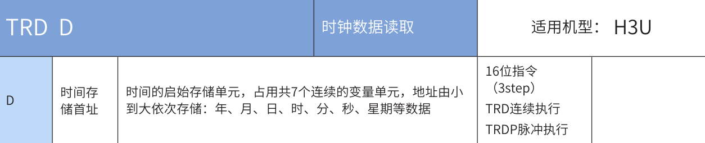

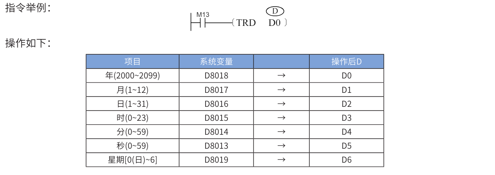

注：一般情况下要使用可编程控制器的时钟，先用TDR指令将时钟读出来放到D寄存器里再使用，不要直接 使用D8013~D8019的值.

###  HOUR计时表

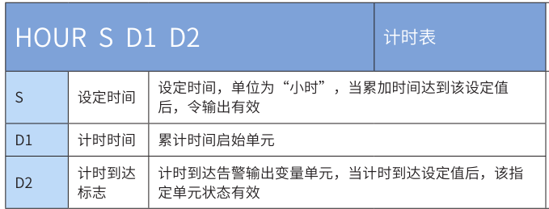

该指令是记录驱动条件满足的累加时间，当达到设定的时间后，令指定输出有效。其中： 

S为设定时间，单位为“小时”，当累加时间达到该设定值后，令输出有效； 

D1累计时间启始单元； 

D2计时到达告警输出变量单元，当计时到达设定值后，该指定单元状态有效。

16bit时：D1设置范围K0~K32,767，单位：小时。D1+1为未满1个小时的现在时间值，设置范围 K0~K3599，单位：秒。此时的D1共占用2个单元， 

32bit时：D1+1、D1设置范围K0~K2147483647，单位：小时。D1+2为未满1个小时的现在时间值，设置范 围K0~K3599，单位：秒。此时的D1共占用4个单元。 

指令D1计时没有负数，若D1制定为非停电保持的寄存器区域，则在PLC由STOP到RUN或者在掉电的时候会 将D1的值清零。若需要在PLC掉电的情况下仍能保持当前值数据，请将D1指定为停电保持区域的寄存器。

当M200＝ON时，累计该状态的持续时间，将时记录在D300中，将不满1小时的秒记录在D301中，当D300 累计时间达到2000小时后，Y10输出状态为ON。计时条件满足时，到达S指定数值后，累计计时仍继续进 行，读数会继续增大；现在时间值D300到达最大数值32,767小时、D301达到3，599秒时会停止计时测量， 要重新计时须将现在时间值D300、301清除为0。

### TTMR示教定时器

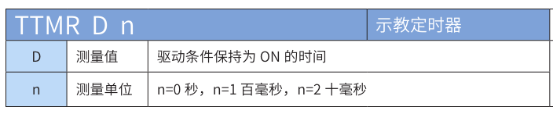

该指令的功能是将指定输入端口的按键保持时间乘以n倍数后存入变量D，一般用于参数设定。其中： D为按键保持时间以秒为单位乘以n倍数后的乘积，按键释放后D内容没有变化；而D＋1单元则用于保存按键 的按压时间，按键释放后D＋1的内容被复位为0，D＋1的时间单位为100ms；

n为倍数设定，注意实际倍数为10n计算方式，(n=0~2) 

n＝K0时，实际倍数为×1； 

n＝K1时，实际倍数为×10； 

n＝K2时，实际倍数为×100。

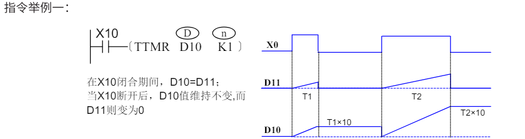

假如X10的按键保持时间为T秒，D10、D11与n三者之间的关系如下：

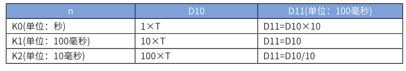

###  STMR特殊定时器

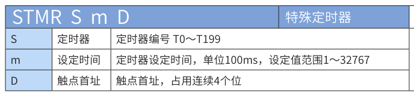

当驱动条件成立时，可以获得以定时器S1的 定时值S2为参考的断电延时断开、断电接通延时断开、通电接 通延时断开、通电延时接通断电延时断开等四种触点

该指令的功能是根据指令能流，产生4种延时动作的专用指令。其中： 

S用于产生延迟动作的计时器序号，可用T0~T199； 

m为延时设定值，单位为100ms，设定值范围为K1～K32767； 

D为延时动作输出元件的起始编号，共占用4个连续单元。

#### 使用注意事项：

在本指令中使用的计时器不得再用于其他指令中重复使用，输出也不可重复使用。

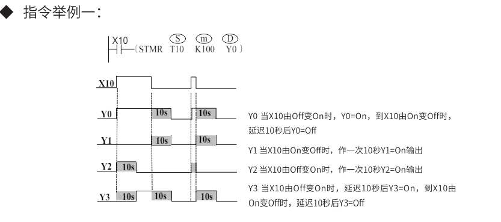

### DUTY产生定时脉冲

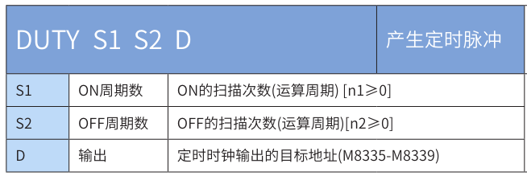

将指定次数的运算周期作为1个周期，产生这样定时信号的指令。

1）定时时钟是按照n1个扫描周期ON，n2个扫描周期OFF的方式进行ON/OFF输出的。 

2）定时时钟输出的目标地址，请指定M8335～M8339，与之对应的扫描数的计数值被保存到 D8335～D8339中。 

3）扫描数的计数值D8335～D8339，在计数值变为n1＋n2时，或者在输入能流再次由OFF→ON时被复位。 执行过程中断开输入能流也不停止。 

4）n1=0，n2≥0时，[D]固定为OFF；n1＞0，n2=0时，[D]固定为ON；

● 以下一些情况下会发生运算错误，错误标志位M8067置ON，错误代码保存在D8067中。

 1）n1、n2超范围时，报6706号错误； 

2）目标地址[D]在M8335～M8339以外范围时，报6705号错误； 

3）多个DUTY指令使用了相同的定时时钟输出目标地址，报6711号错误

使M8335输出周期为200个扫描周期占空比为1:1的方波

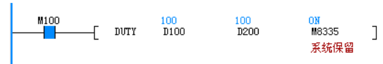

# 通信

|  指令  |     作用      |
| :----: | :-----------: |
|   RS   | 串行数据传送  |
| MODBUS |  MODBUS通讯   |
|  CCD   |    校验码     |
|  CRC   | CRC校验码计算 |
|  LRC   | LRC校验码计算 |

###  RS 串行数据传送

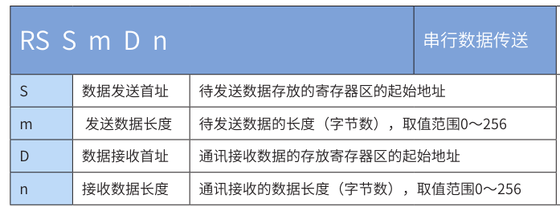

​	该指令是一个通讯收发指令，将指定寄存器区域的数据，自动向串口依次发送，将串口接收到的数据存放到 指定区域，相当于用户程序直接访问通讯缓冲区，借助用户程序对通讯收发缓冲区的处理，实现自定义协议 的通讯。 

RS指令半双工/全双工模式由D8120的Bit10设定。用户程序可以写多条RS指令，但是同一时间只能有一条 RS指令被驱动。在每次驱动RS指令前，必须将M8122置位；

####  重要的参数

| 数据  | 功能                                                | 数据  | 功能                                                         |
| ----- | --------------------------------------------------- | ----- | ------------------------------------------------------------ |
| M8121 | RS 指令 - 发送等待中                                | D8120 | 通讯格式设置，界面配置设定，默认为 0                         |
| M8122 | Modbus - 通讯执行状态  RS 指令 - 发送标志      | D8121 | 通讯站号设置，界面配置设定，默认为 1                         |
| M8123 | Modbus - 通讯错误标志  RS 指令 - 接收完成标志  | D8122 | 下载、HMI 监控协议 - 通讯格式设置  RS 指令 - 传送剩余数据数量 |
| M8124 | RS 指令 - 接收中                                    | D8123 | RS 指令 - 接收到的数据数量                                   |
| M8129 | 超时判断                                            | D8124 | RS 指令 - 起始字符 STX                                       |
| D8125 | RS 指令 - 终止字符 ETX                              | D8126 | 通讯协议设置，界面配置设定，默认为 0                         |
| D8127 | 计算机链接协议 - 接通要求数据起始地址号             | D8128 | Modbus - 通讯出错站号 计算机链接协议 - 接通要求发送数据数量  |
| D8129 | 通讯超时时间判断，界面配置设定，默认为 10 （100ms） |       |                                                              |

####  一个简单的示例

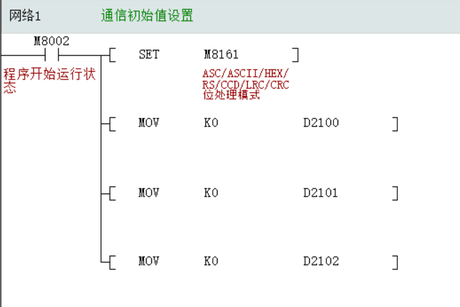

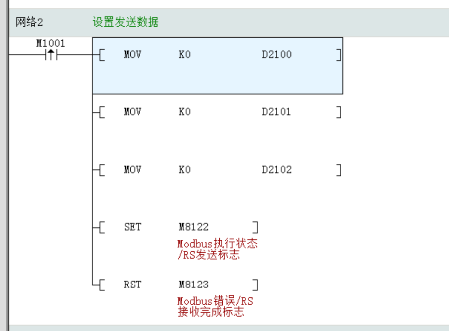

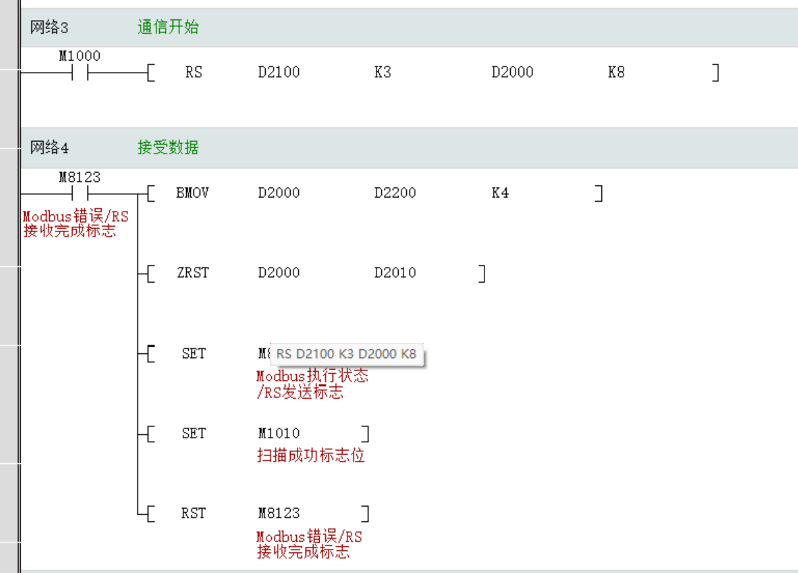

###  MODBUS MODBUS通讯

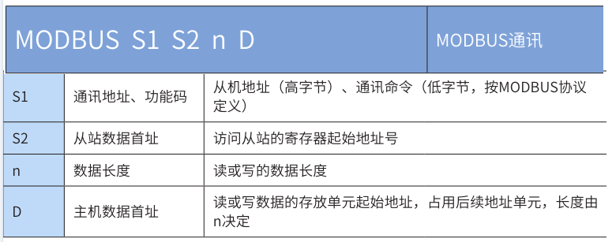

为了直观方便，在标准MODBUS主站协议通讯中的RS指令我们可以用MODBUS来代替。

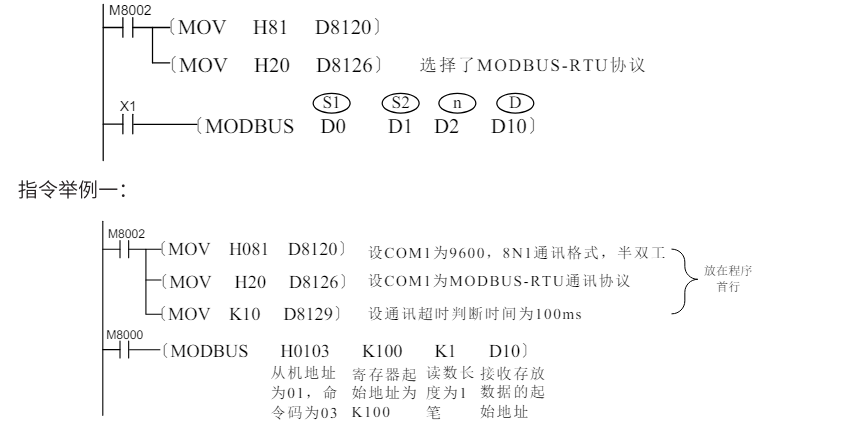

该指令用于具有MODBUS协议从站设备（如MD320/300/280等系列变频器）进行通讯，将非常方便，指令 举例一中，PLC不断的读#1从机内，地址为100的寄存器，数据存于D10单元。 

使用说明： 程序中可多次使用MODBUS指令，和标准RS不同，MODBUS协议中的MODBUS指令可有多处MODBUS指令 被同时使能。

 和RS指令相比，可省略对M8122的置ON，可省略对M8123的复位。

### CCD 校验码

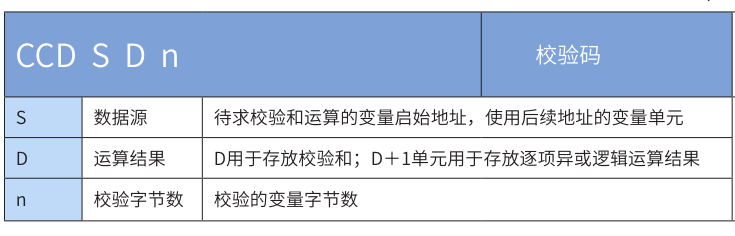

当驱动条件成立时，将以S为首址的K个数据进行求和校验，结果存放到D；异或校验，结果存放到D+1

M8161标志决定了变量宽度模式，当M8161=OFF时，为16bit模式，即变量的高字节和低字节都参与运算； 当M8161=ON时，为8bit模式，只有变量的低字节参与运算，高字节的内容被丢弃，因此实际使用变量区域 的长度增加，见下例图；

“累加和”就是将指定的n个变量直接相加的计算结果；

 “异或”逻辑运算的方法则是：

 1）将参与运算的变量都换算为二进制数；

 2）先统计每个变量的bit0为1的个数，若为偶数个，则异或结果的bit0为0；若为奇数个，则异或结果的 bit0为1； 

3）再统计每个变量的bit1为1的个数，若为偶数个，则异或结果的bit1为0；若为奇数个，则异或结果的 bit1为1； 

4）依次类推，逐个计算bit2～bit7，所得的二进制数换算为HEX数值即为异或结果（或称极性值）。

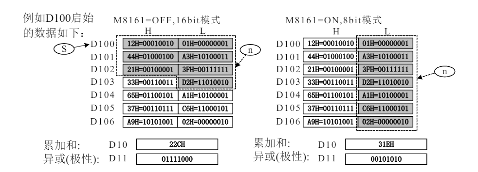

RS/HEX/ASCI/CCD等指令共用M8161模式标志，编程时注意该标志的处理。

### CRC校验码计算

​	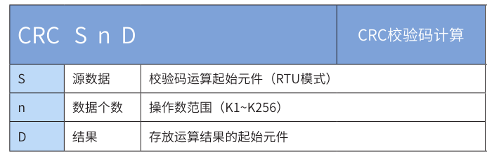

16位转换模式：当M8161置OFF时，以字节为单位，提取以[S]软元件开始的高8位和低8位数据共n点参与 CRC运算，结果存储于[D]元件的高8位和低8位中。 

8位转换模式：当M8161置ON时，以字节为单位，提取以[S]软元件开始的低8位数据共n点参与CRC运算， 结果的低8位存储于[D]软元件，高8位存储于[D+1]。 

以下一些情况会报故障。出错标志位M8067置ON，同时出错代码保存于D8067。

n超范围时，报6706号错误。

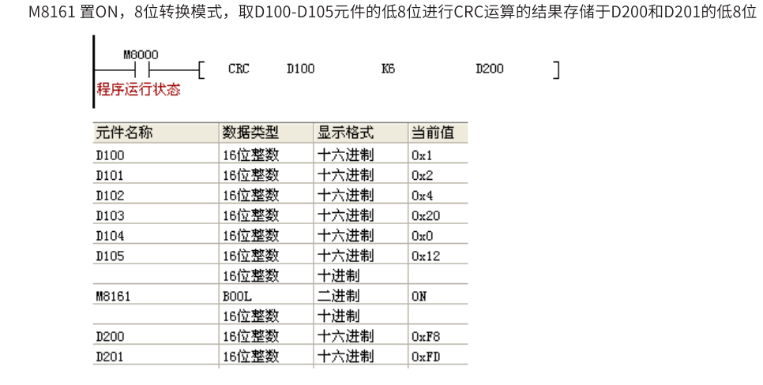

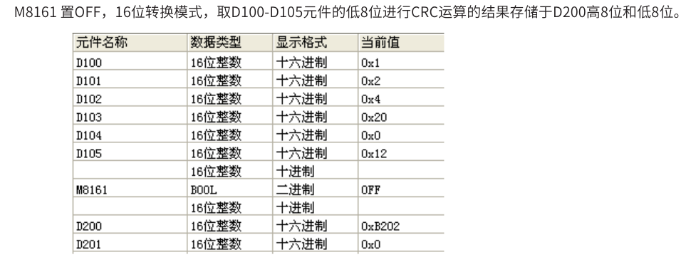

### LRC 校验码计算

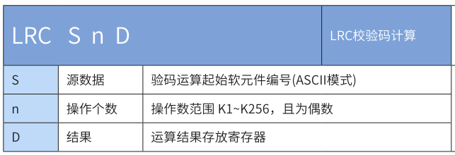

16位转换模式：当M8161置OFF时，以字节为单位，提取以[S]软元件开始的高8位和低8位数据共n点参与 LRC运算，结果存储于[D]元件的高8位和低8位中。 

8位转换模式：当M8161置ON时，以字节为单位。提取以[S]软元件开始的低8位数据共n点参与LRC运算，结 果的低8位存储于[D]软元件，高8位存储于[D+1]。

 以下一些情况会报故障。出错标志位M8067置ON，同时出错代码保存于D8067。 

• n超范围时，报6706号错误；

 • n为奇数时，报6706号错误。

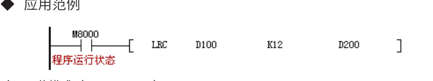

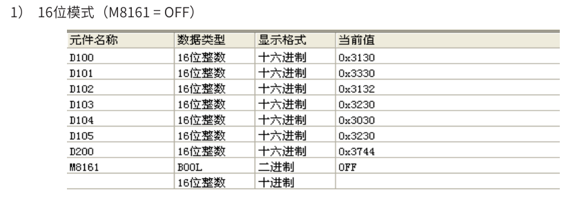

2） 8位模式（M8161 = ON）

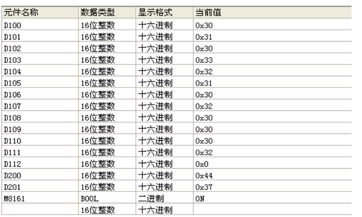

LRC 校验码：由通信地址到数据内容结束加起来的值取2 的补码即为校验码。 

例如： 01 H + 03 H + 21 H + 02 H + 00 H + 02 H=29 H，然后取2 的补码=D7H（即ASCII码为44H与37H）。

#  外设

##  PID指令

### PID PID运算

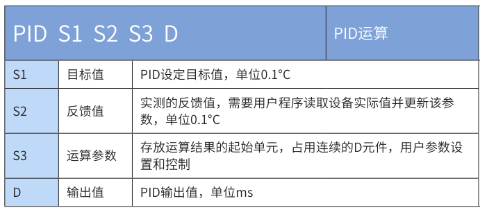

完成PID运算，用于闭环控制系统参数的控制。

1） PID运算功能选择

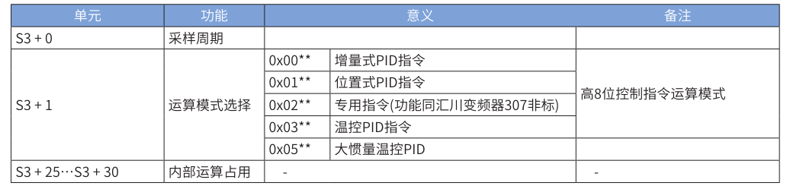

选择不同的功能指令，S3单元对应不同的意义。

2） 增量式 PID 指令 （S3+1 选择 0x00**） 

就S3启始的各单元参数值的功能和设定方法说明如下表：

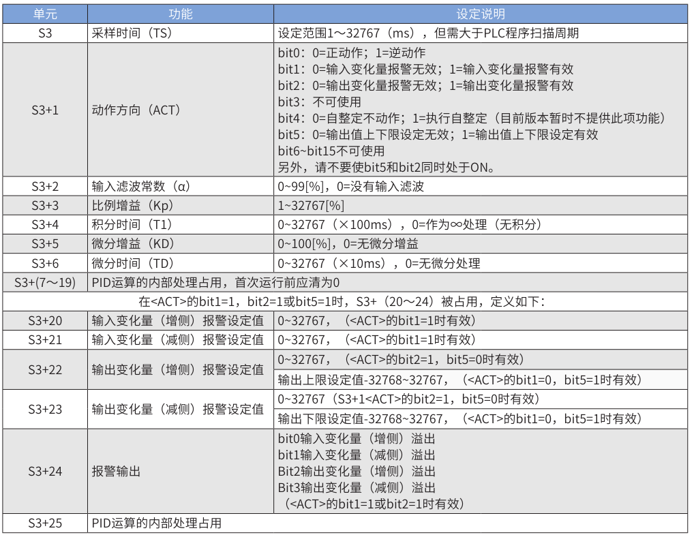

3） 位置式 PID 指令（S3+1 选择 0x01**）

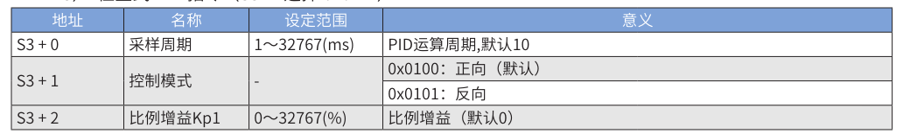

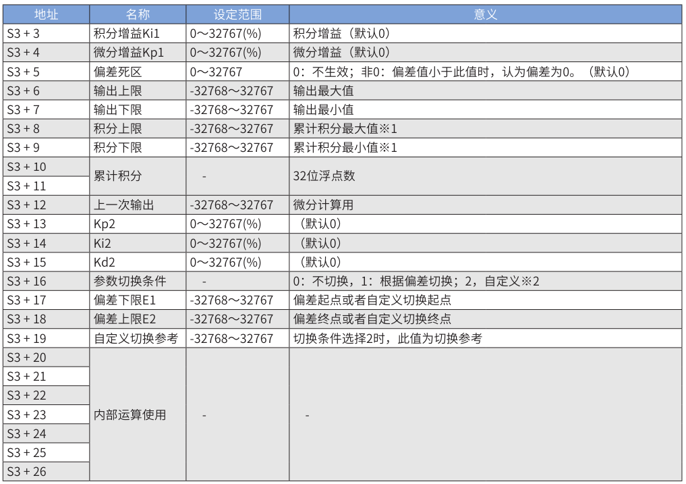

注： ※1：当积分上下限均设置为0时，积分上下限将按照上限32737、下限-32768生效。 ※2：(S3+16) = 0时，(S3+17)到(S3+19)没有意义。

 位置式 PID 运算原理

PID 运算公式： u(k) = Kp * e(k) + Ki * T * ∑ e(i) + ( Kd / T ) * [Pv(k) – Pv(k-1) ]

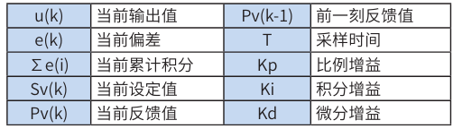

设定正向时：e(k) = Sv(k) - Pv(k) 

设定反向时：e(k) = Pv(k) - Sv(k)

7） 指令举例：

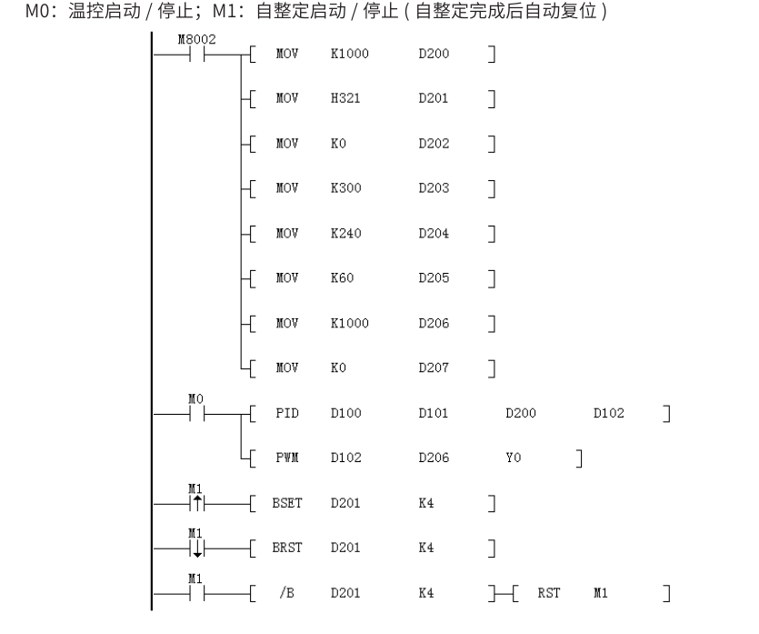

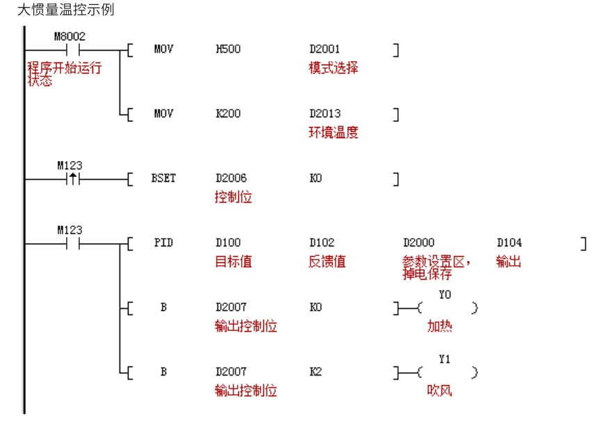

##  其他外设指令

##  数码管

###  SEGD七段译码

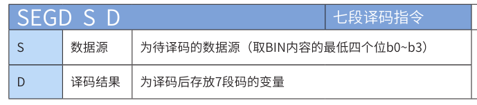

该指令是数据源的低4位，翻译成7段显示码，存放到目的变量的低8位中。

操作是，当X20为ON时，将D0内数据低4位译码后，输出到Y10～Y17端口。 翻译用的对应表如下表。该表格不需用户准备，PLC系统内部已具备该对照表

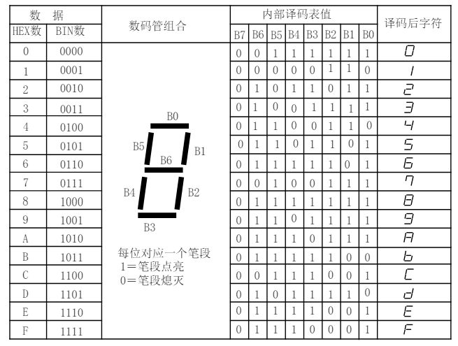

###  SEGL七段码时分显示

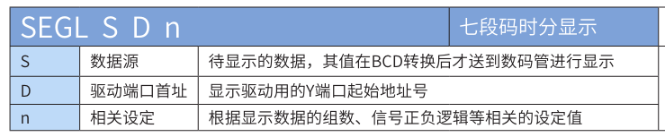

利用8个或12个Y端口，用于4位或8位七段锁存数码管的显示驱动，显示方式为扫描驱动方式

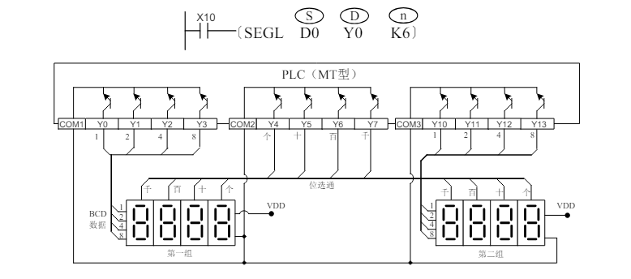

对应的硬件接线如右图，在第一组数码管上显示D0的内容，在第二组数码管上显示D1的内容，若D0或D1的 读数超过9999，程序运行就会出错：

接线图中所使用的数码管，自带显示数据锁存、7段译码和驱动、负逻辑型（输入端口为低电平时，表示输 入的数据为1，或被选通）的7段数码显示管。显示处理中，PLC的Y4~Y7端口会自动循环扫描，每次只有 1个端口为ON，作为位选通信号，此时Y0~Y3口上的数据即为送给对应位的BCD码数据，当位选通信号由 ON→OFF时，即被锁存到数码管内的锁存器中，经过内部的译码和驱动后，数码管将数字显示出来。PLC系 统依次将Y4～Y7循环作同样处理，直到将4位都处理完毕。同样的道理，Y10~Y13是第二组4位数码管的数据 输出端口，共用Y4~Y7的位选通线，处理方法相同，两组的显示处理是同时进行的。范例中若D0=K2468， D1=K9753，则第一组将会显示2 4 6 8，第二组显示9 7 5 3。

完成一次显示刷新需要12个扫描周期，处理完成后，M8029标志置ON。

n的选择：根据可编程控制器的正负逻辑、七段码的正负逻辑等因素，按以下原则选择：

一组4位数的时候n=0~3。二组4位数的时候n=4~7

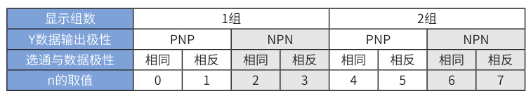

###  ABSD 凸轮控制绝对方式

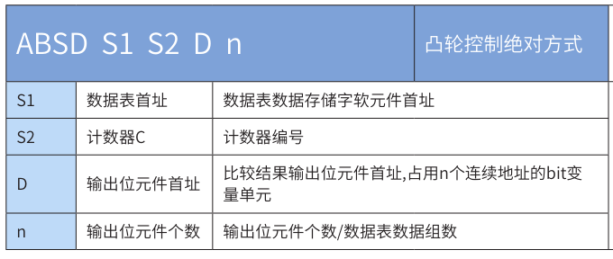

当驱动条件成立时，将以S1为首址所存储的数据表格数据与计数器S2中的当前数据进行比较，对以D为首址 的K个位元件进行ON/OFF控制

该指令完成的操作是多区段比较，用于实现凸轮控制，比较用的表格、计数器等均按绝对方式设置。该指 令是主程序中扫描执行，比较结果受扫描时间的滞后影响。当使用32bit指令时，S1、S2、D均指向32bit变 量，n也按32bit变量宽度进行计算。

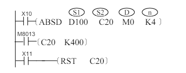

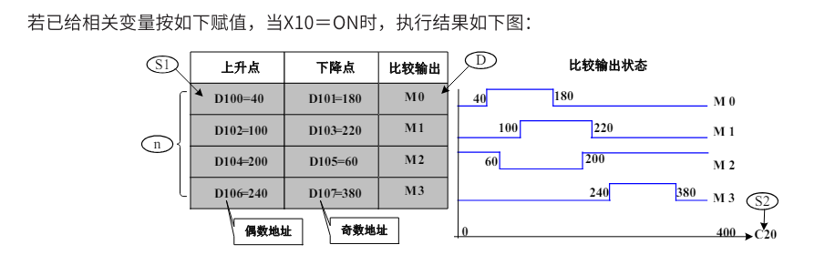

使用说明： 

• ABSD指令执行前，应给相关表格的各变量用MOV指令赋值；

 • 即使DABSD指令中采用了高速指令，比较输出D也受用户程序扫描时间的滞后影响，对于需要及时响应的应用，可 采用HSZ高速比较指令。

###  INCD凸轮控制增量方式

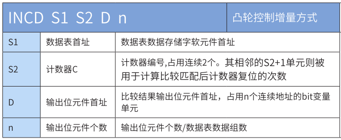

当驱动条件成立时，将以S1为首址所存储的数据表格数据与计数器S2中的当前数据进行比较，对以D为首址 的K个位元件进行ON/OFF控制。

该指令完成的操作是多区段比较，用于实现凸轮控制，比较用的表格、计数器等均按增量方式设置。该指令 是主程序中扫描执行，比较结果受扫描时间的滞后影响。

 n 的组数比较完成时，指令执行完毕标志M8029会置ON。

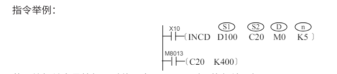

若已给相关变量按如下赋值，当X10＝ON时，执行结果如下图

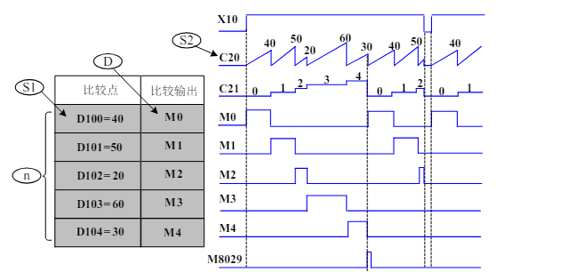

使用说明：

 • INCD指令执行前，应给相关表格的各变量用MOV指令赋值； 

• 比较输出也受用户程序扫描时间的滞后影响，对于需要及时响应的应用，可采用HSZ高速比较指令；
