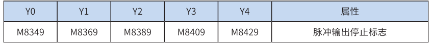
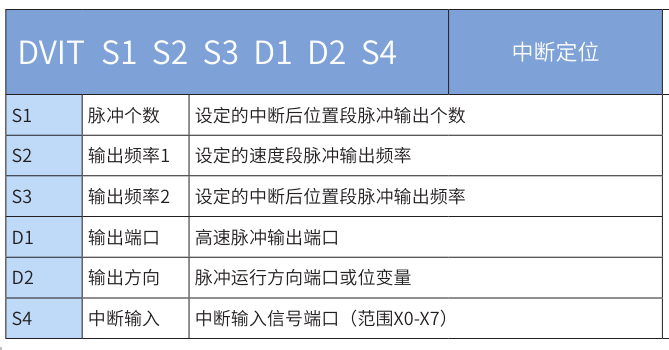

# 运动控制

# 高速输入

##  高速计数器

> 而使用高速计数器时，高速计数器编号与对应的X端口配套使用，即指定了高速计数器Cxxx后，对应的X输 入端即被指定，故编程时不要让X端口有重复使用的情况，否则报错。例如使用C252，占用了X0和X1输入端 口，便不可再使用C235、C236、C243、C246和C251。另外也不能使用对应输入的中断或脉冲捕捉。
>
> ● 高速计数器根据相关信号的跳变沿，采用硬件方式进行计数，实时响应，与 PLC 的扫描时间无关。 
>
> ● 高速计数器的当前值达到设定值时，如要立即进行输出处理，请使用高速脉冲比较指令 HSCS、HSCR、HSZ 等应 用指令，具体请参见指令解释。
>
>  ● 高速计数器的当前值达到设定值时，如要立即进行一些逻辑处理，可使用高速计数中断，使用高速脉冲比较指令 HSCS，将指令的操作指定为 I0x0 中断（其中 x ＝ 1~8 中断号），当然必须编写好对应中断号的子程序。
>
>  ● 高速输入信号可以设置软件滤波时间，设置元件为 D8021，时间单位为 250ns，设置范围为 1~100，即可设置的高 速滤波时间范围为 0.25~25us

即如果要使用高速计数器，可以直接使用x对应的c计数器，不用在代码中先设置。如

## 高速比较指令

###  HSCS比较置位

​	当 [S2] 计数器的当前值等于设定值 [S1] 时，立即置位 [D]。

 **[S2] 变量必须为高速计数器 C235~C255，因涉及的计数器均为 32bit 计数器，故必须采用 32bit 指令 DHSCS**；

 [D] 为比较结果的存放单元，也可以是调用计数中断子程序：**当为 Y0~Y17 范围端口时，为立即输出；当为 Y20 以后的端口时，会等到本次用户程序扫描完毕才会输出；**当为 M、S、SM 变量时，为立即刷新； 当 [D] 项为 I010 ～ I080 时，即为调用高速计数器中断 0~7 的子程序。当然必须编写好相应的中断子程序、 开启相应中断允许 标志和全局中断允许标志等，才能正常响应定时器中断。M8059 置 ON 则禁止了所有的 高速计数器中断（I010-I080）。

> 一般指令 Y 输出与 DHSCS 指令 Y 输出的差异：以（指令举例一）为例： 
>
> ◆ 当C255的现在值由99→100变化时，C255接点立即导通，但执行到OUT Y10时，Y10仍会受扫描周期影 响，在程序执行完IO刷新后才输出
>
>  ◆ 当C255的现在值由99→100及101→100变化时，DHSCS指令输出Y10是以中断方式立即输出到外部输出 端，与PLC 扫描周期无关。但仍会受输出模块继电器(10ms)或晶体管(10us)的输出延迟。

1） 使用说明： 

- 使用 HSCS 指令时，应保证所使用的计数器已被启用（见指令举例一），否则该计数器的值将不会有变化； 
- 计数器是以中断方式响应计数器的输入信号，及时比较，若本次比较时满足匹配关系，比较输出立即置位。例如 指令举例一中，若 C255 的当前值变为 99 → 100 或 101 → 100 时，Y10 立即置位，且一直保持该状态，之后即使 C255 与 K100 的比较结果变成不相等，Y10 仍然保持 ON 状态，除非有另外的复位操作； 
- 指令的比较输出只决定于脉冲输入时的比较结果动作，即使采用 DMOV、DADD 等指令改写高速计数器 C235~C255 的内容，若没有脉冲输入，比较输出也不会变化；单纯的指令驱动能流也不能改变比较结果；
-  当 HSCS 指令的输出目标为计数器中断 I010 ～ I080 时，每个中断号只能使用 1 次，不可重复。计数器中断的设置 和使用参考上一节内容。
- HSCS、HSCR、HSZ 与普通指令一样可以多次使用，但这些指令同时驱动的个数限制在总计 8 个指令以下。HSZ 指令特殊模式（高速表格比较模式、频率控制模式）仅能同时驱动 1 个指令；
- 

###  HSCR比较复位

当 S2 计数器的当前值等于设定值 S1 时，立即复位 D。

 **S2 变量必须为高速计数器 C235~C255，因涉及的计数器均为 32bit 计数器，故必须采用 32bit 指令 DHSCR；** 

D 为比较结果的存放单元：当为 Y0~Y17 范围端口时，为立即输出；当为 Y20 以后的端口时，会等到本次用 户程序扫描完毕才会输出；当为 M、S、SM 变量时，为立即刷新；

一般指令 Y 输出与 DHSCR 指令 Y 输出的差异：以（指令举例一）为例：

-   当 C255 的现在值由 99 → 100 变化时，C255 接点立即导通，但执行到 OUT Y10 时，Y10 仍会受扫描周期影响， 在程序执行完 IO 刷新后才输出 
- 当 C255 的现在值由 99 → 100 及 101 → 100 变化时，DHSCS 指令输出 Y10 是以中断方式立即输出到外部输出端， 与 PLC 扫描周期无关。但仍会受输出模块继电器 (10ms) 或晶体管 (10us) 的输出延迟。

其他同HSCS指令

###  HSZ 区间比较

根据计数器 [S] 的当前值，与设定的比较区间 [S1] 和 [S2] 进行比较，将比较结果立即输出到以 [D] 地址起始 的 3 个单元中。其中：

-  [S1] 为设定的比较区间的区间下限，32bit，其值必须不大于 [S2] 的值，即 [S1] ≤ [S2]；

- [S2] 为设定的比较区间的区间上限，32bit，其值必须不小于 [S1] 的值，即 [S1] ≤ [S2]； 

- [S] 变量必须为高速计数器 C235~C255，因涉及的计数器均为 32bit 计数器，故必须采用 32bit 指令 DHSZ； 

- [D] 为比较结果的存放单元，占用以 [D] 起始的 3 个连续地址单元：当为 Y0~Y17 范围端口时，为立即输出； 当为 Y20 以后的端口时，会等到本次用户程序扫描完毕才会输出；当为 M、S、SM 变量时，为立即刷新；

> HSZ 指令也是以中断方式进行工作的，只有当计数器对应的输入端有计数脉冲时，比较才会进行，对应的输出才会 被刷新；
>
>  • 当 [D] 指定为特殊辅助继电器 M8130，即表明为高速表格比较模式，指令中的各变量将按表格方式进行解析；
>
>  • 当 [D] 指定为特殊辅助继电器 M8132，即表明为频率控制模式，与 DPLSY 组合，实现实现一个高速计数器的当前 值控制 DPLSY 输出频率的功能。
>
>  • HSCS、HSCR、HSZ 与普通指令一样可以多次使用，但这些指令同时驱动的个数限制在总计 8 个指令以下。HSZ 指令特殊模式（高速表格比较模式、频率控制模式）仅能同时驱动 1 个指令；

####  高速表格模式

b） 高速表格比较模式 当指令参数 [D] 为特殊辅助继电器 M8130 时，即指定高速表格比较模式。使用高速表格比较模式时，操作 数注意如下：

-  [S1] 只对应数据寄存器 D 变量，用于表示比较表格的起始地址； 
- [S2] 只可用常数变量 K 或 H，用于表示表格的行数。限制为“ 1 ≤ （ K 或 H） ≤ 128”； [S] 变量必须为高速计数器 C235~C255； 
- [D] 为 M8130，指定高速表格比较模式。

当 [S] 所指定的高速计数器 C251 的当前值等于（D1、D0）设定值的時候，D2 所指定的输出 Y 被复制成 OFF（D3=K0）或是 ON（D3=K1）并保持住。而输出 Y 的动作完全以中断方式来处理。 当 C251 的当前值与表格的第一组设定值相等时，D8130=K1、与第二组设定值相等时，D8130=K2，如此的 往下顺序执行比较操作，直到最后一组比较动作完成时，M8131 = ON 一个扫描周期，之后 D8130 清除为 0， 再返回到第一组进行比较。 当指令的条件接点 M10 变成 OFF 时，指令执行被中断，表格计数器 D8130 被清 0，但指令相关的输出状态 全部被保持。本指令在被第一次扫描执行，用户程序执行后，比较表格的各项设置即确定下来，因此表格中 的各参数设置需在本指令之前设置完成。 表格比较指令在用户程序中只能使用一次。此外，与其他用途使用的 HSCS/HSCR/HSZ 指令结合，可以同 时驱动的指令被限制在 8 点以下。

####  频率模式

当指令参数 [D] 为特殊辅助继电器 M8132 时，即指定频率控制模式。与 DPLSY 组合，实现实现一个高速计 数器的当前值控制 DPLSY 输出频率的功能。使用频率控制模式时，操作数注意如下：

-  [S1] 只对应数据寄存器 D 变量，用于表示比较表格的起始地址； 
- [S2] 只可用常数变量 K 或 H，用于表示表格的行数，限制为 1 ≤ （K 或 H） ≤ 128； [S] 变量必须为高速计数器 C235~C255； 
- [D] 为 M8132，指定频率控制模式。

本指令在用户程序中只能使用一次，表格中的各个寄存器值需事先设定好。

采用频率控制模式时，编程中使用其他的 PLSY 指令以及 PLSR 指令，无法同时得到 2 路脉冲输出。 其中，（D8132，D8133）HSZ&PLSY 速度模型频率使用；（D8134，D8135）HSZ&PLSY 速度模型比较脉 冲数使用。

其他注意信息同HSCS

###  SPD 脉冲密度检测

将 [S1] 指定端口在 [S2] 时间内检测到的脉冲数，保存到 [D] 地址单元中。其中：

 [S1] 为脉冲信号输入端口，只能为 X00 ~ X07； 

[S2] 为设定的脉冲检测时间长度（ms），1 ~ 32767；

 [D] 脉冲计数结果，占用以 [D] 起始的 3 个连续地址单元。[D + 0] 设定时间长度 [S2] 内接收到的脉冲个数；[D + 1] 为实时脉冲计数值；[D + 2] 为完成本次采样周期的剩余时间。

 1） 注意要点： 被用于 SPD 指令的 X00 ~ X07 端口，可用时用于高速计数器或者中断输入中；

在图例中，X7 置 ON 时，D1 对 X0 的 OFF → ON 动作计数，1000ms 后将其结果存入 D0，随之 D1 复位， 再次对 X0 的动作计数。D2 用于测定剩余时间。 因此根据 D0 和 [S2] 的设定值就可以求得脉冲的频率；若脉冲信号取自旋转编码器，可求得转速等。

#  高速输出

###   高速输出指令属性表

> ◆“√（定）”表示脉冲方向输出端口固定；“√（M）”表示需要置位特殊软元件才能使能该功能； 
>
> ◆H3U 的高速输出指令是否有加减速，是由指令本身的属性决定的，跟加减速时间无关。（例如 PLSV 指令本身不具有加减速属性，所以更改加减速时间对 PLSV 指令没有意义）定位指令加减速 时间范围：10ms-5000ms（插补指令范围加减速时间范围：10ms-500ms），小于最小范围值， 以最小范围值计算，大于最大范围值，按最大范围值计算。 
>
> ◆H3U-PM 运动控制机型支持的指令，可在通用主程序或子程序中使用，指令中以 Y0、Y1、Y2 代表 X 轴、Y 轴和 Z 轴的输出控制。

### 输出频率关系和加减速过程说明

其中： 

- Vset，用户设定的脉冲输出频率，由指令设定；
-  Vbias，用户设定的基底输出频率，一般由特殊寄存器设定；
-  Vmax，最高频率，一般由特殊寄存器设定； 
- Vmin，最低频率，计算得来； 
- Tacc，加速时间； 
- Tdec，减速时间，默认Tdec = Tacc，若置位特殊功能标志，可以单独设置加减速时间；

 一般情况下，Vmax≥Vset，Vbias≥Vmin，如果不满足上述条件，频率会发生调整。Vmax和Vmin决定了脉 冲输出频率的上限和下限。

实际能够输出的最低频率值Vmin

也就是说，即使指定了低于上述结果的值，仍将输出计算值的频率。加速初期和减速末期的频率不得低于上 述公式的计算结果。 

［例］输出频率：50000Hz，加减速时间：100ms。

计算得到最低频率500Hz，也就是说，即使基底频率指定了低于上述结果的值，仍将输出计算值的频率。

##  脉冲输出指令

###  PLSY脉冲输出

由于继电器不适合高频率动作，只有晶体管输出型PLC才适合使用该指令。

指令功能是由D 指定的端口，以 S1 的频率，输出S2 个脉冲，脉冲发送完毕，M8029标志被置位。其中：

 D 为脉冲输出端口，可指定Y0/Y1/Y2/Y3/Y4； 

S1 为设定的输出脉冲频率，对于16bit指令（PLSY），设定范围为1~32,767；对于32bit指令（DPLSY）， 设定范围为1~200,000（即1Hz～200kHz）；在指令执行中可以改变S1 的值； 

S2 为设定的脉冲输出个数，对于16bit指令（PLSY），设定范围为-32,768~32,767；对于32bit指令 （DPLSY），设定范围为-2,147,483,648~2,147,483,647；当S2 等于零时为发送不间断的无限个脉冲。

当指令能流为OFF时，将立即停止；当能流由OFF→ON时，脉冲输出处理重新开始；指令执行完毕，M8029 标志置为ON；

脉冲输出示意图，如下：

####  注意要点

1） 如果用户需获取脉冲当前位置，可以通过监控下述的特殊寄存器（内部存储着当前脉冲位置 值）；见下表：

可以监控特殊软元件“脉冲输出停止标志位”，查看脉冲输出状态，脉冲输出中该标志位会被置位，输出完 成自动复位。见下表：

2） 不支持支持加减速； 

3） 指令执行中，允许更改输出脉冲个数（可大可小）； 

更改前，需要置位特殊软元件“脉冲更改有效标志位”(M8350, M8370, M8390, M8410, M8430，默认 OFF)。见下表：

需要注意的是，更改后的位置需要大于当前脉冲位置。示意图如下：

4） 指令执行中，允许更改输出脉冲频率（可大可小）； 

不需要置位特殊标志。示意图如下：

5） 指令执行中，更改输出脉冲个数和更改输出脉冲频率可以同时进行；

 6） 当脉冲输出个数设置为0，PLSY指令处于速度模式，发送不间断的无限个脉冲； 

7） 当脉冲输出个数设置为0，PLSY指令处于速度模式，可以更改为位置模式（更改方式：将脉冲 数由0改为非0的设定值），更改后发出设定的脉冲个数；反之，不能从位置模式切换到速度模 式。

8） 通过使能标志位，可以释放高速输出端口资源，从而可以在不需要上一条指令能流无效的情况 下，立即启动下一条脉冲输出指令； 

需要置位特殊软元件“端口的输出初始化标志位”。见下表：

若脉冲输出指令A能流有效，无论脉冲是否发送完成，该指令都会占用该高速输出端口。此时，使用该输出 端口的脉冲输出指令B能流即使有效也不会有脉冲输出（因该高速输出端口资源已被指令A占用，而报端口 重复或冲突错误）。此时使能该端口的输出初始标志位后，可释放该高速输出端口资源，使用该输出端口的 脉冲输出指令B能流有效时才有脉冲输出。

如上图所示，M100有效，驱动Y0以1000Hz频率输出20000脉冲。若M100驱动中，用户希望M200设置为ON 后，立即启动输出，则如上图所示，SET M8351，M100驱动的高速输出会立即停止，M200驱动的指令抢占 高速输出端口Y0，并启动设定的高速输出。

9） 脉冲输出完成中断；

 需要置位特殊软元件“中断使能标志位”。见下表：

10） 控制脉冲输出停止 

可以通过置位特殊软元件“脉冲输出停止标志位”，立即停止脉冲输出。见下表：

当执行到PLSY指令后，Y即开始输出脉冲；运行中若改变S2 元件的参数值，对当前输出的脉冲数没有影响， 将从下一次启动该指令时生效；（在运行中改变输出脉冲数，具体请参考前文的“注意要点”内容说明） 在PLSY输出脉冲过程中，若指令能流X0变为OFF，则输出脉冲被停止；若X0变为ON，PLSY指令将以当前的 参数重新开始脉冲输出。

####  示例

##  脉冲定位

###  PLSV 可变速脉冲输出

该指令是按指定的端口、频率和运行方向输出脉冲频率，没有加减速过程，当驱动能流无效时，输出脉冲直 接停止。只有晶体管输出PLC才能使用该指令。

其中： 

S1 为指定的输出脉冲频率。16bit指令时，范围是1～32,767Hz；－1～－32,768Hz；32bit指令时，范围是 1～200,000Hz；－1～－200,000Hz。其中负号表示反方向运行的指令信号；

 D1 为脉冲输出端口；可指定Y0/Y1/Y2/Y3/Y4；

 D2 运行方向输出端口或位变量，输出为ON状态，表示为正向运行；否则为反向运行。 当指令能流为OFF时，将立即停止；当能流由OFF→ON时，脉冲输出处理重新开始； 

脉冲输出示意图，如下：

###  PLSV2 带加减速的可变脉冲输出

该指令是按指定的端口、频率和运行方向输出脉冲频率，有加减速过程，当驱动能流无效时，输出脉冲减 速停止。只有晶体管输出PLC才能使用该指令。其中：

 S1为指定的输出脉冲频率。16bit指令时，范围是50~32,767Hz；-50~-32,768Hz；32bit指令时，范围是 50~200,000Hz；-1~ -200,000Hz。其中负号表示反方向运行的指令信号；

 D1 为脉冲输出端口；可指定Y0/Y1/Y2/Y3/Y4；

 D2 运行方向输出端口或位变量，输出为ON状态，表示为正向运行；否则为反向运行。

当指令能流为OFF时，将减速停止；此时执行完成标志M8029不会动作；指令驱动接点变为OFF后，在脉冲 输出中标志处于ON时，将不接受指令的再次驱动。当能流由OFF→ON时，脉冲输出处理重新开始。

脉冲输出示意图，如下：

 指令使能后，从基底频率加速到设定的脉冲输出频率。当脉冲输出频率发生改变时，会自动加速或减速到改 变后的设定输出频率。能流无效后，脉冲输出减速停止。

脉冲输出中允许变更脉冲输出方向，可以通过改变设定的输出频率来实现：输出频率为正，正向输出，反 之，负向输出；脉冲输出加减速时间可以单独设置；如下图：

#### 3） 加减速时间可以单独设置，加减速时间范围10-5000ms。

高速输出轴的最高速度、基底速度、加减速时间等参数可以统一设置，也可以每个轴单独设置。主要通过特 殊软元件“单独设置标志位”(M8350, M8370, M8390, M8410, M8430，默认OFF)来设置区分，见下表：

当上述“单独设置标志位”OFF，对应的轴参数使用下述寄存器：

当某一轴“单独设置标志位”ON，该对应的轴参数使用下述寄存器；“单独设置标志位”未设置为ON的 轴，仍使用原有寄存器：

####  4.多段脉冲输出指令执行过程中，加减速计算以第一段为准；当不同频率切换时，加减速斜率 （即加减速度）保持不变；

例如，第一段输出频率100kHz，加速时间100ms，第二段输出频率150 kHz，则从第一段加速到第二段，大 概50ms。减速也是一样。示意图如下：

5） 实际能够输出的最低频率值，即输出的最低基底频率，按照下式计算：

6） 通过使能标志位，可以释放高速输出端口资源，从而可以在不需要上一条指令能流无效的情况 下，立即启动下一条脉冲输出指令；

需要置位特殊软元件“端口的输出初始化标志位”。见下表：

若脉冲输出指令A能流有效，无论脉冲是否发送完成，该指令都会占用该高速输出端口。此时，使用该输出 端口的脉冲输出指令B能流即使有效也不会有脉冲输出（因该高速输出端口资源已被指令A占用，而报端口 重复或冲突错误）。此时使能该端口的输出初始标志位后，可释放该高速输出端口资源，使用该输出端口的 脉冲输出指令B能流有效时才有脉冲输出。

如上图所示，M100有效，驱动Y0以1000Hz频率输出20000脉冲。若M100驱动中，用户希望M200设置为ON 后，立即启动输出，则如上图所示，SET M8351，M100驱动的高速输出会立即停止，M200驱动的指令抢占 高速输出端口Y0，并启动设定的高速输出。

7） 因为是速度控制，没有脉冲输出完成中断；

8） 控制脉冲输出停止； 可以通过置位特殊软元件“脉冲输出停止标志位”，立即停止脉冲输出。见下表：

####  测试

###  PLSR带加减速脉冲输出

由于继电器不适合高频率动作，只有晶体管输出型PLC才适合使用该指令。该功能是指带加减速功能的固定 脉冲个数的脉冲输出指令。其中： 

S1 为设定的输出脉冲频率，16bit指令时，范围为10～32767Hz；32bit指令时，范围为10～200,000Hz； 

S2 为设定的输出脉冲数，16bit指令，设定范围为-32,768~32,767；32bit指令，设定范围 为-2,147,483,648~2,147,483,647； 

S3 为设定的加减速时间，范围10~5000(ms)，默认减速时间与加速时间相同，设定时请注意。 

D 为脉冲输出端口，可指定Y0/Y1/Y2/Y3/Y4。 

在脉冲输出过程中，改变操作数，对本次输出没有影响，修改的内容在指令下次执行的时候生效。 当指令能流为OFF时，将减速停止，此时执行完成标志M8029不会动作；指令驱动接点变为OFF后，在脉冲 输出中标志处于ON时，将不接受指令的再次驱动。当能流由OFF→ON时，脉冲输出处理重新开始；指令执 行完毕，M8029标志置为ON；

脉冲输出示意图，如下：

2） 支持梯形加减速和S曲线加减速；

通过置位特殊软元件“S曲线加减速使能标志位”来设置区分，如果标志位未置位，默认是梯形加减速。S曲 线加减速见下表

DRVI，DRVA，PLSR支持S曲线加减速,故在同等机械稳定性条件下可以让提升目标速度，因此可以缩短定位 时间，提升加工效率。

S曲线加减速采用先进的逐个脉冲调制算法，每个脉冲都在调整频率，从而使得在定位时更加平滑。

####  5） 指令执行中，允许更改输出脉冲个数（可大可小）；

更改前，需要置位特殊软元件“脉冲更改有效标志位”(M8350, M8370, M8390, M8410, M8430，默认 OFF)。见下表：

需要注意的是，更改后的位置需要大于当前脉冲位置。示意图如下：

###  DRVA 绝对位置定位

该指令是按指定的端口、频率和运行方向输出脉冲，令伺服执行机构运动到指定目的点。只有晶体管输出 PLC才能使用该指令。其中：

S1 为指定的目标位置(绝对位置)。16bit指令时，范围是－32768～32,767；32bit指令时，范围 是-2,147,483,648～2,147,483,647。其中负号表示反方向；

反转时，当前值寄存器的数值减小。

S2 为指定的输出脉冲频率，16bit指令时，范围为10～32767Hz；32bit指令时，范围为10～200,000Hz； 

D1 为脉冲输出端口；可指定Y0/Y1/Y2/Y3/Y4； 

D2 运行方向输出端口或位变量，根据S1 和当前位置的差值决定，输出为ON状态，表示为正向运行；否则 为反向运行。 

在指令执行过程中，即使改变输出脉冲频率，也无法在当前运行中表现出来。只在下一次指令执行时才有 效；

若在指令执行过程中，指令驱动的接点变为OFF时，将减速停止，此时执行完成标志M8029不会动作；指令 驱动接点变为OFF后，减速停止过程中（即脉冲输出中标志处于ON），将不接受指令的再次驱动。 脉冲输出示意图，如下：

2） 支持梯形加减速和S曲线加减速；

通过置位特殊软元件“S曲线加减速使能标志位”来设置区分，如果标志位未置位，默认是梯形加减速。S曲 线加减速见下表：

DRVI，DRVA，PLSR支持S曲线加减速,故在同等机械稳定性条件下可以让提升目标速度，因此可以缩短定位 时间，提升加工效率。

S曲线加减速采用先进的逐个脉冲调制算法，每个脉冲都在调整频率，从而使得在定位时更加平滑。

5） 指令执行中，允许更改输出脉冲个数（可大可小）；

更改前，需要置位特殊软元件“脉冲更改有效标志位”(M8350, M8370, M8390, M8410, M8430，默认 OFF)。见下表：

需要注意的是，更改后的位置需要大于当前脉冲位置。示意图如下：

8） 控制脉冲输出停止；

可以通过置位特殊软元件“脉冲输出停止标志位”，立即停止脉冲输出。见下表：

###  DRVI相对位置定位

该指令是按指定的端口、频率和运行方向输出指定的脉冲数，令伺服执行机构在当前位置的基础上作给定偏 移量的运动。只有晶体管输出PLC才能使用该指令。其中： 

S1 为指定的输出脉冲数：16bit指令时，范围是－32768～32,767；32bit指令时，范围 是-2,147,483,648～2,147,483,647。其中负号表示反方向；输出脉冲数，是相对于下面的当前值寄存器作为 相对位置：

反转时，当前值寄存器的数值减小。 

S2 为指定的输出脉冲频率，16bit指令时，范围为10～32767Hz；32bit指令时，范围为10～200,000Hz；

 D1 为脉冲输出端口；可指定Y0/Y1/Y2/Y3/Y4； 

D2 运行方向输出端口或位变量，输出为ON状态，表示为正向运行；否则为反向运行。 

在指令执行过程中，即使改变输出脉冲频率，也无法在当前运行中表现出来。只在下一次指令执行时才有 效。 

若在指令执行过程中，指令驱动的接点变为OFF时，将减速停止，此时执行完成标志M8029不会动作。指令脉冲输出示意图，如下：

###  DVIT中断定位

该指令是按指定的端口、频率和运行方向输出脉冲，当检测到中断信号后，继续输出给定的脉冲数，令伺服 执行机构在当前位置的基础上作偏移量的运动。只有晶体管输出PLC才能使用该指令。其中：

S1 为指定的输出脉冲数。16bit指令时，范围是－32768～32,767；32bit指令时，范围 是-2,147,483,648～2,147,483,647。其中负号表示反方向；其正负决定了脉冲输出方向。 输出脉冲数，是相对于下面的当前值寄存器作为相对位置：

反转时，当前值寄存器的数值减小。 

S2 为指定的中断发生前速度段的输出脉冲频率，16bit指令时，范围为10～32767Hz；32bit指令时，范围为 10～200,000Hz； 

S3为指定的中断发生后位置段的输出脉冲频率，16bit指令时，范围为10～32767Hz；32bit指令时，范围为 10～200,000Hz； 

D1 为脉冲输出端口；可指定Y0/Y1/Y2/Y3/Y4；

D2 运行方向输出端口或位变量，输出为ON状态，表示为正向运行；否则为反向运行。 

S4 为指定的中断信号输入端口，可指定X0-X7，中断是沿触发。

当指令能流为OFF时，将减速停止，此时执行完成标志M8029不会动作；指令驱动接点变为OFF后，在减速 停止过程中（即脉冲输出中标志处于ON），将不接受指令的再次驱动。当能流由OFF→ON时，脉冲输出处 理重新开始；指令执行完毕，M8029标志置为ON；

2） 仅支持梯形加减速；

###  DPIT 最大定长的中断定位指令

该指令是按指定的端口、频率和运行方向输出脉冲。当检测到中断信号后，继续输出给定的脉冲数，令伺服 执行机构在当前位置的基础上作偏移量的运动；如果运行过程中未检测到中断信号，则输出设定的最大脉冲 数。只有晶体管输出 PLC 才能使用该指令。其中：

S1 为指定的输出脉冲数，包括最大脉冲数和中断后位置段的脉冲数。16bit 指令时，范围是－ 32768 ～ 32,767；32bit 指令时，范围是 -2,147,483,648 ～ 2,147,483,647。其中负号表示反方向；其正负 决定了脉冲输出方向。 输出脉冲数，是相对于下面的当前值寄存器作为相对位置：

反转时，当前值寄存器的数值减小。 

S2 为指定的中断发生前和中断发生后的输出脉冲频率，16bit 指令时，范围为 10 ～ 32767Hz；32bit 指令时， 范围为 10 ～ 200,000Hz； 

D1 为脉冲输出端口；可指定 Y0/Y1/Y2/Y3/Y4； 

D2 运行方向输出端口或位变量，输出为 ON 状态，表示为正向运行；否则为反向运行。 

S3 为指定的中断信号输入端口，可指定 X0-X7，中断是沿触发

当指令能流为 OFF 时，将减速停止；此时执行完成标志 M8029 不会动作；指令驱动接点变为 OFF 后，减速停止过程中即（脉冲输出中标志处于 ON），将不接受指令的再次驱动。当能流由 OFF → ON 时，脉冲输出 处理重新开始；指令执行完毕，M8029 标志置为 ON；

脉冲输出示意图，如下：

中断发生前的输出脉冲频率和中断发生后的输出脉冲频率可以不同，如下图：

###  PLSN多段速脉冲输出

该指令是按指定的端口、频率和运行方向输出脉冲，当检测到中断信号后，继续输出给定的脉冲数，令伺 服执行机构在当前位置的基础上作偏移量的运动。只有晶体管输出PLC才能使用该指令。其中

S1 为指定的首段输出脉冲数。使用之后连续的软元件存储的其余段速的输出脉冲数。16bit指令时，范围 是－32768～32,767；32bit指令时，范围是-2,147,483,648～2,147,483,647。其正负决定了脉冲输出方向， 其中正号表示正向运行，负号表示反向运行。 输出脉冲数，是相对于下面的当前值寄存器作为相对位置：

反转时，当前值寄存器的数值减小。 

S2 为指定的首段输出脉冲频率。使用之后连续的软元件存储的其余段速的输出脉冲频率。16bit指令时，范 围为10～32767Hz；32bit指令时，范围为10～200,000Hz； 

D1 为脉冲输出端口；可指定Y0/Y1/Y2/Y3/Y4； 

D2 运行方向输出端口或位变量，输出为ON状态，表示为正向运行；否则为反向运行，仅由第一段脉冲个数S1正负号决定。

S3 为指定的脉冲段数，可指定2-16段。

当指令能流为OFF时，将减速停止，此时执行完成标志M8029不会动作；指令驱动接点变为OFF后，在减速 停止过程中（即脉冲输出中标志处于ON），将不接受指令的再次驱动。当能流由OFF→ON时，脉冲输出处 理重新开始；指令执行完毕，M8029标志置为ON

###  PICF立即变更频率脉冲数输出

该指令是按指定的端口、频率和运行方向输出脉冲。支持单独更改频率、脉冲数，或同时更改频率和脉冲 数。脉冲数更改后立即生效，不受扫描周期影响，频率更改后，在加减速时间S3内加/减速到新的设定频 率。只有晶体管输出PLC才能使用该指令。其中： 

S1 为设定的脉冲输出频率，对于16bit指令（PICF），设定范围为1～32767Hz；对于32bit指令 （DPICF），设定范围为1～200,000Hz；

S2 为设定的脉冲数，对于16bit指令（PICF），范围是－32768～32,767；对于32bit指令（DPICF），设定 范围是-2,147,483,648～2,147,483,647。其正负决定了脉冲输出方向，其中正号表示正向运行，负号表示反 向运行。 

S3 为加/减速到频率S1所需的加/减速时间，设定范围是10～5000ms。 当指令能流为OFF时，将立即停止；当能流由OFF→ON时，脉冲输出处理重新开始。 

当指令执行完毕，M8029标志置为ON，指令能流为OFF时，M8029将置OFF，需要注意，当多条高速输出指 令同时存在时，M8029的状态由最后一条高速输出指令决定。

1） 当前脉冲位置，可以监控特殊寄存器；见下表：

可以监控特殊软元件“脉冲输出停止标志位”，查看脉冲输出状态，脉冲输出中该标志位会被置位，输出完 成自动复位。见下表：

2） 不支持S型曲线加减速，加速或减速阶段为梯形加减速，停止时为立即停止，无减速阶段；减 速阶段，用户需自行规划减速曲线，当剩余脉冲数不足以加速到新频率，应立即开始减速；

4） 高速输出轴的最高速度、基底速度 ( 加减速时间除外 ) 可以统一设置，也可以每个轴单独设置。 主要通过特殊软元件“单独设置标志位”(M8350, M8370, M8390, M8410, M8430，默认 OFF) 来设置区分，见下表：

当某一轴“单独设置标志位”ON，该对应的轴参数使用下述寄存器；“单独设置标志位”未设置为ON的 轴，仍使用原有寄存器：

### PICFA立即变更频率脉冲位置输出

该指令是按指定的端口、频率和运行方向输出脉冲。支持单独更改频率、脉冲位置，或同时更改频率和脉冲 位置。脉冲位置更改后立即生效，不受扫描周期影响，频率更改后，在加减速时间S3内加/减速到新的设定 频率。只有晶体管输出PLC才能使用该指令。其中： 

S1 为设定的脉冲输出频率，对于16bit指令（PICFA），设定范围为1～32767Hz；对于32bit指令 （DPICFA），设定范围为1～200,000Hz； 

S2 为设定的脉冲位置，对于16bit指令（PICFA），范围是－32768～32,767；对于32bit指令（DPICFA）， 设定范围是-2,147,483,648～2,147,483,647。负号表示反向运行。

S3 为加/减速到频率S1所需的加/减速时间，设定范围是10～5000ms。 

当指令能流为OFF时，将立即停止；当能流由OFF→ON时，脉冲输出处理重新开始。 

当指令执行完毕，M8029标志置为ON，指令能流为OFF时，M8029将置OFF，需要注意，当多条高速输出指 令同时存在时，M8029的状态由最后一条高速输出指令决定。

####  ◆ 程序举例

程序通过M110启动DPICFA指令，通过T1、T2…Tx定时器延时接通，改变频率、脉冲数、加减速时间等参 数，得到速度曲线图如下:

#  程序回零

##  手动回零

程序中，将左限位作为原点。正常运行在x4限位的左边。当需要回零时，将电机向x4的方向移动，当x4开关被开启时，说明已到0位置。

## ZRN 原点回归

该指令是PLC与伺服驱动器配合工作时，用指定脉冲速度和脉冲输出端口，让执行机构向动作原点（DOG） 移动，直到遇到原点信号满足条件为止。其中： 

S1 为原点回归动作的速度。16bit指令时，范围是10~32,767Hz；32bit指令时，范围是10~200,000Hz； 

S2 为原点信号变为ON后的爬行速度，范围是10~32,767Hz； 

S3 原点信号（DOG）输入，虽然X/Y/M/S信号都可以，但只有X信号的及时性最好； 

D 为脉冲输出启始地址。可指定Y0/Y1/Y2/Y3/Y4； 

上电时和初始运行时，一般执行原点回归指令ZRN，以事先将机械动作的原点位置的数据写入。如果位置信 息具有掉电保持功能，该指令并不需要每次上电时都需进行；指令执行中，支持正负向运动，当没有碰到原 点，碰到限位时会停止运动。 

当指令能流为OFF时，将立即停止；当能流由OFF→ON时，脉冲输出处理重新开始；指令执行完毕，M8029 标志置为ON；

####  ◆ 程序举例

本指令的动作是，当M10变为ON后，PLC从Y0高速输出端口，开始以1000Hz发出脉冲，令步进电机向原 点作后退，当遇到DOG信号变为ON时（此时DOG滑块刚好碰到DOG触点），输出频率降为80Hz，作低速 爬行，直到DOG信号再变为OFF时，Y0停止输出脉冲，向当前值寄存器中写入0。另外，若清零信号输出功 能ON时，会同时输出清零信号。随后，当执行完成标志（M8029）置为ON的同时，脉冲输出中监控变为 OFF。

##  DSZR DOG搜索原点回归

该指令是PLC与伺服驱动器配合工作时，以特殊数据寄存器指定的脉冲速度从脉冲输出端口输出脉冲，使执 行机构按照预先设定的动作顺序向动作原点移动，运行中近点信号（DOG）ON到OFF后，检测到零点信号 从OFF到ON，则立即停止脉冲输出。

 回归运动过程中输出旋转方向信号，回归结束输出清零信号。 

在设定有正反转限位的系统中，可以通过启用DOG搜索模式回归原点；在未设定正反转限位和不使用正反转 限位进行原点回归的系统中，可以通过指定原点回归方向进行原点回归。其中：

 S1 为近点信号（DOG）输入。虽然X/Y/M/S信号都可以，但只有X信号的及时性最好； 

S2 为零点信号输入。表示动作原点的确切位置，只能指定X信号； 

D1 为脉冲输出端口。可指定Y0/Y1/Y2/Y3/Y4； 

D2 为旋转方向输出端口。ON：正转（脉冲输出使当前值增加）；OFF：反转（脉冲输出使当前值减少）。

> ◆[1]：RUN → STOP，清除。 
>
> ◆最高速度、原点回归速度、爬行速度、基底速度，请参考第 708 页上的“A.2 特殊软元件寄存器范围”， 请遵循： 
>
> ​	基底速度≤原点回归速度≤最高速度； 
>
> ​	基底速度≤爬行速度≤最高速度； 
>
> ◆请参照设定的参数范围选择合理的参数，建议爬行速度≤原点回归速度！ 原点回归速度，范围是 10~200,000Hz； 爬行速度，范围是 10~32,767Hz； 基底速度，范围是 10~32,767Hz；

指定原点回归方向：通过原点回归方向指定标志位的ON/OFF来指定回归原点方向。基底速度加速，直到原 点回归速度，向原点回归方向指定标志位指定的方向移动。测到S1 指定的近点信号（DOG）为ON，开始减 速，直到爬行速度。S1 指定的近点信号（DOG）从ON到OFF后，如果检测到S2 指定的零点信号从OFF到 ON，立即停止脉冲的输出。

如果近点信号和零点信号指定了相同的输入，那么和ZRN指令一样，不使用零点信号，在近点信号从ON到 OFF后，立即停止脉冲的输出；如果近点信号和零点信号指定了相同的输入，那么如果有逻辑反转标志位为 ON, 以近点信号的逻辑为准。

清零信号输出功能有效（ON）时，在脉冲输出停止后（1ms以内），清零信号在[20ms+1个运算周期]的时 间内保持为ON。指令执行结束标志位（M8029）为ON, 结束原点回归动作。

这是近点信号逻辑反转标志位和零点信号逻辑反转标志位为OFF的说明。如果该逻辑标志位为ON，对应的 近点和零点信号的ON改成OFF，OFF改成ON。

当指令能流为OFF时，将立即停止；当能流由OFF→ON时，脉冲输出处理重新开始；指令执行完毕，M8029 标志置为ON；

脉冲输出示意图，如下：

3） DOG搜索功能 

设计有正转限位、反转限位时，执行使用了DOG搜索功能的原点回归。此时，因原点回归的开始位置不同， 原定回归动作也各不同。

