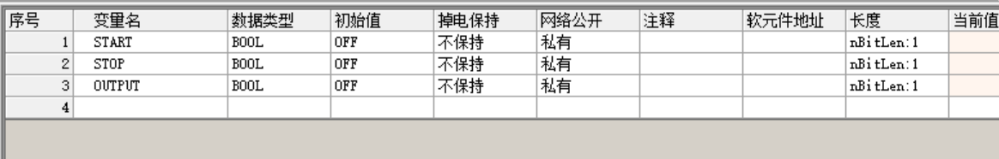
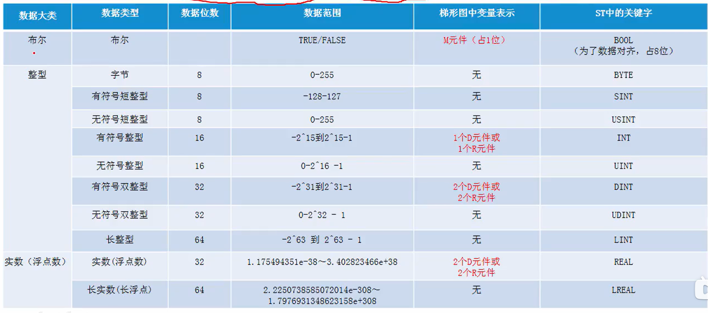
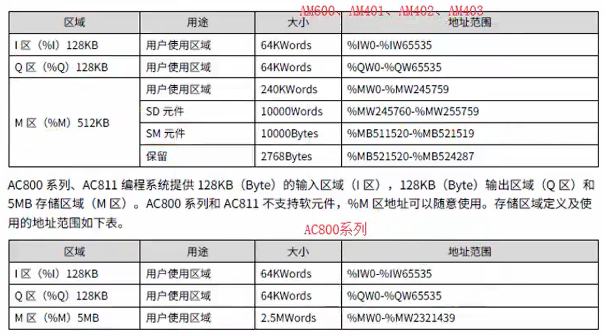
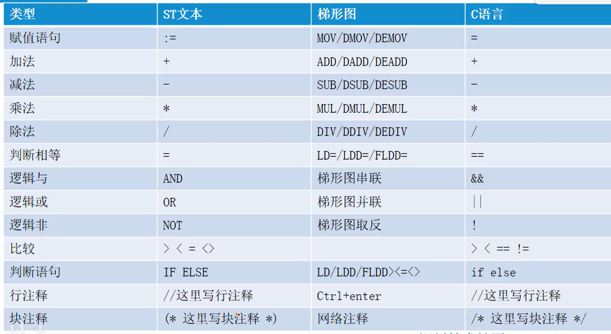
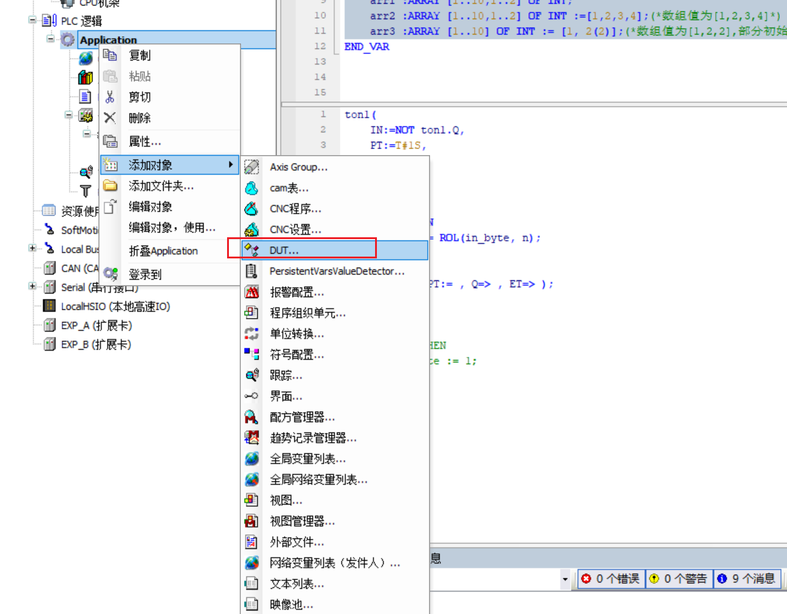
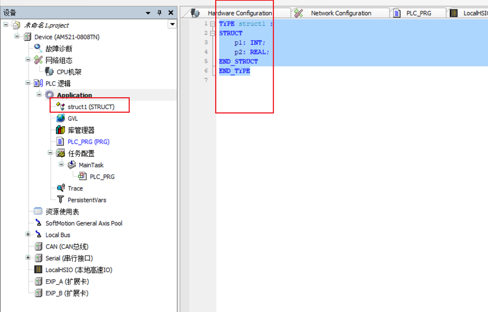
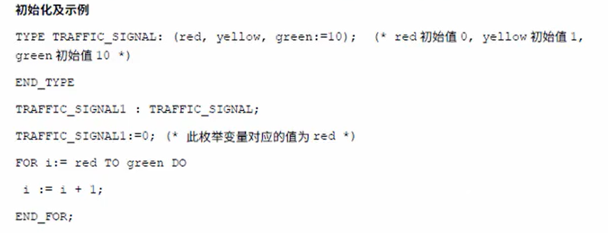

#  入门程序

```c
(*点动*)
//点动
IF START = 1 THEN
	OUTPUT := 1;
ELSE
	OUTPUT := 0;
END_IF;
IF START = 1 THEN
	OUTPUT := 1;
ELSE
	OUTPUT := 0;
END_IF;
```




# 基本数据类型



| **数据类型** | **下限**    | **上限**   | **内存空间** |
| ------------ | ----------- | ---------- | ------------ |
| **BYTE**     | 0           | 255        | 8 Bit        |
| **WORD**     | 0           | 65535      | 16 Bit       |
| **DWORD**    | 0           | 4294967295 | 32 Bit       |
| **LWORD**    | 0           | 264-1      | 64 Bit       |
| **SINT**     | -128        | 127        | 8 Bit        |
| **USINT**    | 0           | 255        | 8 Bit        |
| **INT**      | -32768      | 32767      | 16 Bit       |
| **UINT**     | 0           | 65535      | 16 Bit       |
| **DINT**     | -2147483648 | 2147483647 | 32 Bit       |
| **UDINT**    | 0           | 4294967295 | 32 Bit       |
| **LINT**     | -263        | 263-1      | 64 Bit       |
| **ULINT**    | 0           | 264-1      | 64 Bit       |

**浮点数：**

**REAL** 和**LREAL** 就是所说的浮点类型。它们用来表示有理数。REAL占用32位内存，LREAL占用64位。

**REAL**的范围值: 1.401e-45 to 3.403e+38。

**LREAL**的范围值: 2.2250738585072014e-308 to 1.7976931348623158e+308。

  **注：**数据类型 LREAL的支持取决于目标设备。请查看相应的文档，看在编译过程中，是否64位的类型 LREAL 转换成了 REAL。 (可能会丢失一些信息) 。

 

**字符串**

字符串数字类型变量可以包含任何字符串特性。在声明部分中的大小决定为其保留的内存空间。指的是字符串中字符的序号，可以放在圆括号和方括号中。如果没有大小规范，默认尺寸是80个字符。 字符串程度没有限制，但是字符串功能只能实现1 - 255 字符! 便如变量用一个很长的字符串初始化器变量数字类型，字符串将从右往左相应地截断。

 

**时间数据类型**

数据类型TIME, TIME_OF_DAY (简写为 TOD), DATE, 和 DATE_AND_TIME (简写为 DT) 的处理方式如DWORD。 TIME 和 TOD的时间以毫秒计算。 TOD时间 从 12:00 A.M开始， DATE 和DT 的时间以秒计算，1970年1月1号 12:00 A.M.开始。

**注意以下：**数据类型, 一般

LTIME: IEC 61131-3 标准扩展可用于 64-位时间数据类型

TIME 常量

DATE 常量

DATE_AND_TIME 常量

TIME_OF_DAY 常量 。

## 变量类型

变量有多种类型
1.局部变量

```c
VAR
/这里设置相关变量
END VAR
```

2.输入变量

```
VAR INPUT
//这里设置输入变量
END VAR
```

3.输出变量

```
VAR OUTPUT
//这里设置输出变量
END VAR
```

4.输入输出

```
VAR IN OUT
//这里写输入输出变量
END VAR
```

5.设置常量

```
VAR CONSTANT
/这里设置常量
END VAR
```

## 变量地址定义



语法：%<存储器区前缀><大小前缀><数字>.<数字>

编程系统支持以下3种存储区前缀

1) I:输入，物理输入，，“传感器”
2) Q:输出，物理输出，“执行器”
3) M:存储位置

编程系统支持以下大小前缀：
1)X:Bit,一位。
2)B:Byte,-个字节
3)W:Word,一个字
4)D:Double Word,两个字节（双字节）

第一个数字是变量对应内存前缀的偏移地址，“”后的数字是变量为BOOL类型时，偏移地址后的第几位。

%QX7.5输出区域偏移7个字节，第六位(bit5)。
%QX17输出区域偏移17个字节
%lW215输入区域偏移215个字
%MD48内存区域偏移48个双字
iVar AT%lW1):WORD;  iVar变量是字类型，映射到输入区域偏移10字的位置

### 定义语法：

<标识>{AT<地址>}：<数据类型>{：=<初始值>}
}中是可选部分
g_bStartButton AT %IX100:BOOL := FALSE;

### 实例

```c
VAR
	ton1 :TON;
	in_byte :BYTE:=16#1;
	n :BYTE:=1;
	TON_0: TON;
	btn AT %IX0.0:BOOL :=FALSE;
END_VAR
```

# 赋值与运算类型



还有S=和R=。置位赋值与复位赋值

# 注释

在结构化文本中有两种写注释的方法。
用“(”开始，“)”结束。这允许注释跨行注释。例如：“(This is a comment.)”
单行注释，用“/”作为注释的开始直到本行结束。例如：“/∥This is a comment..”
注释可以在ST编辑器声明或实现部分的任意地方。
注释的嵌套：注释可以放置在其他注释中

```c
// 注释
(*
IF nnnn = 0 THEN
	in_out_byte := 1;
END_IF
*)
```

# 常用语句

## 选择

### 1 IF语句

IF语句用来判断某种条件是否满足。如果满足的话，则执行其内部的代码。

```pascal
IF a = 1 THEN
    boolsc := 0;
    c := 2;
    IF b = 2 THEN
        boolsc := 1;
        c := 1;
    END_IF;
    
ELSIF a = 2 THEN
    boolsc := 1;
    b := 11;

ELSE
    boolsc := 1;
END_IF;
```

IF条件成立执行if的内容，否则有elsIF执行有else执行else的语句。二者都没有就执行end_if之后的语句。

### 2 CASE语句

CASE语句用来完成多分枝的选择判断，比如下面的代码：

```pascal
CASE a OF
    1:
        b := 1;
        boolsc := 1;
    2..4:
        b := 111;
        boolsc := 1;
    5:
        b := 111;
        boolsc := 1;
    ELSE
        b := 1000;
        c := 1001;
END_CASE;
```

当case后的值与下面的值相等时，如a=1时就会执行b=1，boolsc=0语句。如果与下列所有结果都不相等就会执行else中的语句。后执行end_case后的语句。

## 循环语句

循环结构可以在某种条件下反复执行某段代码，包括FOR语句、WHILE语句和REPEAT语句。

### 1 FOR语句

FOR语句用于以次数确定的方式来执行某段代码。

```pascal
FOR count := 1 TO 100 DO
    c := c + 1;
END_FOR;
```

不写参数时，count会自增1.

如果想要自定义count的步数可以使用带by的语句

```pascal
FOR count := 1 TO 100 BY 2 DO
    c := c + 1;
END_FOR;

FOR count := 1000 TO 1 BY -2 DO
    c := c + 1;
END_FOR;
```

这样就可以每次count加2以2为步数自增或自减。但是当自减时，count的值需要大于等于to后面的值，不然会发生错误

### 2 WHILE语句

WHILE语句适用于次数不确定的循环。

```pascal
WHILE a = 1 DO
    b := b + 2;
END_WHILE;
```

只要a=1条件成立就会一直执行程序。这样会发送死循环，所以while要配合条件退出指令使用

```pascal
WHILE a = 1 DO
    b := b + 2;
    
    IF b = 20 THEN
        EXIT;
    END_IF;
END_WHILE;
```

# 特色数据类型

## 数组

```c
<Array_Namex:ARRAY [<ll1>..<ul1>,<ll2>..<ul2>,<ll3>..<ul3>]OF <elem.Type>
```

ll1,ll2,ll3定义区域的下限，ul1,ul2,ul3定义上限，数值必须为整数，elem.Type为每个数组元素数据类型

```c
	arr1 :ARRAY [1..10,1..2] OF INT;
	arr2 :ARRAY [1..10,1..2] OF INT :=[1,2,3,4];(*数组值为[1,2,3,4]*)
	arr3 :ARRAY [1..10] OF INT := [1, 2(2)];(*数组值为[1,2,2],部分初始化*)
```


## 结构体

文件结构及数据类型





```c
TYPE struct1 :
STRUCT
	p1: INT;
	p2: REAL;
END_STRUCT
END_TYPE
```

## 枚举

枚举类型是由若干串常量组成的，这些常量被称为枚举类型值。
语法：

```c
TYpE<identifier>:(<enm_0>,<enm_1>,·.·,<enum n>）|<base data type>;
END TYPE
```

identifier::自定义的枚举类型；enum_n:枚举类型对应的常量值，每个常量可以声明其对应值，如果不声明使用默认值；base data type枚举常量对应数据类型，可以不用声明，默认为整数。




```c
TYPE enum_1 :
(
	enum_member := 0,
	acc :=1
);
END_TYPE
```

如果枚举添加时没有赋值，则会参数给一个默认值。从0开始依次自增。


