# 一个简单任务

## 跑马灯程序

```c
PROGRAM PLC_PRG
VAR
	ton1 :TON;
	in_byte :BYTE:=16#1;
	n :BYTE:=1;
END_VAR
    
ton1(
	IN:=NOT ton1.Q,
	PT:=T#1S,
	Q=>,
	ET=>
	);
	
IF ton1.Q THEN
	in_byte := ROL(in_byte, n);
END_IF
```

这是一个流水灯任务，以1s为循环。

### 添加IO映射

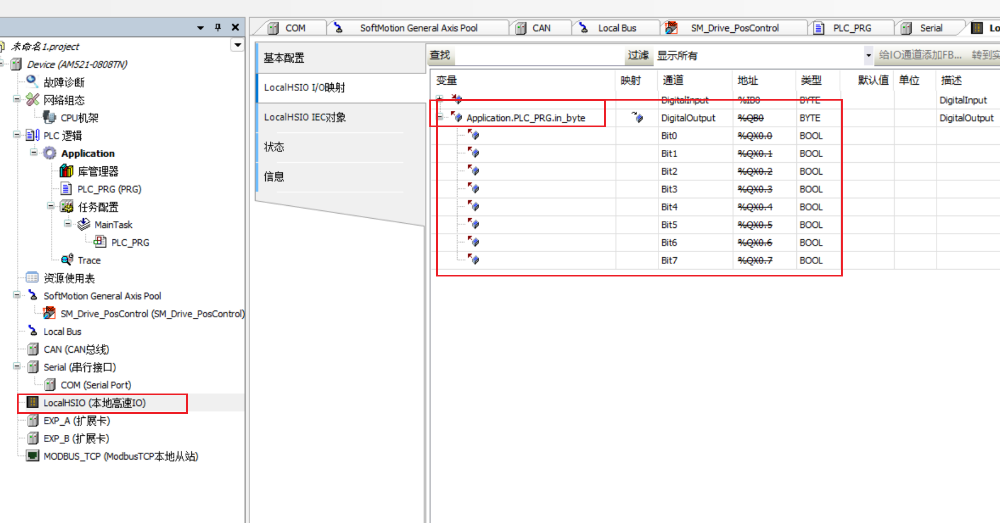

就可以实现在实体IO的输出了。

# 通信配置

## 本地模块配置


具体的io映射

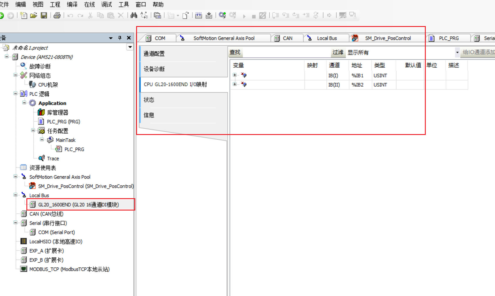

变量映射


## EtherCat配置

3、勾选了EtherCAT主站和CANopen:主站，在任务栏都会新增出相应的通信任务。其中**EtherCAT主站的任务默认优先为级为0（最高），任务周期必须保证和EtherCAT循环周期一致。**因此更改EtherCAT循环周期，必须相应的更改EtherCAT任务周期(EtherCAT务必唯一且为最高优先级)

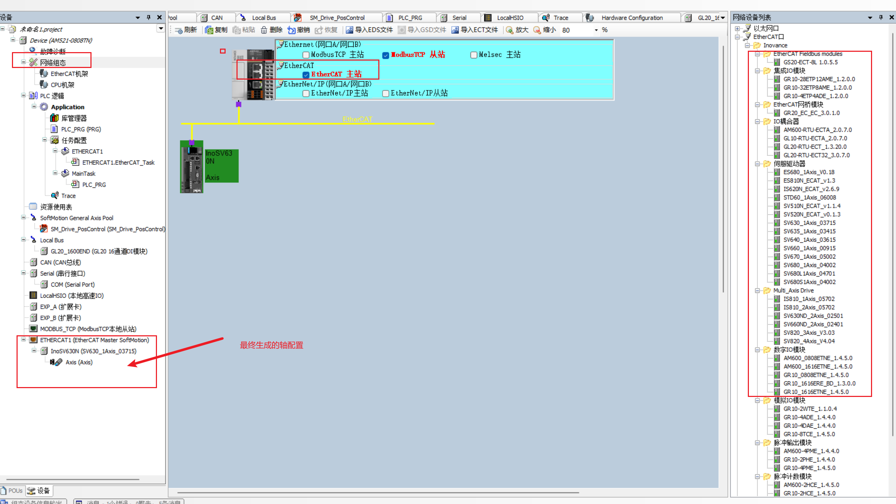

 两个任务周期必须保持一致。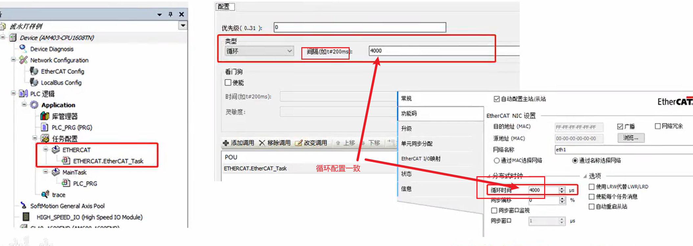

## modbus配置/modbus-TCP配置

串口与TCP/IP配置除通信模式外其余部分都相同。


开启modbus配置


### 主站配置

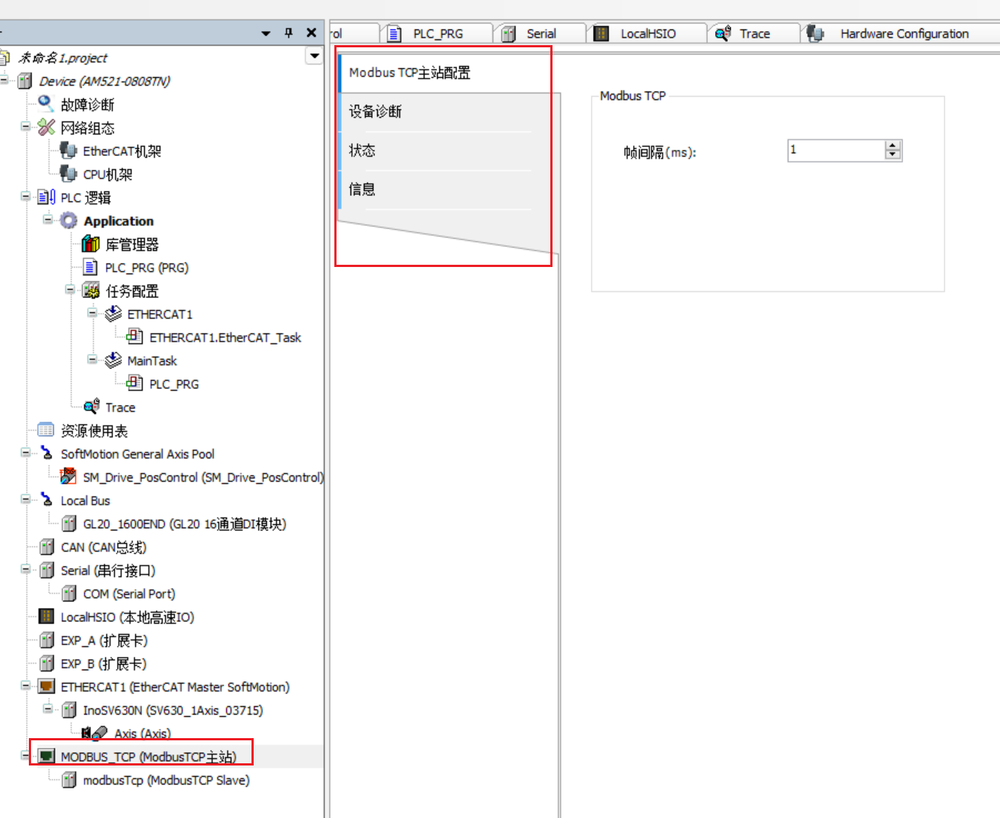

### 从站配置

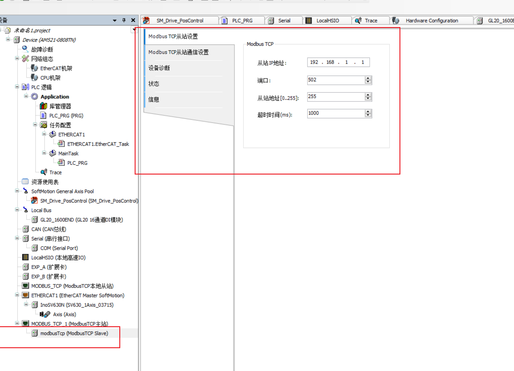

使能从站

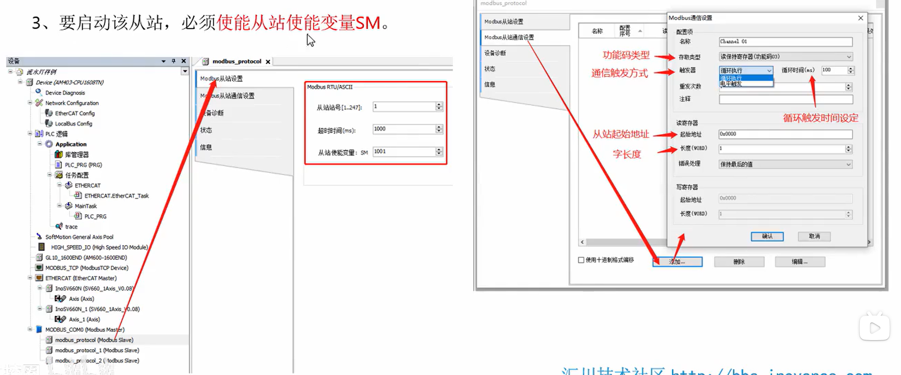

### 通信配置

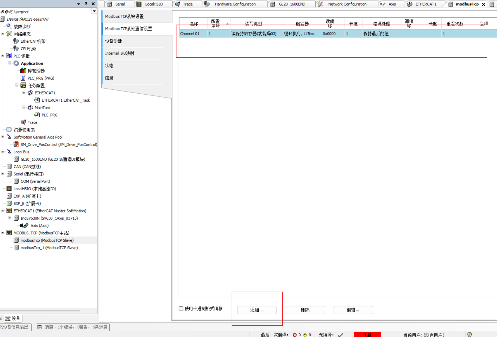

配置后的地址映射

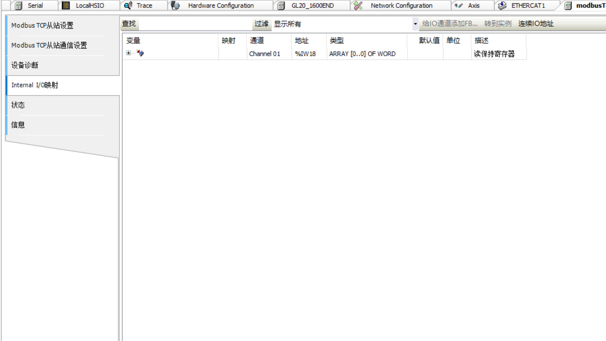

# 库文件配置

库文件用于存放Inoproshop中可多次使用的**程序组织单元(POU)**。

这些POU可以从已有的项目中复制到库中，用户也可以直接新建库项目，在项目中自己定义库。库中存放有用户希望多次调用的功能块、函数或程序时，可以节省大量的编程时间，并提高效率。

库文件除了是函数、功能块和程序的集合，其中还包含一些特殊定义的结构体，枚举类型等。从功能上分可以将库文件分为**系统库文件、应用库文件以及自定义库文件。**

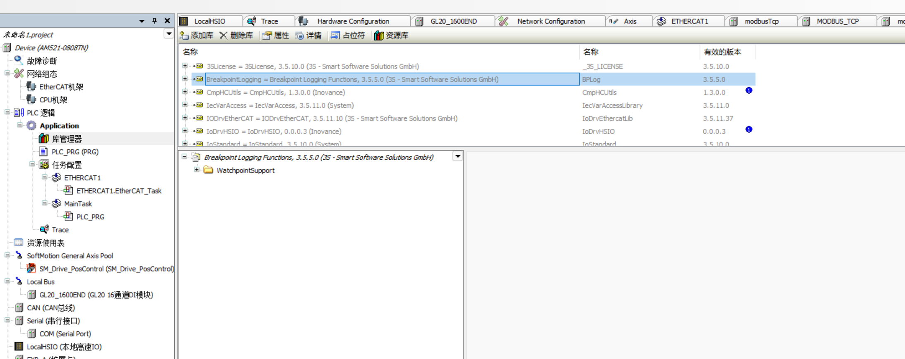

库文件的安装。

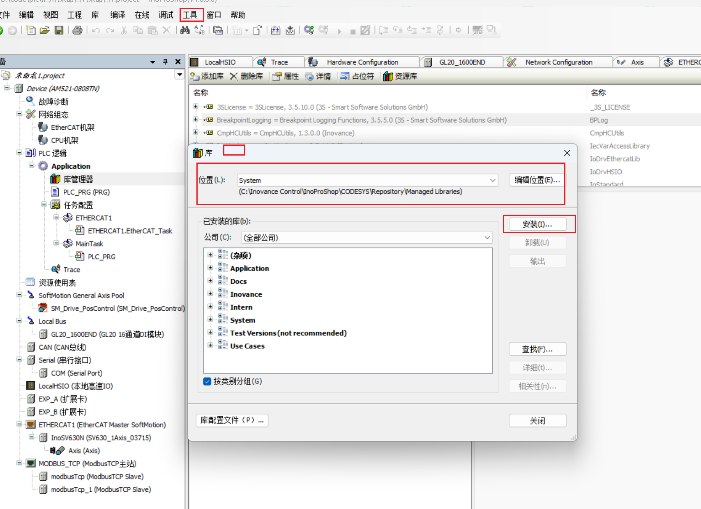

# 第三方设备导入

## EtherCat设备导入xml文件的导入

1.在建立的工程的【设备】页内点击【Network Configuration】→点击【导入ECT文件】；

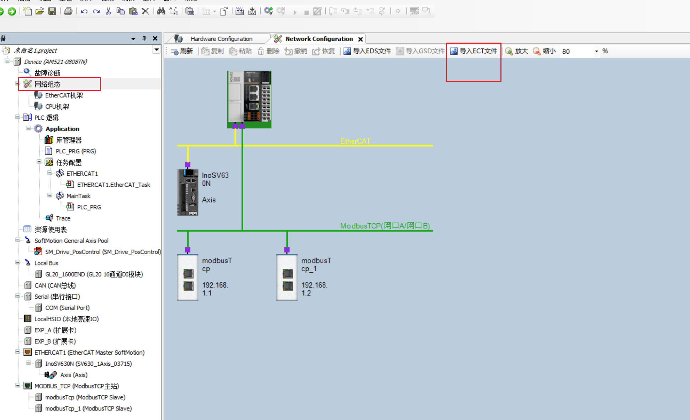


## CANOPEN设备的EPS文件导入

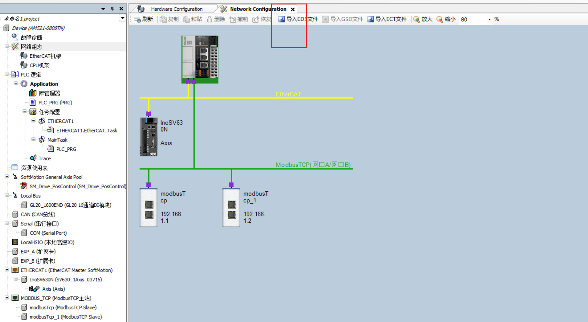

# 变量关联

### 方法1-zaiIO配置里关联

小型PLC直接可以控制XN点来达到控制输入输出的目的，在InoProShop后台中，需要将用户定义的变
量和IO关联起来。

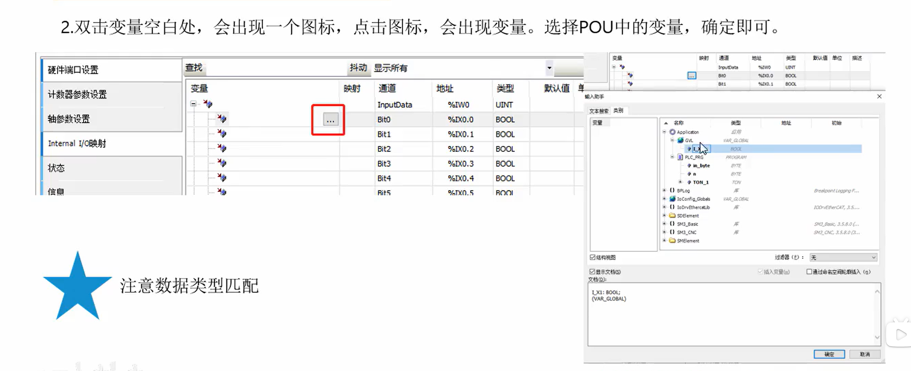

这种方法匹配变量后，地址栏对应的物理地址会无效，不可使用

### 方法2-直接在ST文本中使用

1.我们看到第一个输出点地址为QX0.0,定义的关联地址格式为：
“变量名称”AT“IO地址”：“变量类型”

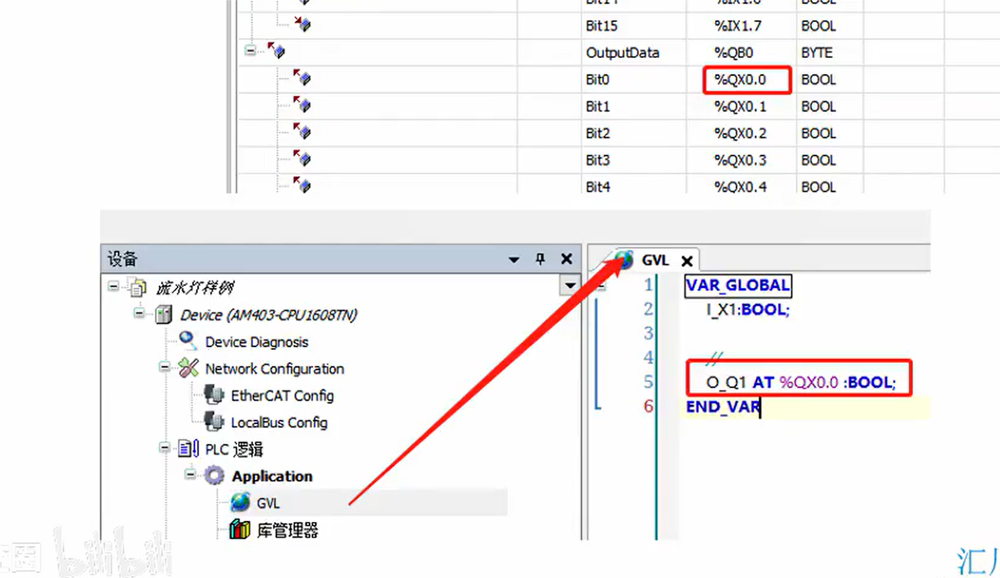

## 掉电保持

1、掉电保持变量在PLC掉电、程序下载后继续保留原来的值，常用来定义工程中重要的参数，防止
PLC突发掉电或者程序下载而导致的重要参数丢失。
掉电保持特性主要通过属性关键字PERSISTENT RETAIN来声明。

```c
VAR_GLOBAL PERSISTENT RETAIN
	ton1 :TON;
	in_byte :BYTE:=16#1;
	n :BYTE:=1;
END_VAR
```


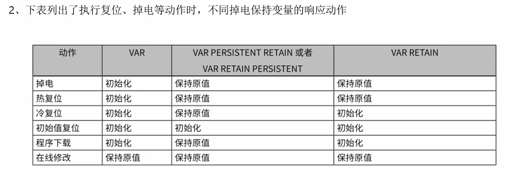

### 开启掉电保持功能

3、如果工程中定义了掉电保持变量，则必须生成一个掉电保持变量表，否则定义的变量不具有掉电 保持功能。掉电保持变量表可通过以下两种方式生成：
■手动添加：通过右键“应用”-“添加对象”-“掉电保持变量”来添加掉电保持变量表：
■自动添加：当声明了掉电保持变量，编译时会自动创建掉电保持变量表。
掉电保持变量表包含两种模式：传统模式和标准模式。

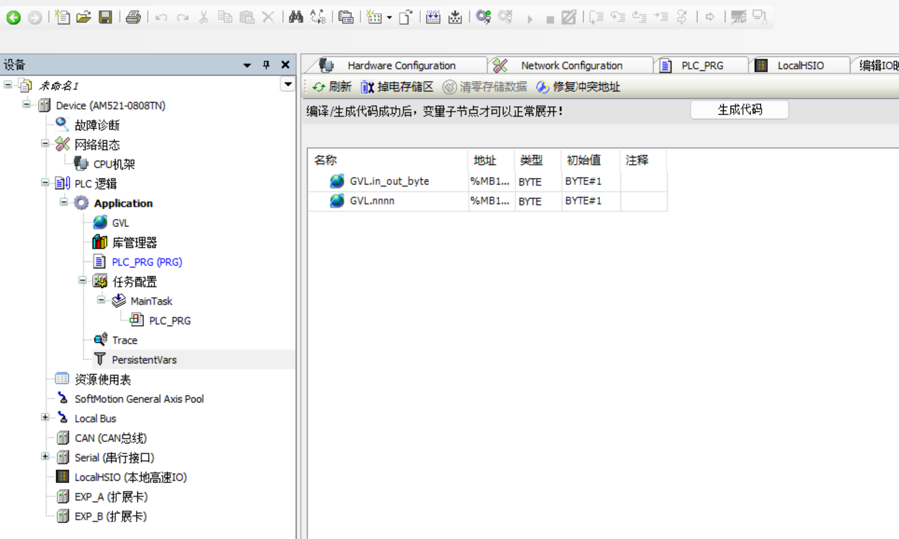

### ps

**9、在程序任意一个地方使用任何一个掉电保持变量所处全局变量表的变量，然后进行编译，自动生成**
**标准模式下的Persistentvars;**

