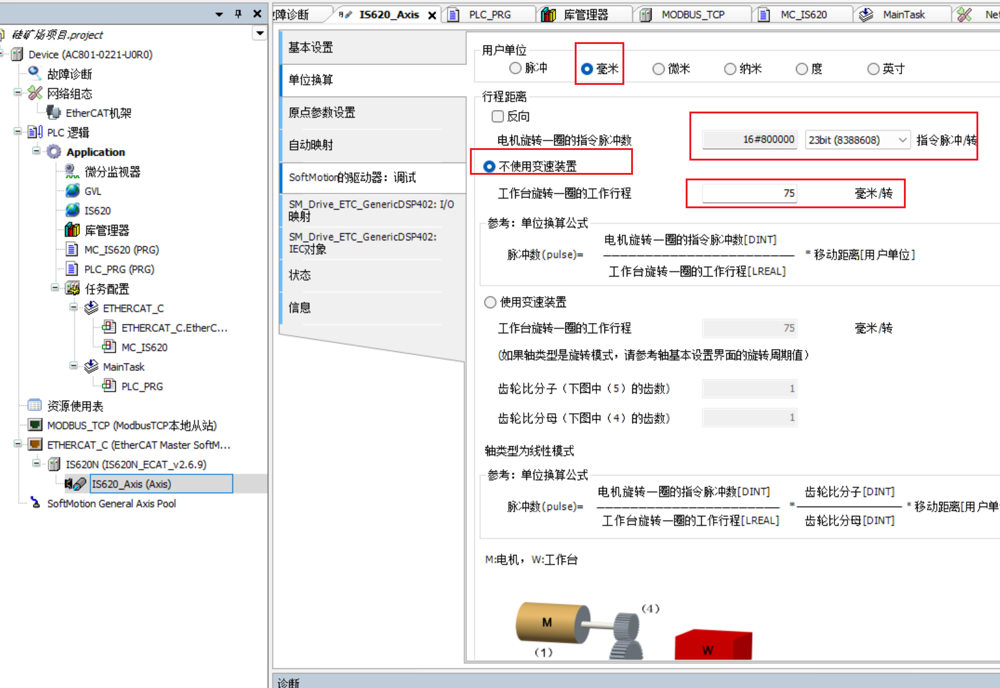
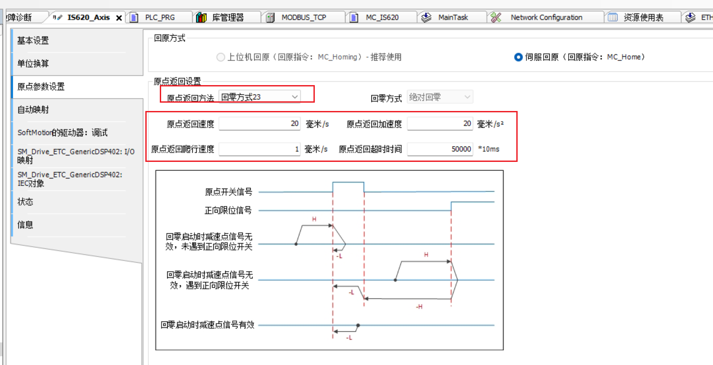

# 总览


## 2.连接西门子HMI

### 西门子配置


### 汇川PLC配置


### 元件配置


## 3.连接伺服（IS620）

硬件的使用一定要按照官方文档来配置，如果使用第三方的元器件可以会导致不会正常允许.

### 添加网络配置


添加组态完成后，会出现


### 软件配置

添加一个程序块，在伺服组态中调用该程序块，并设置好伺服与主程序的循环间隔。**注意主程序的间隔要大于伺服间隔，否则程序执行会出问题。**比如主程序中的更改不会及时同步到伺服导致伺服无法控制


### 运行测试

全局变量：

```c
VAR_GLOBAL
	使能: BOOL;
	使能执行: BOOL;
	使能状态1: BOOL;
	使能状态2: BOOL;
	使能状态3: BOOL;
	
	reset:BOOL;
	
	halt_exec: BOOL;
	
	homing: BOOL;
	
	jow_enable: BOOL;
	jow_cw: BOOL;
	jow_ccw: BOOL;
	jow_speed: LREAL;
	
	abs_enable: BOOL;
	abs_position: LREAL;
	abs_apeed: LREAL;
	abs_done: BOOL;
	
	rel_enable: BOOL;
	rel_position: LREAL;
	rel_apeed: LREAL;
	rel_done: BOOL;
	
END_VAR
```

code:

```c
MC_Power_0(
	Axis:= IS620_Axis, 
	Enable:= 使能, 
	bRegulatorOn:= 使能执行, 
	bDriveStart:= TRUE, 
	Status=> 使能状态1, 
	bRegulatorRealState=> 使能状态2, 
	bDriveStartRealState=> 使能状态3, 
	Busy=> , 
	Error=> , 
	ErrorID=> );
	
MC_Reset_0(Axis:= IS620_Axis, Execute:= reset, Done=> , Busy=> , Error=> , ErrorID=> );	
	
MC_Halt_0(
	Axis:= IS620_Axis, 
	Execute:= halt_exec, 
	Deceleration:= , 
	Jerk:= , 
	Done=> , 
	Busy=> , 
	CommandAborted=> , 
	Error=> , 
	ErrorID=> );	
	
MC_Home_0(
	Axis:= IS620_Axis, 
	Execute:= homing, 
	Position:= , 
	Done=> , 
	Busy=> , 
	CommandAborted=> , 
	Error=> , 
	ErrorID=> );	
	
MC_Jog_0(
	Axis:= IS620_Axis, 
	JogForward:= jow_cw, 
	JogBackward:= jow_ccw, 
	Velocity:= jow_speed, 
	Acceleration:= 100, 
	Deceleration:= 100, 
	Jerk:= , 
	Busy=> , 
	CommandAborted=> , 
	Error=> , 
	ErrorId=> );	
	
MC_MoveAbsolute_0(
	Axis:= IS620_Axis, 
	Execute:= abs_enable, 
	Position:= abs_position, 
	Velocity:= abs_apeed, 
	Acceleration:= 100, 
	Deceleration:= 100, 
	Jerk:= , 
	Direction:= , 
	BufferMode:= , 
	Done=> abs_done, 
	Busy=> , 
	Active=> , 
	CommandAborted=> , 
	Error=> , 
	ErrorID=> );	
	
MC_MoveRelative_0(
	Axis:= IS620_Axis, 
	Execute:= rel_done, 
	Distance:= rel_position, 
	Velocity:= rel_apeed, 
	Acceleration:= 100, 
	Deceleration:= 100, 
	Jerk:= , 
	BufferMode:= , 
	Done=> rel_done, 
	Busy=> , 
	Active=> , 
	CommandAborted=> , 
	Error=> , 
	ErrorID=> );	
```

修改Ethercat相关配置


### 轴配置

设置为绝对值编码器，线性模式


单位设置毫米，设置指令脉冲，转速



选择回原方式23，设置回原速度



修改电机惯量为3000


## 4.EIP配置

### easy521从站配置


添加etherNet的连接


链接IO映射。


配置导出为eds格式。


添加实体映射。

```stata
//输入映射
d20.0 := x0;
d20.1 := x1;
d20.2 := x2;
d20.3 := x3;
d20.4 := x4;
d20.5 := x5;
d20.6 := x6;
d20.7 := x7;

//输出映射
y0 := d10.0;
y1 := d10.1;
y2 := d10.2;
y3 := d10.3;
y4 := d10.4;
y5 := d10.5;
y6 := d10.6;
y7 := d10.7;

//模拟量映射
d21 := _ExtCard[0].AD0;
```


调用该映射。

### AC801主站配置


导入easy521的eds配置文件。plc添加etherNet/IP配置，将刚导入的配置添加进去。


配置easy的IP地址


添加刚才在easy中配置的connection1.可以看到映射的byte为8.符合我们刚才的配置。


检测输入输出参数。配置完成

### 使用


使用将X0映射到bool1，EIP链接是从IW18开始根据HMI中映射相关配置可以计算出IX36.0是IW18的第一个位。将easy521配置的模拟量映射到intValue中。


