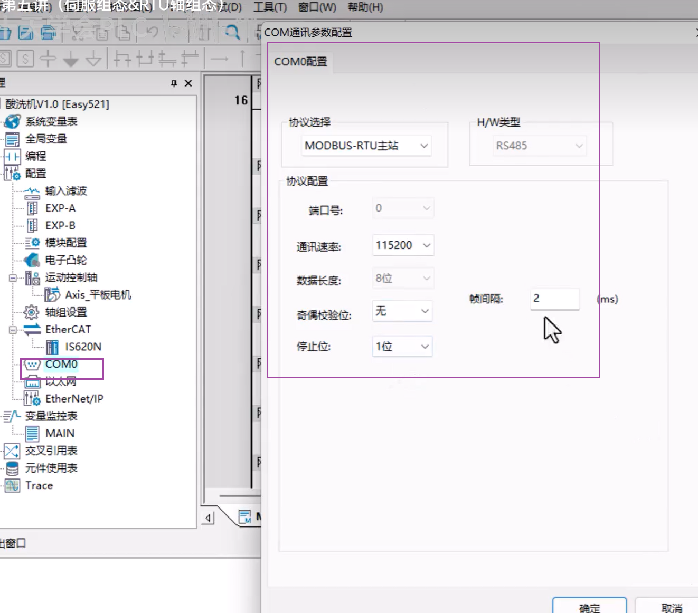

#  程序开发顺序

###  程序拓扑

##  整体软件架构

###  项目分析步骤

step1：建IO映射表（输入变量表、输出变量表）目的：暂停，安全触发，安全防护，信号隔离

step2：模式选择（手动模式、清理模式、工作模式）

step3：手动调用

step4：清理调用

step5：工作调用

step6：mes交互调用

step7：安全防护、光幕入侵检查

step8：温度pid调用

step9：变频器对象调用

#  01.组态伺服（Ether Cat类型）

##  组态

将plc与伺服通过网线连接后

在软件内开启自动扫描

出现

点击更新组态。后

出现，就表示已组态完成。组态完成后如果调试时有问题，先断一次电，保存数据然后重新通电就可以。

###  配置运动控制轴

###  调试

###  导入设备xml

在设备官网下载对应xml文件后直接导入就好。

#  02.组态modbus-rtu（485通信）

电脑测试时，电脑要安装对应的串口驱动。

1、站号正确
2、波特率一致
3、数据位一致（8e1：数据位8位，奇偶校验，1位校验位）
4、校验方式一致
5、硬件接线正确

###  组态

标有485的正负两根线相连就可以

###  plc作为主站的配置

###  配置从站

6002是设备自定义的具体位置通过设备的说明书寻找。读和写需要不同的配置。

配置完成后就可以通过映射地址来驱动设备了。

#  03.HML设置

进入HMI先设置ip。然后在进行各种操作。

#  04.汇川伺服调参原则及计数方法

##  相关的仪器

### 编码器

将旋转信号转换成二进制01信号的设备

编码器连接到plc时要接到高速输入的输入端上（如汇川h3u的x0-x7）。

#### 光电型增量式编码器

光栅盘：可以透过光，编码器中会有一套光信号接受装置，当光透过光栅盘到接收器时，产生一个1信号，当光过不来时，信号位0.通过这种方式，编码器就完成了旋转量到二进制量的转换。

增量式：没有记忆功能

绝对值：可以记忆断电前的位置

### 减速机

两个作用：

- 最大扭矩
- 调节速度

##  单位换算设置

编码器旋转一圈的脉冲数-1048576（2的20次方）

###  脉冲数

**导程：工作台旋转一圈的移动里**

###  原点返回速度

一般设置小一点防止撞车

###  绝对定位

加速度是目标速度的10倍

#  05.模拟量标准化

##  模拟量采集（电压型、电流型）

电流型精度高于电压型。

模拟量采集---管道压力、夹爪力矩、电机调速、阀门压力

###  汇川模拟量模块

2AD1DA-V

2AD：支持两路模拟量信号检测

1DA：一路模拟量输出电压信号

###  模块配置

注意位置和IO映射

###  传感器-将物理量转化位电信号

# HMI设计

## 手动程序设置的一些原则

手动MI设计原则：

- 1、所有对象的主控命令（动作命令）、需要在手动模式确认激活才能发出
- 2、切换到手动模式=放弃当前自动生产任务，清理参数
- 3、主控命令（安全命令）不能受手动激活的限制：普遍写法

## 界面参考

​	

