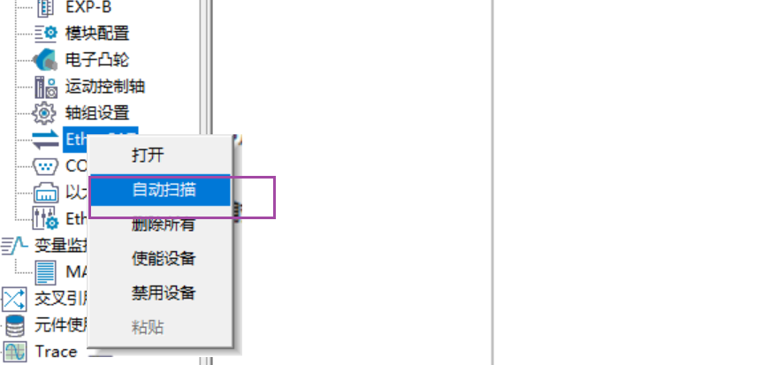
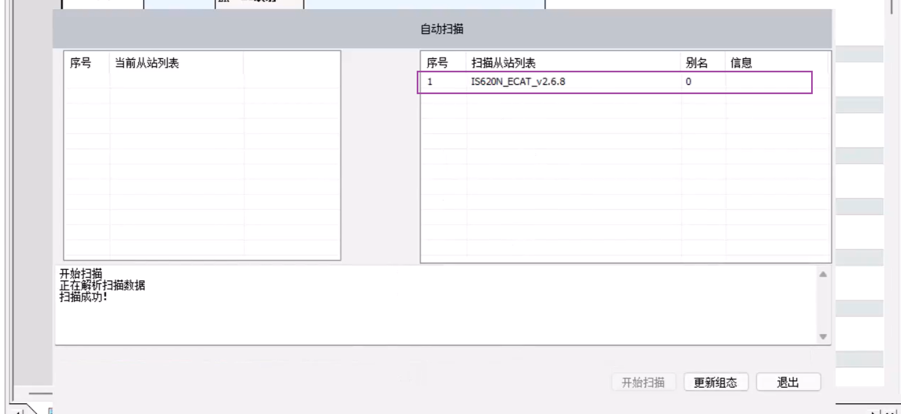
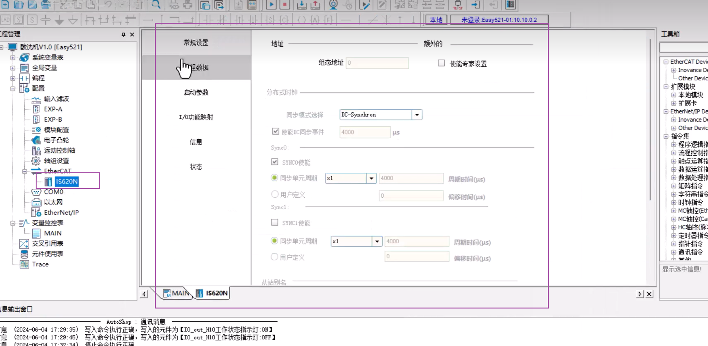
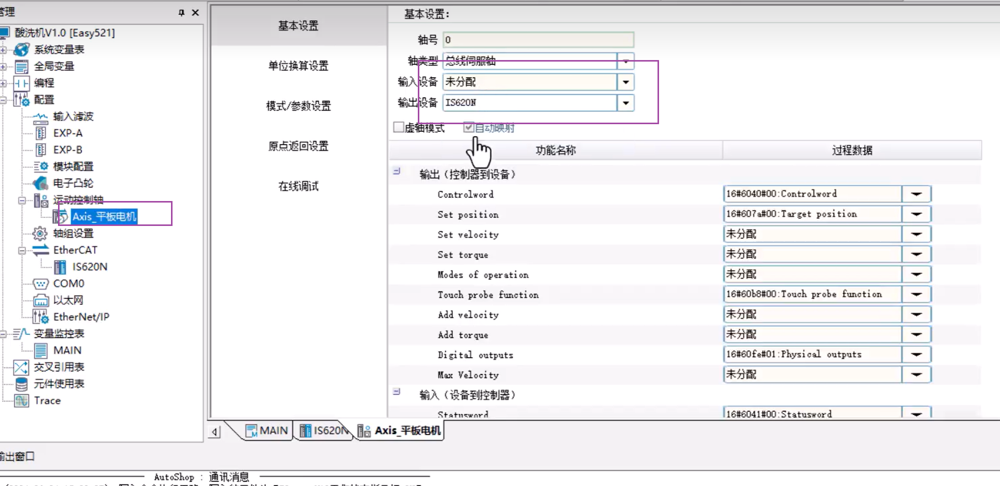
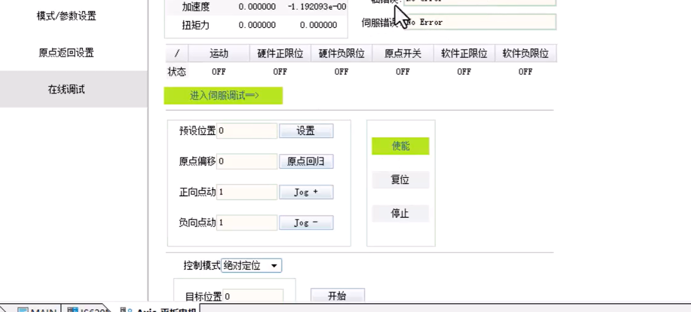
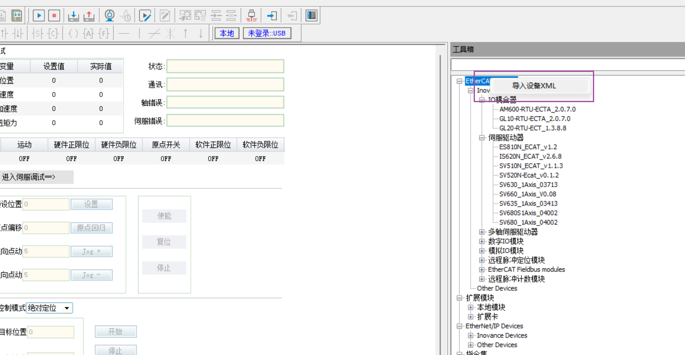
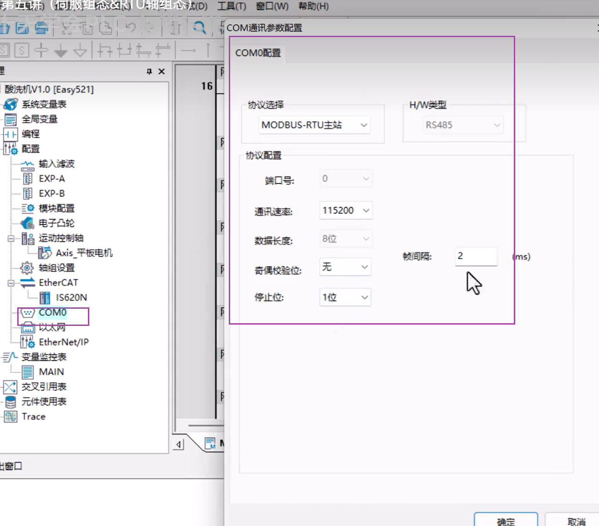
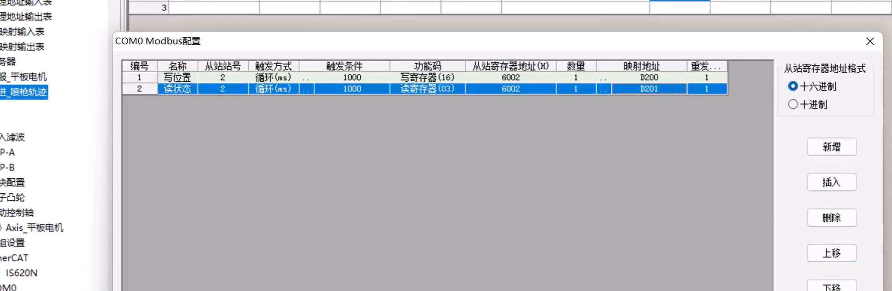

#  程序开发顺序

step1：建IO映射表（输入变量表、输出变量表）目的：暂停，安全触发，安全防护，信号隔离

step2：模式选择（手动模式、清理模式、工作模式）

step3：手动调用

step4：清理调用

step5：工作调用

step6：mes交互调用

step7：安全防护、光幕入侵检查

step8：温度pid调用

step9：变频器对象调用

#  01.组态伺服（Ether Cat类型）

##  组态

将plc与伺服通过网线连接后

在软件内开启自动扫描

出现

点击更新组态。后

出现，就表示已组态完成。组态完成后如果调试时有问题，先断一次电，保存数据然后重新通电就可以。

###  配置运动控制轴

###  调试

###  导入设备xml

在设备官网下载对应xml文件后直接导入就好。

#  02.组态modbus-rtu（485通信）

电脑测试时，电脑要安装对应的串口驱动。

1、站号正确
2、波特率一致
3、数据位一致（8e1：数据位8位，奇偶校验，1位校验位）
4、校验方式一致
5、硬件接线正确

###  组态

标有485的正负两根线相连就可以

###  plc作为主站的配置

###  配置从站

6002是设备自定义的具体位置通过设备的说明书寻找。读和写需要不同的配置。

配置完成后就可以通过映射地址来驱动设备了。

#  03.HML设置

进入HMI先设置ip。然后在进行各种操作。
