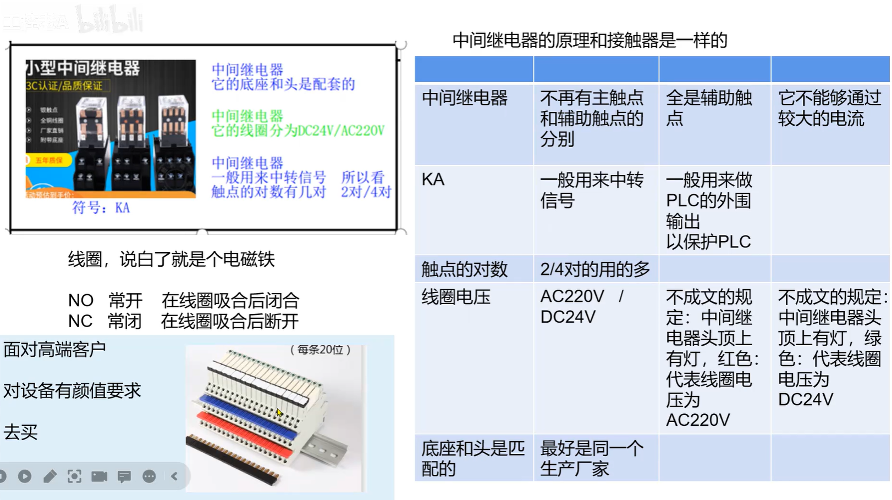
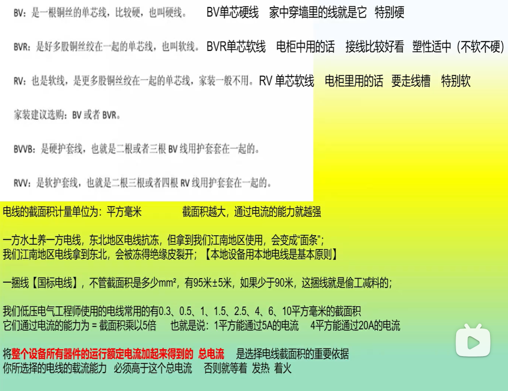
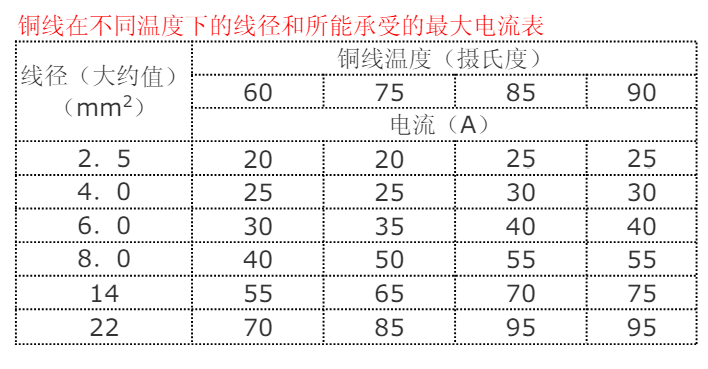

#    中间继电器

 

中间继电器它的底座和头是配套的。

中间继电器它的线圈分为DC24V/AC220V

中间继电器一般用来中转信号。所以看触点的对数有几对（2对/4对）

#  电线的选择

 

 [trvvp](http://www.lskable.com/Products/trvv2525tl.html)是一款电缆线的型号，常规叫法是[屏蔽拖链电缆](http://www.lskable.com/Products/purpbtldl.html)，在普通[拖链电缆](http://www.lskable.com/tldl.html)里加了一层屏蔽层，是安装在拖链盒中跟随拖链盒来回弯曲、移动使用的电缆，弯曲次数在300万次以上。trvvp是用量比较多的一款电缆。

### 电缆选项

导线的截面积所能正常通过的电流可根据其所需要导通的电流总数进行选择，一般可按照如下口诀进行确定：“十下五，百上二，二五三五四三界，柒拾玖五两倍半，铜线升级算。”意思是 10 平方以下的铝线，毫米平方数乘以5 就可以了，要是铜线就升一个档，比如 2.5 平方的铜线，就按 4 平方计算。一百以上的都是截面积乘以 2，二十五平方以下的乘以 4，三十五平方以上的乘以3，柒拾和95 平方都乘以 2.5，口诀好记对工作很有益处。

一般铜线安全计算方法

-  2.5 平方毫米铜电源线的安全载流量--28A。 
-  4 平方毫米铜电源线的安全载流量--35A 。
-  6 平方毫米铜电源线的安全载流量--48A 。 
-  10 平方毫米铜电源线的安全载流量--65A。 
-  16 平方毫米铜电源线的安全载流量--91A 。 
-  25 平方毫米铜电源线的安全载流量--120A。

如果是铝线，线径要取铜线的 1.5-2 倍。 如果铜线电流小于 28A，按每平方毫米 10A 来取肯定安全。如果铜线电流大于 120A，按每平方毫米 5A 来取。说明：以上只能作为估算，不是很准确。

室内用线，记住电线用 6 平方毫米以下的铜线，每平方电流不超过10A就是安全的。从这个角度讲，你可以选择 1.5 平方的铜线或2.5 平方的铝线。

10 米内，导线电流密度 6A/平方毫米比较合适。10-50 米，导线电流密度3A/平方毫米。50-200 米，导线电流密度 2A/平方毫米，500 米以上要小于1A/平方毫米。从这个角度，如果不是很远的情况下，你可以选择4 平方铜线或者 6 平方铝线。如果真是距离 150 米供电，一定采用4 平方的铜线。

导线的阻抗与其长度成正比，与其线径成反比。请在使用电源时，特别注意输入与输出导线的线材与线径问题。以防止电流过大使导线过热而造成事故。

### 相关原件选项

保险丝和热继电器约1.05-1.1倍

交流接触器：4倍

空开：1.7倍

控制电路最好在变压器500m范围内，越远电压损失越大。
