#   数字电路

概念：用数字信号完成对数字量的算术运算与逻辑运算的电路称为数字电路。

###  数字信号

在电学中用1表示电的、正确的。0表示不带电、错误的。是对电路抽象出来的一个概念。

**数字信号用波形图表示就是：他的状态会瞬间变化。从0到1、从1到0.**

**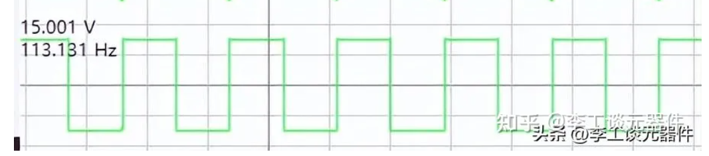** 

**模拟信号：不会瞬间消失，是一个连续不断的信号.**

**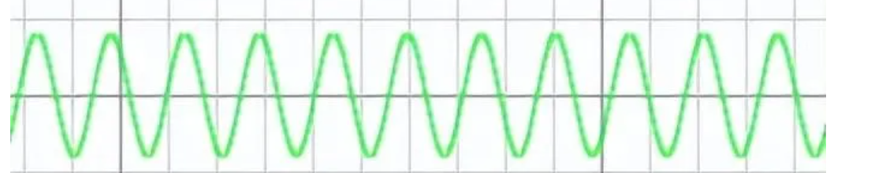** 

###  数模转换（A/D）

由于系统的实际对象往往都是一些模拟量（如温度、压力、位移、图像等），要使计算机或数字仪表能识别、处理这些信号，必须首先将这些模拟信号转换成数字信号；而经计算机分析、处理后输出的数字量也往往需要将其转换为相应模拟信号才能为执行机构所接受

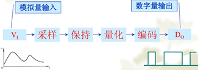

A/D转换是将模拟信号转换为数字信号，转换过程通过取样，保持，量化和编码四个步骤完成。

###  进制转换

###   与非门

#  模拟电路

##  二极管

PN结

####  电子二极管

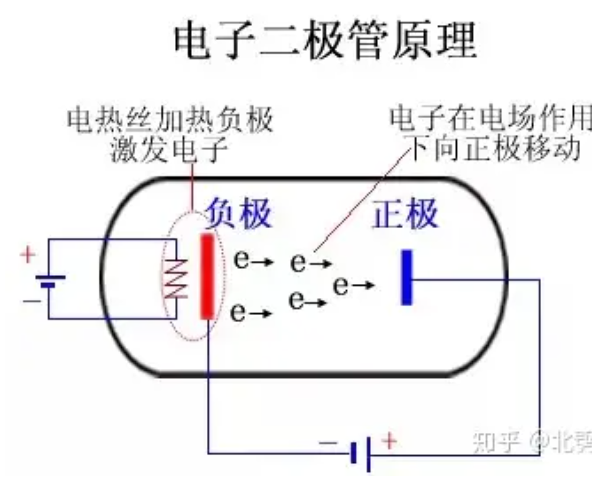 

####  晶体二极管

又称半导体二极管。1947年，美国人发明。在半导体二极管内部有一个PN结和两个引出端

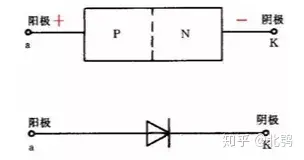

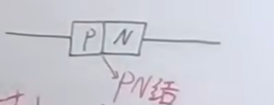 

**pn结特点：单向导通。**

二极管伏安特性：

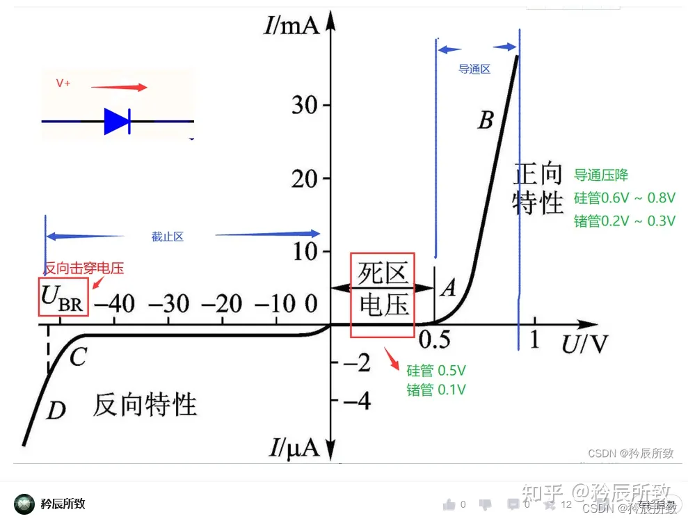

外加电压Uw方向为P→N时，Uw大于起动电压，二极管导通；

外加电压Uw方向为N→P时，Uw大于反向击穿电压，二极管击穿。

####  特性

正向导通反向截止。高于启动电压是会导通。

###  作用

> [交流转直流](https://zhuanlan.zhihu.com/p/391794450)

整流：把交流电变成直流电的过程叫整流。

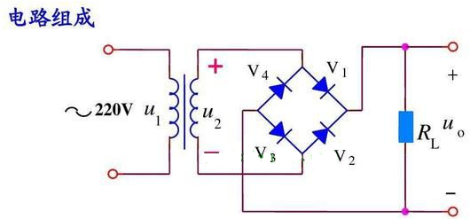

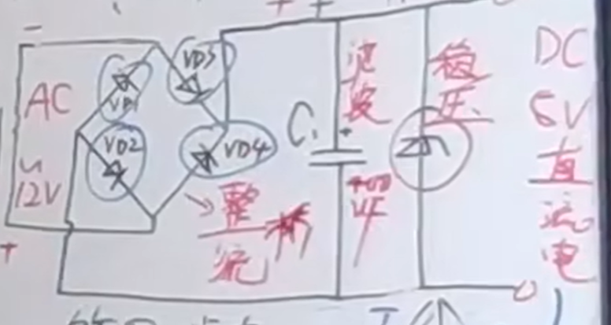 

电容滤波，稳压二极管。

##  三极管

三极管（9013）

实物图

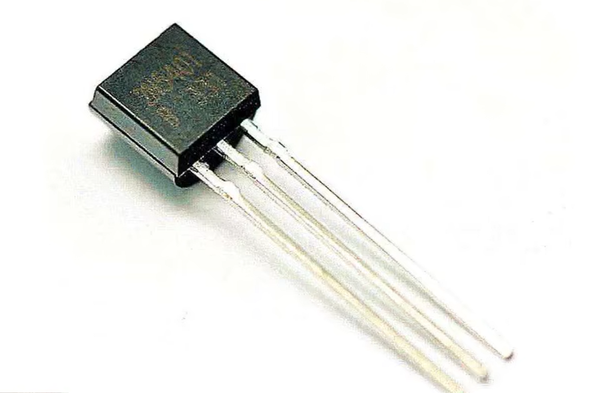 

电路图

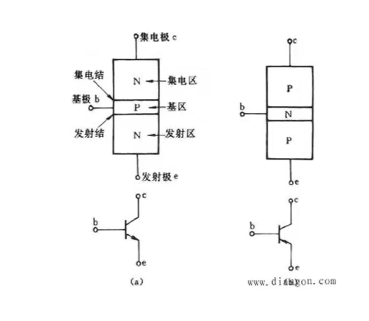

结构示意图：

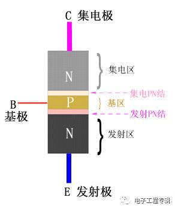 

9013三极管

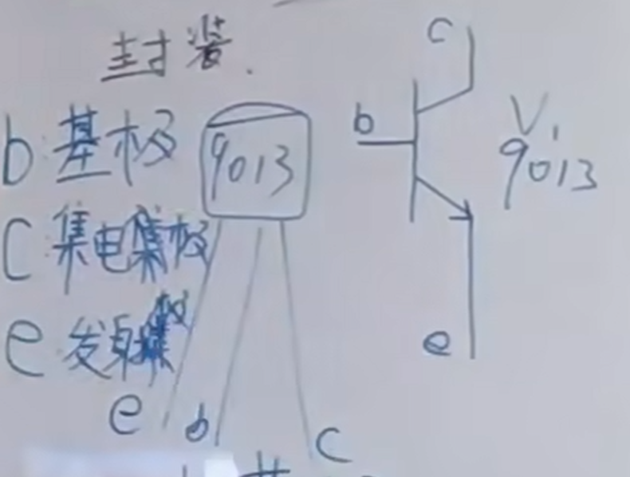

###  分类

按pn结分：

- 一类NPN型
- 二类PNP型

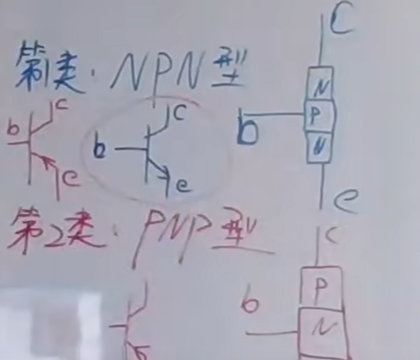 

####  传感器

三线传感器：

棕正蓝负黑信号。

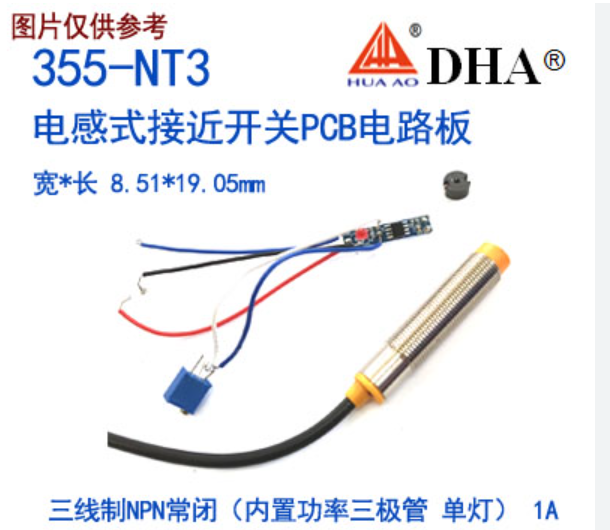 

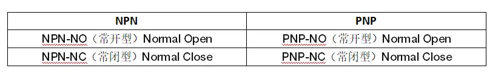 

PNP与NPN型传感器一般有三条引出线，即**电源线VCC（电源正）、0V线（电源负），Out信号输出线**。

**1、PNP类**

PNP是指当有信号触发时，信号输出线out和电源线VCC连接，相当于输出高电平的电源线。
对于PNP-NO型：

在**没有信号触发时**，输出线是悬空的，就是VCC电源线和out线断开。

**有信号触发时**，发出与VCC电源线相同的电压，也就是out线和电源线VCC连接，**输出高电平VCC**。
对于PNP-NC型：

在**没有信号触发时**，发出与VCC电源线相同的电压，也就是out线和电源线VCC连接，**输出高电平VCC**。

当**有信号触发后**，输出线是悬空的，就是VCC电源线和out线断开。

**2、NPN类**

NPN是指当有信号触发时，信号输出线out和0v线连接，相当于输出低电平，0v。

对于NPN-NO型：

在没有信号触发时，输出线是悬空的，就是0v线和out线断开。

有信号触发时，发出与OV相同的电压，也就是out线和0V线连接，输出输出低电平OV。
对于NPN-NC型：

在没有信号触发时，发出与0V线相同的电压，也就是out线和0V线连接，输出低电平0V。当有信号触发后，输出线是悬空的，就是0V线和out线断开。

总结起来即为：

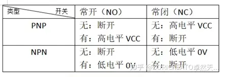

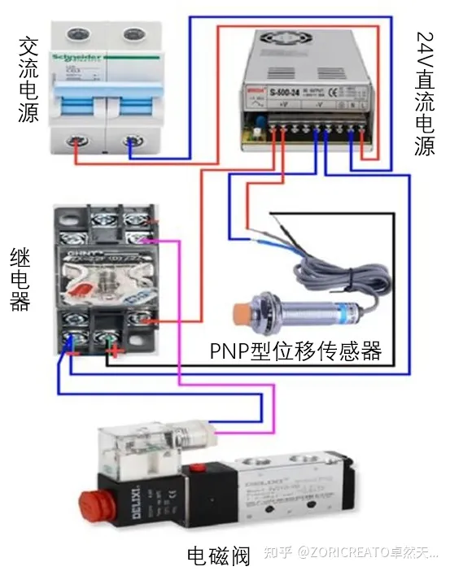 

**工作原理**：PNP型控制高电平（ +24 ），0端作为公共端，当有物体在接近开关检测范围内时，输出高电平+24V，继电器工作，继电器常开触点闭合，电磁阀得电工作。

###  作用

- 放大功能：小电流微量变化，在大电流上放大表现出来。
- 开关功能：以小电流控制大电流的通断

####  放大作用

基尔霍夫定律：流入节点的电流等于流出节点的电流

三极管的放大功能

IC = β * IB （其中β≈ 10~400 ）

例：当基极通电流IB=50μA时,集极电流:

IC=βIB=120*50μA=6000μA

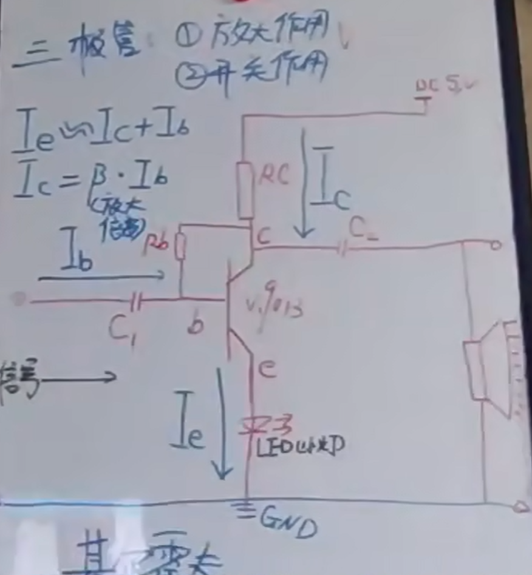 

 

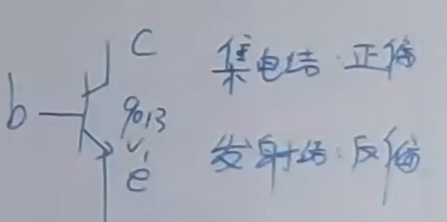 

bc集电结，be发射结。

三极管状态：

- 放大状态
- 饱和状态
- 截止状态

#### 输出特性曲线

基极电流IB一定时，集极IC与集-射电压UCE之间的关系曲线，是一组曲线。

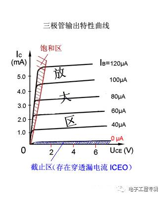3

当IB=0时, IC→0 ,称为三极管处于截止状态，相当于开关断开;

当IB>0时, IB轻微的变化,会在上以几十甚至百多倍放大表现出来;

当IB很大时，IC变得很大，不能继续随IB的增大而增大，三极管失去放大功能，表现为开关导通。

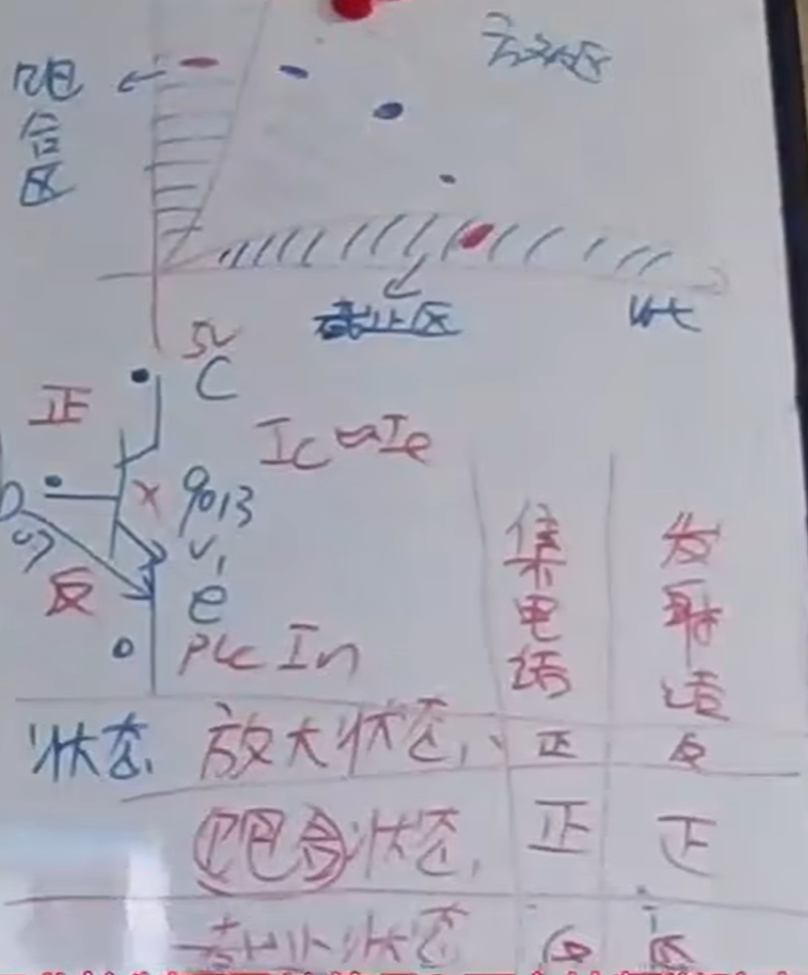 

