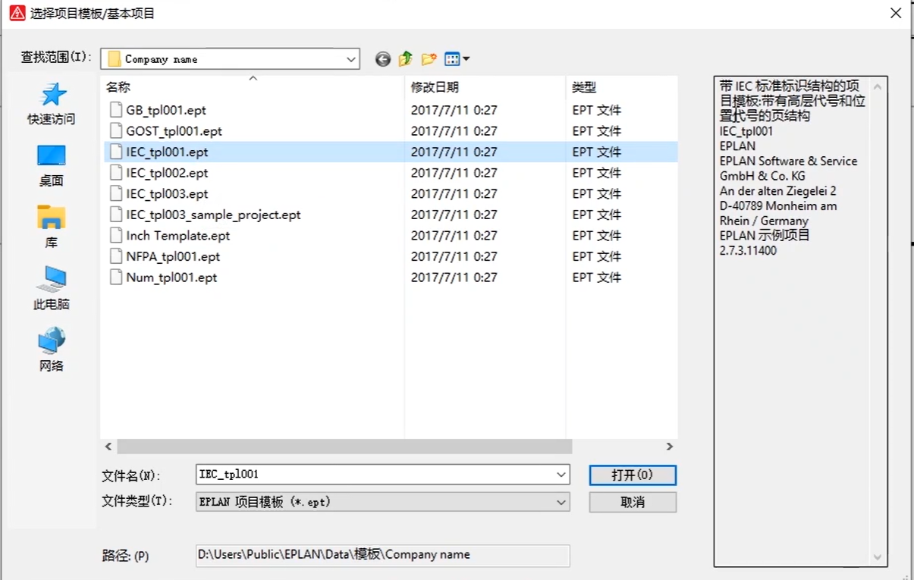

# 项目模板

- GB_tpl001.ept (图框表格，符号库)。国标内置中华人民共和国标准。GB
- GOST_tpl001.ept 模板 俄罗斯标准
- IEC_tpl001.ept  国际电工委员会
- Inch_tpl001.ept  日本工业委员会
- NFPA_tpl001.ept 美国消防协会
- Num_tpl001.ept IEC顺序编号

## 修改电缆颜色

使用连接定义点，修改其符号的编号名称为CDP

# 符号库，创建自己的符号

## 1.创建符号库

## 2.打开一个符号

如果打开符号时找不到符号库，可以先在工具-主数据-符号库中先选择一个符号库。

## 3.新建符号

选择自己的符号库

选择一个变量

确认符号属性

新建成功。

### 打开符号编辑器

在上边空白处右击，选择符号库即可

编辑我们自己的符号时可以对eplan原有的符号库进行改造。

### 新建变量

当我们的符号创建完成后，新建其他位置的变量时可以在符号编辑器中新建变量。

选择变量

选择源变量

### 添加连接点

新建完成后就可以关闭了

## 在打开符号时找不到其他符号集的解决办法

打开对应的符号库就行

## 4.使用自己的符号

符号选择中右键设置，

在一个新的行中选择符号库

找到自己的符号库

设置完成后就可以在选择符号时使用自己的符号了。

当自己的符号库中不存在任何符号时，我们自己的符号库选项不会在符号选择界面中显示出了。

# PLC盒子

一类特殊的点，当EPLAN中不存在我们需要的PLC符号时，可以使用其制作一个我们自己的PLC

案例

# 黑盒

同PLC盒子类似

# 部件导入

## 两种导入方式

### 1.直接导入edz文件

选择导入文件格式与将导入的edz文件就可以导入。此方法简便但是一次导入时间过长，导入文件太多。不推荐。

### 2.导入单个部件

选择好文件类型与文件名

导入完成后

再添加好图形宏与图片文件位置

## 元件关联部件

部件导入完成后要使用部件可以直接把部件与我们画图的元件关联起来

此时已关联完成，但是还是没有显示具体信息，可以添加

关联完成后就可以在图纸中显示

# 画安装板

# 制作图框

部分数据不能直接生成需要根据项目数据进行生成，此时就需要添加特殊文本

图框主要是通过功能文本和线条组成，比较简单

制作好行号与列号。

与页脚内容。

使用

将图框修改为我们自定义的图框就好。

## 添加自定义图表

主要是添加页头，数据区域与页脚三个部分。主要是数据区域，这个部分

使用属性占位符，生成实际图表是，会自动将占位符替换为项目中的对应数据。

生成的结果。

# 导入一个3d模型

eplan支持的3d文件格式为step

# 电气图纸设计的思路

## 面向对象的工作思维

1. 网络拓扑图（决定了拓扑方案，系统架构，通讯方案，成本）-在电气选型与拓扑方案设计时，应考虑机械设计的应用场景。
2. 核心器件选型；可以提交技术部审核设计方案，核准造价。
3. 结合网络拓扑图与选中的设备，进行电气原理图设计。
4. 安全和保护电路（系统的安全与可靠性）

## 原理图设计过程

1. 结合客户要求，确定核心部件（找到器件的技术文档）

2. 下载核心器件的部件，配置低压电器部件，端子部件

3. 设计主电路，主电路配电

4. 设计自动化控制电路，plc、变频器、hmi、伺服等元件电路。

5. 选择电柜（结合客户要求。例如，防爆等级，IP等级，使用环境），2d布局安装图

6. 端子图标生成
7. 规范文档、技术说明、图纸优化
8. 提交审核、入档、排产

