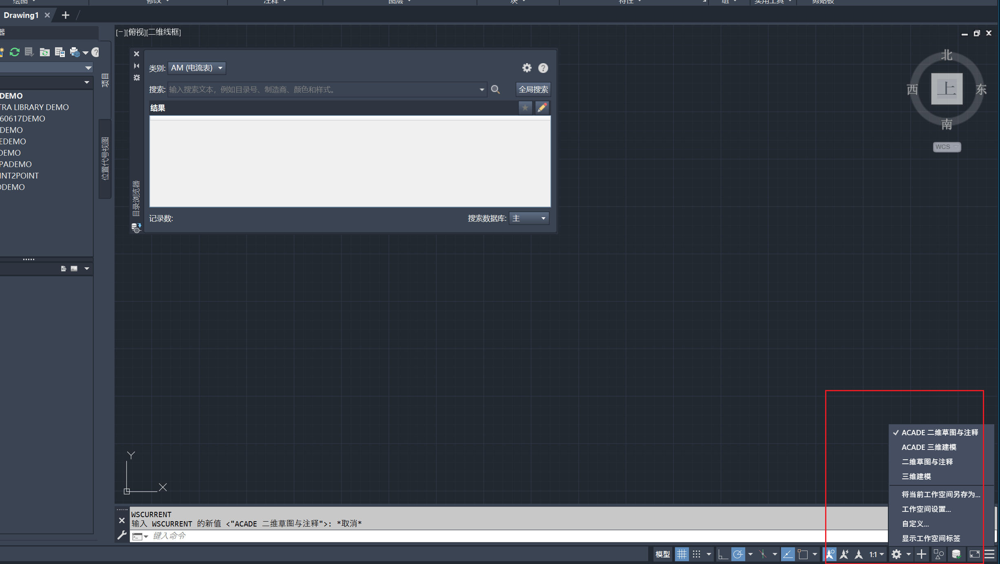
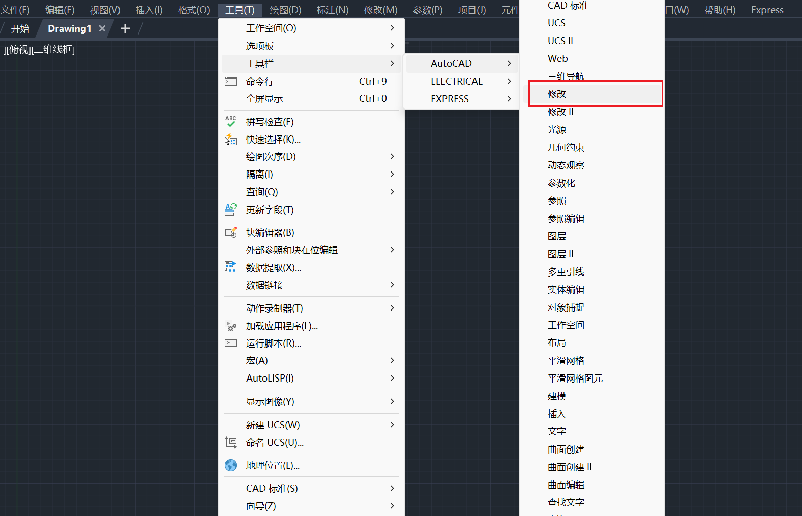
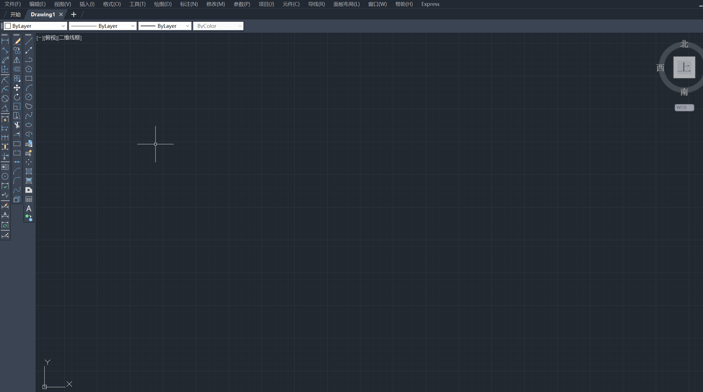
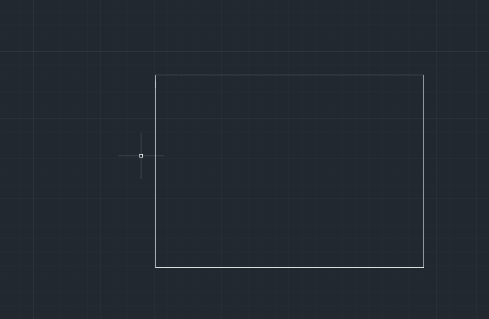
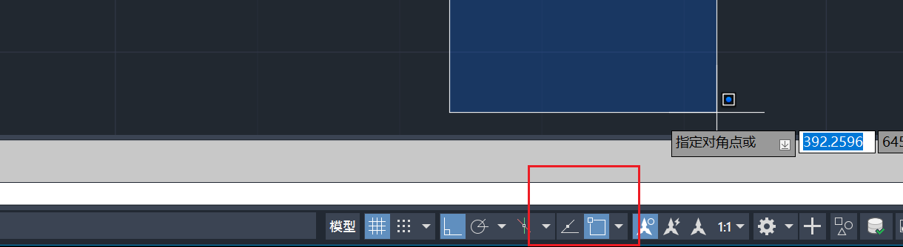
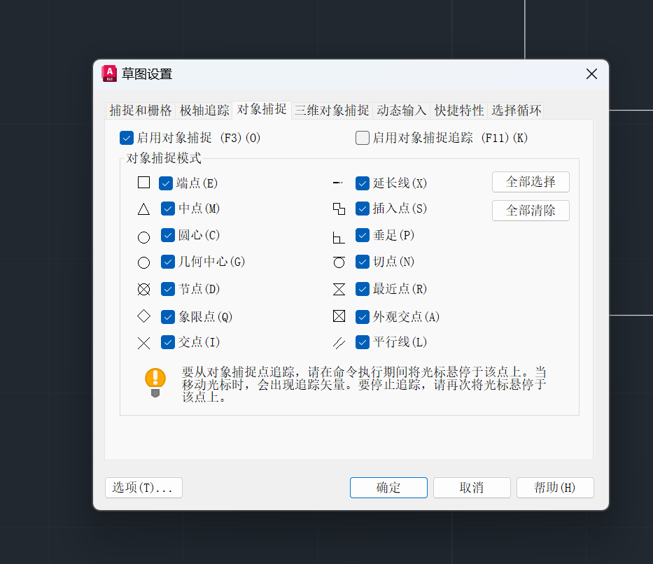
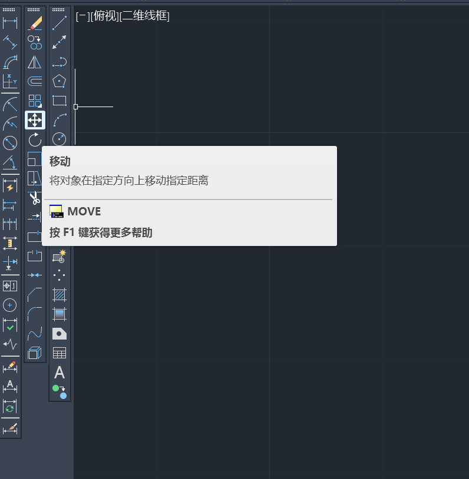
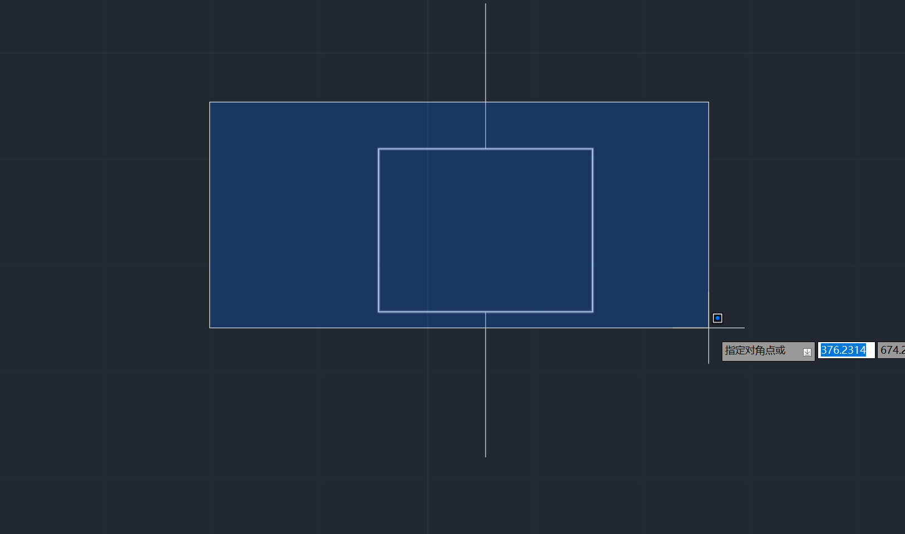
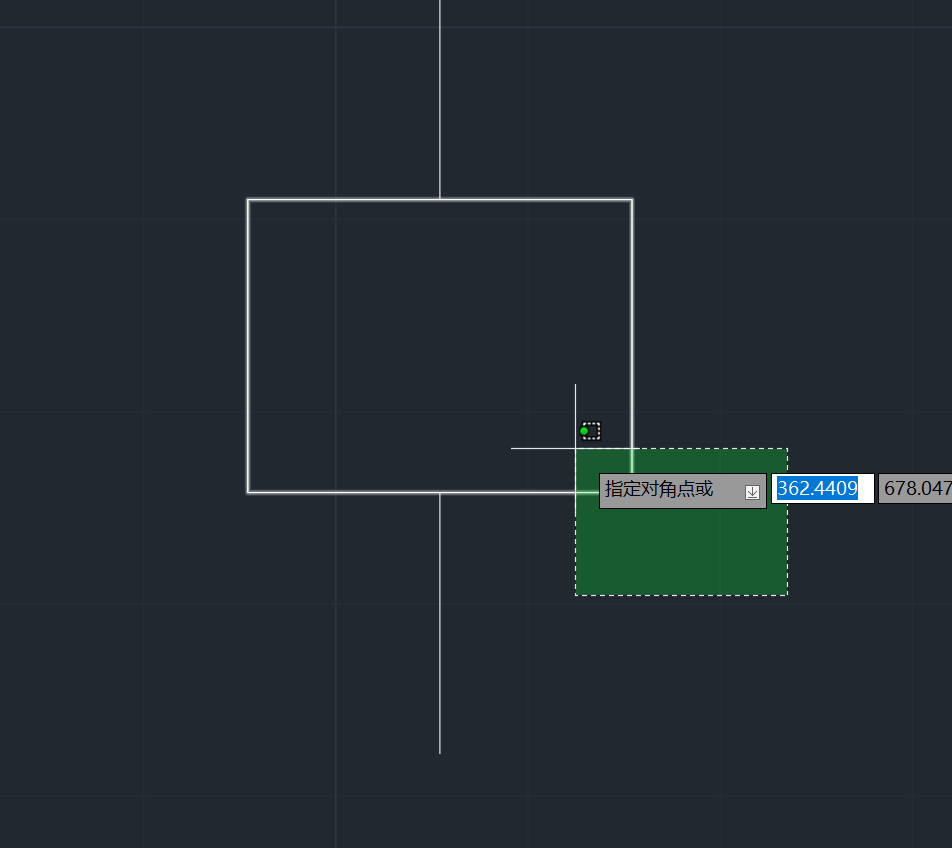

# 入门

窗口切换

在工具栏打开修改、标注和绘图和特性四个工具栏

完成后

## 画直线-正交模式

按住F8，进入正交模式，只能画横平竖直的线不能画斜线。

## 设置多个参数时

输入框体的多个参数使用，分开

## 对象捕捉

参数全选。

如果要移动物体时使用捕捉则需要使用

进行移动

## 选择框

蓝色时包含整个图像才会把图像选中，绿色框只要选中一部分就可以选中图像。

