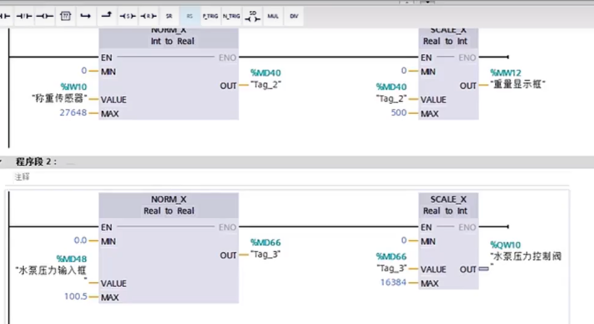

#  西门子plc中的一些概念

##  ps和pm的概念

ps系统电源--有背板总线

pm负载电源-无背板总线

###  ps系统电源

ps的给plc与plc的各个模块供电的

虽然西门子plc自带了一个12w的供电

但是如plc模块过多时，负责功率超过12w时，就无法供电了。所以此时引入了PS系统电源

西门子的工艺规定，电源模块一定在导轨的0号位置。

###  PM负载供电

PM为控制电路供电

##  内部存储卡

1200自身带存储功能。而1500必须携带一张西门子的sd存储卡。老款的存储卡不能插在win系统上会报废。新版的可以，出问题可以使用博图或者1500进行恢复。

##  DI、AI、DQ、AQ

- DI：数字量输入
- DQ：数字量输出
- AI：模拟量输入
- AQ：模拟量输出

###  DI

####  DI模块工作原理图

同电：正极与负极接在同一个电源上就是同电。

### DQ

关断：直接断电

保持上一个值。

输出替换为1.将信号替换为1；

最常用关断，为了保护设备。

保持在一些精密仪器中较常用。

诊断

 

 

####  DQ原理图

 

###  模拟量接线

###  AI、AQ数据标准化

 

#  1.数据类型

常用七种

- bool  1位
- int   16位
- real  16位
- word  16位
- char
- Dint  32位
- Dword 32位

##  bool  布尔类型

true，false。就是1和0

##  int 整形

1,2,3等整数类型

##  real  实数类型

就是浮点数类型

##  word （16位）代表一直含义

与之相似的有byte（8位），和bite（一个位）

在西门子PLC编程中，Word数据类型是一种用于存储16位二进制数值的数据类型，通常采用无符号表示方法，取值范围为0到65535。Word数据类型常用于存储模拟量信号、脉冲计数器和定时器的数值，以及进行位操作。

Word数据类型的特点
Word数据类型由相邻的两个字节（Byte）组成，形成一个16位的无符号数。这种数据类型在PLC编程中主要用于逻辑运算，因为它的取值范围是0到65535，这使得它在处理较大的数值时非常有用。

Word数据类型的应用
Word数据类型在西门子PLC中的应用非常广泛，它可以用于多种场景，例如：

- **模拟量信号处理**：Word数据类型可以存储传感器输出的模拟量信号值，通过相应的转换函数将其转换为工程单位，并进行进一步的控制和调节。

- **脉冲计数器**：PLC中的脉冲计数器通常使用Word数据类型来存储计数数值，可以实现对脉冲信号的计数和监控，在自动化系统中广泛应用于计量、计数、计时等场景。

- **定时器**：PLC中的定时器也常常使用Word数据类型来存储时间数值，通过对时间的计算和控制，实现各种定时任务的自动化执行。

注意事项
在使用Word数据类型时，需要注意以下几点：

- **数据范围**：由于Word数据类型的取值范围为0到65535，因此在实际应用过程中需要注意数值是否超出范围，以避免数据溢出或计算错误。

- **数据精度**：Word数据类型是一种离散的数值表示方式，其精度受限于存储位数。在涉及到高精度计算和控制的场景中，可能需要采用其他数据类型或算法来实现更准确的计算。

通过合理使用Word数据类型，可以实现对模拟量信号、脉冲计数器和定时器等各种数据的处理与控制，进而提升自动化系统的可靠性和稳定性。 

##  char 字符型

存储字符串的

##  单位

Dword  -》 word-》byte -》bite

32  -> 16 -> 8 ->１

2147483648 

IW2 == IB2 + Ib3

IB2 == I2.0-I2.7

#  2.触发器指令

##  SR触发器

> 可以使用“置位复位触发器”指令，根据输入 S 和 R1 的信号状态，置位或复位指定操作数的位。如果输入 S 的信号状态为“1”且输入 R1  的信号状态为“0”，则将指定的操作数置位为“1”。如果输入 S 的信号状态为“0”且输入 R1 的信号状态为“1”，则将指定的操作数复位为“0”。
>
> 输入 R1 的优先级高于输入 S。输入 S 和 R1 的信号状态都为“1”时，指定操作数的信号状态将复位为“0”。
>
> 如果两个输入 S 和 R1 的信号状态都为“0”，则不会执行该指令。因此操作数的信号状态保持不变。
>
> 操作数的当前信号状态被传送到输出 Q，并可在此进行查询。

有四种状态

- s为1，r为0时，q为1
- s为0，r为1时，q为0
- s为1，r为1时，q为0
- s为0，r为0时，q保持前一个动作

 

当s为1时q被触发，当r1为1时q为0.因为plc程序扫描是从上往下执行所以r1的优先级比s的高，故当s与r1都为1时q为0.而又因为tag_1会记录sr触发器执行结果，所以当s与r1都为0时，q将保持当前状态。

####  优点

稳定性比直接使用set与rst指令要高。

##  RS触发器

> 说明
>
> 可以使用“复位置位触发器”指令，根据输入 R 和 S1 的信号状态，复位或置位指定操作数的位。如果输入 R 的信号状态为“1”，且输入 S1  的信号状态为“0”，则指定的操作数将复位为“0”。如果输入 R 的信号状态为“0”且输入 S1 的信号状态为“1”，则将指定的操作数置位为“1”。
>
> 输入 S1 的优先级高于输入 R。当输入 R 和 S1 的信号状态均为“1”时，将指定操作数的信号状态置位为“1”。
>
> 如果两个输入 R 和 S1 的信号状态都为“0”，则不会执行该指令。因此操作数的信号状态保持不变。
>
> 操作数的当前信号状态被传送到输出 Q，并可在此进行查询。

与sr类似

 

#  3.边沿指令

 

#  4.计时器

##  加法器

 

- cu触发信号
- r：置位将累加和置为0
- PV：计数最大值，计算器计算的值等于pv位置的值后导通
- CV：当前计数

#  5.移位指令

>  仅当输入 IN 和输出 OUT1 中操作数的数组元素为同一数据类型时，才可以传送整个数组 (ARRAY)。
>
> 如果输入 IN 数据类型的位长度超出输出 OUT1 数据类型的位长度，则源值的高位会丢失。如果输入 IN 数据类型的位长度低于输出 OUT1  数据类型的位长度，则目标值的高位会被改写为 0。
>
> 在初始状态，指令框中包含 1 个输出 (OUT1)。可以扩展输出数目。在该指令框中，应按升序顺序排列所添加的输出。在执行指令过程中，将输入 IN  的操作数的内容传送到所有可用的输出。如果传送结构化数据类型（DTL、STRUCT、ARRAY）或字符串的字符，则无法扩展指令框。
>
> 还可以使用“块移动” (MOVE_BLK) 和“不可中断的存储区移动” (UMOVE_BLK) 指令移动 ARRAY  数据类型的操作数。可以使用“移动字符串”(S_MOVE) 指令复制 STRING 或 WSTRING 数据类型的操作数。

##  具体的使用

###  指令的工作原理

下表将通过具体的操作数值对该指令的工作原理进行说明：

| 参数 | 操作数       | 值                  |
| ---- | ------------ | ------------------- |
| IN   | TagIn_Value  | 0011 1111 1010 1111 |
| OUT1 | TagOut_Value | 0011 1111 1010 1111 |

如果操作数“TagIn”返回信号状态“1”，则执行该指令。该指令将操作数“TagIn_Value”的内容复制到操作数“TagOut_Value”，并将“TagOut”的信号状态置位为“1”。

#  6.数学计算

 

- CALCULATE 计算
- ADD 加
- SUB 减
- MUL 乘
- DIV 除法
- MOD  返回除法的余数
- NEG  求二进制补码
- INC 递增
- DEC 递减
- ABS 计算绝对值
- MIN 获取最小值
- MAX 获取最大值
- LIMIT 设置限值
- SQR  计算平方
- SQRT 计算平方根
- LN  计算自然对
- EXP  计算指数值
- SIN 计算正弦值
- COS 计算余弦值
- TAN 计算正切值
- ASIN 计算反正弦值
- ACOS 计算反余弦值
- ATAN 计算反正切值
- FRAC 返回小数
- EXPT 取幂

 

add与mul可以输入多个值。

##  calcullate 计算

#  7.比较指令

###  范围函数

#  8.中断（数字量中断，模拟量中断，硬件中断）

图文详细介绍西门子S7-1200硬件中断OB块

图文详细介绍西门子S7-1200硬件中断OB块(巨控何工_2018年10月7号）概述：感谢大家的支持，免费领取西门子博途编程软件，技术资料，还可以加入技术交流群。

图2.图2.创建硬件中断OB402、OB40中编程如下图，当硬件输入I0.0上升沿时，触发硬件中断执行MW200加1。如图3。

图3图3.OB40中编程3、OB41中编程如下图，当硬件输入I0.1上升沿时，触发硬件中断执行MW200减1。如图4。

图4图4.OB41中编程4、在CPU属性窗口中关联硬件中断事件，如下图所示，分别将I0.0和OB40关联，I0.1和OB41关联。如图5、6。

图5图5.I0.0和OB40关联

图6图6.I0.1和OB41关联5、测试结果：程序下载后，在监控表中查看MW200的数据。当I0.0接通，触发中断OB40，MW200的数值累加1。结果如图7。图7图7.I0.0硬件中断结果当I0.1接通，触发中断OB41，MW200的数值递减1。结果如图8。

图9图9."ATTACH"指令如果"ATTACH"附加指令的引脚"ADD"为FALSE，EVENT中的事件将替换OB40中的原有事件。

- 发表于: 2018-10-19
- 原文链接：https://kuaibao.qq.com/s/20181019A23TII00?refer=cp_1026
- 腾讯「腾讯云开发者社区」是腾讯内容开放平台帐号（企鹅号）传播渠道之一，根据[《腾讯内容开放平台服务协议》](https://om.qq.com/notice/a/20160429/047194.htm)转载发布内容。
- 如有侵权，请联系 cloudcommunity@tencent.com 删除。

#  9.Graph编程

顺序功能图

#  10.报警

报警的分类；

- 自定义报警
  - 1.离散量报警（数字量报警、IO报警）
  - 模拟量报警（温度、湿度、压力等）
- 系统报警
  - hmi触发的报警
  - plc触发的报警

##  自定义报警

- 错误（手动确认、消除错误、确认错误），已确认/已激活。到达/离开
- 诊断事件，
- 警告。

添加一个HMI报警

 

###  MW10的寄存器位置

MB10.7-MB10.0是高八位

MB11.7-MB11.0是低八位

| 15   | 14   | 13   | 12   | 11   | 10   | 9    | 8    |
| ---- | ---- | ---- | ---- | ---- | ---- | ---- | ---- |
| 10.7 | 10.6 | 10.5 | 10.4 | 10.3 | 10.2 | 10.1 | 10.0 |
| 7    | 6    | 5    | 4    | 3    | 2    | 1    | 0    |
| 11.7 | 11.6 | 11.5 | 11.4 | 11.3 | 11.2 | 11.1 | 11.0 |

设置报警时

因为触发变量必须设置为一个16位的数据，所以一般把触发位设置为8这样就会方便使用因为第8为就是10.0

###  HMI显示报警列表

#  11.通信

s7通信get的FB块的设置。

建立连接

 

#  12.自动化项目开发流程

1. 研读任务书，明确工作要求。

2. 确定IO点数，确定要用到的设备

   

3. 设计接线图纸（主电路、控制电路）

4. 按图施工，安全文明生产：

5. 上电测试，1O打点（强制表打点），核对1O地址，测试模拟量输入输出点是否正常，测试G120单元是否正常。

6. 填写施工报告单

7. 编写控制变量表

8. 编写程序

9. 设备上电联机调试

10. 书写产品说明书及验收报告单。

##  实例项目

酸洗项目

### 分析

 

图纸

 

控制回路

 

 

​	  	
