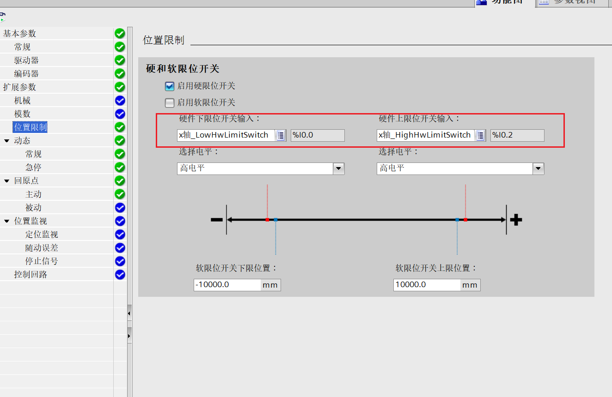
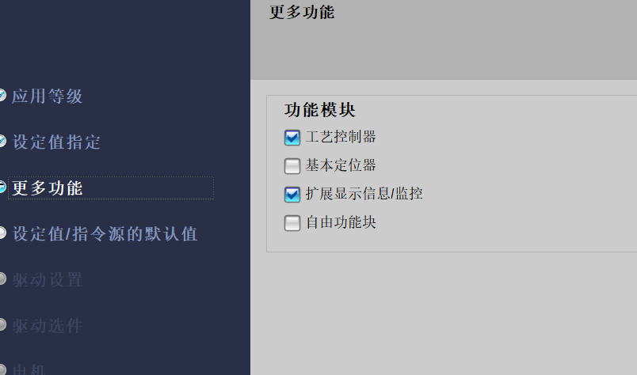
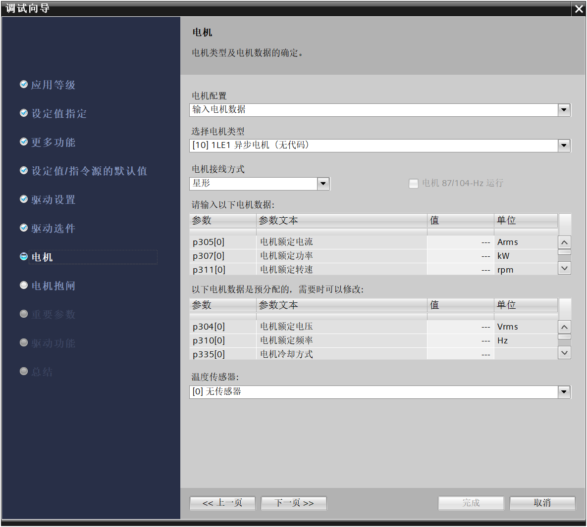

# 1.V90控制

**当PLC显示组态错误，灯一直闪烁时。可以使用对设备进行初始化。重新配置组态**

## 物理接线

##  硬件设置

### 报文配置

### 网络配置

设置站名和ip。设置完成后保存并激活。然后保存参数并

保存参数

##  TIA里组态

在软件组态完成需要添加伺服驱动的标准报文。一般自定义功能块时使用使用**报文3**，使用西门子提供的功能块时使用**报文111**

### 自定义功能块与使用西门子默认功能块区别

1.自己写FB功能块

使用报文3

使用在复杂的项目

速度环、位置环、电流环（力矩模式）

组态工艺对象（1200-8工艺轴）

2.使用西门子的标准FB功能块

使用报文111

适用于功能简单的项目

速度环、位置环、电流环（力矩模式）

组态工艺对象（1200-16工艺轴）

## 参数设定

先添加伺服的轴对象

### 常规设置

设定好轴的驱动器与测量单位

其中驱动器的

- PTO：该模式是通过将PLC的高速输出连接到伺服，使用发送脉冲的方式驱动电机
- PROFIdrive：plc通过profileNet连接到伺服，通过网络来发送命令驱动电机

#### pto模式需要设置的参数

驱动器设置

#### PROFIdrive参数

### 驱动器参数设定

主要需要设置好驱动器

此处是我们开始设置的伺服的报文。下面的数据交换在设置完驱动器后，会自动配置。

### 编码器

编码器需要设定好编码器的连接（确定编码器的位置），与编码器的参数

编码器的参数和驱动器一样是之前设置的标准报文3

### 位置限制

硬限位设置好左右限位开关在plc上的输入地址。

软限位需要手动测量轴在左右限位开关间的距离后再设定。

### 动态

这个主要调整单位保持一致。其他参数若无特殊要求，保持默认设置不变。

速度可以设置最大速度，在此次设置好最大速度后，如果使用系统运动控制FB块JOG或定位时速度大于最大值，FB就会报错。一般调试使用100就行。

加减速：即伺服从0到最大速度需要的时间，一般推荐设定为0.2s

急停时间需要设置0.01s。在出故障时急速停下，防止事故加重。

### 回原点

原点设置，需要设置好归位模式，一般使用第三种，归为开关模式。

inupt，设置好原点的限位开关。

接近速度。

回原点会多次巡航，为的是使原点位置更加精确。减小误差。

## 注意

**需设置好速度与加减速度。当速度大于加减速度时。滑块会超过物理限位开关。导致轴发生错误。**

# 2.常用的指令(伺服与步进可以使用同一套控制指令)

这些命令都是以设置好的工艺轴为基础。

## mc_power使能 

启用/禁用轴的指令。运控里最重要的指令，只有这个命令给轴使能之后才能进行后续的操作。

## MC_Reset复位

发生故障时复位。

## MC_Home回原点

注意选择回原点的模式.一般可以默认选择3主动回原。

> 使用“MC_Home”运动控制指令可将轴坐标与实际物理驱动器位置匹配。轴的绝对定位需要回原点。可执行以下类型的回原点： 
>
> - 主动回原点（Mode = 3）
>
>   自动执行回原点步骤。
>
> - 被动回原点（Mode = 2）
>
>   被动回原点期间，运动控制指令“MC_Home”不会执行任何回原点运动。用户需通过其它运动控制指令，执行这一步骤中所需的行进移动。检测到回原点开关时，轴即回原点。
>
> - 直接绝对回原点（Mode = 0）
>
>   将当前的轴位置设置为参数“Position”的值。
>
> - 直接相对回原点（Mode = 1）
>
>   将当前轴位置的偏移值设置为参数“Position”的值。
>
> - 绝对编码器相对调节 (Mode = 6)
>
>   将当前轴位置的偏移值设置为参数“Position”的值。
>
> - 绝对编码器绝对调节 (Mode = 7)
>
>   将当前的轴位置设置为参数“Position”的值。
>
> Mode 6 和 7 仅用于带模拟驱动接口的驱动器和 PROFIdrive 驱动器。
>
> 要求
>
> - 定位轴工艺对象已正确组态。
> - 轴已启用。（PROFIdrive 驱动装置 / 模拟量驱动装置连接 Mode = 0 或 1 时无效）
> - 以 Mode = 0、1 或 2 启动时不会任何激活 MC_CommandTable 命令。

## MC_MoveAbsolute 绝对定位

需要设置好目标位置、和移动速度。

## MC_ReadParam 读取轴参数

注意：需要先设置好读取参数的类型。

## MC_MoveJog Jog点动移动

设置好正反转的命令及运动的速度。

# 3.步进驱动器设置

## 添加运动控制轴

## 参数设置

### 常规

选择PTO模式

### 驱动控制

配置脉冲与方向控制轴

### 机械

配置步进的脉冲细分。与电机转动一圈负载移动的距离。方便后续位置数据与脉冲数据之间的转换。

### 位置限制

配置左右限位信号。注意如果是PNP的传感器，则plc的m1接负极此时选择低电平。如果是NPN型的传感器，则输入的M1接正极，此时选择高电平有效。

### 动态-常规

注意速度单位，这个在JOG模式与绝对相对运动时回倍使用。可以设置加速与减速时间。
### 动态-急停

设置急停减速时间

### 回原点

设置好原点输入信号。电平选择同限位设置。还要设置好回原速度。

# 4变频器

## 组态

只要根据实际变频器组好态，设定好各类参数，就可以启动变频器，如果变频器有报警在没有面板的情况下可以使用

应答故障，以消除故障使变频器继续运行。

### 添加变频器及驱动

## 参数设置

### 应用等级

是控制不同等级的变频器应用场景

### 设定值指定

决定斜坡功能是在plc还是变频器中指定。
### 更多功能

指定变频器的定位（指指示基本控制还是带工艺的控制）

### 指令源

指定G20的IO配置（默认配置，通过此次的指定就可以省略在变频器手动指定的步骤）

#### 报文配置

porfinet通信选择标准报文1时

QW256：状态寄存器（启动，停止，复位）

​	正转命令：16#047F

​	反转命令：16#0C7F

​	复位命令：16#04FE

​	停止命令：16#047E

QW258：速度通道值（0-16384）

### 驱动的设置

配置驱动的电源频率和电压

### 驱动选件

驱动器的其他配件，没有可以不写

### 电机

配置电机的各个参数。

### 电机抱闸

看电机是否带抱闸装置

### 重要参数

### 驱动功能

## 重要

**变频器使用命令时要先复位才能启动**

配置自动重启，可以对变频器的报警进行自动应答.

## 快速设置G120参数的办法

可以通过网络直接访问在线的G120变频器，进行配置，再将配置好的在线数据上传到项目中。

