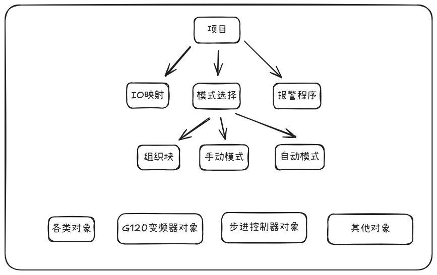

# 项目介绍

组织一个项目的具体步骤：

**变量多重映射是为解决一个寄存器被多次调用的情况。**

# 伺服

# 变频器

第一次激活块时给一个复位命令

# RTU通信

# 模拟量

##  输入

### 滤波设置

# IO冲突双线圈

多重映射，一个输出给一个程序

# 注意

复位比置位优先级搞

# 报警

消除报警

# 暂停

如何暂停

暂停时要锁哪些对象

要释放哪些资源

要保存哪些资源以便暂停结束后使程序按照暂停前状态继续运行
